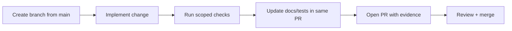
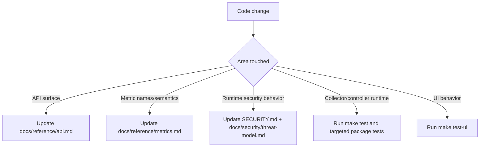

# Contributing to AI SRE Agent (v0.4)

## Contribution Flow


## Change Impact Routing


## Branch Naming
- `feat/<topic>` for new behavior.
- `fix/<topic>` for bug fixes.
- `docs/<topic>` for documentation-only changes.
- `chore/<topic>` for maintenance/build changes.

## Repository Areas
| Path | Purpose |
|---|---|
| `backend/cmd/collector` | `sre-collector` entrypoint |
| `backend/cmd/controller` | `sre-controller` entrypoint |
| `backend/internal/collector` | collector runtime, transport, spool integration |
| `backend/internal/collector/probe` | host/process/log/GPU/eBPF collection |
| `backend/internal/controller` | ingest, APIs, diagnostics, orchestration modules |
| `backend/internal/pkg/security` | runtime security audit checks |
| `frontend/` | dashboard source (Vite/React) |
| `docs/` | design, operations, reference, security docs |
| `tests/` | integration/e2e/python/ui test trees |

## Required Checks Before PR
Run only the layers you changed.

```bash
# Go runtime and tests
make fmt-check
make vet
make test

# Full stability suite (slower)
make test-stability

# UI tests (requires Node)
make test-ui

# Security checks
make security-audit
```

## Code Standards
- Pass `context.Context` through call chains.
- Return wrapped errors (`fmt.Errorf("...: %w", err)`).
- Keep hot-path allocations bounded in collector/ingest/log index code.
- Add table-driven tests for branch-heavy logic.
- Keep module boundaries explicit: ingest hot path must remain independent from optional analysis/agent paths.

## Documentation Rules
- Keep docs aligned with implemented behavior in the same PR.
- For API changes, update `docs/reference/api.md`.
- For metric schema changes, update `docs/reference/metrics.md`.
- For runtime security behavior changes, update `SECURITY.md` and `docs/security/threat-model.md`.

## AGENT and Action Safety Changes
When changing `agent` or `agentcore` paths:
- preserve action idempotency behavior;
- preserve approval-token checks for execute paths;
- keep `SRE_AGENT_DRY_RUN=1` as the default in examples and tests.

## License
By contributing, you agree contributions are released under `GPL-3.0`.
