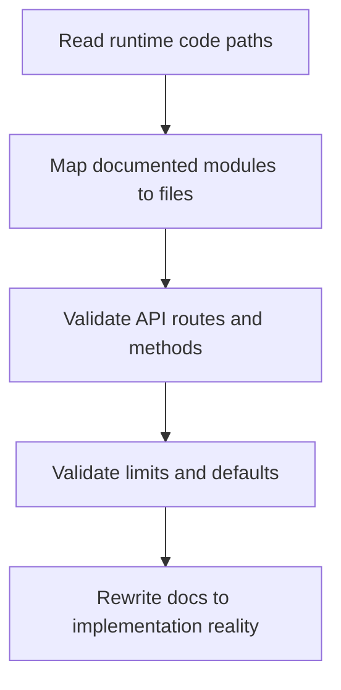
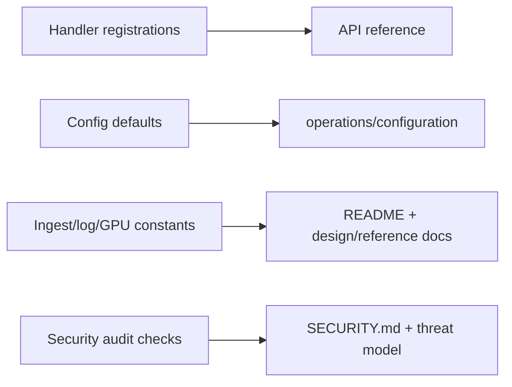

# Documentation and Runtime Alignment Audit (v0.4)

## Scope
Audited sources:
- runtime entrypoints: `backend/cmd/{collector,controller}`
- collector pipeline: `backend/internal/collector/*`
- ingest/log/GPU/controller modules: `backend/internal/controller/*`
- security audit module: `backend/internal/pkg/security/runtime_audit.go`
- deployment scripts/configs: `configs/*`, `scripts/*`, `deploy/k8s/push-first/*`

## Validation Summary

## Runtime Evidence Mapping

## Findings Resolved in Current Docs
- Removed bilingual content outside `README.md`.
- Removed speculative/future-language claims from module docs.
- Aligned API docs with handlers registered by `controller.registerHandlers`.
- Aligned log pipeline docs with `logindex` implementation defaults and limits.
- Aligned GPU docs with layered collector sampling and `gpuobs.Store` persistence behavior.
- Aligned security docs with `security-audit` CLI and implemented runtime checks.

## Remaining Intentional Gaps
- External long-term TSDB/log backend integrations are not part of shipped v0.4 runtime.
- Security checks are policy/config based and do not replace penetration testing.

## Source of Truth Order
1. runtime code in `backend/internal/*`
2. configs and scripts in `configs/` and `scripts/`
3. docs in `README.md` and `docs/*`
