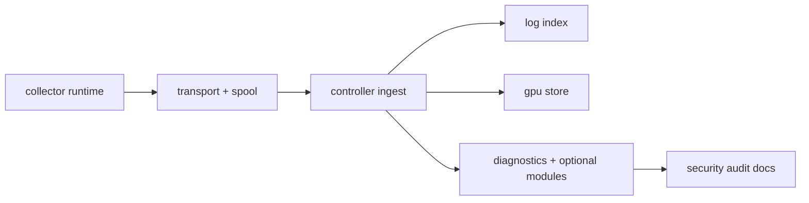
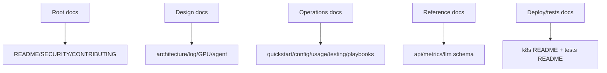

# Iteration Progress (v0.4)

## Completed Work
- Standardized Markdown documentation structure across root/docs/tests/deploy trees.
- Rewrote `README.md` into strict bilingual format:
  - Chinese detailed section first
  - English complete section second
- Added implementation-backed Mermaid diagrams for architecture, data flow, probe-controller interaction, and log indexing.
- Normalized technical terminology to runtime code naming (collector, controller, ingest, logindex, gpuobs, agentcore).

## Implementation Areas Covered

## Documentation Coverage Map

## Documentation Outputs Updated
- Root docs: contribution, security, status, audit, progress files.
- Design docs: architecture, GPU, agent runtime, log subsystem.
- Operations docs: quickstart, config, usage, testing, RCA and RDMA playbooks.
- Reference docs: API, metrics, LLM schema.
- Deployment docs: Kubernetes push-first manifests guide.
- Test docs: suite and UI test guidance.

## Verification Actions
- Checked handler registration paths for API accuracy.
- Checked config defaults from `DefaultConfig` implementations.
- Checked ingest/log/GPU hard limits from source constants.
