# AI SRE Agent v0.4

Release: `v0.4`  
License: `GPL` (`GPL-3.0`)

## 中文（详细）

### 1. 系统边界与运行模型
`AI SRE Agent` 是一个 `Push-first` Linux observability system，由两个核心进程组成：

- `sre-collector`：运行在被观测节点，采集 host/process/log/GPU telemetry，构建 `TelemetryBatch`，先写本地 `spool`，再通过 gRPC push 到 controller。
- `sre-controller`：运行在控制面，接收 gRPC ingest，执行 batch validation，更新 in-memory state，写入 native log index 与 GPU store，并通过 `/api/v1/*`、`/metrics`、`/ui` 对外提供数据。

该系统在 `v0.4` 的实现重点是：

- ingest hot path 与 analysis/agent path 解耦；
- log pipeline 内置（ELK-like behavior，但不依赖 external ES/Loki）；
- GPU telemetry 分层采样并持久化；
- runtime security audit 以 CLI 形式落地（`make security-audit`）。

### 2. 系统架构图
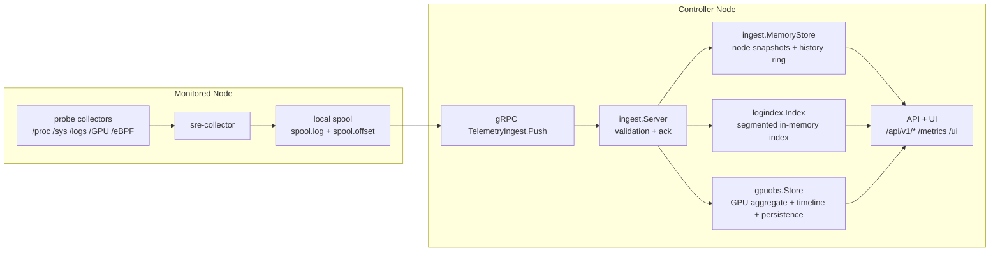

### 3. 模块与代码路径
| 模块 | 代码路径 | 已实现职责 |
|---|---|---|
| Collector runtime | `backend/internal/collector` | collect + batch + spool + transport + adaptive polling |
| Probe layer | `backend/internal/collector/probe` | Linux metrics, process sampling, log fingerprints, optional eBPF, GPU sampling |
| Transport | `backend/internal/collector/transport` | multi-endpoint failover/mirror, ACK-required delivery, optional TLS/mTLS |
| Spool | `backend/internal/collector/spool` | durable queue via `spool.log` + `spool.offset` |
| Ingest server | `backend/internal/controller/ingest/server.go` | gRPC stream handling, payload validation, ACK |
| Ingest store | `backend/internal/controller/ingest/store.go` | fleet snapshot, process/log aggregation, metric history ring |
| Log index | `backend/internal/controller/logindex` | segmented in-memory indexing, search/filter/timeline/correlation |
| GPU store | `backend/internal/controller/gpuobs` | GPU device/process/event aggregation + persistence |
| Analysis | `backend/internal/controller/analysis` | threshold/anomaly/correlation engine + optional LLM client |
| Agent | `backend/internal/controller/agent` + `agentcore` | report generation, query/execute API, action governance |
| Security audit | `backend/cmd/security-audit` + `backend/internal/pkg/security` | runtime posture checks + markdown/json report |

#### 3.1 技术栈（与代码一致）
| 层 | 采用技术 | 代码位置与版本 | 选择原因 | 现实代价 |
|---|---|---|---|---|
| Backend runtime | Go | `backend/go.mod`，`go 1.25.0` | 单二进制部署简单；并发与内存模型适合 collector/controller 常驻服务 | memory-first 设计需要主动做 retention 与容量上限 |
| RPC contract | gRPC + Protobuf | `google.golang.org/grpc v1.64.0`，`google.golang.org/protobuf v1.36.11`，`pkg/telemetry/v1` | 流式 Push 与 schema 演进稳定 | 调试门槛高于纯 HTTP JSON |
| Metrics export | Prometheus client | `github.com/prometheus/client_golang v1.23.2` | 与现有监控体系直接兼容 | 高基数标签需要在 collector/controller 两侧限流 |
| Config + CLI | Viper + Cobra | `v1.19.0` + `v1.10.2` | 配置装载、环境变量覆盖、命令行入口一致 | 配置项增多后需严格维护默认值与文档同步 |
| Logging | Zap | `go.uber.org/zap v1.27.0` | 高吞吐结构化日志，适合 ingest 热路径 | 需要在调试时补充上下文字段，避免信息过 sparse |
| Kubernetes module | client-go + apimachinery | `k8s.io/client-go v0.35.0` | read-only inventory/topology 能直接接入集群对象模型 | 版本升级需要跟随 Kubernetes API 变化 |
| Frontend runtime | React + TypeScript + Vite | `react 18.2`、`typescript 5`、`vite 4.3` | 构建快，组件化成本低，适合单页面监控 UI | 组件状态多时需要治理请求去重和状态来源 |
| Frontend data/vis | React Query + Recharts + Zustand + Framer Motion | `@tanstack/react-query 4.29.5`，`recharts 2.6.2`，`zustand 4.3.8`，`framer-motion 10.12.16` | API 轮询、图表渲染、页面交互职责清晰 | 时间序列密度高时需要控制重渲染频率 |

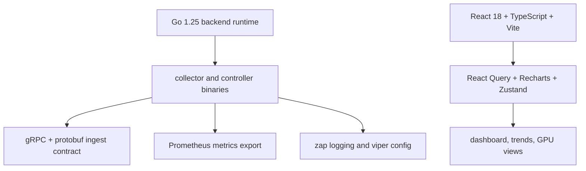

#### 3.2 可观测域覆盖矩阵（你当前实际能看到什么）
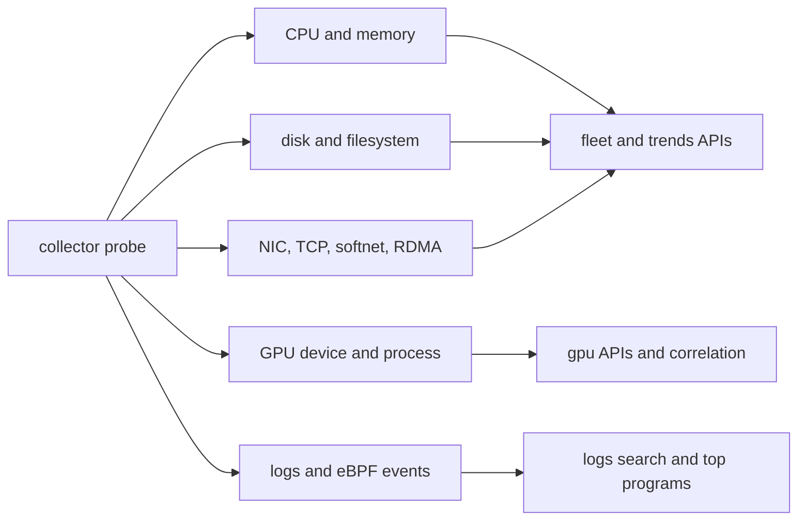

| 观测域 | 已实现信号（示例） | 观测粒度 | 查询入口 | 前置条件与限制 |
|---|---|---|---|---|
| CPU | `node_cpu_usage_percent`、`node_cpu_iowait_percent`、`node_cpu_seconds_total`、`node_load1`、`node_procs_running` | node + process | `/api/v1/fleet`、`/api/v1/fleet/timeseries?metric=cpu_usage_percent`、`/api/v1/top/programs` | process 粒度依赖 Top-N 与批次窗口，超长历史不保留 |
| Memory | `node_memory_MemTotal_bytes`、`node_memory_Used_bytes`、`node_memory_MemAvailable_bytes`、swap/slab/dirty/writeback | node + process | `/api/v1/fleet`、`/api/v1/fleet/timeseries?metric=memory_used_percent`、`/api/v1/top/programs` | 内存趋势是 ring-buffer，非外部 TSDB 长期归档 |
| Disk / NVMe | `node_disk_total_iops_per_second`、`node_disk_utilization_peak_percent`、`node_disk_request_latency_p99_seconds`、`node_nvme_total_iops_per_second` | node + disk-device + process | `/api/v1/fleet`、`/api/v1/fleet/timeseries?metric=disk_total_iops_per_second`、`/api/v1/diagnostics/*`、`/api/v1/top/programs` | 高基数设备指标会受 payload/内存上限约束 |
| NIC / TCP / softnet | `node_network_total_receive_bytes_per_second`、`node_network_utilization_peak_percent`、`node_tcp_retransmit_ratio`、`node_softnet_dropped_per_second`、`node_network_interface_tx_queue_fill_percent` | node + netdev + process | `/api/v1/fleet`、`/api/v1/fleet/timeseries?metric=network_rx_bytes_per_second`、`/api/v1/diagnostics/*`、`/api/v1/top/programs` | 网络容量利用率依赖接口速率探测；虚拟网卡场景可能不完整 |
| RDMA | `node_rdma_port_transmit_bytes_per_second`、`node_rdma_port_errors_per_second`、`node_rdma_port_congestion_events_per_second`、`node_rdma_port_utilization_percent` | node + RDMA HCA/port | `/api/v1/fleet`、`/api/v1/diagnostics/data-path`、`/api/v1/diagnostics/kernel-path` | 无 RDMA 设备时此域为空，不做 synthetic 指标补全 |
| GPU（device） | `node_gpu_utilization_sm_percent`、`node_gpu_memory_used_mib`、`node_gpu_temperature_celsius`、`node_gpu_power_draw_watts`、`node_gpu_pcie_link_utilization_percent` | node + gpu_id | `/api/v1/gpu/nodes`、`/api/v1/gpu/timeline`、`/api/v1/fleet/timeseries?metric=gpu_utilization_percent` | 依赖 `nvidia-smi`；可被 `SRE_COLLECTOR_GPU_DISABLED=1` 显式关闭 |
| GPU（process/event） | `node_gpu_process_sm_util_percent`、`node_gpu_process_memory_mib`、`node_gpu_xid_errors_total`、`node_gpu_uvm_faults_total`、`node_gpu_reset_events_total` | node + gpu_id + pid + event | `/api/v1/gpu/processes`、`/api/v1/gpu/process-timeline`、`/api/v1/gpu/events`、`/api/v1/gpu/correlation` | process timeline 与 events 为 ring + retention，历史深度有限 |
| Logs | collector `TelemetryBatch.logs` + service `POST /api/v1/logs/ingest` | collector + service + level + timeline | `/api/v1/logs/status`、`/api/v1/logs/search`、`/api/v1/top/programs` | 默认 retention `6h`，复杂全文语法能力弱于外部 ES/Loki |
| eBPF（可选） | `node_ebpf_events_total`、`node_ebpf_events_rate`、`node_ebpf_gpu_events_total`、`node_ebpf_process_events_total` | category + gpu_index + pid | `/api/v1/fleet`、`/api/v1/top/programs` | 默认不启用；需 eBPF collector 配置与内核支持 |
| Collector runtime | `collector_spool_backlog_bytes`、`collector_transport_ack_ms`、`collector_transport_errors_total`、`collector_probe_source` | collector | `/api/v1/ingest/status`、`/api/v1/fleet`、`/metrics` | 用于观测采集链路健康，不代表业务负载本身 |

### 4. 数据流（metrics / logs / GPU telemetry）
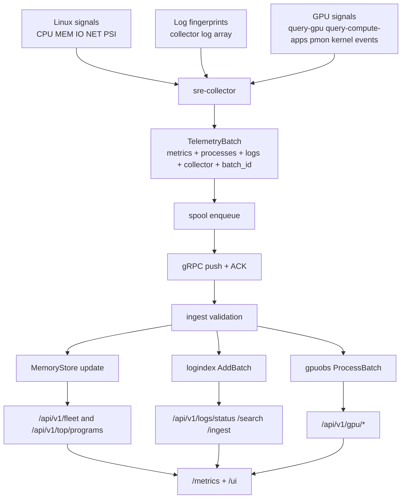

### 5. Probe 到 Controller 交互（ACK 语义）
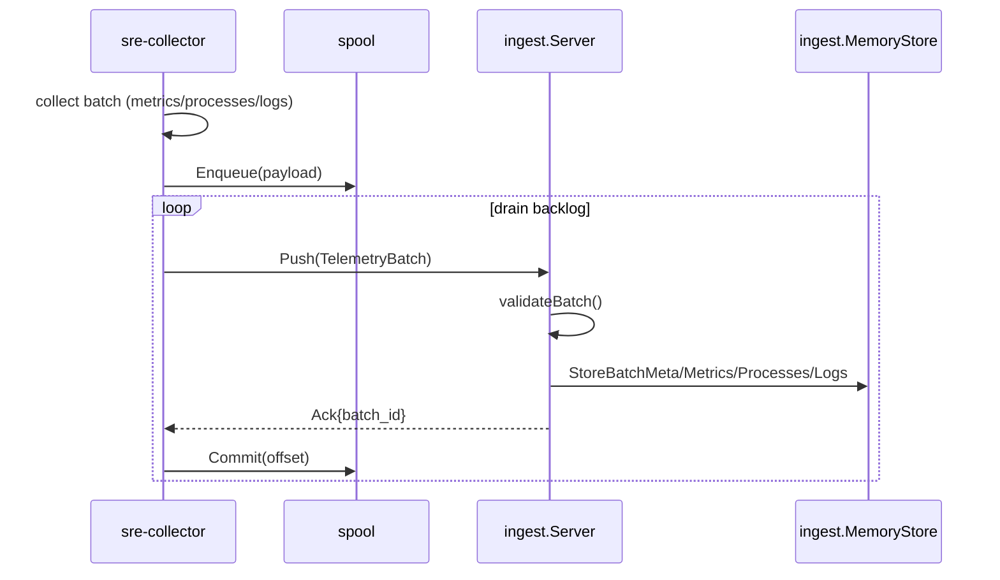

### 6. 日志摄取与索引流水线（internal ELK-like implementation）
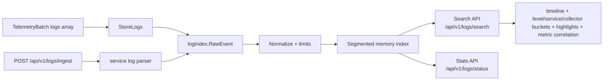

### 7. GPU telemetry layer（实现细节）
#### 7.1 Collector 采样调度与命令矩阵
Collector GPU 路径位于 `backend/internal/collector/probe/collector_gpu.go`，每个采样周期按以下调度执行：

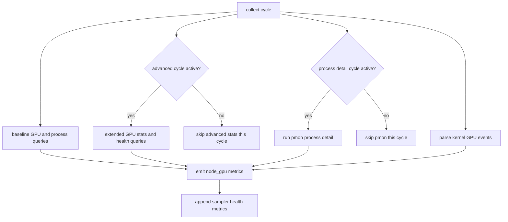

采样控制参数（环境变量）：
- `SRE_COLLECTOR_GPU_DISABLED`：`1` 时完全禁用 GPU collector。
- `SRE_COLLECTOR_GPU_ADVANCED_INTERVAL_SAMPLES`：advanced 采样间隔，默认 `3`。
- `SRE_COLLECTOR_GPU_PROCESS_DETAIL_INTERVAL_SAMPLES`：process detail 采样间隔，默认 `2`。
- `SRE_COLLECTOR_GPU_QUERY_TIMEOUT_MS`：`nvidia-smi` 命令超时，默认 `1500ms`。

命令与 fallback 策略：
| 采样阶段 | 主要命令 | fallback | 结果指标 |
|---|---|---|---|
| GPU inventory | `--query-gpu=index,uuid,name,driver_version,persistence_mode` | 无 | `node_gpu_info`、`node_gpu_persistence_mode`、`node_gpu_count` |
| GPU stats | full `--query-gpu` 字段集合（util/memory/temp/power/clock/pcie） | 字段不兼容时切换最小字段查询 | `node_gpu_utilization_*`、`node_gpu_memory_*`、`node_gpu_pcie_*`、`node_gpu_power_*` |
| GPU health | `ecc`、`throttle`、`mig`、`reset_status` 相关字段 | 单批失败不终止采集窗口 | `node_gpu_ecc_*`、`node_gpu_throttle_*`、`node_gpu_mig_*`、`node_gpu_reset_*` |
| Process attribution | `--query-compute-apps` 扩展字段 | 降级到最小字段 (`pid` + `used_memory`) | `node_gpu_process_*`、`node_gpu_process_count`、`node_gpu_context_count` |
| Process detail | `nvidia-smi pmon -c 1 -s um` | 失败时保留 compute-apps 结果 | `node_gpu_process_{sm,mem,encoder,decoder}_util_percent` |
| Runtime events | kernel log parse (`syslog/messages/kern.log`) | 无匹配时仅保留当前 counters | `node_gpu_event_total`、`node_gpu_xid_errors_total`、`node_gpu_uvm_faults_total` |

#### 7.2 GPU 指标模型（device + process + summary）
Collector 输出三类指标：
- 设备级：SM/MEM/ENC/DEC/JPEG/OFA utilization、功耗、温度、PCIe/NVLink、ECC、MIG、reset 状态。
- 进程级：`pid + process + context_type` 维度下的显存与利用率。
- 汇总级：`node_gpu_utilization_sm_avg_percent`、`node_gpu_memory_used_total_mib`、`node_gpu_power_draw_percent`、`node_gpu_kernel_hotspot_peak_sm_util_percent` 等跨设备汇总指标。

Sampler 可观测性指标：
- `node_gpu_sampler_advanced_cycle_active`
- `node_gpu_sampler_process_detail_cycle_active`
- `node_gpu_sampler_query_duration_ms{query=...}`
- `node_gpu_sampler_query_errors_total{query=...}`
- `node_gpu_sampler_query_timeouts_total{query=...}`

#### 7.3 Controller 聚合、事件归一化与持久化
Controller 侧 `gpuobs.Store`（`backend/internal/controller/gpuobs/store.go`）在 ingest 时执行：

- 以 `collector_id -> gpu_id -> pid` 建立层级状态；
- device timeline ring（默认 `720` 点）与 process timeline ring（默认 `360` 点）；
- event ring（每 node 默认 `1024`）并按 counter delta 生成事件；
- `30m` 未更新进程自动剔除（降低高基数积累）。

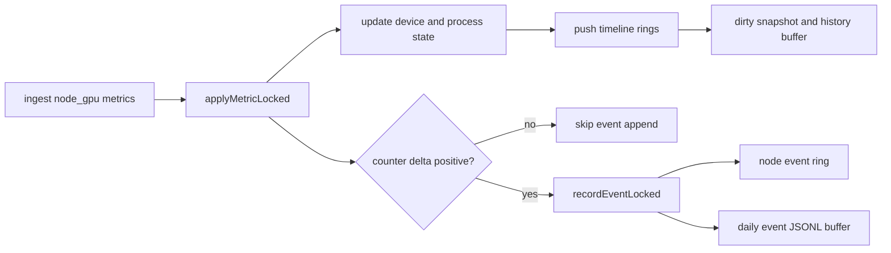

持久化路径与默认值（`gpuobs.DefaultConfig()`）：
- `gpu.persist_dir = ./data/gpu`
- `gpu.flush_interval = 10s`
- `gpu.retention = 168h`
- `gpu.max_processes_per_gpu = 20`
- `gpu.timeline_samples_per_gpu = 720`
- `gpu.timeline_samples_per_process = 360`
- `gpu.recent_events_in_snapshot = 200`

落盘目录：
- `data/gpu/snapshots`：每 collector 最新状态 JSON。
- `data/gpu/history`：按天 JSONL 的设备时间序列摘要。
- `data/gpu/events`：按天 JSONL 的归一化事件流。

#### 7.4 GPU correlation API（主机压力联动分析）
`GET /api/v1/gpu/correlation` 在 `gpuStore` 与 `ingestStore` 之间做联动评分：

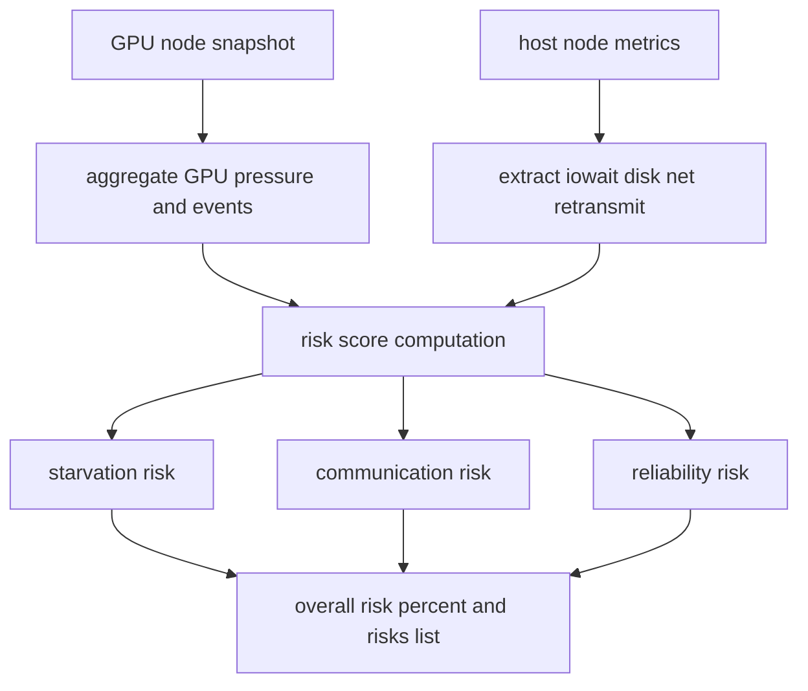

当前实现中的权重（代码级现实）：
- `starvation_risk`：GPU utilization 偏低 + 磁盘/网络/CPU iowait 压力。
- `communication_risk`：网络利用率 + PCIe 链路利用率 + TCP retransmit + disk p99 latency。
- `reliability_risk`：Xid/reset/throttle/UVM 事件计数。

已知限制：
- 事件来源仍以 `nvidia-smi + kernel log` 为主，尚未接入 NVML daemon 常驻通道。
- 进程级时间线有 ring 上限，长期历史依赖 JSONL 文件离线处理。
- 在高负载场景下，interval throttling 会降低短时尖峰分辨率。

### 8. 关键 API（v0.4 已注册）
- Core：`/api/v1/status`、`/api/v1/topology`、`/api/v1/top/programs`、`/api/v1/diagnostics/*`
- Ingest/Fleet：`/api/v1/ingest/status`、`/api/v1/ingest/schema`、`/api/v1/fleet`、`/api/v1/fleet/timeseries`
- Logs：`GET /api/v1/logs/search`、`POST /api/v1/logs/ingest`
- GPU：`/api/v1/gpu/nodes`、`/api/v1/gpu/timeline`、`/api/v1/gpu/process-timeline`、`/api/v1/gpu/events`、`/api/v1/gpu/processes`、`/api/v1/gpu/correlation`
- Optional modules by config：`analysis`、`agent`、`orchestration`、`inventory`、`k8s`、`checks`、`incidents/alerts`

### 9. 技术决策与工程取舍
| 决策点 | 采用方案 | 优势 | 可选替代 | 主要 trade-off / 已知弱点 |
|---|---|---|---|---|
| 采集到控制面传输 | Push + local spool + ACK | 对网络抖动容错；collector 端不丢 batch | Pull scrape；message queue (Kafka/NATS) | spool 需要磁盘与 offset 管理；重放窗口受本地磁盘上限约束 |
| Controller state | in-memory store (`MemoryStore`) | 查询延迟低、实现路径短 | TSDB/OLAP external store | retention 深度受内存限制；controller 重启会丢失非持久化状态 |
| 日志检索 | native segmented index (`logindex`) | 部署简单、无 external dependency、时窗查询快 | Elasticsearch/Loki | 默认 retention 短（6h）；复杂全文检索能力不如专用引擎 |
| GPU 采样 | layered sampling + interval throttling | 降低 `nvidia-smi` 开销；支持 device/process/event 关联 | NVML daemon 全量高频采样 | 峰值期可能降采样，时间分辨率下降 |
| 安全审计 | runtime audit CLI (`security-audit`) | 可直接集成 CI；输出可读 markdown/json | 外部 AppSec 平台独立扫描 | 规则以仓库配置与运行约定为主，不替代渗透测试 |
| 认证与传输 | API key + optional TLS/mTLS | 本地部署成本低，生产可增强到 mTLS | OIDC/JWT + service mesh mTLS | API key 依赖 secret 分发；middleware 目前仅对健康路径做显式 bypass |

### 10. 当前实现限制（v0.4）
- Ingest 与 log index 都是 memory-first，超长时窗查询不适合。
- Log search 支持结构化过滤和 timeline/correlation，但不实现外部全文引擎级别的复杂语法。
- `analysis` 与 `agent` 支持 LLM，但默认关闭，且依赖环境变量 secret。
- `kubernetes` integration 默认关闭；仅提供 read-only inventory/topology/workload视图。
- Security audit 当前是 CLI 工作流，没有独立 Security UI 页面。

### 11. 界面截图（对应已实现功能）
#### Dashboard

#### Metric Trends

#### Data Path Diagnostics

#### GPU Observability

#### AGENT Operations

---

## English

### 1. System Scope and Runtime Shape
`AI SRE Agent` in `v0.4` is a `push-first` Linux observability system with two binaries:

- `sre-collector`: host-side telemetry collector that builds `TelemetryBatch`, writes local spool, then pushes over gRPC.
- `sre-controller`: control-plane ingest/API/UI server that validates batches, updates in-memory state, indexes logs, aggregates GPU telemetry, and serves `/api/v1/*`, `/metrics`, and `/ui`.

### 2. System Architecture
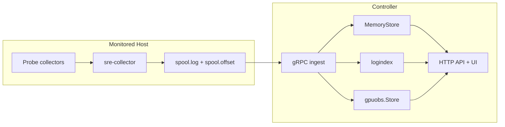

### 3. Data Flow (metrics, logs, GPU)
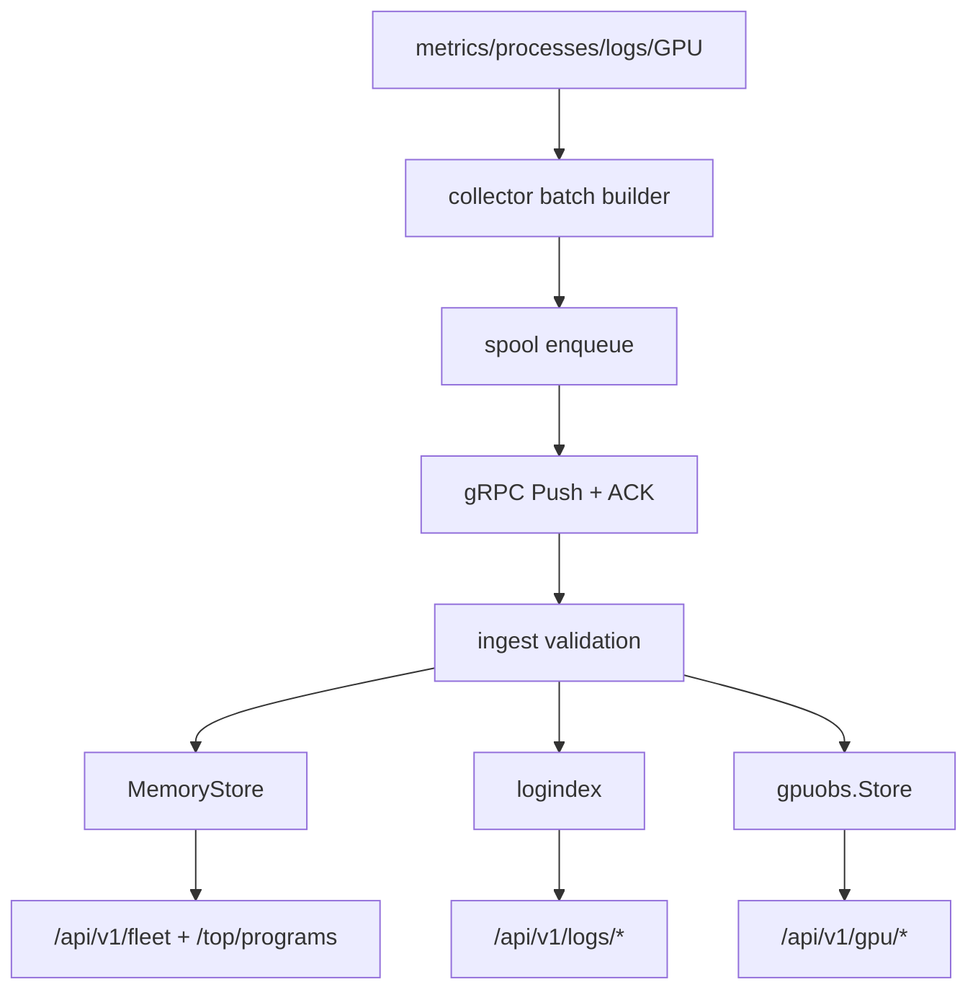

### 4. Probe-to-Controller Interaction
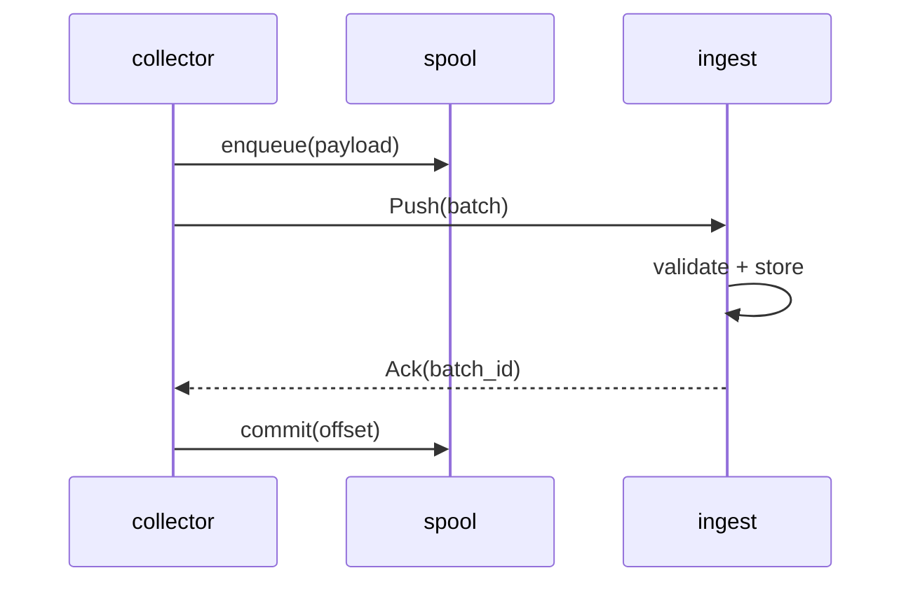

### 5. Log Ingestion and Indexing Pipeline
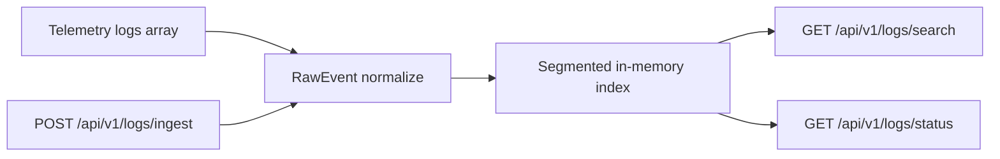

### 6. Implemented Modules and APIs
Implemented modules are wired in `backend/internal/controller/controller.go` and module-specific handler files:

- Ingest/Fleet: `/api/v1/ingest/*`, `/api/v1/fleet*`
- Diagnostics: `/api/v1/diagnostics/data-path|kernel-path|root-cause|workload-path|rca-packet|ai-infra-stack`
- Logs: `/api/v1/logs/status|search|ingest`
- GPU: `/api/v1/gpu/*` + `/api/v1/k8s/gpu/nodes`
- Optional by config: `analysis`, `agent`, `orchestration`, `inventory`, `kubernetes`, `checks`, `incidents/alerts`

### 6.1 Observability Coverage Matrix (What You Can Actually Observe)
| Domain | Implemented signals (examples) | Granularity | Query surfaces | Preconditions and limits |
|---|---|---|---|---|
| CPU | `node_cpu_usage_percent`, `node_cpu_iowait_percent`, `node_cpu_seconds_total`, load and runnable counters | node + process | `/api/v1/fleet`, `/api/v1/fleet/timeseries?metric=cpu_usage_percent`, `/api/v1/top/programs` | process ranking is windowed and top-N bounded |
| Memory | `node_memory_MemTotal_bytes`, `node_memory_Used_bytes`, available/swap/slab/dirty/writeback | node + process | `/api/v1/fleet`, `/api/v1/fleet/timeseries?metric=memory_used_percent`, `/api/v1/top/programs` | trends are ring-buffer based, not long-term TSDB storage |
| Disk and NVMe | `node_disk_total_iops_per_second`, `node_disk_utilization_peak_percent`, latency p99, NVMe throughput/IOPS | node + device + process | `/api/v1/fleet`, `/api/v1/fleet/timeseries?metric=disk_total_iops_per_second`, diagnostics APIs, top programs | device cardinality is bounded by payload and in-memory limits |
| NIC and TCP | bandwidth, utilization, drops/errors, `node_tcp_retransmit_ratio`, softnet drops, tx queue fill | node + interface + process | `/api/v1/fleet`, `/api/v1/fleet/timeseries?metric=network_rx_bytes_per_second`, diagnostics APIs, top programs | link-capacity utilization depends on interface speed discovery |
| RDMA | port state/rate, rdma bytes/s, errors/s, congestion events/s, utilization | node + HCA/port | `/api/v1/fleet`, data-path/kernel-path diagnostics | empty on hosts without RDMA devices |
| GPU device | SM/memory utilization, memory usage, thermals, power, PCIe/NVLink, ECC/MIG/reset status | node + gpu_id | `/api/v1/gpu/nodes`, `/api/v1/gpu/timeline`, fleet timeseries GPU keys | requires NVIDIA stack and `nvidia-smi`; can be disabled by env |
| GPU process and events | per-process SM/mem/enc/dec, context activity, Xid/UVM/reset/reliability counters | node + gpu_id + pid + event | `/api/v1/gpu/processes`, `/api/v1/gpu/process-timeline`, `/api/v1/gpu/events`, `/api/v1/gpu/correlation` | event and timeline depth are bounded by ring/retention config |
| Logs | collector log fingerprints + service log ingest path | collector + service + level + timeline | `/api/v1/logs/status`, `/api/v1/logs/search`, `/api/v1/top/programs` | default in-process retention is short (`6h`) |
| eBPF (optional) | `node_ebpf_events_total/rate`, GPU/process eBPF counters, event latency/bytes | category + gpu_index + pid | `/api/v1/fleet`, `/api/v1/top/programs` | requires eBPF support and explicit collector enablement |
| Collector runtime | spool backlog/size, transport latency/retries/errors, probe source | collector | `/api/v1/ingest/status`, `/api/v1/fleet`, `/metrics` | describes telemetry pipeline health, not workload pressure directly |

### 7. Technology Stack (Implemented)
| Layer | Implementation | Code and versions | Why this was chosen | Trade-off in current code |
|---|---|---|---|---|
| Backend language | Go | `backend/go.mod`, `go 1.25.0` | small operational footprint with static binaries and predictable concurrency | memory pressure must be controlled by explicit retention limits |
| Ingest transport | gRPC streaming + Protobuf | `grpc v1.64.0`, `protobuf v1.36.11`, `pkg/telemetry/v1` | strong schema contract for push batches and ACK lifecycle | binary protocol is less transparent than plain JSON during manual debugging |
| Metrics integration | Prometheus client | `client_golang v1.23.2` | native `/metrics` integration for controller and collector | label cardinality needs strict control in GPU/process telemetry |
| Config and CLI | Viper + Cobra | `viper v1.19.0`, `cobra v1.10.2` | unified runtime config and command surface | drift risk if defaults and docs are not updated together |
| Logging | Zap | `zap v1.27.0` | low-allocation structured logging in ingest hot paths | context fields must be curated for incident triage readability |
| Frontend | React + TS + Vite | `react 18`, `typescript 5`, `vite 4` | fast iteration for API-driven observability UI | chart-heavy pages need careful rerender control |
| Frontend data and charts | React Query + Recharts + Zustand | `@tanstack/react-query 4.29.5`, `recharts 2.6.2`, `zustand 4.3.8` | clear split between fetch cache, rendering, and local UI state | high-frequency polling can trigger expensive paint cycles without limits |

### 8. GPU Telemetry Deep Dive
Collector GPU sampling (`backend/internal/collector/probe/collector_gpu.go`) uses a layered schedule with interval gating:

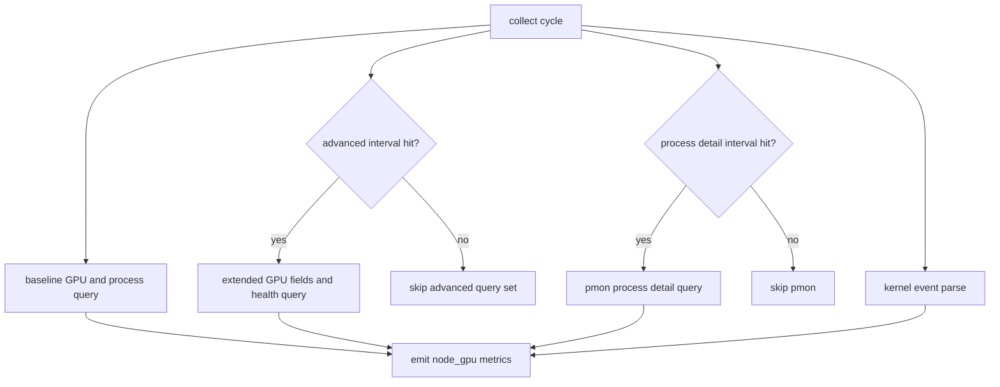

Implemented controls and defaults:
- `SRE_COLLECTOR_GPU_DISABLED=1` disables collector GPU sampling.
- `SRE_COLLECTOR_GPU_ADVANCED_INTERVAL_SAMPLES` default `3`.
- `SRE_COLLECTOR_GPU_PROCESS_DETAIL_INTERVAL_SAMPLES` default `2`.
- `SRE_COLLECTOR_GPU_QUERY_TIMEOUT_MS` default `1500`.

Controller GPU store internals (`backend/internal/controller/gpuobs/store.go`):
- state model: `collector_id -> gpu_index -> pid`
- timeline retention: `timeline_samples_per_gpu=720`, `timeline_samples_per_process=360`
- event buffering: `event_buffer_per_node=1024`, `recent_events_in_snapshot=200`
- persistence: `./data/gpu/{snapshots,history,events}` with `flush_interval=10s`, `retention=168h`
- stale process eviction window: `30m`

Event normalization and persistence flow:
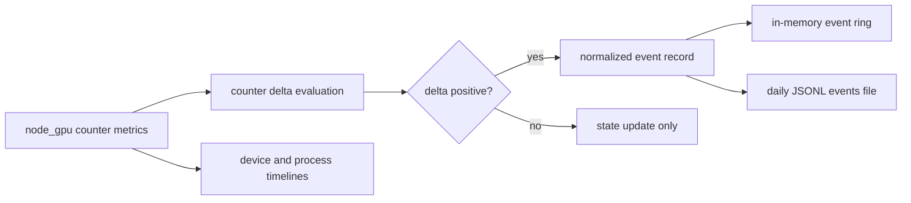

`GET /api/v1/gpu/correlation` computes three explicit scores from joined GPU + host pressure signals:
- starvation risk: low GPU util combined with disk/network/iowait pressure
- communication risk: NIC utilization, PCIe pressure, retransmit ratio, disk latency
- reliability risk: Xid, reset, throttle, UVM activity

### 9. Engineering Decisions and Trade-offs
- `Push + spool + ACK` was selected for loss tolerance during endpoint/network instability. Trade-off: local disk IO and offset lifecycle management.
- `MemoryStore` was selected for low-latency read paths. Trade-off: bounded retention and volatile state on restart.
- Built-in `logindex` was selected to avoid external ES/Loki dependencies. Trade-off: limited retention/query depth vs dedicated log engines.
- Layered GPU sampling was selected to combine visibility and overhead control. Trade-off: reduced temporal granularity under throttled sampling intervals.
- Runtime security auditing was implemented as a CLI (`make security-audit`) to keep security checks close to CI and deployment workflows. Trade-off: no dedicated security UI page.

### 10. Known Limitations in v0.4
- Memory-first ingest/log storage is not designed for long historical windows.
- Advanced log search is constrained compared to external full-text systems.
- LLM-backed analysis/agent paths are optional and disabled by default.
- Kubernetes integration is read-only and off by default.

### 11. Screenshots

