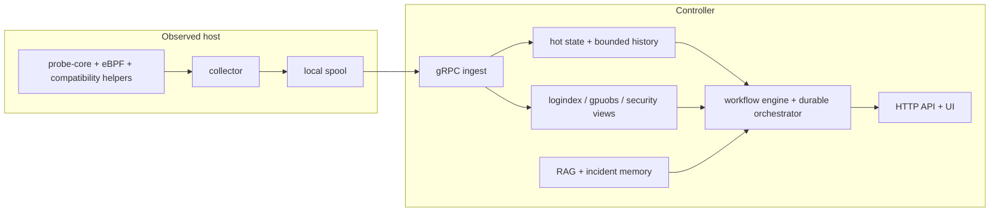

# AI SRE Agent


> Evidence-grounded AIOps and guarded incident automation for Linux, GPU, and AI infrastructure.
> The collector stays close to the host so short-lived evidence is not lost; the controller turns that evidence into hot state, retrieval, RCA, governed workflows, and audit-ready operator output.

| Documentation | Start here |
| --- | --- |
| English | [Overview](docs/en/01-overview.md) · [Pipeline Deep Dive](docs/en/02-pipeline-deep-dive.md) · [Architecture](docs/en/04-architecture.md) · [Incident Agent Runtime](docs/en/17-incident-agent-runtime.md) · [Architecture Decisions](docs/en/18-architecture-decisions.md) |
| 中文 | [中文首页](README.zh-CN.md) · [概览](docs/zh/01-overview.md) · [Pipeline 深度解析](docs/zh/02-pipeline-deep-dive.md) · [架构](docs/zh/04-architecture.md) · [事故 Agent 运行时](docs/zh/17-incident-agent-runtime.md) · [架构决策记录](docs/zh/18-architecture-decisions.md) · [行为基线与 Burst 判别](docs/zh/21-behavioral-baseline-design.md) |

The docs tree is flat inside each language folder. `01` to `19` are the main guide path; `20+` are supplemental reference and runbook pages.

## Read This First

If you only read four documents, read them in this order:

1. [README](README.md): project thesis, top-level runtime path, and entrypoints
2. [Pipeline Deep Dive](docs/en/02-pipeline-deep-dive.md): exact host-to-controller-to-operator data flow
3. [Architecture](docs/en/04-architecture.md): state ownership, trust boundaries, and persistence choices
4. [Incident Agent Runtime](docs/en/17-incident-agent-runtime.md): durable runs, tool governance, approval, verification, compensation
5. [Architecture Decisions](docs/en/18-architecture-decisions.md): ADR-style explanation of why these implementation choices exist in this repo

<p align="center">
  
</p>

## Release Context

`v0.8` is the first documentation set that matches the current incident-agent implementation in the repository.

The codebase now contains, and the docs now explain, these controller-side capabilities:

- durable workflow runs and evidence packages in [`backend/internal/controller/agentcore/workflow_orchestrator.go`](backend/internal/controller/agentcore/workflow_orchestrator.go)
- governed tool execution, approval handling, idempotency, and verification in [`backend/internal/controller/agentcore/workflow_tools.go`](backend/internal/controller/agentcore/workflow_tools.go)
- workload-specific behavioral memory and expected-burst suppression in [`backend/internal/controller/agentcore/behavioral_memory.go`](backend/internal/controller/agentcore/behavioral_memory.go)
- change intelligence in [`backend/internal/controller/changeintel/`](backend/internal/controller/changeintel/)
- causal graph reasoning in [`backend/internal/controller/causalgraph/`](backend/internal/controller/causalgraph/)
- durable incident memory in [`backend/internal/controller/incidentmemory/`](backend/internal/controller/incidentmemory/)
- replay and stability evaluation in [`backend/internal/controller/evaluation/`](backend/internal/controller/evaluation/) and [`backend/internal/controller/eval/`](backend/internal/controller/eval/)

This is still a bounded open-source infrastructure project, not a hosted platform. The repo is strong on mechanism, evidence flow, and guarded control; it is intentionally conservative about uncontrolled automation.

The RCA runtime is now explicitly two-agent:

- `AnalysisAgent` handles telemetry, security, and change analysis, then produces a structured `AnalysisHandoff`
- `ValidationActionAgent` consumes that handoff, chooses richer tools, validates or contradicts the analysis, and owns guarded action planning plus post-action validation

## Why This Project Exists

Modern AI/GPU operations have a recurring failure pattern:

- the first useful evidence is host-local and short-lived
- the diagnostic surface is cross-layer, not only metrics or only logs
- incident responders need structured hypotheses, not raw dashboards
- remediation ideas are easy to generate and hard to govern safely

Naive "LLM for ops" systems fail because they skip too many control steps. They often:

- read noisy telemetry too late
- treat retrieval as generic text attachment
- collapse root-cause reasoning and action planning into one opaque prompt
- provide suggestions without policy, approval, rollback, or post-action verification

This repository takes the opposite approach. It builds an evidence pipeline first, then an agent on top of that pipeline.

## What Makes This Different From A Chatbot Over Metrics

| Stage | Real runtime path | Why it exists |
| --- | --- | --- |
| host sampling | [`cpp/probe_core/`](cpp/probe_core/), [`backend/internal/collector/source_pipeline.go`](backend/internal/collector/source_pipeline.go), [`backend/internal/collector/probecore/client.go`](backend/internal/collector/probecore/client.go) | preserve short-lived node-local evidence before transport delay erases it, and fall back to compatibility collection when the native path is stale or unavailable |
| suppression and pacing | [`backend/internal/collector/collector.go`](backend/internal/collector/collector.go), [`backend/internal/collector/metric_suppression.go`](backend/internal/collector/metric_suppression.go), [`backend/internal/collector/aux_sampling.go`](backend/internal/collector/aux_sampling.go), [`backend/internal/collector/process_payload_suppression.go`](backend/internal/collector/process_payload_suppression.go) | keep steady-state host cost bounded while still emitting explicit markers such as `collector_metrics_partial_update` and `collector_process_payload_suppressed` |
| queue and replay | [`backend/internal/collector/spool/spool.go`](backend/internal/collector/spool/spool.go), [`backend/internal/collector/transport/client.go`](backend/internal/collector/transport/client.go) | prevent controller/network stalls from immediately becoming evidence loss and commit offsets only after batch-ID ACKs |
| normalization and hot state | [`backend/internal/controller/ingest/server.go`](backend/internal/controller/ingest/server.go), [`backend/internal/controller/ingest/store.go`](backend/internal/controller/ingest/store.go) | rebuild one controller-owned fact model from partial batches, refreshed-empty aux cycles, and structured runtime/security metrics |
| structured analysis | [`backend/internal/controller/predictive/`](backend/internal/controller/predictive/), [`backend/internal/controller/agentcore/workflow_eventization.go`](backend/internal/controller/agentcore/workflow_eventization.go), [`backend/internal/controller/changeintel/`](backend/internal/controller/changeintel/), [`backend/internal/controller/causalgraph/`](backend/internal/controller/causalgraph/) | separate single-series trends, multivariate weak signals, change correlation, and cause ranking from prompt generation |
| retrieval | [`backend/internal/controller/rag/`](backend/internal/controller/rag/), [`backend/internal/controller/incidentmemory/`](backend/internal/controller/incidentmemory/), [`backend/internal/controller/agentcore/workflow_memory.go`](backend/internal/controller/agentcore/workflow_memory.go) | attach static knowledge and prior incidents only when they improve the answer path |
| incident workflow | [`backend/internal/controller/agentcore/workflow_engine.go`](backend/internal/controller/agentcore/workflow_engine.go), [`backend/internal/controller/agentcore/workflow_tools.go`](backend/internal/controller/agentcore/workflow_tools.go), [`backend/internal/controller/agentcore/workflow_orchestrator.go`](backend/internal/controller/agentcore/workflow_orchestrator.go) | make policy, approval, idempotency, verification, compensation, and audit first-class |

That separation is why the repository can stay useful even when LLM and RAG are disabled. The deterministic evidence path still exists.

Inside the incident workflow, the controller does not collapse analysis and action into one opaque loop anymore. The implemented RCA path is:

1. analysis and hypothesis generation
2. `analysis_handoff_finalize`
3. `validation_action_react_loop`
4. recommendation finalization and guarded execution planning
5. `post_action_validation`
6. final durable report and evidence package

## Exact Runtime Path

The current `v0.8` runtime path is:

| Step | Primary data shape | Main code | Why this step exists |
| --- | --- | --- | --- |
| 1. host-native collection | `probeipc.v1.ProbeBatch` wrapped in `FrameEnvelope` | [`cpp/probe_core/main.cpp`](cpp/probe_core/main.cpp), [`backend/internal/collector/probecore/client.go`](backend/internal/collector/probecore/client.go) | collect host-local evidence before it disappears |
| 2. collector batch assembly | `telemetry.v1.TelemetryBatch` fields: metrics, processes, logs, `batch_id` | [`backend/internal/collector/collector.go`](backend/internal/collector/collector.go) | normalize, pace, suppress, and annotate what was intentionally omitted |
| 3. local durability and replay | append-only `spool.log` plus `spool.offset` | [`backend/internal/collector/spool/spool.go`](backend/internal/collector/spool/spool.go) | keep collection decoupled from controller and network health |
| 4. controller ingest | validated `TelemetryBatch` plus `Ack{batch_id}` | [`backend/internal/controller/ingest/server.go`](backend/internal/controller/ingest/server.go) | reject malformed data, dedupe by collector and batch, and preserve refreshed-empty semantics |
| 5. hot-state reconstruction | `NodeSnapshot`, `ProcessResources`, `ProcessGraphSnapshot`, `SecurityFindings`, `RuntimeSecurityEvents` | [`backend/internal/controller/ingest/store.go`](backend/internal/controller/ingest/store.go) | give every downstream API and workflow one fact model |
| 6. bounded history | `MetricHistorySample` rings and optional TSDB points | [`backend/internal/controller/timeseries/service.go`](backend/internal/controller/timeseries/service.go) | keep trend analysis cheap and bounded |
| 7. derived reasoning | `TrendAssessment`, `BehavioralSignalAssessment`, predictive `Finding`, weak-signal clusters, change links, causal paths | [`backend/internal/controller/predictive/`](backend/internal/controller/predictive/), [`backend/internal/controller/agentcore/behavioral_memory.go`](backend/internal/controller/agentcore/behavioral_memory.go), [`backend/internal/controller/changeintel/`](backend/internal/controller/changeintel/), [`backend/internal/controller/causalgraph/`](backend/internal/controller/causalgraph/) | compress raw evidence into auditable reasoning artifacts while distinguishing recurring workload bursts from real regressions |
| 8. retrieval and memory | `SourceDocument`, `Chunk`, `SearchHit`, incident-memory matches | [`backend/internal/controller/rag/`](backend/internal/controller/rag/), [`backend/internal/controller/incidentmemory/`](backend/internal/controller/incidentmemory/) | add runbooks and prior incidents only when context is strong enough |
| 9. operator-facing output | `QueryResponse`, `JointRiskAssessment`, `RCAWorkflowReport`, `DurableRun` | [`backend/internal/controller/agentcore/`](backend/internal/controller/agentcore/) | produce a bounded answer or governed workflow outcome instead of raw telemetry |

The detailed stage-by-stage version of the same path lives in [Pipeline Deep Dive](docs/en/02-pipeline-deep-dive.md).

## Read By Audience

| Audience | Start here | Why |
| --- | --- | --- |
| infrastructure engineers and SREs | [Pipeline Deep Dive](docs/en/02-pipeline-deep-dive.md), [Architecture](docs/en/04-architecture.md) | trace the collector-to-controller path and understand the operational tradeoffs |
| operators and incident responders | [Getting Started](docs/en/03-getting-started.md), [UI Guide](docs/en/08-ui-guide.md), [Incident Agent Runtime](docs/en/17-incident-agent-runtime.md) | learn how to run the stack, read the evidence, and inspect governed workflows |
| researchers and PhD students | [Overview](docs/en/01-overview.md), [Control-Plane Analysis](docs/en/07-control-plane-analysis.md), [Testing and Evaluation](docs/en/19-testing-and-evaluation.md) | understand the architectural thesis, evidence model, evaluation method, and current research boundaries |
| product reviewers, business stakeholders, investors | [Overview](docs/en/01-overview.md), [Business Use Cases](docs/en/35-business-use-cases.md), [Architecture Notes](docs/en/36-architecture-notes.md) | see what pain points the system addresses, where the defensibility is, and where the boundaries still are |

## Read By Goal

| Goal | Read this first | Then read |
| --- | --- | --- |
| run the stack locally | [Getting Started](docs/en/03-getting-started.md) | [Operations Usage](docs/en/21-usage.md), [Deployment](docs/en/15-deployment.md) |
| understand the collector/controller split | [Architecture](docs/en/04-architecture.md) | [Data Flow](docs/en/05-data-flow.md), [Collector Queue and Compaction](docs/en/06-collector-queue-and-compaction.md) |
| inspect the real incident-agent runtime | [Incident Agent Runtime](docs/en/17-incident-agent-runtime.md) | [Control-Plane Analysis](docs/en/07-control-plane-analysis.md), [API Reference](docs/en/24-api-reference.md) |
| modify RAG or dataset behavior | [Dataset and RAG](docs/en/11-dataset-and-rag.md) | [Core Files](docs/en/10-core-files.md), [RAG Reference](docs/en/27-rag-knowledge-engine.md) |
| review evaluation quality | [Testing and Evaluation](docs/en/19-testing-and-evaluation.md) | [Operations Testing](docs/en/23-testing.md) |

## System Map



## Incident Loop

This is the shortest readable path from host evidence to operator-visible outcome.


Two concrete path traces are documented end to end in [Pipeline Deep Dive](docs/en/02-pipeline-deep-dive.md):

- a GPU or host pressure signal that becomes trend history, retrieval context, and final operator diagnosis
- a security or runtime event that becomes structured evidence, workflow context, durable run state, and later incident-memory retrieval

## What The Current Codebase Supports

The repository currently supports:

- push-first collection with local spool and bounded replay
- controller-side hot state, bounded metric history, and optional TSDB bridging
- deterministic trend, weak-signal, and predictive analysis
- workload-specific historical memory that can suppress recurring benign bursts without mutating collector hot-path cost
- RAG over repository-local datasets plus incident-memory retrieval
- durable incident workflows with governed tool calls
- telemetry-quality-aware workflow confidence so stale or partial observability shows up as explicit RCA uncertainty instead of hidden overconfidence
- approval, dry-run, verification, and compensation records for executable workflow steps
- GPU, runtime, security, topology, process-lineage, and change-aware evidence gathering
- replayable evaluation and regression suites

The repository does not currently provide:

- a managed hosted control plane
- a distributed workflow backend beyond local BoltDB or in-memory runtime stores
- enterprise identity, CMDB, or external change-management integrations out of the box
- unconstrained autonomous remediation by default

## Closed-Loop Incident Runtime

The incident runtime is the main v0.8 architectural addition to the docs because it is the main gap between a reporting workflow and an operational agent.

| Capability | Code path | Why it matters |
| --- | --- | --- |
| durable runs | [`backend/internal/controller/agentcore/workflow_orchestrator.go`](backend/internal/controller/agentcore/workflow_orchestrator.go) | workflows can survive restarts and produce replayable state |
| governed tool gateway | [`backend/internal/controller/agentcore/workflow_tools.go`](backend/internal/controller/agentcore/workflow_tools.go) | schema, timeout, policy, idempotency, approval, and audit live in one place |
| change intelligence | [`backend/internal/controller/changeintel/`](backend/internal/controller/changeintel/) | incidents can be correlated against recent deploy/config/driver/flag changes |
| causal graph | [`backend/internal/controller/causalgraph/`](backend/internal/controller/causalgraph/) | the controller can separate likely causes from downstream symptoms |
| incident memory | [`backend/internal/controller/incidentmemory/`](backend/internal/controller/incidentmemory/) | prior actions and outcomes become retrievable evidence, ranked by signal overlap and verification quality instead of raw text match alone |
| telemetry-quality-aware workflow state | [`backend/internal/controller/agentcore/workflow_engine.go`](backend/internal/controller/agentcore/workflow_engine.go), [`backend/internal/controller/agentcore/incident_decision.go`](backend/internal/controller/agentcore/incident_decision.go), [`backend/internal/controller/agentcore/llm_analysis.go`](backend/internal/controller/agentcore/llm_analysis.go) | stale or partial telemetry lowers workflow confidence, shows up in unresolved gaps, and is exposed directly to operators and the LLM review path |
| evidence packages | `data/agent/workflows/evidence/` by default | operators can reconstruct what the workflow saw and did |
| replay evaluation | [`backend/internal/controller/evaluation/`](backend/internal/controller/evaluation/) | regression checks can test stability, governance, and coverage, not only health endpoints |

Primary workflow APIs:

- `GET /api/v1/agent/workflow/runs`
- `GET /api/v1/agent/workflow/runs/{run_id}`
- `GET /api/v1/agent/workflow/evidence/{run_id}`
- `GET /api/v1/agent/workflow/audit`
- `GET /api/v1/agent/joint-risk`
- `GET /api/v1/agent/rca`

Read [Incident Agent Runtime](docs/en/17-incident-agent-runtime.md) for the mechanism-level explanation.

Read [Architecture](docs/en/04-architecture.md) next if you want the hot-vs-durable state boundary behind those APIs.

Read [Architecture Decisions](docs/en/18-architecture-decisions.md) if you want the ADR-style rationale for why the repo chose local suppression, spool replay, bounded history, gated retrieval, and a durable governed workflow runtime instead of broader but heavier alternatives.

## Quick Start

Recommended local validation path:

```bash
cp .env.example .env
make container-build
make container-up-host-observer
curl -fsS http://127.0.0.1:8080/healthz
curl -fsS http://127.0.0.1:8080/readyz
curl -fsS http://127.0.0.1:8080/api/v1/status | jq '.deployment'
curl -fsS http://127.0.0.1:8080/api/v1/agent/workflow/runs | jq '.count'
```

For a minimal bring-up without the host-observer privileges, use [docs/en/20-quickstart.md](docs/en/20-quickstart.md). For the production-like local path, use [docs/en/21-usage.md](docs/en/21-usage.md).

## Documentation Map

| Topic | English | 中文 |
| --- | --- | --- |
| Overview | [docs/en/01-overview.md](docs/en/01-overview.md) | [docs/zh/01-overview.md](docs/zh/01-overview.md) |
| Pipeline deep dive | [docs/en/02-pipeline-deep-dive.md](docs/en/02-pipeline-deep-dive.md) | [docs/zh/02-pipeline-deep-dive.md](docs/zh/02-pipeline-deep-dive.md) |
| Architecture | [docs/en/04-architecture.md](docs/en/04-architecture.md) | [docs/zh/04-architecture.md](docs/zh/04-architecture.md) |
| Control-plane analysis | [docs/en/07-control-plane-analysis.md](docs/en/07-control-plane-analysis.md) | [docs/zh/07-control-plane-analysis.md](docs/zh/07-control-plane-analysis.md) |
| Incident agent runtime | [docs/en/17-incident-agent-runtime.md](docs/en/17-incident-agent-runtime.md) | [docs/zh/17-incident-agent-runtime.md](docs/zh/17-incident-agent-runtime.md) |
| Architecture decisions | [docs/en/18-architecture-decisions.md](docs/en/18-architecture-decisions.md) | [docs/zh/18-architecture-decisions.md](docs/zh/18-architecture-decisions.md) |
| Testing and evaluation | [docs/en/19-testing-and-evaluation.md](docs/en/19-testing-and-evaluation.md) | [docs/zh/19-testing-and-evaluation.md](docs/zh/19-testing-and-evaluation.md) |
| API reference | [docs/en/24-api-reference.md](docs/en/24-api-reference.md) | [docs/en/24-api-reference.md](docs/en/24-api-reference.md) |
| Operations and deployment | [docs/en/21-usage.md](docs/en/21-usage.md), [docs/en/15-deployment.md](docs/en/15-deployment.md) | [docs/en/21-usage.md](docs/en/21-usage.md), [docs/zh/15-deployment.md](docs/zh/15-deployment.md) |

## Repository Structure

| Path | Purpose |
| --- | --- |
| [`backend/`](backend/) | collector, controller, ingest, RAG, workflows, APIs, evaluation |
| [`cpp/`](cpp/) | native probe-core runtime |
| [`frontend/`](frontend/) | investigation UI |
| [`configs/`](configs/) | source-mode and container-mode configuration |
| [`dataset/`](dataset/) | repository-local knowledge corpus |
| [`deploy/`](deploy/) | Docker, Kubernetes, Helm, and systemd assets |
| [`docs/`](docs/) | bilingual, ordered guides under `docs/en/` and `docs/zh/`, plus shared images under `docs/images/` |
| [`eval_data/`](eval_data/) | deterministic replay and golden evaluation corpus |
| [`scripts/`](scripts/) | build, run, validation, and publishing helpers |

## Project Links

- [Documentation index](docs/README.md)
- [Business use cases](docs/en/35-business-use-cases.md)
- [Architecture notes](docs/en/36-architecture-notes.md)
- [API reference](docs/en/24-api-reference.md)
- [Changelog](CHANGELOG.md)
- [License](LICENSE)
