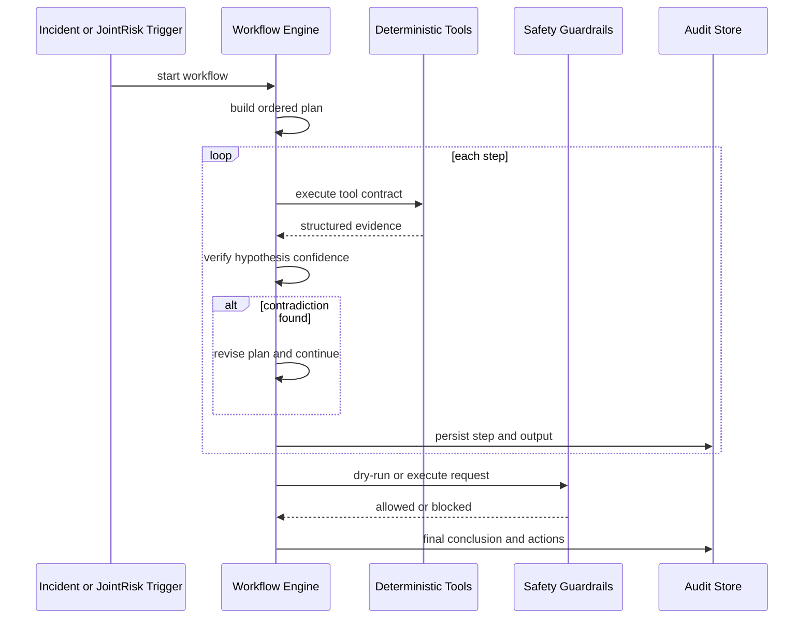

# AI SRE Agent v0.5

Release: `v0.5`


## 第一部分：动机与问题域

### 1. 构建动机：为什么需要一个 SRE Agent

#### 1.1 行业痛点的第一性原理分析

生产系统运维面临的核心矛盾不是缺少数据，而是**数据量与决策能力之间的鸿沟不断扩大**。


**响应式运维的结构性缺陷。** 绝大多数监控体系的工作模式是：指标超过阈值 → 触发告警 → 通知值班工程师 → 人工判断 → 手工排障。这个链条有两个根本问题：一是故障链在告警触发之前已经开始扩散（CPU 压力导致队列堆积导致超时导致重试风暴），等到阈值告警时影响范围已经放大；二是值班工程师需要在高压下完成跨系统的信息拼接，这是一个认知负荷极高且容易出错的过程。

**告警疲劳与信噪比恶化。** 单点阈值告警会产生大量噪声。一个节点的 CPU 从 60% 涨到 75%，这是正常波动还是故障前兆？如果同时有 IO 延迟上升和网络重传增加，这三个弱信号的组合就不再是噪声——但传统告警系统无法做这种联合判断。结果是：值班工程师要么对大量告警脱敏（漏掉真正的问题），要么花大量时间在噪声上（效率极低）。

**分布式系统中根因被局部指标掩盖。** 微服务架构下，一个根因（比如数据库连接池耗尽）会在多个下游服务中表现为不同症状（超时、重试、队列堆积、内存增长）。传统监控展示的是每个服务自己的指标，工程师需要在脑中完成跨服务的因果推理。这在服务数量增长后变得不可行。

**GPU/AI 工作负载的监控盲区。** GPU 利用率、SM 占用率、显存碎片、PCIe 带宽、NCCL 通信延迟等指标与传统 CPU/内存/IO 指标之间存在复杂的耦合关系。一个 GPU 训练任务的性能抖动可能源自 CPU 调度争用、IO 延迟或网络重传，但传统监控工具无法做跨域关联分析。

**安全与性能的割裂处理。** 安全团队和 SRE 团队通常使用不同的工具和报表。权限漂移、异常端口暴露、可疑进程行为等安全信号往往与性能异常有因果关系（比如恶意进程消耗 CPU/网络资源），但两套体系无法联合推断。

**成本效率的隐性侵蚀。** 资源过配、热点不均衡、空闲节点、内存泄漏等问题通常不会触发故障级告警，但它们长期侵蚀基础设施成本和稳定性余量。这类问题需要趋势分析和弱信号组合检测，而不是简单的阈值告警。

#### 1.2 范式转换：从被动可观测到闭环分析

这个项目的定位不是再做一个 dashboard 或告警通道，而是实现一个根本性的范式转换：

| 传统监控 | SRE Agent |
| --- | --- |
| 被动展示：数据在图表上等人来看 | 主动分析：系统持续扫描弱信号组合 |
| 单点阈值：CPU > 90% 告警 | 联合推断：CPU + IO + 重传组合升级为系统性风险 |
| 人工拼接：工程师跨 dashboard 手工关联 | 自动关联：co-occurrence 和 correlation 计算 |
| 事后复盘：故障结束后才做 RCA | 实时 RCA：在故障扩散过程中就构建假设 |
| 自由文本报告：RCA 结论不可追溯 | 结构化输出：每个结论都有证据链和置信度 |
| 脚本自动化：运维脚本缺少审计和回滚 | 受控动作：dry-run / 审批 / rollback 护栏 |

闭环的含义：输入是已有的 metrics / logs / security telemetry → 处理是弱信号检测 + 跨信号关联 + LLM 驱动的可解释 RCA → 输出是结构化调查建议与受控动作计划。

#### 1.3 为什么传统工具不够

这不是对现有工具的否定，而是对一个空白领域的填补：

- **Prometheus/Grafana**：数据采集和展示极强，但没有分析层。PromQL 可以做单指标聚合，但无法做跨指标因果推理。
- **Datadog/NewRelic**：强大的 SaaS 监控平台，但分析能力局限于预定义的告警规则和异常检测。不支持 agentic workflow。
- **PagerDuty/OpsGenie**：告警路由和On-call管理，但不做根因分析。
- **LLM-based chatbots**：可以回答自然语言问题，但缺少结构化证据收集、确定性可重放、和受控动作执行的能力。

本项目填补的是"从数据到行动建议"之间的自动化推理层。


## 第二部分：能力边界与架构

### 2. v0.5 的能力边界

#### 2.1 已实现能力

| 层 | 能力 | 关键实现 |
| --- | --- | --- |
| Connect/Collect | 内核优先采集 | probe-core + eBPF/perf/netlink 主路径，`/proc` 兼容回退 |
| Connect/Collect | 日志采集 | 指纹提取、批量传输、spool + retry/backoff |
| Control/Ingress | 数据入口 | gRPC ingest、格式校验、归一化 |
| Control/Ingress | 存储 | 有界内存环形结构 + 可选 bbolt 持久化 |
| Control/Ingress | 日志索引 | 分段索引、时间窗查询、聚合、相关性提示 |
| Control/Ingress | 控制面 | HTTP API-first controller |
| Analyze | 风险检测 | joint-risk 组合评分、co-occurrence/correlation |
| Analyze | 根因分析 | 结构化 RCA 流水线、Plan → Act → Verify 循环 |
| Analyze | LLM 综合分析 | 结构化证据包 → LLM agentic 多轮分析 → schema 校验 |
| Analyze | 工具注册 | metrics_query、log_query、security_check、topology_query、profiling_trigger、remediation_action |
| Respond | 建议输出 | 结构化建议 + runbook 提示 |
| Respond | 受控动作 | dry-run / approval / rollback 护栏 |
| Respond | 审计 | 控制面 + 工作流双审计链 |

#### 2.2 明确不做（当前版本限制）

- 默认不直接执行高风险修复动作。修复路径以"计划 + 审批 + 回滚"方式输出，`DryRun=true` 和 `RequireApproval=true` 是默认值。
- 不依赖外部 LLM 才能运行。LLM 是分析的中心，但无 API key 时自动回退内置 stub 客户端，系统仍然完整可用。
- 不宣称分布式多主写入。HA 模型为 active/standby 的读写隔离，不提供多活写入与一致性复制。
- 不等同完整 EDR/取证系统。安全审计基于主机信号归一化，覆盖文件权限、进程姿态、网络暴露、内核安全配置，但不替代专业安全产品。
- joint-risk 是规则 + 统计模型 + LLM 综合分析，不是在线学习系统。阈值和权重需要人工校准。

### 3. 端到端架构

#### 3.1 分层设计的工程理由

分层不是形式化拆分，而是为了实现三个工程目标：

**故障域隔离。** 采集层失效（比如 probe-core 崩溃）不应拖垮分析层。分析策略变更（比如调整风险权重）不应影响 ingest 稳定性。响应策略（比如开放某类动作的自动执行）必须在护栏层统一收口，不能出现"旁路自动化"。

**独立伸缩。** 采集层的伸缩维度是"节点数量 × 采样频率"。控制层的伸缩维度是"并发 API 请求 × 存储窗口大小"。分析层的伸缩维度是"工作流并发数 × 假设搜索深度"。三者的伸缩模式不同，必须在架构上解耦。

**可测试性。** 每一层都可以独立测试。采集层测试不需要启动控制面。分析层测试不需要真实的 telemetry 数据（通过 seeded mock）。响应层测试验证护栏行为而不执行真实动作。

#### 3.2 Data/Control 主图

```mermaid
flowchart LR
    subgraph A[Connect Collect]
        H[Host or Pod Workload]
        K[Kernel Collectors<br/>eBPF perf netlink]
        P[Proc Fallback Collectors<br/>cpu memory disk network]
        L[Log Collector<br/>fingerprints and events]
        C[sre-collector<br/>batch window spool retry backoff]
        H --> K
        H --> P
        H --> L
        K --> C
        P --> C
        L --> C
    end

    subgraph B[Control Ingress]
        G[gRPC Ingest Server]
        N[Validation and Normalization]
        S[Ingest Store<br/>bounded retention plus persistence]
        LI[Log Index<br/>parse normalize search]
        API[HTTP API First Controller]
        AUTH[Auth via env key]
        C --> G
        G --> N
        N --> S
        N --> LI
        S --> API
        LI --> API
        AUTH -. protect .-> API
    end

    subgraph C1[Analyze]
        JR[Joint Risk Engine<br/>weight baseline acceleration cooccurrence]
        RCA[RCA Workflow Engine<br/>hypothesis evidence ranking]
        LLM[LLM Analysis<br/>context bundle agentic loop schema validation]
        WF[Agent Loop<br/>plan act verify replan]
        TOOLS[Tool Registry<br/>metrics logs security topology profiling remediation]
        API --> JR
        API --> RCA
        JR --> LLM
        RCA --> LLM
        TOOLS --> WF
        LLM --> WF
    end

    subgraph D[Respond]
        REC[Recommendations and Runbook Hints]
        ACT[Guarded Actions<br/>dry run approval rollback]
        AUD[Audit Log<br/>controller plus workflow]
        UI[Web UI<br/>dashboard risk security incidents rca audit logs agent analysis]
        WF --> REC
        WF --> ACT
        ACT --> AUD
        REC --> UI
        AUD --> UI
        API --> UI
    end
```



#### 3.2 Agentic Loop 子图



#### 3.3 分层职责、失效模式与代价

| 层 | 存在理由 | 主要防护的失效模式 | 伸缩/可靠性作用 | 引入的代价 |
| --- | --- | --- | --- | --- |
| Connect/Collect | 把高频内核与进程信号就地提取，降低控制面采样成本 | 仅靠 `/proc` 轮询导致高负载时采样抖动、关键瞬时事件丢失 | 批量 + spool + retry/backoff 缓冲瞬时网络抖动；自适应采样间隔减压 | 采集链路更复杂，需要管理 probe-core 与 fallback 路径 |
| Control/Ingress | 统一校验、归一化、存储与查询入口 | 采集端格式漂移、脏数据污染分析；内存无限增长导致 OOM | 有界 retention + 持久化上限 + compaction；API-first 便于后续横向拆分 | 单节点模式下仍需谨慎设置 retention 与 DB 上限 |
| Analyze | 把“单信号告警”升级为“联合风险 + RCA 证据链” | 仅基于阈值导致误报/漏报；根因分析不可复现 | 确定性流水线 + 结构化输出便于回放与测试 | 规则和阈值需要持续校准，不是自学习系统 |
| Respond | 把建议和动作统一纳入审计与审批 | 自动化旁路执行、缺失回滚、动作不可追溯 | dry-run 默认开启，审批门禁，rollback 计划强制输出 | 处理速度比“直接执行脚本”更慢，但显著降低误操作风险 |


## 第三部分：技术选型与工程权衡

### 4. 关键技术选型

每个选型都遵循同一原则：**在 v0.5 的约束条件下（单节点为主、部署门槛低、无外部硬依赖），选择能最大化诊断质量的方案，同时保留向更复杂方案演进的接口。**

#### 4.1 Kernel-level collection vs 纯 `/proc` 轮询

| 维度 | Kernel-first (选择) | 纯 `/proc` polling (备选) |
| --- | --- | --- |
| 信号质量 | 事件级精度：syscall latency、scheduling contention、IO 完成时间、per-flow 网络计数 | 快照级精度：每 N 秒采样一次，瞬时事件被采样间隔吞没 |
| RCA 支持 | 可以追溯到具体 syscall、调度器决策、IO 队列深度 | 只能看到聚合后的 CPU%/Mem%，因果链断裂 |
| 运行约束 | 需要 root/CAP_BPF/CAP_PERFMON，内核版本依赖 | 任何用户均可读 `/proc`，无内核依赖 |
| 部署复杂度 | 需要管理 probe-core 生命周期、fallback 策略 | 简单直接 |

**取舍理由：** SRE 诊断最怕"关键瞬时信号缺失"。一个持续 200ms 的 IO 延迟尖峰在 5s 采样间隔下会被完全遗漏，但它可能是根因。因此主路径优先保证事件质量，`/proc` 作为回退保证可用性。回退发生时通过 `collector_mode` 字段标注，分析层据此降低置信度。

#### 4.2 eBPF/perf vs 纯用户态 polling

- **选择：** eBPF/perf 与 netlink 作为内核动态信号来源。
- **收益：** 覆盖 syscall latency 分布、scheduling contention 频率、block IO 完成延迟、per-connection 网络事件、process attribution（哪个进程产生了哪些 IO/网络负载）。这些信号是"弱信号组合推断"的关键输入——没有它们，joint-risk 的 co-occurrence 检测会退化为简单阈值告警。
- **代价：** 不同内核版本的 BPF helper 可用性不一致（4.15 vs 5.x vs 6.x）；CAP 权限模型在容器环境中需要额外配置。
- **取舍理由：** 用户态 polling 适合基线监控，但不足以支持"弱信号组合推断 + 可解释根因"。eBPF 的代价是部署复杂度，但这是可控的工程问题，而信号质量的缺失是不可逆的信息损失。

#### 4.3 In-memory retention vs 持久化存储

- **选择：** 热路径使用有界内存环形结构（`ring.Buffer`），冷路径可选 bbolt 持久化（`persistence_bbolt.go`）。
- **备选：** 纯内存（重启丢失全部状态）；外部数据库（PostgreSQL、InfluxDB）。
- **收益：** 单节点部署成本极低；`MaxDBSizeBytes` + `CompactionInterval` 控制资源边界；重启后可从 bbolt 快照恢复，保留更长时间窗口的历史数据用于趋势分析。
- **代价：** 快照式持久化不是 WAL（Write-Ahead Log），异常关机时可能丢失最后一个 `SyncInterval` 的数据。不支持分布式复制。
- **取舍理由：** v0.5 的目标是"先把单节点做稳"。外部数据库引入网络延迟、运维复杂度和可用性依赖。当前方案通过 `StoreStats` 暴露 federation hints（`collector_id` 分区键），为后续分片保留接口约定。

#### 4.4 确定性证据收集 + LLM 综合分析

这是整个系统最核心的架构决策。

**问题：** 纯规则系统灵活性不足（需要为每种故障模式写规则），纯 LLM 系统不可审计（输出不可重放，可能编造证据）。

**解法：** 分层架构。确定性管线负责证据收集和基础评分（可审计、可重放、可回归测试），LLM 负责对证据的综合推理（问题识别、因果解释、假设排名、next steps）。

```
确定性管线（可重放）          LLM 分析（语义推理）
┌──────────────┐           ┌─────────────────────────┐
│ 信号采集     │           │ 问题识别与解释           │
│ 阈值计算     │ ───────→  │ 联合风险因果推理         │
│ 基线偏移     │  证据包   │ RCA 假设排名             │
│ Co-occurrence │           │ 下一步调查建议           │
│ 安全发现     │           │ 置信度评估               │
└──────────────┘           └─────────────────────────┘
                                    │
                              schema 校验
                              失败 → 确定性回退
```

**关键约束：** LLM 不允许编造证据。所有 LLM 输出都通过 `ValidateLLMAnalysis()` 校验 JSON schema（必须包含 `issues`、`evidence_cited`、`confidence`、`next_steps`），每个 issue 必须关联具体证据。校验失败时回退到确定性分析，报告标注 `insights.mode=stub`。

**无 API key 时的行为：** 系统自动使用 `stubWorkflowLLMClient`（内置确定性客户端），根据信号阈值生成结构化分析。这保证了离线环境下系统的完整功能。

#### 4.5 API-first controller vs UI 直连内部模块

- **选择：** 所有核心能力通过控制面 API 暴露（incident intake / telemetry / runs / actions / audit / tools）。
- **收益：** 便于外部系统接入（CI/CD、工单系统、告警路由）；权限与审计统一在 API 层；前后端可独立开发和部署。
- **代价：** 需要维护接口契约与向后兼容；每个新能力都需要先定义 API 再实现 UI。
- **取舍理由：** 控制面接口稳定性是后续生态集成的前提。"先有 API 再有 UI"的原则防止了 UI 与内部对象的紧耦合。

#### 4.6 Agentic loop vs 单次分析

- **选择：** Plan → Act → Verify → Replan 的迭代工作流，包含 LLM 多轮工具请求。
- **备选：** 一次性收集数据 → 一次性生成结论。
- **收益：** 当证据与假设冲突时可自动修订计划（扩窗、补充日志、刷新拓扑）。LLM 可在分析过程中请求额外工具调用获取新证据。减少"过早收敛"错误。
- **代价：** 执行路径更长（最多 `MaxPlanIterations` 轮），运行时间和审计数据量更大。
- **取舍理由：** 真实事故中证据常不完整。允许多轮修正比一次性猜测更可靠。每轮的 plan、tool calls、decisions 全部持久化到审计链，便于事后复盘。

#### 4.7 内置日志索引 vs 外部 ELK 依赖

- **选择：** 内置 segmented log index（`backend/internal/controller/logindex/`）支持解析、时间窗查询、模式频率聚合与 co-occurrence 相关性提示。
- **收益：** 即开即跑，测试闭环完整，部署门槛低。日志特征可直接参与 joint-risk 评分（`log_burst` 信号）。
- **代价：** 不等同完整 ELK 生态的全文检索能力；跨集群海量日志场景能力有限。
- **取舍理由：** v0.5 需要"即开即跑"的诊断链路。外部系统做可选增强而非硬依赖。

#### 4.8 Headless UI 测试 vs 手工验证

- **选择：** Playwright headless Chrome 覆盖路由导航、按钮交互、数据渲染、console error / pageerror / requestfailed 检测。
- **收益：** 把"页面可见但不可用"的回归问题纳入 CI 可重复检测。SRE 工具的可信度同样依赖 UI 可用性。
- **代价：** 测试维护成本上升；需要稳定的测试数据和 API mock。


## 第四部分：实现深潜

### 5. 模块设计、Agent 契约与可解释性

#### 5.1 模块拆分与最小抽象

代码按职责拆分，避免跨层隐式耦合：

| 模块 | 路径 | 职责 |
| --- | --- | --- |
| 采集 | `backend/internal/collector/` | probe-core、spool、transport、自适应采样、fallback |
| 控制/入口 | `backend/internal/controller/` | HTTP/gRPC server、API handlers、HA、orchestration |
| 存储 | `backend/internal/controller/ingest/` | 有界内存环 + 可选 bbolt 持久化 |
| 日志索引 | `backend/internal/controller/logindex/` | 分段索引、时间窗查询、模式聚合 |
| Agent 核心 | `backend/internal/controller/agentcore/` | joint-risk、RCA、LLM 分析、tool registry、审计 |
| 安全审计 | `backend/internal/controller/securityaudit/` | finding 归一化、趋势检测 |
| 可选 RAG | `backend/internal/controller/rag/` | 本地词法检索、`var/rag/index.json` |

抽象保持"薄接口"：`workflowTool` 只要求 `Run(ctx, stage, query)` 与元数据（版本、确定性标记、是否危险），降低工具扩展成本。新增工具只需实现接口并注册到 `workflowToolManager`。

#### 5.2 Agent 输入/输出契约

Agent 的输入和输出有严格的结构化定义，运行时进行 JSON schema 校验：

**输入（`WorkflowRequest`）：**
- `collector_id`：目标节点标识
- `window`：分析时间窗口
- `trigger`：触发原因（anomaly / incident_alert / manual / periodic）
- `scope`：分析范围（node / pod / service / cluster）
- `dry_run`：是否为只读模式

**中间产物（`ContextBundle` — 传给 LLM 的证据包）：**
- `top_signals`：按 score 排序的风险信号，包含 current/baseline/delta/acceleration
- `anomalies`：触发阈值的异常描述
- `log_excerpts`：时间窗口内的关键日志片段（截断到 200 字符）
- `security_findings`：安全发现摘要
- `cooccurrences`：信号共现关系与相关系数
- `top_metrics`：按绝对值排序的 top-k 指标快照
- `hypotheses`：确定性管线生成的初始假设（供 LLM 评估和排名）
- `tool_call_summary`：已执行的工具调用摘要
- `process_summary`：top-k CPU/内存/IO 进程

**输出（`JointRiskAssessment` / `RCAWorkflowReport`）：**
- 确定性评分：`risk_score`、`risk_level`、`signals`、`cooccurrences`、`scope_risks`
- LLM 分析（`llm_analysis`）：issues（标题 + 严重度 + 解释 + 证据）、joint_risk_reason、rca_hypotheses（排名 + 置信度 + 证据）、next_steps、confidence、evidence_cited、limitations
- 工具调用记录：`tool_calls`（每次调用的 tool/stage/status/summary/timestamps）
- 审计记录：`stages`（每个 pipeline stage 的 status/summary/duration）

#### 5.3 Tool Registry：显式契约、版本化、可审计

| 工具 | 输入 | 输出 | 确定性 | 副作用 |
| --- | --- | --- | --- | --- |
| `metrics_query` | collector_id, window | 指标快照 + 历史序列 + 进程归因 | 是 | 无 |
| `log_query` | collector_id, window, patterns | 日志片段 + 频率聚合 + 时间线分桶 | 是 | 无 |
| `security_check` | collector_id | 安全发现列表 + 综合分数 | 是 | 无 |
| `topology_query` | collector_id | 拓扑快照 + 邻居关系 | 是 | 无 |
| `profiling_trigger` | collector_id, duration | profiling 摘要 | 否 | 有（受 `AllowProfilingExec` 门控） |
| `remediation_action` | action_type, params | 执行结果 | 否 | 有（受 `AllowRemediationExec` + `RequireApproval` 双重门控） |

每次工具调用都保留完整记录：tool name、tool version、pipeline stage、input query、status、summary、start/end timestamp。LLM 也可以在 agentic 循环中通过 `tool_requests` 请求额外工具调用。

#### 5.4 采集与传输：低开销与抗压并重

- Collector 批量构建 telemetry batch，写入本地 spool，再由 transport drain 到 controller。
- 在 CPU 高负载、spool 积压或发送失败时，采样周期自动拉长；压力降低后恢复。
- probe-core 不可用时按配置回退 Go probe，避免单点采集中断。

设计优先保证"系统不被采集拖垮"，在压力期牺牲采样频率换取整体稳定性。

#### 5.5 Joint-risk 的计算逻辑（可解释、可追踪）

Joint-risk 不是黑盒分数。核心步骤：

1. **构造风险序列：** 从历史窗口提取 CPU 压力、内存压力、IO latency p99、IO pressure full、TCP retransmit ratio、softnet drops、日志突发频率、内存泄漏率。每个序列包含 timestamp + value 的时序点。
2. **计算基线和偏移：** 取前 2/3 窗口的均值作为 baseline，与最新值比较计算 delta%。计算 acceleration（最近三个点的二阶差分）。
3. **加权评分模型：** 单信号分数 = `weight * (0.55*threshold_score + 0.30*delta_score + 0.15*acceleration_score)`。权重分配：IO latency 0.18、CPU 0.16、retransmit 0.14、memory 0.14、memory leak 0.12、IO pressure 0.12、log burst 0.10、softnet 0.08。
4. **Co-occurrence 检测：** 对 top-k 活跃信号两两计算 Pearson correlation。相关系数 > 0.3 的信号对被标记为 co-occurrence，组合分数叠加 correlation bonus（`(score_a + score_b) * (1 + |corr| * 0.25)`）。
5. **Scope 归因：** 在 node / process / pod / service / cluster 五个维度分别聚合风险分数，输出每个 scope 的 top signals 和 explanation。
6. **输出：** `ActionableWhy` 明确"哪些信号、在哪个窗口、在哪个 scope 共同出现"。所有中间计算和最终分数都包含在报告中。

#### 5.6 RCA 工作流：结构化、可复现、LLM 增强

RCA pipeline 顺序固定：

```
anomaly_detection → context_gathering → plan_act_verify_loop
→ hypothesis_generation → evidence_collection → llm_analysis
→ recommendation_generation → guarded_execution_plan → finalize
```

关键实现点：

- 假设有 rank 与 confidence（0-1 浮点数），证据有类型、来源、时间、基线差值。
- Plan → Act → Verify 循环逐步执行并验证；验证失败会触发 replan（扩窗、补充日志、拓扑刷新、受控 remediation plan）。
- `stepLLMAnalysis` 在 evidence_collection 之后执行：将确定性管线的证据打包为 `ContextBundle`，发送给 LLM 进行综合分析。LLM 可请求额外工具调用（最多 `MaxPlanIterations` 轮），每轮的工具结果会合并到证据包中。
- `mergeLLMIntoState` 将 LLM 生成的假设与确定性假设合并：相同标题的假设取均值置信度，新假设追加并标记来源为 `h-llm-*`。
- 最终报告包含：症状、时间线、范围、最可能根因、支持/反证信号、假设排名、LLM 分析结果与可复现元信息。

#### 5.7 护栏模型：默认只读，动作必须可审计

默认配置（`DefaultWorkflowConfig`）是保守策略：

- `DryRun=true` — 任何动作默认只生成计划而不执行
- `RequireApproval=true` — 执行需要审批 token
- `AllowProfilingExec=false` — profiling 采集默认禁止
- `AllowRemediationExec=false` — 修复动作默认禁止

动作 API 分离为 `dry-run / approve / execute / rollback`，并在 controller 与 workflow 两条审计链记录输入、输出、状态、时间戳、审批要求。每个 `AgentIncidentReport` 都包含完整的 `tool_calls` 和 `stages` 记录。

密钥只从环境变量读取，不接受 API 参数传入。LLM API key、JimmyNight key 等敏感信息不会出现在日志或审计记录中。

#### 5.8 LLM 集成架构

```
WorkflowEngine
├── llm: llmClient (interface)
│   ├── chatClient (real LLM: openai/jimmynight/ollama)
│   └── stubWorkflowLLMClient (deterministic fallback)
├── stepLLMAnalysis(ctx, state)
│   ├── BuildContextBundle(state) → ContextBundle
│   ├── BuildWorkflowSystemPrompt() → system prompt with schema
│   ├── BuildWorkflowUserPrompt(bundle) → user prompt with evidence
│   ├── llm.Complete(ctx, system, user) → raw response
│   ├── ParseLLMAnalysis(raw) → LLMAnalysisResult (JSON extraction)
│   ├── ValidateLLMAnalysis(result) → error (schema validation)
│   └── loop: if result.ToolRequests → execute tools → rebuild bundle → retry
└── mergeLLMIntoState(state) → merge hypotheses and recommendations
```

**Provider 配置（仅环境变量）：**

| 变量 | 用途 |
| --- | --- |
| `SRE_AGENT_LLM_PROVIDER` | provider 选择：openai / jimmynight / ollama / stub |
| `SRE_AGENT_LLM_MODEL` | 模型名称（默认 gpt-4o-mini） |
| `SRE_AGENT_LLM_API_KEY` | API key |
| `SRE_AGENT_LLM_BASE_URL` | 自定义 endpoint |
| `SRE_AGENT_LLM_TIMEOUT` | 单次调用超时 |
| `SRE_AGENT_LLM_MAX_RETRIES` | 重试次数 |
| `SRE_AGENT_LLM_RATE_LIMIT_RPS` | 速率限制 |
| `SRE_AGENT_WORKFLOW_INSIGHTS_ENABLED` | 启用 workflow LLM 分析步骤 |
| `SRE_AGENT_WORKFLOW_INSIGHTS_PROVIDER` | workflow 专用 provider |
| `SRE_AGENT_WORKFLOW_INSIGHTS_MODEL` | workflow 专用 model |

**降级策略：** 无 key → stub 客户端。LLM 调用失败 → 记录 limitation，使用确定性分析结果。LLM 输出 schema 校验失败 → 同上。每个降级事件都写入审计链。

**RAG（可选增强）：** 代码在 `backend/internal/controller/rag/`，默认索引 `var/rag/index.json`，通过 `SRE_AGENT_RAG_*` 环境变量控制。当前实现是本地词法检索器，用于补充 runbook/历史文档片段到 prompt 上下文。


## 第五部分：运维参考

### 6. API-first Controller 接口

控制面核心接口：

| 类别 | 方法 | 路径 |
| --- | --- | --- |
| Incident | POST | `/api/v1/controller/incidents/intake` |
| Telemetry | GET | `/api/v1/controller/telemetry/{metrics\|logs\|security}` |
| Agent runs | GET/POST | `/api/v1/controller/agent/runs` |
| Agent run detail | GET | `/api/v1/controller/agent/runs/{run_id}` |
| Agent run stop | POST | `/api/v1/controller/agent/runs/{run_id}/stop` |
| Guarded actions | POST | `/api/v1/controller/actions/{dry-run\|approve\|execute\|rollback}` |
| Audit | GET | `/api/v1/controller/audit` |
| Tools | GET | `/api/v1/controller/tools` |

工作流接口：

| 路径 | 用途 |
| --- | --- |
| `GET /api/v1/agent/potential-risks` | 潜在风险列表（ranked） |
| `GET /api/v1/agent/joint-risk` | 联合风险评估（含 `llm_analysis`） |
| `GET /api/v1/agent/rca` | RCA 报告（含 `llm_analysis`） |
| `GET /api/v1/agent/workflow/incidents` | Incident workflow 列表 |
| `GET /api/v1/agent/workflow/incidents/{id}` | 单个 incident 详情 |
| `GET /api/v1/agent/workflow/audit` | 工作流审计记录 |

### 7. Security Auditing：安全作为一等风险输入

Security finding 统一 schema：`id`、`severity`、`category`、`scope`、`collector_id`、`summary`、`evidence[]`、`recommended_action`、`score`、`observed_at`、`source`。

覆盖维度（基于采集信号归一化）：

- 文件与权限姿态（world-writable、弱权限、SUID/SGID、敏感文件可读）
- 进程与执行姿态（高权限异常路径、长驻进程、定时任务异常）
- 网络暴露（监听端口、可疑外联、SYN/backlog/retransmit 压力）
- 内核安全姿态（sysctl、防火墙状态、SELinux/AppArmor 状态）

这些 finding 进入 joint-risk 和 RCA 证据包，避免性能问题和安全问题被两套体系割裂处理。

### 8. Web UI

| 页面 | 用途 |
| --- | --- |
| Dashboard | 节点/集群概览 |
| Metric Trends | 指标时序可视化 |
| Incident Analysis | 事件分析 |
| Risk Insights | 风险洞察 |
| Joint Risk | 联合风险评分（含 Agent Analysis 面板） |
| RCA Workflow | 根因分析（含 Agent Analysis 面板） |
| Security Dashboard | 安全发现与趋势 |
| Incidents | Incident 列表与工作流 |
| Action Audit Log | 动作审计追踪 |
| Logs | 日志查询与聚合 |
| AGENT | 自然语言 RCA 查询 + Agent Trace |

### 9. 自动化测试

| 层 | 工具 | 覆盖范围 |
| --- | --- | --- |
| 后端单元/集成 | Go `testing` | collector、controller、workflow、securityaudit、store scale、LLM schema validation、stub determinism、pipeline integration、graceful degradation |
| 前端单元 | Vitest | 组件渲染、交互逻辑 |
| E2E 浏览器 | Playwright (headless Chrome) | 跨页面导航、按钮交互、数据渲染断言、console/page/request 错误检测、API 合约状态码验证 |

### 10. 截图

#### Dashboard


#### Joint Risk


#### RCA Workflow


#### Logs


### 11. 已知限制

| 限制 | 原因 | 演进方向 |
| --- | --- | --- |
| 安全审计基于主机信号归一化 | 不等同完整 EDR/取证 | 可接入外部安全数据源 |
| joint-risk 是规则 + 统计 + LLM | 不是在线学习系统 | 权重/阈值需人工校准 |
| RAG 是本地词法检索 | 无远端向量库 | 可扩展为向量检索 |
| HA 仅 active/standby | 不支持多活写入 | 需外部一致性层 |
| remediation 默认保守 | 重点在可审计计划 | 可渐进放开执行权限 |
| 持久化是快照式 | 不是 WAL | 异常关机可能丢最后一个 sync interval |

### 12. 本地运行

```bash
# 启动本地开发栈
./scripts/run-local.sh --enable-agent

# 后端测试
cd backend && go test ./...

# 前端测试
cd frontend && npm test -- --run

# Headless UI 测试
make test-ui
```

---

## English Documentation (Concise)

### 1. Why This SRE Agent Exists

Metrics/log-only monitoring misses short-lived runtime behavior and often catches failures after impact has already expanded.  
This system exists to close that gap with kernel-level observability and structured reasoning:

- **Kernel visibility is mandatory:** eBPF runtime events provide syscall/process/network/file behavior that snapshots alone cannot preserve.
- **Behavior-based security is required:** detection is driven by runtime behavior (not static checks only), including process, port, privilege, and syscall anomalies.
- **LLM synthesis is constrained and auditable:** deterministic evidence is collected first, then the LLM synthesizes hypotheses and next steps with strict JSON schema and evidence references.

### 2. Architecture Overview

Runtime loop: **Connect/Collect -> Control/Ingress -> Analyze -> Respond**.

- Connect/Collect: eBPF is the primary runtime observability core (mandatory), with ring-buffer style event ingestion and map-style aggregation exported into telemetry.
- Control/Ingress: normalized ingest store now includes runtime security events, process graph snapshots, network behavior summaries, and syscall statistics.
- Analyze: joint-risk scoring correlates metrics/log anomalies with eBPF behavioral anomalies and raises risk when resource and behavior anomalies co-occur.
- Respond: RCA/workflow output includes structured findings, evidence IDs, guarded actions, and auditable traces.

See Mermaid diagrams above for module-level flow.

### 3. API-first controller endpoints

Implemented paths:

- `POST /api/v1/controller/incidents/intake`
- `GET /api/v1/controller/telemetry/{metrics|logs|security}`
- `GET|POST /api/v1/controller/agent/runs`
- `GET /api/v1/controller/agent/runs/{run_id}`
- `POST /api/v1/controller/agent/runs/{run_id}/stop`
- `POST /api/v1/controller/actions/{dry-run|approve|execute|rollback}`
- `GET /api/v1/controller/audit`
- `GET /api/v1/controller/tools`

Workflow-facing paths remain available (`/api/v1/agent/joint-risk`, `/api/v1/agent/rca`, `/api/v1/agent/potential-risks`, `/api/v1/agent/workflow/incidents`, `/api/v1/agent/workflow/audit`).

### 4. Agent Workflow

The workflow is deterministic, evidence-first, and schema-validated.

- **ContextBundle:** includes top signals, logs, security findings, `runtime_security_events`, `process_graph_snapshot`, `network_behavior_summary`, and `syscall_statistics`.
- **Tool registry:** deterministic collection tools include `metrics_query`, `log_query`, `security_check`, `topology_query`, `ebpf_query`, `security_graph`, and `process_lineage` (with guarded profiling/remediation tools).
- **Plan -> Act -> Verify -> Replan:** ordered plan generation, deterministic tool calls, verification against evidence, and automatic replan when contradictions are detected.
- **Evidence referencing:** claims must cite evidence IDs (`ev-*`), and LLM output is strict JSON with schema validation and graceful fallback.

### 5. Security Observability

Security detection is runtime behavioral and eBPF-driven, then fused into joint-risk scoring.

- Abnormal processes: execution from `/tmp`/unusual paths, spawn spikes, unexpected privilege transitions, high-entropy command patterns, and root binary path anomalies.
- Abnormal ports/network: new listening ports outside baseline, long-lived TCP signals, suspicious outbound destinations, bursty short-lived connects, and process-port mismatch indicators.
- Privilege and file anomalies: sensitive path access, world-writable/suid drift signals, and permission-focused findings carried with evidence metadata.
- Syscall and kernel runtime analysis: syscall-rate spike scoring, kernel module load activity signals, and hardening posture findings.
- Joint-risk correlation: when resource pressure and behavioral anomalies co-occur, the risk score is explicitly increased and propagated into RCA outputs.

### 6. LLM-centered analysis pipeline

The workflow engine uses the LLM as the primary analysis synthesizer:

1. Deterministic pipelines collect and score telemetry evidence (metrics, logs, security findings, co-occurrences)
2. A structured context bundle is built from the evidence and sent to the LLM
3. The LLM performs multi-round agentic analysis: identifying issues, reasoning about joint risk, ranking RCA hypotheses, and requesting additional tool calls
4. LLM output is JSON schema-validated; failures gracefully degrade to deterministic analysis
5. Results appear in `llm_analysis` field of joint-risk and RCA API responses

LLM provider wiring is env-driven (`openai`, `jimmynight`, local stub fallback) with timeout/retry/rate-limit/token controls.

RAG is optional and local-first:

- code: `backend/internal/controller/rag/`
- default runtime index: `var/rag/index.json`
- env controls: `SRE_AGENT_RAG_*`

### 7. UI and tests

UI includes dedicated pages for Security Dashboard, Joint Risk, Incidents, RCA, Audit Log, and Logs.
Test coverage includes backend unit/integration tests, frontend unit tests, and headless Playwright E2E (`make test-ui`).

### 8. Version and license

- Version: `v0.5`
- License: `GPL-3.0`
