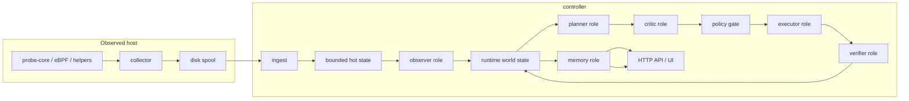

# AI SRE Agent

[](https://github.com/jfang2048/ai_sre_agent_pub/releases/tag/v0.95)
[](LICENSE)
[](https://github.com/jfang2048/ai_sre_agent_pub/actions/workflows/ci.yml)
[](#runtime-shape)

AI SRE Agent is a push-first incident evidence platform for Linux, Kubernetes,
GPU, and AI infrastructure. Node-local collectors capture evidence; a central
controller governs incident analysis, action proposals, and durable RCA records.

The design keeps raw collection close to the host, controller state bounded, and
incident reasoning inspectable after the fact. The controller supports both a
legacy deterministic path and a bounded adaptive RCA loop.

The controller is skills-first: every operational capability is exposed through
a governed contract that can be scored, policy-checked, normalized, audited, and
replayed. RAG is a read-only knowledge skill. Retrieval may add evidence, but it
cannot authorize, branch, retry, or execute production-impacting work.

This repository is a reusable platform slice rather than a single-purpose
application. Seeded local data exists for development and UI validation only; it
is not part of the public product boundary.

中文：[`README.zh-CN.md`](README.zh-CN.md)

## Platform artifact scope

This README is the operator-facing source of truth. Keep the repository small: code owns behavior, tests own regression proof, and generated evidence stays out of git. The maintained platform slice is:

- node-local probe/collector evidence capture;
- controller-side ingest, incident workflow, policy, and artifact persistence;
- GPU observability hooks through NVML/probe-core;
- a runnable Kubernetes GPU demo in `examples/gpu-platform-sre/`.

## Quick start

The core build follows the versions pinned in CI: Go 1.26.8, Node.js 22 for the
web UI, and Python 3.11 for the optional Python runtime. A C++20 compiler plus
protobuf and zlib enables the primary `probe-core` binary; the build reports a
clear fallback when those native dependencies are unavailable.

```bash
git clone https://github.com/jfang2048/ai_sre_agent_pub.git
cd ai_sre_agent_pub
git switch v0.95

make build
make test
make run-both
```

The local stack serves the web UI and API at <http://127.0.0.1:8080/>. Press
`Ctrl+C` to stop it. Run `make help` for focused build, evaluation, deployment,
and security targets.

## Unix design contract

`v0.95` treats operability as an interface, not a dashboard feature:

- each command has one primary job and composes through files, environment variables, stdin/stdout, and process exit codes;
- machine-readable results go to stdout while diagnostics go to stderr;
- collectors own collection, controllers own policy, and publish helpers own public-release filtering;
- generated state and optional corpora stay outside Git, while reviewed source is the only default publish input;
- unsafe or ambiguous release inputs fail closed instead of being guessed into a public artifact.

The public-release checks are ordinary shell entry points, so they work locally and in CI without a separate service:

```bash
make public-repo-audit
make test-publish-privacy
make test-dataset-fetch
```

The first command audits current content, commit identities, and historical paths. The second locks the publisher's core guarantees: untracked files are omitted and credential-shaped content is rejected. The third verifies that dataset acquisition remains a line-oriented, HTTPS-only stream without using the network.

## GPU Platform SRE Demo

A runnable Kubernetes GPU platform SRE demo lives in [`examples/gpu-platform-sre/`](examples/gpu-platform-sre/). It keeps vLLM/KServe as external workloads and uses the existing collector/controller stack for GPU observability, incident evidence, and rollback practice.

## Implementation anchors

| Area                     | Entry point                                                                                                                                                                                                      | Responsibility                                                                                            |
| ------------------------ | ---------------------------------------------------------------------------------------------------------------------------------------------------------------------------------------------------------------- | --------------------------------------------------------------------------------------------------------- |
| Host probe               | [`cpp/probe_core/main.cpp`](cpp/probe_core/main.cpp)                                                                                                                                                             | CLI parsing, host CPU and memory collection, `/proc` parsing, and compression                             |
| GPU sampling             | [`cpp/probe_core/gpu_nvml.cpp`](cpp/probe_core/gpu_nvml.cpp)                                                                                                                                                     | NVML device and process samples                                                                           |
| Collector                | [`backend/internal/collector/collector.go`](backend/internal/collector/collector.go)                                                                                                                             | Collector construction, identity, and external metric command parsing                                     |
| Spool and transport      | [`spool.go`](backend/internal/collector/spool/spool.go) and [`client.go`](backend/internal/collector/transport/client.go)                                                                                        | Durable offsets, batching, acknowledgements, and TLS                                                      |
| Controller runtime       | [`controller.go`](backend/internal/controller/controller.go), [`agent.go`](backend/internal/controller/agentcore/agent.go), and [`workflow_engine.go`](backend/internal/controller/agentcore/workflow_engine.go) | API assembly, query service, and workflow orchestration                                                   |
| Skills and adaptive loop | [`backend/internal/controller/agentcore/`](backend/internal/controller/agentcore/)                                                                                                                               | Tool contracts, scoring, query shaping, normalization, planning, critique, verification, and replay state |
| Durable artifacts        | [`workflow_artifacts.go`](backend/internal/controller/agentcore/workflow_artifacts.go) and [`workflow_orchestrator.go`](backend/internal/controller/agentcore/workflow_orchestrator.go)                          | Artifact chains plus BoltDB/Postgres durable stores                                                       |
| Web UI                   | [`frontend/src/`](frontend/src/)                                                                                                                                                                                 | React 18 + Vite operator interface                                                                        |

## Data-plane source policy

The current collector is kernel-first where the repo can do that without inventing a new runtime:

- host CPU scheduler counters: `perf_event_open` software counters in `cpp/probe_core/main.cpp`
- per-process accounting: `cpp/probe_core/process_kernel_collector.cpp` using `taskstats` generic-netlink
- interface/link counters: `cpp/probe_core/network_kernel_collector.cpp` using `rtnetlink`
- socket queue state: `cpp/probe_core/network_kernel_collector.cpp` using `sock_diag`
- runtime event flow: the probe-core eBPF socket path now accepts a versioned binary record format in `cpp/probe_core/kernel_event_protocol.cpp`, with JSON fallback for compatibility
- GPU: `cpp/probe_core/gpu_nvml.cpp` through NVML only; the probe-core hot path no longer shells out to `nvidia-smi`

The remaining file-based paths are explicit fallback or cold-path mechanisms:

- PSI: `/proc/pressure/*`
- cgroup stats: `/sys/fs/cgroup/...`
- disk counters and queue attributes: `/sys/block/*` with `/proc/diskstats` fallback
- process reconciliation and top-row enrichment: periodic `/proc` scans plus `/proc/<pid>/smaps_rollup` and `/proc/<pid>/fd`
- hardware discovery: infrequent `/proc` and `/sys` reads under `hardware.refresh_interval`

Privilege reality in this tree:

- `CAP_BPF` or `CAP_SYS_ADMIN` still gates the primary eBPF path
- `CAP_PERFMON` or `CAP_SYS_ADMIN` is the clean path for perf-based host counters
- `CAP_NET_ADMIN` or `CAP_SYS_ADMIN` is the expected privilege boundary for the taskstats/sock_diag process path
- when those capabilities are missing, the collector stays up and falls back instead of pretending the kernel path exists

## Why this exists

Most narrow SRE automation prototypes fail in the same places:

- they assume telemetry is complete and always fresh
- they treat retries as free
- they hide reasoning inside one large in-memory object
- they blur advisory output and executable action
- they make recovery impossible once the controller restarts

This repo is built for the opposite constraints:

- collector-side evidence can be delayed, dropped, or replayed
- controller memory and file descriptors are bounded resources
- execution needs policy, approval, idempotency, and post-action verification
- operators need compact artifacts they can inspect under pressure

## Runtime shape



The controller still runs these logical agents in one process. The important boundary is the persisted state and artifact contract, not the process boundary. The adaptive loop is bounded by `AdaptiveMaxIterations`, `AdaptiveMaxToolCalls`, same-tool retry limits, hypothesis rewrite limits, and a time budget. Each meaningful step emits compact records with:

- schema version
- producer and consumer
- workflow / incident / correlation IDs
- timestamps and status
- input artifact IDs
- evidence references
- replay flags

The chain lives inside the RCA evidence package and is exposed through the workflow APIs.

## Runtime modes

`WorkflowConfig.RuntimeMode` controls the migration path:

| Mode                   | Behavior                                                                                                                                              |
| ---------------------- | ----------------------------------------------------------------------------------------------------------------------------------------------------- |
| `legacy_deterministic` | Preserves the legacy fixed pipeline and is the default safe posture.                                                                                  |
| `hybrid_adaptive`      | Runs the scene-aware deterministic pipeline, then inserts the governed adaptive loop before the analysis-to-validation handoff.                       |
| `full_adaptive`        | Uses the same bounded controller-governed adaptive loop with the full planner/critic/verifier surface, richer scoring, and experience-memory biasing. |

Legacy aliases are still accepted for backward compatibility:

- `deterministic` -> `legacy_deterministic`
- `hybrid` -> `hybrid_adaptive`
- `adaptive` -> `full_adaptive`

The migration flags now live on `WorkflowConfig` as well as `runtime_mode`:

- `adaptive_runtime_enabled`
- `autonomous_tool_selection_enabled`
- `planner_critic_enabled`
- `tool_experience_memory_enabled`
- `cheap_first_selection_enabled`
- `max_no_progress_rounds`
- `max_uncertainty_plateau_rounds`
- `adaptive_parallel_read_only_limit`

Set `SRE_AGENT_WORKFLOW_RUNTIME_MODE=hybrid_adaptive` or `SRE_AGENT_WORKFLOW_RUNTIME_MODE=full_adaptive` to enable the new path. If the mode is unset or invalid, the controller normalizes back to `legacy_deterministic`.

## Logical agents and ownership

| Role        | Owns                                                                  | Reads                                               | Writes                                      | May change live state?                  |
| ----------- | --------------------------------------------------------------------- | --------------------------------------------------- | ------------------------------------------- | --------------------------------------- |
| observer    | current window summary and runtime state                              | collector snapshots, bounded history                | observation + objective artifacts           | no                                      |
| planner     | next objective, candidate tool/action proposals                       | runtime state, evidence gaps, hypotheses            | planner proposal + tool decision artifacts  | no                                      |
| critic      | hidden-assumption, safety, and no-progress checks                     | planner proposal, tool contract, policy posture     | critique report + branch decision artifacts | no                                      |
| policy gate | execution eligibility                                                 | proposal artifact, controller policy, tool contract | execution-plan / execution-intent artifact  | no                                      |
| executor    | governed tool calls                                                   | policy-approved tool decision                       | tool-result summary / execution result      | only when posture and approval allow it |
| verifier    | uncertainty, confidence, contradiction, gap, and action-effect deltas | tool result, before/after runtime state             | progress assessment + verification delta    | no                                      |
| memory      | final incident record                                                 | full chain                                          | final incident artifact, incident memory    | no                                      |

The old `analysis_agent` and `validation_action_agent` code paths still exist. The adaptive loop adds explicit `planner`, `critic`, `executor`, and `verifier` turns inside the same controller process and writes them to `DurableRun.AdaptiveDialogue`.

## Artifact chain

The incident workflow still emits the compact incident chain:

1. `observation_summary`
2. `anomaly_finding`
3. `root_cause_hypothesis`
4. `remediation_proposal`
5. `execution_plan`
6. `execution_result`
7. `verification_result`
8. `incident_report`

Hybrid and adaptive runs also append adaptive artifacts such as `runtime_state`, `objective_state`, `planner_proposal`, `tool_candidate_scores`, `critique_report`, `tool_decision`, `tool_result_summary`, `progress_assessment`, `branch_decision`, `execution_intent`, `stop_decision`, `verification_delta`, and `experience_memory_update`. Each artifact is compact by design. Raw telemetry stays out of the handoff. The artifact carries evidence IDs, decisions, scores, deltas, normalized tool results, and short references so downstream stages can reload details without copying large payloads through every step.

New adaptive artifact fields are versioned and decoded with defaults so older evidence packages remain readable. Replay never re-executes side effects; state-changing or profiling skills remain proposal-only, dry-run, or approval-gated unless an explicit operator-approved posture changes that boundary.

The concrete schema is defined in `backend/internal/controller/agentcore/workflow_artifacts.go` and related tests.

## Adaptive control and deterministic boundary

Model output can propose evidence gaps, hypotheses, tool candidates, contradiction checks, query refinements, and stop-or-continue recommendations. It does not decide execution.

Execution is still gated by controller code:

- tool contract validation
- actuator safety classification
- policy status
- approval state
- idempotency key reuse
- timeout and retry budgets
- rollback requirement checks
- post-action verification
- optional rollback handling

Contracts also carry preferred query hints plus freshness and scope sensitivity. The adaptive loop uses those fields to shape query windows and scopes before each autonomous tool call.

The skill registry surface exposed at `/api/v1/controller/tools` includes the stable name, version, capability family, schemas, read-only posture, safety class, approval requirement, autonomy eligibility, cost/freshness/scope sensitivity, expected information gain, policy status, and recent low-yield/result-quality signals. These fields are the operator-facing contract for skills-first control and must stay backward-compatible.

Default posture remains conservative:

- dry-run on
- approval required
- impactful and destructive paths blocked
- validation defaults to read-only

## Resource model

The code is written around bounded cost, not idealized throughput.

- **Memory**: controller hot state and evidence references are bounded; artifact payloads are compact summaries, not telemetry dumps.
- **FD usage**: the collector spools to disk, the controller persists artifacts through the artifact manager, and the workflow avoids keeping per-incident files open longer than a single write or read path.
- **Concurrency**: action execution is explicitly bounded. Validation loops run under tool-call and iteration budgets.
- **Queue growth**: replay and spool paths are bounded and visible. The workflow artifact chain does not create an unbounded side queue.
- **Serialization cost**: the artifact chain is small enough to ship inside the evidence package and cheap enough to decode during debugging.

## Failure model

Things that can and do go wrong:

- stale or partial telemetry
- controller restart during an incident
- action proposal without enough rollback data
- verification that cannot prove improvement because the evidence window is weak
- duplicate requests for the same incident shape

The current design handles those cases by preserving state, surfacing uncertainty, and preferring proposal-only over unsafe execution.

## Observability and operator surfaces

Useful endpoints during an incident:

- `GET /api/v1/agent/rca`
- `GET /api/v1/agent/workflow/runs`
- `GET /api/v1/agent/workflow/runs/{run_id}`
- `GET /api/v1/agent/workflow/evidence/{run_id}`
- `GET /api/v1/agent/workflow/artifacts/{run_id}`
- `GET /api/v1/agent/workflow/audit`
- `GET /api/v1/controller/tools`
- `GET /api/v1/status`
- `GET /api/v1/ingest/status`

Useful files on disk:

- `data/agent/workflow_runs.db`
- `data/agent/workflows/messages/<run_id>/`
- `data/agent/workflows/evidence/<run_id>/package.json`
- artifact-manager metadata and payload roots

Concrete code paths behind those surfaces:

- HTTP/UI routes are registered from `backend/internal/controller/controller.go`
- query/RCA output is assembled by `backend/internal/controller/agentcore/agent.go`
- durable artifact manifests come from `backend/internal/controller/agentcore/workflow_artifacts.go`
- tool contracts come from `backend/internal/controller/agentcore/workflow_tool_contracts.go`
- adaptive state and decisions come from `backend/internal/controller/agentcore/adaptive_runtime.go`
- experience-weighted tool priors come from `backend/internal/controller/agentcore/workflow_tool_experience.go`

## Tool architecture and closed-loop inspection order

The repository now exposes the autonomous incident loop as concrete controller code, not as a hidden prompt convention.

Use this file order when auditing or changing the runtime:

1. `backend/internal/controller/agentcore/workflow_engine.go`
2. `backend/internal/controller/agentcore/workflow_tools.go`
3. `backend/internal/controller/agentcore/workflow_tool_contracts.go`
4. `backend/internal/controller/agentcore/tool_contracts.go`
5. `backend/internal/controller/agentcore/tool_scoring.go`
6. `backend/internal/controller/agentcore/query_shaping.go`
7. `backend/internal/controller/agentcore/tool_normalization.go`
8. `backend/internal/controller/agentcore/adaptive_runtime.go`
9. `backend/internal/controller/agentcore/adaptive_runtime_state.go`
10. `backend/internal/controller/agentcore/workflow_artifacts.go`

The governed loop is:

1. inspect runtime state and unresolved evidence gaps
2. generate tool candidates from the rich contract registry
3. score and shortlist candidates with deterministic policy-aware scoring
4. shape the next query, scope, and window
5. call the tool through the governed tool manager
6. normalize the result into a replay-safe summary
7. update adaptive state, scope hints, and hypothesis ranking
8. assess progress, low-yield behavior, and stop conditions
9. continue, branch, stop, or hand off to validation/execution

The tool catalog is code-owned in `backend/internal/controller/agentcore/workflow_tool_contracts.go` and related contract tests.

## Deployment boundary

This repo does not assume one controller forever.

- run metadata can move to Postgres
- artifact metadata can move to a shared backend
- payloads can move from filesystem to S3
- hot state is still local to one active writer
- HA followers still reject ingest writes

That means durability is better than it was, but the system is not yet a fully distributed workflow runtime.

## Read next

- [`examples/gpu-platform-sre/`](examples/gpu-platform-sre/) for the runnable GPU demo
- [`deploy/`](deploy/) for local, container, and Kubernetes deployment paths
- [`dataset/README.md`](dataset/README.md) for the public-data boundary
- [`tests/README.md`](tests/README.md) for the verification strategy
- [`SECURITY.md`](SECURITY.md) for disclosure and public-repository hygiene
- [`CONTRIBUTING.md`](CONTRIBUTING.md) for change and verification rules
