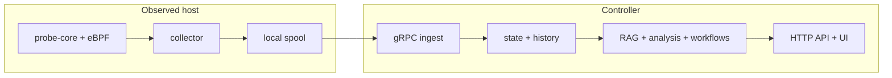

# AI SRE Agent


> Push-first observability and guarded automation for AI/GPU infrastructure. The collector keeps host-side sampling cheap and close to the machine; the controller turns that telemetry into analysis, retrieval, RCA, and guarded operator output.

| Documentation | Start here |
| --- | --- |
| English | [Overview](docs/en/01-overview.md) · [Pipeline Deep Dive](docs/en/02-pipeline-deep-dive.md) · [Getting Started](docs/en/03-getting-started.md) · [Architecture](docs/en/04-architecture.md) |
| 中文 | [中文首页](README.zh-CN.md) · [概览](docs/zh/01-overview.md) · [Pipeline 深度解析](docs/zh/02-pipeline-deep-dive.md) · [快速开始](docs/zh/03-getting-started.md) · [架构](docs/zh/04-architecture.md) |

<p align="center">
  
</p>

If you want one code-grounded document that explains the real path from the first sampled metric to the final answer, start with:

- [Pipeline Deep Dive](docs/en/02-pipeline-deep-dive.md)
- [Pipeline 深度解析](docs/zh/02-pipeline-deep-dive.md)

## Why This Is Not Just A Chatbot Over Metrics

This repository is intentionally built as an evidence pipeline, not as “send a dashboard snapshot to an LLM.”

| Step | What happens now | Why that matters |
| --- | --- | --- |
| 1. collect | the `collector` samples host, process, GPU, security, and runtime-integrity signals close to the machine | short-lived host evidence is captured before transport or controller delay blurs it |
| 2. suppress | unchanged low-churn metrics, cached helper payloads, and near-identical process lists are suppressed | steady-state overhead, spool size, and network bytes stay bounded |
| 3. queue | batches go to the local spool before send | controller/network stalls do not immediately become telemetry loss |
| 4. analyze | the `controller` turns hot state into trends, weak-signal clusters, and retrieval decisions | the expensive reasoning path sees structured evidence, not raw noise |
| 5. retrieve | RAG is used only when symptom context is strong enough | retrieved text is more relevant and cheaper to attach |
| 6. respond | the final answer contains diagnosis, confidence, evidence, and next checks | operators get something actionable, not only anomaly narration |

That split is implemented in the real runtime modules under [`backend/internal/collector/`](backend/internal/collector/), [`backend/internal/controller/ingest/`](backend/internal/controller/ingest/), [`backend/internal/controller/agentcore/`](backend/internal/controller/agentcore/), and [`backend/internal/controller/rag/`](backend/internal/controller/rag/).

## What This Project Is

AI SRE Agent is built around two maintained runtime roles and one controller-side knowledge path:

| Part | What it does | Why it exists |
| --- | --- | --- |
| `collector` | Runs on or near the observed host, gathers telemetry, and replays through a local spool when the controller is temporarily unavailable. | Keeps short-lived host evidence local and avoids turning controller reachability into observability loss. |
| `controller` | Ingests telemetry, serves the HTTP API and web UI, stores current state and optional history, and runs analysis and workflows. | Keeps heavier storage, retrieval, and reasoning work off the monitored host. |
| `dataset` + RAG | Provides a built-in seed dataset and controller-side retrieval service for operational context. | Grounds agent output in repository-local knowledge instead of relying on model memory alone. |

## Read The System As One Pipeline

If you want to understand the repository quickly, read it as one bounded pipeline:

| Pipeline stage | Main code | Why the stage exists |
| --- | --- | --- |
| host sampling | [`cpp/probe_core/`](cpp/probe_core/), [`backend/internal/collector/collector.go`](backend/internal/collector/collector.go) | capture short-lived node-local evidence before it disappears |
| local suppression and pacing | [`backend/internal/collector/metric_suppression.go`](backend/internal/collector/metric_suppression.go), [`backend/internal/collector/aux_sampling.go`](backend/internal/collector/aux_sampling.go), [`backend/internal/collector/process_payload_suppression.go`](backend/internal/collector/process_payload_suppression.go) | keep the collector cheap enough for production hosts |
| queue and send | [`backend/internal/collector/spool/spool.go`](backend/internal/collector/spool/spool.go), [`backend/internal/collector/transport/client.go`](backend/internal/collector/transport/client.go) | decouple collection from controller and network stalls |
| ingest and hot state | [`backend/internal/controller/ingest/server.go`](backend/internal/controller/ingest/server.go), [`backend/internal/controller/ingest/store.go`](backend/internal/controller/ingest/store.go) | rebuild one coherent controller-owned state model |
| trend and weak-signal analysis | [`backend/internal/controller/agentcore/workflow_eventization.go`](backend/internal/controller/agentcore/workflow_eventization.go), [`backend/internal/controller/agentcore/workflow_engine.go`](backend/internal/controller/agentcore/workflow_engine.go) | separate “one metric is deteriorating” from “several small symptoms combine into risk” |
| retrieval and prompting | [`backend/internal/controller/rag/`](backend/internal/controller/rag/), [`backend/internal/controller/agentcore/prompts.go`](backend/internal/controller/agentcore/prompts.go) | add runbooks and prior cases only when they improve the answer |
| response and UI | [`backend/internal/controller/agentcore/agent.go`](backend/internal/controller/agentcore/agent.go), [`frontend/src/components/Insights/`](frontend/src/components/Insights/) | turn evidence into diagnosis, checks, and operator-facing views |

## Who These Docs Are For

| Reader | Best starting point | What you should expect |
| --- | --- | --- |
| SRE / developer | [Pipeline Deep Dive](docs/en/02-pipeline-deep-dive.md) | file-level, mechanism-level explanation from first sample to final response |
| operator | [Getting Started](docs/en/03-getting-started.md) and [UI Guide](docs/en/08-ui-guide.md) | how to run the stack, verify it, and read the investigation console |
| architect / reviewer | [Architecture](docs/en/04-architecture.md) and [Codebase Map](docs/en/09-codebase-map.md) | runtime boundaries, storage choices, and where responsibilities live |
| product / business stakeholder | [Overview](docs/en/01-overview.md) and [Control-Plane Analysis](docs/en/07-control-plane-analysis.md) | why the system separates cheap symptom detection from more expensive root-cause reasoning |

## Typical Questions This Repo Helps Answer

These are representative questions the current codebase is designed to support:

| Question | Main path behind the answer |
| --- | --- |
| "Why is this GPU training node slow right now?" | collector metrics + controller ingest + deterministic findings + optional RAG |
| "Is this storage latency or just CPU saturation?" | probe-core disk and CPU metrics + controller-side operational findings |
| "What exactly happens between the first sampled point and the final RCA answer?" | [docs/en/02-pipeline-deep-dive.md](docs/en/02-pipeline-deep-dive.md) |
| "Which file should I change to adjust prompt behavior?" | [`docs/en/10-core-files.md`](docs/en/10-core-files.md) + [`docs/en/12-prompts-and-customization.md`](docs/en/12-prompts-and-customization.md) |
| "How do I replace the dataset with my own runbooks?" | [`docs/en/11-dataset-and-rag.md`](docs/en/11-dataset-and-rag.md) |
| "What happens when telemetry is stale?" | [`docs/en/05-data-flow.md`](docs/en/05-data-flow.md) + [`docs/en/15-deployment.md`](docs/en/15-deployment.md) |

## Core Architecture



Primary configuration files:

- [`configs/collector.yaml`](configs/collector.yaml)
- [`configs/controller.yaml`](configs/controller.yaml)
- [`configs/container/collector.yaml`](configs/container/collector.yaml)
- [`configs/container/controller.yaml`](configs/container/controller.yaml)

## Deployment Shapes

The repo now supports four explicit deployment modes in config:

| Mode | Where it fits | Typical assets |
| --- | --- | --- |
| `local-dev` | source checkout or single-node debugging | [`configs/controller.yaml`](configs/controller.yaml), [`configs/collector.yaml`](configs/collector.yaml), [`scripts/run-local.sh`](scripts/run-local.sh) |
| `standalone` | one controller host plus one or more external collectors | [`deploy/docker/`](deploy/docker/), [`deploy/systemd/`](deploy/systemd/) |
| `cluster-lite` | one controller `Deployment` plus collector `DaemonSet` in one Kubernetes cluster | [`deploy/k8s/push-first/`](deploy/k8s/push-first/), Helm defaults in [`deploy/charts/sre-agent/`](deploy/charts/sre-agent/) |
| `distributed` | replicated controller with external HA and optional external vector backend | Helm with `controller.ha.enabled=true` and external backend values in [`deploy/charts/sre-agent/values.yaml`](deploy/charts/sre-agent/values.yaml) |

In all four modes, the data plane stays node-local and the control plane stays centralized. The main difference is where state lives and how much shared infrastructure you add.

## Quick Start

Recommended local path:

```bash
cp .env.example .env
make container-build
make container-up-host-observer
curl -fsS http://127.0.0.1:8080/healthz
curl -fsS http://127.0.0.1:8080/readyz
curl -fsS http://127.0.0.1:8080/api/v1/status | jq '.deployment'
```

Open `http://127.0.0.1:8080/` after the health check succeeds.

What a good first boot looks like:

- `GET /healthz` returns success
- `GET /readyz` returns success after startup checks complete
- `GET /api/v1/status` returns controller runtime status
- `GET /api/v1/status.deployment` shows the active deployment mode and data root
- the UI loads even if RAG is disabled by default
- if you have not enabled LLM or RAG, the stack is still valid for telemetry, API, and UI verification

Stop the local stack:

```bash
make container-down-host-observer
```

For validation steps, source-mode startup, and split-role deployment guidance:

- [English getting started](docs/en/03-getting-started.md)
- [中文快速开始](docs/zh/03-getting-started.md)

## Documentation Map

| Topic | What it covers | English | 中文 |
| --- | --- | --- | --- |
| Overview | Project scope, runtime roles, and recommended reading order | [docs/en/01-overview.md](docs/en/01-overview.md) | [docs/zh/01-overview.md](docs/zh/01-overview.md) |
| Pipeline deep dive | Full code-grounded path from host sampling to final response, including what/why/how/tradeoffs per major stage | [docs/en/02-pipeline-deep-dive.md](docs/en/02-pipeline-deep-dive.md) | [docs/zh/02-pipeline-deep-dive.md](docs/zh/02-pipeline-deep-dive.md) |
| Collector queue and compaction | Why suppression, queueing, replay, and bounded delivery exist before send | [docs/en/06-collector-queue-and-compaction.md](docs/en/06-collector-queue-and-compaction.md) | [docs/zh/06-collector-queue-and-compaction.md](docs/zh/06-collector-queue-and-compaction.md) |
| Control-plane analysis | How telemetry becomes trends, weak-signal events, retrieval plans, and recommendations | [docs/en/07-control-plane-analysis.md](docs/en/07-control-plane-analysis.md) | [docs/zh/07-control-plane-analysis.md](docs/zh/07-control-plane-analysis.md) |
| Getting started | Local bring-up, verification, and source-mode alternatives | [docs/en/03-getting-started.md](docs/en/03-getting-started.md) | [docs/zh/03-getting-started.md](docs/zh/03-getting-started.md) |
| Architecture | Runtime boundaries, storage locations, and controller services | [docs/en/04-architecture.md](docs/en/04-architecture.md) | [docs/zh/04-architecture.md](docs/zh/04-architecture.md) |
| Data flow | Concrete metric-to-answer walkthroughs focused on runtime flow and examples | [docs/en/05-data-flow.md](docs/en/05-data-flow.md) | [docs/zh/05-data-flow.md](docs/zh/05-data-flow.md) |
| UI guide | Investigation console pages, screenshots, and operator reading order | [docs/en/08-ui-guide.md](docs/en/08-ui-guide.md) | [docs/zh/08-ui-guide.md](docs/zh/08-ui-guide.md) |
| Codebase map | Repository layout, execution path, and where to modify each subsystem | [docs/en/09-codebase-map.md](docs/en/09-codebase-map.md) | [docs/zh/09-codebase-map.md](docs/zh/09-codebase-map.md) |
| Core files | File-level responsibilities for entrypoints, collector, controller, RAG, prompts, and runtime glue | [docs/en/10-core-files.md](docs/en/10-core-files.md) | [docs/zh/10-core-files.md](docs/zh/10-core-files.md) |
| Dataset and RAG | Seed dataset layout, indexing, rebuild/update workflow, and RAG tradeoffs | [docs/en/11-dataset-and-rag.md](docs/en/11-dataset-and-rag.md) | [docs/zh/11-dataset-and-rag.md](docs/zh/11-dataset-and-rag.md) |
| Prompts and customization | Prompt sources, runtime assembly, safety boundaries, and safe edits | [docs/en/12-prompts-and-customization.md](docs/en/12-prompts-and-customization.md) | [docs/zh/12-prompts-and-customization.md](docs/zh/12-prompts-and-customization.md) |
| Metrics and signals | Collected metrics, structured signals, and diagnostic value | [docs/en/13-metrics-and-signals.md](docs/en/13-metrics-and-signals.md) | [docs/zh/13-metrics-and-signals.md](docs/zh/13-metrics-and-signals.md) |
| Hardware considerations | Hardware discovery, adaptive thresholds, and support limits | [docs/en/14-hardware-considerations.md](docs/en/14-hardware-considerations.md) | [docs/zh/14-hardware-considerations.md](docs/zh/14-hardware-considerations.md) |
| Deployment | Docker, Kubernetes, Helm, and systemd entry points | [docs/en/15-deployment.md](docs/en/15-deployment.md) | [docs/zh/15-deployment.md](docs/zh/15-deployment.md) |
| FAQ | Common operator and contributor questions | [docs/en/16-faq.md](docs/en/16-faq.md) | [docs/zh/16-faq.md](docs/zh/16-faq.md) |

Detailed operator and reference material remains under [`docs/`](docs/README.md), including:

- [Usage guide](docs/operations/usage.md)
- [Configuration reference](docs/operations/configuration.md)
- [API reference](docs/reference/api.md)
- [Metrics reference](docs/reference/metrics.md)
- [RAG reference](docs/reference/rag_knowledge_engine.md)
- [LLM schema reference](docs/reference/llm_schema.md)

## Read By Goal

If you are new here and do not want to guess where to start:

| Goal | Read this first | Then read |
| --- | --- | --- |
| run the stack locally | [docs/en/03-getting-started.md](docs/en/03-getting-started.md) | [docs/en/15-deployment.md](docs/en/15-deployment.md) |
| understand the runtime split | [docs/en/04-architecture.md](docs/en/04-architecture.md) | [docs/en/05-data-flow.md](docs/en/05-data-flow.md) |
| trace one symptom through the whole real pipeline | [docs/en/02-pipeline-deep-dive.md](docs/en/02-pipeline-deep-dive.md) | [docs/en/10-core-files.md](docs/en/10-core-files.md) |
| understand why there is a queue and why data is suppressed before send | [docs/en/06-collector-queue-and-compaction.md](docs/en/06-collector-queue-and-compaction.md) | [docs/en/13-metrics-and-signals.md](docs/en/13-metrics-and-signals.md) |
| understand single-variable trends versus multivariate weak-signal analysis | [docs/en/07-control-plane-analysis.md](docs/en/07-control-plane-analysis.md) | [docs/en/02-pipeline-deep-dive.md](docs/en/02-pipeline-deep-dive.md) |
| understand the investigation UI | [docs/en/08-ui-guide.md](docs/en/08-ui-guide.md) | [docs/en/05-data-flow.md](docs/en/05-data-flow.md) |
| modify RAG or dataset behavior | [docs/en/11-dataset-and-rag.md](docs/en/11-dataset-and-rag.md) | [docs/en/10-core-files.md](docs/en/10-core-files.md) |
| modify prompt behavior safely | [docs/en/12-prompts-and-customization.md](docs/en/12-prompts-and-customization.md) | [docs/en/10-core-files.md](docs/en/10-core-files.md) |

## Repository Structure

| Path | Purpose |
| --- | --- |
| [`backend/`](backend/) | Controller, collector, ingest, RAG, API, and workflow code |
| [`cpp/`](cpp/) | Native probe-core runtime and related C++ components |
| [`frontend/`](frontend/) | Web UI |
| [`configs/`](configs/) | Source-mode and container-mode configuration |
| [`dataset/`](dataset/) | Seed RAG dataset and dataset tooling |
| [`deploy/`](deploy/) | Docker, Kubernetes, Helm, and systemd deployment assets |
| [`docs/`](docs/) | Bilingual guides, operations notes, and reference material |
| [`scripts/`](scripts/) | Build, run, bootstrap, and helper scripts |
| [`tests/`](tests/) | Backend, integration, end-to-end, and UI tests |

## Project Links

- [Documentation index](docs/README.md)
- [Contributing](CONTRIBUTING.md)
- [Security](SECURITY.md)
- [Changelog](CHANGELOG.md)
- [License](LICENSE)
