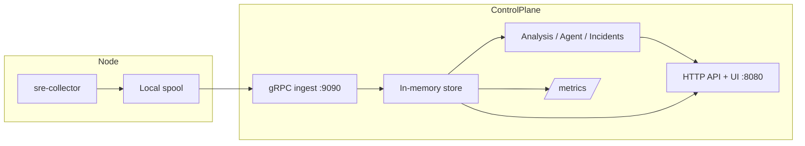

# AI SRE Agent (v0.1)

Kernel-first distributed observability for Linux. The system is push-first by default:

- `sre-collector` runs on monitored hosts, collects metrics/process/log/GPU data, and pushes via gRPC.
- `sre-controller` ingests batches, keeps a hot in-memory store, serves API/UI/Prometheus, and runs optional analysis/agent workflows.

Chinese quick start and summary are included below.

## What this repository currently ships

- Push-first telemetry over gRPC (`/api/v1/fleet` as the main fleet API).
- Per-process cross-resource ranking API: `/api/v1/top/programs`.
- UI resource pages/tabs for `CPU`, `GPU`, `Memory`, `Network`, `Disk`, `Disk I/O`, and `Logs`.
- GPU fleet aggregation and K8s-friendly GPU snapshots.
- Optional incident-context orchestration, deterministic analysis, LLM/RAG enrichment, and external checks.

---


## Architecture



## Quick start

```bash
./scripts/run-local.sh
```

Then open:

- `http://127.0.0.1:8080/` (inline/simple UI fallback)
- `http://127.0.0.1:8080/ui` (full SPA, if built assets exist)
- `http://127.0.0.1:8080/api/v1/fleet`
- `http://127.0.0.1:8080/api/v1/top/programs?limit=50`

## UI Screenshot


### 中文快速开始

执行：

```bash
./scripts/run-local.sh
```

然后访问：

- `http://127.0.0.1:8080/`（内置简版 UI）
- `http://127.0.0.1:8080/ui`（若存在前端构建产物）
- `http://127.0.0.1:8080/api/v1/fleet`
- `http://127.0.0.1:8080/api/v1/top/programs?limit=50`

## Resource ranking model and UI pages

`/api/v1/top/programs` provides:

- `programs`: cross-category ranked processes.
- `summary`: top process per category.
- `resource_pages`: detailed page payloads used by the UI tabs/pages.

Per-process ranking includes:

- Current values (`signal_values`): latest observed values.
- Overall totals (`signal_totals`, `category_totals`): cumulative usage.
- Frequency (`signal_frequency`, `category_frequency`): how often signals appear.
- Log severity counts (`log_errors`, `log_warnings`): warning/error pressure.

### Disk vs Disk I/O

- `Disk`: cumulative storage footprint (for example total bytes read/written over time, file descriptor pressure).
- `Disk I/O`: live throughput and operation pressure (bytes/s, syscall/event pressure).

Use `Disk` for “who consumed most overall storage activity” and `Disk I/O` for “who is hottest right now.”

### Why a ranking page can be empty

Common causes:

- `GPU`: no NVIDIA GPU/process telemetry (`nvidia-smi` unavailable or no active GPU processes).
- `Logs`: no configured log sources (`SRE_COLLECTOR_LOG_PATHS` empty) or no parseable process/service tokens in log lines.
- `Network`/deep per-process attribution: collector level too low for RCA-depth signals.

Recommended setting for full RCA-style rankings:

```bash
SRE_COLLECTOR_LEVEL=5
```

## Manual start

Build:

```bash
make build
```

Run controller:

```bash
SRE_CONTROLLER_CONFIG=./configs/controller.yaml ./build/sre-controller
```

Run collector:

```bash
SRE_COLLECTOR_CONFIG=./configs/collector.yaml ./build/sre-collector
```

Optional one-command local stack:

```bash
make run
```

## Configuration model

Configuration is file-first with env overrides:

- Controller config: `configs/controller.yaml` (or `SRE_CONTROLLER_CONFIG`).
- Collector config: `configs/collector.yaml` (or `SRE_COLLECTOR_CONFIG`).

Important:

- Collector does not support a `--level` CLI flag; set `level` in YAML or `SRE_COLLECTOR_LEVEL`.
- Root `.env.example` contains optional env examples.

## Key endpoints

| Endpoint | Purpose |
|---|---|
| `/api/v1/status` | Controller status (version, node counts, listen/scrape metadata) |
| `/api/v1/fleet` | Latest push-ingested fleet snapshot |
| `/api/v1/fleet/{collector_id}` | One collector snapshot |
| `/api/v1/top/programs` | Cross-resource per-process rankings |
| `/api/v1/gpu/nodes` | Fleet GPU view |
| `/api/v1/k8s/gpu/nodes` | K8s-friendly GPU snapshot list |
| `/api/v1/analysis/*` | Analysis APIs (enabled when analysis is enabled) |
| `/api/v1/agent/*` | Agent report/action/incident APIs (enabled when agent is enabled) |
| `/api/v1/checks`, `/api/v1/checks/history` | External dependency checks (enabled when checks enabled) |
| `/api/v1/incidents/alerts` | External alert ingestion for context orchestration |
| `/metrics` | Prometheus metrics |
| `/healthz` | Health check |

## Agent quick workflow

When `agent.enabled=true`, the agent endpoints are available under `/api/v1/agent`.

```bash
# Latest per-node reports (newest first)
curl -s http://127.0.0.1:8080/api/v1/agent/reports/latest?limit=5

# Action queue (newest updates first)
curl -s http://127.0.0.1:8080/api/v1/agent/actions?limit=10

# Mark an action completed
curl -s -X PATCH http://127.0.0.1:8080/api/v1/agent/actions/<action-id> \
  -H 'Content-Type: application/json' \
  -d '{"status":"completed","note":"applied safely"}'
```

Supported action statuses:
`proposed`, `acknowledged`, `in_progress`, `completed`, `dismissed`, `accepted`, `rejected`, `canceled`.

## Optional features

- C++ external metrics helper: `make build-proc-metrics` and set `SRE_COLLECTOR_EXT_METRICS_CMD`.
- eBPF sidecar feed: enable collector eBPF reader (`ebpf.enabled` or `SRE_COLLECTOR_EBPF_*`).
- LLM/RAG: set `SRE_AGENT_LLM_*` and `SRE_AGENT_RAG_*` env variables.

## Deployment

- Docker Compose: `docker compose up -d --build`
- Kubernetes manifests: `deploy/k8s/push-first/` (read `deploy/k8s/push-first/README.md` before apply)

## Documentation map

- Architecture: `docs/design/architecture.md`
- GPU design: `docs/design/gpu_observability.md`
- Configuration: `docs/operations/configuration.md`
- Usage: `docs/operations/usage.md`
- API reference: `docs/reference/api.md`
- Metrics reference: `docs/reference/metrics.md`
- LLM schema: `docs/reference/llm_schema.md`
- Release/readiness checklist: `docs/checklist.md`
- Contributing: `CONTRIBUTING.md`

---

## 中文速览

当前版本为 `v0.1`，系统默认采用 Push-first 模式：

- `sre-collector` 在被监控节点采集指标、进程、日志、GPU 信息并通过 gRPC 推送。
- `sre-controller` 接收批量数据，维护热内存状态，并提供 API / UI / Prometheus 指标。

### 中文 5 分钟上手

1. 一键本地启动：`./scripts/run-local.sh`
2. 打开 API：`/api/v1/fleet`、`/api/v1/top/programs?limit=50`
3. 打开 UI：`/`（简版）或 `/ui`（前端资源存在时）

### 常用手动命令（中文）

构建：

```bash
make build
```

启动 controller：

```bash
SRE_CONTROLLER_CONFIG=./configs/controller.yaml ./build/sre-controller
```

启动 collector：

```bash
SRE_COLLECTOR_CONFIG=./configs/collector.yaml ./build/sre-collector
```

### 排名与资源页说明（中文）

- 进程排名接口：`/api/v1/top/programs`
- 资源分类页：`CPU`、`GPU`、`Memory`、`Network`、`Disk`、`Disk I/O`、`Logs`
- `Disk` 偏向累计占用规模；`Disk I/O` 偏向实时吞吐和 IO 压力
- 若排名为空，常见原因是采集级别不足或数据源未配置
- 建议配置：`SRE_COLLECTOR_LEVEL=5`，日志场景下再设置 `SRE_COLLECTOR_LOG_PATHS`

### 中文文档入口

- 使用说明：`docs/operations/usage.md`
- 配置说明：`docs/operations/configuration.md`
- API 参考：`docs/reference/api.md`
- 指标说明：`docs/reference/metrics.md`
