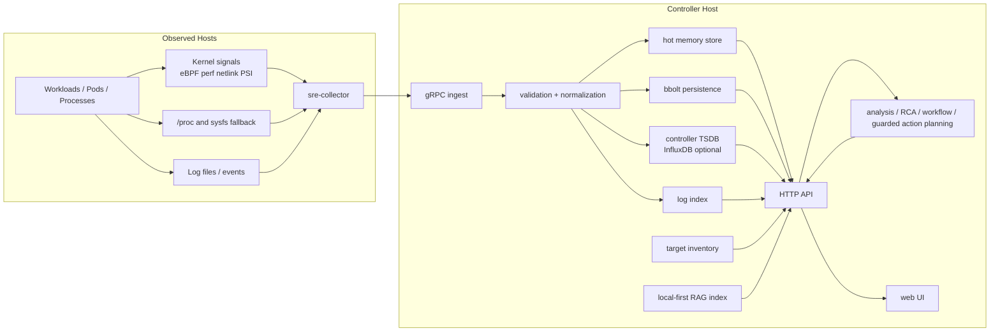
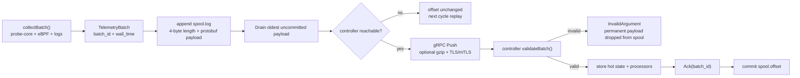
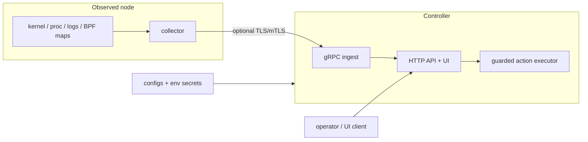
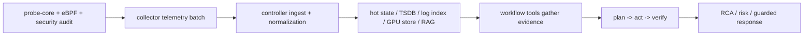

# AI SRE Agent v0.6

Release: `v0.6`  
License: `GPL-3.0`

AI SRE Agent is a split-role, container-first SRE control plane for turning low-level telemetry into evidence-backed operational analysis.
It is not "just another dashboard" and it is not "just an LLM wrapper". The project exists to close the gap between raw host telemetry and operational action: detect weak signals early, preserve enough low-level evidence to reason about them, aggregate those signals centrally, and produce explainable RCA, risk analysis, incident context, and guarded response plans.

The system is intentionally split into two runtime roles:

- `collector`: runs close to the observed machine, uses C++ probe-core for primary host/process telemetry, uses the eBPF runtime for primary kernel event telemetry, and only falls back to `/proc` compatibility collection when the primary host path is unavailable.
- `controller`: aggregates, validates, stores, analyzes, serves APIs/UI, runs the agent workflows, and optionally persists trend history and knowledge indexes.

Single-node mode still exists, but it is a convenience mode. The primary architecture is separated deployment: one or many collectors on remote machines, one controller on another machine.

Detailed operational commands are intentionally not kept in the root README. Use:

- [`docs/operations/usage.md`](docs/operations/usage.md) for single-node and separated deployment runbooks
- [`docs/operations/configuration.md`](docs/operations/configuration.md) for config/env reference
- [`docs/reference/api.md`](docs/reference/api.md) for controller API details
- [`docs/reference/metrics.md`](docs/reference/metrics.md) for collector/controller metric surfaces
- [`docs/operations/testing.md`](docs/operations/testing.md) for CI, smoke, and UI test flows
- [`deploy/k8s/push-first/README.md`](deploy/k8s/push-first/README.md) for Kubernetes-native split deployment
- [`docs/security/threat-model.md`](docs/security/threat-model.md) and [`SECURITY.md`](SECURITY.md) for security boundaries and reporting
- [`CONTRIBUTING.md`](CONTRIBUTING.md) for contribution, review, and verification workflow

## Project At a Glance

| Area | Current v0.6 choice | Why it matters |
| --- | --- | --- |
| Runtime model | Split `collector` + `controller` | Keeps host-observer privileges separate from control-plane storage, API, and workflow logic |
| Host telemetry | C++ `probe-core` primary path | Better host/process sampling fidelity than relying on `/proc` polling alone |
| Kernel/runtime telemetry | eBPF runtime primary path | Preserves short-lived event evidence for RCA, security, and joint-risk analysis |
| Compatibility mode | Explicit degraded `/proc`-oriented fallback | System still runs in restricted environments, but fidelity loss is visible and bounded |
| Transport | Push-first gRPC + local spool + replay | Short controller/network outages are replayable within spool retention bounds |
| Delivery semantics | Bounded at-least-once replay | Honest failure model: replayable, not exactly-once, no hidden durability claims |
| Controller state | Hot memory store + bbolt persistence | Low-latency APIs plus controller-local durability across restarts |
| Trend history | Optional controller-side InfluxDB | Longer RCA/trend windows without pushing a database onto every observed host |
| Reasoning model | Deterministic evidence first, optional LLM second | Keeps conclusions grounded, inspectable, and safer to operationalize |
| Knowledge retrieval | Local-first RAG with optional external vector backend | Works offline by default, but can scale out when knowledge volume grows |
| Deployment path | Many remote collectors, one or a few central controllers | Matches the actual operational topology of most SRE environments |
| Verification | Go tests + browser tests + smoke scripts | Reliability claims are backed by reproducible checks instead of docs-only promises |

## Entry Points

| If you want to... | Start here |
| --- | --- |
| Understand the architecture and trade-offs | [README.md](README.md), then Section 3 and Section 4 |
| Run the stack locally or in split mode | [`docs/operations/usage.md`](docs/operations/usage.md) |
| Tune config, retention, TSDB, inventory, or RAG | [`docs/operations/configuration.md`](docs/operations/configuration.md) |
| Integrate against controller APIs | [`docs/reference/api.md`](docs/reference/api.md) |
| Deploy the split model on Kubernetes | [`deploy/k8s/push-first/README.md`](deploy/k8s/push-first/README.md) |
| Review security boundaries and threat assumptions | [`docs/security/threat-model.md`](docs/security/threat-model.md) |
| Contribute code or docs and run the right checks | [`CONTRIBUTING.md`](CONTRIBUTING.md) |

## Operational Signal Model

This platform is intentionally not built around “collect everything at one flat cadence and hope a dashboard explains it later.”
The collector and controller separate signals by operational value, sampling cost, and decision latency:

| Tier | Examples in `v0.6` | Typical cadence / trigger | Why this cadence exists | Main operational question |
| --- | --- | --- | --- | --- |
| Tier 1: Runtime signals | CPU usage, CPU iowait, PSI, load, disk latency, queue depth, retransmits, GPU utilization | base collector loop, default `10s`, adaptive down to `2s` during emerging incidents | These signals explain the first seconds of degradation and need fast enough sampling to preserve onset shape | “Is the node actively entering contention right now?” |
| Tier 2: Operational metrics | memory usage, network throughput, disk throughput, filesystem pressure, FD usage, GPU memory | same trend-safe loop, but interpreted over rolling windows instead of single spikes | These values matter most as trends, headroom, and capacity drift | “Is the workload burning through headroom or just spiking briefly?” |
| Tier 3: Structural / telemetry integrity signals | probe-core health, runtime mode, topology/inventory context, NUMA locality, filesystem layout | lower-frequency refresh or piggybacked summaries | Operators need these to decide whether to trust missing data and whether placement/topology is part of the problem | “Are we observing the system correctly, and is placement itself part of the issue?” |
| Tier 4: Event signals | security findings, suspicious ports/processes, log bursts, retries/timeouts | event-driven or slower security audit windows (`5m` default for collector audit) | These are expensive or bursty; they are most useful as incident enrichers, not flat line charts | “Is the performance symptom correlated with a real fault, retry storm, or security-relevant event?” |

The collector’s adaptive loop is deliberately operational rather than cosmetic:

- it backs off when collector CPU or spool backlog is high, so the observer does not become the outage amplifier
- it temporarily tightens the interval when multiple pressure signals emerge and the collector still has headroom
- it returns to the configured baseline when the system is calm, instead of permanently oversampling idle nodes

In practical terms, the code is trying to preserve four things at once:

1. enough Tier-1 fidelity to catch the beginning of an incident
2. enough Tier-2 history to tell transient spikes from slow degradation
3. enough Tier-3 context to know whether the telemetry itself is degraded
4. enough Tier-4 evidence to turn “metric anomaly” into an operationally believable hypothesis

`signal -> aggregation -> analysis -> decision`

`runtime/event telemetry -> trend-safe summaries + anomaly markers -> correlated incident hints -> RCA / risk / recommendation -> guarded operator action`

Examples of the operational logic now encoded in the platform:

- CPU spike + rising iowait + disk tail latency -> likely storage bottleneck, so the first action is to inspect the hottest device/process path, not to scale CPU blindly
- low GPU utilization + rising host pressure -> likely feeder starvation or placement issue, not proof that more GPUs are needed
- retransmit growth + bursty network errors -> likely congestion or packet loss, so timeout tuning alone is the wrong first move
- rising memory usage over time -> capacity exhaustion or leak/retry amplification risk, which should be handled before reclaim and OOM turn it into an outage
- stale probe-core freshness -> missing charts may be telemetry degradation, not healthy zeros

---

## 阅读导航

| 部分 | 主要内容 | 适合谁先读 |
| --- | --- | --- |
| 第一部分 | 项目为什么存在、它解决的真实问题 | 第一次接触项目的人 |
| 第二部分 | 设计约束、工程原则、边界条件 | 想理解整体设计取舍的人 |
| 第三部分 | 总体架构、角色分工、分离部署原因 | 关注运行模型和拓扑的人 |
| 第四部分 | 主要组件、技术选择、低层工程因果 | 关注实现细节和技术路线的人 |
| 第五部分 | Collector / Controller / Agent / RAG / Security 工作流 | 关注闭环路径的人 |
| 第六部分 | Docker 与部署模型 | 关注容器化和多机部署的人 |
| 第七部分 | 仓库布局与运行时路径 | 关注目录结构和落盘位置的人 |
| 第八部分 | 测试、CI、可验证性 | 关注质量门槛和回归保障的人 |
| 第九部分 | 文档入口 | 需要继续查操作细节的人 |
| 第十至十二部分 | v0.6 变化、已知限制、截图 | 关注版本变化和边界的人 |

---

## 第一部分：为什么这个项目存在

**本部分摘要：**

- 重点不是“再做一个监控工具”，而是把“信号 -> 证据 -> 推理 -> 动作”接成闭环。
- 重点问题不是缺数据，而是跨层因果链在现有工具之间断裂。
- 运行时拆分不是附属决定，而是为了让后续所有能力有合理边界。

### 1. 问题不是“没有监控”，而是“从信号到行动的逻辑断裂”

现代生产系统并不缺少数据。真正缺少的是下面这条链路的连续性：

`内核/进程/网络/日志信号 -> 可验证的上下文 -> 因果推理 -> 结构化结论 -> 受控动作`

大部分现有系统在某一个点做得很好，但在整条链路上留下断层：

- 指标系统擅长收集和聚合，但不擅长因果解释。
- 日志系统擅长搜索文本，但不擅长跨主机、跨进程、跨指标联合推理。
- 告警系统擅长路由通知，但不擅长回答“为什么会发生”和“先做什么”。
- LLM 系统擅长语言综合，但如果没有严格的证据输入，就会把猜测包装成答案。

这个项目的存在理由，就是把这些断层接起来。

### 2. 这些问题为什么重要

这些问题重要，不是因为“可观测性很复杂”，而是因为计算机系统的真实行为本身就是跨层耦合的：

- CPU 利用率升高可能不是根因，只是调度争用、锁竞争、重试风暴或 IO stall 的表象。
- 应用超时可能不是应用 bug，而是 TCP 重传、SYN backlog、磁盘队列积压或下游连接池耗尽的结果。
- GPU 训练抖动不一定是 GPU 自己的问题，也可能是 CPU 调度、PCIe 带宽、页缓存回收或网络通信抖动导致的。
- 安全异常和性能异常往往共享同一资源路径，例如异常进程会争抢 CPU、FD、网络端口、内存和 IO。

如果系统只能展示局部指标，而不能建立跨层关系，值班工程师就只能在多个工具之间手工拼接因果链。这会带来几个直接后果：

- 响应时间拉长：问题先扩散，后解释。
- 误报增多：弱信号无法联合判断，只能靠单阈值噪声告警。
- 复盘难以复现：结论写在自然语言里，没有明确证据链和反证链。
- 自动化风险过高：没有结构化上下文时，任何“自动修复”都容易变成无审计的破坏动作。

### 3. 这个项目要解决的真实问题

AI SRE Agent 要解决的是以下几个具体问题，而不是抽象地“用 AI 做运维”：

1. 在弱信号阶段发现系统性风险，而不是等硬阈值完全触发。
2. 把跨 CPU / memory / IO / network / logs / security / GPU 的碎片信号整理成一组可验证的假设。
3. 在 controller 侧保留足够长的趋势历史，支持 RCA、风险分析、incident investigation 和 recommendation generation。
4. 让 LLM 成为“证据的综合器”，而不是“没有证据时的猜测器”。
5. 把建议、审批、执行、审计放进同一个闭环，而不是让自动化绕开控制面。
6. 在分离部署场景下工作：远端 collector 可以很多，controller 可以集中部署和统一分析。

### 4. 为什么不是把这些能力塞进单一程序

如果 collector 和 controller 强绑定在一台机器上，短期看起来简单，长期会在几个地方失效：

- **故障域耦合。** 被观测节点一旦资源耗尽，本地分析和 UI 也会一起失效。
- **伸缩方向错误。** 采集面跟随节点数量扩张；分析面跟随事件量、查询量、工作流并发和历史窗口扩张。这两类伸缩不是一回事。
- **权限模型恶化。** collector 贴近内核，可能需要 eBPF / perf / host mounts；controller 更像一个 API + storage + analysis service。把两者混在一起会扩大权限边界。
- **运维成本上升。** 每个被观测节点都背一个完整控制面，会增加存储、UI、索引、RAG、TSDB 依赖和维护成本。

因此，本项目的首要架构决定不是“要不要用 AI”，而是“先把运行时角色拆开”。

---

## 第二部分：设计约束与工程原则

**本部分摘要：**

- 先明确不能做什么，再决定系统该长成什么样。
- 采集、决策、存储、控制边界必须对应真实失效模式。
- 这些原则不是风格偏好，而是为了避免运行时角色和故障域混在一起。

### 1. 设计约束

v0.6 明确在这些约束下设计：

- collector 侧必须尽量轻，不强制引入数据库。
- controller 侧必须能持久化趋势历史、RAG 索引和控制面状态。
- 没有外部 LLM、外部向量库、外部日志平台时，系统仍然要可运行。
- 多主机分离部署应当是一等场景，而不是单机脚本的附属功能。
- UI 必须通过公开 API 工作，而不是靠前端直接访问内部模块状态。
- 自动化必须默认保守，先 dry-run、再审批、再执行、再审计。

### 2. 核心工程原则

#### 2.1 观测尽量靠近信号源，决策尽量集中在控制面

内核调度、块设备队列、网络堆栈、进程上下文切换、/proc 快照和日志文件都天然发生在主机本地。把采集放在 collector 侧，可以减少远程采样误差和控制面轮询压力。把分析放在 controller 侧，可以集中做跨节点、跨时间窗、跨信号源的联合推理。

#### 2.2 确定性证据优先，概率性综合后置

结构化 metrics / logs / security findings / topology / RAG evidence 都是确定性输入。LLM 是最后的综合器，不是第一层采集器。如果没有这个顺序，系统会出现两个问题：

- LLM 会被迫在证据不足时填补空白。
- 结果难以重放，因为 prompt 之外没有稳定的结构化中间状态。

#### 2.3 热路径和长窗口存储必须分离

最新状态查询需要低延迟；趋势分析需要更长窗口；两者的存储访问模式不同。

- 热路径需要 bounded in-memory state，避免每次 API 都打数据库。
- 长窗口历史需要 durable time-series storage，避免 controller 重启后趋势上下文消失。

#### 2.4 组件边界必须对应真实失效模式

如果两个模块的失效代价不同，就不应该合成一个模块。

- Analysis Agent 失效通常意味着误诊或漏诊。
- 动作规划 / guardrail 边界失效可能意味着错误动作和系统损伤。

因此两者必须分开，审计边界也必须分开。

---

## 第三部分：系统总览与角色分工

**本部分摘要：**

- 系统围绕两个运行时角色组织：`collector` 和 `controller`。
- separated deployment 是主路径；single-node mode 只是便利模式。
- 架构图下面先给出一个层次表，方便快速建立整体心智模型。

### 1. 总体架构

| 层次 | 主要组件 | 输入 | 输出 | 为什么这一层要单独存在 |
| --- | --- | --- | --- | --- |
| 主机信号层 | workload、kernel signals、`/proc` fallback、log files | 内核事件、进程状态、文件/网络/日志局部事实 | 原始本地信号 | 这些信息天然只在主机本地可见 |
| 采集层 | `sre-collector` | 本地高保真信号 | 归一化 telemetry batch、health/metrics | 负责靠近信号源采集，并与传输/控制面解耦 |
| 接入层 | gRPC ingest、validation/normalization | telemetry batch | 规范化后的控制面数据 | 把 collector 写入路径和 controller 查询/分析路径隔开 |
| 状态与存储层 | hot memory store、bbolt、TSDB、log index、RAG、inventory | 规范化遥测、知识源、配置 | 当前态、趋势态、知识态、资产态 | 不同数据有不同的访问模式和持久化要求 |
| 分析与控制层 | API、analysis/RCA/workflow/guarded action planning | 当前态、历史态、知识证据 | RCA、风险、recommendation、动作计划 | 把证据收集、推理、审批和审计放到统一控制面 |
| 展示层 | web UI | controller API | 页面、调查视图、证据可视化 | UI 不直接依赖内部状态，只消费公开控制面接口 |

### 2. 两个运行时角色

| 角色 | 为什么存在 | 解决什么问题 | 不这样做会怎样 | 主要代价 |
| --- | --- | --- | --- | --- |
| `collector` | 靠近主机获取高保真低层信号 | 避免远端轮询丢失瞬时事件，降低 controller 对主机内部细节的感知成本 | controller 只能看到粗粒度快照，瞬时内核事件和主机局部上下文丢失 | 需要在主机侧运行带一定权限的采集进程或容器 |
| `controller` | 集中做校验、聚合、存储、分析和控制 | 统一 API、统一趋势历史、统一 agent workflow、统一审计 | 每台主机都要带一个完整控制面，权限和资源边界混乱 | controller 成为集中故障点，需要更严谨的配置和持久化 |

### 3. 为什么 separated deployment 是主路径

分离部署不是为了“看起来更云原生”，而是因为它更贴近真实运维拓扑：

- 被观测主机数量通常远大于 controller 数量。
- 采集权限通常需要贴近 host namespace / kernel interfaces。
- 分析、TSDB、RAG、UI、审批和审计更适合集中管理。
- 网络抖动和主机重启不应破坏控制平面本身。

因此，v0.6 的文档和 Docker 资产把 separated deployment 作为一等场景；single-node mode 只是为了开发、demo 和本地调试更方便。

---

## 第四部分：主要组件、技术选择与工程因果

**本部分摘要：**

- 本部分按组件逐一回答“为什么存在、解决什么问题、不这样会怎样、代价是什么”。
- 先给一个总表，再进入每个组件的详细工程因果。
- 后文保持技术深度，不缩减原有推理链，只优化阅读顺序。

下面每个小节都回答同一组问题：

- 这个组件为什么存在。
- 它解决什么具体问题。
- 如果没有它会出现什么坏结果。
- 它在低层系统行为上依赖什么事实。
- 它带来什么收益和什么代价。
- 还有什么替代方案，为什么当前没有选择。

| 组件/区域 | 主要职责 | 主要输入 | 主要输出 | 为什么它必须存在 |
| --- | --- | --- | --- | --- |
| Collector | 贴近主机采集、batch、spool、retry、health exposure | host/kernel/log/runtime signals | telemetry batch、自身健康状态 | 让高保真本地信号先被采到，再可靠送出 |
| Probe Core + eBPF | primary host telemetry 与 kernel-event telemetry | perf/netlink/cgroup/PSI、runtime events | 高保真 host/process/runtime/security signals | `/proc` 单靠轮询无法稳定覆盖短时行为 |
| Controller | ingest、校验、聚合、查询、工作流执行 | collector batch、inventory、dataset | API/UI、RCA、risk、response plan | 把分析、控制、历史保留集中到控制平面 |
| TSDB / bbolt / hot cache | 长窗口趋势、controller 本地耐久、低延迟当前态 | 规范化 metrics、controller 状态 | trend history、controller state、hot state | 不同读写模式需要不同存储层次 |
| Agent workflow | evidence gathering、plan/act/verify、response gating | metrics/logs/security/topology/RAG evidence | 结构化 RCA、风险解释、受控动作建议 | 避免把“有点像答案”的文本当成工程结论 |
| RAG | 本地知识 ingestion 与 retrieval | `dataset/`、额外 source paths | retrieved docs、runbook/context evidence | 实时遥测之外还需要静态知识和历史案例 |
| UI | 可视化调查和证据展示 | controller API | dashboard、RCA、incident、knowledge views | 把控制面分析结果变成值班可用界面 |

### 4.1 Collector

#### 4.1.1 为什么 collector 必须保持轻量

**问题：** 采集必须部署到很多主机，而主机往往正是故障现场。如果采集器自己变成一个重型服务，它会与业务进程争用 CPU、内存、FD、页缓存和磁盘 IO。

**当前选择：** collector 只做采集、批量化、spool、重试和暴露本地健康/metrics，不强制本地数据库。

**机械原理：**

- 本地 DB 意味着额外 fsync、页缓存竞争、磁盘写放大和崩溃恢复路径。
- 采集器越重，对被观测节点的扰动越大，越容易污染被测对象。
- collector 只保留必要的本地 spool，可以把“暂时发不出去的数据”缓存在文件系统，而不是把 host 变成一个完整存储节点。

**不这样做会怎样：**

- 每个节点都需要部署和运维一个数据库或复杂本地状态目录。
- 节点高压时采集器本身可能成为额外负载源。
- 系统更难大规模复制到远端机器。

**收益：** 依赖少、部署简单、故障域小、易于分发到多台远端机器。

**代价：** 趋势型历史不在 collector 长期保留，必须依赖 controller 做 durable history。

**替代方案：**

- 每个 collector 本地 SQLite / RocksDB / TSDB：更强的本地历史，但主机侧状态和故障复杂度显著上升。
- 纯内存无 spool：最轻，但网络抖动会直接丢 telemetry。

当前没有选这些替代方案，因为 v0.6 的重点是“远端可复制部署 + 控制面集中分析”，而不是把每个 host 做成自治分析节点。

#### 4.1.2 为什么采用 “probe-core + eBPF primary”，并把 `/proc` 降为兼容 fallback

**问题：** 单靠 `/proc` 轮询只能得到采样时刻的快照，而且 `/proc` 适合“读当前状态”，不适合“保留短时内核行为”。如果把它当成主路径，很多关键事件会被采样间隔吞没。

**底层事实：**

- `/proc` 里的很多数据是累计计数器或瞬时快照，不会替你记录“这 200ms 里到底发生了什么”。
- 调度争用、syscall latency、短时 IO queue spike、短连接风暴、异常 bind/connect 行为，往往在较大轮询间隔里完全消失。
- eBPF/perf/netlink 更接近内核事件源，可以更早看到“系统开始变坏”的迹象。
- 资源类 host 指标和内核事件并不是同一种信号：host/process resource telemetry 更适合由独立的 probe-core 采样链路负责；syscall/network/file/security/runtime events 更适合由 eBPF 负责。

**当前选择：**

- C++ probe-core 作为 primary host/process/runtime telemetry path。
- dedicated eBPF runtime 作为 primary kernel-event path。
- `/proc`/sysfs 只在 probe-core 不可用、启动失败、帧流 stale 或明确强制时作为 compatibility fallback。

| 信号类型 | primary path | fallback path | 为什么这样切 |
| --- | --- | --- | --- |
| host/process/resource telemetry | probe-core | Go compatibility host collector (`/proc`/sysfs) | 资源快照和趋势采样更适合独立 probe-core cadence |
| syscall/network/file/runtime events | dedicated eBPF runtime | 仅保留少量 synthetic degraded assist | 事件类信号必须尽量靠近内核事件源 |
| GPU inventory / utilization / process attribution | probe-core 动态 NVML | probe-core 内部 bounded `nvidia-smi` | GPU 需要更贴近驱动/runtime 的视角，不能只靠外部命令文本 |
| security behavior + posture | collector security audit | posture scan / compatibility补洞 | 行为证据和状态漂移不是一类信号，必须分开收集 |

**不这样做会怎样：**

- RCA 只能看到事后表象，看不到导致表象的瞬时路径。
- 高压场景里，最关键的尖峰经常刚好不在采样点上。
- 结论会变成“CPU 很高”，而不是“某类系统调用阻塞导致 CPU wait/重试放大”。
- 采集边界会混在一起，导致“host 指标退化”和“kernel 事件退化”无法区分。

**收益：** 更高的诊断分辨率，更适合 RCA 和弱信号检测。

**代价：**

- 需要内核能力、容器 capability、host mounts 或 probe-core 支持。
- 在受限环境里必须设计 fallback，不可能假定每台机器都允许完整 eBPF。
- 运行时边界更多：probe-core subprocess、eBPF runtime、compatibility collector 三者必须清楚分工。

**替代方案：**

- 纯 `/proc` polling：部署简单，但诊断保真度不足。
- 纯内核事件无 fallback：在很多受限环境下直接不可用。

所以 v0.6 不是“只爱 eBPF”，而是“probe-core + eBPF 为主，`/proc` 只保底”。

**补充：为什么 collector-side security audit 必须是一等能力，而不是顺手扫几项 `/proc` 指标**

**问题：** 安全异常和性能异常共享同一条资源路径。异常监听端口、可疑出站连接、临时目录执行、异常父子进程链、提权模式、敏感路径访问、权限漂移，往往正好也是 RCA 里最需要解释的“为什么系统开始不稳定”的证据。

**为什么不能只靠 controller 侧做静态推断：**

- 如果 collector 只上报粗粒度安全计数，controller 只能猜“有风险”，很难知道是哪一个进程、哪一个端口、哪一个路径。
- 仅靠 `/proc` 轮询无法稳定捕获短时 exec/bind/connect/file-access 行为，尤其在 burst 很短时。
- 只在 controller 侧推断会把“采集到的事实”和“后来推导的结论”混在一起，证据链不清晰。

**当前选择：**

- eBPF runtime 作为 runtime/process/network/file security signal 的 primary path。
- probe-core process/resource snapshots 作为本地相关性补充，用来回答“这个可疑进程是否同时伴随 CPU/RSS 异常”。
- `/proc`/filesystem walk 只负责 host posture、权限/目录/服务配置、socket ownership 和兼容兜底。
- collector 在本地做 baseline / drift / reputation / frequency profiling，然后把结果先规范化成结构化 `node_security_finding` envelope，再发给 controller。

**机械原理：**

- eBPF 负责捕获更接近内核事件源的行为证据，例如 exec、connect、bind、敏感路径访问和 privilege transition。
- probe-core 提供稳定的 host/process 资源侧面，便于把“安全异常”和“资源异常”关联到同一进程。
- collector 本地维护轻量 baseline，避免 controller 每次都从零推断“这个端口/进程/出站行为是不是这台机器的常态”。
- controller 继续做二次综合，把 collector finding、runtime event、log hint 和 metric drift 汇总成统一的安全/RCA 证据面。

**收益：**

- finding 变成 evidence-bearing signal，而不是只有计数器。
- Potential Issues、Joint Risk、RCA 可以直接消费安全 finding，而不是把安全当成独立页面上的静态检查结果。
- 更容易解释“为什么这个安全异常和当前性能退化是同一个问题的一部分”。

**代价：**

- collector 本地多了一层 baseline state 和文件/进程扫描逻辑。
- 在非常受限的容器环境里，runtime security fidelity 仍然会受到 capability / namespace / mount 条件限制。
- baseline 当前是 collector 进程内状态，重启后会重新暖身，这一点在文档里明确保留为限制。

#### 4.1.3 为什么 C++ probe-core 现在是 primary host telemetry path，而不是可选附件

**问题：** 有些更底层或更高频的 host 指标路径，Go 直接读取并不总是最合适，尤其当采样路径涉及更贴近内核的 perf/netlink/sysfs/cgroup/PSI 组合时。

**当前选择：** Go collector 负责 orchestration、batching、transport、spool 和 compatibility fallback；C++ probe-core 负责 primary host/process/runtime metrics sampling。

**机械原理：** probe-core 用独立子进程把低层采样和主 collector 进程解耦，collector 只消费 protobuf frame。这样 host-level sampling cadence、perf/netlink 采样、IPC 健康和 Go transport lifecycle 被明确分开。对于像 `nvidia-smi` 这样的外部 helper，probe-core 现在也用有界超时调用，避免 GPU 驱动栈卡死时把整个 host sampling loop 一起拖住。

**GPU 现在的实际主路径：**

- probe-core 优先动态加载 NVML，直接读取 device/process 级 GPU 状态。
- 如果 NVML 不可用，再退化到 bounded `nvidia-smi` 查询，而不是把 `nvidia-smi` 当成默认事实来源。
- controller 侧接收的 `node_gpu_*` 已经覆盖：
  - device inventory
  - SM / memory utilization
  - framebuffer and BAR1 pressure
  - PCIe link state / throughput / utilization
  - ECC counters
  - per-process GPU memory / active context attribution

**Tracing 现在的实际主路径：**

- eBPF runtime 不再只提供零散 recent-event envelope。
- collector 现在额外保留 bounded correlation aggregate：
  - category totals / rates / bytes / latency
  - remote endpoint scope classification
  - sensitive-path scope classification
  - top per-process category hotspots
- 这样 controller 和 agent 可以直接消费“哪类行为在放大、谁在放大、它打到了哪类远端/敏感路径”，而不是自己重新从原始 event 标签里猜。

**不这样做会怎样：**

- 所有采集逻辑都挤进同一个 Go 进程，边界不清晰。
- 某些低层采样逻辑的故障更容易直接影响主 collector 生命周期。
- `/proc` 路径会因为实现简单而不断侵入主流程，最终重新变成默认路径。

**收益：** 边界清晰，便于未来对低层采样路径独立优化。

**代价：** 多一个二进制和 IPC 边界，部署和调试复杂度增加。

**替代方案：** 全部逻辑放在 Go 里或全部逻辑放在 C++/Rust 里。当前没有全量迁移，因为 v0.6 的目标是保持现有 Go 控制面与 collector 主体的工程连续性。

#### 4.1.4 为什么要有 spool + retry + batch + gRPC push

**问题：** 网络在真实环境里不是稳定同步管道。controller 重启、短暂分区、DNS 抖动、TLS 重握手、瞬时拥塞都很常见。

**底层事实：**

- 每次单条发送都意味着更多 syscall、更多包、更多 RTT 放大。
- 网络抖动如果没有本地缓冲，就会直接变成数据丢失。
- 如果没有 backoff，故障期间 collector 会把失败放大成重试风暴。

**当前选择：** collector 按批发送到 controller 的 gRPC ingest，发送失败时写入 spool，并按 retry/backoff 清空。

**不这样做会怎样：**

- 短暂 controller 不可用就会丢失关键事故窗口的数据。
- 高并发小包发送会放大系统调用和网络开销。
- 故障期间 collector 自身可能因为重试过猛而自激。

**收益：** 更平滑的带宽使用、更低发送开销、更高的短时容错。

**代价：** 需要本地 spool 目录和重放逻辑，增加了状态管理复杂度。

**替代方案：**

- HTTP/JSON 单条上报：开发简单，但协议和编码开销更高。
- pull-only scraping：controller 要维护大规模轮询，跨 NAT/防火墙 和远端分离部署场景更差。
- 外接 Kafka：能力更强，但会把系统从“可落地部署”变成“先搭消息中间件”。

v0.6 选 push-first gRPC，是因为它更符合远端 collector 大量部署的网络现实。

#### 4.1.5 为什么 collector 还暴露本地 `/metrics` 和 `/healthz`

**问题：** 分离部署下，collector 自身也需要被看见和被诊断。

**收益：**

- 可以知道 collector 自己是否健康、spool 是否积压、重试是否异常。
- controller target inventory 可以把 collector 当成可见对象，而不只是一个黑盒发射器。

**代价：** 多一个本地监听口，需要清晰区分它是“collector 自身健康面”，不是主 telemetry 面。

#### 4.1.6 为什么运行时主逻辑采用 Go，并在 ingest 路径上使用 gRPC / protobuf

**问题：** 这个项目需要长期运行的 daemon、显式并发、清晰的错误处理、简单的静态发布，以及跨 collector/controller 的结构化数据边界。

**当前选择：**

- collector 和 controller 的主逻辑使用 Go
- ingest 传输使用 gRPC + protobuf

**为什么 Go：**

- 静态二进制发布简单，适合容器和多主机场景
- goroutine / channel 模型足以表达采集、发送、写入、分析等并发路径
- 运行时和部署复杂度通常低于引入大型虚拟机或解释器依赖

**如果不用 Go，会遇到什么：**

- 如果主逻辑依赖更重的运行时，容器镜像、分发、启动时间和环境一致性成本会升高
- 如果用更手工的系统语言全量重写，当前控制面和工作流迭代速度会显著下降

**为什么 gRPC / protobuf：**

- telemetry batch 是结构化二进制数据，不适合频繁用文本协议重复编码
- protobuf 让 schema 明确，collector 和 controller 的边界更可验证
- gRPC 可以较自然地承载压缩、超时、错误分类和未来扩展

**如果改成更松散的文本接口：**

- 编码开销更高，批量发送效率更差
- schema 漂移更容易在运行时才暴露
- 复杂嵌套遥测对象更难保持兼容

**代价：**

- gRPC/protobuf 比“直接发 JSON”更严格，学习门槛略高
- 协议演进需要更明确的 schema 管理

**替代方案：**

- HTTP/JSON：更直观，但批量 telemetry 和 schema 演进约束较弱
- 自定义二进制协议：可做得更轻，但维护成本过高
- 消息总线协议（Kafka/NATS）直连：扩展性强，但会把部署复杂度提前引入到 v0.6 的核心路径

### 4.2 Controller

#### 4.2.1 为什么 controller 是 API-first，而不是 UI-first

**问题：** 如果 UI 直接访问内部模块或共享内存状态，系统会难以拆分、难以测试、难以做多种客户端。

**当前选择：** controller 统一暴露 HTTP API，UI、测试、CLI 和 agent 都通过 API 或明确的内部服务接口工作。

**不这样做会怎样：**

- UI 变成内部实现的耦合层，后续改动难以演进。
- 自动化测试只能点页面，难以单测控制面逻辑。
- 未来接入其他客户端或自动化时会重复逻辑。

**收益：** 清晰边界、可测试、可替换、适合前后端分离和远端部署。

**代价：** 需要维护更严格的 API 契约和兼容性。

**替代方案：** 服务端模板直连内部状态、或者前端直接嵌在 controller 内部模块里。当前没选，因为不利于公开开源项目的演进和外部集成。

#### 4.2.2 为什么 controller 需要 target inventory 文件

**问题：** push-first 架构里，controller 不一定主动去拉 collector，但它仍然需要知道“哪些 collector 应该存在”。

**inventory 文件的价值不只是连接地址：**

| 字段/能力 | 作用 | 为什么不能只靠“最近有 telemetry 的对象”替代 |
| --- | --- | --- |
| 已知 collector 名单 | 表达期望存在的资产 | 否则 controller 只能知道“谁发过数据”，不知道“谁本该在线” |
| host / IP / port | 连接与定位元数据 | 便于目标定位、诊断和运维操作 |
| 标签和分组 | UI 展示与分层管理 | 没有分组，资产面只能按原始 ID 平铺 |
| enabled / disabled 状态 | 控制是否参与当前控制面 | 便于保留资产但暂时停用 |
| auth 元数据 | 未来接入更严格认证模型 | 避免后续改配置格式时破坏兼容性 |
| policy scoping / target lookup | 动作和查询的目标解析 | 避免操作对象和策略范围没有控制面定义 |

**不这样做会怎样：**

- controller 只能看到“最近发过 telemetry 的对象”，无法区分“应该在线但失联”与“本来就不存在”。
- UI 无法提前展示已知资产和分组。
- 操作对象和策略范围缺乏明确的控制面定义。

**收益：** push-first 和 inventory-driven 两种视角可以并存：一边接受遥测注册，一边维护期望状态。

**代价：** 多一个需要维护的 YAML 文件。

**替代方案：**

- 完全动态发现：简洁，但缺乏期望状态和离线资产表达能力。
- 完全依赖外部 CMDB：在很多本地部署和开源使用场景里是额外依赖。

#### 4.2.3 为什么 controller 同时有 hot cache、bbolt persistence 和 TSDB

这是 v0.6 的关键工程边界。

| 层次 | 主要职责 | 访问特征 | 持久性 | 为什么单独存在 |
| --- | --- | --- | --- | --- |
| Hot cache | 当前态、最近视图、低延迟 API 支撑 | 高频读写、低延迟 | 否 | 避免每个 API 和 workflow 都去打慢存储 |
| bbolt persistence | controller 自身轻量耐久层 | 中低频读写 | 是 | 保护 controller 重启后的最近状态和控制面记录 |
| TSDB | trend-safe metric history | 时间窗查询、聚合、RCA 趋势上下文 | 是 | 为 RCA、趋势分析、agent 上下文提供长窗口历史 |

**A. Hot cache（内存热状态）**

**问题：** 当前节点快照、最近进程视图、最近日志/风险查询需要低延迟。

**选择：** `ingest.MemoryStore` 持有 bounded in-memory hot state。

**如果没有它：** 每次 API 或 agent workflow 都需要去更慢的持久层查询，会拉长控制面延迟。

**B. bbolt 持久化**

**问题：** controller 重启后，不应该把全部最近状态完全丢空。

**选择：** 本地嵌入式 bbolt 持久化做 controller 自身的轻量耐久层。

**底层理由：** 单机控制面状态不需要引入一个外部关系型数据库才能落地；本地 KV/B+tree 文件更接近当前控制面的写读模式。

**如果没有它：** 重启后很多短窗口状态和控制面记录直接丢失。

**C. TSDB（controller-side durable trends）**

**问题：** RCA、趋势分析、agent 上下文构建需要更长时间窗，而不是只看最新快照。

**选择：** controller 侧可选 InfluxDB 做 trend-safe metric history。

**为什么 TSDB 放在 controller，不放在 collector：**

- 趋势窗口天然属于控制平面分析需求，不是 host 侧采集必须负担的责任。
- 把 durable history 放在 controller，可以避免每台主机都携带本地数据库。
- 统一 retention、bucket、query timeout 和 fallback 策略更容易管理。
- v0.6 现在还会周期性健康探测 TSDB，并把 `fallback_active`、degraded reason、health interval 暴露到 controller API / UI。

**如果没有 TSDB：**

- agent 和 RCA 会更多依赖短窗口内存历史。
- controller 重启、保留窗口过短或节点很多时，趋势上下文会变弱。

### 4.3 为什么选择 InfluxDB 作为 controller-side TSDB

**本节速览：**

- 选择 InfluxDB 不是因为“时髦”，而是因为当前写入模型和保留策略更贴近现有 controller。
- 这里关心的是 controller-side durable trends，而不是把 controller 变成通用数据库平台。

**问题：** 需要一个工业化的 time-series backend，支持批量写、tag/field 查询、保留策略和 controller 侧集中持久化。

**当前选择：** InfluxDB。

**机械原因：**

- 写入路径与当前 `collector_id + metric + timestamp` 模型匹配。
- bucket / retention 模型和控制面持久化需求贴近。
- 对 controller 侧批量写入、按 collector/metric/时间窗查询比较直接。

**不选它会怎样：** 不是说系统不能工作，而是需要重新承担别的工程代价。

**替代方案：**

- Prometheus remote-write / pull 存储：对采集很友好，但对当前 controller 内部 API 和写入模型不如 Influx 直接。
- VictoriaMetrics：也可行，但当前代码路径和 query model 没有围绕它构建。
- PostgreSQL/Timescale：更通用，但 schema、索引、写入和聚合路径会更重。
- 完全自研本地 TSDB：维护成本太高。

**代价：** 引入外部 TSDB 后，控制面从“完全自包含”变成“可选地依赖一个外部趋势后端”。因此 v0.6 保留 `fallback_to_memory`，TSDB 不可用时系统仍可运行，只是长期历史能力下降。

**当前运维补充：**

- `scripts/backup/influx-backup.sh`
- `scripts/backup/influx-restore.sh`

这两个脚本不是“分布式备份系统”，但它们把 controller-side TSDB 的最小备份/恢复入口显式化了；配合 `SRE_TSDB_BACKUP_DIRECTORY` 和健康轮询，controller 可以更明确地区分“长期历史退化”与“控制面完全不可用”。

### 4.4 为什么保留内置日志索引，而不是强制外接 ELK

**本节速览：**

- 内置日志索引的目标是降低落地门槛，不是替代完整日志平台。
- 它服务于 RCA / incident / RAG 上下文，而不是宣称覆盖所有日志分析场景。

**问题：** 很多开源使用者或边缘部署场景，并不想先搭一整套 ELK/OpenSearch 才能开始用系统。

**当前选择：** controller 内置日志索引能力，支持解析、归一化、搜索和时间窗关联。

**不这样做会怎样：**

- 初次使用门槛变高。
- incident / RCA / RAG 无法直接利用日志上下文，必须先对接外部平台。

**收益：** 本地可用、便于 demo 和小规模部署。

**代价：** 内置日志索引不是为了替代完整大规模日志平台，容量和查询能力边界更保守。

**替代方案：** 强制依赖 ELK/OpenSearch/Loki。当前不这么做，是为了保持 v0.6 的落地门槛和可移植性。

### 4.5 为什么 agent workflow 是“确定性工具 + 可选 LLM”

**本节速览：**

- deterministic tool path 是主体，LLM 是后置综合器。
- 重点不是“让模型多聪明”，而是让 workflow 保持可验证、可重放、可审计。

| 路径 | 主要职责 | 输入 | 输出 | 为什么不能单独依赖它 |
| --- | --- | --- | --- | --- |
| Deterministic tools | 收集和验证结构化证据 | metrics、logs、security、topology、RAG | context bundle、evidence、supporting/disconfirming signals | 单靠工具不会自动综合复杂自然语言结论 |
| Optional LLM | 对已约束的证据做综合 | 结构化 context bundle | RCA 描述、风险解释、建议文本综合 | 单靠 LLM 会在证据不足时猜测和补空白 |

#### 4.5.1 LLM 为什么不是硬依赖

**问题：** 很多团队不能把运行时 correctness 建立在外部模型 API 的实时可用性上。

**当前选择：** 没有外部 LLM 时，系统仍能运行 deterministic workflow，并回退到 stub / 非 LLM 路径。

**不这样做会怎样：**

- 一旦 API key、网络或模型服务不可用，整个控制面直接降级成空壳。
- 本地测试、CI 和离线环境难以复现。

#### 4.5.2 为什么要先 deterministic，再让 LLM 综合

**问题：** 让模型直接面对原始混乱上下文，会扩大 hallucination 风险。

**当前选择：** 先用 metrics/logs/security/topology/RAG 工具收集结构化证据，再让 LLM 在更小、更清晰的 context bundle 上工作。

**如果不这样做：**

- 模型会把“缺失的数据”补成“看起来合理的解释”。
- 证据链很难审计，也难以回放测试。

#### 4.5.3 为什么用 Plan -> Act -> Verify agentic loop，而不是单次 prompt

**问题：** RCA 不是一次性答案问题，而是一个逐步缩小假设空间的问题。

**底层现实：** 实际根因分析经常是“先怀疑 A，再查证发现 A 不成立，再改查 B”。

**当前选择：** agent workflow 显式执行计划、调用工具、验证证据、必要时重规划。
这个 loop 在 v0.6 不是固定 checklist：

- RCA 在真正做 hypothesis ranking 之前，先把弱信号合成为 `incident synthesis`，避免直接对原始 anomaly 噪声做根因分析。
- 初始计划会根据当前 signal mix 选择相关证据源，而不是无条件把所有工具都跑一遍。
- metrics 是基础必选项；logs / security / eBPF / security-graph / lineage / GPU 只有在当前异常模式真的需要它们时才进入计划。
- knowledge retrieval 是辅助证据，不再因为“没有命中 runbook”就把整个 loop 判成失败。
- `completed=true` 现在表示“必需证据已经验证完成”，而不是“反正执行过几个 tool call”。
- 每一步 tool result 都会更新 hypothesis confidence；如果证据与现有假设冲突，workflow 会显式 replan，而不是把矛盾埋进最终总结文本。

**不这样做会怎样：**

- 单次 prompt 很容易在证据不足时过早下结论。
- 工作流无法显式记录每一步用过什么证据、为什么改变了假设。
- 如果 plan 只是静态 checklist，系统会平白增加 latency、工具噪声和误导性的“完成状态”。

**代价：** 流程更长，状态管理更复杂。

**收益：** 结果更可解释、更可审计，也更适合后续接审批和动作护栏。

#### 4.5.4 为什么 recommendation 不能只是一段“建议文本”

**问题：** 值班工程师真正需要的不是泛泛总结，而是“下一步该看什么、该隔离什么、什么动作要审批、出错后怎么回滚”。

**当前选择：** recommendation 按操作意图分类，并且每条建议都带证据、风险和护栏信息。

| 分类 | 目的 | 典型内容 |
| --- | --- | --- |
| `immediate_investigation` | 先缩小证据空间 | 看哪组日志、profile 哪个进程、展开哪个时间窗 |
| `probable_containment` | 先限制 blast radius | 暂停 rollout、隔离可疑流量、drain 异常节点 |
| `medium_term_remediation` | 修复当前已知问题 | 修权限、调配额、消除 contention、修配置漂移 |
| `structural_prevention` | 防止同类问题复发 | 加 tracing edge、补 alert、补 baseline、补信号覆盖 |

每条 recommendation 当前都包含：

- `rationale`
- `expected_impact`
- `risk_level`
- `confidence`
- `evidence_ids`
- `approval_reason`
- `rollback_consideration`

**不这样做会怎样：**

- UI 看起来有“建议”，但没有工程执行价值。
- 自动化层拿不到明确审批理由和回滚要求。
- RCA 输出和动作护栏路径之间仍然需要人工重新翻译。

### 4.6 为什么把分析路径和动作护栏路径分开

**本节速览：**

- 诊断错误和动作错误不是一个量级的风险。
- 把两者拆开，本质上是在拆审计边界和失败代价边界。

**问题：** 诊断错误和动作错误的代价完全不同。

- 错误诊断通常导致时间损失。
- 错误动作可能直接导致生产事故。

**当前选择：**

- 分析路径负责假设、证据链、影响范围、风险判断。
- 动作护栏路径负责把 recommendation 转成 proposed action，并附带审批、回滚和审计语义。

**不这样做会怎样：**

- 分析和执行纠缠在一条代码路径里，审计边界模糊。
- 一个“聪明但不受控”的模型更容易绕过护栏，直接给出高风险动作建议。

**收益：** 安全边界清晰，生命周期清晰，审计更清晰。

**代价：** 模块和状态机会更多。

### 4.7 为什么默认 dry-run + approval + rollback

**本节速览：**

- 自动化默认保守，不是因为系统“不敢做事”，而是因为错误动作代价远高于错误诊断。
- 这里的核心不是自动化能力，而是动作护栏。

**问题：** 自动化最危险的不是“不会做事”，而是“在证据不足时自信地做错事”。

**当前选择：**

- 默认 `dry-run`
- 默认 `require approval`
- 每个动作要有 rollback 计划
- 审批/拒绝/过期全记录在审计链里

**如果没有这些：**

- 自动化会变成不可追踪的旁路执行器。
- 生产环境的错误动作代价可能比原始故障更高。

### 4.8 为什么 RAG 是本地优先，而不是外部向量库优先

**本节速览：**

- RAG 主要服务 runbook、历史案例、静态架构上下文的本地可用性。
- 选择 local-first，是为了保持 CI、本地、demo、离线环境都能跑。

**问题：** 运维知识、runbook、历史案例、体系结构说明等文本，对 RCA 和 recommendation generation 很重要，但并不一定值得一开始就引入外部知识服务。

**当前选择：**

- `dataset/` 和额外 source paths 作为知识源
- 本地 ingestion / normalization / chunking
- 本地持久化索引
- hybrid retrieval（lexical + vector）
- 本地 deterministic embedding fallback
- 可选外部 vector backend（当前代码提供 local backend + Milvus-style external backend 抽象）

**机械原因：**

- 让知识检索和 controller 一起落地，便于本地运行、CI、demo 和离线环境。
- lexical retrieval 对精确术语、路径、错误码、配置名很重要；vector retrieval 对语义相近文本更有效。二者组合比单一路径更稳。
- 本地 fallback embedding 保证没有外部模型时索引和查询仍可工作。

**不这样做会怎样：**

- agent 只能依赖实时遥测，拿不到 runbook、历史案例和静态架构上下文。
- 开箱即用能力下降，部署马上绑定到外部向量 DB 或 embedding API。

**代价：** 本地索引能力比专用外部向量数据库更保守，规模和高级检索能力有限；因此当前实现把外部向量库做成 optional backend，而不是把 controller 启动绑定到外部检索服务。

**替代方案：**

- Pinecone / Weaviate / Milvus 等外部向量库：更强，但引入更多基础设施和运维成本。
- 纯关键词检索：简单，但语义召回较弱。
- 纯向量检索：对精确术语、文件路径、错误码不够稳。

### 4.9 为什么安全审计是同一条管线的一部分

**本节速览：**

- 安全信号和性能信号共享资源路径，所以它们必须能在同一控制面联合分析。
- 目标不是做完整 SIEM，而是把安全 finding 变成 RCA / risk 的一等证据。

**问题：** 安全异常和性能异常共享底层资源路径，但在很多系统里被拆成两套孤立工具。

**当前选择：** 把权限姿态、异常端口、进程行为、容器风险和相关安全信号纳入统一控制面与分析路径。

**不这样做会怎样：**

- 你会看到 CPU 飙高，却看不到是哪个异常进程在占资源。
- 你会做性能 RCA，却错过真正的安全根因或放大因子。

**收益：** 安全信号可以成为 RCA 证据和 risk scoring 的一部分。

**代价：** 风险模型更复杂，需要明确安全范围不是完整 EDR 替代。

### 4.10 为什么 UI 是 React/Vite，测试是 Vitest + Playwright

**本节速览：**

- UI 的存在不是为了包装 API，而是为了让值班工程师直接看到风险、证据和闭环状态。
- 前端测试不是装饰；它是为了确保 API/UI/agent surface 没有在回归中悄悄失真。

**问题：** 控制面不是只有 API，值班工程师需要一个能查看 joint risk、RCA、incident、logs、knowledge evidence 和 storage status 的界面。

**当前选择：**

- React/Vite 构建 UI
- Vitest 做前端组件测试
- Playwright 做端到端和截图回归

**不这样做会怎样：**

- UI 只能靠手工点，回归风险高。
- 一旦页面改坏，CI 很难发现。
- README 的截图和真实页面可能逐渐失真。

**代价：** 前端测试会引入更多测试基础设施，且图表类组件可能带来较多 `act(...)` 噪音警告。

**替代方案：**

- 只做 API、没有 UI：对集成友好，但对值班和调查不够直观。
- 只做手工 UI 验证：回归不稳定。

### 4.11 传输语义、失败模式与一致性边界

**本节速览：**

- 当前 telemetry pipeline 提供的是“有界 at-least-once”，不是 exactly-once，也不是通过 deduplication 实现的 effectively-once。
- collector 会先把每个 batch 追加到本地 spool，再尝试网络发送；只有 controller 返回 ack 后，`spool.offset` 才会推进。
- controller 当前不按 `batch_id` 去重；重复 batch 的处理方式是“容忍并覆盖当前态”，而不是“检测并消除重复”。
- 事件产生时间和 controller 接收时间不是一回事：`batch.WallTimeUnixNano` 主要用于计算 ingest lag，而 hot state / trend history 主要按 controller 的 `receivedAt` 组织。

先把语义说清楚：

| 语义问题 | 当前实现 | 工程含义 |
| --- | --- | --- |
| delivery semantics | `collectBatch -> marshal -> spool.Enqueue -> transport.Drain -> gRPC Push -> ack -> spool.Commit` | 只要 batch 还留在 spool 的保留边界内，controller 恢复后就会重放；因此更接近 at-least-once |
| batch replay | 每个采集周期都会先把新 batch 写入 spool，再从当前 `spool.offset` 开始顺序 drain | 老 backlog 会先于新 batch 被发送，直到 drain 完或遇到错误 |
| duplicate handling | controller 不按 `batch_id` dedupe；ack 丢失、stream 中断或 controller 已写入但 collector 未 commit 时，会出现 replay | 当前态通常会被最新成功 batch 覆盖；历史视图可能出现重复或近重复样本 |
| event timestamp vs ingest timestamp | batch 自带 `WallTimeUnixNano`；controller 用它估算 `ingest_lag_ms`，但 store/history 的顺序基于 `receivedAt` | replay 后同一批数据的“原始时间”和“被控制面看见的时间”会分离 |
| replay merge | `StoreMetrics` 会刷新当前 metrics map，`StoreProcesses` / `StoreLogs` 会刷新快照字段；metric history、log index、TSDB processor 是追加/再聚合语义 | 当前态更像 latest snapshot，历史态更像 receive-time samples |

从运行时角度看，真实顺序是：

`Collector sample -> TelemetryBatch -> local spool -> retry/replay -> gRPC push -> controller ingest -> hot store / persistence / processors`

#### 4.11.1 Spool 机制到底提供什么，不提供什么

| 项目 | 当前行为 |
| --- | --- |
| 本地格式 | 单文件 append-only `spool.log` + 单独的 `spool.offset`；每条记录是 `4-byte length header + raw protobuf payload` |
| 默认最大容量 | `128 MiB`，由 `spool_max_bytes` 控制 |
| 压缩策略 | spool 落盘不压缩；网络发送可选 gRPC gzip |
| replay 触发时机 | 每个采集周期 enqueue 新 batch 后立即尝试 `Drain()` |
| replay 顺序 | 只对当前保留的 active `spool.log` 按 `offset` 做 FIFO replay |
| overflow / eviction | active `spool.log` 超出上限后会 rotate 到 `spool.log.1`，旧的 `.1` 会被删除；自动 replay 只继续读新的 active log，因此上限之外的更老 backlog 会被驱逐 |
| crash/restart 恢复 | `spool.offset` 会持久化；collector 重启后从保存的 offset 继续 replay |
| offset 文件损坏 | 如果 `spool.offset` 不可读，会退回 `0`，相当于从头重放当前 active spool |
| segment 损坏 | 截断或损坏的 record 会让 `Next()` 失败并阻断 drain；当前实现没有复杂的 segment salvage / journal repair |
| invalid payload 处理 | 如果 controller 明确返回永久性 payload 错误（例如 schema invalid），collector 会把该 payload 从 spool 中跳过并提交 offset，避免整个队列被永久卡住 |

这里最值得强调的是：**spool 是一个 size-bounded local buffer，不是无限 WAL，也不是带去重的消息队列。**

#### 4.11.2 失败模式与当前行为

| 失败模式 | 系统行为 | 一致性/数据影响 | 工程解释 |
| --- | --- | --- | --- |
| controller 不可达 | `Send()` 对所有 endpoint 失败，payload 保留在 spool，offset 不推进 | 只要 backlog 没超过 spool 保留边界，恢复后可 replay | 这是最典型的 at-least-once 路径 |
| 网络分区或瞬时抖动 | 当前周期 drain 失败，下个周期继续从旧 offset 重试 | 可能延迟，不一定丢失 | 当前 transport 做 endpoint failover，而不是独立消息队列式重试 |
| 多 endpoint 里部分节点失败 | failover 到下一个 endpoint；mirror 模式下尽力向多端发送 | 单端失败不一定影响整体写入 | controller endpoint 列表承担了一部分网络容错 |
| controller 已写入但 ack 丢失 | collector 不 commit，该 batch 会再次 replay | 会产生重复写入可能性 | 这是没有 dedupe 时必须接受的 at-least-once 代价 |
| controller 拒收 invalid batch | controller 返回 `InvalidArgument`；collector 把该 payload 视为永久错误并从 spool 中跳过 | 该 batch 不会继续重试 | 这样做是为了避免一个坏 payload 把后续所有正常 telemetry 永久阻塞 |
| spool 超上限 | active log rotate，旧 backlog 退出自动 replay 路径 | 旧数据可能丢失，语义从“可重放”退化为“只保留最新窗口” | 当前实现优先保证 bounded local state，而不是无限缓存 |
| `spool.offset` 文件损坏 | offset 回退到 `0` | 可能重放当前 active log 的旧 batch | 会增加重复，而不是直接 silent drop |
| spool record 损坏/截断 | `Next()` 返回错误，drain 停止 | 需要人工处理 spool 目录或替换损坏文件 | 当前没有自动段修复器 |

#### 4.11.3 retry/backoff 现在是怎样工作的

- transport 层做的是 endpoint failover / mirror，不是独立的指数退避消息代理。
- 采集节奏的“退避”来自 collector 的 adaptive polling：出错、高 CPU、或 spool backlog 超过上限一半时，当前采集间隔放大 `+50%`；低负载且 backlog 为零时，间隔收缩 `-20%`；区间被夹在 `2s .. 30s`。
- 这意味着系统的真实策略是：**先把 batch 稳定写到本地，再在后续采集周期里温和 drain，而不是在一次发送失败后立刻做无限急促重试。**

#### 4.11.4 replay 后 controller 如何合并已有数据

- 当前态 API 的主要对象是“最新成功写入的节点快照”：
  - `node.Metrics` 会被最新 batch 刷新。
  - `node.Processes` / `node.Logs` 会在各自 store 阶段刷新。
- 趋势态和索引态更接近“接收时刻的追加结果”：
  - metric history ring 用 `receivedAt` 记录 trend-safe samples。
  - TSDB processor 也按 controller 接收时刻转换点并异步写入。
  - log index 会把收到的 log fingerprint 再索引一次。

所以，当前系统的真实一致性边界是：

- **当前态：** 倾向于 latest-snapshot convergence。
- **历史态：** 倾向于 receive-time append，允许 replay 带来的重复样本。
- **effectively-once：** 当前没有实现，因为 controller 侧没有基于 `batch_id` 的幂等去重层。

### 4.12 权限模型、安全边界与威胁模型

**本节速览：**

- collector 和 controller 的权限模型故意不对称：前者贴近 host/kernel，后者贴近 API/control plane。
- host-observer 模式的 collector 需要明确 capability 和 namespace 条件；这不是“普通 sidecar”权限级别。
- controller 当前依赖的是“传输层可选认证 + ingest 校验 + 动作护栏”，而不是端到端的遥测签名/远程度量证明。
- 审计是 append-only 的运行时记录，但当前主要是 bounded in-memory 审计，不应被描述成合规级不可篡改日志。

#### 4.12.1 Collector 权限与 namespace 边界

为了拿到高保真的 host-observer 数据，当前 Docker host-observer profile 给 collector 的最小“完整功能集”大致是：

| 能力 / 条件 | 为什么需要它 | 如果没有它会怎样 |
| --- | --- | --- |
| `CAP_BPF` | 加载和附着 eBPF 程序、访问 BPF map/object | runtime security / syscall / network 事件面会退化或不可用 |
| `CAP_PERFMON` | perf ring buffer / perf-based kernel observation | 高保真内核事件与性能采样能力下降 |
| `CAP_NET_ADMIN` | 某些网络可观测路径、socket/network 行为归因 | NIC / socket / runtime network 视角会受限 |
| `CAP_SYS_RESOURCE` | 提高 BPF / perf 相关资源上限（如 memlock 类约束） | eBPF runtime 更容易因为资源限制启动失败 |
| `pid: host` | 把 eBPF/runtime 事件稳定归因到宿主机进程和 PID | 只能看到容器局部 PID，process lineage 与 host attribution 会失真 |
| `/sys`, `/sys/kernel/debug`, `/lib/modules`, `/sys/fs/bpf`, `/var/log` mounts | 让 collector 读到内核状态、BPF filesystem、模块信息和宿主机日志 | 只能退化到较粗粒度的兼容路径或失去某些证据面 |

namespace 边界要说得更具体一点：

| 边界 | 当前行为 | 明确限制 |
| --- | --- | --- |
| PID namespace | host-observer 模式下使用 host PID namespace，方便把事件归到真实宿主机进程 | 如果不给 host PID，只能做容器内局部归因 |
| network visibility | 通过 eBPF / proc / socket 相关路径观察本机网络行为和 socket 状态 | 它不是全局 packet broker，也不会天然跨节点观察远端网络 |
| mount / filesystem | 通过显式挂载读取 `/sys`、模块信息和配置的 log paths | 它不是通用 host file manager；没有暴露出来的 mount/namespace，它也看不到 |

可以观察到的内容与明确看不到的内容，也要分开说：

| 范围 | collector 可以做什么 | collector 明确不能做什么 |
| --- | --- | --- |
| 主机资源与进程 | 采样 CPU / memory / disk / network / GPU / process 以及 runtime event | 不能替代远端 shell，也不能观测不在本机上的节点 |
| 日志与安全信号 | 读取配置的 log path、建立本地 security finding、关联进程上下文 | 不能保证拿到每一个 namespace/容器里未暴露出来的私有文件视图 |
| eBPF 运行时 | 捕获短时 exec/connect/bind/file/security 事件 | 在 capability/内核/容器限制不足时只能退化，不保证全量可用 |
| 信任语义 | 为 controller 提供“本机看到的事实” | 不能证明“本机没有被攻破”；被攻破的 collector 仍然可能上报误导性数据 |

#### 4.12.2 Controller 安全边界

| 组件 | Required Privileges | Attack Surface | Mitigation |
| --- | --- | --- | --- |
| collector push path | 到 controller 的 gRPC 出口；可选 TLS/mTLS client cert | spoofed telemetry、MITM、bad batch replay | optional TLS/mTLS、schema validation、size/cardinality caps |
| controller ingest + API | 监听 HTTP/gRPC、读写本地状态目录、可选 TSDB/RAG 配置 | unauthorized API access、malformed telemetry、resource exhaustion | optional API key、strict validation、bounded in-memory stores、request size/path checks |
| inventory/config path | 读取 `controller_targets.yaml` 与 env secrets | 配置投毒、误导性的 target metadata | inventory auth 字段在 v0.6 是描述性 metadata，不直接变成授权事实 |
| guarded action executor | allowlisted shell / kubectl 执行能力 | unauthorized action、unsafe verb、重复执行 | dry-run default、approval token、namespace allowlist、shell allowlist、idempotency TTL、blocked kubectl verbs |
| audit surfaces | controller audit、workflow audit、incident action audit | 篡改、丢失、过量堆积 | append-only runtime append + bounded retention；用于可追踪性，不宣称为 tamper-proof durable ledger |

关于 controller 侧认证和权限边界，当前实现要诚实描述：

- **collector -> controller gRPC：** 当前主要依赖传输层可选 TLS/mTLS；v0.6 没有额外的 batch signature 或 per-collector bearer token。
- **HTTP API：** 可选 API key middleware，使用 `Authorization: Bearer ...`；健康检查和静态 UI 路径默认跳过认证。
- **inventory trust model：** `configs/controller_targets.yaml` 里的 `auth.mode/server_name/token_env` 目前是描述性 inventory metadata，不是自动下发 secret 或强制鉴权的来源。
- **guarded action execution：**
  - 默认 `dry-run`
  - unsafe action 默认被 policy 阻断
  - approval token 用 constant-time compare 校验
  - shell command 与 namespace 都有 allowlist
  - `kubectl drain/cordon/uncordon/exec` 以及 namespace deletion 被显式禁止
- **audit guarantee：**
  - controller API audit 当前保留最近 `4000` 条运行时记录
  - workflow audit 默认保留 `2000` 条
  - 这些记录适合调试、追溯和值班回放，但不应被误写成“不可篡改合规审计仓库”

#### 4.12.3 Threat model：当前系统主要防什么，仍然暴露什么

| 威胁 | 当前缓解手段 | 仍然存在的残余风险 |
| --- | --- | --- |
| 被攻陷的 collector 节点 | controller 对 payload 做结构校验、长度上限、标签长度上限；可选 mTLS 限制谁能连到 ingest | 一旦本机可信根本身失守，collector 仍然可以在自己的 trust scope 内撒谎或沉默 |
| 恶意 telemetry 注入 | 可选 TLS/mTLS、ingest validation、批量上限、permanent invalid payload drop | 当前没有遥测签名、远程度量证明或 controller 侧 collector 身份证明体系 |
| 未授权动作请求 | dry-run 默认、approval token、allowlist、idempotency、policy verdict | 如果 controller API 对外暴露且未启用 auth，控制面仍会暴露给网络边界 |
| 权限提升 / 高风险执行 | `no-new-privileges`、blocked kubectl verbs、默认不允许 unsafe actions | host-observer collector 仍然是高权限组件，部署位置和宿主机信任边界必须严格选择 |

因此，v0.6 的安全模型应该被理解成：

- **它已经有明确的防线。**
- **它不是零信任遥测证明系统。**
- **它也不是“collector 完全低权限”的架构。**
- **真实安全边界来自：最小 capability 集、可选 auth、输入校验、动作护栏，以及对残余风险的诚实承认。**

---

## 第五部分：主要工作流如何闭环

**本部分摘要：**

- 这一部分不新增设计结论，只把前面的组件关系串成几条闭环路径。
- 先给一个总表，后面保留原有逐步工作流描述。

| 工作流 | 触发点 | 主要输入 | 主要输出 | 闭环价值 |
| --- | --- | --- | --- | --- |
| Collector workflow | 周期采样 / 本地事件 | host/kernel/log/runtime signals | telemetry batch、collector health | 保证高保真本地信号能可靠送到控制面 |
| Controller workflow | ingest batch | telemetry batch、inventory | 当前态、历史态、可查询 API | 保证写入、查询、分析统一在控制面边界内 |
| Agent workflow | incident / RCA / joint risk / query | 结构化证据、工具结果 | RCA、risk、response plan | 保证从信号到结论有显式证据链 |
| RAG workflow | 索引构建 / 查询 | dataset、额外知识源 | retrieval evidence | 保证静态知识能进入 RCA 和 recommendation |
| Security and RCA workflow | runtime finding / risk trigger | security signals、performance signals | 联合分析结果 | 保证安全异常不会被排除在 RCA 之外 |

### 5.1 Collector workflow

1. collector 在本地主机收集 kernel/process/network/log signals。  
2. 采样结果被清洗、规范化、批量化。  
3. 发送到 controller gRPC ingest。  
4. 短暂失败时写入 spool，后续重放。  
5. collector 通过本地 `/healthz` 和 `/metrics` 暴露自身健康。  

这条工作流的意义在于：**把靠近主机的高保真观测，与面向网络的稳健传输解耦。**

### 5.2 Controller workflow

1. controller 接收 telemetry batch。  
2. 做格式校验、标签规范化、归一化。  
3. 更新 hot cache、控制面视图和可选持久化。  
4. 将 trend-safe history 异步写入 TSDB。  
5. 通过 API 和 UI 提供当前态、历史态、调查态。  

这条工作流的意义在于：**把“写入面”和“查询/分析面”统一到一个受控控制平面。**

### 5.3 Agent workflow

1. 由 incident、joint risk、RCA 请求或用户查询触发。  
2. workflow engine 先做 incident synthesis，把弱信号按时间窗、共享 scope、topology 邻近和共现关系合成 investigation object。  
3. 基于当前 signal mix 构造 ordered plan，并标出 required / optional step。  
4. 调用 deterministic tools 收集 metrics/logs/security/topology/RAG/GPU 证据。  
5. 每次 tool call 后更新 hypothesis ranking；如果证据冲突，则 replan。  
6. 构造去重、压缩后的 context bundle；如启用 LLM，则只在这个受限 bundle 上做综合。  
7. 生成结构化 RCA、分类 recommendation 和 guarded proposed actions。  
8. 如进入响应路径，则必须经过 policy、approval、rollback 和 audit。  

当前 agent workflow 的关键输出不是一段自然语言，而是一组可审计对象：

| 输出 | 作用 | 为什么重要 |
| --- | --- | --- |
| `synthesized_incident` | 把弱信号先收拢成单个调查对象 | 防止 RCA 直接对噪声逐点解释 |
| `structured_report` | 给出 symptoms、timeline、hypotheses、支持证据、反证证据、未解决 gap | 保证 RCA 可回放、可反驳 |
| `recommendations[]` | 给出带分类和风险的下一步建议 | 保证建议具有操作含义 |
| `proposed_actions[]` | 把 recommendation 转成受控动作候选 | 保证动作层有审批/回滚/审计语义 |
| `trace_id` / `workflow_audit` | 记录 plan version、tool call、hypothesis update | 保证整条链路可审计 |

### 5.4 RAG workflow

1. 从 `dataset/` 和可选 source paths 扫描知识源。  
2. 归一化文档、chunk、嵌入并构建本地索引。  
3. controller API 暴露 query/status/doc endpoint。  
4. agent 在 RCA / risk / recommendation 流程中引用 retrieval evidence。  
5. UI 可以直接查看命中的 snippet、source path、score 和 evidence。  

### 5.5 Security and RCA workflow

1. 安全相关信号进入同一个 controller。  
2. 风险引擎和 RCA 引擎可以把它们与性能信号联合分析。  
3. 结构化 RCA 输出中同时包含支持证据和反证证据。  
4. guarded action planning 只消费结构化结果，而不是原始杂乱数据。  

### 5.6 一个完整 incident case study：GPU 训练节点抖动 / 负载尖峰

**本节速览：**

- 这里展示的是“信号怎么一路变成行动”的真实闭环，而不是只看某一个图表页面。
- 重点不是证明 agent 会自动修好一切，而是证明系统可以把症状、证据、假设、审批和验证串成一个可回放流程。
- 案例里同样会用到反证证据：安全页没有异常，本身也是 RCA 的一部分。

假设一个训练节点 `gpu-worker-7` 出现周期性抖动：单步训练时延突然翻倍，GPU 利用率从稳定高位掉成 sawtooth，作业日志出现 sporadic timeout。

```mermaid
flowchart LR
    A["Observed symptom<br/>GPU step latency spike"] --> B["collector gathers<br/>GPU + CPU + disk + network + logs + security"]
    B --> C["controller ingest<br/>hot state + history + indexes"]
    C --> D["joint risk correlation"]
    D --> E["RCA hypothesis ranking"]
    E --> F["recommendations"]
    F --> G["guarded proposed action<br/>dry-run by default"]
    G --> H["approval / reject"]
    H --> I["execute allowed action"]
    I --> J["verify metrics + logs + risk score"]
```

#### 5.6.1 1) 观测到的外部症状

- Dashboard 上首先看到的是节点级风险抬升，而不是单个 GPU 温度告警。
- GPU page 显示 `SM utilization` 和 `memory utilization` 呈锯齿形波动。
- 训练作业日志出现 batch timeout / retry / checkpoint stall 之类的症状。
- Joint Risk 页面把 GPU 抖动、磁盘队列增长、网络吞吐异常和日志噪声收拢成同一个 investigation scope。

#### 5.6.2 2) collector 实际收到了哪些信号

| 信号面 | collector 看到的内容 | 为什么对这个案例重要 |
| --- | --- | --- |
| GPU | device inventory、SM/utilization、framebuffer pressure、PCIe state、per-process GPU memory | 判断 GPU 本体是否空转、饥饿或被其他进程抢占 |
| CPU / memory | 训练进程与 data-loader 的 CPU、RSS、page pressure | 判断是不是 host 资源争用导致 GPU 等数据 |
| disk / IO | queue depth、utilization、request latency、checkpoint 写放大 | 训练抖动经常不是 GPU 坏了，而是数据/检查点路径卡住了 |
| network / NIC | throughput、连接压力、异常出站/重传线索 | 分布式训练和远端数据集读取都可能受网络影响 |
| logs | timeout、retry、checkpoint、NCCL / RPC 相关模式 | 把资源症状与用户层报错对上时间线 |
| security | 可疑进程、异常端口、权限漂移、异常 connect/bind | 排除“恶意进程抢资源”或“未经授权的 sidecar”这类假设 |

#### 5.6.3 3) 这些 telemetry 到 controller 后发生了什么

1. collector 把这一窗口内的 batch 先写入本地 spool，再推送到 controller。  
2. controller ingest 做 validation / normalization。  
3. hot store 更新最新节点快照；trend-safe metrics 进入 history / optional TSDB；logs 进入 log index；security/GPU 进入相应处理器。  
4. UI 页面和 workflow tools 看到的是同一份 controller-side state，而不是各自读一套私有缓存。  

#### 5.6.4 4) controller 如何把多信号相关起来

这一阶段最关键的不是“有没有更多数据”，而是“这些数据有没有被放进同一个因果候选集中”。

| 证据面 | 例子 | 对假设的作用 |
| --- | --- | --- |
| metrics trend | GPU utilization 周期性下跌，与 disk queue depth / write latency 同步上升 | 支持“数据路径或 checkpoint 路径卡住了 GPU” |
| process context | 某个 data-loader / checkpoint 进程的 CPU 与 IO signal 同步放大 | 把症状从“节点很忙”收敛到具体 workload |
| logs timeline | timeout / retry / checkpoint stall 与资源尖峰同窗出现 | 提高因果链可信度 |
| security evidence | 没有新的异常 exec/bind/connect/finding | 对“被恶意进程抢占 GPU”形成反证 |
| topology / inventory | 受影响节点共用同一存储路径、同一队列或同一数据面 | 把局部症状提升为共享资源路径问题 |

#### 5.6.5 5) agent 如何生成假设

在这个案例里，一个好的 RCA 不是马上说“GPU 故障”，而是给出带排名的假设：

| 假设 | 支持证据 | 反证/缺口 | 排名意义 |
| --- | --- | --- | --- |
| 检查点或数据集路径导致的 IO / network backpressure | GPU sawtooth 与 disk/network 指标同步；日志出现 stall/timeout | 还需要确认是 checkpoint burst 还是远端数据源抖动 | 常见且与多信号最一致 |
| GPU 本体或驱动异常 | GPU utilization drop、可能有 PCIe/ECC 异常线索 | 如果温度/ECC/driver 日志正常，证据不够强 | 需要保留但不能抢第一 |
| 异常进程或未授权 sidecar 抢占资源 | 如果 security finding 或异常进程出现会支持 | 当前 security 面没有明显支持，属于被降权假设 | 反证很重要，避免把 RCA 写成猎奇故事 |

#### 5.6.6 6) 进一步 evidence gathering

一旦假设形成，workflow engine 会继续按 ordered plan 拉取更多证据，而不是直接输出文学化结论：

- 查询同一 collector 的历史趋势窗口，看 sawtooth 是否跟 checkpoint 周期一致。
- 检查 log index 里 timeout / retry / checkpoint 关键字的时间聚类。
- 对比安全页与 process graph，确认没有新的异常 lineage 或异常监听端口。
- 如启用 RAG，则检索本地 runbook，看看训练平台是否已有“checkpoint burst 导致训练抖动”的已知经验。

#### 5.6.7 7) recommendation classification

这里的 recommendation 不是一段“建议关注一下”的自然语言，而是可分类、可排序、可审计的下一步动作：

| 人类可读分类 | workflow 内部类别 | 典型内容 |
| --- | --- | --- |
| immediate investigation | `immediate_investigation` | 确认是哪一个进程在放大 IO queue，核对 checkpoint / data-loader 周期 |
| containment | `probable_containment` | 暂时降低训练并发、缩短受影响 deployment 的副本数、暂停高频 checkpoint |
| remediation | `medium_term_remediation` | 调整 checkpoint 路径、把数据缓存移到更稳定介质、限制 data-loader 并发 |
| structural prevention | `structural_prevention` | 增加 runbook、把相同 shared-path 风险做成持续规则或容量 guardrail |

#### 5.6.8 8) guarded action proposal

动作层不会直接绕过控制面。一个符合当前实现边界的例子是：

- 对 Kubernetes workload 生成 `scale_deployment` 或 `restart_deployment` 候选动作。
- 对 host-local service 生成 allowlisted `systemctl` 动作候选。
- 高风险或被 policy 明确禁止的动作，例如 `kubectl drain/cordon/uncordon/exec`，不会被当成默认自动化路径。

动作对象里会同时带：

- policy verdict
- approval requirement
- dry-run plan
- rollback consideration
- audit intent

#### 5.6.9 9) approval step

如果动作不是 safe read-only 路径，controller 会要求 approval token：

1. proposed action 先以 dry-run 形式暴露给 UI / API。  
2. 值班工程师判断证据是否足够、rollback 是否明确。  
3. 通过 approval token 执行，或直接拒绝。  
4. 执行结果和审批结果都会进入 audit trail。  

#### 5.6.10 10) mitigation 后怎么验证

验证不是“动作执行成功”就算结束，而是要回到同一条证据链：

- GPU page：SM utilization 恢复稳定，不再 sawtooth。
- Disk / network page：queue depth、latency、retransmit / throughput 异常回落。
- Logs page：timeout / retry 模式明显下降。
- Joint Risk / RCA：风险得分下降，未解决 gap 缩小。
- Security page：仍然没有新增可疑 finding，说明 remediation 没引入新的异常面。

这个案例要表达的重点是：**系统价值不在于“自动执行了一个命令”，而在于它让“症状 -> 证据 -> 假设 -> 建议 -> 审批 -> 验证”成为同一条可重放的工程路径。**

---

## 第六部分：部署模型与 Docker 设计

**本部分摘要：**

- Docker 资产围绕两个角色组织，而不是围绕一个 all-in-one 容器组织。
- separated deployment 是主路径，single-node mode 只是为了开发和 demo 更快。

| Docker 资产/模式 | 服务对象 | 主要价值 | 主要限制 |
| --- | --- | --- | --- |
| `Dockerfile.collector` | 远端 host-side collector | 复制部署简单，角色边界清晰 | 需要考虑 host capability / mount / namespace |
| `Dockerfile.controller` | 中央 controller | 集中 API、UI、analysis、storage | 需要挂载持久化路径并管理外部依赖 |
| separated deployment | 多 collector + 单/少量 controller | 最符合真实运维拓扑 | 网络、权限和 inventory 管理更重要 |
| single-node mode | 本地开发 / demo | 启动快、联调方便 | 不是主要生产部署模型 |

### 1. 为什么有两个 Dockerfile

- [`deploy/docker/Dockerfile.collector`](deploy/docker/Dockerfile.collector)
- [`deploy/docker/Dockerfile.controller`](deploy/docker/Dockerfile.controller)

**理由：**

- 两个角色依赖不同、权限不同、暴露端口不同、挂载目录不同。
- collector 镜像不应该被迫携带 controller 的 UI、RAG、agent 和控制面资产。
- controller 镜像不应该伪装成 host-side collector 容器。

如果只有一个 all-in-one 镜像，会出现这些问题：

- 角色边界不清晰，使用者不清楚容器到底承担什么责任。
- 权限最小化更难做。
- 远端 collector 复制部署时会携带大量无关产物。

### 2. 为什么 Docker build 流里要支持 `REPO_URL` 和 `REPO_REF`

**问题：** 开源项目的使用者常常会 fork、自定义分支或固定到某个 tag/commit，而不是永远使用作者仓库的默认 HEAD。

**当前选择：** Dockerfile 支持可配置 repo source/ref；默认仍可从当前工作树构建。

**收益：**

- 公开开源项目更可复现。
- 外部用户可以用自己的 fork 直接复用构建逻辑。
- CI 或发布流程更容易固定到明确版本。

### 3. 为什么 separated deployment 更适合 Docker

Docker 最擅长做的是“把角色和依赖边界封装清楚”，而不是把所有东西塞进同一个容器。

- collector 容器适合复制到多台 host。
- controller 容器适合集中部署并挂载持久化目录。
- controller 可以再通过 compose / overlay 接入 TSDB 等附属服务。

**但容器不是免费午餐：**

- eBPF / perf / host observability 需要 capability、namespace 和 mount 配置。
- host-network/bridge 模式在不同环境里行为不同。
- 因此项目提供 role-specific run scripts 和 compose overlays，而不是假装“docker run 一行永远万能”。

### 4. 为什么 single-node mode 仍然保留

因为开发、demo、前端联调和本地测试时，单机模式更快。

但是 README 不再把它描述为唯一工作方式。它只是为了更快地体验完整链路；真正的生产式部署模型是 separated controller + remote collectors。

---

## 第七部分：仓库布局与运行时目录

**本部分摘要：**

- 目录结构的目标是把 source、runtime state、deployment assets、docs 和 tests 明确分开。
- 这里关心的不是“看起来整洁”，而是让 repo 可发布、可运行、可维护。

### 1. 代码与资产布局

| 路径 | 作用 |
| --- | --- |
| `backend/cmd/collector` | collector 入口 |
| `backend/cmd/controller` | controller 入口 |
| `backend/internal/collector` | 采集、batch、spool、transport |
| `backend/internal/controller` | ingest、inventory、RCA、agent、RAG、security、TSDB、API |
| `frontend/` | React/Vite UI |
| `configs/` | source-mode 配置、container 配置、inventory、agent playbooks |
| `deploy/docker/` | role-specific Dockerfiles、compose overlays |
| `dataset/` | 初始知识源 |
| `data/` | runtime state、controller data、RAG index、optional local artifacts |
| `docs/` | usage、configuration、reference、design、security 文档 |
| `scripts/` | build/run/test/publish/bootstrap helpers |
| `tests/` | Go integration/e2e、Python、UI Playwright/CI 资产 |

### 2. 为什么把 runtime data 放在 `data/`

因为 source tree 和 runtime state 必须分开。否则仓库会混入：

- spool
- local DB
- RAG index
- TSDB/cache artifacts
- screenshots/test outputs

source 和 runtime 混在一起时，会直接破坏可发布性和可重复性。

### 3. v0.6 的关键运行时路径

- collector spool: `./data/collector/spool`
- controller embedded persistence: `./data/controller/ingest/store.db`
- controller agent/RAG state: `./data/agent/` and `./data/agent/rag/`
- controller target inventory source config: `./configs/controller_targets.yaml`

---

## 第八部分：测试、CI 与可验证性

**本部分摘要：**

- 这个项目跨 Go、C++、frontend、Docker 和多种运行模式，所以不能只靠单层测试。
- 测试的目标不是追求数量，而是守住真实工作流的完整性。

### 1. 为什么测试必须覆盖 UI、API、backend 和容器路径

这是一个跨语言、跨层、跨运行模式的系统：

- Go backend 负责 collector/controller 的主逻辑。
- React frontend 负责可视化和调查界面。
- Docker 负责分离部署的可复现包装。
- RAG、TSDB、agent workflow 又跨越存储和控制面边界。

如果只测单层，会出现典型错觉：

- backend 单测全绿，但前端调用路径已经坏掉。
- UI 可以打开，但容器入口脚本或配置挂载已经错位。
- RAG API 可用，但 agent workflow 没把 evidence 接进去。

### 2. 当前测试模型

| 测试层 | 覆盖对象 | 主要目的 |
| --- | --- | --- |
| Go unit/integration tests | collector、controller、inventory、RAG、TSDB 等核心逻辑 | 守住核心数据流、状态机和 API 语义 |
| Python tests | 分析和运行时补充逻辑 | 补足非 Go 运行时路径 |
| Vitest | 前端组件和数据流 | 防止页面表层还在、实际数据契约已坏 |
| Playwright | 端到端 UI 和渲染路径 | 抓住真实页面加载、交互和请求失败 |
| Docker smoke | 容器构建与基本启动路径 | 验证容器化交付没有偏离真实运行模型 |

### 3. 为什么 README 不再承担运行手册职责

README 的工作是解释这个系统为什么这样设计、它如何组织、各部分如何相互约束。  
具体运行步骤会随着环境、compose overlay、host capability、TSDB 是否启用而变化。把所有命令都堆在 README 根文档里，会让设计逻辑被操作细节淹没。

因此：

- README 负责“为什么这样做”。
- `docs/operations/usage.md` 负责“怎么做”。
- `docs/operations/configuration.md` 负责“怎么配”。
- `docs/operations/testing.md` 负责“怎么验”。

### 4. 失败与性能验证实验

**本节速览：**

- 架构图只有在失败实验里站得住，才算工程结论。
- v0.6 已经有 data-flow、container smoke 和 probe-core benchmark；下面这些实验是把“语义边界”变成可量化验证项。
- 重点不是追求漂亮数字，而是用明确计数器回答：坏的时候会怎样、恢复时会怎样、哪些 API 还能用。

建议把这些实验当成最小验证矩阵：

| 实验 | 场景 | 主要量化指标 | 通过标准/解释重点 |
| --- | --- | --- | --- |
| Experiment 1 | controller 连续数分钟不可达 | telemetry loss rate、`collector_spool_backlog_bytes`、replay delay、ingest catch-up slope | 验证“有界 at-least-once + bounded spool”是否符合预期 |
| Experiment 2 | TSDB 不可达或被禁用 | `storage.status.mode`、`fallback_active`、`dropped_batches`、API 可用性矩阵 | 验证 controller-side memory fallback 什么时候有效、什么时候会降级 |
| Experiment 3 | 同一 incident 在有/无 RAG / evidence integration 下重放 | hypothesis precision、false positives、unresolved gaps、actionability score | 验证 agent 不是“换个 prompt”，而是证据质量确实影响结论质量 |

#### Experiment 1 — Controller unavailable

**Scenario：** controller 不可达 `3-5` 分钟，collector 继续采样。

**How to run：**

1. 让 collector 保持正常采样。  
2. 停 controller，或把 collector endpoint 临时指向黑洞地址。  
3. 记录 outage 期间和恢复后的 backlog、ack、ingest counters。  

**Measure：**

| 指标 | 怎么看 | 解释方式 |
| --- | --- | --- |
| telemetry loss rate | 对比 collector 生成 batch 数与 controller 最终 ack / ingest 数 | backlog 没超 `spool_max_bytes` 时，预期 loss 接近 `0%`；超上限后从最老 backlog 开始丢 |
| spool backlog growth | collector 本地 `collector_spool_backlog_bytes` | backlog 应随 outage 线性增长，直到触发 size cap |
| replay delay after recovery | controller 恢复到 backlog 再次归零所需时间 | 近似等于 `retained_backlog_bytes / recovery ingest throughput` |
| catch-up behavior | controller `batches_total`、`metrics_total` 的恢复斜率 | 恢复后应出现比 steady state 更陡的 ingest 斜率，直到 backlog 被清空 |

**Expected behavior under current implementation：**

- collector 会继续 `enqueue`，但不会 `commit offset`。
- backlog 仍在 spool 保留边界内时，语义接近 at-least-once。
- 一旦 cap 被打满，旧数据通过 rotate 被逐出自动 replay 路径。
- 如果 controller 已写入但 ack 丢失，会看到重复 replay；当前系统没有 dedupe 去消除它。

**Recommended plots：**

- `collector_spool_backlog_bytes` over time
- controller `batches_total` over time
- controller recovery point and backlog-drain completion point on the same timeline

#### Experiment 2 — TSDB unavailable

**Scenario：** InfluxDB 被关闭、网络不可达，或 `SRE_TSDB_ENABLED=true` 但 endpoint 不可用。

**How to run：**

1. 启用 controller-side TSDB。  
2. 在系统运行过程中停掉 TSDB，或切断 controller 到 TSDB 的连通性。  
3. 观察 `/api/v1/storage/status` 与关键 API 页面。  

**Measure：**

| 问题 | 应观察什么 | 预期表现 |
| --- | --- | --- |
| 哪些 API 退化 | `storage.status.tsdb`、长窗口 trend endpoints、趋势图 | trend 查询会切到 memory fallback；可用窗口受内存 ring 保留长度限制 |
| 哪些 API 仍可用 | `/api/v1/fleet`、logs、security、joint risk、RCA | 当前态和基于 hot store/log index 的页面应继续可用 |
| fallback 是否真的生效 | `mode`、`fallback_active`、`last_write_error`、`last_query_error` | TSDB 不健康时应进入 `memory` 或 `memory-fallback` 语义，而不是整站不可用 |
| durability 受损程度 | `dropped_batches`、恢复前后历史曲线连续性 | outage 期间失败的 TSDB write 不会自动变成完整 durable backfill；只能依赖仍留在内存 history 的窗口 |

**Expected behavior under current implementation：**

- TSDB disabled 时，controller 天生就是 `memory` 模式。
- TSDB enabled 但不可用且 `fallback_to_memory=true` 时，服务会继续运行，查询优先回退到内存 history。
- 当前态、logs、security、incident/RCA 仍然主要依赖 hot store / indexes，因此不应因为 TSDB 掉线而整体失效。
- 需要诚实承认的一点是：**TSDB 恢复后，新写入会恢复，但 outage 期间失败的 durable writes 并不会被自动“完美补写”。**

#### Experiment 3 — Agent with vs without RAG / evidence integration

**Scenario：** 对同一组 incident replay，分别在以下模式下运行：

- deterministic evidence-only baseline
- evidence + RAG
- evidence + RAG + optional LLM synthesis

**Suggested corpus：**

- `tests/e2e/scenarios/` 里的 memory leak / traffic spike 一类场景
- controller 内置的 GPU / log / security snapshot fixture
- 项目自带 runbook / design / configuration 文档作为 RAG source

**Measure：**

| 指标 | 怎么打分 | 为什么重要 |
| --- | --- | --- |
| hypothesis quality | Top-1 hypothesis 是否命中真实根因；也可以记 precision@1 / precision@3 | 避免“看起来很会说”但根因排名错误 |
| false positive rate | 每份 RCA 中被反证或无证据支持的断言数 / 总断言数 | 反映 agent 是否在补空白 |
| actionability | 值班工程师按 `1-5` 分评价 recommendation 是否可执行 | 没有操作含义的 RCA 只是在写报告 |
| evidence density | 每份报告引用的 metrics/logs/security/RAG evidence 数 | 区分“有证据的结论”和“语言上像结论的段落” |
| unresolved gaps | report 里的 unresolved gap 数量 | 判断系统是在缩小搜索空间，还是只是堆更多文本 |

**Expected interpretation：**

- 没有 RAG 时，deterministic evidence path 仍然应该给出可复放的结构化结论，但 remediation 细节通常更保守。
- 有 RAG 时，如果知识库里确实存在相应 runbook / 历史案例，recommendation 的针对性和 rollback 说明通常会更强。
- 可选 LLM 的价值应该体现在“综合已有证据”，而不是“替代 evidence gathering”；如果没有结构化证据支撑，quality 提升不应被声称为系统保证。

**Why this experiment matters：**

它验证的是“agent 的工程价值来自证据面质量”，而不是“模型参数更大所以更聪明”。

---

## 第九部分：文档入口

**本部分摘要：**

- README 负责设计与因果解释。
- 具体使用、配置、测试和 API 细节都应落在专门文档里。

### 1. 从哪里开始

| 文档 | 作用 | 什么时候读 |
| --- | --- | --- |
| [`docs/quickstart.md`](docs/quickstart.md) | 最短路径概览 | 想先建立全局印象时 |
| [`docs/operations/usage.md`](docs/operations/usage.md) | 单机与分离多机场景的实际运行方式 | 准备真正启动系统时 |
| [`docs/operations/configuration.md`](docs/operations/configuration.md) | 配置项、优先级、env 覆盖和 inventory/TSDB/RAG 说明 | 准备定制部署参数时 |
| [`docs/reference/api.md`](docs/reference/api.md) | controller API 参考 | 对接 UI、CLI 或外部系统时 |
| [`docs/reference/metrics.md`](docs/reference/metrics.md) | 主要指标参考 | 做指标解释、趋势分析或告警映射时 |
| [`docs/reference/llm_schema.md`](docs/reference/llm_schema.md) | 结构化 LLM schema | 调整 agent/LLM 输出契约时 |
| [`docs/security/threat-model.md`](docs/security/threat-model.md) | 威胁模型 | 审视安全边界和攻击面时 |

### 2. README 之外的使用说明

如果你要真正启动系统，而不是只理解架构，请直接去 [`docs/operations/usage.md`](docs/operations/usage.md)。

---

## 第十部分：v0.6 的关键变化

**本部分摘要：**

- v0.6 不是“某一个功能点”的版本，而是运行模型、部署方式、数据路径和文档分层同时变得更清晰的版本。

v0.6 的重点不是“增加一个单独功能”，而是让整个项目更像一个真实可部署、可解释、可公开展示的基础设施系统：

- 明确 collector / controller 分离运行模型
- role-specific Dockerfiles 和 startup scripts
- controller-side target inventory
- controller-side TSDB 与内存 fallback 边界
- 本地优先的 RAG pipeline 与 agent evidence integration
- 更清晰的文档分层：README 讲设计，usage 文档讲操作
- 更完整的 UI、API、测试和容器运行路径

---

## 第十一部分：已知限制与诚实边界

**本部分摘要：**

- 这里描述的是边界，不是 TODO 列表。
- 这些限制是为了避免把系统描述成它并不是的东西。

- 这不是多主强一致控制面，也不是全功能集群管理器。
- 这不是完整 EDR/XDR，也不是完整 SIEM。
- controller-side TSDB 当前主要面向 trend-safe telemetry，而不是任意事件存储。
- 本地 RAG 设计偏向可落地和低依赖，不追求大型外部知识库级别的规模能力。
- eBPF/container host-observer 模式依赖宿主机 capability、内核版本和容器运行时配置。
- LLM 增强是可选能力，不应被理解为系统正确性的唯一来源。
- 前端图表测试当前仍可能出现非失败型 `act(...)` 警告，这属于测试噪音，不影响主流程验证。

### 11.1 系统边界与明确非目标

把“不做什么”说清楚，通常比把“还能再做什么”说清楚更重要。v0.6 的边界不是保守表达，而是为了让这个项目像一个真实系统，而不是无限膨胀的愿望清单。

| 非目标 | 为什么当前不把它当目标 | 本项目实际聚焦什么 |
| --- | --- | --- |
| 完整替代 Prometheus | controller-side TSDB 只写 trend-safe telemetry，不承担完整 scrape ecosystem、recording rules、federation 和通用 exporter 生态 | 为 RCA、趋势和 controller API 提供足够长但受控的历史窗口 |
| 完整替代 ELK / OpenSearch | 内置 log index 的目标是 incident-local search 和 evidence correlation，不是 PB 级分布式日志平台 | 在 controller 内把日志变成可联合推理的证据面 |
| 全局 CMDB / 资产主数据平台 | inventory 当前是 controller-side target metadata + live heartbeat，不是企业级配置事实来源 | 让 controller 知道“有哪些 collector、它们大致属于什么拓扑/环境” |
| 完全自治的 operations platform | 默认 dry-run、approval、rollback、audit，就是在明确拒绝“黑盒自动修复”叙事 | 提供 decision support 和 guarded automation，而不是无人值守自治 |
| 大规模分布式日志/事件总线 | v0.6 没引入 Kafka/NATS/多级消费组，也没有把 collector 变成无限缓冲代理 | 保持 collector 轻、controller 集中、部署依赖少 |
| 多租户企业级 control plane | 当前 auth、audit、inventory、store 隔离都更偏单团队/单信任域设计 | 单团队、实验室或中小规模 SRE 场景下的可解释控制面 |
| 完整 EDR/XDR / SIEM | 安全 finding 是 RCA / risk 的一等输入，但并不追求全组织级检测、狩猎、关联和法证深度 | 把安全异常放进同一 incident / performance 证据链里 |

这些边界背后的原则是：

- scope 必须服务“从低层信号到受控行动”的主路径；
- 不把外部成熟系统的全部职责无差别搬进来；
- 在一个 repo 内保持 collector、controller、UI、agent 还能被单团队真正理解和维护。

---

## 第十二部分：截图

### Dashboard

### CPU Breakdown

### Memory Breakdown

### Network Breakdown

### Disk Breakdown

### GPU Observability

### Security Dashboard

### AGENT Operations

### Joint Risk

### RCA Workflow

### Logs

---

## English Documentation (Concise)

Summary:

- The Chinese section remains the detailed design document.
- This English section stays concise and architecture-focused.

### 1. Why this project exists

AI SRE Agent exists because modern operations stacks still leave a gap between telemetry and action.
Most systems can collect metrics, store logs, and route alerts, but they still rely on humans to reconstruct causality across kernel behavior, process state, resource contention, network symptoms, historical trends, and static operational knowledge.

This project tries to close that gap with a controlled pipeline:

- collect low-level host signals close to the machine
- ship them to a central controller
- validate and store them in forms suitable for both current-state queries and trend analysis
- run deterministic analysis and optional LLM-assisted synthesis on top of evidence bundles
- produce explainable RCA, risk analysis, incident context, and guarded response plans

### 2. Why the architecture is split

The split between `collector` and `controller` is the central architectural decision.

The collector stays near the host because the most important signals are local: scheduler pressure, process context, kernel events, files, sockets, log files, and compatibility `/proc` snapshots. In `v0.6`, the primary host path is C++ probe-core, and the primary kernel-event path is the dedicated eBPF runtime. The controller stays separate because aggregation, API serving, history retention, RAG, workflow execution, approvals, and UI are control-plane concerns, not host-local concerns.

If both roles were fused permanently into one machine-local stack:

- failure domains would couple
- each observed node would need a full control plane
- permissions would broaden unnecessarily
- scale would move in the wrong dimension

Single-node mode still exists for local development. Separated deployment is the primary model.

The default local path is still one controller instance, but the runtime now has an explicit HA coordination seam. `ha.backend=etcd` enables leader election for write-sensitive duties, while follower nodes remain read-only unless follower reads are explicitly allowed. The Kubernetes deployment assets now reflect that split more honestly with a controller StatefulSet + peer service example rather than only a single Deployment.

### 3. Why the collector is lightweight

The collector intentionally does not require a database by default.
It collects, normalizes, batches, spools on temporary upstream failure, and exports its own `/metrics` and `/healthz` endpoints.

Mutable controller settings are also intentionally bounded. The current runtime supports low-disruption reload for inventory targets, ingest retention bounds, and agent playbook path changes, while listener addresses, HA backend settings, storage endpoints, and most transport/security settings remain restart-required on purpose.

That choice addresses real host-level constraints:

- local DB writes compete for page cache and disk IO
- fsync-heavy local persistence widens the failure surface on already stressed hosts
- a host-side collector must be easy to replicate onto many machines

Without a lightweight collector, the observability agent itself becomes part of the operational problem.

### 4. Why kernel-first collection is used

Pure `/proc` polling is useful, but it loses transient behavior.
Short scheduling stalls, syscall latency spikes, queue bursts, and brief network anomalies can disappear between polling intervals.

That is why the system now treats two primary collectors as separate responsibilities:

- C++ probe-core for host/process/resource telemetry
- the eBPF runtime for syscall/network/file/security/runtime events

`/proc` and sysfs still exist, but only as the compatibility host path when probe-core cannot provide fresh frames or when an operator explicitly forces a reduced mode. The project does not assume every environment permits full kernel capabilities, so fallback paths remain necessary for availability, but they are not the intended steady state.

The same split now applies to security auditing. The collector does not treat security as a few extra host counters. Runtime security findings are built primarily from eBPF events, correlated with probe-core process/resource context, and only supplemented by bounded `/proc` and filesystem posture scans for host-state gaps. That improves correctness because short-lived exec/bind/connect/file-access behavior is event-driven, while permission drift and service/unit posture are state-driven. The drawback is more moving parts and a small local baseline state in the collector, but the alternative would be a controller that sees only coarse counters and has to guess which process, port, or path actually caused the risk.

### 5. Why the controller owns durable history

The controller separates hot state from durable trend state:

- hot in-memory state serves low-latency APIs
- embedded persistence protects controller-local state across restarts
- optional controller-side InfluxDB stores longer-window time-series history

This design avoids pushing a database onto every collector host while still preserving enough history for RCA, trends, dashboards, and agent context building.

InfluxDB was chosen because the current write/query model is naturally aligned with `collector_id + metric + timestamp` telemetry history and retention-oriented controller storage. Other options such as VictoriaMetrics, Prometheus-style remote storage, or PostgreSQL/Timescale were possible, but would require different trade-offs in query model, operational weight, or code complexity.

In `v0.6`, TSDB operation is still optional, but the runtime now reports health polling state, degraded reason, fallback activation, and backup directory metadata through the controller status APIs. The repository also includes small `scripts/backup/influx-{backup,restore}.sh` helpers so the durability story is operationally explicit rather than purely architectural.

### 6. Why the agent is deterministic first and LLM second

The agent layer is not a prompt-only assistant.
It first gathers structured evidence through explicit tools: metrics, logs, security findings, topology, workflow state, and optional RAG retrieval. Only after that does it hand a constrained evidence bundle to an LLM, if LLM support is enabled.

Without this ordering, the model would be forced to interpolate over missing facts and the system would lose replayability, auditability, and trust.

In `v0.6`, the controller-side RCA path is explicitly incident-oriented:

- weak signals are grouped into a synthesized incident before RCA starts
- the workflow builds an ordered plan with required and optional steps
- each tool result can update or contradict the current hypothesis ranking
- the loop can replan instead of pretending the first plan was correct
- completion means required evidence verified, not merely "some tools ran"

Recommendation output is also more concrete than a summary paragraph. The workflow emits categorized, evidence-linked next steps:

| Category | Purpose |
| --- | --- |
| `immediate_investigation` | narrow the search space quickly |
| `probable_containment` | reduce blast radius safely |
| `medium_term_remediation` | fix the current operational fault |
| `structural_prevention` | reduce recurrence probability |

Each recommendation carries rationale, expected impact, risk level, confidence, evidence IDs, approval reason, and rollback consideration. Guarded proposed actions are then derived from those recommendations with explicit policy results (`allowed`, `allowed_with_approval`, `missing_rollback`, `insufficient_confidence`).

### 7. Why RAG is local-first

The knowledge layer uses local ingestion, chunking, indexing, and hybrid retrieval over `dataset/` and optional extra source paths.
This keeps the project usable without external vector infrastructure and makes knowledge retrieval available in local, CI, demo, and offline environments.

Lexical retrieval is important for exact runbook names, file paths, error codes, and configuration keys. Vector retrieval is useful for semantically similar operational context. That is why the system keeps both and defaults to hybrid retrieval.

### 8. Why there are two Dockerfiles

The repository ships:

- `deploy/docker/Dockerfile.collector`
- `deploy/docker/Dockerfile.controller`

These images are separate because the roles are separate.
The collector image should not drag controller UI, RAG, and control-plane assets onto every host. It does, however, carry the C++ probe-core binary because probe-core is part of the collector’s primary runtime contract. The controller image should not pretend to be a host-local telemetry sidecar.

Both Dockerfiles accept configurable `REPO_URL` and `REPO_REF` so the build logic works for forks, tags, or pinned commits instead of assuming one fixed repository source forever.

### 9. Why usage details are outside the root README

The root README is meant to explain architecture, constraints, causality, and trade-offs.
Operational steps are environment-specific and belong in dedicated documents:

- [`docs/operations/usage.md`](docs/operations/usage.md)
- [`docs/operations/configuration.md`](docs/operations/configuration.md)
- [`docs/operations/testing.md`](docs/operations/testing.md)

### 10. Failure semantics and replay model

The telemetry path is currently best described as bounded at-least-once.
Each batch is marshaled and appended to the local spool before any network send is attempted, and the collector advances `spool.offset` only after the controller returns an ack. That means short controller outages or network partitions are replayable as long as the retained backlog still fits inside `spool_max_bytes`.

This is not exactly-once and not effectively-once. The controller does not deduplicate by `batch_id`. If the controller stores a batch but the ack is lost, the collector will replay it. Current-state APIs mostly converge because node snapshots are refreshed by the latest successful batch, but history is receive-time based, so replay can create duplicate or near-duplicate samples in trend views.

The spool itself is intentionally simple:

- append-only `spool.log` plus persisted `spool.offset`
- default size cap `128 MiB`
- no on-disk compression
- optional gzip on the gRPC path only
- bounded replay rather than infinite retention

When the active spool exceeds the cap, it rotates and older backlog falls out of the automatic replay path. That is a deliberate trade-off: bounded local state over unbounded host-side storage growth.

### 11. Security model and threat boundaries

The collector and controller do not share the same privilege model.
The full host-observer collector path may need `CAP_BPF`, `CAP_PERFMON`, `CAP_NET_ADMIN`, `CAP_SYS_RESOURCE`, host PID visibility, and explicit mounts for `/sys`, kernel debug state, modules, BPF fs, and host logs. Those permissions exist to observe local kernel/runtime behavior, not to turn the collector into a generic remote executor.

The controller relies on simpler but still explicit boundaries:

- optional TLS/mTLS on collector-to-controller transport
- optional API-key auth on HTTP APIs
- inventory metadata as descriptive trust context, not as an authorization source
- dry-run by default for actions
- approval tokens, namespace/shell allowlists, idempotency, and blocked high-risk `kubectl` verbs on the execute path
- bounded in-memory audit trails for controller actions and workflow runs

The threat model is therefore pragmatic rather than absolute. A compromised collector can still lie within its local trust scope; `v0.6` does not claim cryptographic telemetry attestation. The project focuses on clear boundaries, validation, and guarded execution, not on pretending the trust problem has disappeared.

### 12. Validation experiments

The architecture should be defended with failure experiments, not only diagrams.
Three baseline experiments matter most:

1. Controller unavailable for several minutes.
   Measure backlog growth, loss rate, replay delay, and ingest catch-up. The expected outcome is replay with bounded at-least-once behavior until the spool cap is exceeded.
2. TSDB unavailable or disabled.
   Measure which APIs remain healthy, when `memory-fallback` activates, and how much history durability is lost. Current-state APIs and incident workflows should continue; long-window durable history should degrade.
3. Agent runs with and without RAG / evidence enrichment.
   Compare hypothesis precision, unsupported assertions, evidence density, unresolved gaps, and operator-rated actionability. The key claim to validate is that better evidence improves diagnosis quality, not that a larger model magically fixes poor inputs.

These experiments are intentionally quantitative: they turn architectural claims into measurable failure semantics.

### 13. Boundaries and non-goals

This project is deliberately narrower than a full observability or SecOps platform.
It is not trying to become:

- a full Prometheus replacement
- a full ELK/OpenSearch replacement
- a global CMDB
- a fully autonomous remediation platform
- a large-scale distributed log/event bus
- a multi-tenant enterprise control plane

The narrower goal is more realistic: keep a collector light enough to run near the host, keep the controller rich enough to correlate evidence centrally, and keep automation guarded enough that humans remain inside the decision loop.

### 14. Version and license

- Version: `v0.6`
- License: `GPL-3.0`
