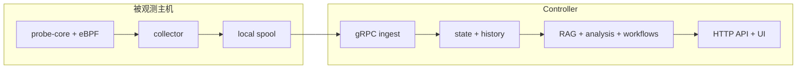

# AI SRE Agent


> 面向 AI/GPU 基础设施的 push-first 可观测性与受控自动化项目。collector 把主机侧采样成本压到足够低，controller 再把这些 telemetry 变成分析、检索、RCA 和受控输出。

| 文档入口 | 从这里开始 |
| --- | --- |
| 中文 | [概览](docs/zh/01-overview.md) · [Pipeline 深度解析](docs/zh/02-pipeline-deep-dive.md) · [快速开始](docs/zh/03-getting-started.md) · [架构](docs/zh/04-architecture.md) |
| English | [English README](README.md) · [Overview](docs/en/01-overview.md) · [Pipeline Deep Dive](docs/en/02-pipeline-deep-dive.md) · [Getting Started](docs/en/03-getting-started.md) · [Architecture](docs/en/04-architecture.md) |

<p align="center">
  
</p>

如果你只想先读一篇“从第一条采样数据一路讲到最终回答”的真实实现说明，请直接看：

- [Pipeline 深度解析](docs/zh/02-pipeline-deep-dive.md)
- [Pipeline Deep Dive](docs/en/02-pipeline-deep-dive.md)

## 为什么这不是一个“把监控数据扔给 LLM”的聊天机器人

这个仓库刻意实现成一条证据流水线，而不是“把 dashboard 快照直接塞给模型”。

| 步骤 | 现在实际发生的事 | 为什么重要 |
| --- | --- | --- |
| 1. 采集 | `collector` 在主机侧采样主机、进程、GPU、安全和运行时完整性信号 | 把短时效主机证据先抓下来，不等网络和控制面 |
| 2. 抑制 | 不变的 low-churn 指标、helper 缓存命中 payload、近似不变的进程列表会被抑制 | steady-state 下的 collector 开销、spool 大小和网络字节数保持可控 |
| 3. 排队 | batch 先写入本地 spool，再尝试发送 | controller 或网络抖动不会立刻变成 telemetry 丢失 |
| 4. 分析 | `controller` 先把热状态转成趋势、弱信号簇和 retrieval decision | 昂贵推理路径读到的是结构化证据，而不是原始噪声 |
| 5. 检索 | 只有在症状上下文足够强时才触发 RAG | 检索文本更相关，附加成本更低 |
| 6. 输出 | 最终答案包含诊断、置信度、证据和下一步检查 | 操作员拿到的是可以执行的建议，而不是泛泛解释 |

这条拆分在真实代码里对应的是 [`backend/internal/collector/`](backend/internal/collector/)、[`backend/internal/controller/ingest/`](backend/internal/controller/ingest/)、[`backend/internal/controller/agentcore/`](backend/internal/controller/agentcore/) 和 [`backend/internal/controller/rag/`](backend/internal/controller/rag/)。

## 这个项目是什么

AI SRE Agent 当前围绕两个运行时角色和一条 controller 侧知识路径组织：

| 组成部分 | 负责什么 | 为什么需要它 |
| --- | --- | --- |
| `collector` | 运行在被观测主机上或其附近，采集遥测，并在 controller 暂时不可达时通过本地 spool 重放。 | 把短时效的主机证据留在本地，避免把控制面抖动放大成观测空洞。 |
| `controller` | 接收遥测、提供 HTTP API 和 Web UI、保存当前态和可选历史、执行分析和工作流。 | 把更重的存储、检索和推理负载从业务主机移开。 |
| `dataset` + RAG | 提供仓库内置种子数据集和 controller 侧检索服务。 | 让 agent 输出基于项目内知识和检索证据，而不是只依赖模型记忆。 |

## 把整个系统当成一条流水线来理解

如果你想快速理解这个仓库，最简单的方式就是把它看成一条有边界的流水线：

| 流水线阶段 | 主要代码 | 为什么需要这一步 |
| --- | --- | --- |
| 主机采样 | [`cpp/probe_core/`](cpp/probe_core/)、[`backend/internal/collector/collector.go`](backend/internal/collector/collector.go) | 在证据消失前把 node-local 信号抓下来 |
| 本地抑制与节奏控制 | [`backend/internal/collector/metric_suppression.go`](backend/internal/collector/metric_suppression.go)、[`backend/internal/collector/aux_sampling.go`](backend/internal/collector/aux_sampling.go)、[`backend/internal/collector/process_payload_suppression.go`](backend/internal/collector/process_payload_suppression.go) | 让 collector 长期跑在生产主机上仍然足够轻 |
| 排队与发送 | [`backend/internal/collector/spool/spool.go`](backend/internal/collector/spool/spool.go)、[`backend/internal/collector/transport/client.go`](backend/internal/collector/transport/client.go) | 把采样与 controller/network 抖动解耦 |
| ingest 与热状态 | [`backend/internal/controller/ingest/server.go`](backend/internal/controller/ingest/server.go)、[`backend/internal/controller/ingest/store.go`](backend/internal/controller/ingest/store.go) | 重建统一的 controller 状态模型 |
| 趋势与弱信号分析 | [`backend/internal/controller/agentcore/workflow_eventization.go`](backend/internal/controller/agentcore/workflow_eventization.go)、[`backend/internal/controller/agentcore/workflow_engine.go`](backend/internal/controller/agentcore/workflow_engine.go) | 把“单指标恶化”和“弱信号组合”分开处理 |
| 检索与 prompt | [`backend/internal/controller/rag/`](backend/internal/controller/rag/)、[`backend/internal/controller/agentcore/prompts.go`](backend/internal/controller/agentcore/prompts.go) | 只有在确实能提升答案时才补上 runbook 和历史案例 |
| 响应与 UI | [`backend/internal/controller/agentcore/agent.go`](backend/internal/controller/agentcore/agent.go)、[`frontend/src/components/Insights/`](frontend/src/components/Insights/) | 把证据变成诊断、检查建议和运维界面 |

## 这些文档分别适合谁

| 读者 | 最适合的入口 | 你会获得什么 |
| --- | --- | --- |
| SRE / 开发者 | [Pipeline 深度解析](docs/zh/02-pipeline-deep-dive.md) | 从第一条采样到最终响应的文件级、机制级解释 |
| 操作员 | [快速开始](docs/zh/03-getting-started.md) 和 [UI 指南](docs/zh/08-ui-guide.md) | 如何启动系统、验证它、以及如何读调查控制台 |
| 架构师 / 审阅者 | [架构](docs/zh/04-architecture.md) 和 [代码库地图](docs/zh/09-codebase-map.md) | 运行边界、存储选择以及责任拆分 |
| 产品 / 商务读者 | [概览](docs/zh/01-overview.md) 和 [控制平面分析](docs/zh/07-control-plane-analysis.md) | 为什么系统要先做廉价症状检测，再做更昂贵的根因推理 |

## 这个仓库能帮助回答哪些典型问题

下面这些问题，都是当前代码路径真正想解决的：

| 问题 | 背后的主要路径 |
| --- | --- |
| “为什么这个 GPU 训练节点现在变慢了？” | collector 指标 + controller ingest + deterministic findings + 可选 RAG |
| “这到底是存储延迟还是 CPU 饱和？” | probe-core 磁盘/CPU 指标 + controller 侧 operational findings |
| “第一条采样数据到最终 RCA 回答之间到底发生了什么？” | [docs/zh/02-pipeline-deep-dive.md](docs/zh/02-pipeline-deep-dive.md) |
| “如果我要改 prompt，应该改哪个文件？” | [`docs/zh/10-core-files.md`](docs/zh/10-core-files.md) + [`docs/zh/12-prompts-and-customization.md`](docs/zh/12-prompts-and-customization.md) |
| “如果我要换成自己的 runbook 数据集，应该怎么做？” | [`docs/zh/11-dataset-and-rag.md`](docs/zh/11-dataset-and-rag.md) |
| “telemetry stale 时系统会发生什么？” | [`docs/zh/05-data-flow.md`](docs/zh/05-data-flow.md) + [`docs/zh/15-deployment.md`](docs/zh/15-deployment.md) |

## 核心架构



主要配置文件：

- [`configs/collector.yaml`](configs/collector.yaml)
- [`configs/controller.yaml`](configs/controller.yaml)
- [`configs/container/collector.yaml`](configs/container/collector.yaml)
- [`configs/container/controller.yaml`](configs/container/controller.yaml)

## 部署形态

仓库里的配置现在显式支持四种部署模式：

| 模式 | 适合什么场景 | 典型入口 |
| --- | --- | --- |
| `local-dev` | 源码调试、本地单机验证 | [`configs/controller.yaml`](configs/controller.yaml)、[`configs/collector.yaml`](configs/collector.yaml)、[`scripts/run-local.sh`](scripts/run-local.sh) |
| `standalone` | 一台中心 controller 加若干外部 collector | [`deploy/docker/`](deploy/docker/)、[`deploy/systemd/`](deploy/systemd/) |
| `cluster-lite` | 单集群里的 controller `Deployment` 加 collector `DaemonSet` | [`deploy/k8s/push-first/`](deploy/k8s/push-first/)、[`deploy/charts/sre-agent/`](deploy/charts/sre-agent/) 默认值 |
| `distributed` | 多副本 controller、外部 HA、可选外部向量检索后端 | Helm 中开启 `controller.ha.enabled=true` 并配置 [`deploy/charts/sre-agent/values.yaml`](deploy/charts/sre-agent/values.yaml) 里的外部后端值 |

这四种模式下，数据面始终保持 node-local，控制面始终保持集中。真正变化的是状态放在哪里，以及你是否引入共享基础设施。

## 快速开始

推荐的本地启动路径：

```bash
cp .env.example .env
make container-build
make container-up-host-observer
curl -fsS http://127.0.0.1:8080/healthz
curl -fsS http://127.0.0.1:8080/readyz
curl -fsS http://127.0.0.1:8080/api/v1/status | jq '.deployment'
```

健康检查成功后，打开 `http://127.0.0.1:8080/`。

一次正常的首轮启动，通常应该表现为：

- `GET /healthz` 成功
- `GET /readyz` 会在启动检查完成后返回成功
- `GET /api/v1/status` 能返回 controller 运行状态
- `GET /api/v1/status.deployment` 能展示当前部署模式和数据根目录
- 即使默认没有启用 RAG，UI 也能加载
- 即使没有启用 LLM 或 RAG，这个栈仍然可以先验证 telemetry、API 和 UI 闭环

停止本地栈：

```bash
make container-down-host-observer
```

更完整的启动流程、验证步骤和源码模式说明见：

- [中文快速开始](docs/zh/03-getting-started.md)
- [English getting started](docs/en/03-getting-started.md)

## 文档导航

| 主题 | 内容 | English | 中文 |
| --- | --- | --- | --- |
| 项目概览 | 项目范围、运行时角色、推荐阅读顺序 | [docs/en/01-overview.md](docs/en/01-overview.md) | [docs/zh/01-overview.md](docs/zh/01-overview.md) |
| Pipeline 深度解析 | 从主机采样到最终响应的完整真实路径，并逐阶段解释 what / why / how / tradeoffs | [docs/en/02-pipeline-deep-dive.md](docs/en/02-pipeline-deep-dive.md) | [docs/zh/02-pipeline-deep-dive.md](docs/zh/02-pipeline-deep-dive.md) |
| 采集队列与压缩 | 为什么发送前需要 suppression、queue、replay 和 bounded delivery | [docs/en/06-collector-queue-and-compaction.md](docs/en/06-collector-queue-and-compaction.md) | [docs/zh/06-collector-queue-and-compaction.md](docs/zh/06-collector-queue-and-compaction.md) |
| 控制平面分析 | telemetry 如何变成趋势、弱信号事件、retrieval plan 和推荐动作 | [docs/en/07-control-plane-analysis.md](docs/en/07-control-plane-analysis.md) | [docs/zh/07-control-plane-analysis.md](docs/zh/07-control-plane-analysis.md) |
| 快速开始 | 本地启动、验证方式、源码模式替代方案 | [docs/en/03-getting-started.md](docs/en/03-getting-started.md) | [docs/zh/03-getting-started.md](docs/zh/03-getting-started.md) |
| 架构说明 | 运行边界、存储位置、controller 服务划分 | [docs/en/04-architecture.md](docs/en/04-architecture.md) | [docs/zh/04-architecture.md](docs/zh/04-architecture.md) |
| 数据流 | 聚焦运行时流转和具体示例的 metric-to-answer walkthrough | [docs/en/05-data-flow.md](docs/en/05-data-flow.md) | [docs/zh/05-data-flow.md](docs/zh/05-data-flow.md) |
| UI 指南 | 调查控制台页面、截图以及页面阅读顺序 | [docs/en/08-ui-guide.md](docs/en/08-ui-guide.md) | [docs/zh/08-ui-guide.md](docs/zh/08-ui-guide.md) |
| 代码库地图 | 仓库布局、主执行路径，以及各子系统应该去哪里改 | [docs/en/09-codebase-map.md](docs/en/09-codebase-map.md) | [docs/zh/09-codebase-map.md](docs/zh/09-codebase-map.md) |
| 核心文件 | 入口、collector、controller、RAG、prompt 和运行时接线的文件级职责说明 | [docs/en/10-core-files.md](docs/en/10-core-files.md) | [docs/zh/10-core-files.md](docs/zh/10-core-files.md) |
| 数据集与 RAG | 种子数据集、索引流程、update/rebuild、RAG 取舍 | [docs/en/11-dataset-and-rag.md](docs/en/11-dataset-and-rag.md) | [docs/zh/11-dataset-and-rag.md](docs/zh/11-dataset-and-rag.md) |
| Prompt 与定制 | Prompt 来源、运行时组装、安全边界和安全修改方式 | [docs/en/12-prompts-and-customization.md](docs/en/12-prompts-and-customization.md) | [docs/zh/12-prompts-and-customization.md](docs/zh/12-prompts-and-customization.md) |
| 指标与信号 | 采集到的指标、结构化信号及其诊断价值 | [docs/en/13-metrics-and-signals.md](docs/en/13-metrics-and-signals.md) | [docs/zh/13-metrics-and-signals.md](docs/zh/13-metrics-and-signals.md) |
| 硬件注意事项 | 硬件发现、硬件自适应阈值、支持边界 | [docs/en/14-hardware-considerations.md](docs/en/14-hardware-considerations.md) | [docs/zh/14-hardware-considerations.md](docs/zh/14-hardware-considerations.md) |
| 部署说明 | Docker、Kubernetes、Helm、systemd 部署入口 | [docs/en/15-deployment.md](docs/en/15-deployment.md) | [docs/zh/15-deployment.md](docs/zh/15-deployment.md) |
| 常见问题 | 常见运维和贡献问题 | [docs/en/16-faq.md](docs/en/16-faq.md) | [docs/zh/16-faq.md](docs/zh/16-faq.md) |

更细的操作和参考文档仍保留在 [`docs/`](docs/README.md) 下，包括：

- [运行指南](docs/operations/usage.md)
- [配置说明](docs/operations/configuration.md)
- [API 参考](docs/reference/api.md)
- [指标参考](docs/reference/metrics.md)
- [RAG 参考](docs/reference/rag_knowledge_engine_zh.md)
- [LLM Schema 参考](docs/reference/llm_schema.md)

## 按目标阅读

如果你是第一次看这个仓库，不想自己猜阅读顺序，可以直接按下面走：

| 目标 | 先读 | 再读 |
| --- | --- | --- |
| 把系统先跑起来 | [docs/zh/03-getting-started.md](docs/zh/03-getting-started.md) | [docs/zh/15-deployment.md](docs/zh/15-deployment.md) |
| 理解为什么要拆成 collector 和 controller | [docs/zh/04-architecture.md](docs/zh/04-architecture.md) | [docs/zh/05-data-flow.md](docs/zh/05-data-flow.md) |
| 追一条症状如何穿过整条真实流水线 | [docs/zh/02-pipeline-deep-dive.md](docs/zh/02-pipeline-deep-dive.md) | [docs/zh/10-core-files.md](docs/zh/10-core-files.md) |
| 理解为什么发送前要排队、为什么要抑制重复数据 | [docs/zh/06-collector-queue-and-compaction.md](docs/zh/06-collector-queue-and-compaction.md) | [docs/zh/13-metrics-and-signals.md](docs/zh/13-metrics-and-signals.md) |
| 理解单变量趋势与多变量弱信号分析的区别 | [docs/zh/07-control-plane-analysis.md](docs/zh/07-control-plane-analysis.md) | [docs/zh/02-pipeline-deep-dive.md](docs/zh/02-pipeline-deep-dive.md) |
| 理解调查控制台应该怎么看 | [docs/zh/08-ui-guide.md](docs/zh/08-ui-guide.md) | [docs/zh/05-data-flow.md](docs/zh/05-data-flow.md) |
| 修改 RAG 或 dataset 行为 | [docs/zh/11-dataset-and-rag.md](docs/zh/11-dataset-and-rag.md) | [docs/zh/10-core-files.md](docs/zh/10-core-files.md) |
| 安全地修改 prompt | [docs/zh/12-prompts-and-customization.md](docs/zh/12-prompts-and-customization.md) | [docs/zh/10-core-files.md](docs/zh/10-core-files.md) |

## 仓库结构

| 路径 | 作用 |
| --- | --- |
| [`backend/`](backend/) | Controller、collector、ingest、RAG、API 和 workflow 代码 |
| [`cpp/`](cpp/) | 原生 probe-core 运行时及相关 C++ 组件 |
| [`frontend/`](frontend/) | Web UI |
| [`configs/`](configs/) | 源码模式和容器模式配置 |
| [`dataset/`](dataset/) | RAG 种子数据集和数据处理工具 |
| [`deploy/`](deploy/) | Docker、Kubernetes、Helm、systemd 部署资产 |
| [`docs/`](docs/) | 中英文指南、参考资料和运维说明 |
| [`scripts/`](scripts/) | 构建、运行、引导和辅助脚本 |
| [`tests/`](tests/) | 后端、集成、端到端和 UI 测试 |

## 项目链接

- [文档索引](docs/README.md)
- [贡献指南](CONTRIBUTING.md)
- [安全说明](SECURITY.md)
- [变更记录](CHANGELOG.md)
- [许可证](LICENSE)
