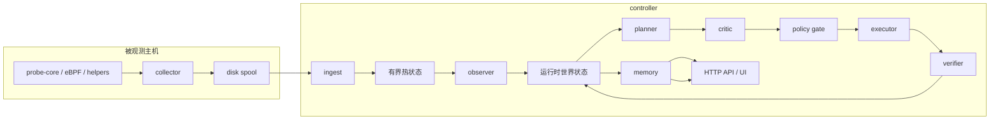

# AI SRE Agent

[](https://github.com/jfang2048/ai_sre_agent_pub/releases/tag/v0.95)
[](LICENSE)
[](https://github.com/jfang2048/ai_sre_agent_pub/actions/workflows/ci.yml)
[](#运行时形态)

AI SRE Agent 是一个面向 Linux、Kubernetes、GPU 和 AI 基础设施的推送优先
（push-first）事故证据平台。节点本地采集器负责获取证据，中央控制器负责治理
事故分析、动作建议和可持久化的根因分析（RCA）记录。

系统把原始采集留在主机附近，限制控制器热状态的规模，并确保事故推理在事后
仍可检查。控制器同时支持传统的确定性流程和有界的自适应 RCA 闭环。

控制器采用技能优先（skills-first）模型：每项运维能力都通过受治理的契约暴露，
可被评分、策略检查、标准化、审计和重放。RAG 只是只读知识技能；检索结果可以
补充证据，但不能授权、分支、重试或执行会影响生产环境的动作。

本仓库提供的是可复用的平台切片，而不是单一用途的应用。用于开发和 UI 验证的
种子数据不属于公开产品边界。

English: [`README.md`](README.md)

## 平台范围

本文档是面向运维人员的入口。仓库保持小而直接：代码定义行为，测试提供回归
证明，生成的证据不进入 Git。维护范围包括：

- 节点本地 probe 和 collector 证据采集；
- 控制器侧的 ingest、事故工作流、策略和 artifact 持久化；
- 基于 NVML 和 `probe-core` 的 GPU 可观测性；
- [`examples/gpu-platform-sre/`](examples/gpu-platform-sre/) 中可运行的 Kubernetes
  GPU 演示。

## 快速开始

核心构建使用 CI 中固定的版本：Go 1.26.8、用于 Web UI 的 Node.js 22，以及用于
可选 Python 运行时的 Python 3.11。C++20 编译器、protobuf 和 zlib 用于构建主要的
`probe-core` 二进制；缺少这些本地依赖时，构建过程会明确报告回退状态。

```bash
git clone https://github.com/jfang2048/ai_sre_agent_pub.git
cd ai_sre_agent_pub
git switch v0.95

make build
make test
make run-both
```

本地栈在 <http://127.0.0.1:8080/> 提供 Web UI 和 API。按 `Ctrl+C` 停止进程；
运行 `make help` 可查看构建、评测、部署和安全检查入口。

## Unix 设计契约

`v0.95` 把可运维性视为接口，而不是某个仪表盘功能：

- 每个命令只承担一个主要职责，并通过文件、环境变量、标准输入输出和进程退出码
  组合；
- 机器可读结果写入 stdout，诊断信息写入 stderr；
- collector 负责采集，controller 负责策略，发布脚本负责公开发布过滤；
- 生成状态和可选语料留在 Git 之外，默认只发布已审查且受 Git 跟踪的源码；
- 不安全或含糊的发布输入会失败关闭，不会被猜测性地写入公开产物。

公开发布检查都是普通 shell 入口，因此本地与 CI 使用同一套机制：

```bash
make public-repo-audit
make test-publish-privacy
make test-dataset-fetch
```

第一条命令检查当前内容、提交身份和历史路径；第二条验证发布器不会复制未跟踪
文件，并会拒绝凭据形态的内容；第三条在不访问网络的情况下验证数据集获取仍是
逐行、仅 HTTPS 的流式接口。

## GPU 平台 SRE 演示

可运行的 Kubernetes GPU 演示位于
[`examples/gpu-platform-sre/`](examples/gpu-platform-sre/)。vLLM 和 KServe 作为
外部工作负载，现有 collector/controller 栈负责 GPU 可观测性、事故证据和回滚
演练。

## 实现入口

| 领域             | 入口                                                                                                                                                                                                           | 职责                                                         |
| ---------------- | -------------------------------------------------------------------------------------------------------------------------------------------------------------------------------------------------------------- | ------------------------------------------------------------ |
| 主机探针         | [`cpp/probe_core/main.cpp`](cpp/probe_core/main.cpp)                                                                                                                                                           | CLI 解析、主机 CPU 和内存采集、`/proc` 解析及压缩            |
| GPU 采样         | [`cpp/probe_core/gpu_nvml.cpp`](cpp/probe_core/gpu_nvml.cpp)                                                                                                                                                   | NVML 设备与进程采样                                          |
| Collector        | [`backend/internal/collector/collector.go`](backend/internal/collector/collector.go)                                                                                                                           | Collector 构造、身份信息及外部指标命令解析                   |
| Spool 与传输     | [`spool.go`](backend/internal/collector/spool/spool.go) 和 [`client.go`](backend/internal/collector/transport/client.go)                                                                                       | 持久化偏移、批处理、确认和 TLS                               |
| 控制器运行时     | [`controller.go`](backend/internal/controller/controller.go)、[`agent.go`](backend/internal/controller/agentcore/agent.go) 和 [`workflow_engine.go`](backend/internal/controller/agentcore/workflow_engine.go) | API 组装、查询服务和工作流编排                               |
| 技能与自适应闭环 | [`backend/internal/controller/agentcore/`](backend/internal/controller/agentcore/)                                                                                                                             | 工具契约、评分、查询塑形、标准化、规划、批判、验证和重放状态 |
| 持久化 artifact  | [`workflow_artifacts.go`](backend/internal/controller/agentcore/workflow_artifacts.go) 和 [`workflow_orchestrator.go`](backend/internal/controller/agentcore/workflow_orchestrator.go)                         | Artifact chain 以及 BoltDB/Postgres 持久化存储               |
| Web UI           | [`frontend/src/`](frontend/src/)                                                                                                                                                                               | React 18 + Vite 运维界面                                     |

## 数据面来源策略

在不引入额外运行时的前提下，collector 优先使用内核接口：

- 主机 CPU 调度计数：`cpp/probe_core/main.cpp` 中的 `perf_event_open` 软件计数器；
- 进程级记账：`cpp/probe_core/process_kernel_collector.cpp` 中基于 generic netlink
  的 `taskstats`；
- 接口和链路计数：`cpp/probe_core/network_kernel_collector.cpp` 中的
  `rtnetlink`；
- socket 队列状态：同一文件中的 `sock_diag`；
- 运行时事件流：`cpp/probe_core/kernel_event_protocol.cpp` 接收有版本的二进制
  事件记录，同时保留 JSON 回退以兼容旧生产者；
- GPU：`cpp/probe_core/gpu_nvml.cpp` 只通过 NVML 采样，`probe-core` 热路径不再
  调用 `nvidia-smi` 子进程。

仍使用文件接口的部分是明确的回退或冷路径：

- PSI：`/proc/pressure/*`；
- cgroup 统计：`/sys/fs/cgroup/...`；
- 磁盘计数和队列属性：`/sys/block/*`，必要时回退到 `/proc/diskstats`；
- 进程校准和热点进程补充：周期性扫描 `/proc`、`/proc/<pid>/smaps_rollup` 和
  `/proc/<pid>/fd`；
- 硬件发现：由 `hardware.refresh_interval` 控制的低频 `/proc` 和 `/sys` 读取。

权限边界如下：

- `CAP_BPF` 或 `CAP_SYS_ADMIN` 控制主要 eBPF 路径；
- `CAP_PERFMON` 或 `CAP_SYS_ADMIN` 是 perf 主机计数器的标准权限；
- `CAP_NET_ADMIN` 或 `CAP_SYS_ADMIN` 是 taskstats 和 sock_diag 进程路径的预期
  权限；
- 缺少这些 capability 时，collector 会继续运行并明确回退，不会伪装成仍在使用
  内核路径。

## 设计动机

许多狭义的 SRE 自动化原型往往在以下方面失效：

- 假设遥测始终完整且新鲜；
- 把重试视为零成本；
- 把全部推理隐藏在一个大型内存对象中；
- 混淆建议输出与可执行动作；
- 控制器重启后无法恢复现场。

本仓库以相反的约束为基础：

- collector 侧证据可能延迟、丢失或重放；
- 控制器内存和文件描述符都是有界资源；
- 执行必须经过策略、审批、幂等控制和动作后验证；
- 运维人员需要的是压力下仍可检查的紧凑 artifact。

## 运行时形态



这些逻辑 agent 目前仍运行在同一个 controller 进程中。真正重要的是持久化状态和
artifact 契约，而不是进程边界。自适应闭环受 `AdaptiveMaxIterations`、
`AdaptiveMaxToolCalls`、同工具重试次数、假设改写次数和时间预算共同限制。

每个关键步骤都会生成紧凑记录，其中包括：

- schema 版本；
- producer 和 consumer；
- workflow、incident 和 correlation ID；
- 时间戳和状态；
- 输入 artifact ID；
- evidence 引用；
- replay 标记。

完整链路存放在 RCA evidence package 中，并通过 workflow API 暴露。

## 运行时模式

`WorkflowConfig.RuntimeMode` 控制迁移路径：

| 模式                   | 行为                                                                                               |
| ---------------------- | -------------------------------------------------------------------------------------------------- |
| `legacy_deterministic` | 保留传统固定流程，也是默认的安全模式。                                                             |
| `hybrid_adaptive`      | 先运行场景感知的确定性流程，再在分析到验证的交接前插入受治理的自适应闭环。                         |
| `full_adaptive`        | 使用同一套有界、由控制器治理的自适应闭环，并启用完整的 planner、critic、verifier、评分和经验记忆。 |

为兼容旧配置，仍接受以下别名：

- `deterministic` → `legacy_deterministic`；
- `hybrid` → `hybrid_adaptive`；
- `adaptive` → `full_adaptive`。

迁移开关同时位于 `WorkflowConfig` 和 `runtime_mode`：

- `adaptive_runtime_enabled`；
- `autonomous_tool_selection_enabled`；
- `planner_critic_enabled`；
- `tool_experience_memory_enabled`；
- `cheap_first_selection_enabled`；
- `max_no_progress_rounds`；
- `max_uncertainty_plateau_rounds`；
- `adaptive_parallel_read_only_limit`。

设置 `SRE_AGENT_WORKFLOW_RUNTIME_MODE=hybrid_adaptive` 或
`SRE_AGENT_WORKFLOW_RUNTIME_MODE=full_adaptive` 可启用新路径。未设置或无效时，
控制器会回退到 `legacy_deterministic`。

## 逻辑角色与职责

| 角色        | 负责                                       | 读取                                                | 写入                                        | 能否修改线上状态                |
| ----------- | ------------------------------------------ | --------------------------------------------------- | ------------------------------------------- | ------------------------------- |
| observer    | 当前窗口摘要和运行时状态                   | collector snapshot、有界历史                        | observation 和 objective artifact           | 否                              |
| planner     | 下一目标以及候选工具或动作                 | 运行时状态、证据缺口、假设                          | planner proposal 和 tool decision artifact  | 否                              |
| critic      | 隐含假设、安全性和无进展检查               | planner proposal、tool contract、policy posture     | critique report 和 branch decision artifact | 否                              |
| policy gate | 执行资格                                   | proposal artifact、controller policy、tool contract | execution plan 或 intent artifact           | 否                              |
| executor    | 受治理的工具调用                           | 已获策略批准的 tool decision                        | tool result summary 或 execution result     | 仅在 posture 和 approval 允许时 |
| verifier    | 不确定性、置信度、矛盾、缺口和动作效果变化 | 工具结果、动作前后运行时状态                        | progress assessment 和 verification delta   | 否                              |
| memory      | 最终事故记录                               | 完整 artifact chain                                 | final incident artifact 和 incident memory  | 否                              |

旧的 `analysis_agent` 和 `validation_action_agent` 路径仍然存在。自适应闭环在同一
控制器进程内加入显式的 planner、critic、executor 和 verifier 轮次，并把结果写入
`DurableRun.AdaptiveDialogue`。

## Artifact chain

事故工作流会生成以下基础链路：

1. `observation_summary`
2. `anomaly_finding`
3. `root_cause_hypothesis`
4. `remediation_proposal`
5. `execution_plan`
6. `execution_result`
7. `verification_result`
8. `incident_report`

混合和自适应运行还会追加 `runtime_state`、`objective_state`、
`planner_proposal`、`tool_candidate_scores`、`critique_report`、`tool_decision`、
`tool_result_summary`、`progress_assessment`、`branch_decision`、
`execution_intent`、`stop_decision`、`verification_delta` 和
`experience_memory_update` 等 artifact。

这些记录有意保持紧凑。原始遥测不会在每次交接时整包复制；artifact 只携带证据
ID、决策、分数、变化量、标准化工具结果和短引用，需要细节时再回源读取。

新增字段有版本号，并在解码时提供默认值，因此旧 evidence package 仍可读取。
Replay 不会重新执行副作用；改变状态或执行 profiling 的技能仍保持 proposal-only、
dry-run 或 approval-gated，除非运维人员显式调整执行姿态。

具体 schema 位于
[`backend/internal/controller/agentcore/workflow_artifacts.go`](backend/internal/controller/agentcore/workflow_artifacts.go)
及其测试中。

## 自适应控制与确定性边界

模型可以提出证据缺口、假设、工具候选、矛盾检查、查询改写以及停止或继续建议，
但不能决定执行。

执行始终由控制器代码检查：

- tool contract 有效性；
- actuator safety classification；
- policy status；
- approval state；
- idempotency key 复用；
- timeout 和 retry budget；
- rollback requirement；
- 动作后验证；
- 可选回滚。

契约还包括首选查询提示、新鲜度要求和范围敏感度。自适应闭环会在每次自动工具
调用前使用这些字段塑造查询窗口和作用范围。

`/api/v1/controller/tools` 暴露的技能注册表包括稳定名称、版本、能力族、schema、
只读姿态、安全等级、审批要求、自治资格、成本和新鲜度、范围敏感度、预期信息
增益、策略状态以及近期低收益和结果质量信号。这些字段是技能优先控制的对外契约，
必须保持向后兼容。

默认姿态保持保守：

- 启用 dry-run；
- 需要 approval；
- 默认阻止高影响和破坏性路径；
- validation 默认只读。

## 资源模型

代码围绕有界成本设计，而不是理想化吞吐：

- **内存**：控制器热状态和证据引用有界；artifact payload 只保存摘要，不保存
  遥测转储；
- **文件描述符**：collector 写入磁盘 spool，controller 通过 artifact manager
  持久化，并避免长时间保持单事故文件打开；
- **并发**：动作执行显式受限，验证闭环受工具调用和迭代预算约束；
- **队列增长**：replay 和 spool 可观测且有界，artifact chain 不创建新的无界
  旁路队列；
- **序列化成本**：artifact chain 足够小，可随 evidence package 传递并在调试时
  低成本解码。

## 失败模型

真实系统中可能出现：

- 遥测过期或不完整；
- 事故处理中控制器重启；
- 动作建议缺少足够的回滚信息；
- 证据窗口不足，无法证明动作有效；
- 同一类事故重复请求。

当前设计通过保留状态、暴露不确定性，并在不安全时停留在 proposal-only 模式来
处理这些情况，不会掩盖失败。

## 可观测性与运维接口

事故期间常用的接口：

- `GET /api/v1/agent/rca`；
- `GET /api/v1/agent/workflow/runs`；
- `GET /api/v1/agent/workflow/runs/{run_id}`；
- `GET /api/v1/agent/workflow/evidence/{run_id}`；
- `GET /api/v1/agent/workflow/artifacts/{run_id}`；
- `GET /api/v1/agent/workflow/audit`；
- `GET /api/v1/controller/tools`；
- `GET /api/v1/status`；
- `GET /api/v1/ingest/status`。

磁盘上的常用位置：

- `data/agent/workflow_runs.db`；
- `data/agent/workflows/messages/<run_id>/`；
- `data/agent/workflows/evidence/<run_id>/package.json`；
- artifact manager 的 metadata 和 payload 根目录。

这些接口背后的主要代码：

- HTTP 和 UI 路由：`backend/internal/controller/controller.go`；
- query 和 RCA 输出：`backend/internal/controller/agentcore/agent.go`；
- 持久化 artifact manifest：
  `backend/internal/controller/agentcore/workflow_artifacts.go`；
- tool contract：`backend/internal/controller/agentcore/workflow_tool_contracts.go`；
- 自适应状态与决策：`backend/internal/controller/agentcore/adaptive_runtime.go`；
- 基于经验的工具先验：
  `backend/internal/controller/agentcore/workflow_tool_experience.go`。

## 工具架构与闭环检查顺序

仓库通过明确的控制器代码实现自主事故闭环，而不是把它隐藏在 prompt 约定中。
审查或修改运行时时，按以下顺序阅读：

1. `backend/internal/controller/agentcore/workflow_engine.go`
2. `backend/internal/controller/agentcore/workflow_tools.go`
3. `backend/internal/controller/agentcore/workflow_tool_contracts.go`
4. `backend/internal/controller/agentcore/tool_contracts.go`
5. `backend/internal/controller/agentcore/tool_scoring.go`
6. `backend/internal/controller/agentcore/query_shaping.go`
7. `backend/internal/controller/agentcore/tool_normalization.go`
8. `backend/internal/controller/agentcore/adaptive_runtime.go`
9. `backend/internal/controller/agentcore/adaptive_runtime_state.go`
10. `backend/internal/controller/agentcore/workflow_artifacts.go`

受治理的闭环按以下顺序工作：

1. 检查运行时状态和未解决的证据缺口；
2. 从完整契约注册表生成候选工具；
3. 通过确定性的策略感知评分筛选候选；
4. 塑造下一次查询、范围和时间窗口；
5. 通过受治理的工具管理器调用工具；
6. 把结果标准化为可安全重放的摘要；
7. 更新自适应状态、范围提示和假设排序；
8. 评估进展、低收益行为和停止条件；
9. 继续、分支、停止，或移交给验证和执行阶段。

工具目录由
[`backend/internal/controller/agentcore/workflow_tool_contracts.go`](backend/internal/controller/agentcore/workflow_tool_contracts.go)
及相关契约测试维护。

## 部署边界

仓库不假设永远只有一个 controller：

- run metadata 可以迁移到 Postgres；
- artifact metadata 可以迁移到共享后端；
- payload 可以从文件系统迁移到 S3；
- 热状态仍只属于一个 active writer；
- HA follower 仍拒绝 ingest 写入。

因此，当前持久化能力已经增强，但系统还不是完全分布式的工作流运行时。

## 继续阅读

- [`examples/gpu-platform-sre/`](examples/gpu-platform-sre/)：可运行的 GPU 演示；
- [`deploy/`](deploy/)：本地、容器和 Kubernetes 部署路径；
- [`dataset/README.md`](dataset/README.md)：公开数据边界；
- [`tests/README.md`](tests/README.md)：验证策略；
- [`SECURITY.md`](SECURITY.md)：漏洞披露和公开仓库卫生规则；
- [`CONTRIBUTING.md`](CONTRIBUTING.md)：变更和验证规则。
