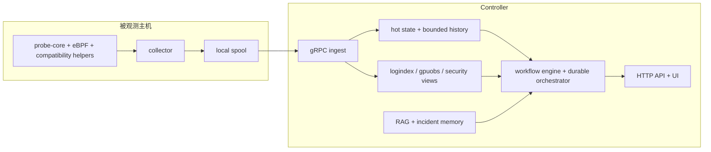

# AI SRE Agent


> 面向 Linux、GPU 与 AI 基础设施的、以证据为中心的 AIOps 与受控事故自动化系统。
> collector 贴近主机保留短时效证据；controller 再把这些证据变成热状态、检索、RCA、受控 workflow 与可审计输出。

| 文档入口 | 从这里开始 |
| --- | --- |
| 中文 | [概览](docs/zh/01-overview.md) · [Pipeline 深度解析](docs/zh/02-pipeline-deep-dive.md) · [架构](docs/zh/04-architecture.md) · [事故 Agent 运行时](docs/zh/17-incident-agent-runtime.md) · [架构决策记录](docs/zh/18-architecture-decisions.md) · [行为基线与 Burst 判别](docs/zh/21-behavioral-baseline-design.md) |
| English | [English README](README.md) · [Overview](docs/en/01-overview.md) · [Pipeline Deep Dive](docs/en/02-pipeline-deep-dive.md) · [Architecture](docs/en/04-architecture.md) · [Incident Agent Runtime](docs/en/17-incident-agent-runtime.md) · [Architecture Decisions](docs/en/18-architecture-decisions.md) |

文档目录现在按语言平铺组织。每种语言下 `01` 到 `19` 是主阅读路径，`20+` 是补充性的参考与 runbook 文档。

## 建议先读

如果你只打算先读 5 篇文档，建议顺序如下：

1. [README.zh-CN.md](README.zh-CN.md)：项目命题、顶层运行路径和入口
2. [Pipeline 深度解析](docs/zh/02-pipeline-deep-dive.md)：从主机到 controller 再到 operator 的精确数据流
3. [架构](docs/zh/04-architecture.md)：状态归属、信任边界与持久化取舍
4. [事故 Agent 运行时](docs/zh/17-incident-agent-runtime.md)：durable run、tool governance、approval、verification、compensation
5. [架构决策记录](docs/zh/18-architecture-decisions.md)：解释为什么当前仓库采用这些具体实现选择的 ADR 风格说明

<p align="center">
  
</p>

## Release Context

`v0.8` 是第一套真正追上当前仓库实现状态的文档版本。

这次文档升级覆盖了仓库里已经存在、但此前说明不足的 controller 能力：

- 持久化 workflow run 与 evidence package，位于 [`backend/internal/controller/agentcore/workflow_orchestrator.go`](backend/internal/controller/agentcore/workflow_orchestrator.go)
- 统一的工具治理层，位于 [`backend/internal/controller/agentcore/workflow_tools.go`](backend/internal/controller/agentcore/workflow_tools.go)
- 变更情报子系统，位于 [`backend/internal/controller/changeintel/`](backend/internal/controller/changeintel/)
- 因果图推理，位于 [`backend/internal/controller/causalgraph/`](backend/internal/controller/causalgraph/)
- 持久化 incident memory，位于 [`backend/internal/controller/incidentmemory/`](backend/internal/controller/incidentmemory/)
- 面向 workload 的行为记忆与 recurring-burst 判别，位于 [`backend/internal/controller/agentcore/behavioral_memory.go`](backend/internal/controller/agentcore/behavioral_memory.go)
- 回放与稳定性评估，位于 [`backend/internal/controller/evaluation/`](backend/internal/controller/evaluation/) 和 [`backend/internal/controller/eval/`](backend/internal/controller/eval/)

这仍然是一个边界清晰、偏工程实现的开源基础设施项目，不是托管式 SaaS 控制面。它的强项是机制、证据流、可解释性和受控执行边界。

当前 RCA runtime 已经明确拆成两个 controller 侧 agent：

- `AnalysisAgent`：负责 telemetry / security / change 分析，并产出结构化 `AnalysisHandoff`
- `ValidationActionAgent`：负责消费 handoff、选择更丰富的 tool、验证或反驳分析结论，并主导 guarded action planning 与 post-action validation

## 为什么这个项目有存在必要

AI/GPU 基础设施上的真实故障，往往都有这几个特点：

- 第一批有价值的证据往往只在主机本地短暂出现
- 根因通常跨层，不能只靠 metrics 或只靠 logs
- 值班工程师需要结构化假设，而不是一张大盘和一段 prompt 文本
- 修复建议容易生成，但很难安全执行

很多“LLM for ops”方案的问题，并不在模型本身，而在于它们跳过了太多控制环节：

- 证据读得太晚，错过故障起点
- 检索是泛化文本拼接，而不是面向 incident 的知识路由
- 根因推理、动作规划和执行控制被压缩进一个黑盒 prompt
- 输出建议时没有策略、审批、回滚和事后验证

这个仓库的选择正相反：先把证据流水线做对，再在这条流水线上构建 agent。

## 为什么这不是“监控数据聊天机器人”

| 阶段 | 真实运行路径 | 为什么需要这一步 |
| --- | --- | --- |
| 主机采样 | [`cpp/probe_core/`](cpp/probe_core/), [`backend/internal/collector/source_pipeline.go`](backend/internal/collector/source_pipeline.go), [`backend/internal/collector/probecore/client.go`](backend/internal/collector/probecore/client.go) | 在 transport 延迟抹掉证据之前保住短时节点证据，并在 native path stale 或不可用时切换到 compatibility collection |
| 抑制与节奏控制 | [`backend/internal/collector/collector.go`](backend/internal/collector/collector.go), [`backend/internal/collector/metric_suppression.go`](backend/internal/collector/metric_suppression.go), [`backend/internal/collector/aux_sampling.go`](backend/internal/collector/aux_sampling.go), [`backend/internal/collector/process_payload_suppression.go`](backend/internal/collector/process_payload_suppression.go) | 在保持 steady-state 主机成本有界的同时，仍显式发出 `collector_metrics_partial_update` 和 `collector_process_payload_suppressed` 这类 marker |
| 排队与重放 | [`backend/internal/collector/spool/spool.go`](backend/internal/collector/spool/spool.go), [`backend/internal/collector/transport/client.go`](backend/internal/collector/transport/client.go) | 防止 controller/network 卡顿立刻变成证据丢失，并且只有在 batch-ID ACK 返回后才提交 offset |
| 规范化与热状态 | [`backend/internal/controller/ingest/server.go`](backend/internal/controller/ingest/server.go), [`backend/internal/controller/ingest/store.go`](backend/internal/controller/ingest/store.go) | 从 partial batch、refreshed-empty aux cycle 和结构化 runtime/security metric 中重建 controller 自有事实模型 |
| 结构化分析 | [`backend/internal/controller/predictive/`](backend/internal/controller/predictive/), [`backend/internal/controller/agentcore/workflow_eventization.go`](backend/internal/controller/agentcore/workflow_eventization.go), [`backend/internal/controller/agentcore/behavioral_memory.go`](backend/internal/controller/agentcore/behavioral_memory.go), [`backend/internal/controller/changeintel/`](backend/internal/controller/changeintel/), [`backend/internal/controller/causalgraph/`](backend/internal/controller/causalgraph/) | 把单序列趋势、多变量弱信号、workload 行为记忆、change correlation 和 cause ranking 从 prompt 生成中分离出来 |
| 检索 | [`backend/internal/controller/rag/`](backend/internal/controller/rag/), [`backend/internal/controller/incidentmemory/`](backend/internal/controller/incidentmemory/), [`backend/internal/controller/agentcore/workflow_memory.go`](backend/internal/controller/agentcore/workflow_memory.go) | 只有在能实质提升答案路径时，才引入静态知识和历史 incident |
| 事故 workflow | [`backend/internal/controller/agentcore/workflow_engine.go`](backend/internal/controller/agentcore/workflow_engine.go), [`backend/internal/controller/agentcore/workflow_tools.go`](backend/internal/controller/agentcore/workflow_tools.go), [`backend/internal/controller/agentcore/workflow_orchestrator.go`](backend/internal/controller/agentcore/workflow_orchestrator.go) | 把 policy、approval、idempotency、verification、compensation 和 audit 变成一等能力 |

正因为这样，即使关闭 LLM 和 RAG，仓库仍然保留了可运行的 deterministic evidence path。

在 incident workflow 内部，controller 也不再把“分析”和“动作/验证”压成一个黑盒循环。当前实现的 RCA 主路径是：

1. analysis 与 hypothesis generation
2. `analysis_handoff_finalize`
3. `validation_action_react_loop`
4. recommendation finalize 与 guarded execution planning
5. `post_action_validation`
6. 最终 durable report 与 evidence package

## 精确运行时路径

当前 `v0.8` 的实际运行路径是：

| 步骤 | 主要数据形态 | 主要代码 | 为什么存在 |
| --- | --- | --- | --- |
| 1. 主机原生采集 | 被 `FrameEnvelope` 包裹的 `probeipc.v1.ProbeBatch` | [`cpp/probe_core/main.cpp`](cpp/probe_core/main.cpp), [`backend/internal/collector/probecore/client.go`](backend/internal/collector/probecore/client.go) | 在证据消失前抓住 host-local 证据 |
| 2. collector 批组装 | `telemetry.v1.TelemetryBatch` 的 metrics、processes、logs 与 `batch_id` | [`backend/internal/collector/collector.go`](backend/internal/collector/collector.go) | 规范化、控制 cadence、抑制重复并显式标记省略内容 |
| 3. 本地 durability 与 replay | append-only `spool.log` 和 `spool.offset` | [`backend/internal/collector/spool/spool.go`](backend/internal/collector/spool/spool.go) | 让采集与 controller/network 健康解耦 |
| 4. controller ingest | 校验后的 `TelemetryBatch` 与 `Ack{batch_id}` | [`backend/internal/controller/ingest/server.go`](backend/internal/controller/ingest/server.go) | 拒绝畸形数据、按 collector/batch 去重，并保留 refreshed-empty 语义 |
| 5. 热状态重建 | `NodeSnapshot`、`ProcessResources`、`ProcessGraphSnapshot`、`SecurityFindings`、`RuntimeSecurityEvents` | [`backend/internal/controller/ingest/store.go`](backend/internal/controller/ingest/store.go) | 给所有下游 API 和 workflow 一份统一事实模型 |
| 6. 有界历史 | `MetricHistorySample` ring 与可选 TSDB 点 | [`backend/internal/controller/timeseries/service.go`](backend/internal/controller/timeseries/service.go) | 让趋势分析便宜且可控 |
| 7. 派生推理 | `TrendAssessment`、`BehavioralSignalAssessment`、predictive `Finding`、weak-signal cluster、change link、causal path | [`backend/internal/controller/predictive/`](backend/internal/controller/predictive/), [`backend/internal/controller/agentcore/behavioral_memory.go`](backend/internal/controller/agentcore/behavioral_memory.go), [`backend/internal/controller/changeintel/`](backend/internal/controller/changeintel/), [`backend/internal/controller/causalgraph/`](backend/internal/controller/causalgraph/) | 把原始证据压缩成可审计的推理工件，并区分真正异常与历史上健康的 recurring burst |
| 8. retrieval 与 memory | `SourceDocument`、`Chunk`、`SearchHit`、incident-memory match | [`backend/internal/controller/rag/`](backend/internal/controller/rag/), [`backend/internal/controller/incidentmemory/`](backend/internal/controller/incidentmemory/) | 只有在上下文足够强时才补上 runbook 与历史 incident |
| 9. operator-facing 输出 | `QueryResponse`、`JointRiskAssessment`、`RCAWorkflowReport`、`DurableRun` | [`backend/internal/controller/agentcore/`](backend/internal/controller/agentcore/) | 输出一个有边界的答案或受治理 workflow 结果，而不是 raw telemetry |

这条路径的逐阶段细节见 [Pipeline 深度解析](docs/zh/02-pipeline-deep-dive.md)。

## 按受众阅读

| 读者 | 建议入口 | 为什么 |
| --- | --- | --- |
| 基础设施工程师 / SRE | [Pipeline 深度解析](docs/zh/02-pipeline-deep-dive.md), [架构](docs/zh/04-architecture.md) | 快速建立 collector 到 controller 的真实运行模型 |
| 运维值班与事故响应者 | [快速开始](docs/zh/03-getting-started.md), [UI 指南](docs/zh/08-ui-guide.md), [事故 Agent 运行时](docs/zh/17-incident-agent-runtime.md) | 学会启动系统、读证据、检查 governed workflow |
| 研究者 / PhD 学生 | [概览](docs/zh/01-overview.md), [控制平面分析](docs/zh/07-control-plane-analysis.md), [测试与评估](docs/zh/19-testing-and-evaluation.md) | 理解架构命题、证据模型、评估方法与当前研究边界 |
| 产品/投资/技术审阅者 | [概览](docs/zh/01-overview.md), [商业使用场景](docs/en/35-business-use-cases.md), [架构说明](docs/en/36-architecture-notes.md) | 看清楚这个系统解决什么真实问题、凭什么有价值、边界在哪里 |

## 按目标阅读

| 目标 | 先读 | 再读 |
| --- | --- | --- |
| 本地把系统跑起来 | [快速开始](docs/zh/03-getting-started.md) | [运行指南](docs/en/21-usage.md), [部署](docs/zh/15-deployment.md) |
| 理解 collector/controller 分工 | [架构](docs/zh/04-architecture.md) | [数据流](docs/zh/05-data-flow.md), [采集队列与压缩](docs/zh/06-collector-queue-and-compaction.md) |
| 检查真实 incident-agent runtime | [事故 Agent 运行时](docs/zh/17-incident-agent-runtime.md) | [控制平面分析](docs/zh/07-control-plane-analysis.md), [API 参考](docs/en/24-api-reference.md) |
| 修改 RAG 或 dataset | [数据集与 RAG](docs/zh/11-dataset-and-rag.md) | [核心文件](docs/zh/10-core-files.md), [RAG 参考](docs/zh/20-rag-knowledge-engine.md) |
| 评估系统质量 | [测试与评估](docs/zh/19-testing-and-evaluation.md) | [测试指南](docs/en/23-testing.md) |

## 系统地图



## Incident 控制环

这是从主机证据走到 operator 可见结果的最短可读路径。


两个具体的端到端路径追踪已经写在 [Pipeline 深度解析](docs/zh/02-pipeline-deep-dive.md) 中：

- 一个 GPU / 主机压力信号如何变成 trend history、retrieval context 和最终 operator 诊断
- 一个 security / runtime event 如何变成结构化证据、workflow context、durable run state，以及之后的 incident-memory retrieval

## 当前代码库真正支持什么

仓库当前真正支持：

- push-first 采集、本地 spool 与有界 replay
- controller 侧热状态、有界历史与可选 TSDB bridge
- deterministic 趋势、弱信号与 predictive 分析
- controller 侧按 workload 持久化行为记忆，能把历史上重复且健康的 burst 与真正异常区分开
- 基于仓库本地 dataset 和 incident memory 的检索
- 带持久化 run 状态的 incident workflow
- telemetry-quality-aware 的 workflow confidence，因此 stale 或 partial observability 会以显式 RCA 不确定性出现，而不是隐藏成过度自信
- dry-run、审批、验证、补偿与审计记录
- GPU、runtime、安全、topology、process lineage、change-aware 证据采集
- 可回放的评估与回归测试

仓库当前不提供：

- 托管式控制面
- 超出本地 BoltDB / in-memory 的分布式 workflow 后端
- 开箱即用的企业身份、CMDB、change-management 集成
- 默认放开的自主修复执行

## 闭环 Incident Runtime

事故运行时是这次 `v0.8` 文档升级的核心，因为它决定了系统是否只是“会生成报告”，还是已经具备了真实 agent 的基本控制结构。

| 能力 | 代码路径 | 为什么重要 |
| --- | --- | --- |
| durable runs | [`backend/internal/controller/agentcore/workflow_orchestrator.go`](backend/internal/controller/agentcore/workflow_orchestrator.go) | workflow 可以跨重启恢复，并保留可回放状态 |
| governed tool gateway | [`backend/internal/controller/agentcore/workflow_tools.go`](backend/internal/controller/agentcore/workflow_tools.go) | schema、timeout、policy、idempotency、approval、audit 在同一层统一处理 |
| change intelligence | [`backend/internal/controller/changeintel/`](backend/internal/controller/changeintel/) | incident 可以与 deploy/config/driver/flag 变化做时间和范围关联 |
| causal graph | [`backend/internal/controller/causalgraph/`](backend/internal/controller/causalgraph/) | controller 可以把“上游原因”和“下游症状”分开排序 |
| incident memory | [`backend/internal/controller/incidentmemory/`](backend/internal/controller/incidentmemory/) | 历史动作与结果可以重新进入检索，并按 signal overlap 与 verification 质量排序，而不是只按文本匹配 |
| workload behavioral memory | [`backend/internal/controller/agentcore/behavioral_memory.go`](backend/internal/controller/agentcore/behavioral_memory.go) | controller 可以记住服务的历史 burst 形态，并在没有下游损伤时降低对 build/deploy/backup 类周期性峰值的误报 |
| telemetry-quality-aware workflow state | [`backend/internal/controller/agentcore/workflow_engine.go`](backend/internal/controller/agentcore/workflow_engine.go), [`backend/internal/controller/agentcore/incident_decision.go`](backend/internal/controller/agentcore/incident_decision.go), [`backend/internal/controller/agentcore/llm_analysis.go`](backend/internal/controller/agentcore/llm_analysis.go) | stale 或 partial telemetry 会压低 workflow confidence，体现在 unresolved gap 中，并且同时暴露给 operator 和 LLM review path |
| evidence packages | 默认写到 `data/agent/workflows/evidence/` | 事后可以重建 workflow 当时看到什么、做了什么 |
| replay evaluation | [`backend/internal/controller/evaluation/`](backend/internal/controller/evaluation/) | 回归检查不再只测 health endpoint，也测稳定性和治理覆盖 |

主要 workflow API：

- `GET /api/v1/agent/workflow/runs`
- `GET /api/v1/agent/workflow/runs/{run_id}`
- `GET /api/v1/agent/workflow/evidence/{run_id}`
- `GET /api/v1/agent/workflow/audit`
- `GET /api/v1/agent/joint-risk`
- `GET /api/v1/agent/rca`

机制层说明请直接读 [事故 Agent 运行时](docs/zh/17-incident-agent-runtime.md)。

如果你想理解为什么仓库会选择 local suppression、spool replay、有界历史、gated retrieval 和 durable governed workflow runtime，请继续读 [架构决策记录](docs/zh/18-architecture-decisions.md)。

## 快速开始

推荐的本地验证路径：

```bash
cp .env.example .env
make container-build
make container-up-host-observer
curl -fsS http://127.0.0.1:8080/healthz
curl -fsS http://127.0.0.1:8080/readyz
curl -fsS http://127.0.0.1:8080/api/v1/status | jq '.deployment'
curl -fsS http://127.0.0.1:8080/api/v1/agent/workflow/runs | jq '.count'
```

如果你只想走最短 bring-up 路径，请看 [docs/en/20-quickstart.md](docs/en/20-quickstart.md)。如果你要验证更接近真实权限边界的本地路径，请看 [docs/en/21-usage.md](docs/en/21-usage.md)。

## 文档地图

| 主题 | English | 中文 |
| --- | --- | --- |
| 项目概览 | [docs/en/01-overview.md](docs/en/01-overview.md) | [docs/zh/01-overview.md](docs/zh/01-overview.md) |
| Pipeline 深度解析 | [docs/en/02-pipeline-deep-dive.md](docs/en/02-pipeline-deep-dive.md) | [docs/zh/02-pipeline-deep-dive.md](docs/zh/02-pipeline-deep-dive.md) |
| 架构 | [docs/en/04-architecture.md](docs/en/04-architecture.md) | [docs/zh/04-architecture.md](docs/zh/04-architecture.md) |
| 控制平面分析 | [docs/en/07-control-plane-analysis.md](docs/en/07-control-plane-analysis.md) | [docs/zh/07-control-plane-analysis.md](docs/zh/07-control-plane-analysis.md) |
| 事故 Agent 运行时 | [docs/en/17-incident-agent-runtime.md](docs/en/17-incident-agent-runtime.md) | [docs/zh/17-incident-agent-runtime.md](docs/zh/17-incident-agent-runtime.md) |
| 架构决策记录 | [docs/en/18-architecture-decisions.md](docs/en/18-architecture-decisions.md) | [docs/zh/18-architecture-decisions.md](docs/zh/18-architecture-decisions.md) |
| 测试与评估 | [docs/en/19-testing-and-evaluation.md](docs/en/19-testing-and-evaluation.md) | [docs/zh/19-testing-and-evaluation.md](docs/zh/19-testing-and-evaluation.md) |
| API 参考 | [docs/en/24-api-reference.md](docs/en/24-api-reference.md) | [docs/en/24-api-reference.md](docs/en/24-api-reference.md) |
| 运维与部署 | [docs/en/21-usage.md](docs/en/21-usage.md), [docs/en/15-deployment.md](docs/en/15-deployment.md) | [docs/en/21-usage.md](docs/en/21-usage.md), [docs/zh/15-deployment.md](docs/zh/15-deployment.md) |

## 仓库结构

| 路径 | 作用 |
| --- | --- |
| [`backend/`](backend/) | collector、controller、ingest、RAG、workflow、API、evaluation |
| [`cpp/`](cpp/) | 原生 probe-core 运行时 |
| [`frontend/`](frontend/) | 调查与 RCA UI |
| [`configs/`](configs/) | 源码模式与容器模式配置 |
| [`dataset/`](dataset/) | 仓库本地知识语料 |
| [`deploy/`](deploy/) | Docker、Kubernetes、Helm、systemd 资产 |
| [`docs/`](docs/) | 按 `docs/en/` 与 `docs/zh/` 平铺组织的中英文有序文档，以及共享图片资源 `docs/images/` |
| [`eval_data/`](eval_data/) | golden incident 与 replay 评估语料 |
| [`scripts/`](scripts/) | 构建、运行、验证与发布辅助脚本 |

## 项目链接

- [文档索引](docs/README.md)
- [商业使用场景](docs/en/35-business-use-cases.md)
- [架构说明](docs/en/36-architecture-notes.md)
- [API 参考](docs/en/24-api-reference.md)
- [变更记录](CHANGELOG.md)
- [许可证](LICENSE)
