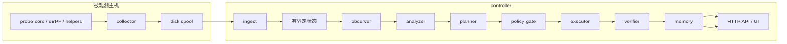

# AI SRE Agent

这是一个面向 Linux、Kubernetes、GPU 和 AI 基础设施的平台工件：节点本地采集证据，controller 侧治理事故工作流，并把 RCA 证据持久化为可复盘的 artifact。

核心原则很直接：原始证据尽量留在主机侧，controller 热状态必须有界，事故推理必须能在事后检查。controller 会为每次事故写出一条版本化 artifact chain，operator 可以沿着它检查每个逻辑角色看到了什么、推断了什么、提出了什么、执行了什么、验证了什么。

这个仓库不应被理解成单一应用。可复用的工件是 collector/controller 分离，以及围绕 evidence、policy、workflow、verification 的契约。带种子数据的本地路径只是开发便利，不是产品边界。

English: [`README.md`](README.md)

## 平台工件范围

这个 README 是 operator 面向的主文档。仓库保持小而直接：代码负责行为，测试负责回归证明，生成的 evidence 不进 git。维护范围是：

- 节点本地 probe / collector 证据采集；
- controller 侧 ingest、incident workflow、policy 和 artifact 持久化；
- 通过 NVML / probe-core 暴露 GPU 可观测性；
- `examples/gpu-platform-sre/` 里的 Kubernetes GPU demo。

## 数据面 source policy

当前 collector 在仓库里能做到的 kernel-first 路径是：

- 主机 CPU / scheduler 计数：`cpp/probe_core/main.cpp` 里的 `perf_event_open`
- per-process accounting：`cpp/probe_core/process_kernel_collector.cpp` 里的 `taskstats` generic-netlink
- interface / link 计数：`cpp/probe_core/network_kernel_collector.cpp` 里的 `rtnetlink`
- socket queue 状态：`cpp/probe_core/network_kernel_collector.cpp` 里的 `sock_diag`
- runtime event 流：`cpp/probe_core/kernel_event_protocol.cpp` 里版本化 binary event record，保留 JSON fallback 兼容旧 producer
- GPU：`cpp/probe_core/gpu_nvml.cpp` 通过 NVML；probe-core 热路径不再 shell 出 `nvidia-smi`

仍然保留文件接口的部分是显式 fallback 或冷路径：

- PSI：`/proc/pressure/*`
- cgroup 统计：`/sys/fs/cgroup/...`
- 磁盘计数与 queue 属性：`/sys/block/*`，必要时回退到 `/proc/diskstats`
- 进程 reconciliation 与 top-row enrichment：周期性 `/proc` 扫描，以及 `/proc/<pid>/smaps_rollup`、`/proc/<pid>/fd`
- 硬件发现：`hardware.refresh_interval` 控制下的低频 `/proc` / `/sys` 扫描

权限边界：

- `CAP_BPF` 或 `CAP_SYS_ADMIN`：主 eBPF 路径
- `CAP_PERFMON` 或 `CAP_SYS_ADMIN`：perf host counters
- `CAP_NET_ADMIN` 或 `CAP_SYS_ADMIN`：taskstats / sock_diag 进程路径
- 缺这些能力时，collector 会显式退化，不会假装还在跑 kernel-first 路径

## 为什么要这样做

很多自动化 SRE 原型最后都死在同几类问题上：

- 默认 telemetry 永远完整
- 把 retry 当成没有代价
- 所有推理都塞进一个大内存对象
- 建议和可执行动作之间没有清晰边界
- controller 一重启，现场就断了

这个仓库按相反的约束来设计：

- collector 侧证据可能延迟、丢失、重放
- controller 的内存和文件描述符都得算账
- 执行必须经过 policy、approval、idempotency、post-action verification
- operator 需要的是紧凑、可追查、可复盘的 artifact，而不是漂亮叙事

## 运行时形态

这些逻辑 agent 目前仍然跑在同一个 controller 进程里。真正重要的边界不是“进程数”，而是 artifact contract。每个阶段都会产出一个紧凑记录，里面有：

- schema version
- producer / consumer
- workflow / incident / correlation ID
- 时间戳和状态
- 上游 artifact ID
- evidence 引用
- replay 标记

这条链会写进 RCA evidence package，并通过 workflow API 暴露出来。

## 逻辑 agent 和职责

| 角色 | 负责什么 | 读什么 | 写什么 | 能不能改线上状态 |
| --- | --- | --- | --- | --- |
| observer | 当前窗口摘要 | collector snapshot、有界历史 | observation artifact | 不能 |
| analyzer | anomaly 聚合和 RCA 排名 | observation artifact、evidence ref | anomaly + hypothesis artifact | 不能 |
| planner | remediation proposal | hypothesis artifact、recommendation | proposal artifact | 不能 |
| policy gate | 执行资格判断 | proposal artifact、controller policy | execution-plan artifact | 不能 |
| executor | 受治理的 tool call | execution-plan artifact | execution-result artifact | 只有 posture 和 approval 允许时才行 |
| verifier | before/after 效果判断 | execution result、fresh evidence | verification artifact | 不能 |
| memory | 最终事故记录 | 全链路 artifact | final incident artifact、incident memory | 不能 |

旧的 `analysis_agent` 和 `validation_action_agent` 代码还在。artifact chain 做的是把这些旧代码收口成更清楚的逻辑责任，而不是假装仓库里已经有一堆独立 daemon。

## Artifact chain

现在事故工作流按顺序产出这些 artifact：

1. `observation_summary`
2. `anomaly_finding`
3. `root_cause_hypothesis`
4. `remediation_proposal`
5. `execution_plan`
6. `execution_result`
7. `verification_result`
8. `incident_report`

这些 artifact 故意做得很小。原始 telemetry 不会在每次 handoff 里整包复制。artifact 只带 evidence ID 和少量 raw reference，后续阶段需要细节时再回源读取。

具体 schema 由 `backend/internal/controller/agentcore/workflow_artifacts.go` 和相关测试维护。

## 确定性边界

模型可以影响 hypothesis 和 suggestion，不能直接决定执行。

执行资格仍然由 controller 代码判断：

- actuator safety classification
- policy status
- approval state
- idempotency key reuse
- post-action verification
- optional rollback handling

默认姿态仍然很保守：

- DryRun 打开
- 需要 approval
- impacting / destructive 路径默认拦住
- validation 默认只读

## 资源模型

这里默认的是“成本受限”，不是“吞吐无限”。

- **内存**：controller 热状态和 evidence 引用都做了边界控制；artifact payload 只放摘要，不放大块 telemetry。
- **FD**：collector 走磁盘 spool，controller 通过 artifact manager 持久化；单个 incident 不会长时间占着一堆打开文件。
- **并发**：action execution 是显式限流的，validation loop 有 tool-call 和 iteration budget。
- **队列压力**：replay 和 spool 都是可见、可限制的；artifact chain 本身不引入新的无界队列。
- **序列化成本**：artifact chain 足够小，可以放进 evidence package，在调试时读取也不会太重。

## 失败模型

真实系统里会遇到这些失败：

- telemetry 过期或不完整
- incident 处理中 controller 重启
- proposal 缺 rollback 数据
- verification 证据太弱，无法证明动作有效
- 同一类 incident 重复触发

当前设计对这些问题的处理方式不是“硬装作没事”，而是保留状态、暴露不确定性、在不安全时停在 proposal-only。

## 可观测性和操作面

事故期间常用接口：

- `GET /api/v1/agent/rca`
- `GET /api/v1/agent/workflow/runs`
- `GET /api/v1/agent/workflow/runs/{run_id}`
- `GET /api/v1/agent/workflow/evidence/{run_id}`
- `GET /api/v1/agent/workflow/audit`
- `GET /api/v1/status`
- `GET /api/v1/ingest/status`

常看文件：

- `data/agent/workflow_runs.db`
- `data/agent/workflows/messages/<run_id>/`
- `data/agent/workflows/evidence/<run_id>/package.json`
- artifact manager 的 metadata / payload 路径

## 部署边界

这个仓库不假设“永远只有一台 controller”。

- run metadata 可以放到 Postgres
- artifact metadata 可以放共享后端
- payload 可以从文件系统切到 S3
- 热状态仍然只在一个 active writer 上
- HA follower 仍然拒绝 ingest 写入

也就是说，durability 比以前强了，但这还不是一个完全分布式的 workflow runtime。

## 建议继续读

- [`examples/gpu-platform-sre/`](examples/gpu-platform-sre/)：可运行的 GPU demo
- [`CONTRIBUTING.md`](CONTRIBUTING.md)：变更和验证规则
