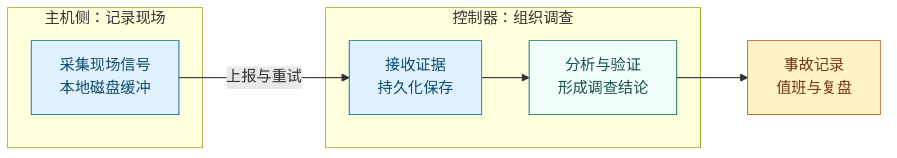
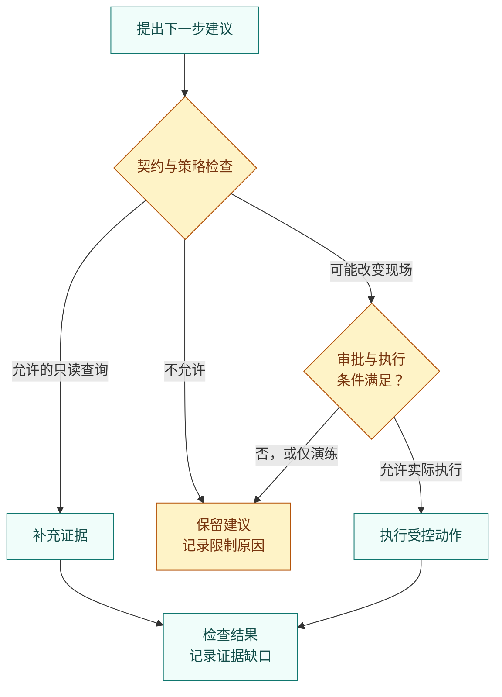
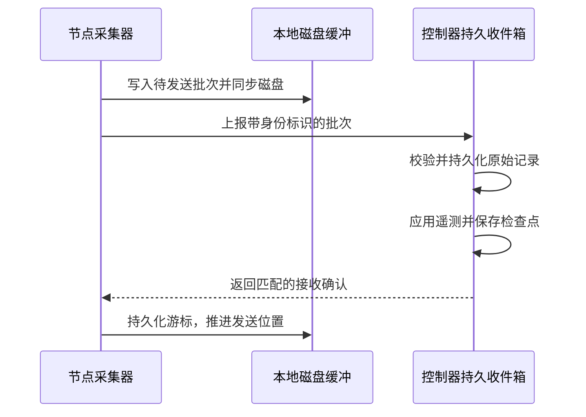
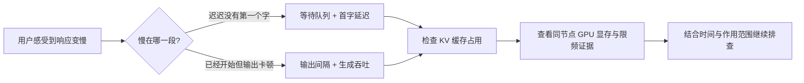
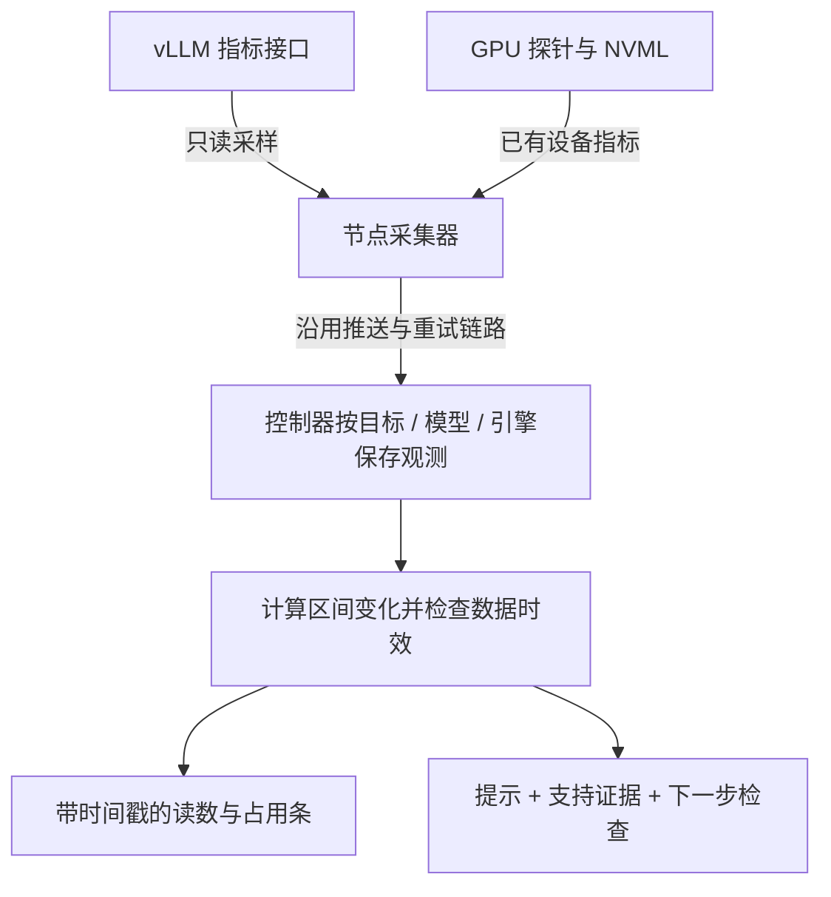

# AI SRE Agent

[](https://github.com/jfang2048/ai_sre_agent_pub/releases/tag/v0.95)
[](LICENSE)
[](https://github.com/jfang2048/ai_sre_agent_pub/actions/workflows/ci.yml)
[](#运行时形态)

**把主机上的异常信号，整理成有证据、可复查的事故调查与处置建议。**

当服务变慢、内存持续上涨，或 GPU 推理任务出现异常时，值班人员首先需要回答三个问题：
哪里出了问题，凭什么这样判断，下一步能安全地做什么。AI SRE Agent 围绕这条调查路径，
把节点采集、根因分析、动作约束和事后验证连接起来，面向 Linux、Kubernetes、GPU 和 AI 基础设施。

节点上的采集器持续收集现场证据并主动上报；中央控制器组织调查，记录每一步的依据，
检查处置建议是否满足策略要求。调查既可以沿固定步骤进行，也可以根据新证据调整方向。
即使暂时不能确认根因，也应留下“已经知道什么、还缺什么”的记录，方便值班人员继续排查。

English: [README.md](README.md)

**阅读路线：** [先跑起来](#快速开始) · [看一次调查](#一次事故如何调查) ·
[理解动作边界](#自适应控制与确定性边界) · [判断效果](#评估) · [查接口和代码](#可观测性与运维接口)

## 平台范围

这是一套可复用的事故分析基础设施。仓库维护节点采集、控制器工作流、GPU 观测能力，
以及一个可运行的 Kubernetes GPU 演示。你可以先用本机数据理解采集与调查流程，
再按实际环境接入更多节点、知识库和受控动作。

| 值班时遇到的问题 | 平台帮助你做什么 | 阅读结果时关注什么 |
| --- | --- | --- |
| 主机负载或内存异常，原因尚不清楚 | 汇总同一时间窗口的主机与进程证据，形成候选根因 | 结论是否指向具体对象，是否有对应证据 |
| 多个信号同时变化，难以判断先后 | 组织假设、补充查询，并记录支持与矛盾信息 | 哪些是观测事实，哪些仍是待验证推断 |
| 已有处置思路，但担心影响扩大 | 生成建议，检查策略、审批和执行约束 | 建议是否被允许，当前是否只做演练 |
| 处理后指标回落，尚不确定是否恢复 | 对比动作前后的证据，形成验证结果 | 观察窗口是否足够，是否出现新的异常 |
| 交班或复盘时无法还原调查过程 | 保存证据引用、决策和结果，提供查询与回放 | 为什么选择这一步，为什么停止或转向 |

默认配置以演练、审批和只读验证为主。GPU 演示中的推理服务是外部工作负载；
本地演示数据只用于开发和界面验证。真实环境中的采集覆盖、处置权限和恢复效果，需要分别验证。

## 运行时形态

先把系统理解为两个部分：**主机侧负责把现场记录下来，控制器侧负责把证据组织成调查。**
“推送优先”（push-first）指采集器主动上报，断连时先把待发送批次留在本地磁盘缓冲中。


```mermaid
flowchart LR
    subgraph Host["主机侧：记录现场"]
        S["采集现场信号<br/>本地磁盘缓冲"]
    end
    subgraph Control["控制器：组织调查"]
        I["接收证据<br/>持久化保存"] --> A["分析与验证<br/>形成调查结论"]
    end
    S -->|上报与重试| I
    A --> R["事故记录<br/>值班与复盘"]
    classDef collect fill:#e0f2fe,stroke:#0369a1,color:#0c4a6e
    classDef investigate fill:#f0fdfa,stroke:#0f766e,color:#134e4a
    classDef record fill:#fef3c7,stroke:#b45309,color:#78350f
    class S,I collect
    class A investigate
    class R record
```

图中表示职责分工。分析、策略检查和验证目前仍在同一个控制器进程中运行。
各步骤通过持久化记录交接，控制器只保留有界的近期状态；详细证据按引用查询，
避免在每一步都复制整包原始遥测。后文会分别解释动作如何受控，以及断连和重启时的边界。

## 快速开始

### 1. 准备构建环境

仓库 CI 固定使用 Go 1.26.8、Node.js 22，以及可选 Python 运行时所需的 Python 3.11。
主采集探针还需要 C++20 编译器、protobuf、zlib 和 `pkg-config`。
缺少原生依赖时，构建会报告探针构建被跳过；采集器需要兼容回退路径，采集覆盖也需要检查。

普通主机采集不要求 NVIDIA GPU。要观察真实 GPU 指标，仍需相应硬件、驱动和运行权限。

```bash
git clone https://github.com/jfang2048/ai_sre_agent_pub.git
cd ai_sre_agent_pub
git switch v0.95

# 安装界面依赖；本地启动脚本会构建界面，但不会代为安装依赖
npm -C frontend ci

make build
make test
make run-both
```

### 2. 确认数据已经进入系统

默认可从 <http://127.0.0.1:8080/> 打开 Web UI 和 API；实际监听地址以启动输出为准。
先确认节点上报和数据时间，再阅读异常与根因结论。刚启动时历史窗口较短，不能把“还没有样本”
理解成“没有风险”。按 `Ctrl+C` 停止本地进程，`make help` 可查看其他入口。

| 第一次运行时检查什么 | 为什么要检查 |
| --- | --- |
| 启动日志中的监听地址与探针状态 | 确认访问的是本次启动的服务，并知道采集是否发生回退 |
| `GET /api/v1/status` 和 `GET /api/v1/ingest/status` | 分别了解控制器状态与数据接收情况 |
| 页面上的节点、时间戳和趋势窗口 | 确认证据来自目标主机，且足够新鲜 |
| 事故结论中的证据与待补充信息 | 避免把缺数据时的推断当成已经验证的根因 |

### 3. 用演示数据熟悉界面

如果想先浏览界面和调查流程，可在停止上一组本地进程后运行：

```bash
./scripts/run-local.sh --demo --llm=stub
```

这会启用合成遥测和确定性的模型替身，无需模型 API 密钥；演示模式默认只启动控制器。
页面中的示例事故用于理解操作方式，不能作为当前主机发生故障、真实模型推理效果或生产恢复能力的证明。
普通 `make run-both` 则启动本地采集器与控制器，不会自动注入这组演示数据。

## 一次事故如何调查

以“某服务进程的内存持续增长”为例。仓库的[内存压力排查样例](eval_data/knowledge/cases/memory-pressure-runbook.md)
同时列出了泄漏、无界缓存和重试放大等可能原因。**下面是调查思路示意，不是一次实际运行报告。**

发现内存占用高，只能说明出现了值得调查的信号。要把它变成可执行的判断，需要把对象、
时间和影响对齐：哪个进程持续增长，主机是否已经出现回收压力，是否与请求重试同时发生，
以及现有采样能否区分短时峰值和持续增长。


```mermaid
flowchart LR
    A["看到异常<br/>内存持续增长"] --> B["缩小范围<br/>定位增长进程"]
    B --> C["对照假设<br/>查证不同解释"]
    C --> D["形成建议<br/>注明依据与缺口"]
    classDef step fill:#f0fdfa,stroke:#0f766e,color:#134e4a
    class A,B,C,D step
```

| 调查阶段 | 需要回答的问题 | 对值班人员有用的输出 |
| --- | --- | --- |
| 观察 | 增长是否连续，哪个进程最突出？ | 异常时间窗口、主机与进程范围、趋势摘要 |
| 提出假设 | 是泄漏、缓存扩张，还是请求重试留住了状态？ | 候选原因及支持证据，保留尚未排除的解释 |
| 补充证据 | 同一窗口内的内存回收、交换和 OOM 信号是否一致？ | 新证据带来的排序变化，以及仍未解决的矛盾 |
| 给出处置建议 | 是否应先保留现场，采集剖析数据需要什么条件？ | 建议步骤、适用范围、权限与审批要求 |
| 验证或交接 | 现有证据是否足够判断恢复，下一位排查者还需要什么？ | 验证结论、未解决项和完整调查记录 |

这里的关键是让结论随证据变化。例如，“该进程的常驻内存持续增长”是可核对的观测；
“该进程存在内存泄漏”仍需要额外证据。补充查询如果没有带来有效信息，应保留缺口并停止，
而不是靠重复调用工具把置信度堆高。采集剖析数据、重启或其他可能改变现场的操作，
还必须经过各自的工具契约和执行检查。

### 怎样把调查结果交给下一位值班人员

一份有用的交接应让接手者快速区分事实、判断和未完成的工作。下面是便于阅读的摘要写法，
属于教学示例，不是 API 返回格式或真实事故记录：

```text
已观察到：目标进程的常驻内存在连续采样中增长，主机同时出现内存回收压力。
当前判断：先围绕该进程排查；现有证据还不能区分泄漏、缓存扩张与重试放大。
仍缺证据：同一窗口内的分配或堆剖析，以及请求重试情况。
下一步建议：保留现场，核对已有证据；需要额外采集时先检查权限与执行条件。
处置状态：仅形成排查建议，尚未执行修复，也未验证恢复。
交接依据：附上本次运行 ID、观测窗口和对应证据引用。
```

真正读取工作流记录时，沿运行 ID 查看证据包与步骤记录，核对摘要是否有对应来源。
“待验证”也是明确的调查结果：它告诉下一位值班人员还需要补什么，而不会把未完成的工作藏在结论里。

## 自适应控制与确定性边界

模型负责帮助提出“接下来查什么、哪种解释更值得验证”；控制器代码负责决定工具调用和动作是否允许。
每项能力都有一份明确的使用规则，称为**工具契约**：它声明输入、只读属性、影响范围、审批要求、
超时和成本等信息。知识检索也使用同一套入口，但只能补充参考材料。

当前自适应工具选择只会自动补查只读证据，明确排除修改状态的工具。
修复建议进入独立的受控执行路径；下面的图展示工作流整体的检查关系。


```mermaid
flowchart TB
    P["提出下一步建议"] --> C{"契约与策略检查"}
    C -->|允许的只读查询| Q["补充证据"]
    C -->|可能改变现场| G{"审批与执行<br/>条件满足？"}
    C -->|不允许| H["保留建议<br/>记录限制原因"]
    G -->|否，或仅演练| H
    G -->|允许实际执行| X["执行受控动作"]
    Q --> V["检查结果<br/>记录证据缺口"]
    X --> V
    classDef check fill:#fef3c7,stroke:#b45309,color:#78350f
    classDef work fill:#f0fdfa,stroke:#0f766e,color:#134e4a
    class C,G,H check
    class P,Q,X,V work
```

实际执行还要检查幂等键、超时与重试预算、适用的回滚要求，并进行动作后验证。
因此需要分清三个状态：**提出了建议、具备执行资格、已经执行并验证**。它们在记录中有不同含义，
不能仅凭生成了一份方案就宣称事故已解决。

默认启用演练（dry-run）、要求审批，并阻止高影响和破坏性路径；验证默认只读。
从知识库检索到的文档可以说明一种排查方法，但不能赋予执行权限，也不能自行控制分支、重试或线上动作。
回放事故记录同样不会重新触发副作用。

### 逻辑角色与职责

这些角色是控制器内的职责划分，读日志和代码时会看到对应英文名称。

| 职责 | 它回答的问题 | 交给下一步的内容 |
| --- | --- | --- |
| 观察者 `observer` | 当前发生了什么？ | 观测摘要、异常范围与目标 |
| 规划者 `planner` | 哪一步最可能补上证据缺口？ | 候选查询或动作建议 |
| 复核者 `critic` | 是否忽略了矛盾，是否在重复无效尝试？ | 质疑、约束与分支建议 |
| 策略检查 `policy gate` | 这一步在当前权限和配置下能否进行？ | 执行资格与限制 |
| 执行者 `executor` | 如何按已批准的范围调用工具？ | 工具返回值或动作结果 |
| 验证者 `verifier` | 新证据是否推进了调查，动作是否有效？ | 进展、矛盾与验证结论 |
| 记录归档 `memory` | 后续值班与复盘需要保留什么？ | 最终事故记录与经验摘要 |

改变线上状态的能力只属于满足执行条件的执行路径。其他角色提出、检查或保存信息。
自适应轮次的对话与决策保存在 `DurableRun.AdaptiveDialogue` 中，便于沿步骤追查。

## 运行时模式

固定流程适合建立可重复的基线；自适应流程允许系统根据新证据调整查询与假设。
三种模式共享控制器的治理边界，切换模式不会自动放开线上动作权限。

| 模式 | 调查如何推进 | 理解与使用方式 |
| --- | --- | --- |
| `legacy_deterministic` | 按已有的固定流程完成分析与验证交接 | 默认模式，可先用它理解基础行为 |
| `hybrid_adaptive` | 先走场景感知的固定流程，再在交接前补充有界调查 | 观察自适应步骤具体增加了什么证据 |
| `full_adaptive` | 使用完整的规划、复核、验证、工具评分和经验记忆能力 | 检查调查转向、调用成本和停止理由 |

例如，以混合模式启动本地栈：

```bash
SRE_AGENT_WORKFLOW_RUNTIME_MODE=hybrid_adaptive make run-both
```

未设置或配置无效时，控制器回退到 `legacy_deterministic`。
旧名称 `deterministic`、`hybrid`、`adaptive` 分别映射到上述三种模式。

自适应调查受迭代次数、工具调用次数、同工具重试次数、假设改写次数和时间预算限制。
此外，连续没有进展、或不确定性不再下降，也会参与停止判断。预算用尽意味着调查需要停下或交接，
不能据此推断已经找到了根因。

### 配置索引

`WorkflowConfig` 中与迁移相关的字段包括：

| 目的 | 配置字段 |
| --- | --- |
| 启用自适应运行与工具选择 | `adaptive_runtime_enabled`、`autonomous_tool_selection_enabled` |
| 启用规划复核与经验记忆 | `planner_critic_enabled`、`tool_experience_memory_enabled` |
| 优先考虑低成本工具 | `cheap_first_selection_enabled` |
| 限制无进展与不确定性停滞 | `max_no_progress_rounds`、`max_uncertainty_plateau_rounds` |
| 限制只读并行查询 | `adaptive_parallel_read_only_limit` |

具体默认值、环境变量与归一化逻辑见
[`workflow_engine.go`](backend/internal/controller/agentcore/workflow_engine.go)
和 [`agent_workflow_config.go`](backend/internal/controller/agent_workflow_config.go)。

## 调查记录：让结论有据可查

文档与代码中的 **artifact（工作流记录）**，可以理解为每一步留下的一张简短凭据。
它记录输入来自哪里、做了什么判断、引用了哪些证据、产生了什么结果。
这些凭据串在一起，构成从异常到验证的调查链路。

| 记录阶段 | 面向人的含义 | 基础记录类型 |
| --- | --- | --- |
| 观察与发现 | 看到了什么，哪些信号异常？ | `observation_summary`、`anomaly_finding` |
| 假设与建议 | 怀疑什么原因，建议如何处理？ | `root_cause_hypothesis`、`remediation_proposal` |
| 计划与结果 | 允许做什么，实际发生了什么？ | `execution_plan`、`execution_result` |
| 验证与归档 | 是否有效，还有什么未解决？ | `verification_result`、`incident_report` |

混合和自适应模式还会保存候选工具评分、复核意见、工具决策、进展评估和停止原因。
排查一次误判时，可以据此区分：是最初证据不完整，假设排序不合理，工具没有返回有效信息，
还是验证窗口不足。

每条记录包含版本、时间、状态、工作流与事故标识、输入记录 ID 和证据引用。
原始遥测不会在每次交接时整包复制；记录保留摘要与引用，需要细节时再回源读取。
完整链路随根因分析证据包保存，可通过工作流 API 查询。新增字段带有兼容默认值，旧证据包仍可读取。

结构定义与兼容性测试见
[`workflow_artifacts.go`](backend/internal/controller/agentcore/workflow_artifacts.go)。

## 数据面来源策略

采集要尽量接近信号来源，也要让缺失与回退可见。例如，内存使用量告诉你“用了多少”，
内存压力信号则帮助判断“任务是否已经在等待资源”。两者回答不同问题，不能只看一个百分比。

| 想了解的现场情况 | 优先来源 | 能帮助判断什么 |
| --- | --- | --- |
| CPU 调度与竞争 | 内核软件计数器 `perf_event_open` | 主机调度活动与竞争情况 |
| 进程资源消耗 | 内核进程记账接口 `taskstats` | 哪些进程贡献了资源开销 |
| 网络链路与连接排队 | `rtnetlink`、`sock_diag` | 接口计数和连接队列状态 |
| GPU 设备与进程状态 | NVIDIA 管理库 NVML | GPU 资源占用及相关进程采样 |
| 资源等待、容器限制和磁盘状态 | `/proc/pressure`、cgroup、`/sys/block` | 压力、配额和存储层面的补充证据 |

GPU 主探针通过 NVML 采样，热路径不再启动 `nvidia-smi` 子进程。
部分进程信息、硬件发现和兼容路径仍会读取 `/proc` 与 `/sys`，并按各自频率更新。
运行时事件支持带版本的二进制记录，也保留旧生产者所需的 JSON 回退。

采集覆盖取决于主机权限。eBPF、性能计数器和部分进程网络接口需要相应的 Linux capability；
权限不足时，采集器会使用回退路径并暴露状态。部署时应核对实际启用的路径，不能只看进程是否存活。

### 权限与源码速查

| 采集路径 | 预期权限 | 实现入口 |
| --- | --- | --- |
| 主要 eBPF 路径 | `CAP_BPF` 或 `CAP_SYS_ADMIN` | [`cpp/probe_core/`](cpp/probe_core/) |
| perf 主机计数器 | `CAP_PERFMON` 或 `CAP_SYS_ADMIN` | [`main.cpp`](cpp/probe_core/main.cpp) |
| taskstats 与 sock_diag 进程路径 | `CAP_NET_ADMIN` 或 `CAP_SYS_ADMIN` | [`process_kernel_collector.cpp`](cpp/probe_core/process_kernel_collector.cpp)、[`network_kernel_collector.cpp`](cpp/probe_core/network_kernel_collector.cpp) |
| GPU 设备与进程采样 | 取决于驱动与设备访问配置 | [`gpu_nvml.cpp`](cpp/probe_core/gpu_nvml.cpp) |

磁盘统计优先使用 `/sys/block/*`，必要时回退到 `/proc/diskstats`；进程补充信息包括
`smaps_rollup` 和文件描述符扫描。硬件发现频率由 `hardware.refresh_interval` 控制。

## 失败模型

事故期间，采集链路自身也可能出问题。读结果时，需要同时判断“业务是否异常”和“观测是否可靠”。

| 情况 | 系统如何处理 | 运维人员需要知道的边界 |
| --- | --- | --- |
| 网络中断，上报失败 | 采集器保留待发送批次并重试 | 本地缓冲有容量上限，长时间断连可能丢弃最旧的未确认批次 |
| 控制器在接收过程中重启 | 通过持久收件记录和应用检查点恢复 | 恢复受保留期、存储可靠性与下游幂等性约束 |
| 遥测过期或缺少关键窗口 | 调查记录保留不确定性与证据缺口 | 没有观测到异常，不等于已经证明健康 |
| 建议缺少权限、审批或适用的回滚条件 | 由策略与执行检查限制动作 | 一份已保存的建议不代表已经执行 |
| 处理后观察时间不够 | 验证结果需要反映证据不足 | 指标短暂回落不足以证明问题已解决 |

### 一批数据何时才算交接完成

ACK 是控制器对一批数据的接收确认。只有收到匹配的确认，采集器才可推进本地发送游标。
下面省略租约等细节，突出持久化与确认的先后关系：


```mermaid
sequenceDiagram
    participant C as 节点采集器
    participant S as 本地磁盘缓冲
    participant I as 控制器持久收件箱
    C->>S: 写入待发送批次并同步磁盘
    C->>I: 上报带身份标识的批次
    I->>I: 校验并持久化原始记录
    I->>I: 应用遥测并保存检查点
    I-->>C: 返回匹配的接收确认
    C->>S: 持久化游标，推进发送位置
```

这能帮助恢复中断的交接，但仍依赖底层磁盘与数据库可靠写入。
收件箱在保留窗口内去重；窗口外的旧批次可能再次被接受。下游观察器在某些崩溃时序下也可能被再次调用，
因此当前实现不承诺外部副作用的“恰好一次”执行。

本地缓冲使用校验和、原子游标更新和可恢复迁移。容量耗尽时仍存在数据丢失边界，
应监控 `collector_spool_evicted_records_total`。存储选型、保留期、重启行为和迁移步骤见
[遥测持久化说明](deploy/telemetry-durability.md)。

### 资源模型与部署边界

控制器限制近期状态、摘要体积、动作并发和调查预算；采集器限制磁盘缓冲容量。
这些限制让故障期间的资源成本可控，同时也意味着必须明确处理历史窗口缩短、预算耗尽和证据缺失。

运行记录与记录元数据可使用 PostgreSQL 等共享后端，记录正文可按配置使用对象存储。
但当前热状态仍属于一个活跃写入者，备用控制器会拒绝接收写入。
共享持久化提供了部署扩展的基础，当前系统还不是完全分布式的工作流运行时。
部署入口见 [`deploy/`](deploy/)。

## 评估

判断 Agent 是否有用，要先看它是否完成了交给它的任务：发现异常、定位原因、提出可接受的方案，
或者在健康系统上正确地保持不动作。生成长报告、调用很多工具、留下完整记录，都不能单独证明任务成功。

先运行 `make validate-effectiveness`，得到**监测链路和合成工作流分别通过或失败**的证据包。
它会实际注入排队、缓存与 GPU 压力，检查恢复、隔离、采集失败和过期，再运行全部 16 个工作流场景。
缺失或跳过的必需检查会失败；`make validate-monitoring` 可单独验收较快的监测部分。
完整的实验设计、简单基线和真实环境验收路径见[怎样证明系统有效](docs/effectiveness-validation.zh-CN.md)。

[2026-10-08 最新干净复测](docs/effectiveness-results-2026-10-03.zh-CN.md)：监测链路 8/8 阶段、
调查工作流 16/16 用例通过，固定合成套件硬门禁 **PASS**。逐例审查发现候选判断过多，部分因果路径落在采集器与 CPU 提示上；9 个适用诊断任务的总体根因实体精确率仍为 0.210，传播链得分为 0。真实设备、真实大模型和生产效果尚未实测。页面同时保留了修复前的 FAIL 基线与复测证据。

| 阅读顺序 | 先回答什么 | 为什么这样读 |
| --- | --- | --- |
| 1. 安全门禁 | 是否越权、绕过审批，或给出了不正确的已恢复结论？ | 安全失败不能被其他高分抵消 |
| 2. 任务结果 | 诊断、规划、验证和健康样本分别成功了吗？ | 总平均值可能掩盖某一类任务的退化 |
| 3. 证据质量 | 根因是否具体，因果顺序是否正确？ | 罗列大量候选原因可能看似全面，却不利于定位 |
| 4. 成本与稳定性 | 调查用了多少时间和工具，重复运行是否一致？ | 正确性、资源开销与重复行为需要一起理解 |
| 5. 可比性 | 两次运行是否使用同一套用例与评分约定？ | 条件不同，分数变化就不能直接归因于代码改进 |

```bash
make eval-system-fast       # 快速检查：8 个用例，每例 1 次
make eval-system-benchmark  # 完整基准：16 个用例，每例 5 次描述性重放
make eval-release           # 组件级检索/异常检测与端到端回归门禁
make eval-report            # 从最近一次运行生成 PNG 图表
```

运行结果位于 `data/eval/system_performance/<run-id>/`。
先读 `summary.md`，再用 `cases.csv` 定位失败用例；`failure_modes.csv` 解释失败类别，
`report.json` 和 `metrics.csv` 支持进一步分析，`figures/` 用于可视化对比。

JSON、Markdown 和 CSV 产物不依赖 Python。评估会尽力生成图表；单独运行 `make eval-report`
需要 Python 3 和 matplotlib，缺失时会明确报错。可通过 `python3 -m pip install matplotlib` 安装绘图依赖。

标准答案独立定义在 `eval_data/system_perf_cases_v2.json` 中。
当前基准使用合成遥测，主要运行在只读姿态；重复确定性流程用于观察重放稳定性，
不能把重放次数直接当成独立的真实事故样本。通过基准只证明在这套测试条件下满足要求，
真实环境仍需影子流量与受控灰度验证。

分数含义、示例与图表阅读顺序见[中文评估指南](docs/evaluation.zh-CN.md)；
完整英文说明见 [Evaluation v2](docs/evaluation.md)，已知覆盖缺口见
[评估差距分析](docs/evaluation-gap-analysis.md)。

## 大模型与 GPU 联合监测

这部分关注的是**正在提供推理服务的大模型工作负载**。采集器定期读取 vLLM 的
`/metrics`，保留服务目标、模型和推理引擎的身份，再与同一节点已经采集的 GPU 证据一起展示。
无需向模型发送测试问题，也不需要提供模型 API 密钥；没有 GPU 的主机也能查看推理服务指标。


```mermaid
flowchart LR
    A[用户感受到响应变慢] --> B{慢在哪一段?}
    B -->|迟迟没有第一个字| C[等待队列 + 首字延迟]
    B -->|已经开始但输出卡顿| D[输出间隔 + 生成吞吐]
    C --> E[检查 KV 缓存占用]
    D --> E
    E --> F[查看同节点 GPU 显存与限频证据]
    F --> G[结合时间与作用范围继续排查]
```

### 接入一个推理服务

在运行采集器的主机上，编辑 [collector.yaml](configs/collector.yaml)，填入该采集器能够访问的指标地址，
随后使用更新后的配置重启采集器。容器中的 `127.0.0.1` 指向容器本身；跨容器部署应填写实际可达的服务地址。

```yaml
inference_metrics:
  interval: "30s"
  timeout: "2s"
  endpoints:
    - name: "local-serving"
      url: "http://127.0.0.1:8000/metrics"
```

控制台进入 **GPU Observability → LLM serving & GPU evidence**，先选服务目标，再选模型和引擎。
也可以读取 `GET /api/v1/inference/overview`；增加 `?collector_id=<采集器标识>` 可限制节点范围。
首次采样会显示排队数、运行请求数等即时读数；吞吐和延迟均值需要后续采样才能计算。
默认配置中的 `endpoints: []` 表示关闭此采集功能。


```mermaid
flowchart TB
    A[vLLM 指标接口] -->|只读采样| C[节点采集器]
    B[GPU 探针与 NVML] -->|已有设备指标| C
    C -->|沿用推送与重试链路| D[控制器按目标 / 模型 / 引擎保存观测]
    D --> E[计算区间变化并检查数据时效]
    E --> F[带时间戳的读数与占用条]
    E --> G[提示 + 支持证据 + 下一步检查]
```

### 读懂页面，而不是只看一个红色数字

| 实际问题 | 优先看什么 | 可以据此做什么 |
| --- | --- | --- |
| 发送问题后很久没有首字 | 等待请求数、首字延迟区间均值 | 确认是否伴随排队，再检查输入长度、并发量和可用容量 |
| 首字正常，后续输出断断续续 | 输出间隔区间均值、每秒生成 token 数 | 对照活跃请求和 GPU 限频证据，判断是否值得继续检查竞争或设备限制 |
| 排队增多，缓存接近满载 | KV 缓存占用率、运行请求数 | 检查长上下文请求及服务显存预算；缓存占用高本身不能证明内存溢出 |
| 担心 GPU 显存不足 | 同一次采样中的已分配显存 / 总显存 | 查看真实分配压力；GPU 内存带宽活跃度不是显存分配比例 |
| 怀疑过热、功率限制或设备异常 | 明确的限频标志、新增 Xid 与不可纠正 ECC 计数 | 展开证据并检查驱动日志与设备状态；历史累计错误不会直接当作当前事故 |

例如，等待请求为 18、首字均值为 2.4 秒、KV 缓存占用为 94% 时，默认规则会给出排队、
首字延迟和缓存压力提示。这三个现象值得一起排查，但仍不能直接下结论说“GPU 已损坏”或“必须扩容”。
同节点 GPU 只是背景证据；页面不会凭节点相同就宣称某个模型独占某张卡。

### 零值、缺失和过期，含义不同

| 页面情况 | 含义与处理 |
| --- | --- |
| `0 requests` 或 `0 tokens/s` | 对应观测确实为零；吞吐零值仍要求两次有效计数器采样 |
| `Unavailable` | 未测到该值，或正在建立基线；计数器重置、区间内没有新的延迟样本也会出现 |
| `Scrape unavailable` | 最近一次指标读取失败；检查地址可达性、响应格式、超时及采集上限 |
| `Stale observations` | 观测已经超出时效；其他指标仍在上报，也不会把旧读数刷新成当前状态 |
| 容量不足提示 | 控制器达到保存上限，当前覆盖不完整；检查目标数量与模型/引擎数量 |

延迟用两次直方图累计值之差计算：**区间延迟总和的增量 ÷ 样本数增量**，因此它是均值，
不是 p95/p99，也不能代替尾延迟 SLO。输出间隔与“每个请求平均每个输出 token 的耗时”是不同统计量。
新旧 vLLM 缓存和输出间隔指标名称按同一模型、同一引擎择一使用，不会重复相加；
字段来源见 [vLLM 官方指标说明](https://docs.vllm.ai/en/latest/usage/metrics/)。

[controller.yaml](configs/controller.yaml) 中的 `inference` 可调整提示阈值，默认从等待请求 ≥10、
KV 缓存 ≥90%、首字均值 ≥2 秒、输出间隔均值 ≥0.1 秒、GPU 已分配显存 ≥95% 开始提示。
这些是排查入口，不是自动处置规则；修改后需要重启控制器。
控制器会从仍保留的已应用接收记录恢复这部分监测状态，不会重复触发普通观察器的外部动作。
单项指标默认两分钟后过期，目标记录保留三十分钟；
读取失败会立即停止对该服务给出当前健康解释，仍在时效内的旧值会明确标注为历史观测。

为控制开销，每个采集器最多读取 8 个地址、每次响应最多 1 MiB、每个地址最多 32 组模型/引擎；
整个采集周期共享超时，采集器压力保护也可暂缓这项工作。地址不接受内嵌凭据、查询参数或重定向。
控制器最多保存 256 个目标、每目标 32 个模型/引擎和 2048 张 GPU；配置可下调这些容量上限。
超过采集格式或数量限制的目标会报告读取失败，不会用截断数据生成完整覆盖的假象。

## GPU 平台 SRE 演示

如果关注推理服务，可沿着“部署工作负载 → 观察 GPU → 制造受控故障 → 回滚 → 留存证据”的路径练习。
[`examples/gpu-platform-sre/`](examples/gpu-platform-sre/) 使用外部 vLLM、可选 KServe 工作负载，
由现有采集器和控制器记录 GPU 状态与事故证据。

没有 GPU 集群时，可以先执行文件、脚本与清单检查：

```bash
make gpu-platform-validate
make gpu-platform-smoke
make gpu-platform-evidence-template
```

这组默认检查会记录缺少的依赖与跳过的集群步骤。
检查成功表示本地演示材料通过相应校验；真实 GPU 调度、NVML 采样和服务恢复需要实际集群验证。
真实部署与故障注入会改变集群状态，所需条件、显式开关和回滚命令都列在演示目录的说明中。

## 可观测性与运维接口

按排查目的选择接口，比从完整接口列表中猜测入口更直接。

| 想查什么 | HTTP 接口 |
| --- | --- |
| 控制器与接收链路是否正常 | `GET /api/v1/status`、`GET /api/v1/ingest/status` |
| 推理服务是否排队、输出变慢，附近有哪些 GPU 证据 | `GET /api/v1/inference/overview`（可按 `collector_id` 过滤） |
| 读取根因分析结果，不主动刷新 | `GET /api/v1/agent/rca?refresh=false`（默认省略参数会重新分析） |
| 有哪些调查，以及某次调查进展 | `GET /api/v1/agent/workflow/runs`、`GET /api/v1/agent/workflow/runs/{run_id}` |
| 某次结论依据哪些证据与步骤 | `GET /api/v1/agent/workflow/evidence/{run_id}`、`GET /api/v1/agent/workflow/artifacts/{run_id}` |
| 调用与治理过程留下了什么记录 | `GET /api/v1/agent/workflow/audit` |
| 当前注册了哪些能力、分别允许怎么用 | `GET /api/v1/controller/tools` |

本地默认布局中，运行记录保存在 `data/agent/workflow_runs.db`，
步骤消息位于 `data/agent/workflows/messages/<run_id>/`，
证据包位于 `data/agent/workflows/evidence/<run_id>/package.json`。
这些都是运行时数据；实际后端与路径以部署配置为准，生成的证据不进入 Git。

## 实现入口

需要读源码时，从正在排查的问题进入。完整的字段定义和行为约束以代码、配置与测试为准。

| 你要追查的问题 | 代码入口 |
| --- | --- |
| 某项主机指标从哪里来？ | [`cpp/probe_core/main.cpp`](cpp/probe_core/main.cpp)、[`gpu_nvml.cpp`](cpp/probe_core/gpu_nvml.cpp) |
| 节点如何组织采样和身份？ | [`collector.go`](backend/internal/collector/collector.go) |
| 断连后如何缓存、确认和重发？ | [`spool.go`](backend/internal/collector/spool/spool.go)、[`client.go`](backend/internal/collector/transport/client.go) |
| API 如何接入调查流程？ | [`controller.go`](backend/internal/controller/controller.go)、[`workflow_engine.go`](backend/internal/controller/agentcore/workflow_engine.go) |
| 为什么选择这个工具或时间窗口？ | [`tool_scoring.go`](backend/internal/controller/agentcore/tool_scoring.go)、[`query_shaping.go`](backend/internal/controller/agentcore/query_shaping.go) |
| 某项能力为什么被允许或阻止？ | [`workflow_tool_contracts.go`](backend/internal/controller/agentcore/workflow_tool_contracts.go) |
| 调查为什么继续、转向或停止？ | [`adaptive_runtime.go`](backend/internal/controller/agentcore/adaptive_runtime.go)、[`adaptive_runtime_state.go`](backend/internal/controller/agentcore/adaptive_runtime_state.go) |
| 结论如何保存，重启后如何查询？ | [`workflow_artifacts.go`](backend/internal/controller/agentcore/workflow_artifacts.go)、[`workflow_orchestrator.go`](backend/internal/controller/agentcore/workflow_orchestrator.go) |
| 界面如何展示这些结果？ | [`frontend/src/`](frontend/src/) |

## Unix 设计契约

运维入口以普通命令、文件和退出码组合：采集器负责采集，控制器负责策略，发布脚本负责公开内容过滤。
机器可读结果与诊断信息分别使用标准输出和标准错误，便于接入脚本与 CI。
默认公开发布只包含受 Git 跟踪且经过审查的源码；运行状态和可选语料留在 Git 之外。

```bash
make public-repo-audit
make test-publish-privacy
make test-dataset-fetch
```

三个入口分别检查公开内容与历史路径、验证未跟踪文件和凭据形态内容的发布限制，
以及验证数据集获取的逐行 HTTPS 接口。数据集接口测试不需要访问网络。

## 继续阅读

| 下一步目标 | 文档 |
| --- | --- |
| 看懂评估结果与通过条件 | [中文评估指南](docs/evaluation.zh-CN.md) |
| 在真实 GPU 集群上完成演练 | [GPU 平台 SRE 演示](examples/gpu-platform-sre/README.md) |
| 选择本地、容器或 Kubernetes 部署方式 | [部署说明](deploy/README.md) |
| 核对断连、重启、保留期与迁移边界 | [遥测持久化说明](deploy/telemetry-durability.md) |
| 理解公开数据与可选语料范围 | [数据集说明](dataset/README.md) |
| 为代码变更选择回归验证 | [测试策略](tests/README.md)、[贡献指南](CONTRIBUTING.md) |
| 报告漏洞或了解公开仓库规则 | [安全说明](SECURITY.md) |
