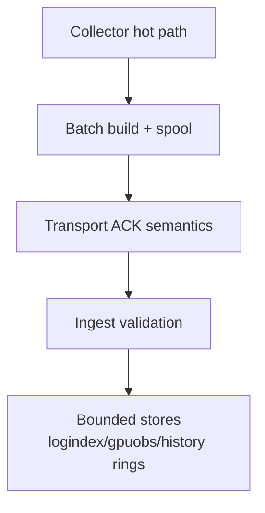
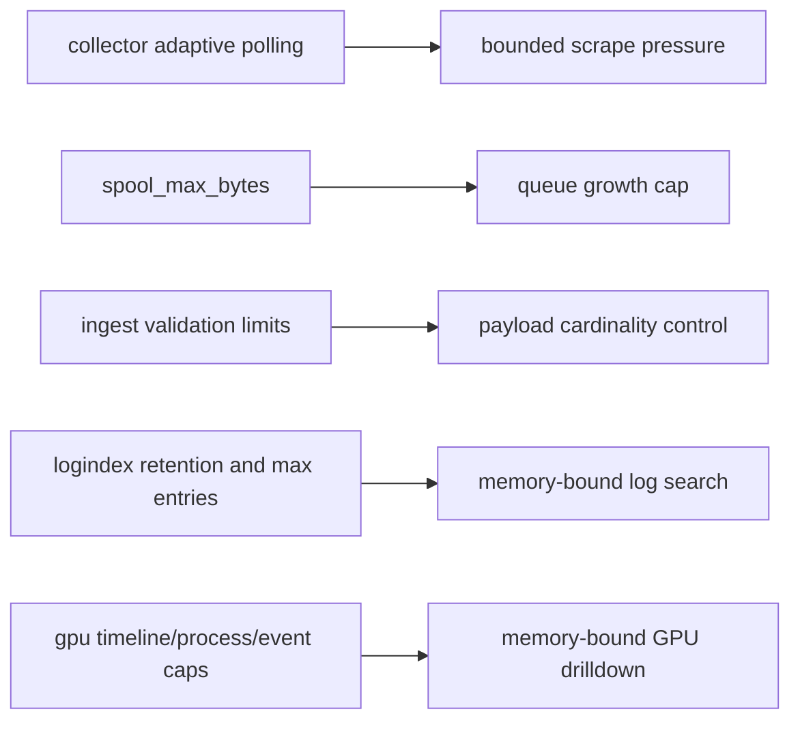

# Refactoring Progress (v0.4)

## Current State
Refactoring work in the repository currently centers on runtime safety and bounded-resource behavior rather than feature expansion.

## Delivered Refactoring Outcomes
- Collector runtime
  - bounded marshal buffer pool reuse
  - adaptive polling with min/max interval clamping
  - transport runtime config reload path
- Controller ingest
  - strict batch validation and clear reject counters
  - modular processor model for GPU aggregation side effects
- Log subsystem
  - segmented index with bounded query windows and retention
  - explicit payload/body limits on service log ingest
- GPU subsystem
  - bounded timeline rings and per-GPU process limits
  - periodic dirty-node flush strategy to reduce write amplification

## Runtime Refactoring Map

## Bounded-Resource Control Points

## Open Refactoring Targets (Implementation-Driven)
- Strengthen persistence guarantees for controller memory-first paths.
- Reduce duplication between pull-scrape node state and push-ingest fleet state.
- Consolidate API response schemas for cross-module consistency.
- Improve traceability from diagnostics outputs back to raw source signals.

## Tracking Anchors
- Collector: `backend/internal/collector/*`
- Controller ingest/log/gpu: `backend/internal/controller/{ingest,logindex,gpuobs}/*`
- Security posture checks: `backend/internal/pkg/security/runtime_audit.go`
