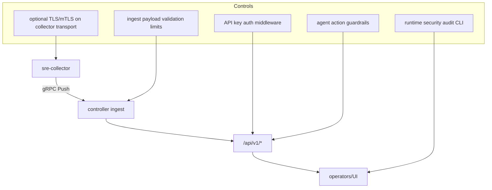
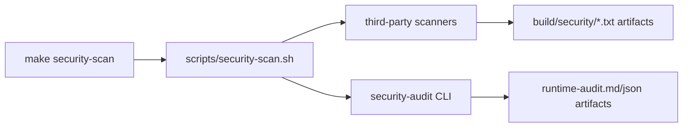

# Security Policy

## Responsible Disclosure
- Report vulnerabilities privately to repository maintainers.
- Include reproduction steps, affected paths, and expected impact.
- Avoid public issue disclosure until a fix is available.

## Security Architecture


## Security Audit Execution Path


## Runtime Controls Implemented in v0.4
- Controller API auth: optional API key (`auth.enabled`, env-backed secret).
- Collector transport: optional TLS/mTLS with certificate reload interval.
- Ingest payload hard limits:
  - max metrics per batch: `20000`
  - max processes per batch: `5000`
  - max logs per batch: `5000`
- Service log ingest limits:
  - request body max: `4 MiB`
  - max entries per request: `5000`
- External command safety:
  - `external_metrics_cmd` parsing rejects shell-control characters.
- Agent action execution:
  - approval token checks and idempotency windows in `agentcore` execution path.

## Deployment Hardening Baseline
- Keep controller HTTP/gRPC listeners on loopback for local development.
- Enable TLS for non-loopback collector endpoints.
- Keep API keys and TLS material in environment variables or mounted secrets.
- Run containers with least privilege and read-only root filesystem where possible.

## Automated Security Checks
### Runtime audit
```bash
make security-audit
```

### Full security scan orchestration
```bash
# local-friendly mode
make security-scan

# strict mode for CI
SECURITY_SCAN_STRICT=1 make security-scan
```

`security-scan` wraps:
- `govulncheck`
- `gosec`
- `pip-audit`
- `bandit`
- `cppcheck`
- `gitleaks`
- `hadolint`
- `yamllint`
- built-in `security-audit` markdown/json report generation

## Runtime Audit Check Set
`backend/internal/pkg/security/runtime_audit.go` evaluates:
- controller exposure and API authentication posture;
- collector transport TLS posture;
- external metrics command safety;
- sensitive runtime file permissions;
- Helm least-privilege defaults;
- environment variable secret exposure risks;
- Docker Compose security posture.

## Interpreting Results
- `pass`: no issue for that rule.
- `warn`: potentially unsafe posture; review before production rollout.
- `fail`: direct high-risk misconfiguration; block deployment until fixed.
