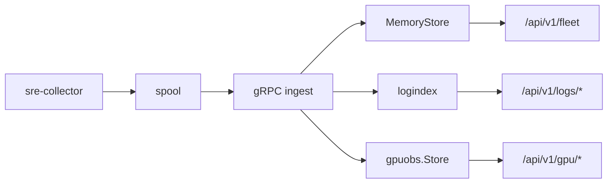
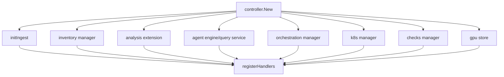

# System Status (v0.4)

## Snapshot
Status reflects code paths wired by `controller.registerHandlers` and collector runtime in `backend/internal/collector`.

## Runtime Topology

## Module Registration Gates

## Core Services
- `sre-collector`
  - host/process/log/GPU collection
  - persistent spool queue
  - gRPC push with endpoint failover or mirror mode
- `sre-controller`
  - gRPC ingest validation + ACK
  - in-memory fleet state and trend history
  - native log index and search APIs
  - diagnostics, optional analysis/agent/orchestration modules

## API Surface Status
- Always registered:
  - `/api/v1/status`, `/api/v1/topology`, `/api/v1/top/programs`
  - `/api/v1/diagnostics/*`
  - `/api/v1/ingest/*`, `/api/v1/fleet*`, `/api/v1/logs/*`
  - `/health`, `/healthz`, `/metrics`, `/ui`
- Conditionally registered by config:
  - `analysis`, `agent`, `orchestration`, `inventory`, `k8s`, `checks`, `incidents/alerts`

## Storage and Retention State
- Ingest and log search are memory-first.
- Log index defaults:
  - retention: `6h`
  - segment duration: `1m`
  - max entries: `200000`
- GPU store persists snapshots/history/events under `data/gpu/*`.

## Known Constraints (Current Implementation)
- Controller restart resets in-memory ingest/log state.
- Long-range historical analytics require an external storage layer (not part of v0.4 runtime).
- Kubernetes integration is read-only and disabled by default.
