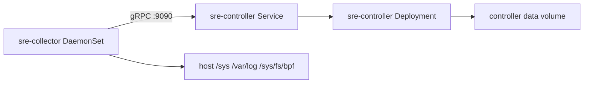

# Push-First Kubernetes Deployment

This directory is the raw `cluster-lite` Kubernetes path for `v0.95`.

## What It Deploys

- one central `sre-controller` `Deployment`
- one `sre-collector` `DaemonSet`
- controller and collector ConfigMaps
- optional controller static-targets ConfigMap
- read-only controller RBAC

This is the quickest maintained cluster path in the repo. It is intentionally simpler than the HA Helm path.

It is also intentionally honest. The shipped ConfigMap keeps `deployment.insecure_override: true` because controller data still sits on `emptyDir`. That override is covering both local workflow durability and local artifact payloads. Controller HTTP auth and gRPC ingest auth are turned on in the raw manifests, the workflow store stays on local BoltDB, artifact metadata follows that local store, artifact payloads stay on filesystem, ingest transport stays plaintext, and the collector stays on the `deep-runtime` privilege profile. Supply the token secrets before rollout, then move to the Helm examples when this cluster needs shared workflow metadata, shared artifact metadata, S3-backed artifact payloads, or TLS.
The shipped ConfigMap also enables a stricter action-only rate limit than the general API budget so mutation routes stay bounded even in cluster-lite mode.
It also assumes one active controller instance for gRPC ingest ownership. If you scale controllers behind the same Service without adding leader-aware routing, collectors will hit followers and receive gRPC `Unavailable` before any hot-state mutation.
Controller workflow metadata, artifact metadata, artifact payloads, and the local RAG index stay on `emptyDir` in this raw path. Use the Helm chart when you need PVC-backed controller data, shared workflow metadata, S3-backed artifact payloads, or guarded transport.

## Why This Changed

The raw manifests no longer depend only on image-baked config.

They now mount:

- [`controller-configmap.yaml`](controller-configmap.yaml)
- [`controller-targets-configmap.yaml`](controller-targets-configmap.yaml)
- [`collector-configmap.yaml`](collector-configmap.yaml)

That makes cluster rollout easier to reason about and reduces one-machine assumptions.

## Files

- [`namespace.yaml`](namespace.yaml)
- [`rbac-readonly.yaml`](rbac-readonly.yaml)
- [`controller-configmap.yaml`](controller-configmap.yaml)
- [`controller-auth-secret.example.yaml`](controller-auth-secret.example.yaml)
- [`controller-targets-configmap.yaml`](controller-targets-configmap.yaml)
- [`controller.yaml`](controller.yaml)
- [`collector-configmap.yaml`](collector-configmap.yaml)
- [`collector-ingest-auth-secret.example.yaml`](collector-ingest-auth-secret.example.yaml)
- [`collector-daemonset.yaml`](collector-daemonset.yaml)
- [`kustomization.yaml`](kustomization.yaml)

## Topology



## Apply

```bash
# Replace placeholders in the example Secrets first.
kubectl apply -f deploy/k8s/push-first/controller-auth-secret.example.yaml
kubectl apply -f deploy/k8s/push-first/collector-ingest-auth-secret.example.yaml
kubectl apply -k deploy/k8s/push-first
```

## What To Edit First

Before applying to a real cluster, review:

- [`controller-configmap.yaml`](controller-configmap.yaml)
  - `deployment.cluster_name`
  - `auth.enabled`
  - `auth.mode`
  - `agent.rag_vector_backend`
  - `agent.rag_dataset_path`
- [`controller-auth-secret.example.yaml`](controller-auth-secret.example.yaml)
  - `token-secret` for controller-signed bearer tokens
  - compatibility API-key fields only if you still need them
- [`collector-ingest-auth-secret.example.yaml`](collector-ingest-auth-secret.example.yaml)
  - shared collector service token for raw DaemonSet bootstrap
  - mint it with `sre-controller mint-token`
- [`controller-rag-secret.example.yaml`](controller-rag-secret.example.yaml)
  - only needed when the raw `cluster-lite` path is pointed at an external vector backend
- [`collector-configmap.yaml`](collector-configmap.yaml)
  - `deployment.cluster_name`
  - `deployment.data_root`
  - `privilege_profile`
  - `transport.allow_plaintext`
- [`collector-daemonset.yaml`](collector-daemonset.yaml)
  - host mounts
  - collector capabilities
  - controller endpoint env
  - `SRE_COLLECTOR_ID` / `SRE_COLLECTOR_HOSTNAME` sourced from `spec.nodeName`

## Validation

```bash
kubectl -n sre-agent get pods
kubectl -n sre-agent get svc sre-controller
kubectl -n sre-agent logs deploy/sre-controller --tail=100
kubectl -n sre-agent logs ds/sre-collector --tail=100
kubectl -n sre-agent port-forward deploy/sre-controller 8080:8080
curl -fsS http://127.0.0.1:8080/healthz
curl -fsS http://127.0.0.1:8080/readyz
curl -fsS http://127.0.0.1:8080/api/v1/status | jq '.deployment'
curl -fsS http://127.0.0.1:8080/api/v1/status | jq '.auth'
```

## Readiness And Liveness

- controller liveness: `/healthz`
- controller readiness: `/readyz`
- collector liveness: `/healthz`
- collector readiness: `/readyz`

## Degraded Mode Notes

- collector still expects host-observer privileges for best fidelity
- if eBPF or probe-core is constrained, collector can degrade rather than crash
- controller can still serve deterministic RCA paths when RAG or LLM is unavailable
- raw `cluster-lite` keeps auth on, but it still relies on a wildcard collector service token and controller-local `emptyDir`

## When To Use Helm Instead

Use [`../../charts/sre-agent/`](../../charts/sre-agent/) when you need:

- replicated controller instances
- HA settings
- ingress
- HPA
- external vector backend config
- secret-driven vector token injection without editing the pod spec
- more parameterized rollout without editing raw manifests
