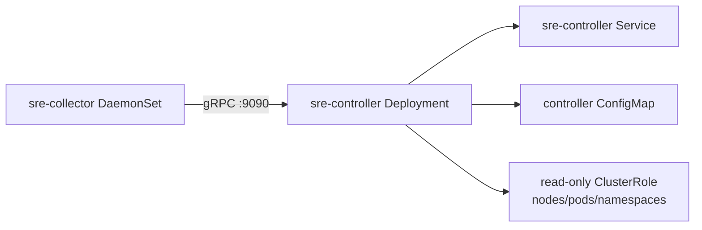
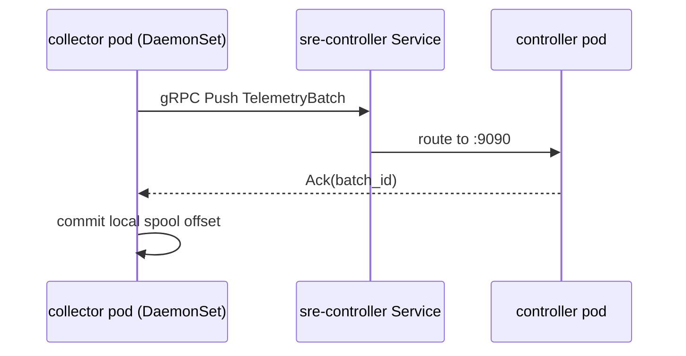

# Push-First Kubernetes Deployment (v0.5)

## Manifest Set
- `namespace.yaml`
- `rbac-readonly.yaml`
- `controller.yaml`
- `collector-daemonset.yaml`
- `kustomization.yaml`

## Deployed Topology


## Runtime Data Path in Cluster


## What These Manifests Configure
- Controller:
  - single replica deployment
  - HTTP `:8080`, gRPC ingest `:9090`
  - config mounted from `ConfigMap`
  - writable `data` volume (`emptyDir`)
- Collector DaemonSet:
  - one collector pod per schedulable node
  - host `/sys` and `/var/log` mounted read-only
  - local spool in pod `emptyDir`
  - endpoint `sre-controller.sre-agent.svc.cluster.local:9090`
- RBAC:
  - controller service account with read-only cluster access to `nodes`, `pods`, `namespaces`

## Build and Publish Images
```bash
# from repo root
make build

# build images (example tag)
docker build -t sre-agent/sre-controller:latest -f deploy/docker/Dockerfile --target controller .
docker build -t sre-agent/sre-collector:latest -f deploy/docker/Dockerfile --target collector .
```

## Apply Manifests
```bash
kubectl apply -f deploy/k8s/push-first/namespace.yaml
kubectl apply -f deploy/k8s/push-first/rbac-readonly.yaml
kubectl apply -f deploy/k8s/push-first/controller.yaml
kubectl apply -f deploy/k8s/push-first/collector-daemonset.yaml
```

or:

```bash
kubectl apply -k deploy/k8s/push-first
```

## Verify
```bash
kubectl -n sre-agent get pods
kubectl -n sre-agent get svc sre-controller
kubectl -n sre-agent logs deploy/sre-controller --tail=100
kubectl -n sre-agent logs ds/sre-collector --tail=100
```

## Runtime Notes
- Collector supports `SIGHUP` config reload for mutable settings.
- TLS settings under `collector.transport.tls.*` can be rotated via config update + reload.
- GPU collection requires NVIDIA runtime and `nvidia-smi` availability inside collector pods.

## Upgrade and Rollback
```bash
# update image
kubectl -n sre-agent set image deploy/sre-controller controller=sre-agent/sre-controller:<tag>
kubectl -n sre-agent set image ds/sre-collector collector=sre-agent/sre-collector:<tag>

# rollback
kubectl -n sre-agent rollout undo deploy/sre-controller
kubectl -n sre-agent rollout undo ds/sre-collector
```
