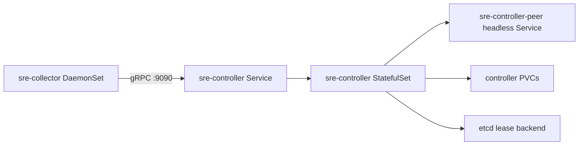
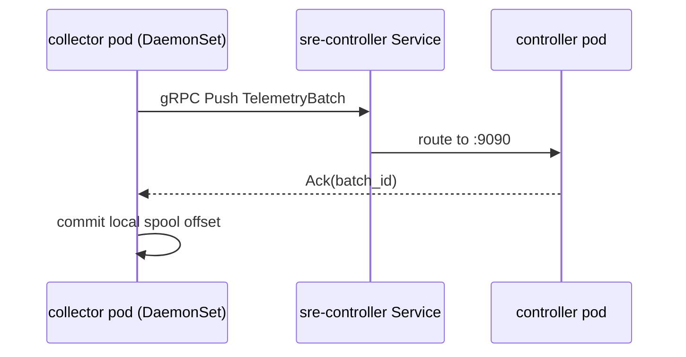

# Push-First Kubernetes Deployment (v0.6)

## What is supported here

This directory deploys the maintained split runtime model:

- `sre-controller` StatefulSet + Service + peer Service
- `sre-collector` DaemonSet
- read-only controller RBAC

The manifests assume the published controller and collector images already contain their own runtime defaults under `/etc/ai-sre-agent/*.yaml`. Kubernetes overrides behavior through environment variables and writable volumes instead of rebuilding those defaults in ConfigMaps.

## Manifest Set

- `namespace.yaml`
- `rbac-readonly.yaml`
- `controller.yaml`
- `collector-daemonset.yaml`
- `kustomization.yaml`

## Deployed Topology



## Runtime Data Path in Cluster



## What These Manifests Configure

- Controller:
  - StatefulSet example with peer identity and persistent controller data
  - HTTP `:8080`, gRPC ingest `:9090`
  - writable data volume mounted at `/var/lib/ai-sre-agent/controller/data`
  - optional etcd-backed leader election through `SRE_CONTROLLER_HA_*`
  - non-root runtime with read-only root filesystem
- Collector DaemonSet:
  - one collector pod per schedulable node
  - host `/sys`, `/sys/kernel/debug`, `/sys/fs/bpf`, `/lib/modules`, and `/var/log` mounted for host-observer collection
  - local spool in pod `emptyDir`
  - endpoint `sre-controller.sre-agent.svc.cluster.local:9090`
  - root runtime plus explicit `BPF`, `PERFMON`, `NET_ADMIN`, `SYS_RESOURCE` capabilities only on the collector side
- RBAC:
  - controller service account with read-only cluster access to discovery resources

## Build and publish images

```bash
# from repo root
make container-build
```

Example custom tags:

```bash
docker build -t ai-sre-agent/controller:v0.6 -f deploy/docker/Dockerfile.controller .
docker build -t ai-sre-agent/collector:v0.6 -f deploy/docker/Dockerfile.collector .
```

## Apply manifests

```bash
kubectl apply -f deploy/k8s/push-first/namespace.yaml
kubectl apply -f deploy/k8s/push-first/rbac-readonly.yaml
kubectl apply -f deploy/k8s/push-first/controller.yaml
kubectl apply -f deploy/k8s/push-first/collector-daemonset.yaml
```

or:

```bash
kubectl apply -k deploy/k8s/push-first
```

## Verify

```bash
kubectl -n sre-agent get pods
kubectl -n sre-agent get svc sre-controller
kubectl -n sre-agent get svc sre-controller-peer
kubectl -n sre-agent logs statefulset/sre-controller --tail=100
kubectl -n sre-agent logs ds/sre-collector --tail=100
```

## Runtime notes

- Collector supports `SIGHUP` config reload for mutable settings.
- Controller supports `SIGHUP` plus watched config-file reload for hot-reloadable settings (`inventory.*`, ingest retention, agent playbook path).
- TLS settings under `collector.transport.tls.*` can be rotated via env/config update + restart.
- GPU collection requires NVIDIA runtime and `nvidia-smi` availability inside collector pods.
- If your cluster policy forbids `BPF`/`PERFMON` capability or host mounts, collector can still run in a degraded `/proc`-oriented mode, but signal fidelity and RCA quality will drop.
- HA settings, listen addresses, TSDB endpoints, and storage paths remain restart-required.

## Upgrade and rollback

```bash
kubectl -n sre-agent set image statefulset/sre-controller controller=ai-sre-agent/controller:<tag>
kubectl -n sre-agent set image ds/sre-collector collector=ai-sre-agent/collector:<tag>

kubectl -n sre-agent rollout undo statefulset/sre-controller
kubectl -n sre-agent rollout undo ds/sre-collector
```
