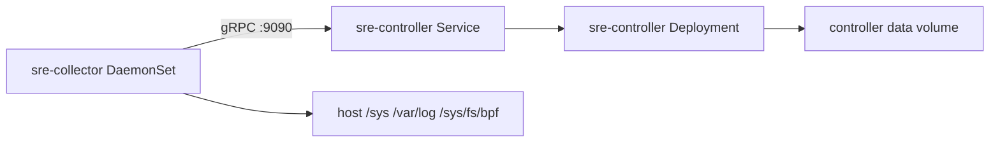

# Push-First Kubernetes Deployment

This directory is now the raw `cluster-lite` Kubernetes path for `v0.7`.

## What It Deploys

- one central `sre-controller` `Deployment`
- one `sre-collector` `DaemonSet`
- controller and collector ConfigMaps
- optional controller static-targets ConfigMap
- read-only controller RBAC

This is the quickest maintained cluster path in the repo. It is intentionally simpler than the HA Helm path.

## Why This Changed

The raw manifests no longer depend only on image-baked config.

They now mount:

- [`controller-configmap.yaml`](controller-configmap.yaml)
- [`controller-targets-configmap.yaml`](controller-targets-configmap.yaml)
- [`collector-configmap.yaml`](collector-configmap.yaml)

That makes cluster rollout easier to reason about and reduces one-machine assumptions.

## Files

- [`namespace.yaml`](namespace.yaml)
- [`rbac-readonly.yaml`](rbac-readonly.yaml)
- [`controller-configmap.yaml`](controller-configmap.yaml)
- [`controller-targets-configmap.yaml`](controller-targets-configmap.yaml)
- [`controller.yaml`](controller.yaml)
- [`collector-configmap.yaml`](collector-configmap.yaml)
- [`collector-daemonset.yaml`](collector-daemonset.yaml)
- [`kustomization.yaml`](kustomization.yaml)

## Topology



## Apply

```bash
kubectl apply -k deploy/k8s/push-first
```

## What To Edit First

Before applying to a real cluster, review:

- [`controller-configmap.yaml`](controller-configmap.yaml)
  - `deployment.cluster_name`
  - `agent.rag_vector_backend`
  - `agent.rag_dataset_path`
- [`controller-rag-secret.example.yaml`](controller-rag-secret.example.yaml)
  - only needed when the raw `cluster-lite` path is pointed at an external vector backend
- [`collector-configmap.yaml`](collector-configmap.yaml)
  - `deployment.cluster_name`
  - `deployment.data_root`
- [`collector-daemonset.yaml`](collector-daemonset.yaml)
  - host mounts
  - collector capabilities
  - controller endpoint env
  - `SRE_COLLECTOR_ID` / `SRE_COLLECTOR_HOSTNAME` sourced from `spec.nodeName`

## Validation

```bash
kubectl -n sre-agent get pods
kubectl -n sre-agent get svc sre-controller
kubectl -n sre-agent logs deploy/sre-controller --tail=100
kubectl -n sre-agent logs ds/sre-collector --tail=100
kubectl -n sre-agent port-forward deploy/sre-controller 8080:8080
curl -fsS http://127.0.0.1:8080/healthz
curl -fsS http://127.0.0.1:8080/readyz
curl -fsS http://127.0.0.1:8080/api/v1/status | jq '.deployment'
```

## Readiness And Liveness

- controller liveness: `/healthz`
- controller readiness: `/readyz`
- collector liveness: `/healthz`
- collector readiness: `/readyz`

## Degraded Mode Notes

- collector still expects host-observer privileges for best fidelity
- if eBPF or probe-core is constrained, collector can degrade rather than crash
- controller can still serve deterministic RCA paths when RAG or LLM is unavailable

## When To Use Helm Instead

Use [`../../charts/sre-agent/`](../../charts/sre-agent/) when you need:

- replicated controller instances
- HA settings
- ingress
- HPA
- external vector backend config
- secret-driven vector token injection without editing the pod spec
- more parameterized rollout without editing raw manifests
