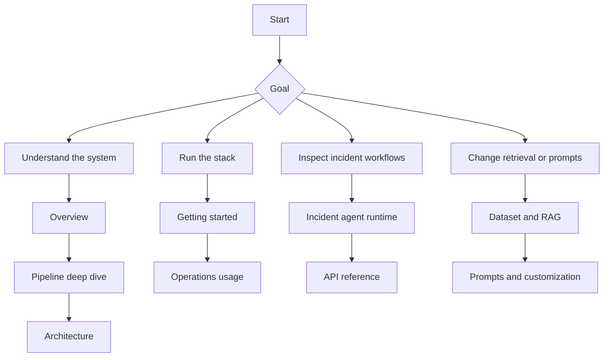

# Documentation Index

This is the release-quality documentation set for `v0.8`.

The layout is intentionally simple:

- English content lives under [`en/`](en/)
- Chinese content lives under [`zh/`](zh/)
- shared images stay under [`images/`](images/)

The numbering is the reading order:

- `01` to `19` are the main guide path
- `20+` are supplemental runbooks, references, and design notes

The diagrams in this documentation use plain fenced `mermaid` blocks and GitHub-supported flowchart syntax so they stay readable in GitHub-rendered Markdown.

## Reading Map

Use the map first, then jump into the tables below for the exact file paths.

## Read By Audience

| Audience | Start here | Then read |
| --- | --- | --- |
| engineers and SREs | [en/02-pipeline-deep-dive.md](en/02-pipeline-deep-dive.md) / [zh/02-pipeline-deep-dive.md](zh/02-pipeline-deep-dive.md) | [en/04-architecture.md](en/04-architecture.md) / [zh/04-architecture.md](zh/04-architecture.md), [en/24-api-reference.md](en/24-api-reference.md) |
| operators and incident responders | [en/03-getting-started.md](en/03-getting-started.md) / [zh/03-getting-started.md](zh/03-getting-started.md) | [en/08-ui-guide.md](en/08-ui-guide.md) / [zh/08-ui-guide.md](zh/08-ui-guide.md), [en/17-incident-agent-runtime.md](en/17-incident-agent-runtime.md) / [zh/17-incident-agent-runtime.md](zh/17-incident-agent-runtime.md) |
| researchers | [en/01-overview.md](en/01-overview.md) / [zh/01-overview.md](zh/01-overview.md) | [en/07-control-plane-analysis.md](en/07-control-plane-analysis.md) / [zh/07-control-plane-analysis.md](zh/07-control-plane-analysis.md), [en/19-testing-and-evaluation.md](en/19-testing-and-evaluation.md) / [zh/19-testing-and-evaluation.md](zh/19-testing-and-evaluation.md) |
| product and technical reviewers | [en/01-overview.md](en/01-overview.md), [en/35-business-use-cases.md](en/35-business-use-cases.md) | [en/36-architecture-notes.md](en/36-architecture-notes.md), [en/24-api-reference.md](en/24-api-reference.md) |

## Read By Goal

| Goal | Read this first | Then read |
| --- | --- | --- |
| understand the whole system quickly | [en/01-overview.md](en/01-overview.md) / [zh/01-overview.md](zh/01-overview.md) | [en/02-pipeline-deep-dive.md](en/02-pipeline-deep-dive.md) / [zh/02-pipeline-deep-dive.md](zh/02-pipeline-deep-dive.md) |
| bring up a local stack | [en/03-getting-started.md](en/03-getting-started.md) / [zh/03-getting-started.md](zh/03-getting-started.md) | [en/21-usage.md](en/21-usage.md), [en/15-deployment.md](en/15-deployment.md) / [zh/15-deployment.md](zh/15-deployment.md) |
| inspect the collector/controller boundary | [en/04-architecture.md](en/04-architecture.md) / [zh/04-architecture.md](zh/04-architecture.md) | [en/05-data-flow.md](en/05-data-flow.md) / [zh/05-data-flow.md](zh/05-data-flow.md), [en/18-architecture-decisions.md](en/18-architecture-decisions.md) |
| understand the incident-agent runtime | [en/17-incident-agent-runtime.md](en/17-incident-agent-runtime.md) / [zh/17-incident-agent-runtime.md](zh/17-incident-agent-runtime.md) | [en/07-control-plane-analysis.md](en/07-control-plane-analysis.md) / [zh/07-control-plane-analysis.md](zh/07-control-plane-analysis.md), [en/24-api-reference.md](en/24-api-reference.md) |
| understand expected-burst suppression and workload memory | [en/37-behavioral-baseline-design.md](en/37-behavioral-baseline-design.md) / [zh/21-behavioral-baseline-design.md](zh/21-behavioral-baseline-design.md) | [en/04-architecture.md](en/04-architecture.md) / [zh/04-architecture.md](zh/04-architecture.md), [en/17-incident-agent-runtime.md](en/17-incident-agent-runtime.md) / [zh/17-incident-agent-runtime.md](zh/17-incident-agent-runtime.md), [en/22-configuration.md](en/22-configuration.md) |
| inspect evaluation and replay | [en/19-testing-and-evaluation.md](en/19-testing-and-evaluation.md) / [zh/19-testing-and-evaluation.md](zh/19-testing-and-evaluation.md) | [en/23-testing.md](en/23-testing.md) |
| modify retrieval, prompts, or datasets | [en/11-dataset-and-rag.md](en/11-dataset-and-rag.md) / [zh/11-dataset-and-rag.md](zh/11-dataset-and-rag.md) | [en/12-prompts-and-customization.md](en/12-prompts-and-customization.md) / [zh/12-prompts-and-customization.md](zh/12-prompts-and-customization.md), [en/10-core-files.md](en/10-core-files.md) / [zh/10-core-files.md](zh/10-core-files.md) |

## Ordered Files

### English

| Range | Files |
| --- | --- |
| `01`-`09` | overview, pipeline, getting started, architecture, data flow, collector queue, control-plane analysis, UI guide, codebase map |
| `10`-`19` | core files, dataset and RAG, prompts, metrics and signals, hardware, deployment, FAQ, incident runtime, architecture decisions, testing and evaluation |
| `20`-`29` | quickstart, usage, configuration, testing, API reference, metrics reference, LLM schema, RAG knowledge engine, Python runtime, predictive signals |
| `30`-`40` | predictive runbook, RCA playbook, code review guidelines, publishing, benchmarks, business use cases, architecture notes, behavioral baseline design, collector overhead audit, RDMA storage playbook, threat model |

### Chinese

| Range | Files |
| --- | --- |
| `01`-`09` | overview, pipeline, getting started, architecture, data flow, collector queue, control-plane analysis, UI guide, codebase map |
| `10`-`19` | core files, dataset and RAG, prompts, metrics and signals, hardware, deployment, FAQ, incident runtime, architecture decisions, testing and evaluation |
| `20`-`21` | RAG knowledge engine, behavioral baseline design |

### Full File List

| Topic | English | 中文 |
| --- | --- | --- |
| Overview | [en/01-overview.md](en/01-overview.md) | [zh/01-overview.md](zh/01-overview.md) |
| Pipeline deep dive | [en/02-pipeline-deep-dive.md](en/02-pipeline-deep-dive.md) | [zh/02-pipeline-deep-dive.md](zh/02-pipeline-deep-dive.md) |
| Getting started | [en/03-getting-started.md](en/03-getting-started.md) | [zh/03-getting-started.md](zh/03-getting-started.md) |
| Architecture | [en/04-architecture.md](en/04-architecture.md) | [zh/04-architecture.md](zh/04-architecture.md) |
| Data flow | [en/05-data-flow.md](en/05-data-flow.md) | [zh/05-data-flow.md](zh/05-data-flow.md) |
| Collector queue and compaction | [en/06-collector-queue-and-compaction.md](en/06-collector-queue-and-compaction.md) | [zh/06-collector-queue-and-compaction.md](zh/06-collector-queue-and-compaction.md) |
| Control-plane analysis | [en/07-control-plane-analysis.md](en/07-control-plane-analysis.md) | [zh/07-control-plane-analysis.md](zh/07-control-plane-analysis.md) |
| UI guide | [en/08-ui-guide.md](en/08-ui-guide.md) | [zh/08-ui-guide.md](zh/08-ui-guide.md) |
| Codebase map | [en/09-codebase-map.md](en/09-codebase-map.md) | [zh/09-codebase-map.md](zh/09-codebase-map.md) |
| Core files | [en/10-core-files.md](en/10-core-files.md) | [zh/10-core-files.md](zh/10-core-files.md) |
| Dataset and RAG | [en/11-dataset-and-rag.md](en/11-dataset-and-rag.md) | [zh/11-dataset-and-rag.md](zh/11-dataset-and-rag.md) |
| Prompts and customization | [en/12-prompts-and-customization.md](en/12-prompts-and-customization.md) | [zh/12-prompts-and-customization.md](zh/12-prompts-and-customization.md) |
| Metrics and signals | [en/13-metrics-and-signals.md](en/13-metrics-and-signals.md) | [zh/13-metrics-and-signals.md](zh/13-metrics-and-signals.md) |
| Hardware considerations | [en/14-hardware-considerations.md](en/14-hardware-considerations.md) | [zh/14-hardware-considerations.md](zh/14-hardware-considerations.md) |
| Deployment | [en/15-deployment.md](en/15-deployment.md) | [zh/15-deployment.md](zh/15-deployment.md) |
| FAQ | [en/16-faq.md](en/16-faq.md) | [zh/16-faq.md](zh/16-faq.md) |
| Incident agent runtime | [en/17-incident-agent-runtime.md](en/17-incident-agent-runtime.md) | [zh/17-incident-agent-runtime.md](zh/17-incident-agent-runtime.md) |
| Architecture decisions | [en/18-architecture-decisions.md](en/18-architecture-decisions.md) | [zh/18-architecture-decisions.md](zh/18-architecture-decisions.md) |
| Testing and evaluation | [en/19-testing-and-evaluation.md](en/19-testing-and-evaluation.md) | [zh/19-testing-and-evaluation.md](zh/19-testing-and-evaluation.md) |
| Quickstart | [en/20-quickstart.md](en/20-quickstart.md) | - |
| Usage | [en/21-usage.md](en/21-usage.md) | - |
| Configuration | [en/22-configuration.md](en/22-configuration.md) | - |
| Testing | [en/23-testing.md](en/23-testing.md) | - |
| API reference | [en/24-api-reference.md](en/24-api-reference.md) | [en/24-api-reference.md](en/24-api-reference.md) |
| Metrics reference | [en/25-metrics-reference.md](en/25-metrics-reference.md) | - |
| LLM schema | [en/26-llm-schema.md](en/26-llm-schema.md) | - |
| RAG knowledge engine | [en/27-rag-knowledge-engine.md](en/27-rag-knowledge-engine.md) | [zh/20-rag-knowledge-engine.md](zh/20-rag-knowledge-engine.md) |
| Python runtime | [en/28-python-runtime.md](en/28-python-runtime.md) | - |
| Predictive signals | [en/29-predictive-signals.md](en/29-predictive-signals.md) | - |
| Predictive runbook | [en/30-predictive-runbook.md](en/30-predictive-runbook.md) | - |
| RCA playbook | [en/31-rca-playbook.md](en/31-rca-playbook.md) | - |
| Code review guidelines | [en/32-code-review-guidelines.md](en/32-code-review-guidelines.md) | - |
| Publishing | [en/33-publishing.md](en/33-publishing.md) | - |
| Benchmarks | [en/34-benchmarks.md](en/34-benchmarks.md) | - |
| Business use cases | [en/35-business-use-cases.md](en/35-business-use-cases.md) | - |
| Architecture notes | [en/36-architecture-notes.md](en/36-architecture-notes.md) | - |
| Behavioral baseline design | [en/37-behavioral-baseline-design.md](en/37-behavioral-baseline-design.md) | [zh/21-behavioral-baseline-design.md](zh/21-behavioral-baseline-design.md) |
| Collector overhead audit | [en/38-collector-overhead-audit.md](en/38-collector-overhead-audit.md) | - |
| RDMA storage playbook | [en/39-rdma-storage-playbook.md](en/39-rdma-storage-playbook.md) | - |
| Threat model | [en/40-threat-model.md](en/40-threat-model.md) | - |

## What Changed In The v0.8 Documentation Pass

- The documentation now describes the durable workflow runtime that actually exists in code.
- Change intelligence, causal graph reasoning, incident memory, verification, and replay evaluation are now explained as first-class controller subsystems.
- Workload-specific behavioral memory and expected-burst suppression are now documented as first-class control-plane decisions instead of implicit scoring behavior.
- The main architecture decisions are now recorded in ADR-style form under [en/18-architecture-decisions.md](en/18-architecture-decisions.md) and [zh/18-architecture-decisions.md](zh/18-architecture-decisions.md).
- Reading paths are now organized for engineers, researchers, operators, and reviewers instead of assuming one audience.
- Cross-links now point more directly to the code paths that implement the described behavior.
