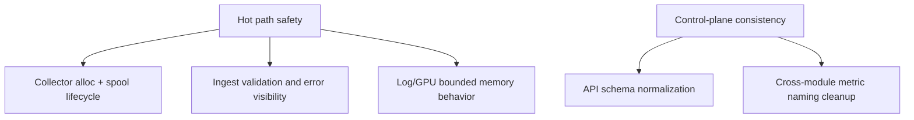

# Refactoring Backlog (v0.4 Runtime)

Implementation-driven refactoring targets derived from current runtime code paths.

## Current Baseline
- Collector: bounded batch marshal buffers, adaptive polling, spool-backed delivery.
- Controller ingest: strict validation + in-memory fleet state.
- Logs: native segmented index with bounded retention/query windows.
- GPU: bounded timeline/event/process buffers with periodic persistence.

## Refactoring Focus Areas

## Priority 1: Reliability Under Pressure
- spool lifecycle observability (enqueue/commit drift diagnostics).
- explicit backpressure visibility in ingest and collector intervals.
- restart behavior documentation for memory-first stores.

## Priority 2: Data Model Consistency
- unify field naming across diagnostics, fleet, and GPU responses.
- reduce duplicate representations of process-level signals.

## Priority 3: Operational Clarity
- consolidate health/status semantics across optional modules.
- standardize error payload shapes for API clients.

## Priority 4: Test Surface Hardening
- broaden failure-mode tests for transport failover and mirror paths.
- increase regression coverage for log query limits and offset handling.
