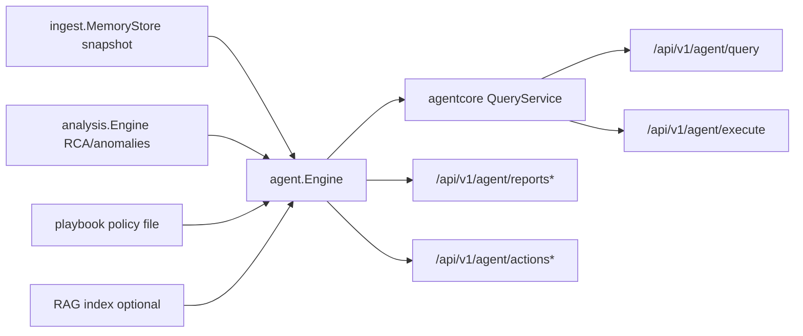
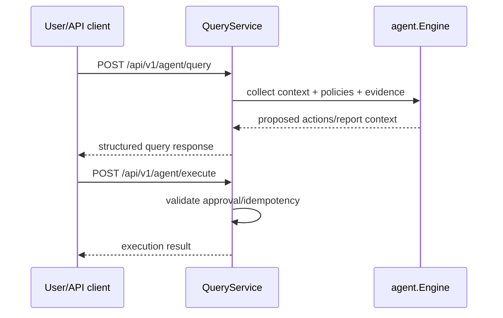

# Agent Runtime Design (v0.4)

## Architecture

## Runtime Responsibilities
- `agent.Engine`
  - periodic report generation (`cfg.Interval`)
  - action generation and bounded action/report retention
  - optional persistence under `agent.persist_dir`
- `agentcore.QueryService`
  - query and execute API payload handling
  - rate/circuit/timeout behavior for LLM calls
  - execution guardrails (approval token, dry-run semantics)

## API Interaction

## Data Inputs
- latest ingest node snapshots and process/log summaries
- analysis alerts/anomalies/RCA outputs when analysis module is enabled
- optional RAG snippets from configured local paths

## Runtime Limits
- report retention (`max_reports`) and action retention (`max_actions`) are bounded.
- LLM usage is optional and disabled by default.
