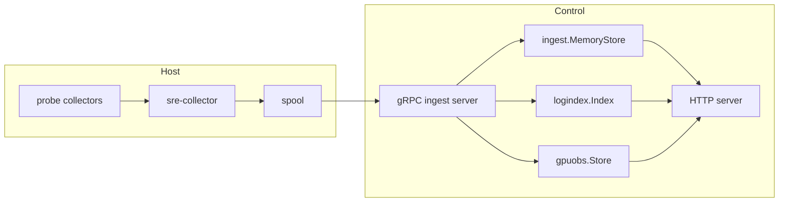
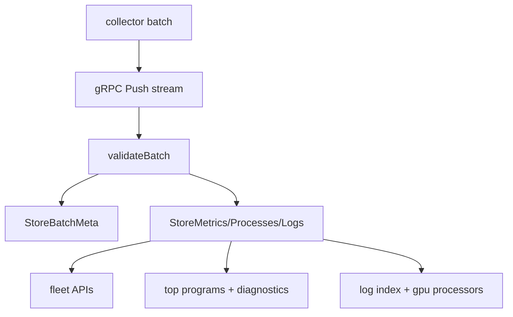

# Architecture Specification (v0.4)

## Runtime Components

## Probe-Controller Separation
- Collector owns data capture and reliability of delivery (`spool` + ACK commit).
- Controller owns validation, aggregation, diagnostics, and API exposure.
- Optional modules (`analysis`, `agent`, `orchestration`, `inventory`, `k8s`, `checks`) are mounted on top of ingest state.

## Data Path

## API Exposure Model
- Core endpoints are always registered in `registerHandlers`.
- Optional endpoints are registered only when module manager/engine is initialized.
- Auth middleware wraps the mux when API key is configured.

## Storage Model
- Fleet state: in-memory snapshots keyed by `collector_id`.
- Fleet trends: bounded metric history rings per collector.
- Logs: segmented in-memory index with retention eviction.
- GPU: in-memory aggregate + timeline rings + persisted snapshots/history/events.

## Design Constraints in v0.4
- Memory-first state yields low-latency reads but short retention by default.
- Pull-scrape and push-ingest states coexist; push-ingest is primary for fleet and diagnostics.
