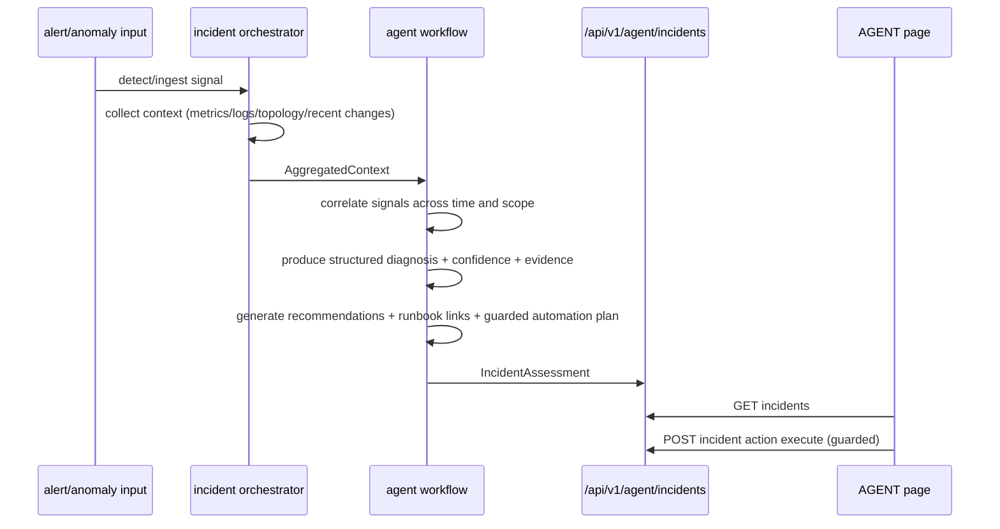
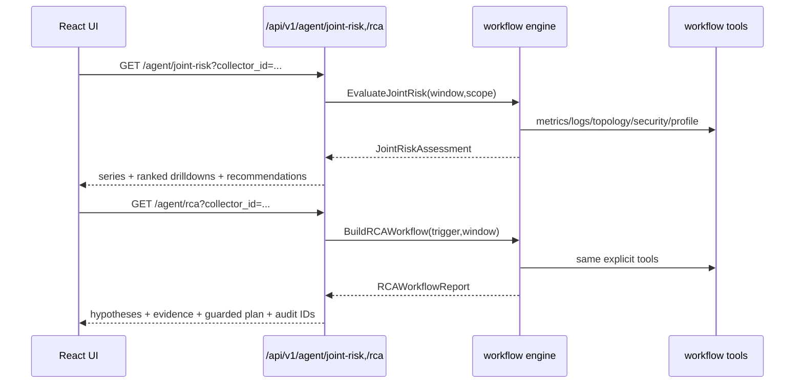

# Architecture (v0.5)

## Runtime topology (agent-first)

```mermaid
flowchart LR
    subgraph Host[Monitored host]
      K[probe-core C++ kernel collectors]
      P[/proc fallback collectors]
      C[sre-collector]
      S[local spool]
      K --> C
      P --> C
      C --> S
    end

    subgraph Controller[Controller node]
      G[gRPC ingest]
      M[MemoryStore]
      L[logindex]
      U[gpuobs]
      A[analysis engine]
      O[incident orchestrator]
      W[agent workflow engine]
      API[HTTP API]
      UI[Web UI]

      G --> M
      G --> L
      G --> U
      M --> A
      L --> A
      U --> A
      A --> O
      O --> W
      M --> W
      L --> W
      U --> W
      W --> API
      API --> UI
    end

    S --> G
```

## Dependency direction

- `probe/collector` only depends on host collectors, spool, and transport.
- `controller/ingestion` owns validation + indexing and is independent from reasoning.
- `analysis engine` consumes normalized telemetry and emits alerts/anomalies/correlations.
- `agent workflow` consumes incident contexts + analysis signals and emits diagnosis/recommendations/guarded actions.
- `agent workflow engine` is deterministic pipeline-based and tool-driven (`metrics_query`, `log_query`, `topology_query`, `security_check`, `profiling_trigger`).
- UI consumes HTTP APIs only (no direct store access).

## Agent workflow engine (deterministic pipelines)

Two first-class pipelines run on the same tool layer:

1. `joint_risk`
   - `collect_signals`
   - `score_signals`
   - `correlate_signals`
   - `recommendation_generation`
   - `finalize`
2. `rca`
   - `anomaly_detection`
   - `context_gathering`
   - `hypothesis_generation`
   - `evidence_collection`
   - `recommendation_generation`
   - `guarded_execution_plan`
   - `finalize`

Each tool invocation and generated action/recommendation is appended to workflow audit records (`/api/v1/agent/workflow/audit`).

## Agent incident workflow



## Joint risk + RCA UI flow



## Internal logging/indexing (ELK-like)

- Log ingestion is local (`/api/v1/logs/ingest`) and indexed by `logindex`.
- Search (`/api/v1/logs/search`) supports text + field filters + timeline aggregation.
- No external Elasticsearch dependency is required for base operation.

## Guarded automation model

- Automation actions are attached to each incident assessment.
- Safe read-only checks execute directly.
- Non-safe actions are `dry-run` by default and require approval token when forced.
- Execution results are written back into the incident assessment (`last_status`, `last_message`, `last_executed_at`).

## Trade-offs and limitations

- Root-cause scoring is deterministic and heuristic-driven; it improves explainability but does not replace expert judgement.
- Non-safe remediations are intentionally conservative (blocked/manual-by-default) to avoid unsafe autonomous changes.
- Hot-path reads are in-memory for latency; optional embedded persistence extends retention on a single node but is not a distributed multi-writer store.
