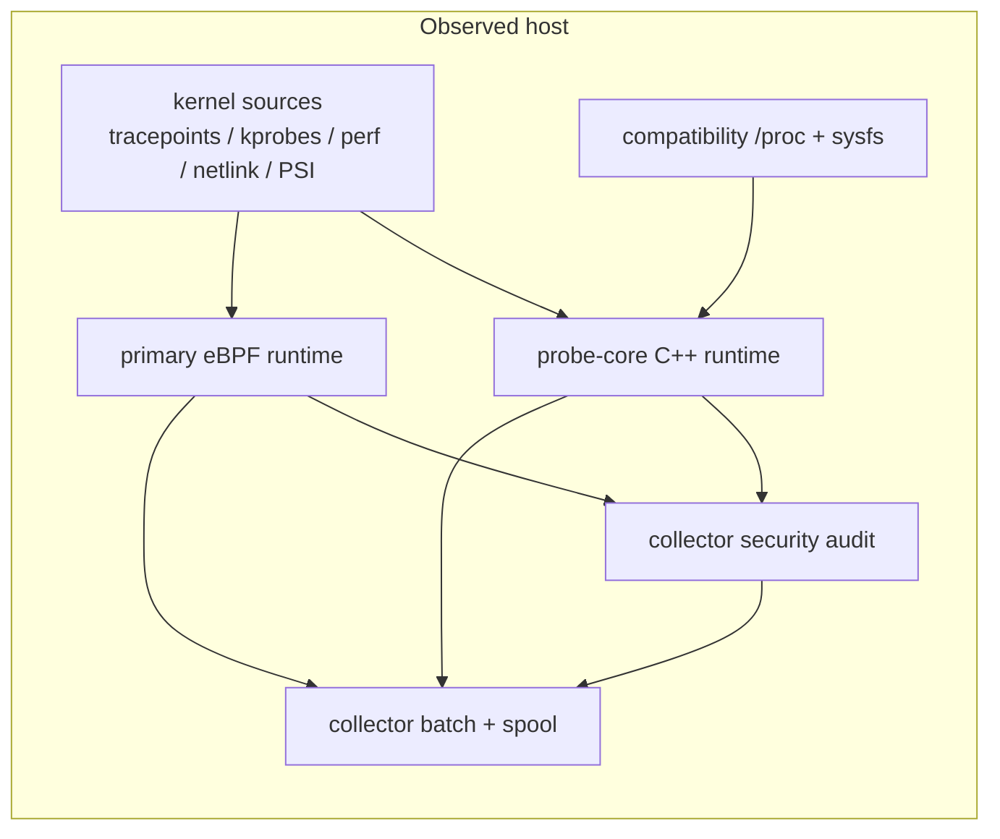
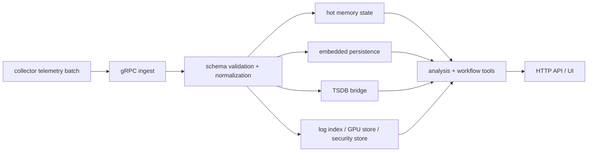
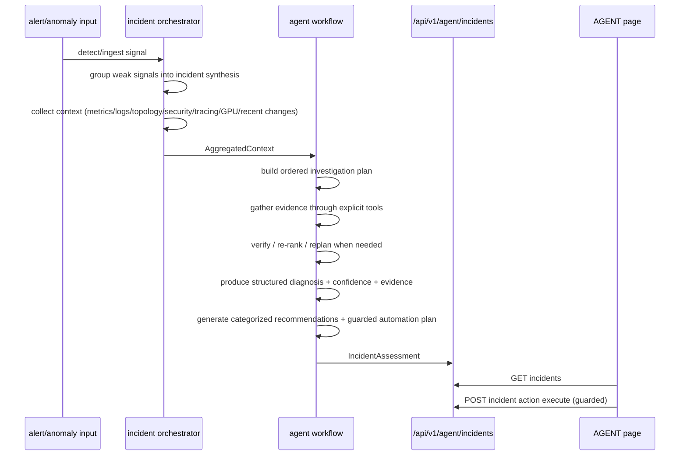
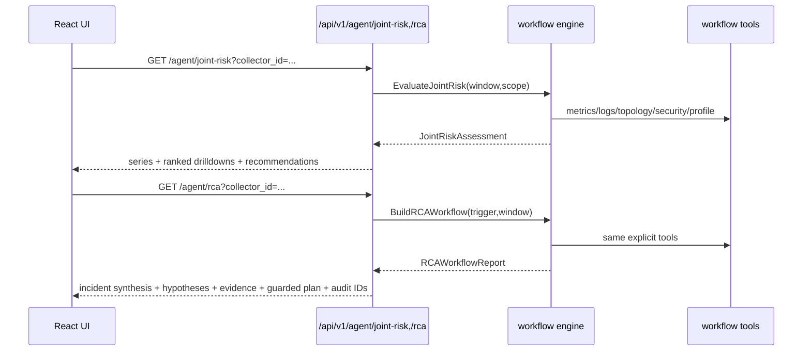

# Architecture (v0.6)

## Runtime topology (agent-first)

```mermaid
flowchart LR
    subgraph Host[Monitored host]
      K[probe-core C++ kernel collectors]
      P[/proc fallback collectors]
      C[sre-collector]
      S[local spool]
      K --> C
      P --> C
      C --> S
    end

    subgraph Controller[Controller node]
      G[gRPC ingest]
      M[MemoryStore]
      T[TSDB bridge<br/>InfluxDB durable history]
      L[logindex]
      U[gpuobs]
      A[analysis engine]
      O[incident orchestrator]
      W[agent workflow engine]
      API[HTTP API]
      UI[Web UI]

      G --> M
      G --> T
      G --> L
      G --> U
      M --> A
      T --> A
      L --> A
      U --> A
      A --> O
      O --> W
      M --> W
      T --> W
      L --> W
      U --> W
      W --> API
      API --> UI
    end

    S --> G
```

## Collector low-level pipeline



| Path | Primary source | Compatibility source | Why it is split this way |
|---|---|---|---|
| Host/process/resource telemetry | probe-core | `/proc` + sysfs via compatibility host collector | resource snapshots are not the same thing as kernel event streams |
| Runtime/kernel behavior telemetry | eBPF runtime | bounded synthetic `/proc/net/tcp` assists only | short-lived exec/connect/bind/open behavior should be event-driven |
| GPU telemetry | probe-core dynamic NVML | bounded `nvidia-smi` fallback inside probe-core | NVML exposes richer device/process state than shelling out alone |
| Security findings | collector security audit over eBPF + probe-core context | posture scans for gaps | behavior evidence and posture evidence need different collection mechanics |

## Telemetry ingestion pipeline



## Dependency direction

- `probe/collector` only depends on host collectors, spool, and transport.
- `controller/ingestion` owns validation + hot-cache state and is independent from reasoning.
- `controller/timeseries` owns durable trend history and can fall back to memory when InfluxDB is absent.
- `analysis engine` consumes normalized telemetry and emits alerts/anomalies/correlations.
- `agent workflow` consumes incident contexts + analysis signals and emits diagnosis/recommendations/guarded actions.
- `agent workflow engine` is deterministic pipeline-based and tool-driven (`metrics_query`, `logs_query`, `topology_query`, `security_check`, `knowledge_retrieval`, `trace_query`, `gpu_query`, `process_lineage`, `security_graph`, `profiling_trigger`, `remediation_action`).
- UI consumes HTTP APIs only (no direct store access).

## Agent workflow engine (deterministic pipelines)

Two first-class pipelines run on the same tool layer:

1. `joint_risk`
   - `collect_signals`
   - `score_signals`
   - `correlate_signals`
   - `recommendation_generation`
   - `finalize`
2. `rca`
   - `anomaly_detection`
   - `incident_synthesis`
   - `context_gathering`
   - `plan_act_verify_loop`
   - `hypothesis_generation`
   - `evidence_collection`
   - `recommendation_generation`
   - `guarded_execution_plan`
   - `finalize`

Each tool invocation and generated action/recommendation is appended to workflow audit records (`/api/v1/agent/workflow/audit`).

The RCA path is incident-oriented, not anomaly-oriented:

- weak signals are grouped before RCA starts
- grouped scope, time overlap, topology proximity, and co-occurrence feed incident synthesis
- hypotheses are updated after each tool result
- the loop can replan when evidence contradicts the current plan
- completion means required evidence verified, not merely "some tools ran"

### Decision-support outputs

| Output | Purpose | Backing fields |
|---|---|---|
| Synthesized incident | Collapse weak signals into one investigation object | `incident_id`, `grouped_signals`, `impacted_scope`, `time_window`, `severity`, `confidence`, `candidate_root_cause_cluster` |
| Structured RCA | Explain what happened and why | `incident_summary`, `symptoms`, `timeline`, `ranked_hypotheses`, `supporting_evidence`, `contradicting_evidence`, `confidence_score`, `unresolved_gaps` |
| Recommendations | Tell the operator what to do next | category, rationale, expected impact, risk level, confidence, evidence IDs, rollback consideration |
| Proposed actions | Turn recommendations into guarded execution candidates | policy verdict, approval requirement, dry-run plan, rollback plan, audit intent |

## Agent incident workflow



## Joint risk + RCA UI flow



## Internal logging/indexing (ELK-like)

- Log ingestion is local (`/api/v1/logs/ingest`) and indexed by `logindex`.
- Search (`/api/v1/logs/search`) supports text + field filters + timeline aggregation.
- No external Elasticsearch dependency is required for base operation.

## Guarded automation model

- Automation actions are attached to each incident assessment.
- Safe read-only checks execute directly.
- Non-safe actions are `dry-run` by default and require approval token when forced.
- Execution results are written back into the incident assessment (`last_status`, `last_message`, `last_executed_at`).

Policy evaluation produces explicit verdicts:

- `allowed`
- `allowed_with_approval`
- `missing_rollback`
- `insufficient_confidence`

## Trade-offs and limitations

- Root-cause scoring is deterministic and heuristic-driven; it improves explainability but does not replace expert judgement.
- Non-safe remediations are intentionally conservative (blocked/manual-by-default) to avoid unsafe autonomous changes.
- Hot-path reads stay in-memory for latency; controller-side TSDB extends history windows without making the collector stateful.
- Durable TSDB writes currently cover trend-safe metrics, not every high-cardinality raw event stream.
