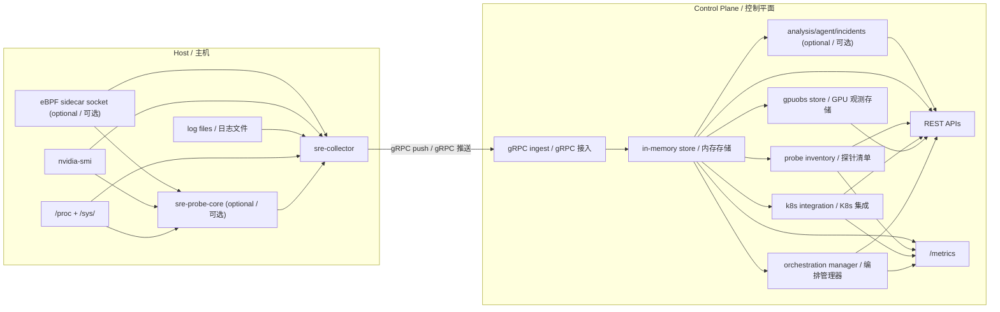
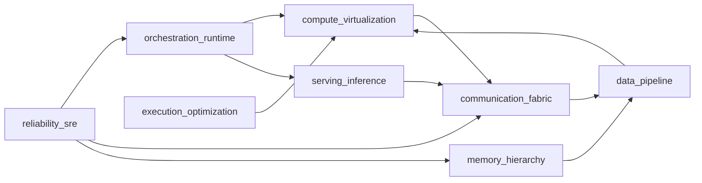
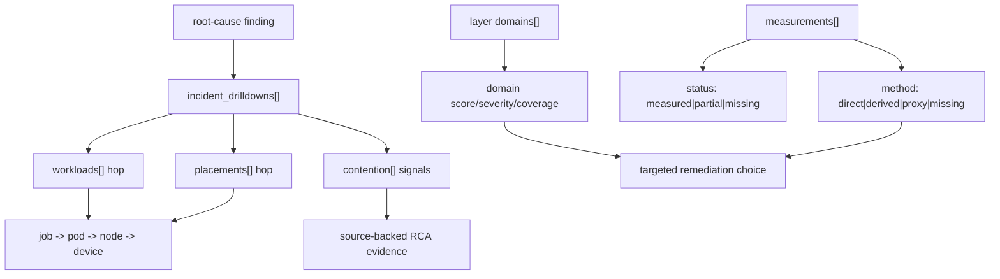

# Architecture (v0.2) / 系统架构

This document describes the implementation currently in this repository.

本文档描述当前仓库中的实际实现。

Use this file for system-level reasoning. Use [`docs/reference/api.md`](../reference/api.md) and [`docs/reference/metrics.md`](../reference/metrics.md) for field-level details.

用于系统级推理。字段级细节请参考 [`docs/reference/api.md`](../reference/api.md) 和 [`docs/reference/metrics.md`](../reference/metrics.md)。

## 1. System Model / 系统模型

The system is push-first.

系统采用 Push-first 模式。

- `sre-collector` runs on monitored nodes / `sre-collector` 运行在被监控节点上
- `sre-controller` ingests telemetry and serves APIs/UI/Prometheus metrics / `sre-controller` 接收遥测数据并提供 API/UI/Prometheus 指标

### Data flow diagram / 数据流向图

### Key design decisions / 关键设计决策

| Decision | Description / 说明 |
|---|---|
| **Push-first** | Collector actively pushes, Controller doesn't poll each host, reducing latency and network overhead / Collector 主动推送，Controller 不轮询，降低延迟和网络开销 |
| **Memory-first** | APIs read from memory for low-latency incident response / API 从内存读取，确保低延迟的故障响应 |
| **Module isolation** | Optional modules (analysis/agent/incidents) isolated from core ingest paths / 可选模块与核心采集路径隔离 |

### AI infra as a distributed operating system / AI Infra 作为分布式操作系统

The implemented troubleshooting model follows a layered control path instead of a single metric plane.

当前排障模型以分层控制路径组织，而不是单一指标平面。

| Layer | Practical abstraction | Implemented surfaces |
|---|---|---|
| Compute + device virtualization | Occupancy and contention across node/device/process/workload | `/api/v1/gpu/nodes`, `/api/v1/top/programs`, `/api/v1/diagnostics/ai-infra-stack` (`compute_virtualization`) |
| Orchestration runtime | `job -> pod -> node -> device` placement and queueing behavior | `/api/v1/orchestration/*`, `/api/v1/diagnostics/workload-path`, `/api/v1/diagnostics/ai-infra-stack` (`orchestration_runtime`) |
| Communication fabric | In-node + inter-node transport pressure and collective imbalance | `/api/v1/diagnostics/data-path`, `/api/v1/diagnostics/kernel-path`, `/api/v1/diagnostics/ai-infra-stack` (`communication_fabric`) |
| Memory + storage hierarchy | DRAM/page-cache/writeback/NVMe/object-tier pressure | `/api/v1/fleet/<collector>`, `/api/v1/diagnostics/kernel-path`, `/api/v1/diagnostics/ai-infra-stack` (`memory_hierarchy`, `data_pipeline`) |
| Reliability + RCA | SLI/SLO violations, error-budget/timeline proxies, ranked findings, and incident handoff packets | `/api/v1/orchestration/diagnostics`, `/api/v1/diagnostics/root-cause`, `/api/v1/diagnostics/rca-packet`, `/api/v1/diagnostics/ai-infra-stack` |

## 2. Component Boundaries / 组件边界

| Component | Responsibility | Primary code path |
|---|---|---|
| **Collector runtime** | Collect, batch, spool, and push telemetry / 采集、批处理、队列、推送遥测数据 | `backend/internal/collector` |
| **C++ probe-core** | Low-overhead kernel/device telemetry and framed protobuf IPC stream / 低开销内核与设备遥测 + protobuf 帧 IPC 流 | `cpp/probe_core`, `backend/internal/collector/probecore` |
| **Probe collectors** | Read `/proc`/kernel/GPU/eBPF sources / 读取 `/proc`/kernel/GPU/eBPF 数据源 | `backend/internal/probe` |
| **Ingest store** | Store latest snapshots and trend windows / 存储最新快照和趋势窗口 | `backend/internal/controller/ingest` |
| **Probe inventory** | Merge static config + telemetry + optional heartbeat registration / 合并静态配置 + 遥测 + 可选心跳注册 | `backend/internal/controller/inventory` |
| **Kubernetes integration** | Read-only multi-cluster discovery (clusters/nodes/workloads/GPU) linked with observed metrics/logs/processes / 只读多集群发现并关联观测指标/日志/进程 | `backend/internal/controller/k8sview` |
| **Top programs API** | Rank per-process usage by resource category / 按资源类别排名进程使用量 | `backend/internal/controller/top_handlers.go` |
| **Data-path diagnostics** | Rank node/workload-level network/storage pressure and detect anomalies for cross-layer RCA / 对节点与工作负载级网络/存储压力进行排名并检测异常，用于跨层 RCA | `backend/internal/controller/data_path_diagnostics.go`, `backend/internal/controller/workload_path_diagnostics.go` |
| **Kernel-path diagnostics** | Model Linux storage/network stack stages with source-backed bottleneck scores / 对 Linux 存储/网络栈分层建模并给出带来源的瓶颈分数 | `backend/internal/controller/kernel_path_diagnostics.go` |
| **Root-cause diagnostics** | Build ranked cross-layer hypotheses with evidence/action hints from data-path + kernel/device metrics / 基于数据路径和内核/设备指标生成有序跨层假设与证据/动作建议 | `backend/internal/controller/root_cause_diagnostics.go` |
| **AI infra stack diagnostics** | Synthesize layered model (`compute -> orchestration -> fabric -> memory -> pipeline -> execution -> reliability -> serving`) with measurable coverage and explicit gaps / 生成分层 AI Infra 模型并显式标注可测覆盖与观测缺口 | `backend/internal/controller/ai_infra_stack_diagnostics.go` |
| **GPU aggregation** | Build node-level and K8s-friendly GPU views / 构建节点级和 K8s 友好的 GPU 视图 | `backend/internal/controller/gpuobs` |
| **Unified orchestration** | Pool heterogeneous resources, schedule realtime/batch workloads, produce routing plans, run self-healing reconcile loops / 池化异构资源、调度实时/批处理负载、生成路由计划并执行自愈重平衡循环 | `backend/internal/controller/orchestration` |
| **Analysis and agent** | Deterministic analysis and optional LLM workflows / 确定性分析和可选的 LLM 工作流 | `backend/internal/controller/analysis`, `backend/internal/controller/agent` |
| **AGENT query/action** | NL query, LLM RCA, guarded playbook execution / NL 查询、LLM RCA、受保护的 Playbook 执行 | `backend/internal/agent`, `backend/internal/controller/agent_handlers.go` |
| **Python reasoning runtime** | Haystack-based plan/tool/reason pipeline with deterministic fallback / 基于 Haystack 的 plan/tool/reason 管道并带确定性回退 | `python/sre_agent/runtime`, `python/sre_agent/pipeline.py` |
| **Incident orchestration** | Build context bundles from external alerts / 从外部告警构建上下文包 | `backend/internal/incidents` |

## 3. Data Contracts / 数据契约

### Telemetry Batch / 遥测批次

Each batch contains / 每个批次包含：

- Collector identity/version (`collector_id`, hostname, labels) / Collector 身份/版本
- Metric stream (`node_*`, `rca_*`, optional `node_ebpf_*`, optional external/shared-memory metrics) / 指标流
- Optional native probe-core stream (`probe_core_*`) and collector runtime health (`collector_probe_core_*`, `collector_probe_source`) / 可选原生 probe-core 指标流与 collector 运行时健康指标
- Low-level fabric/storage signals when available (`/proc/net/snmp`, `/proc/net/softnet_stat`, `/proc/interrupts`, `/sys/class/net/*`, `/sys/class/infiniband/*`, `/proc/diskstats`) / 可用时包含低层网络与存储信号
- Top process samples / Top 进程样本
- Log fingerprints / 日志指纹

Proto source: [`proto/telemetry/v1/telemetry.proto`](../../proto/telemetry/v1/telemetry.proto)

### Process Ranking State / 进程排名状态

Per-process ranking persists / 每进程排名持久化：

- `signal_values`: current values / 当前值
- `signal_totals` and `category_totals`: cumulative usage / 累计使用量
- `signal_frequency` and `category_frequency`: observation frequency / 观测频率
- `log_errors` and `log_warnings`: log pressure indicators / 日志压力指标

## 4. Resource Semantics / 资源语义

`Disk` and `Disk I/O` intentionally represent different behavior / `Disk` 和 `Disk I/O` 故意表示不同的行为：

| Category | Meaning | Usage / 用途 |
|---|---|---|
| `disk` | Cumulative storage footprint/activity totals / 累计存储足迹/活动总量 | "Who consumed the most" / "谁消耗最多" |
| `disk_io` | Live throughput and syscall/event pressure / 实时吞吐/_syscall_ 压力 | "Who is hottest right now" / "谁当前最热" |

This distinction is exposed in `/api/v1/top/programs` and rendered in UI resource pages / 这一区分在 API 中暴露，并在 UI 资源页面中渲染。

## 5. API Groups / API 分组

| Group | Endpoints |
|---|---|
| **Core fleet** | `/api/v1/fleet`, `/api/v1/top/programs`, `/api/v1/status` |
| **Ingest + inventory** | `/api/v1/ingest/status`, `/api/v1/ingest/schema`, `/api/v1/inventory/*` |
| **Kubernetes view** | `/api/v1/k8s/status`, `/api/v1/k8s/clusters*`, `/api/v1/k8s/topology`, `/api/v1/k8s/workloads/top`, `/api/v1/k8s/nodes/top` |
| **Data-path diagnostics** | `/api/v1/diagnostics/data-path`, `/api/v1/diagnostics/kernel-path`, `/api/v1/diagnostics/root-cause`, `/api/v1/diagnostics/workload-path`, `/api/v1/diagnostics/ai-infra-stack` |
| **GPU** | `/api/v1/gpu/nodes`, `/api/v1/k8s/gpu/nodes` |
| **Optional analysis** | `/api/v1/analysis/*` |
| **Optional agent** | `/api/v1/agent/*` |
| **Optional checks** | `/api/v1/checks*` |
| **Incident ingest** | `POST /api/v1/incidents/alerts` |
| **Ops endpoints** | `/metrics`, `/healthz` |

## 6. Frontend Serving Model / 前端服务模型

Controller behavior / Controller 行为：

- Serves `/ui` and `/` when built web assets exist / 当构建的 Web 资源存在时服务 `/ui` 和 `/`
- Serves an inline fallback UI when assets are absent / 资源缺失时服务内联回退 UI

The ranking UI uses `resource_pages` from `/api/v1/top/programs` to render category tabs without overloading a single view / 排名 UI 使用 `resource_pages` 渲染分类标签页，避免单视图过载。

Cross-layer diagnostics interaction (implemented path) / 跨层诊断交互（已实现路径）：

1. `Data Path Diagnostics` calls `/api/v1/diagnostics/data-path` to rank pressure and anomalies / 数据路径页先调用该接口做压力与异常排名
2. Kernel-stage layer calls `/api/v1/diagnostics/kernel-path` to expose Linux stack bottlenecks with source map / 内核分层诊断调用该接口暴露 Linux 栈瓶颈及来源
3. RCA layer calls `/api/v1/diagnostics/root-cause` to generate ordered hypotheses and evidence / RCA 层调用该接口生成有序假设与证据
4. Workload-path layer calls `/api/v1/diagnostics/workload-path` to map `workload -> node -> network/storage/kernel` and spread risks / 工作负载路径层调用该接口映射 `工作负载 -> 节点 -> 网络/存储/内核` 及扩散风险
5. AI infra stack layer calls `/api/v1/diagnostics/ai-infra-stack` to align troubleshooting by capability domain and measurable coverage / AI Infra 分层调用该接口按能力域与可测覆盖组织排障
6. Operator selects a finding or pressure row (`network`, `storage`, `probe_core`) / 操作员选择 RCA 结论或压力行
7. Frontend normalizes metric/signal keys (for example `node_disk_request_latency_p99_seconds` -> `disk_request_latency_p99_ms`) / 前端归一化指标键
8. App navigates to `Metric Trends` with scoped intent (`collector_id`, category, metric, process hint) / App 带上下文跳转到趋势页
9. `Metric Trends` focuses curves and per-process ranking for closure checks / 趋势页聚焦曲线与进程排名用于闭环验证

AI infra layer model (implemented synthesis) / AI Infra 分层模型（当前实现）：

Layer decomposition and incident workflow (implemented) / 层内子域分解与事件工作流（当前实现）：

Notes / 说明：

- `domains[]` enables operators to triage by subdomain (for example inter-node fabric vs collective runtime) instead of only one layer score.  
  `domains[]` 让排障可直接定位到子域（例如互联网络 vs 集合通信），不再只看层级总分。
- `measurements[].method` is explicit to avoid over-claiming: `direct` (raw counters), `derived` (computed from measured counters), `proxy` (heuristic/runtime proxy), `missing`.  
  `measurements[].method` 显式区分信号来源，避免过度宣称：`direct`（原始计数器）、`derived`（由可测信号计算）、`proxy`（启发式/运行时代理）、`missing`。

## 7. Operational Guarantees / 运行保障

| Guarantee | Implementation / 实现方式 |
|---|---|
| **Fault-tolerant transport** | Collector spools locally before remote send to tolerate transient controller failures / Collector 在远程发送前本地队列，容忍瞬时 Controller 故障 |
| **Inventory liveness tracking** | Controller keeps probe inventory from static config + push telemetry + optional heartbeat registration / Controller 维护静态配置 + push 遥测 + 可选心跳注册的探针清单 |
| **Read-only Kubernetes visibility** | Multi-cluster snapshots provide node/workload/GPU state and are linked with observed telemetry signals / 多集群快照提供节点/工作负载/GPU 状态并关联观测遥测信号 |
| **Low-latency reads** | Controller APIs are served from in-memory state for minimal query latency / Controller API 从内存状态读取，最小化查询延迟 |
| **Priority + time-shift scheduling** | Realtime workloads are preferred; batch workloads can be deferred during peak pressure and resumed before deadline windows / 实时负载优先；批处理在峰值压力时可延迟并在截止窗口前恢复 |
| **Self-healing orchestration** | Reconcile loop re-queues placements on stale/unhealthy nodes and reassigns when capacity returns / 重平衡循环会在节点 stale/不健康时重入队并在容量恢复后重新分配 |
| **Module isolation** | Optional modules (analysis/agent/incidents) do not block core ingest paths / 可选模块不阻塞核心采集路径 |
| **Safe queries and guarded actions** | AGENT query/action plane reads from in-memory stores and GPU snapshots without mutating ingest state; non-dry-run actions require bounded pending IDs plus approval tokens / AGENT 查询/动作平面读取内存存储和 GPU 快照，不修改采集状态；非 dry-run 动作需满足有界待执行 ID 与审批令牌 |

For rollout checks, use [`docs/checklist.md`](../checklist.md) / 发布检查清单

## 8. Extension Points / 扩展点

### eBPF Integration / eBPF 集成

- Receives eBPF events via Unix socket / 通过 Unix socket 接收 eBPF 事件
- Supported categories: `sched`, `io`, `net`, `mem`, `gpu`, `security`, `syscall` / 支持分类

### External Metrics Bridge / 外部指标桥接

- Inject custom metrics via command-line tools / 通过命令行工具注入自定义指标
- Shared-memory bridge for zero-copy integration / 共享内存桥接支持零拷贝集成

### LLM Integration / LLM 集成

- Supported providers: OpenAI, Anthropic, Ollama, Gemini / 支持多提供商
- Haystack runtime stages: planner, BM25 context retrieval, tool components, memory store, reasoner / Haystack 运行时阶段
- Deterministic fallback when LLM path fails / LLM 路径失败时的确定性回退
- Playbook-driven action execution / Playbook 驱动的动作执行

### Orchestration Integration / 编排集成

- Unified resource inventory from ingest metrics + labels (CPU/GPU/NPU/memory/network/storage) / 从 ingest 指标和标签构建统一资源清单
- Multi-model route generation from active placements / 根据活动放置生成多模型路由目标
- Scheduling intents via `/api/v1/orchestration/workloads` with class/priority/SLA/deadline semantics / 通过接口提交含类别/优先级/SLA/截止语义的调度意图
