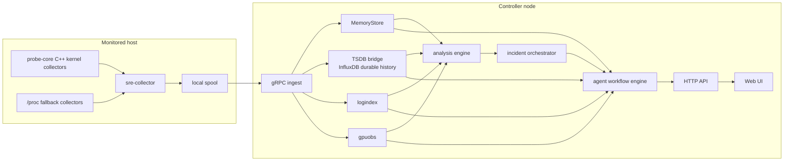
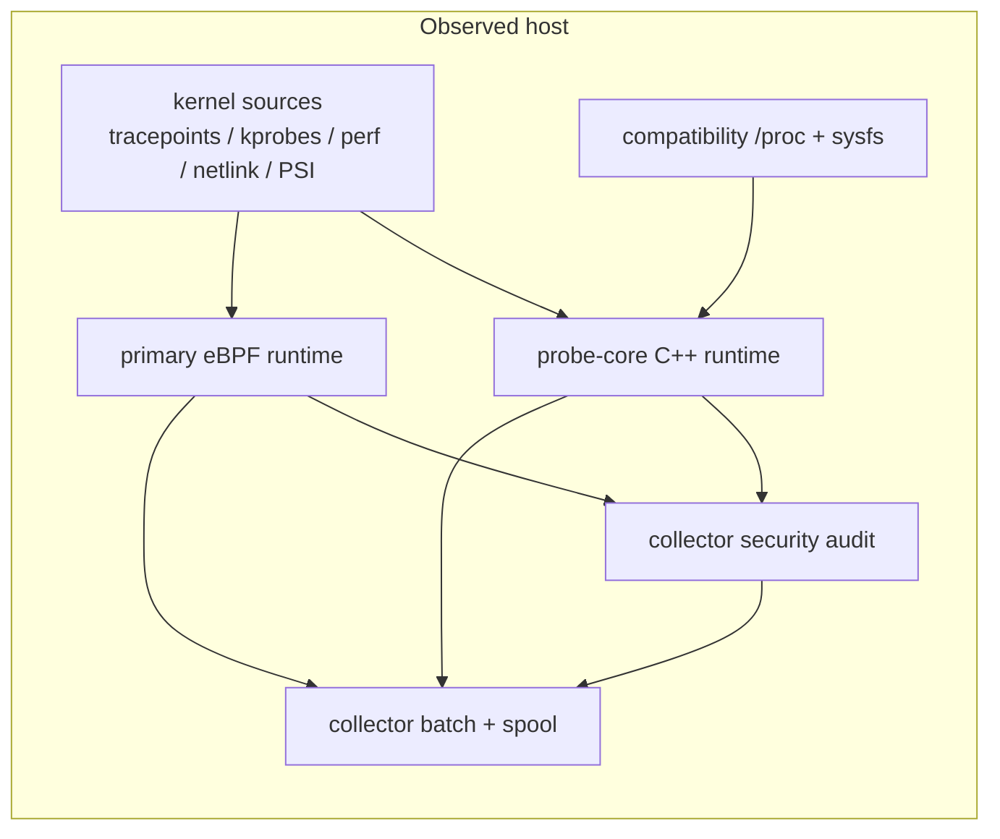
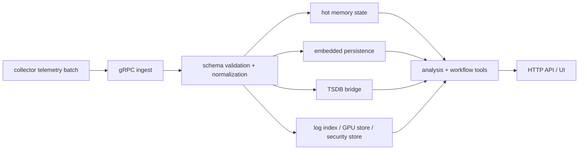
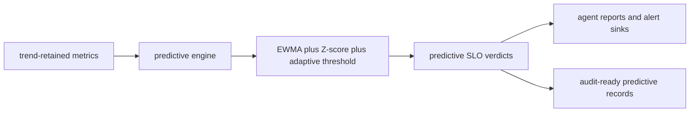
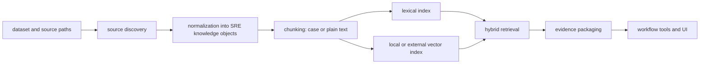
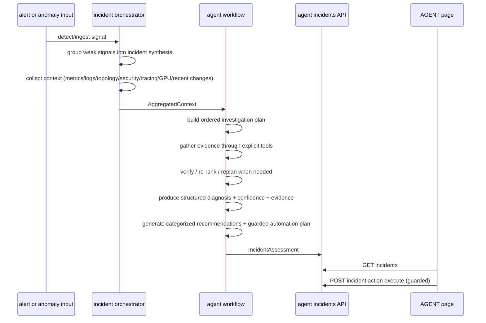
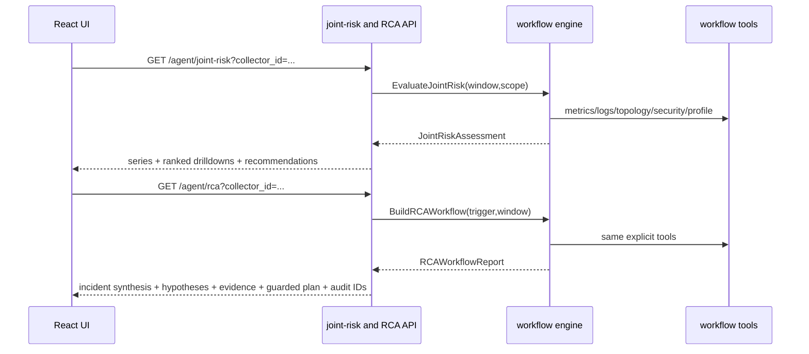

# Architecture (v0.7)

## Runtime topology (agent-first)

### 中文补充: 为什么 runtime topology 要这样拆

- `collector` 必须尽量贴近被观测主机，因为内核事件、`/proc` 快照、日志文件和 GPU/runtime 状态都带有很强的本地时效性；如果先把采样责任放到远端控制面，很多短时证据会直接丢掉。
- `probe-core` 和 `"/proc fallback collectors"` 同时出现，不代表系统想长期维护两条同等级主路径。真实意图是把高保真 kernel-oriented 路径放在前面，再给权限不足、内核能力不足、驱动缺失这类现实环境一个可退化但不至于完全失明的保底面。
- `local spool -> gRPC ingest` 这条链路的原因是把“本机采集”与“网络可达性”解耦。controller 短时不可达时，collector 仍然先把 batch 落到本地，避免把一次控制面抖动误放大成整段观测空洞。
- controller 侧单独承接 ingest、store、analysis、workflow，不只是为了模块好看，而是为了把写入压力、查询压力、推理压力从主机侧移开，避免 collector 自己成为 incident 的一部分。

## Collector low-level pipeline

中文理解可以更直接一点:

- `probe-core` 负责高频、贴近内核和设备的数据面，目标是让 host/process/GPU 这些主路径尽量少经过额外转换。
- eBPF runtime 负责 syscall/network/file/security 这类事件流，因为这类数据天然更像“持续事件通道”，而不是定时轮询快照。
- security audit 单独列出来，是为了明确“行为证据”和“姿态/漂移证据”不是一回事。前者偏 runtime，后者偏 posture，混成一个 collector 很容易让语义变模糊。
- batch + spool 放在末端，说明它是传输可靠性层，而不是信号来源层。这样读文档时更容易看出故障点到底在采集、归因还是传输。

| Path | Primary source | Compatibility source | Why it is split this way |
|---|---|---|---|
| Host/process/resource telemetry | probe-core | `/proc` + sysfs via compatibility host collector | resource snapshots are not the same thing as kernel event streams |
| Runtime/kernel behavior telemetry | eBPF runtime | bounded synthetic `/proc/net/tcp` assists only | short-lived exec/connect/bind/open behavior should be event-driven |
| GPU telemetry | probe-core dynamic NVML | bounded `nvidia-smi` fallback inside probe-core | NVML exposes richer device/process state than shelling out alone |
| Security findings | collector security audit over eBPF + probe-core context | posture scans for gaps | behavior evidence and posture evidence need different collection mechanics |

## Telemetry ingestion pipeline

这里的核心原因是“先规范化，再分发”:

- `schema validation + normalization` 放在 ingest 后第一跳，是为了避免下游每个 store、API、workflow 都重复处理脏数据和版本差异。
- `hot memory state`、`embedded persistence`、`TSDB bridge`、`log/GPU/security store` 被并列画出，是在强调它们消费的是同一份规范化输入，而不是各自偷偷再采一次原始数据。
- `HTTP API / UI` 放在分析之后，不表示 UI 只能看到分析结果，而是表达 controller 对外暴露的是统一控制面视图。用户、自动化和 agent 都应该基于同一份事实边界工作。

## Predictive early-warning path

The predictive path in `v0.7` is intentionally simple and bounded:

- only retained trend metrics enter the hot path, so the controller does not re-scan every raw event stream for forecasting
- algorithms stay deterministic and explainable: EWMA, Z-score, adaptive thresholds, and short-horizon smoothing only
- prediction output is written as structured evidence, not free-form text, so it can participate in guardrails, audits, and future policy evaluation
- LLM workflows consume predictive output as context, but the prediction decision itself does not depend on an LLM call

中文补充:

- 这里单独把 predictive engine 画出来，是为了强调它不是“再加一层智能分析”的泛化说法，而是 controller 上一条严格受限、低成本、可解释的热路径。
- `trend-retained metrics` 这个输入边界很关键。预测模块只吃已经被判定值得长期保留的少量趋势指标，避免为了做早期预警反而把 controller 变成新的性能瓶颈。
- `predictive SLO verdicts` 的意义不只是“多一个告警等级”，而是把“还没完全坏，但已经朝着坏的方向持续漂移”正式建模出来，方便值班、审计和自动化共用同一套语义。
- `audit-ready predictive records` 则是为了满足工业场景里的追溯要求。后续要回答“为什么当时发出预警、基于哪些证据、用的是什么算法版本”，必须有结构化记录而不是只剩下一条日志文本。

### Predictive record contract

Each predictive finding now carries:

- `prediction_id`
- `asset_id`
- `predictive_slo`
- `hazard_class`
- `control_reference`
- `algorithm`
- `algorithm_version`
- `evidence_window_start`
- `evidence_window_end`
- `audit_hash`

This is the minimum contract needed to keep predictive warnings explainable, reviewable, and suitable for enterprise change-control conversations.

## Dependency direction

- `probe/collector` only depends on host collectors, spool, and transport.
- `controller/ingestion` owns validation + hot-cache state and is independent from reasoning.
- `controller/timeseries` owns durable trend history and can fall back to memory when InfluxDB is absent.
- `analysis engine` consumes normalized telemetry and emits alerts/anomalies/correlations.
- `agent workflow` consumes incident contexts + analysis signals and emits diagnosis/recommendations/guarded actions.
- `agent workflow engine` is deterministic pipeline-based and tool-driven (`metrics_query`, `logs_query`, `topology_query`, `security_check`, `rag_query`, `historical_incident_retrieval`, `runbook_retrieval`, `similar_case_retrieval`, with `knowledge_retrieval` kept as a legacy-compatible alias, plus `trace_query`, `gpu_query`, `process_lineage`, `security_graph`, `profiling_trigger`, `remediation_action`).
- UI consumes HTTP APIs only (no direct store access).

## Agent workflow engine (deterministic pipelines)

Two first-class pipelines run on the same tool layer:

1. `joint_risk`
   - `collect_signals`
   - `score_signals`
   - `correlate_signals`
   - `recommendation_generation`
   - `finalize`
2. `rca`
   - `anomaly_detection`
   - `incident_synthesis`
   - `context_gathering`
   - `plan_act_verify_loop`
   - `hypothesis_generation`
   - `evidence_collection`
   - `recommendation_generation`
   - `guarded_execution_plan`
   - `finalize`

Each tool invocation and generated action/recommendation is appended to workflow audit records (`/api/v1/agent/workflow/audit`).

The RCA path is incident-oriented, not anomaly-oriented:

- weak signals are grouped before RCA starts
- grouped scope, time overlap, topology proximity, and co-occurrence feed incident synthesis
- hypotheses are updated after each tool result
- the loop can replan when evidence contradicts the current plan
- completion means required evidence verified, not merely "some tools ran"

### Decision-support outputs

| Output | Purpose | Backing fields |
|---|---|---|
| Synthesized incident | Collapse weak signals into one investigation object | `incident_id`, `grouped_signals`, `impacted_scope`, `time_window`, `severity`, `confidence`, `candidate_root_cause_cluster` |
| Structured RCA | Explain what happened and why | `incident_summary`, `symptoms`, `timeline`, `ranked_hypotheses`, `supporting_evidence`, `contradicting_evidence`, `confidence_score`, `unresolved_gaps` |
| Recommendations | Tell the operator what to do next | category, rationale, expected impact, risk level, confidence, evidence IDs, rollback consideration |
| Proposed actions | Turn recommendations into guarded execution candidates | policy verdict, approval requirement, dry-run plan, rollback plan, audit intent |

## RAG knowledge engine

The RAG path in `v0.7` is no longer a side utility. It is a controller-native knowledge engine that turns mixed dataset material into operational objects such as incidents, runbooks, heuristics, and question patterns.

- ingestion does not stop at raw text extraction; it normalizes symptoms, evidence, likely causes, remediation steps, commands, and signals
- `auto` chunking now prefers structured `case` chunking when a source already looks like an incident or runbook
- retrieval can run in `lexical`, `vector`, or `hybrid` mode, but every mode returns the same evidence contract: source path, chunk id, score, snippet, metadata, and evidence id
- workflows call explicit tools depending on phase: `similar_case_retrieval` for weak-signal interpretation, `historical_incident_retrieval` for RCA analogy, and `runbook_retrieval` for concrete next steps

中文补充:

- 这里把 RAG 单独画成一条链路，是为了强调它已经不是“给 LLM 随便补几段文本”的附属能力，而是 controller 内部真正参与推理的知识面。
- `normalization into SRE knowledge objects` 这一层最关键。只有把原始 dataset 转成 incident、runbook、症状、证据、处置步骤，后面的 RCA 和 recommendation 才能真正消费，而不是只看到一段没有语义边界的文本。
- `workflow tools and UI` 放在链路终点，说明这套知识不只是给模型看，也必须给值班工程师直接看。可解释、可追溯、可反驳，才是生产可用的知识检索。

## Agent incident workflow

中文补充:

- 这里的 `agent incidents API` 对应的是 `/api/v1/agent/incidents` 这一组接口。图里用更中性的名字，是为了避免 sequence diagram 因 endpoint 文本符号过多而影响 GitHub 渲染稳定性。
- 重点不是 endpoint 名字本身，而是说明 incident orchestrator、agent workflow、API 和 UI 之间的职责分工与数据回流关系。

## Joint risk + RCA UI flow

中文补充:

- 这张图里的 API 面实际对应 `/api/v1/agent/joint-risk` 和 `/api/v1/agent/rca`。这里把 participant 名称简化，是为了让 Mermaid 语法更稳，不影响图要表达的交互关系。
- 图的目的不是替代 API 文档，而是强调 UI 并不是直接拼装推理逻辑；真正的 joint-risk 和 RCA 计算都在 workflow engine 和显式工具层完成。

## Internal logging/indexing (ELK-like)

- Log ingestion is local (`/api/v1/logs/ingest`) and indexed by `logindex`.
- Search (`/api/v1/logs/search`) supports text + field filters + timeline aggregation.
- No external Elasticsearch dependency is required for base operation.

## Guarded automation model

- Automation actions are attached to each incident assessment.
- Safe read-only checks execute directly.
- Non-safe actions are `dry-run` by default and require approval token when forced.
- Execution results are written back into the incident assessment (`last_status`, `last_message`, `last_executed_at`).

Policy evaluation produces explicit verdicts:

- `allowed`
- `allowed_with_approval`
- `missing_rollback`
- `insufficient_confidence`

## Trade-offs and limitations

- Root-cause scoring is deterministic and heuristic-driven; it improves explainability but does not replace expert judgement.
- Non-safe remediations are intentionally conservative (blocked/manual-by-default) to avoid unsafe autonomous changes.
- Hot-path reads stay in-memory for latency; controller-side TSDB extends history windows without making the collector stateful.
- Durable TSDB writes currently cover trend-safe metrics, not every high-cardinality raw event stream.
