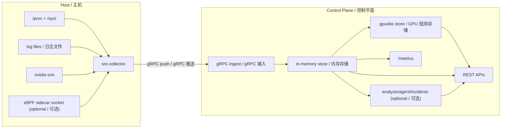

# Architecture (v0.2) / 系统架构

This document describes the implementation currently in this repository.

本文档描述当前仓库中的实际实现。

Use this file for system-level reasoning. Use [`docs/reference/api.md`](../reference/api.md) and [`docs/reference/metrics.md`](../reference/metrics.md) for field-level details.

用于系统级推理。字段级细节请参考 [`docs/reference/api.md`](../reference/api.md) 和 [`docs/reference/metrics.md`](../reference/metrics.md)。

## 1. System Model / 系统模型

The system is push-first.

系统采用 Push-first 模式。

- `sre-collector` runs on monitored nodes / `sre-collector` 运行在被监控节点上
- `sre-controller` ingests telemetry and serves APIs/UI/Prometheus metrics / `sre-controller` 接收遥测数据并提供 API/UI/Prometheus 指标

### Data flow diagram / 数据流向图

### Key design decisions / 关键设计决策

| Decision | Description / 说明 |
|---|---|
| **Push-first** | Collector actively pushes, Controller doesn't poll each host, reducing latency and network overhead / Collector 主动推送，Controller 不轮询，降低延迟和网络开销 |
| **Memory-first** | APIs read from memory for low-latency incident response / API 从内存读取，确保低延迟的故障响应 |
| **Module isolation** | Optional modules (analysis/agent/incidents) isolated from core ingest paths / 可选模块与核心采集路径隔离 |

## 2. Component Boundaries / 组件边界

| Component | Responsibility | Primary code path |
|---|---|---|
| **Collector runtime** | Collect, batch, spool, and push telemetry / 采集、批处理、队列、推送遥测数据 | `backend/internal/collector` |
| **Probe collectors** | Read `/proc`/kernel/GPU/eBPF sources / 读取 `/proc`/kernel/GPU/eBPF 数据源 | `backend/internal/probe` |
| **Ingest store** | Store latest snapshots and trend windows / 存储最新快照和趋势窗口 | `backend/internal/controller/ingest` |
| **Top programs API** | Rank per-process usage by resource category / 按资源类别排名进程使用量 | `backend/internal/controller/top_handlers.go` |
| **GPU aggregation** | Build node-level and K8s-friendly GPU views / 构建节点级和 K8s 友好的 GPU 视图 | `backend/internal/controller/gpuobs` |
| **Analysis and agent** | Deterministic analysis and optional LLM workflows / 确定性分析和可选的 LLM 工作流 | `backend/internal/controller/analysis`, `backend/internal/controller/agent` |
| **AGENT query/action** | NL query, LLM RCA, guarded playbook execution / NL 查询、LLM RCA、受保护的 Playbook 执行 | `backend/internal/agent`, `backend/internal/controller/agent_handlers.go` |
| **Incident orchestration** | Build context bundles from external alerts / 从外部告警构建上下文包 | `backend/internal/incidents` |

## 3. Data Contracts / 数据契约

### Telemetry Batch / 遥测批次

Each batch contains / 每个批次包含：

- Collector identity/version (`collector_id`, hostname, labels) / Collector 身份/版本
- Metric stream (`node_*`, `rca_*`, optional `node_ebpf_*`, optional external/shared-memory metrics) / 指标流
- Top process samples / Top 进程样本
- Log fingerprints / 日志指纹

Proto source: [`proto/telemetry/v1/telemetry.proto`](../../proto/telemetry/v1/telemetry.proto)

### Process Ranking State / 进程排名状态

Per-process ranking persists / 每进程排名持久化：

- `signal_values`: current values / 当前值
- `signal_totals` and `category_totals`: cumulative usage / 累计使用量
- `signal_frequency` and `category_frequency`: observation frequency / 观测频率
- `log_errors` and `log_warnings`: log pressure indicators / 日志压力指标

## 4. Resource Semantics / 资源语义

`Disk` and `Disk I/O` intentionally represent different behavior / `Disk` 和 `Disk I/O` 故意表示不同的行为：

| Category | Meaning | Usage / 用途 |
|---|---|---|
| `disk` | Cumulative storage footprint/activity totals / 累计存储足迹/活动总量 | "Who consumed the most" / "谁消耗最多" |
| `disk_io` | Live throughput and syscall/event pressure / 实时吞吐/_syscall_ 压力 | "Who is hottest right now" / "谁当前最热" |

This distinction is exposed in `/api/v1/top/programs` and rendered in UI resource pages / 这一区分在 API 中暴露，并在 UI 资源页面中渲染。

## 5. API Groups / API 分组

| Group | Endpoints |
|---|---|
| **Core fleet** | `/api/v1/fleet`, `/api/v1/top/programs`, `/api/v1/status` |
| **GPU** | `/api/v1/gpu/nodes`, `/api/v1/k8s/gpu/nodes` |
| **Optional analysis** | `/api/v1/analysis/*` |
| **Optional agent** | `/api/v1/agent/*` |
| **Optional checks** | `/api/v1/checks*` |
| **Incident ingest** | `POST /api/v1/incidents/alerts` |
| **Ops endpoints** | `/metrics`, `/healthz` |

## 6. Frontend Serving Model / 前端服务模型

Controller behavior / Controller 行为：

- Serves `/ui` and `/` when built web assets exist / 当构建的 Web 资源存在时服务 `/ui` 和 `/`
- Serves an inline fallback UI when assets are absent / 资源缺失时服务内联回退 UI

The ranking UI uses `resource_pages` from `/api/v1/top/programs` to render category tabs without overloading a single view / 排名 UI 使用 `resource_pages` 渲染分类标签页，避免单视图过载。

## 7. Operational Guarantees / 运行保障

| Guarantee | Implementation / 实现方式 |
|---|---|
| **Fault-tolerant transport** | Collector spools locally before remote send to tolerate transient controller failures / Collector 在远程发送前本地队列，容忍瞬时 Controller 故障 |
| **Low-latency reads** | Controller APIs are served from in-memory state for minimal query latency / Controller API 从内存状态读取，最小化查询延迟 |
| **Module isolation** | Optional modules (analysis/agent/incidents) do not block core ingest paths / 可选模块不阻塞核心采集路径 |
| **Safe queries** | AGENT query/action plane reads from in-memory stores and GPU snapshots but does not mutate ingest state / AGENT 查询/动作平面读取内存存储和 GPU 快照，但不修改采集状态 |

For rollout checks, use [`docs/checklist.md`](../checklist.md) / 发布检查清单

## 8. Extension Points / 扩展点

### eBPF Integration / eBPF 集成

- Receives eBPF events via Unix socket / 通过 Unix socket 接收 eBPF 事件
- Supported categories: `sched`, `io`, `net`, `mem`, `gpu`, `security`, `syscall` / 支持分类

### External Metrics Bridge / 外部指标桥接

- Inject custom metrics via command-line tools / 通过命令行工具注入自定义指标
- Shared-memory bridge for zero-copy integration / 共享内存桥接支持零拷贝集成

### LLM Integration / LLM 集成

- Supported providers: OpenAI, Ollama, Gemini / 支持多提供商
- Configurable RAG document paths / 可配置 RAG 文档路径
- Playbook-driven action execution / Playbook 驱动的动作执行
