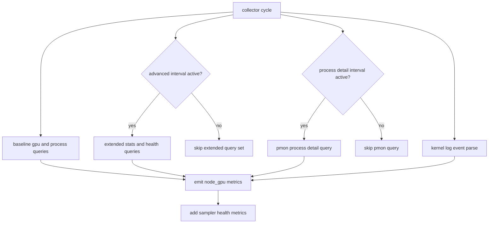
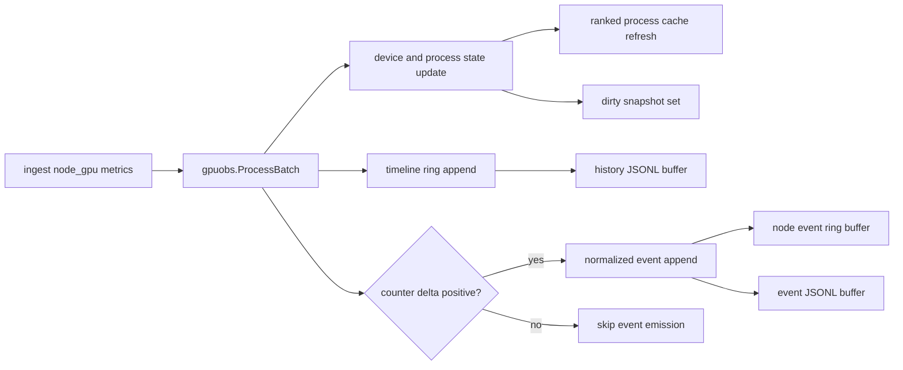
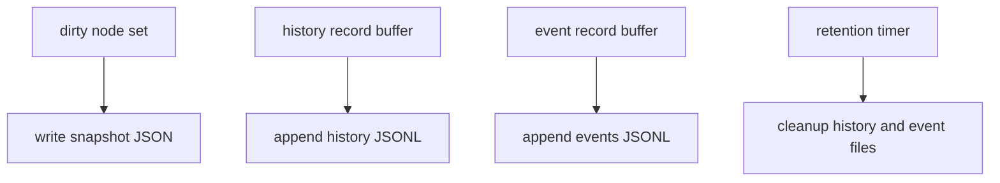

# GPU Observability Design (v0.4)

## Scope and Code Ownership
This subsystem covers the end-to-end path from node GPU sampling to controller GPU APIs.

- Collector sampling: `backend/internal/collector/probe/collector_gpu.go`
- Controller aggregation and persistence: `backend/internal/controller/gpuobs/store.go`
- GPU API handlers and correlation scoring: `backend/internal/controller/gpu_handlers.go`
- GPU UI integration: `frontend/src/components/Visualizations/GPUObservabilityPage.tsx`

## Collector Sampling Pipeline

### Sampling Controls
| Environment variable | Default | Effect |
|---|---|---|
| `SRE_COLLECTOR_GPU_DISABLED` | unset | set to `1` to disable GPU sampling completely |
| `SRE_COLLECTOR_GPU_ADVANCED_INTERVAL_SAMPLES` | `3` | run advanced GPU field queries every N cycles |
| `SRE_COLLECTOR_GPU_PROCESS_DETAIL_INTERVAL_SAMPLES` | `2` | run process detail (`pmon`) every N cycles |
| `SRE_COLLECTOR_GPU_QUERY_TIMEOUT_MS` | `1500` | timeout for each `nvidia-smi` command invocation |

### Query Stages and Fallback Logic
| Stage | Primary query | Fallback behavior | Main metric output |
|---|---|---|---|
| Inventory | `--query-gpu=index,uuid,name,driver_version,persistence_mode` | no fallback | `node_gpu_info`, `node_gpu_persistence_mode`, `node_gpu_count` |
| Device stats | full `--query-gpu` field list (util, memory, temp, power, clocks, pcie) | fallback to minimal field list if unsupported | `node_gpu_utilization_*`, `node_gpu_memory_*`, `node_gpu_pcie_*`, `node_gpu_power_*` |
| Health/reliability | `ecc`, `throttle`, `mig`, `reset_status` fields | failed query does not abort cycle | `node_gpu_ecc_*`, `node_gpu_throttle_*`, `node_gpu_mig_*`, `node_gpu_reset_*` |
| Process baseline | extended `--query-compute-apps` | fallback to minimal compute-apps query | `node_gpu_process_memory_mib`, `node_gpu_process_sm_util_percent`, counts |
| Process detail | `nvidia-smi pmon -c 1 -s um` | if missing, baseline process metrics remain | process encoder/decoder utilization and context activity |
| Runtime events | parse `syslog`, `messages`, `kern.log` | if no events, no event counters are incremented | `node_gpu_event_total`, `node_gpu_xid_errors_total`, `node_gpu_uvm_faults_total`, `node_gpu_reset_events_total` |

### Metric Families Produced by Collector
| Family | Example metrics |
|---|---|
| Device inventory/state | `node_gpu_info`, `node_gpu_count`, `node_gpu_persistence_mode` |
| Utilization and memory | `node_gpu_utilization_sm_percent`, `node_gpu_memory_used_mib`, `node_gpu_memory_bandwidth_theoretical_gbs` |
| Thermal and power | `node_gpu_temperature_celsius`, `node_gpu_power_draw_watts`, `node_gpu_power_draw_percent` |
| Interconnect | `node_gpu_pcie_rx_mb_s`, `node_gpu_pcie_link_utilization_percent`, `node_gpu_nvlink_links` |
| Reliability and health | `node_gpu_xid_errors_total`, `node_gpu_ecc_double_bit_errors_total`, `node_gpu_reset_required` |
| Process attribution | `node_gpu_process_sm_util_percent`, `node_gpu_process_context_active`, `node_gpu_kernel_hotspot_sm_util_percent` |
| Fleet summary | `node_gpu_utilization_sm_avg_percent`, `node_gpu_memory_used_total_mib`, `node_gpu_context_total` |
| Sampler internals | `node_gpu_sampler_query_duration_ms`, `node_gpu_sampler_query_errors_total`, `node_gpu_sampler_query_timeouts_total` |

## Controller Aggregation and Event Normalization

### State Model
- Key hierarchy: `collector_id -> gpu_index -> pid`
- Device state includes inventory metadata, scalar telemetry, reliability counters, and process list.
- Process state stores latest scalar values plus per-process timeline ring.
- Event counters are converted to event records using counter delta logic, including reset handling.

### Event Severity Mapping
- Xid codes `13,31,43,48,63,79,94` map to `critical`.
- Xid codes `8,14,32,45,74` map to `warning`.
- `reset`, `reset_required`, `ecc_double_bit` default to `critical`.
- `uvm_fault`, `reliability`, `throttle_active` default to `warning`.

## Persistence, Retention, and Memory Bounds
### Controller GPU Config Defaults
| Config key | Default |
|---|---|
| `gpu.enabled` | `true` |
| `gpu.persist_dir` | `./data/gpu` |
| `gpu.flush_interval` | `10s` |
| `gpu.retention` | `168h` |
| `gpu.max_processes_per_gpu` | `20` |
| `gpu.timeline_samples_per_gpu` | `720` |
| `gpu.timeline_samples_per_process` | `360` |
| `gpu.event_buffer_per_node` | `1024` |
| `gpu.recent_events_in_snapshot` | `200` |

### File Layout and Flush Loop

- Snapshot path: `data/gpu/snapshots/{collector_id}.json`
- History path: `data/gpu/history/{collector_id}-{yyyy-mm-dd}.jsonl`
- Event path: `data/gpu/events/{collector_id}-{yyyy-mm-dd}.jsonl`

## GPU API Surface and Behavior
| Endpoint | Key query params | Behavior |
|---|---|---|
| `GET /api/v1/gpu/nodes` | none | full node snapshot with devices and recent events |
| `GET /api/v1/gpu/nodes/{collector_id}` | path `collector_id` | one node snapshot |
| `GET /api/v1/gpu/timeline` | `collector_id`, `gpu_id`, `metric`, `window`, `limit` | device metric timeline points |
| `GET /api/v1/gpu/process-timeline` | `collector_id`, `gpu_id`, `pid`, `metric`, `window`, `limit` | per-process timeline points |
| `GET /api/v1/gpu/processes` | `collector_id`, `gpu_id`, `sort_by`, `limit` | ranked process rows |
| `GET /api/v1/gpu/events` | `collector_id`, `gpu_id`, `severity`, `window`, `limit` | filtered recent events |
| `GET /api/v1/gpu/correlation` | `collector_id` | joins GPU state with host pressure metrics and returns risk scores |
| `GET /api/v1/k8s/gpu/nodes` | none | Kubernetes-friendly GPUNodeList projection |

Timeline metric aliases supported by store logic include:
- Device: `sm_util`, `mem_util`, `enc_util`, `dec_util`, `temp_c`, `pcie_link_util_percent`, `xid_errors_total`
- Process: `sm_util`, `mem_util`, `enc_util`, `dec_util`, `context_active`, `mem_mib`

## Correlation Scoring Logic
`/api/v1/gpu/correlation` computes three scores from GPU and host telemetry:

- Starvation risk: weighted by low GPU utilization and host-side disk/network/io-wait pressure.
- Communication risk: weighted by network utilization, PCIe utilization, retransmit ratio, and disk latency.
- Reliability risk: weighted by Xid/reset/throttle/UVM signals.

The response includes:
- aggregated GPU state (`gpu_count`, utilization, memory pressure, event totals)
- host pressure metrics (`cpu_iowait_percent`, disk/network utilization, retransmit ratio)
- risk scores (`starvation_risk`, `communication_risk`, `reliability_risk`, `overall_risk_percent`)
- human-readable risk list derived from score thresholds

## Operational Limits
- Sampling relies on `nvidia-smi`; systems without NVIDIA tooling do not emit this metric family.
- Interval gating reduces collector overhead but can miss short spikes between advanced cycles.
- Timeline APIs are bounded by in-memory ring capacity, not unbounded historical storage.
- Process records are pruned after `30m` of inactivity to cap cardinality.
