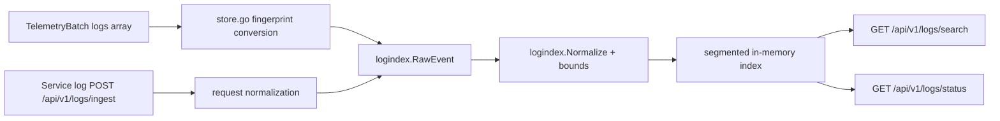

# Log Pipeline Design (v0.4)

## Pipeline Overview

## Entry Paths
1. Collector fingerprint path
- Source: `TelemetryBatch.logs[]`
- Conversion to `RawEvent` in ingest store.
- Supports process log volume/error/warning attribution.

2. Service ingest API path
- Endpoint: `POST /api/v1/logs/ingest`
- Limits:
  - body max `4 MiB`
  - entries max `5000`

## Index Strategy
`logindex.DefaultConfig()`:
- retention: `6h`
- segment duration: `1m`
- max segments: `720`
- max entries: `200000`
- default search window: `15m`
- max search window: `24h`

## Search Output Model
`GET /api/v1/logs/search` returns:
- matching entries
- grouped counts (`level`, `service`, `collector`)
- timeline buckets
- highlights
- metric correlation deltas

## Design Trade-offs
- Chosen: in-process index for low operational overhead.
- Alternative: external Elasticsearch/Loki cluster.
- Trade-off: simpler deploy + low latency, but shorter default retention and fewer advanced query semantics.
