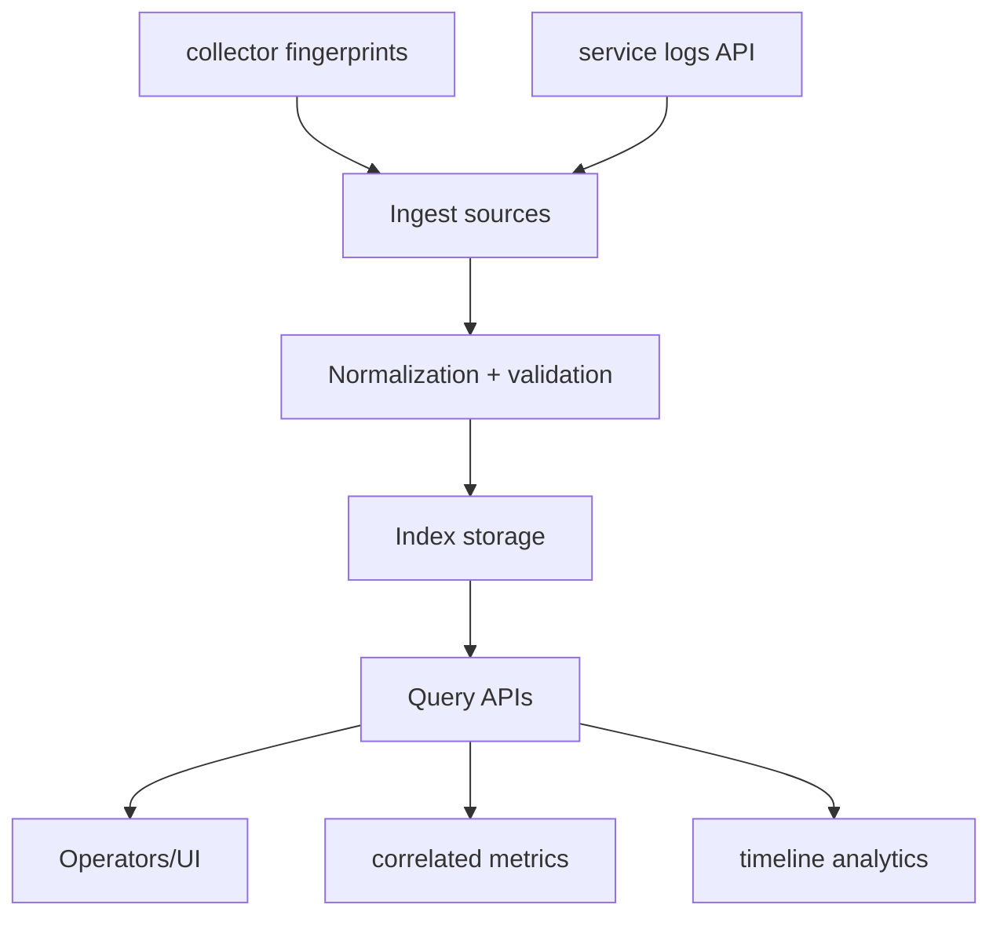

# Log Observability Subsystem (v0.4)

## Scope
The subsystem covers log ingestion, indexing, query APIs, and correlation outputs used by diagnostics and operators.

## Subsystem Boundaries

## Safety Controls
- hard request size and entry-count caps on service ingest.
- message, labels, and metrics bounded per indexed event.
- query limit/offset/window clamping.

## Operational Outputs
- `GET /api/v1/logs/status` for index health and counters.
- `GET /api/v1/logs/search` for structured retrieval and aggregates.
- `/api/v1/ingest/status` includes log-index summary when enabled.

## Constraints
- memory-first retention model.
- correlation quality depends on metric snapshots carried by events.
