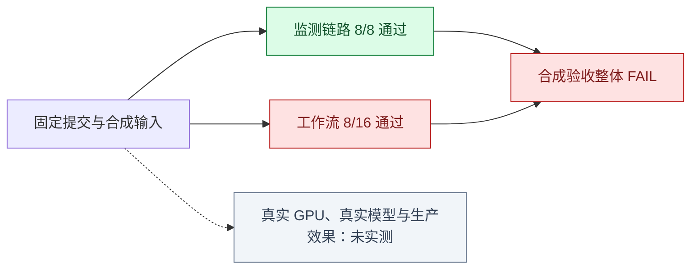

# 有效性实测与历史基线

[验证方法与证据边界](effectiveness-validation.zh-CN.md) · [中文首页](../README.zh-CN.md)

## 2026-10-08 复测：通过门禁后，继续核对实际回答

在干净提交 `908e9190bb779e955d45e474ed9ce4552e795ad8` 上重新运行完整合成验收：监测 **8/8** 阶段、工作流 **16/16** 用例通过，总分 **0.8824**。输入、评分规则和通过门槛没有调整；新报告保留了每次诊断实际给出的首选原因、带名次的候选判断及因果路径。因此总分与此前一致，却能具体解释为什么“通过”仍不足以证明诊断解释可靠。


| 固定诊断用例 | 实际首选原因 | 候选数 / 精确率 | 实际因果路径与问题 |
| --- | --- | --- | --- |
| 内存泄漏 | `memory pressure and reclaim` | 8 / 0.125 | 只有“采集器 → CPU usage”，没有匹配内存泄漏到回收压力的参考阶段 |
| 磁盘延迟 | `storage io bottleneck` | 8 / 0.125 | 同样落到“采集器 → CPU usage”，没有匹配磁盘排队到请求超时的参考阶段 |
| 数据库依赖传播 | `database connection saturation in postgres` | 8 / 0.125 | 只有“采集器 → CPU usage”，没有匹配数据库、支付服务、网关到用户错误的顺序 |

九个适用诊断用例的根因实体召回 / 首位召回均为 **0.778**，全部候选精确率为 **0.210**，传播链得分为 **0.000**。其中八例确有路径文本，但未命中参考传播阶段；另有一例没有路径。现在不能把零分笼统解释为“没有生成路径”，也不能把看起来像路径的文本当作正确因果解释。报告中的 `ranked_root_cause_claims` 保留每条候选的名次，`causal_path` 保留原始顺序，评审者可直接核对，而不只看聚合分数。

这次只增强了**证据可审查性**，并未提升诊断能力。原始报告保存在本地忽略目录 `data/eval/effectiveness/20261008-clean-908e919/`，每例运行一次、种子 42、干净检出；仍使用合成输入与 stub/mock 模型。公开页记录摘要及校验和，不上传可能包含运行细节的原始日志。

| 本次证据文件 | SHA-256 |
| --- | --- |
| 证据清单 | `ec6f700d9de3540b89db10cdd89fdbad491918d363926e43818715e6456d27df` |
| 工作流 JSON 报告 | `f029b9ca328b4993fe341777befa1c1322d8d6e44ade50747f793479583caee6` |
| 工作流逐例摘要 | `7ad2ac64ca0362e576014b8ac9667b198a3a035aca4cfe7510eeb5b5f419c954` |
| 监测 JSON 日志 | `37fbfffacd115949fd5f7f92275d45c4828e78bb94ba9a551e2a378c156dab05` |

下一步需要让因果图选择与最终首选原因及直接证据一致，并在不泄漏答案的未见事故上重测候选收敛和传播顺序。当前分数只证明固定合成门禁通过；真实 GPU、真实大模型和生产效果仍未验证。

## 2026-10-04 历史复测：16/16 通过，但证据边界仍要看清

最终源码提交 [`cfbf61801d2b6c5bd7a584b72f5be3594777afa1`](https://github.com/jfang2048/ai_sre_agent_pub/commit/cfbf61801d2b6c5bd7a584b72f5be3594777afa1)
在干净检出中通过完整合成门禁：监测阶段 **8/8**、工作流用例 **16/16**，加权总分 **0.8824**。
和前一份干净基线（12/16、0.7698）相比，先前失败的弱信号、CPU 根因、数据库传播和多因歧义四例均通过；评分门槛、参考答案和场景没有放宽。


| 验证对象 | 前一份干净基线 | 最新干净复测 | 可支持的结论 |
| --- | --- | --- | --- |
| 监测链路 | 8/8 阶段通过 | 8/8 阶段通过 | 这一组受控输入下，故障提示、隔离、恢复、计数器重置、采集失败和过期语义符合预期 |
| 四个定位缺口 | 4 例未通过 | 4 例逐例通过 | 有用例证据支持进程归因、数据库等待归因及多域综合排序改善 |
| 全部工作流 | 12/16，0.7698 | 16/16，0.8824 | 当前评分器与这套 16 例固定场景全部通过 |
| 根因实体精确率 | — | 0.210（9 个适用诊断任务） | 根因实体命中精度偏低；这项聚合指标不能被 16/16 用例通过所替代 |
| 根因实体召回 / 首位召回 | — | 0.778 / 0.778 | 参考根因对象多数可被找回，但并非全部覆盖 |
| 传播链得分 | — | 0.000 | 根因到下游影响的因果顺序仍未证明充分 |
| 正常状态误报 | 0/4 | 0/4 | 只有同一合成时间序列里的 4 个健康阶段，不能推算生产误报率 |

**怎样读懂 0.210：**评分器把全部排序候选都算进精确率；首选原因正确、后面又列出七个不相关候选时，仍只得到 1/8。这个低值反映“答案范围过宽”，不能用 16/16 的通过数抵消。首位召回较高说明不少用例把正确对象放在前面，两者并不矛盾。**怎样读懂 0.000：**固定参考答案要求有序的故障传播阶段，但本次报告没有得到匹配的有序路径；目前不能声称已解释故障如何传到下游。

复查新运行的 `workflow/summary.md` 可看到每个诊断用例的首选原因、候选数、精确率和路径阶段数；`workflow/report.json` 的 `cases[].trials_detail[]` 留存完整候选与因果路径。新增的是审查入口，不改变本页这份历史运行的原始文件或 SHA-256，也不追溯改写它的结果。

排序改进让直接进程测量、关联日志和假设共享可核对证据；低置信、多资源域同时触发且有发布关联时，系统会把综合判断放到单个相关信号之前。模型意见仍可补充说明，但不会单凭低分抹去直接观测。数据库监测 exporter 也不再被当成数据库进程。

这次通过的范围是“这套固定合成验收及其硬门禁”。报告中的总体根因实体精确率只有 **0.210**（仅 9 个适用诊断任务计量），传播链得分为 **0.000**；因此，门禁通过不代表每项质量指标都达标。此外，监测用例共用一条时间序列，工作流每例只运行一次，且采用 `legacy_deterministic` 与 stub/mock 模型。真实 GPU、真实大模型推理质量、真实误报率、生产 MTTR、业务影响和相对人工收益仍未证明。

复测提交为 [`cfbf61801d2b6c5bd7a584b72f5be3594777afa1`](https://github.com/jfang2048/ai_sre_agent_pub/commit/cfbf61801d2b6c5bd7a584b72f5be3594777afa1)，源码检出干净；每例 1 次、种子 42。完整机器报告保存在执行机器的忽略目录 `data/eval/effectiveness/20261004-clean-cfbf618/`，本页公开摘要和摘要哈希，不把原始日志当成生产证据。

| 本次原始证据 | SHA-256 |
| --- | --- |
| 工作流报告 | `1bd63982e372b230263f5f641774d4deb2e57eb11edd17acc6f30cbad0909c95` |
| 工作流摘要 | `7a429795354ec91b2acfd113882ea88ca3fad95b1a56324e60efc94857adad57` |
| 监测 JSON 日志 | `812ff2376cd2c451ce0557943bc7950dc8bc7d3046352e1fc153c6bc3234ff56` |
| 证据清单 | `20447ce6d4d0537af93fdf36c4d0afc1d63f25f8a5d456b3c3588182100ab45c` |

可在该提交的干净检出中运行 `python3 scripts/evaluation/validate_effectiveness.py --trials 1` 重做同样门禁；重跑时间和原始文件哈希会变化。历史的 12/16 复测与 2026-10-03 初测结果仍保留在下文，便于追踪改善过程。

## 历史基线：2026-10-03 初测（FAIL）

**初测的整体结论是 FAIL：监测软件链路通过 8 个阶段，调查工作流通过 8/16 个用例。**
这说明数据采集、告警和恢复链路在给定输入下按预期工作，但还不能声称整个调查系统可靠有效。
监测提示与工作流决策是两个不同的验证对象，前者通过不能覆盖后者的误报和定位错误。

## 初测结果一眼看懂



| 验证对象 | 实测结果 | 能得出的结论 |
| --- | --- | --- |
| 采集器 → 磁盘队列 → gRPC → 持久化接收 → HTTP | 8/8 阶段通过 | 软件传输、提示、隔离、恢复和过期语义在这条受控序列上有效 |
| 故障诊断 | 5/9 用例通过 | 能处理部分故障；弱信号、CPU 争用、依赖传播、多因歧义仍有缺口 |
| 检测 / 方案 / 验证 | 分别为 1/1、0/1、1/1 | 检测和验证的固定例子通过，内存处置方案未达到覆盖门槛 |
| 正常状态应保持安静 | 1/4 用例通过 | 普通健康基线通过，三类正常波动仍触发错误的故障判断 |
| 工作流综合评分 | 0.6790，范围 0–1 | 这是加权评分，不是准确率；不能抵消失败用例 |
| 硬门禁 | 逐例通过门禁失败，其余 6 项通过 | 命令返回非零，保留 FAIL；没有降低原验收标准 |

本次监测命令耗时 14.460 秒，工作流命令耗时 39.462 秒，包含本机执行开销。
这些值不是生产检测延迟，也不是故障恢复时间。

## 监测部分为什么不是“总是报警”就能通过

故障阶段的六项预设提示全部出现；恢复、计数器重置、相邻引擎和健康基线没有多余提示。
采集失败保留最近成功时间，控制器重启后恢复观测，过期后清空当前指标和提示。

| 方法 | 发现故障 | 漏报 | 正常时安静 | 误报 |
| --- | ---: | ---: | ---: | ---: |
| 本次监测实测 | 1 | 0 | 4 | 0 |
| 总是告警 | 1 | 0 | 0 | 4 |
| 总是不告警 | 0 | 1 | 4 | 0 |

只有 1 个故障阶段和 4 个健康阶段进入这个对照，且它们来自同一时间序列。
采集失败、重启和过期阶段不算健康样本。这里不能推断生产环境误报率为零。

## 八个失败用例具体告诉我们什么

| 用例 | 实测失败证据 | 后续修复应证明什么 |
| --- | --- | --- |
| `weak_signal_diagnose` | 根因精确率 0.44，首选根因召回 0.33，均低于 0.50 | 弱信号下仍能收敛到相关根因，不能靠增加无关候选过关 |
| `cpu_contention_diagnose` | 根因精确率 0.33，首选根因召回 0 | 将 CPU 争用的正确原因放到有用的位置 |
| `dependency_propagation_diagnose` | 根因实体召回与原因解释评分均为 0 | 能区分根因依赖与受影响服务，并提供传播证据 |
| `ambiguous_multi_cause_diagnose` | 根因精确率 0.33，首选根因召回 0 | 明确候选证据和不确定性，减少无关解释 |
| `memory_pressure_plan` | 方案覆盖率 0.25，低于 0.50 | 给出与故障对应、满足参考条件的处置方案 |
| `normal_workload_spike_noop` | 正常负载突增被判故障，并产生不必要处置 | 在正常负载变化下保持安静 |
| `temporary_transient_spike_noop` | 短暂波动被判故障，并产生不必要处置 | 能识别短暂变化，避免过早下结论 |
| `normal_rollout_noise_noop` | 正常发布噪声被判故障，并产生不必要处置 | 不把发布相关性自动当成故障证据 |

这些是现有固定参考答案与评分器下的失败，不是人工专家或真实大模型评判结果。
工作流处于 `dry_run`，上述“不必要处置”不表示在生产系统执行了修复命令。
安全门禁通过也只覆盖本次合成执行路径。

## 这次实验怎样复查

实验提交为 [`9582a035def60beceab00a32c01580f2e0e1a4c5`](https://github.com/jfang2048/ai_sre_agent_pub/commit/9582a035def60beceab00a32c01580f2e0e1a4c5)，
在干净检出中执行。工作流为 `legacy_deterministic`，stub/mock 模型，每例一次，统计种子 42。
各引擎使用独立临时存储，评分读完证据后再清理；没有使用之前用例留下的经验。

在该提交的干净检出中运行：

```bash
python3 scripts/evaluation/validate_effectiveness.py --trials 1
```

输出目录内保留 `summary.md`、`manifest.json`、监测 JSON 测试日志和 `workflow/report.json`。
看到退出码 1 和 FAIL 是本次记录的有效结果，不应通过跳过场景或修改门槛把它变成绿色。
重跑时会产生新的时间戳、耗时和产物哈希；不要求整个结果文件逐字一致。

| 本次原始证据 | SHA-256 |
| --- | --- |
| 监测 JSON 日志 | `bac9954a7023b143a04c6fb5e4ca41dbebf0a3c1fd5044e6ca23f7c4388ba666` |
| 工作流报告 | `cc8d56b791516b4c335acbf1fb0b181c472cfd642c81ed89b08d1b822e5a4d2d` |

| 输入或规则 | 本次 SHA-256 |
| --- | --- |
| 用例与参考答案 | `fc8690a495873c741d7eafdbf935c73874ed620d035f7cc72e23d9f43ccc71ad` |
| 实际事故输入 | `8eef18d8e60f7fc4a5753cf2577d27d4ade5d630e7e6b32de26a5d5e5567edeb` |
| 评分配置 | `a4efc079440c070e508bff911d7c5000659caaab29dc0f3a328902a956745c7d` |
| 知识库 | `b6a955b675d33a55ada65809806004624fd6c73eaf47d2a50958b183b716c491` |
| 评测器及场景生成源码 | `4ddfcf4155faaeb8ef3d5c9c306261439f9cac090cf5ac8c9641251ad0666688` |
| 回归规则 | `d6d26f00fc216048727c353ee97584c951ff104e0dad0165cd8ab97896f41aa6` |

原始文件保存在执行机器的 Git 忽略目录；本页是经过审阅的公开摘录，并未公开上传整份日志。
哈希用于核对持有的原始文件，不能单独代替原始证据。重新运行命令可以独立检查当前行为。

## 当前允许说到哪里

可以说：本项目已有能复现、能失败、能核对输入和实际输出的验证流程；受控监测软件链路通过验收，
工作流仍有八个公开记录的失败用例。

还不能说：真实 GPU/推理服务已验证、真实大模型推理可靠、生产误报低于某个值、优于人工值班，
或自动修复能缩短 MTTR。下一步应先修复并重测这些失败，再按验证指南开展未见事故、真实设备和只读生产实验。
