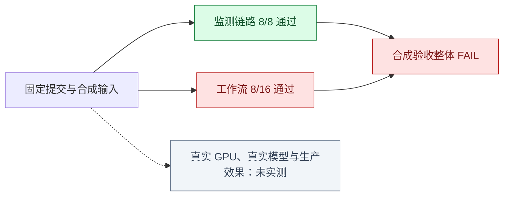

# 有效性实测：2026-10-03

[验证方法与证据边界](effectiveness-validation.zh-CN.md) · [中文首页](../README.zh-CN.md)

**本次合成验收的整体结论是 FAIL：监测软件链路通过 8 个阶段，调查工作流通过 8/16 个用例。**
这说明数据采集、告警和恢复链路在给定输入下按预期工作，但还不能声称整个调查系统可靠有效。
监测提示与工作流决策是两个不同的验证对象，前者通过不能覆盖后者的误报和定位错误。

## 结果一眼看懂



| 验证对象 | 实测结果 | 能得出的结论 |
| --- | --- | --- |
| 采集器 → 磁盘队列 → gRPC → 持久化接收 → HTTP | 8/8 阶段通过 | 软件传输、提示、隔离、恢复和过期语义在这条受控序列上有效 |
| 故障诊断 | 5/9 用例通过 | 能处理部分故障；弱信号、CPU 争用、依赖传播、多因歧义仍有缺口 |
| 检测 / 方案 / 验证 | 分别为 1/1、0/1、1/1 | 检测和验证的固定例子通过，内存处置方案未达到覆盖门槛 |
| 正常状态应保持安静 | 1/4 用例通过 | 普通健康基线通过，三类正常波动仍触发错误的故障判断 |
| 工作流综合评分 | 0.6790，范围 0–1 | 这是加权评分，不是准确率；不能抵消失败用例 |
| 硬门禁 | 逐例通过门禁失败，其余 6 项通过 | 命令返回非零，保留 FAIL；没有降低原验收标准 |

本次监测命令耗时 14.460 秒，工作流命令耗时 39.462 秒，包含本机执行开销。
这些值不是生产检测延迟，也不是故障恢复时间。

## 监测部分为什么不是“总是报警”就能通过

故障阶段的六项预设提示全部出现；恢复、计数器重置、相邻引擎和健康基线没有多余提示。
采集失败保留最近成功时间，控制器重启后恢复观测，过期后清空当前指标和提示。

| 方法 | 发现故障 | 漏报 | 正常时安静 | 误报 |
| --- | ---: | ---: | ---: | ---: |
| 本次监测实测 | 1 | 0 | 4 | 0 |
| 总是告警 | 1 | 0 | 0 | 4 |
| 总是不告警 | 0 | 1 | 4 | 0 |

只有 1 个故障阶段和 4 个健康阶段进入这个对照，且它们来自同一时间序列。
采集失败、重启和过期阶段不算健康样本。这里不能推断生产环境误报率为零。

## 八个失败用例具体告诉我们什么

| 用例 | 实测失败证据 | 后续修复应证明什么 |
| --- | --- | --- |
| `weak_signal_diagnose` | 根因精确率 0.44，首选根因召回 0.33，均低于 0.50 | 弱信号下仍能收敛到相关根因，不能靠增加无关候选过关 |
| `cpu_contention_diagnose` | 根因精确率 0.33，首选根因召回 0 | 将 CPU 争用的正确原因放到有用的位置 |
| `dependency_propagation_diagnose` | 根因实体召回与原因解释评分均为 0 | 能区分根因依赖与受影响服务，并提供传播证据 |
| `ambiguous_multi_cause_diagnose` | 根因精确率 0.33，首选根因召回 0 | 明确候选证据和不确定性，减少无关解释 |
| `memory_pressure_plan` | 方案覆盖率 0.25，低于 0.50 | 给出与故障对应、满足参考条件的处置方案 |
| `normal_workload_spike_noop` | 正常负载突增被判故障，并产生不必要处置 | 在正常负载变化下保持安静 |
| `temporary_transient_spike_noop` | 短暂波动被判故障，并产生不必要处置 | 能识别短暂变化，避免过早下结论 |
| `normal_rollout_noise_noop` | 正常发布噪声被判故障，并产生不必要处置 | 不把发布相关性自动当成故障证据 |

这些是现有固定参考答案与评分器下的失败，不是人工专家或真实大模型评判结果。
工作流处于 `dry_run`，上述“不必要处置”不表示在生产系统执行了修复命令。
安全门禁通过也只覆盖本次合成执行路径。

## 这次实验怎样复查

实验提交为 [`9582a035def60beceab00a32c01580f2e0e1a4c5`](https://github.com/jfang2048/ai_sre_agent_pub/commit/9582a035def60beceab00a32c01580f2e0e1a4c5)，
在干净检出中执行。工作流为 `legacy_deterministic`，stub/mock 模型，每例一次，统计种子 42。
各引擎使用独立临时存储，评分读完证据后再清理；没有使用之前用例留下的经验。

在该提交的干净检出中运行：

```bash
python3 scripts/evaluation/validate_effectiveness.py --trials 1
```

输出目录内保留 `summary.md`、`manifest.json`、监测 JSON 测试日志和 `workflow/report.json`。
看到退出码 1 和 FAIL 是本次记录的有效结果，不应通过跳过场景或修改门槛把它变成绿色。
重跑时会产生新的时间戳、耗时和产物哈希；不要求整个结果文件逐字一致。

| 本次原始证据 | SHA-256 |
| --- | --- |
| 监测 JSON 日志 | `bac9954a7023b143a04c6fb5e4ca41dbebf0a3c1fd5044e6ca23f7c4388ba666` |
| 工作流报告 | `cc8d56b791516b4c335acbf1fb0b181c472cfd642c81ed89b08d1b822e5a4d2d` |

| 输入或规则 | 本次 SHA-256 |
| --- | --- |
| 用例与参考答案 | `fc8690a495873c741d7eafdbf935c73874ed620d035f7cc72e23d9f43ccc71ad` |
| 实际事故输入 | `8eef18d8e60f7fc4a5753cf2577d27d4ade5d630e7e6b32de26a5d5e5567edeb` |
| 评分配置 | `a4efc079440c070e508bff911d7c5000659caaab29dc0f3a328902a956745c7d` |
| 知识库 | `b6a955b675d33a55ada65809806004624fd6c73eaf47d2a50958b183b716c491` |
| 评测器及场景生成源码 | `4ddfcf4155faaeb8ef3d5c9c306261439f9cac090cf5ac8c9641251ad0666688` |
| 回归规则 | `d6d26f00fc216048727c353ee97584c951ff104e0dad0165cd8ab97896f41aa6` |

原始文件保存在执行机器的 Git 忽略目录；本页是经过审阅的公开摘录，并未公开上传整份日志。
哈希用于核对持有的原始文件，不能单独代替原始证据。重新运行命令可以独立检查当前行为。

## 当前允许说到哪里

可以说：本项目已有能复现、能失败、能核对输入和实际输出的验证流程；受控监测软件链路通过验收，
工作流仍有八个公开记录的失败用例。

还不能说：真实 GPU/推理服务已验证、真实大模型推理可靠、生产误报低于某个值、优于人工值班，
或自动修复能缩短 MTTR。下一步应先修复并重测这些失败，再按验证指南开展未见事故、真实设备和只读生产实验。
