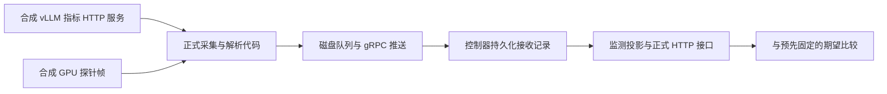

# 怎样证明这个系统有效

[中文首页](../README.zh-CN.md) · [评分细则](evaluation.zh-CN.md) · [测试目录](../tests/README.md)

[2026-10-08 最新干净复测](effectiveness-results-2026-10-03.zh-CN.md)：监测 8/8 阶段、工作流 16/16 用例通过；这是固定合成验收结果，不代表真实设备或生产有效性。报告仍显示根因实体精确率 0.210、传播链得分 0.000。

通过用例门槛只是第一道检查。诊断报告现在逐次保留**首选原因、所有候选原因、实际给出的因果路径**，并在摘要列出候选数、根因精确率和传播链得分。评审者可以把实际回答与固定参考答案逐项对照：首选原因找对了，不等于其余候选也可靠；没有给出传播路径，也不能凭正确的首选原因推断传播机制。


这里的“根因实体精确率”统计的是**所有排过名的候选判断**，不是仅看第一名。比如第一名正确，但其余七个候选均不匹配，精确率就是 1/8；首位召回仍可为正。两项指标回答的是不同问题，不能选较好看的那项代替另一项。机器报告 `cases[].trials_detail[]` 中的 `top_root_cause`、`ranked_root_cause_claims` 和 `causal_path` 是供审查的原始输出；得分仍由原有评分器计算，没有因为增加这些字段而改变门槛。

**有效性需要一条可以被别人复查、也允许得出失败结论的证据链。** 页面能打开、测试数量多、
报告写得完整，只能说明部分工程能力。更关键的是：故障发生时有没有发现，正常时有没有误报，
原因是否找对，故障消失后有没有撤销提示，以及这些结果是否值得它消耗的时间和资源。

## 先把“有效”拆成可以被推翻的主张

| 主张 | 怎样检验 | 反例会是什么 | 当前证据边界 |
| --- | --- | --- | --- |
| 数据确实进入了系统 | 外部指标响应经过实际采集、磁盘队列、gRPC、接收记录，再从 HTTP 读回 | 函数里算对了，页面/API 却没有数据或值变了 | 可在本地用合成输入验证整条软件路径 |
| 该提示时提示，不该提示时保持安静 | 预先定义健康、故障、恢复和隔离对照 | 总是报警、从不报警，或把另一引擎的故障归给当前模型 | 当前只有受控合成阶段，不能推算生产误报率 |
| 缺数据时不会假装健康 | 中断指标接口、重置计数器、等待数据过期 | 超时被显示为零，或旧告警永远有效 | 可验证采集失败、时间语义与重启恢复 |
| 调查结论确实完成任务 | 对照独立故障事实，逐例核对定位、方案和验证结果 | 报告齐全但原因错误，或故障未恢复却结案 | 现有 16 个合成工作流用例，无真实修复用例 |
| 比简单规则或人工处理更有价值 | 同样的事故、权限、时间预算，配对比较 | 平均分好看，但误报更高、花费更多或定位更慢 | 目前不能声称已经优于人工或真实大模型基线 |
| 在生产中仍有效 | 隔离实验后开展只读旁路观察与受控灰度 | 换模型、驱动、业务或噪声水平后退化 | 需要另行收集真实设备与业务证据 |


## 一条命令生成可复查的证据

仓库根目录运行，需要 Go、Python 3 和可用的本机回环网络；无需 GPU、模型密钥或新增 Python 包。

```bash
# 完整证据：监测链路 + 全部 16 个合成工作流场景，每例一次
make validate-effectiveness

# 较快的链路验收，明确只证明监测部分
make validate-monitoring

# 需要观察同一场景的重复执行一致性时
python3 scripts/evaluation/validate_effectiveness.py --trials 5
```

默认每个工作流场景执行一次，是为了先检查覆盖范围；五次确定性重放不是五个新的事故样本。
命令会保存原始命令日志、JSON 证据清单和中文摘要，默认目录是 `data/eval/effectiveness/` 下的新运行目录。
输出目录不能覆盖已有结果。先读 `summary.md` 的分层判定，再打开清单所引用的工作流报告及失败用例。

完整命令只有在两部分都通过时才成功退出。缺少某个预期子测试、测试被跳过、证据记录缺失、
报告无法解析或工作流给出 `FAIL`，都会失败。`--monitoring-only` 成功会明确标为
`PASS_MONITORING_ONLY`，不能拿来宣称整个系统通过验收。

命令清除影响运行的 `SRE_*` 环境变量并使用隔离的合成运行配置，避免某台电脑的模型、检索或权限配置
悄悄改变实验。清单记录被清除的变量名，不记录值。工作区是否有修改也会记录；
**结果可读取不等于具备正式版本比较条件**，后者仍要求干净的已提交版本和可比输入。

## 监测验收究竟穿过了哪些真实代码



替代的是最外层的指标源和 GPU 设备帧。其余使用生产代码，包括标签映射、速率与延迟计算、
磁盘队列确认、网络传输、持久化、接口序列化和控制器重启后的恢复。
这弥补了“把测试数据直接塞进控制器内存，然后说端到端通过”的覆盖缺口。

| 阶段 | 预设输入或操作 | 必须看到的结果 |
| --- | --- | --- |
| 健康基线 | 无排队、低缓存与显存占用 | 不提示故障；真实零值保留，首次延迟均值缺失 |
| 注入压力 | 等待 18 个请求、缓存 94%、首字均值 2.4 秒、输出间隔 0.2 秒、显存 96%、热限制标志 | 六项指定提示全部出现；延迟和吞吐与输入的独立计算一致 |
| 相邻引擎对照 | 同名模型另一个引擎保持健康 | 不继承异常引擎的排队、延迟或告警 |
| 撤销故障 | 恢复低负载，加入新的低延迟样本 | 提示撤销，区间首字均值回到 0.1 秒 |
| 计数器重置 | 累计 token 与直方图回到零 | 吞吐与延迟重新建立基线，不伪造负值或健康零值 |
| 指标服务失败 | HTTP 返回 503 | 状态为不可用，最近成功时间不被更新 |
| 控制器重启 | 关闭并重新打开同一持久化接收记录 | 服务/GPU 观测及失败状态可恢复，时间保持原样 |
| 数据过期 | 停止新采样，等待配置的有效期 | 状态过期、指标和当前提示清空，不把未知显示为零 |

源代码和固定参考答案在 [monitoring_effectiveness_test.go](../backend/internal/collector/monitoring_effectiveness_test.go)。
每一步输出实际指标、作用范围、期望提示、观测提示和步骤耗时。步骤耗时用于检查这次受控链路，
不能标成生产故障检测时间，也不包含真实模型执行和 GPU 驱动开销。

## 为什么还要放两个“很笨”的对照

如果只测故障，“永远报警”的系统也能得满分；如果大多数样本健康，“永远安静”可能有很高的准确率。
因此摘要会同时展示当前检测结果、总是报警、总是不报警的混淆矩阵。

| 真实情况 | 系统提示异常 | 系统没有提示异常 |
| --- | --- | --- |
| 有故障 | 正确发现 TP | 漏报 FN |
| 健康 | 误报 FP | 正确保持安静 TN |

精确率是 `TP / (TP + FP)`，召回率是 `TP / (TP + FN)`。分母为零时应显示未测量，不能补成 100%。
采集失败、重启、过期阶段不属于健康负例，不计入这个矩阵。
当前健康、异常、恢复等阶段来自**同一受控序列**，数量很小；矩阵用于排除显而易见的无效实现，
不是统计独立的事故样本，也不能证明对未见场景的泛化能力。

## 工作流评分与结果来源怎样防止“换尺子”

监测提示正确，并不等于根因分析正确。完整命令另外运行现有工作流评测，仍执行逐例任务门槛、
安全门禁和总分规则；不会因为监测部分通过，就替工作流宣布成功。
默认工作流使用合成数据及 stub/mock 模型路径，因此这个分数不是商用或本地真实大模型的能力分数。

每次工作流试验中，带检索与不带检索的引擎各自使用全新的临时存储，并在结束后关闭和清理。
这样前一个用例的经验不会变成后一个用例的答案来源，也不会因共用数据库锁而悄悄退回内存。
实验会检查实际启用的持久化后端；这项检查仍不能代替工作流进程崩溃后的恢复实验。

报告的 `environment.provenance` 保存用例与参考答案、解析后的事故输入、评分配置、知识库、
评测器源码和回归规则的 SHA-256。文件清单可定位具体变化。基线比较遇到缺失或不同的指纹会拒绝比较，
即使用例 ID 完全相同也不例外。

这里指纹覆盖的是仓库中的输入及评测源码，不是编译二进制的远程可信证明。
修改被测运行时代码属于版本比较的目的；修改知识材料、故障输入或评分方法，则需要重新建立基线。
不要把这次候选结果直接保存成自己的基线，再以“零退化”声称获得提升。

## 从软件验证走到真实效果，需要补哪些实验

| 下一层实验 | 应提前固定什么 | 必须保留什么证据 |
| --- | --- | --- |
| GPU 与推理服务实验室 | 设备/驱动/服务版本、请求长度与并发、采样周期、允许负载范围 | 同时段独立设备读数、服务请求时间、采集时间与 API 读数，计算误差和检测延迟 |
| 未见事故回放 | 在调参前冻结留出集，按原始事故来源分组，隔离训练知识和参考答案 | 逐例结果、故障对象、健康对照及失败原因；同一事故的不同描述不算独立样本 |
| 只读生产旁路 | 告警判定标准、人工标注方式、观察窗口、资源预算 | 误报与漏报、首次正确定位时间、采集开销、人工接管比例；缺失遥测单独统计 |
| 与规则/人工配对比较 | 同一输入、权限、时间与工具预算，提前定义有用的改善幅度 | 成功率和耗时的配对差异、样本量与不确定性；不能挑选有利案例 |
| 受控修复与恢复验证 | 授权范围、回滚条件、观察窗口与服务 SLO | 实际执行记录、前后业务状态和无新增退化证据；短暂指标回落不算稳定恢复 |

通过条件应在实验前由业务场景决定。例如，“不增加误报的前提下减少首次正确定位耗时”比单独追求
综合评分更接近运维价值。零次错误也必须附带观察量和边界，不能直接推出错误概率为零。
当前仓库没有自动执行这些生产实验，也没有据此声称提升 MTTR 或证明自动修复有效。

## 交付给评审者的一页结论

使用下面的顺序，既保留成果，也保留能推翻结论的信息：

1. **主张与范围：** 这次证明了监测软件链路、合成工作流，还是实际业务恢复？
2. **实验身份：** 哪个提交、工作区状态、输入指纹、运行配置、场景和样本来源？
3. **结果与对照：** 每层通过/失败、误报/漏报、失败用例、简单基线，哪些值未测量？
4. **证据入口：** 原始日志、JSON/CSV、清单摘要和产物校验和；仅凭截图不能复核数值。
5. **尚未证明：** 真实模型、真实设备、未见故障、资源开销或修复效果中，哪些仍缺实验？

自动生成的证据保留在 Git 忽略目录中。公开展示前审阅内容；不要把包含真实主机、提示词或工具参数的
运行日志直接提交仓库。
