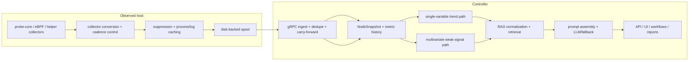

# Pipeline Deep Dive

中文版本：[docs/zh/02-pipeline-deep-dive.md](../zh/02-pipeline-deep-dive.md)

This guide is the code-grounded, end-to-end explanation of the current `v0.8` pipeline.

It answers the questions that a new operator, contributor, or reviewer usually has after reading the landing page:

- What exactly is collected on the host?
- Why is there a queue before send?
- What is suppressed, deduplicated, or carried forward?
- What analysis happens before retrieval or LLM reasoning?
- How are single-metric trends different from multivariate weak-signal detection?
- What does the built-in dataset actually contain, and how does retrieval change the answer?
- What final response shape does the system return?

This page is deliberately grounded in the current implementation, especially:

- [`backend/internal/collector/collector.go`](../../backend/internal/collector/collector.go)
- [`backend/internal/collector/probe_core_convert.go`](../../backend/internal/collector/probe_core_convert.go)
- [`backend/internal/collector/aux_sampling.go`](../../backend/internal/collector/aux_sampling.go)
- [`backend/internal/collector/process_payload_suppression.go`](../../backend/internal/collector/process_payload_suppression.go)
- [`backend/internal/collector/metric_suppression.go`](../../backend/internal/collector/metric_suppression.go)
- [`backend/internal/collector/spool/spool.go`](../../backend/internal/collector/spool/spool.go)
- [`backend/internal/collector/transport/client.go`](../../backend/internal/collector/transport/client.go)
- [`backend/internal/controller/ingest/server.go`](../../backend/internal/controller/ingest/server.go)
- [`backend/internal/controller/ingest/store.go`](../../backend/internal/controller/ingest/store.go)
- [`backend/internal/controller/timeseries/service.go`](../../backend/internal/controller/timeseries/service.go)
- [`backend/internal/controller/agentcore/agent.go`](../../backend/internal/controller/agentcore/agent.go)
- [`backend/internal/controller/agentcore/workflow_eventization.go`](../../backend/internal/controller/agentcore/workflow_eventization.go)
- [`backend/internal/controller/agentcore/workflow_engine.go`](../../backend/internal/controller/agentcore/workflow_engine.go)
- [`backend/internal/controller/rag/`](../../backend/internal/controller/rag/)

Two scope notes matter:

- The maintained runtime path in this repo is the Go collector and Go controller. The `python/sre_agent/` tree is real code, but it is not the primary `v0.8` collector-to-controller path described here.
- `service_latency_p95_ms` and `service_latency_p99_ms` are optional custom metrics rather than default collector outputs, but the controller now retains and analyzes them if they are present in the metric stream.

## In This Guide

- [How To Read This Guide](#how-to-read-this-guide)
- [One-Screen Pipeline](#one-screen-pipeline)
- [Cross-Stage Contracts and State Handoffs](#cross-stage-contracts-and-state-handoffs)
- [Stage Summary](#stage-summary)
- [Signals and Sampling Tiers](#signals-and-sampling-tiers)
- [Stage 1. Host Collection and Source Selection](#stage-1-host-collection-and-source-selection)
- [Stage 2. Collector Pacing, Normalization, and Suppression](#stage-2-collector-pacing-normalization-and-suppression)
- [Stage 3. Queue, Compaction, Compression, and Send Path](#stage-3-queue-compaction-compression-and-send-path)
- [Stage 4. Controller Ingest, Dedupe, and Hot-State Reconstruction](#stage-4-controller-ingest-dedupe-and-hot-state-reconstruction)
- [Stage 5. Trend-Safe History and Optional TSDB](#stage-5-trend-safe-history-and-optional-tsdb)
- [Stage 6. Single-Variable Temporal and Trend Analysis](#stage-6-single-variable-temporal-and-trend-analysis)
- [Stage 7. Multivariate and Weak-Signal Analysis](#stage-7-multivariate-and-weak-signal-analysis)
- [Stage 8. Dataset Normalization, Retrieval Planning, and RAG](#stage-8-dataset-normalization-retrieval-planning-and-rag)
- [Stage 9. Prompt Assembly, Model Invocation, and Final Output](#stage-9-prompt-assembly-model-invocation-and-final-output)
- [End-to-End Examples](#end-to-end-example-a-steady-state-partial-update-and-carry-forward)

## How To Read This Guide

This page is written for two audiences at the same time.

| If you are mainly... | Focus on... | Why |
| --- | --- | --- |
| an engineer or SRE | file references, stage tables, and the mechanism bullets inside each stage | they tell you where the behavior lives and what will break if you change it |
| a product, operations, or business reader | the “why this stage exists” and “what happens if it is missing” bullets, plus the end-to-end examples | they explain why the extra engineering exists instead of sending raw telemetry straight to a model |

The most important design idea is that the project has two different jobs:

1. collect short-lived node-local evidence cheaply enough to live on production hosts
2. turn that evidence into smaller, more trustworthy, more actionable controller-side reasoning artifacts

That is why the pipeline is split into collection, suppression, queueing, ingest, trend analysis, weak-signal analysis, retrieval, and final response instead of one large opaque workflow.

## One-Screen Pipeline



## Cross-Stage Contracts and State Handoffs

The implementation crosses a small number of explicit data contracts. Those contracts are what keep suppression, replay, carry-forward, retrieval, and workflow governance coherent.

```text
ProbeBatch/FrameEnvelope
  -> TelemetryBatch
     -> Ack(batch_id)
        -> NodeSnapshot + MetricHistorySample
           -> TrendAssessment / weak-signal events / SearchHit
              -> QueryResponse / JointRiskAssessment / RCAWorkflowReport
                 -> DurableRun + evidence package + incident memory
```

| Boundary | Current type or file format | Main producer | Main consumer | Why it matters |
| --- | --- | --- | --- | --- |
| native probe IPC | `probeipc.v1.FrameEnvelope` wrapping `ProbeBatch` | `cpp/probe_core/main.cpp` | `backend/internal/collector/probecore/client.go` | this is where probe-core can compress frames, include CRC, and stream a bounded window of host evidence |
| collector wire contract | `telemetry.v1.TelemetryBatch` | `backend/internal/collector/collector.go` | `backend/internal/controller/ingest/server.go` | this is the only controller ingest contract; suppression markers and `batch_id` semantics live here |
| delivery confirmation | `telemetry.v1.Ack{batch_id}` | controller ingest stream | collector transport drain | ACK-based commit is what prevents the spool from advancing before the controller accepted a batch |
| controller fact model | `NodeSnapshot` plus `ProcessResources`, `SecurityFindings`, `RuntimeSecurityEvents`, `ProcessGraphSnapshot` | `ingest/store.go` | query-service, UI, workflows, APIs | this is the controller-owned truth after suppression and carry-forward are resolved |
| hot history | `MetricHistorySample` in bounded rings, optional TSDB points | `ingest/store.go`, `timeseries/service.go` | predictive engine, workflow eventization, timeseries APIs | only a whitelist of metrics crosses into the trend/forecast path |
| knowledge contract | `SourceDocument`, `Chunk`, `SearchHit` | `rag/ingest.go`, `rag/chunk.go`, `rag/retriever.go` | query-service and workflow retrieval tools | retrieval is shaped before prompts, not bolted on as arbitrary text |
| workflow durability | `DurableRun`, `WorkflowToolCall`, `WorkflowMemoryRecord`, JSON evidence package | `workflow_orchestrator.go`, `workflow_memory.go`, `workflow_evidence.go` | workflow inspection APIs and later incident-memory retrieval | this is what makes the incident path resumable and auditable |

## Stage Summary

| Stage | Main files | Input | Output | Why it exists |
| --- | --- | --- | --- | --- |
| Host collection | [`cpp/probe_core/main.cpp`](../../cpp/probe_core/main.cpp), [`source_pipeline.go`](../../backend/internal/collector/source_pipeline.go), [`probecore/client.go`](../../backend/internal/collector/probecore/client.go), [`probe/ebpf`](../../backend/internal/collector/probe/ebpf/) | `/proc`, `/sys`, kernel/eBPF signals, GPU/runtime state | `ProbeBatch` content converted into metrics/processes plus source health | collects short-lived host evidence and decides whether probe-core or compatibility collection is authoritative |
| Collector normalization and pacing | [`collector.go`](../../backend/internal/collector/collector.go), [`probe_core_convert.go`](../../backend/internal/collector/probe_core_convert.go), [`aux_sampling.go`](../../backend/internal/collector/aux_sampling.go), [`protection.go`](../../backend/internal/collector/protection.go) | raw probe data and helper outputs | `TelemetryBatch` ingredients plus cadence/shed markers | keeps the steady-state collector cheap enough to live on production hosts |
| Suppression and compaction | [`metric_suppression.go`](../../backend/internal/collector/metric_suppression.go), [`process_payload_suppression.go`](../../backend/internal/collector/process_payload_suppression.go) | repeated collector/runtime/process payloads | smaller protobuf payloads plus explicit suppression markers | reduces repeated bytes without hiding what changed or what was intentionally omitted |
| Queue and send path | [`spool/spool.go`](../../backend/internal/collector/spool/spool.go), [`transport/client.go`](../../backend/internal/collector/transport/client.go) | serialized batches | buffered, ACKed delivery | decouples collection from controller/network stalls and provides bounded replay |
| Ingest and hot state | [`ingest/server.go`](../../backend/internal/controller/ingest/server.go), [`ingest/store.go`](../../backend/internal/controller/ingest/store.go) | `TelemetryBatch` | `NodeSnapshot`, process/log state, structured runtime state, hot history | reconstructs one normalized controller view and resolves suppression semantics |
| Trend-safe history and TSDB | [`store.go`](../../backend/internal/controller/ingest/store.go), [`timeseries/service.go`](../../backend/internal/controller/timeseries/service.go) | selected metrics | in-memory history and optional TSDB points | keeps trend analysis cheap and bounded instead of storing every metric forever |
| Single-variable analysis | [`workflow_eventization.go`](../../backend/internal/controller/agentcore/workflow_eventization.go), [`predictive`](../../backend/internal/controller/predictive/) | metric history for one node | `TrendAssessment[]` plus predictive findings | catches “one metric is quietly getting worse” |
| Multivariate analysis | [`workflow_engine.go`](../../backend/internal/controller/agentcore/workflow_engine.go), [`workflow_eventization.go`](../../backend/internal/controller/agentcore/workflow_eventization.go), [`changeintel`](../../backend/internal/controller/changeintel/), [`causalgraph`](../../backend/internal/controller/causalgraph/) | trends, logs, security, eBPF, topology, change context | `InvestigationEvent[]`, scope risks, change links, cause paths | catches weak signals that matter only together and orders likely causes ahead of symptoms |
| Retrieval | [`rag/ingest.go`](../../backend/internal/controller/rag/ingest.go), [`rag/knowledge.go`](../../backend/internal/controller/rag/knowledge.go), [`rag/retriever.go`](../../backend/internal/controller/rag/retriever.go), [`incidentmemory/store.go`](../../backend/internal/controller/incidentmemory/store.go) | dataset files plus operator/query context | `SearchHit[]`, retrieval summary, confidence, prior incident matches | adds environment-specific knowledge and prior cases only when context supports it |
| Prompting and output | [`agent.go`](../../backend/internal/controller/agentcore/agent.go), [`workflow_engine.go`](../../backend/internal/controller/agentcore/workflow_engine.go), [`workflow_orchestrator.go`](../../backend/internal/controller/agentcore/workflow_orchestrator.go) | telemetry, findings, retrieved knowledge, workflow state | `QueryResponse`, workflow reports, durable runs, evidence packages | turns evidence into operator-facing output while keeping fallback, policy, and audit behavior explicit |

## Stage Decision Matrix

The table below answers the question “why does this stage exist at all?” without requiring the reader to infer it from code.

| Stage | Problem before this stage | Why this mechanism was chosen here | What gets worse if the stage disappears | Main tradeoff |
| --- | --- | --- | --- | --- |
| Host collection | controller-side-only analysis cannot recreate short-lived host/process/device evidence | a node-local collector is the cheapest place to observe `/proc`, `/sys`, GPU, and eBPF state | RCA becomes later, flatter, and less attributable | host-local code must stay cheap and privilege-aware |
| Collector normalization and pacing | raw probe output is too noisy and too repetitive for every send cycle | alias conversion plus tiered pacing is simpler than full central re-interpretation | payloads and collector overhead grow quickly on calm hosts | suppression requires clear marker semantics |
| Suppression and compaction | unchanged runtime, hardware, process, and helper payloads waste bytes every cycle | explicit marker metrics let ingest reconstruct state safely | network, spool, and serialization cost grow with little new signal | some readers must learn the difference between “suppressed” and “missing” |
| Queue and replay | direct send couples collection quality to controller and network health | a small disk-backed spool is safer than RAM-only buffering on production hosts | short outages become missed samples or collector self-pressure | long outages can evict old unread records |
| Ingest and hot-state reconstruction | smaller batches would otherwise look incomplete or inconsistent | one shared `NodeSnapshot` contract keeps later consumers aligned | UI, workflows, prompts, and reports can disagree about the same node | ingest becomes the central interpretation point |
| Trend-safe history and TSDB | current-state-only reasoning cannot tell drift from a one-off spike | a bounded trend whitelist is cheaper than storing every metric forever | the controller becomes weaker at early deterioration detection | metrics outside the whitelist are not automatically forecastable |
| Single-variable trend path | hard thresholds notice problems too late | slope, persistence, and forecast hints are transparent and auditable | slow memory, disk, or network deterioration is noticed later | heuristic windows are less powerful than full forecasting systems |
| Weak-signal fusion | several modest symptoms can look harmless in isolation | deterministic weighted correlation is readable and easy to challenge | subtle compound incidents stay hidden until a hard breach appears | noisy thresholds can still promote weak clusters if badly tuned |
| Retrieval | telemetry alone cannot provide runbook steps or prior-case language | normalized local-first hybrid retrieval keeps the repo self-contained | final advice becomes more generic and less environment-specific | weak datasets lead to weak retrieval |
| Prompting and guarded output | raw telemetry plus raw search hits is not an operator-facing diagnosis | compact evidence plus strict JSON and deterministic fallback keeps output stable | the repo stops at evidence gathering instead of helping with next actions | stale or partial telemetry can correctly suppress the richest reasoning path |

## Signals and Sampling Tiers

The collector does not sample every signal family at the same rate, because the cost model is not the same.

| Signal category | Representative data | Default tier | Why this tier fits | Why not faster | Why not slower | What would be missed if absent |
| --- | --- | --- | --- | --- | --- | --- |
| Fast host pressure | `node_cpu_usage_percent`, `node_memory_Used_bytes`, `node_pressure_memory_some_avg10` | every collector cycle | these are first-line incident signals | extra `/proc` churn for little extra value | misses early drift and saturation | basic node health becomes guesswork |
| Fast storage/network summaries | `node_disk_request_latency_p99_seconds`, `node_disk_queue_depth_total`, `node_tcp_retransmits_per_second` | every collector cycle | these are needed to separate CPU, storage, and network bottlenecks | more device/interface polling cost | misses short deterioration windows | latency incidents collapse into generic “host is slow” |
| Fast GPU summaries | `node_gpu_utilization_sm_avg_percent`, `node_gpu_memory_used_total_mib`, `node_gpu_temperature_peak_celsius` | every collector cycle when GPU context is active | GPU nodes need accelerator context to explain feeder starvation and thermal pressure | GPU runtime probing is not free | misses thermal/memory drift on expensive nodes | GPU incidents look like ordinary CPU/memory issues |
| Medium process fallback | compatibility process scans when primary process context is missing or paced | slower cached cadence | process attribution is valuable, but expensive to resend every loop | can dominate steady-state payload cost | stale top-process lists hide ownership | controller loses “who is hot?” evidence |
| Slow log fingerprints | `LogFingerprint` payloads plus helper cadence metrics | `max(15s, 3 * collection_interval)` | logs are useful context, not first-line health | tailing and hashing every cycle costs more | late error bursts may be noticed later | RCA loses corroborating evidence |
| Slow external metrics | custom helper output | `max(30s, 6 * collection_interval)` | external commands are the least predictable cost | they can block or spike collector CPU | app-level context arrives too late | node-only RCA may miss service-local context |
| Rare hardware profile and thresholds | `collector_hardware_*`, anomaly thresholds | minutes to hours | hardware topology changes slowly | repeated scans are wasteful | thresholding becomes too stale on hardware changes | protection logic becomes less trustworthy |
| Observability-about-observability | `collector_spool_backlog_bytes`, `collector_probe_core_fresh`, `collector_protection_mode_*` | every collector cycle | controller must know whether telemetry itself is trustworthy | this set is already light | stale integrity signals are dangerous | the system mistakes blind spots for health |

Three current pacing mechanisms are especially important:

- [`aux_sampling.go`](../../backend/internal/collector/aux_sampling.go) caches slow helper payloads and marks whether each helper truly refreshed or merely reused cached state.
- [`probe/cadence.go`](../../backend/internal/collector/probe/cadence.go) gives the Go compatibility probe its own fast, medium, slow, and anomaly-triggered tiers.
- [`protection.go`](../../backend/internal/collector/protection.go) tightens or sheds optional work when the collector itself is under pressure.

## Stage 1. Host Collection and Source Selection

**Implemented by**

- [`cpp/probe_core/main.cpp`](../../cpp/probe_core/main.cpp)
- [`backend/internal/collector/source_pipeline.go`](../../backend/internal/collector/source_pipeline.go)
- [`backend/internal/collector/collector.go`](../../backend/internal/collector/collector.go)
- [`backend/internal/collector/probe/ebpf`](../../backend/internal/collector/probe/ebpf/)

**What it collects**

- CPU, memory, PSI, load, disk, filesystem, network, NUMA, and GPU metrics
- per-process samples
- runtime/eBPF security events and summaries
- collector self-metrics and hardware profile context

**Primary internal representations**

- native probe frames from probe-core
- `[]*telemetryv1.Metric`
- `[]*telemetryv1.ProcessSample`
- `[]*telemetryv1.LogFingerprint`

### Stage contract

| Aspect | Current implementation |
| --- | --- |
| problem before this stage | a controller-only design cannot cheaply reconstruct transient `/proc`, GPU, eBPF, or process evidence after the fact |
| exact input | native host state, probe-core collector modules, optional eBPF runtime summaries/events, compatibility probe output |
| exact output | `sourceCollection{metrics, processes, source, compatibilityFallback, fallbackReason, primaryExpected, primaryHealthy}` and, before that, probe-core `ProbeBatch` frames carried inside `FrameEnvelope` |
| internal logic | `sourcePipeline.Collect` prefers `probe_core` when `primary.Latest(cfg.ProbeCore.StaleAfter)` returns a fresh batch; otherwise it can activate compatibility fallback and annotate the fallback reason |
| state touched | probe-core client keeps only the latest `ProbeBatch` snapshot plus freshness/error counters; source pipeline remembers whether the primary started and the last fallback reason |
| main tradeoff | native collection gives better fidelity and lower controller work, but it introduces a local subprocess, a source-health boundary, and capability-dependent behavior |
| failure modes that remain | probe-core can be stale, start can fail, eBPF can be unavailable, and compatibility fallback can collect less context than the native path |
| practical boundary | this stage is intentionally host-local and bounded; it does not persist long-lived history or run controller logic on the host |

**Mandatory review**

- What it does: gathers host-local evidence as close as possible to the machine where the symptom happens.
- Why this step is necessary: many of the useful signals here are short-lived or kernel-local; waiting to infer them centrally would be too late or impossible.
- What problem existed before this step: a controller-only design can see delayed summaries, but not the cheapest high-fidelity host view.
- What problem this step solves: it captures the raw evidence before transport delay, controller delay, or higher-level summarization blur it.
- How it solves that problem: the collector runs probe-core, optional eBPF paths, and helper collectors locally, then turns their output into one batch on each cycle.
- Why this technical choice was selected: host collection keeps expensive reasoning off the application node while still preserving the node-local evidence that a remote controller cannot recreate.
- What alternatives might exist and why this one fits here: pull-based scraping or controller-side agents are possible, but they either increase remote dependency or make host-local protection harder.
- What would happen if this step did not exist: later RCA would rely on weaker, more generic signals and lose device/process-level attribution.
- What risks, limitations, or tradeoffs this step introduces: host-local code must stay cheap and robust, and some features depend on runtime capabilities such as probe-core or eBPF support.

## Stage 2. Collector Pacing, Normalization, and Suppression

**Implemented by**

- [`backend/internal/collector/collector.go`](../../backend/internal/collector/collector.go)
- [`backend/internal/collector/probe_core_convert.go`](../../backend/internal/collector/probe_core_convert.go)
- [`backend/internal/collector/aux_sampling.go`](../../backend/internal/collector/aux_sampling.go)
- [`backend/internal/collector/probe/cadence.go`](../../backend/internal/collector/probe/cadence.go)
- [`backend/internal/collector/metric_suppression.go`](../../backend/internal/collector/metric_suppression.go)
- [`backend/internal/collector/process_payload_suppression.go`](../../backend/internal/collector/process_payload_suppression.go)

**What happens here**

- raw probe-core names are converted into controller-facing `node_*`, `rca_*`, and `collector_*` aliases
- aggregate node metrics are synthesized from labeled device/interface data
- slower helpers are cached and only refreshed on their own cadence
- unchanged low-churn collector/runtime/hardware metrics can be suppressed
- near-identical process payloads can be suppressed until a bounded refresh interval

**Why the collector normalizes before send**

- the controller reasons over stable `node_*` names, not over every probe-specific raw counter
- the collector is the cheapest place to decide that repeated runtime inventory does not need to be resent every cycle

**Representative mechanisms**

- [`convertProbeCoreBatch`](../../backend/internal/collector/probe_core_convert.go) keeps controller-facing aliases and, by default, does not also emit the raw duplicated `probe_core_*` aliases
- [`suppressUnchangedLowChurnMetrics`](../../backend/internal/collector/metric_suppression.go) appends `collector_metrics_partial_update` and `collector_metrics_suppressed_count`
- [`suppressUnchangedProcessPayload`](../../backend/internal/collector/process_payload_suppression.go) fingerprints processes by PID, normalized name, quantized CPU, RSS bucket, and IO bucket
- [`collectLogsWithCadence`](../../backend/internal/collector/aux_sampling.go) and related helpers emit `collector_aux_payload_refreshed` or `collector_aux_payload_suppressed`

### Stage contract

| Aspect | Current implementation |
| --- | --- |
| problem before this stage | raw probe output is too repetitive and too source-specific to ship every loop as-is |
| exact input | `sourceCollection` from Stage 1 plus slow helper outputs, collector self-samples, spool snapshot, transport snapshot, hardware profile, security audit results |
| exact output | one `TelemetryBatch` worth of metrics, processes, logs, marker metrics, and a monotonic `batch_id` like `<collector_id>-<seq>` |
| internal logic | `collectBatch` runs in a fixed order: collect probe data, optionally add primary eBPF metrics, sample protection state, collect aux payloads with cadence, append collector/runtime/source/spool/transport/hardware/protection metrics, add shed markers, suppress repeated process payloads, sanitize metrics, then suppress low-churn metrics |
| scheduling, suppression, and carry-forward hooks | `collectProcessFallbackWithCadence`, `collectLogsWithCadence`, and `collectExternalMetricsWithCadence` emit `collector_aux_collection_*`, `collector_aux_payload_refreshed`, and `collector_aux_payload_suppressed`; process suppression emits `collector_process_payload_refreshed` or `collector_process_payload_suppressed`; low-churn metric suppression emits `collector_metrics_partial_update` and `collector_metrics_suppressed_count` |
| state touched | aux caches, low-churn metric cache, process fingerprint state, protection governor sample basis, batch sequence counter |
| main tradeoff | the collector spends extra code on pacing and markers so the wire payload stays small and semantically recoverable |
| failure modes that remain | optional data can be shed under pressure, aux payloads can be stale by design, and readers must interpret marker metrics correctly |
| practical boundary | this stage is allowed to optimize for transport cost, but it is not allowed to invent controller conclusions or retain long-lived controller state |

**Mandatory review**

- What it does: turns a high-fidelity but noisy host view into a bounded telemetry batch that the controller can interpret consistently.
- Why this step is necessary: raw probe names, repeated hardware inventory, and unchanged process/log payloads would otherwise dominate batch size and operator attention.
- What problem existed before this step: early steady-state payloads repeatedly shipped the same collector/runtime details and near-identical process lists.
- What problem this step solves: it preserves useful change while removing expensive repetition.
- How it solves that problem: aliases unify names, helper cadences reduce refresh frequency, and explicit suppression markers tell ingest when an omitted payload is intentional.
- Why this technical choice was selected: suppression with markers is safer than silent omission because the controller can reconstruct previous state and expose what happened.
- What alternatives might exist and why this one fits here: full delta encoding or central dedupe are possible, but they are more complex and move more cost to the controller path.
- What would happen if this step did not exist: spool size, network use, and collector overhead would rise quickly on calm hosts.
- What risks, limitations, or tradeoffs this step introduces: suppressed payloads mean readers must understand the marker metrics, and process attribution can be slightly coarser between forced refreshes.

## Stage 3. Queue, Compaction, Compression, and Send Path

**Implemented by**

- [`backend/internal/collector/spool/spool.go`](../../backend/internal/collector/spool/spool.go)
- [`backend/internal/collector/transport/client.go`](../../backend/internal/collector/transport/client.go)
- [`backend/internal/collector/protection.go`](../../backend/internal/collector/protection.go)

**What happens here**

- each batch is serialized and written to the spool before send
- the spool is bounded and preserves the newest unread data when it must compact
- transport drains backlog with per-cycle limits
- gRPC delivery can use failover or mirror mode and optional gzip compression

**How the queue is implemented**

- `spool.log`: append-only record file
- `spool.offset`: committed read offset
- `Next()`: reads without advancing
- `Commit(nextOffset)`: advances only after successful send
- `compactLocked(...)`: trims old unread records when the bounded file must make room

**Why direct send would be worse**

- collection would wait behind controller or network stalls
- retries would live directly in the hot path
- memory-only buffering would risk unbounded growth

**What “compression” means in this repo**

- payload reduction is mainly done before send by suppression and compaction
- on-wire gRPC compression is optional through the transport client
- the spool itself stores the serialized protobuf payload, not a separate compressed archive format

### Stage contract

| Aspect | Current implementation |
| --- | --- |
| problem before this stage | direct send would make collection quality depend on controller and network health |
| exact input | serialized `TelemetryBatch` bytes from `marshalBatch` |
| exact output | unread spool records, ACK-confirmed commits, and bounded drain attempts |
| internal logic | `collectAndSend` always enqueues before transport; `DrainWithOptions` sends records from `spool.Next()`, verifies ACK batch IDs, and commits offsets only after successful confirmation |
| data structures and files | `spool.log`, `spool.offset`, transport connection cache, endpoint health snapshots, drain budget from `protectionDecision` |
| replay and suppression semantics | the spool preserves newest unread data under compaction; invalid payloads can be dropped permanently instead of retried forever; drain budgets shrink in pressure or critical modes |
| main tradeoff | disk-backed replay adds local IO and compaction logic, but it preserves recent evidence much better than RAM-only buffering |
| failure modes that remain | long outages can evict old unread batches; corruption recovery can truncate unread tail; ACK mismatches still fail the cycle |
| practical boundary | the spool is a bounded node-local replay mechanism, not a globally coordinated queue |

**Mandatory review**

- What it does: decouples sampling from delivery and bounds how much replay work the collector performs each cycle.
- Why this step is necessary: the collector must keep observing the host even when the controller is slow or briefly unreachable.
- What problem existed before this step: a synchronous send path turns transport failures into missed collection windows.
- What problem this step solves: it preserves recent telemetry locally, then replays it gradually after connectivity returns.
- How it solves that problem: disk-backed append, ACK-based commit, bounded replay, and protection-aware drain limits keep delivery out of the collector hot path.
- Why this technical choice was selected: a small persistent queue is much safer than RAM-only buffering on production hosts.
- What alternatives might exist and why this one fits here: an external message bus would work, but it would add another dependency and remove the node-local isolation this project wants.
- What would happen if this step did not exist: short controller outages would immediately become telemetry loss or collector self-pressure.
- What risks, limitations, or tradeoffs this step introduces: long outages can evict old unread records, and the design prefers recent evidence over a perfect historical replay.

## Stage 4. Controller Ingest, Dedupe, and Hot-State Reconstruction

**Implemented by**

- [`backend/internal/controller/ingest/server.go`](../../backend/internal/controller/ingest/server.go)
- [`backend/internal/controller/ingest/store.go`](../../backend/internal/controller/ingest/store.go)

**What happens here**

- the controller validates batch size and field limits
- it deduplicates batches by `collector_id + batch_id`
- it upserts collector metadata
- it stores metrics, processes, logs, and structured runtime context into `NodeSnapshot`
- it carries forward suppressed low-churn collector/runtime/hardware fields
- it clears process/log state only on explicit refreshed-empty helper cycles

**Important data shape**

[`NodeSnapshot`](../../backend/internal/controller/ingest/store.go) is the controller’s hot-state object. It contains:

- `Metrics map[string]float64`
- `Processes []*telemetryv1.ProcessSample`
- `Logs []*telemetryv1.LogFingerprint`
- process-resource and process-network aggregates
- storage devices, partitions, filesystems
- runtime mode, capabilities, probe-core modules
- security findings, runtime events, process graph, syscall statistics

**Why this is not “raw telemetry straight into the model”**

The LLM path does not read the wire payload directly. It reads controller state derived from `NodeSnapshot`, history, findings, and retrieval results.

### Stage contract

| Aspect | Current implementation |
| --- | --- |
| problem before this stage | suppression markers and refreshed-empty aux cycles would be ambiguous unless one controller layer resolved them centrally |
| exact input | validated `TelemetryBatch` plus collector metadata and `batch_id` |
| exact output | updated `NodeSnapshot`, hot process/log state, structured runtime/security/storage views, and appended trend history |
| internal logic | `Server.Push` validates, deduplicates, stores batch metadata, stores metrics, conditionally stores processes/logs, runs processors, then returns `Ack{batch_id}` |
| data structures touched | `NodeSnapshot.Metrics`, `Processes`, `Logs`, `ProcessResources`, `ProcessNetwork`, `StorageDevices`, `StoragePartitions`, `Filesystems`, `SecurityFindings`, `RuntimeSecurityEvents`, `NetworkBehavior`, `ProcessGraphSnapshot`, `SyscallStatistics`, `ProbeCoreModules` |
| carry-forward and clear behavior | `collector_metrics_partial_update` carries selected collector/runtime/hardware metrics and structured runtime fields; `collector_aux_payload_refreshed` with an empty process or log payload clears old state; suppressed aux cycles intentionally preserve prior state |
| main tradeoff | one shared fact model keeps every downstream consumer aligned, but ingest becomes the semantic center of the control plane |
| failure modes that remain | wrong marker semantics or name mismatches can distort all downstream reasoning; unlabeled metrics can still lose structure |
| practical boundary | ingest reconstructs controller facts but does not yet perform retrieval, hypothesis generation, or workflow governance |

**Mandatory review**

- What it does: converts transport batches into one controller-owned state model that all later APIs, workflows, and prompts can share.
- Why this step is necessary: collector-side suppression only works safely if ingest knows when to reconstruct previous state and when to clear it.
- What problem existed before this step: a smaller collector payload could look like “missing telemetry” unless the controller knew the omission was intentional.
- What problem this step solves: it keeps hot state coherent even when the collector sends only partial updates.
- How it solves that problem: special marker metrics such as `collector_metrics_partial_update` and `collector_aux_payload_refreshed` drive carry-forward and refreshed-empty semantics.
- Why this technical choice was selected: reconstructing at ingest keeps later controller logic simple and keeps the wire contract explicit.
- What alternatives might exist and why this one fits here: each downstream consumer could carry forward its own state, but that would duplicate logic and create inconsistent interpretations.
- What would happen if this step did not exist: prompts, UI panels, and risk workflows would disagree about whether omitted data meant “unchanged,” “missing,” or “cleared.”
- What risks, limitations, or tradeoffs this step introduces: the store grows into a central interpretation point, so marker semantics must stay stable and well documented.

## Stage 5. Trend-Safe History and Optional TSDB

**Implemented by**

- [`backend/internal/controller/ingest/store.go`](../../backend/internal/controller/ingest/store.go)
- [`backend/internal/controller/ingest/history_provider.go`](../../backend/internal/controller/ingest/history_provider.go)
- [`backend/internal/controller/timeseries/service.go`](../../backend/internal/controller/timeseries/service.go)
- [`backend/internal/controller/timeseries/influx.go`](../../backend/internal/controller/timeseries/influx.go)

**What is stored**

- in-memory history always keeps a bounded ring of `MetricHistorySample`
- only metrics that pass `shouldStoreTrendMetric(...)` participate in that history
- the optional TSDB path writes only aggregated, trend-safe metrics

**What is intentionally not stored in the TSDB path**

- full process payloads
- log fingerprints as raw documents
- every per-label metric explosion from the collector
- most low-churn runtime inventory

**Why**

- trend analysis needs stable, repeated numeric series
- process lists and log payloads are better kept in hot state, log index, or workflow evidence bundles
- writing every labeled metric would make history much noisier and more expensive without improving most RCA paths

### Stage contract

| Aspect | Current implementation |
| --- | --- |
| problem before this stage | current-state-only reasoning cannot tell whether a symptom is steady, worsening, or already recovering |
| exact input | the latest controller metric map after ingest reconstruction |
| exact output | bounded `MetricHistorySample` rings and optional TSDB writes containing only trend-safe aggregated metrics |
| internal logic | `recordMetricHistory` calls `selectTrendMetrics`, which filters through `shouldStoreTrendMetric`; `timeseries.Service` writes only aggregated trend-safe metrics and falls back to memory when the TSDB is unavailable |
| state touched | per-collector rings, optional TSDB write queue, service health and fallback state |
| scheduling and bounds | sample timestamps prefer `LastCollectionAt` over ingest time; TSDB writes are batched and flush on a bounded cadence; fallback-to-memory is explicit |
| main tradeoff | the whitelist keeps history cheap and predictable, but adding a new metric does not automatically make it trendable |
| failure modes that remain | metrics outside the whitelist vanish from long-window analysis; external TSDB failure reduces retention depth; queues can drop when overloaded |
| practical boundary | this layer is optimized for trend reasoning, not raw archival completeness |

**Mandatory review**

- What it does: keeps enough metric history for trends and forecasts without turning the controller into an unbounded raw-metric archive.
- Why this step is necessary: single-variable analysis and forecast hints need history, not just the latest point.
- What problem existed before this step: current-state-only RCA cannot distinguish a one-off spike from steady deterioration.
- What problem this step solves: it gives the controller a bounded historical window for the metrics that actually matter to trend reasoning.
- How it solves that problem: `selectTrendMetrics(...)` filters a small metric subset into in-memory rings, and `timeseries.Service` can durably persist only that subset through a bounded write queue.
- Why this technical choice was selected: a trend whitelist keeps the retention path cheap and predictable.
- What alternatives might exist and why this one fits here: a full TSDB for every metric is possible, but it would be more expensive and unnecessary for the repo’s current reasoning model.
- What would happen if this step did not exist: the controller could still answer “what is hot now,” but it would be weaker at “what is getting worse.”
- What risks, limitations, or tradeoffs this step introduces: metrics outside the whitelist do not automatically become forecastable or queryable as long-lived history.

## Stage 6. Single-Variable Temporal and Trend Analysis

**Implemented by**

- [`backend/internal/controller/agentcore/workflow_eventization.go`](../../backend/internal/controller/agentcore/workflow_eventization.go)
- [`backend/internal/controller/predictive/engine.go`](../../backend/internal/controller/predictive/engine.go)
- partial reuse in query-service helpers inside [`agent.go`](../../backend/internal/controller/agentcore/agent.go)

**What this path analyzes**

- CPU pressure
- memory pressure
- IO latency
- service latency
- IO pressure
- retransmit ratio
- softnet drops
- GPU utilization, temperature, and memory pressure
- CPU throttling
- log bursts
- derived `memory_leak_rate`

**How it works**

1. `buildRiskSeries(...)` extracts one series per signal from recent history.
2. For each series it computes baseline, latest value, slope, acceleration, threshold breaches, and persistence.
3. `BehavioralMemoryStore.Evaluate(...)` asks the existing metric-history provider for a longer window, then compares the same series against long-window behavior and simple hour-of-day recurrence.
4. `classifySeriesTrend(...)` labels the pattern as `rising`, `worsening`, `stable`, `recovering`, or `volatile`.
5. `buildTrendAssessments(...)` turns those numbers plus the behavioral-memory classification into operator-facing `TrendAssessment` objects.
6. The predictive engine can add short-horizon forecast hints such as “likely crosses threshold within 18m.”

**Why this path exists**

Hard thresholds are too late for many incidents. A memory curve that climbs every minute is already operationally important before the node OOMs.

### Stage contract

| Aspect | Current implementation |
| --- | --- |
| problem before this stage | threshold-only alerting notices many problems too late |
| exact input | `MetricHistorySample` windows for selected risk series such as `cpu_pressure`, `memory_pressure`, `io_latency`, `service_latency`, `retransmit_ratio`, `gpu_temperature`, and `gpu_memory_pressure` |
| exact output | operator-facing `TrendAssessment` objects, `BehavioralSignalAssessment` objects, plus predictive `Finding` records when the forecast engine triggers |
| internal logic | `buildRiskSeries` computes baseline, latest value, delta, slope, acceleration, threshold breaches, and persistence; `BehavioralMemoryStore.Evaluate` asks the existing metric-history provider for a longer window and compares the active workload against long-window and hour-of-day recurrence; `buildTrendAssessments` turns those into trend labels; `predictive.Evaluate` applies EWMA, z-score, adaptive threshold, and short-horizon linear forecast logic |
| state touched | retained metric history, optional TSDB-backed queries through the metric-history provider, a bounded in-memory cache for recent history lookups, and derived assessment structs for later query and workflow paths |
| main tradeoff | deterministic trend features are auditable and cheap, but they are less expressive than full forecasting or anomaly-detection platforms |
| failure modes that remain | short windows can miss long seasonality, behavioral memory depends on identity quality, and a series with too few points is intentionally kept unsuppressed |
| practical boundary | this stage explains deterioration of one signal family at a time and can suppress recurring bursts, but it does not yet do rich fleet-level peer comparison or full trace seasonality modeling |

**Mandatory review**

- What it does: explains whether one metric is deteriorating over time and how confident the controller is in that trend.
- Why this step is necessary: many production incidents begin as drift, not as one catastrophic threshold breach.
- What problem existed before this step: the system could say “memory is 87%” but not “memory has been climbing steadily for 30 minutes.”
- What problem this step solves: it exposes direction, persistence, early risk, and whether a burst resembles previously benign workload behavior.
- How it solves that problem: it turns bounded metric history into formal series features, compares those features against longer-window history from the existing metric-history path, and then adds optional predictive forecasts.
- Why this technical choice was selected: slope, persistence, and history-derived heuristics are transparent enough for operators to inspect, and they do not require a second persistence subsystem.
- What alternatives might exist and why this one fits here: full anomaly-detection models, a second behavior-profile database, or external forecasting services could be added, but the current deterministic-plus-history approach is easier to audit and keeps one source of truth for long-window metrics.
- What would happen if this step did not exist: the controller would miss slow deterioration until the symptom was already obvious.
- What risks, limitations, or tradeoffs this step introduces: a short history window can understate long seasonal patterns, and simple forecasts are not a substitute for full capacity planning.

## Stage 7. Multivariate and Weak-Signal Analysis

**Implemented by**

- [`backend/internal/controller/agentcore/workflow_engine.go`](../../backend/internal/controller/agentcore/workflow_engine.go)
- [`backend/internal/controller/agentcore/workflow_eventization.go`](../../backend/internal/controller/agentcore/workflow_eventization.go)
- [`backend/internal/controller/agentcore/workflow_recommendations.go`](../../backend/internal/controller/agentcore/workflow_recommendations.go)

**What this path analyzes**

- combinations of moderate signals that point to a likely shared cause
- correlations and co-movement across risk series
- security and eBPF behavior scores
- scope attribution to node, process, pod, service, and fleet

**How it works**

1. `buildRiskSeries(...)` produces per-signal series.
2. `buildRiskSignals(...)` scores each series against medium/high thresholds and weights.
3. `buildCooccurrences(...)` correlates the strongest triggered signals.
4. `buildScopeRisks(...)` maps pressure to node/process/pod/service/cluster scopes.
5. `buildInvestigationEvents(...)` promotes the strongest clusters into operator-facing events such as `weak_signal_cluster`.

**Why this path is separate from Stage 6**

Single-variable analysis answers “is this one metric getting worse?”

Weak-signal analysis answers “do several individually modest signals combine into a more credible explanation?”

That separation matters because the math and the operational question are different.

### Stage contract

| Aspect | Current implementation |
| --- | --- |
| problem before this stage | several moderate symptoms can remain invisible if the system only looks at one metric at a time |
| exact input | trend series, log burst summaries, security findings, eBPF summaries, process resources, scope context |
| exact output | `RiskSignal` scores, `Cooccurrence` pairs, `ScopeRisk` rows, `InvestigationEvent` items, and workflow-ready incident context |
| internal logic | `buildRiskSignals` weights threshold, delta, acceleration, and persistence, then reduces or boosts score using workload-history classifications such as `expected_recurring_burst`, `suspicious_deviation`, `correlated_anomaly`, and `confirmed_anomaly`; `buildCooccurrences` correlates top triggered signals and falls back to heuristic co-occurrence when necessary; `buildScopeRisks` projects pressure to node/process/pod/service/cluster scope |
| data structures touched | workflow state fields such as `riskSignals`, `scopeRisks`, `cooccurrences`, `investigationEvents`, and later `JointRiskAssessment` / `RCAWorkflowReport` |
| main tradeoff | deterministic multi-signal fusion is readable and auditable, but it is still heuristic and window-sensitive |
| failure modes that remain | short windows can miss slow compound incidents; noisy inputs can still produce weak clusters if thresholds are badly tuned |
| practical boundary | this stage identifies and scores correlated risk, but it does not yet decide what knowledge to retrieve or what action to execute |

### Workflow-only correlation layers built on the same evidence

The RCA workflow adds three more controller-side correlation layers on top of the same hot state.

| Layer | Current mechanism | Why it exists | Practical boundary |
| --- | --- | --- | --- |
| change intelligence | `changeintel.Store` persists `ChangeEvent` JSON files and scores temporal adjacency, scope overlap, and semantic overlap against the incident window | incidents often follow a deployment, config, driver, feature-flag, or infrastructure change | this is heuristic local correlation, not CMDB truth |
| causal graph | `causalgraph.Analyze` builds a typed graph, boosts likely upstream causes, and computes cause and impact paths | operators need cause ordering, not just a flat list of symptoms | it is an explicit ranking layer, not a learned causal model |
| incident memory query | workflow tools can retrieve prior incident records from `incidentmemory.Store` through `workflow_memory.go` | prior verified actions become workflow evidence instead of static text | ranking is deterministic and heuristic, not semantic omniscience |

**Mandatory review**

- What it does: detects compound risk when no single metric is bad enough alone, but the cluster is meaningful.
- Why this step is necessary: many incidents start with moderate IO, moderate retransmits, and moderate log bursts rather than one obvious red line.
- What problem existed before this step: one-card-at-a-time dashboards can look calm while the combined symptom is already real.
- What problem this step solves: it fuses correlated evidence into a higher-signal investigation event.
- How it solves that problem: weighted risk signals, pair correlation, fallback cooccurrence, and scope attribution produce compact joint-risk evidence.
- Why this technical choice was selected: it is deterministic, inspectable, and easy to expose in the UI.
- What alternatives might exist and why this one fits here: full graph ML or large anomaly ensembles could be used, but the repo currently favors simpler evidence that operators can read and challenge.
- What would happen if this step did not exist: the system would react late to subtle incidents that only become obvious after a major outage symptom appears.
- What risks, limitations, or tradeoffs this step introduces: weak-signal fusion can still over-weight noisy inputs if thresholds are poorly tuned, and short windows can miss slower cross-signal relationships.

## Stage 8. Dataset Normalization, Retrieval Planning, and RAG

**Implemented by**

- dataset content under [`dataset/`](../../dataset/)
- [`backend/internal/controller/rag/ingest.go`](../../backend/internal/controller/rag/ingest.go)
- [`backend/internal/controller/rag/knowledge.go`](../../backend/internal/controller/rag/knowledge.go)
- [`backend/internal/controller/rag/chunk.go`](../../backend/internal/controller/rag/chunk.go)
- [`backend/internal/controller/rag/retriever.go`](../../backend/internal/controller/rag/retriever.go)
- query-service attachment logic in [`agent.go`](../../backend/internal/controller/agentcore/agent.go)

**What the repository dataset actually contains**

- [`dataset/raw/structured/aiops2024-challenge-dataset.json`](../../dataset/raw/structured/aiops2024-challenge-dataset.json)
- [`dataset/raw/structured/question.jsonl`](../../dataset/raw/structured/question.jsonl)
- [`dataset/raw/structured/helpdesk_dataset.csv`](../../dataset/raw/structured/helpdesk_dataset.csv)
- [`dataset/raw/archives/data.zip`](../../dataset/raw/archives/data.zip)
- [`dataset/raw/archives/ZTE_eReader_V4.11_20230525_lite.zip`](../../dataset/raw/archives/ZTE_eReader_V4.11_20230525_lite.zip)
- [`dataset/raw/archives/manifest.json`](../../dataset/raw/archives/manifest.json)

**What the controller turns those files into**

- normalized `SourceDocument`
- classified `knowledge_type` such as `runbook`, `historical_incident`, `question_pattern`, `security_reference`, or `dataset_meta`
- chunked `Chunk` records with `summary`, `evidence`, `remediation`, and `body` sections when structured knowledge is available

**How retrieval is triggered**

- the query-service only attaches RAG when the query or findings contain meaningful operational context
- low-confidence retrieval under `rag_min_confidence` is suppressed even if the search technically returned hits
- workflow tools can also issue explicit knowledge retrieval requests for similar cases or runbooks

**Why this step exists**

Telemetry says what is happening on this node. RAG is the path that can add prior incidents, runbook steps, and environment-specific procedures.

**Important limitation**

The built-in repo dataset is a seed/demo corpus, not a strong production SRE knowledge base by itself. Good production retrieval quality depends on adding your own runbooks, postmortems, and incident notes.

### Stage contract

| Aspect | Current implementation |
| --- | --- |
| problem before this stage | telemetry alone can describe symptoms, but it cannot provide local runbook steps or prior-case language |
| exact input | repository-local dataset files, optional extra source paths, current query text, findings, anomalies, workflow retrieval intent |
| exact output | normalized `SourceDocument`, chunked `Chunk`, retrieved `SearchHit`, retrieval summary, confidence score, evidence IDs, and incident-memory matches when requested |
| internal logic | ingestion normalizes files into typed documents, `finalizeDocument` extracts structured fields, chunking chooses `case`, `markdown`, `record`, or paragraph strategies, and retrieval combines lexical plus vector scoring in hybrid mode with reranking and per-doc caps |
| gating and suppression behavior | `shouldAttachQueryServiceRAG` requires meaningful findings or operational keywords; query-service suppresses low-confidence results below `RAGMinConfidence`; workflow tools can request focused runbook or historical-incident retrieval explicitly |
| main tradeoff | retrieval becomes smaller and more relevant because it is gated and normalized before prompts, but weak datasets stay weak |
| failure modes that remain | analogies with different wording can be missed, stale or generic context can correctly suppress retrieval, and low-confidence hits are intentionally discarded |
| practical boundary | retrieved text is supporting evidence, not an execution instruction; action still flows through workflow policy and approval |

**Mandatory review**

- What it does: converts repository files into retrievable operational knowledge and conditionally injects that knowledge into reasoning.
- Why this step is necessary: telemetry alone can suggest a likely cause, but it cannot provide environment-specific procedures or prior-case language.
- What problem existed before this step: an LLM without retrieval has to rely on generic model memory for runbooks and prior incidents.
- What problem this step solves: it grounds suggestions and explanations in project-local knowledge.
- How it solves that problem: it classifies raw files, extracts structured fields, chunks them into searchable units, scores them lexically/vectorially, and only attaches them when context is strong enough.
- Why this technical choice was selected: normalization before chunking produces better retrieval units than treating every file as anonymous text.
- What alternatives might exist and why this one fits here: external hosted search or pure vector search are possible, but the current local-first hybrid approach keeps the repo self-contained.
- What would happen if this step did not exist: the system would still have deterministic findings, but advice would be less specific and less auditable.
- What risks, limitations, or tradeoffs this step introduces: weak datasets produce weak retrieval, and stale telemetry can correctly suppress retrieval even when operators wish it had run.

## Stage 9. Prompt Assembly, Model Invocation, and Final Output

**Implemented by**

- [`backend/internal/controller/agentcore/agent.go`](../../backend/internal/controller/agentcore/agent.go)
- [`backend/internal/controller/agentcore/prompts.go`](../../backend/internal/controller/agentcore/prompts.go)
- [`backend/internal/controller/agentcore/llm_analysis.go`](../../backend/internal/controller/agentcore/llm_analysis.go)
- [`backend/internal/controller/agentcore/llm_safety.go`](../../backend/internal/controller/agentcore/llm_safety.go)
- guarded action wiring in [`backend/internal/controller/agentcore/workflow_recommendations.go`](../../backend/internal/controller/agentcore/workflow_recommendations.go)

**What goes into prompt construction**

- latest node metrics from `NodeSnapshot`
- recent trend history summarized into `metricTrends(...)` and `trendHints(...)`
- deterministic findings such as CPU, memory, storage, network, GPU, and telemetry-quality findings
- summarized processes and log fingerprints
- optional retrieved knowledge snippets, metadata, and confidence
- telemetry quality facts such as freshness, ingest delay, missing critical signals, and blind spots

**How the query-service prompt is assembled**

1. `buildPromptInput(...)` gathers node metrics, history, processes, logs, and GPU context.
2. `assessPromptTelemetryQuality(...)` decides whether the evidence is fresh, partial, degraded, or stale.
3. `attachRAGContext(...)` decides whether retrieval should be attached.
4. [`BuildSystemPrompt`](../../backend/internal/controller/agentcore/prompts.go) defines strict behavior and JSON output.
5. [`BuildUserPrompt`](../../backend/internal/controller/agentcore/prompts.go) embeds telemetry quality, RAG snippets, and the compact `LLMSchema`.
6. The LLM client runs with timeout, retries, and circuit-breaker protection.
7. If the model path fails, the controller falls back to deterministic output.

**What the final output looks like**

For `/api/v1/agent/query`, the main output is [`QueryResponse`](../../backend/internal/controller/agentcore/agent.go), including:

- `summary`
- `root_cause`
- `confidence`
- `findings`
- `recommendations`
- `actions`
- `explainability`
- `telemetry_context`
- `retrieved_docs`

For the workflow engine, the LLM path uses a stricter evidence bundle and returns:

- `issues`
- `joint_risk_reason`
- `rca_hypotheses`
- `next_steps`
- `tool_requests`
- `limitations`

### Stage contract

| Aspect | Current implementation |
| --- | --- |
| problem before this stage | raw telemetry, trend scores, and retrieval hits still leave the operator to perform the final synthesis manually |
| exact input | `NodeSnapshot`, trend history, findings, anomaly summaries, telemetry quality, optional retrieval, optional workflow context such as change links and incident memory |
| exact output | `QueryResponse`, `JointRiskAssessment`, `RCAWorkflowReport`, optional `DurableRun`, evidence package path, and later incident-memory write-back |
| internal logic | query-service builds compact prompt input, assesses telemetry quality, conditionally attaches retrieval, runs the model with timeout and fallback, and exposes retrieved docs; workflow paths persist durable runs, execute plan and tool stages, attach evidence packages, and write incident memory records |
| trust and gating behavior | telemetry quality can cap confidence; low-confidence retrieval is suppressed; workflow tools still pass through policy, approval, idempotency, verification, and compensation logic rather than executing because a prompt suggested it |
| main tradeoff | the system gives operators a compact diagnosis and next steps, but only by maintaining a fairly rich controller-side evidence pipeline first |
| failure modes that remain | stale telemetry can limit the strongest reasoning path, weak retrieval can reduce specificity, and model output quality still depends on upstream evidence quality |
| practical boundary | final output is bounded and inspectable, but it is not an omniscient root-cause oracle or unconstrained autonomous agent |

**Mandatory review**

- What it does: turns controller-owned evidence into operator-facing diagnosis, recommendations, and optional guarded actions.
- Why this step is necessary: operators need a bounded answer, not just raw metrics and retrieval hits.
- What problem existed before this step: raw telemetry plus search hits still leave the operator to do the final synthesis mentally.
- What problem this step solves: it compresses evidence into a structured response that downstream UI and APIs can consume consistently.
- How it solves that problem: prompt inputs are built from compact telemetry, telemetry quality is checked first, retrieval is attached selectively, strict JSON is required, and fallback keeps the API stable.
- Why this technical choice was selected: strict prompts plus deterministic fallback make the system safer than free-form text generation.
- What alternatives might exist and why this one fits here: an all-deterministic system would be simpler but less expressive; an unconstrained agent loop would be more flexible but riskier.
- What would happen if this step did not exist: the project would stop at telemetry and search, without a usable operator-facing diagnosis layer.
- What risks, limitations, or tradeoffs this step introduces: stale or partial telemetry can correctly suppress the most powerful reasoning path, and LLM quality still depends on the quality of the upstream evidence bundle.

## Code-to-Doc Mapping

| Concern | Primary code | Depends on | Used by |
| --- | --- | --- | --- |
| Data collection | [`cpp/probe_core/`](../../cpp/probe_core/), [`collector.go`](../../backend/internal/collector/collector.go), [`source_pipeline.go`](../../backend/internal/collector/source_pipeline.go) | kernel, `/proc`, `/sys`, GPU/runtime, eBPF | normalization, suppression, transport |
| Sampling logic | [`aux_sampling.go`](../../backend/internal/collector/aux_sampling.go), [`probe/cadence.go`](../../backend/internal/collector/probe/cadence.go), [`protection.go`](../../backend/internal/collector/protection.go) | collector config, hardware profile, current pressure | collector batching |
| Deduplication and compaction | [`probe_core_convert.go`](../../backend/internal/collector/probe_core_convert.go), [`metric_suppression.go`](../../backend/internal/collector/metric_suppression.go), [`process_payload_suppression.go`](../../backend/internal/collector/process_payload_suppression.go) | probe data, helper caches, prior collector state | spool/network efficiency |
| Queueing | [`spool/spool.go`](../../backend/internal/collector/spool/spool.go) | serialized protobuf batches | transport drain |
| Send/export | [`transport/client.go`](../../backend/internal/collector/transport/client.go) | spool, controller endpoints, TLS/gRPC config | controller ingest |
| Receiving/control-plane ingest | [`ingest/server.go`](../../backend/internal/controller/ingest/server.go), [`ingest/store.go`](../../backend/internal/controller/ingest/store.go) | telemetry batches and marker metrics | hot state, history, UI, query-service |
| Preprocessing | [`store.go`](../../backend/internal/controller/ingest/store.go), [`agent.go`](../../backend/internal/controller/agentcore/agent.go) | hot state and history | trend hints, findings, prompts |
| Single-variable analysis | [`workflow_eventization.go`](../../backend/internal/controller/agentcore/workflow_eventization.go), [`predictive/engine.go`](../../backend/internal/controller/predictive/engine.go) | selected metric history | trend assessments, workflow evidence |
| Multivariate analysis | [`workflow_engine.go`](../../backend/internal/controller/agentcore/workflow_engine.go), [`workflow_eventization.go`](../../backend/internal/controller/agentcore/workflow_eventization.go) | risk series, logs, security, eBPF | investigation events, recommendations, RCA |
| Change correlation | [`changeintel/changeintel.go`](../../backend/internal/controller/changeintel/changeintel.go) | node labels, log messages, stored change records | RCA context, rollback hints, causal ranking |
| Causal ranking | [`causalgraph/causalgraph.go`](../../backend/internal/controller/causalgraph/causalgraph.go) | topology, symptoms, change links, runtime/security/process nodes | cause path and impact path inside RCA |
| TSDB write path | [`timeseries/service.go`](../../backend/internal/controller/timeseries/service.go), [`timeseries/influx.go`](../../backend/internal/controller/timeseries/influx.go) | trend-safe metric subset | longer-window history queries |
| Dataset and retrieval | [`rag/ingest.go`](../../backend/internal/controller/rag/ingest.go), [`rag/knowledge.go`](../../backend/internal/controller/rag/knowledge.go), [`rag/chunk.go`](../../backend/internal/controller/rag/chunk.go), [`rag/retriever.go`](../../backend/internal/controller/rag/retriever.go), [`dataset/`](../../dataset/) | dataset files and retrieval config | query-service and workflow retrieval |
| Incident memory | [`incidentmemory/store.go`](../../backend/internal/controller/incidentmemory/store.go), [`workflow_memory.go`](../../backend/internal/controller/agentcore/workflow_memory.go) | completed incidents, action outcomes, operator feedback | historical incident retrieval and workflow memory write-back |
| Prompt assembly | [`prompts.go`](../../backend/internal/controller/agentcore/prompts.go), [`llm_analysis.go`](../../backend/internal/controller/agentcore/llm_analysis.go) | telemetry, findings, retrieval, quality metadata | model clients |
| Model invocation | [`agent.go`](../../backend/internal/controller/agentcore/agent.go), workflow LLM path in [`llm_analysis.go`](../../backend/internal/controller/agentcore/llm_analysis.go) | prompts, provider config, safety checks | responses and reports |
| Workflow durability | [`workflow_orchestrator.go`](../../backend/internal/controller/agentcore/workflow_orchestrator.go), [`workflow_evidence.go`](../../backend/internal/controller/agentcore/workflow_evidence.go) | workflow state, tool calls, audit records | run inspection APIs, evidence packages, replay coverage |
| Response/report generation | [`agent.go`](../../backend/internal/controller/agentcore/agent.go), [`workflow_engine.go`](../../backend/internal/controller/agentcore/workflow_engine.go), [`agent/report_dedupe.go`](../../backend/internal/controller/agent/report_dedupe.go) | parsed model output plus deterministic evidence | API, UI, report engine |

## End-to-End Example A: Steady-State Partial Update and Carry-Forward

This is the most important “nothing exciting happened” path in the repo because it explains why the wire payload can be small without corrupting controller state.

1. Probe-core or the compatibility source samples stable host metrics such as `node_cpu_usage_percent`, `node_memory_Used_bytes`, `node_disk_request_latency_p99_seconds`, and `node_tcp_retransmits_per_second`.
2. `collectBatch` appends runtime mode, probe source, spool, transport, hardware, and protection metrics. Most of those are low-churn.
3. `suppressUnchangedLowChurnMetrics` notices that runtime and hardware markers have the same name, labels, and value bits as the prior emission, so it drops them from this batch and appends:
   - `collector_metrics_partial_update=1`
   - `collector_metrics_suppressed_count=<n>`
4. `suppressUnchangedProcessPayload` sees the same process fingerprint as the last forced refresh and returns:
   - no `Processes` payload
   - `collector_process_payload_refreshed=0`
   - `collector_process_payload_suppressed=1`
5. `collectLogsWithCadence` is still inside its cache interval, so it emits:
   - `collector_aux_collection_cache_hit{component="logs"}=1`
   - `collector_aux_payload_refreshed{component="logs"}=0`
   - `collector_aux_payload_suppressed{component="logs"}=1`
6. The serialized `TelemetryBatch` is written to `spool.log`. Because the controller is healthy, `DrainWithOptions` immediately sends it and commits the read offset only after an `Ack{batch_id}` with the same batch ID.
7. Ingest validates the payload, stores batch metadata, and sees `collector_metrics_partial_update=1`, so `StoreMetrics` carries forward the previous collector/runtime/hardware metrics and structured fields instead of clearing them.
8. Ingest does not clear processes or logs because there was no explicit refreshed-empty aux cycle. Suppressed payloads mean “unchanged,” not “delete this.”
9. `recordMetricHistory` keeps only the trend-safe metrics. The suppressed runtime inventory does not enter long-window history at all.
10. Trend analysis sees stable series, weak-signal analysis produces no meaningful co-occurrence, and query-service skips retrieval because there are no meaningful findings or operational keywords to justify it.
11. Final operator-visible output is a small `QueryResponse` or healthy UI state built from `NodeSnapshot`, not from the raw batch.

What would have been lost without the intermediate stages:

- without suppression markers, ingest could not distinguish “unchanged” from “missing”
- without ACK-based commit, a transient controller outage would turn this otherwise healthy cycle into data loss
- without carry-forward at ingest, the UI and prompt path would temporarily forget runtime mode, probe source, and hardware capability context

## End-to-End Example B: GPU Pressure Plus Change Context To RCA Output

This path shows how one concrete signal family enters hot history, becomes trend evidence, then picks up change correlation and retrieval.

Illustrative evidence:

- `node_gpu_temperature_peak_celsius`
- `node_gpu_memory_used_percent`
- `node_gpu_power_draw_watts` and `node_gpu_power_limit_watts`
- `node_gpu_pcie_link_utilization_percent`
- a log fingerprint that mentions a driver reload, rollout, or timeout around the same window

Step by step:

1. Probe-core samples GPU, PCIe, host, and process context on the host. If GPU modules are enabled and healthy, the collector converts those probe-core fields into controller-facing `node_gpu_*` metrics.
2. `collectBatch` may still suppress unchanged hardware inventory, but current GPU pressure metrics are emitted because they change frequently and are not treated as low-churn collector metadata.
3. If the top host process mix changed materially, process payload suppression returns `collector_process_payload_refreshed=1` and includes `ProcessSample` rows; otherwise the controller will continue to use prior hot-process context.
4. Log fingerprints or helper logs that mention the rollout or driver change are collected on their slower cadence and shipped either as a refreshed payload or as cached aux state.
5. Ingest stores the GPU metrics in `NodeSnapshot.Metrics`, updates `ProcessResources` from any process or per-process GPU labels, and records hot log fingerprints.
6. `recordMetricHistory` keeps GPU metrics such as `node_gpu_temperature_peak_celsius`, `node_gpu_memory_used_percent`, `node_gpu_power_draw_watts`, `node_gpu_power_limit_watts`, and `node_gpu_pcie_link_utilization_percent` because they are whitelisted by `shouldStoreTrendMetric`.
7. `buildRiskSeries` and `buildTrendAssessments` convert those history samples into GPU-related trend evidence. `predictive.Evaluate` can then add a forecast finding when the GPU temperature, power ratio, or memory pressure looks likely to cross the configured risk threshold.
8. If the operator or API requests RCA rather than only a query answer, the workflow path also runs `ToolChangeQuery`. That tool uses `changeintel` to correlate rollout, config, or driver-related evidence from labels and log messages against the active incident window.
9. If retrieval is justified, `ToolRunbookRetrieval` or query-service RAG builds a compact query from the actual signal mix and searches normalized `Chunk` records instead of raw files.
10. The final `RCAWorkflowReport` or `QueryResponse` can now say more than “GPU is hot.” It can combine:
    - the observed GPU deterioration
    - the presence or absence of a recent relevant change
    - any retrieved runbook or similar-case evidence
    - telemetry-quality limits if the data path was degraded
11. The RCA path also exposes `RetrievalEvidenceIDs`, `ChangeLinks`, `EvidencePackagePath`, and other controller-owned provenance fields instead of burying them in prose.

What would have been lost without intermediate stages:

- without the trend whitelist, GPU temperature and pressure would not be forecastable
- without change intelligence, rollout or driver context would stay buried in logs
- without retrieval normalization and gating, runbook context would either be noisy or absent

## End-to-End Example C: Runtime Security Event To Governed Workflow Memory

This path shows how one concrete security/runtime evidence item survives normalization and later becomes reusable incident memory.

Illustrative evidence:

- collector-side `node_security_finding`
- eBPF-derived `node_ebpf_runtime_event`
- optional related counts such as `node_security_findings_total`

Step by step:

1. On the host, the collector security auditor or eBPF runtime emits metrics whose labels contain the actual security context: finding ID, severity, scope, PID, process, path, remote IP, port, timestamp, and evidence text.
2. Those metrics go into the same `TelemetryBatch` as regular host metrics. They are not hidden behind a separate side channel.
3. The spool and ACK path treat them like any other batch payload, so transient controller unavailability does not immediately discard them.
4. At ingest, `captureRuntimeEBPFMetric` intercepts those metrics before flat aggregation and converts them into structured controller fields:
   - `SecurityFinding`
   - `RuntimeSecurityEvent`
   - `NetworkBehaviorSummary`
   - `SyscallStatistics`
5. If counts such as `node_security_findings_total` are also present, those can still enter `MetricHistorySample` so the controller can reason about security pressure over time.
6. Weak-signal and workflow logic now has more than flat numbers. It can use:
   - structured security findings
   - runtime event metadata
   - network behavior summaries
   - process graph and lineage projections
7. In the RCA workflow, the initial plan can include `ToolSecurity`, `ToolEBPFQuery`, `ToolSecurityGraph`, and `ToolProcessLineage`. Those tools read the structured state already stored in ingest rather than parsing raw wire metrics again.
8. If the workflow later proposes a profiling or remediation action, that action does not execute because a prompt suggested it. It still passes through the governed tool gateway for policy, approval, idempotency, verification, and possible compensation.
9. When the RCA run completes, `persistRCAArtifacts` writes a `WorkflowMemoryRecord` into `incident_memory/` and attaches its path back onto the durable run. If a remediation was successful and verified, `recordSuccessfulRemediation` can also write a separate remediation memory record.
10. A later similar incident can retrieve that prior case through incident-memory search, where ranking prefers same-signal, same-change-family, same-collector, and verified-success records over plain lexical matches.
11. Operator-visible outputs now exist at several levels:
    - `GET /api/v1/agent/rca`
    - `GET /api/v1/agent/workflow/runs/{run_id}`
    - `GET /api/v1/agent/workflow/evidence/{run_id}`
    - later `incident_memory` matches inside workflow retrieval results

What would have been lost without intermediate stages:

- without structured capture at ingest, PID/path/remote-IP/port metadata would be flattened into less useful metrics
- without the governed workflow runtime, approval and verification state would be hard to reconstruct
- without incident-memory write-back, a future workflow could read a postmortem or runbook, but not a prior verified local incident outcome

## What A Reader Should Remember

- The collector is optimized for cheap steady state, not for resending every fact every cycle.
- The controller does real preprocessing before retrieval or LLM reasoning, and most of that work happens in `ingest/store.go`, not in the prompt layer.
- Suppression is only safe because the collector emits marker metrics and ingest reconstructs carry-forward or refreshed-empty semantics explicitly.
- Single-variable trends and multivariate weak-signal fusion are different analysis paths on purpose, and RCA adds change correlation plus causal ranking on top of them.
- RAG improves specificity only when the dataset is good and the telemetry/query context is strong enough; low-confidence retrieval is intentionally discarded.
- The final response path is governed end to end: stale telemetry can cap confidence, low-confidence retrieval can be dropped, and workflow execution still passes through durable policy, approval, verification, and compensation boundaries.

## Read This Next

- [Architecture](04-architecture.md): host-versus-controller state ownership, durable-versus-hot boundaries, and trust boundaries
- [Incident Agent Runtime](17-incident-agent-runtime.md): the durable workflow loop that sits on top of the evidence path explained here
- [Architecture Decisions](18-architecture-decisions.md): ADR-style rationale for why this pipeline uses suppression, spool replay, bounded history, and gated retrieval
