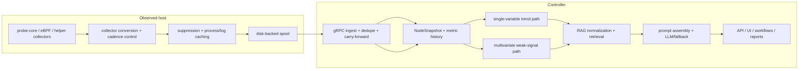

# Pipeline Deep Dive

中文版本：[docs/zh/02-pipeline-deep-dive.md](../zh/02-pipeline-deep-dive.md)

This guide is the code-grounded, end-to-end explanation of the current `v0.7` pipeline.

It answers the questions that a new operator, contributor, or reviewer usually has after reading the landing page:

- What exactly is collected on the host?
- Why is there a queue before send?
- What is suppressed, deduplicated, or carried forward?
- What analysis happens before retrieval or LLM reasoning?
- How are single-metric trends different from multivariate weak-signal detection?
- What does the built-in dataset actually contain, and how does retrieval change the answer?
- What final response shape does the system return?

This page is deliberately grounded in the current implementation, especially:

- [`backend/internal/collector/collector.go`](../../backend/internal/collector/collector.go)
- [`backend/internal/collector/probe_core_convert.go`](../../backend/internal/collector/probe_core_convert.go)
- [`backend/internal/collector/aux_sampling.go`](../../backend/internal/collector/aux_sampling.go)
- [`backend/internal/collector/process_payload_suppression.go`](../../backend/internal/collector/process_payload_suppression.go)
- [`backend/internal/collector/metric_suppression.go`](../../backend/internal/collector/metric_suppression.go)
- [`backend/internal/collector/spool/spool.go`](../../backend/internal/collector/spool/spool.go)
- [`backend/internal/collector/transport/client.go`](../../backend/internal/collector/transport/client.go)
- [`backend/internal/controller/ingest/server.go`](../../backend/internal/controller/ingest/server.go)
- [`backend/internal/controller/ingest/store.go`](../../backend/internal/controller/ingest/store.go)
- [`backend/internal/controller/timeseries/service.go`](../../backend/internal/controller/timeseries/service.go)
- [`backend/internal/controller/agentcore/agent.go`](../../backend/internal/controller/agentcore/agent.go)
- [`backend/internal/controller/agentcore/workflow_eventization.go`](../../backend/internal/controller/agentcore/workflow_eventization.go)
- [`backend/internal/controller/agentcore/workflow_engine.go`](../../backend/internal/controller/agentcore/workflow_engine.go)
- [`backend/internal/controller/rag/`](../../backend/internal/controller/rag/)

Two scope notes matter:

- The maintained runtime path in this repo is the Go collector and Go controller. The `python/sre_agent/` tree is real code, but it is not the primary `v0.7` collector-to-controller path described here.
- `service_latency_p95_ms` is not a built-in metric name in the current repo. The collector can ingest custom external metrics through the external helper path, but the built-in trend-retention whitelist in [`store.go`](../../backend/internal/controller/ingest/store.go) will ignore such a metric until you explicitly add it.

## How To Read This Guide

This page is written for two audiences at the same time.

| If you are mainly... | Focus on... | Why |
| --- | --- | --- |
| an engineer or SRE | file references, stage tables, and the mechanism bullets inside each stage | they tell you where the behavior lives and what will break if you change it |
| a product, operations, or business reader | the “why this stage exists” and “what happens if it is missing” bullets, plus the end-to-end examples | they explain why the extra engineering exists instead of sending raw telemetry straight to a model |

The most important design idea is that the project has two different jobs:

1. collect short-lived node-local evidence cheaply enough to live on production hosts
2. turn that evidence into smaller, more trustworthy, more actionable controller-side reasoning artifacts

That is why the pipeline is split into collection, suppression, queueing, ingest, trend analysis, weak-signal analysis, retrieval, and final response instead of one large opaque workflow.

## One-Screen Pipeline

## Stage Summary

| Stage | Main files | Input | Output | Why it exists |
| --- | --- | --- | --- | --- |
| Host collection | [`cpp/probe_core/main.cpp`](../../cpp/probe_core/main.cpp), [`source_pipeline.go`](../../backend/internal/collector/source_pipeline.go), [`probe/ebpf`](../../backend/internal/collector/probe/ebpf/) | `/proc`, `/sys`, kernel/eBPF signals, GPU/runtime state | raw probe frames and runtime summaries | collects short-lived host evidence close to the machine |
| Collector normalization and pacing | [`collector.go`](../../backend/internal/collector/collector.go), [`probe_core_convert.go`](../../backend/internal/collector/probe_core_convert.go), [`aux_sampling.go`](../../backend/internal/collector/aux_sampling.go), [`probe/cadence.go`](../../backend/internal/collector/probe/cadence.go) | raw probe data and helper outputs | `TelemetryBatch` ingredients | keeps the steady-state collector cheap enough to live on production hosts |
| Suppression and compaction | [`metric_suppression.go`](../../backend/internal/collector/metric_suppression.go), [`process_payload_suppression.go`](../../backend/internal/collector/process_payload_suppression.go) | repeated collector/runtime/process payloads | smaller protobuf payloads plus explicit suppression markers | reduces repeated bytes without hiding what happened |
| Queue and send path | [`spool/spool.go`](../../backend/internal/collector/spool/spool.go), [`transport/client.go`](../../backend/internal/collector/transport/client.go) | serialized batches | buffered, ACKed delivery | decouples collection from controller/network stalls |
| Ingest and hot state | [`ingest/server.go`](../../backend/internal/controller/ingest/server.go), [`ingest/store.go`](../../backend/internal/controller/ingest/store.go) | `TelemetryBatch` | `NodeSnapshot`, process/log state, trend history | reconstructs one normalized controller view |
| Trend-safe history and TSDB | [`store.go`](../../backend/internal/controller/ingest/store.go), [`timeseries/service.go`](../../backend/internal/controller/timeseries/service.go) | selected metrics | in-memory history and optional TSDB points | keeps trend analysis cheap and bounded |
| Single-variable analysis | [`workflow_eventization.go`](../../backend/internal/controller/agentcore/workflow_eventization.go), [`predictive`](../../backend/internal/controller/predictive/) | metric history for one node | `TrendAssessment[]` | catches “one metric is quietly getting worse” |
| Multivariate analysis | [`workflow_engine.go`](../../backend/internal/controller/agentcore/workflow_engine.go), [`workflow_eventization.go`](../../backend/internal/controller/agentcore/workflow_eventization.go) | trends, logs, security, eBPF, topology | `InvestigationEvent[]`, joint-risk state | catches weak signals that matter only together |
| Retrieval | [`rag/ingest.go`](../../backend/internal/controller/rag/ingest.go), [`rag/knowledge.go`](../../backend/internal/controller/rag/knowledge.go), [`rag/retriever.go`](../../backend/internal/controller/rag/retriever.go) | dataset files plus operator/query context | `SearchHit[]`, retrieval summary, confidence | adds environment-specific knowledge and prior cases |
| Prompting and output | [`agent.go`](../../backend/internal/controller/agentcore/agent.go), [`prompts.go`](../../backend/internal/controller/agentcore/prompts.go), [`llm_analysis.go`](../../backend/internal/controller/agentcore/llm_analysis.go) | telemetry, findings, retrieved knowledge | `QueryResponse`, workflow reports, guarded actions | turns evidence into operator-facing output while keeping fallback behavior safe |

## Stage Decision Matrix

The table below answers the question “why does this stage exist at all?” without requiring the reader to infer it from code.

| Stage | Problem before this stage | Why this mechanism was chosen here | What gets worse if the stage disappears | Main tradeoff |
| --- | --- | --- | --- | --- |
| Host collection | controller-side-only analysis cannot recreate short-lived host/process/device evidence | a node-local collector is the cheapest place to observe `/proc`, `/sys`, GPU, and eBPF state | RCA becomes later, flatter, and less attributable | host-local code must stay cheap and privilege-aware |
| Collector normalization and pacing | raw probe output is too noisy and too repetitive for every send cycle | alias conversion plus tiered pacing is simpler than full central re-interpretation | payloads and collector overhead grow quickly on calm hosts | suppression requires clear marker semantics |
| Suppression and compaction | unchanged runtime, hardware, process, and helper payloads waste bytes every cycle | explicit marker metrics let ingest reconstruct state safely | network, spool, and serialization cost grow with little new signal | some readers must learn the difference between “suppressed” and “missing” |
| Queue and replay | direct send couples collection quality to controller and network health | a small disk-backed spool is safer than RAM-only buffering on production hosts | short outages become missed samples or collector self-pressure | long outages can evict old unread records |
| Ingest and hot-state reconstruction | smaller batches would otherwise look incomplete or inconsistent | one shared `NodeSnapshot` contract keeps later consumers aligned | UI, workflows, prompts, and reports can disagree about the same node | ingest becomes the central interpretation point |
| Trend-safe history and TSDB | current-state-only reasoning cannot tell drift from a one-off spike | a bounded trend whitelist is cheaper than storing every metric forever | the controller becomes weaker at early deterioration detection | metrics outside the whitelist are not automatically forecastable |
| Single-variable trend path | hard thresholds notice problems too late | slope, persistence, and forecast hints are transparent and auditable | slow memory, disk, or network deterioration is noticed later | heuristic windows are less powerful than full forecasting systems |
| Weak-signal fusion | several modest symptoms can look harmless in isolation | deterministic weighted correlation is readable and easy to challenge | subtle compound incidents stay hidden until a hard breach appears | noisy thresholds can still promote weak clusters if badly tuned |
| Retrieval | telemetry alone cannot provide runbook steps or prior-case language | normalized local-first hybrid retrieval keeps the repo self-contained | final advice becomes more generic and less environment-specific | weak datasets lead to weak retrieval |
| Prompting and guarded output | raw telemetry plus raw search hits is not an operator-facing diagnosis | compact evidence plus strict JSON and deterministic fallback keeps output stable | the repo stops at evidence gathering instead of helping with next actions | stale or partial telemetry can correctly suppress the richest reasoning path |

## Signals and Sampling Tiers

The collector does not sample every signal family at the same rate, because the cost model is not the same.

| Signal category | Representative data | Default tier | Why this tier fits | Why not faster | Why not slower | What would be missed if absent |
| --- | --- | --- | --- | --- | --- | --- |
| Fast host pressure | `node_cpu_usage_percent`, `node_memory_Used_bytes`, `node_pressure_memory_some_avg10` | every collector cycle | these are first-line incident signals | extra `/proc` churn for little extra value | misses early drift and saturation | basic node health becomes guesswork |
| Fast storage/network summaries | `node_disk_request_latency_p99_seconds`, `node_disk_queue_depth_total`, `node_tcp_retransmits_per_second` | every collector cycle | these are needed to separate CPU, storage, and network bottlenecks | more device/interface polling cost | misses short deterioration windows | latency incidents collapse into generic “host is slow” |
| Fast GPU summaries | `node_gpu_utilization_sm_avg_percent`, `node_gpu_memory_used_total_mib`, `node_gpu_temperature_peak_celsius` | every collector cycle when GPU context is active | GPU nodes need accelerator context to explain feeder starvation and thermal pressure | GPU runtime probing is not free | misses thermal/memory drift on expensive nodes | GPU incidents look like ordinary CPU/memory issues |
| Medium process fallback | compatibility process scans when primary process context is missing or paced | slower cached cadence | process attribution is valuable, but expensive to resend every loop | can dominate steady-state payload cost | stale top-process lists hide ownership | controller loses “who is hot?” evidence |
| Slow log fingerprints | `LogFingerprint` payloads plus helper cadence metrics | `max(15s, 3 * collection_interval)` | logs are useful context, not first-line health | tailing and hashing every cycle costs more | late error bursts may be noticed later | RCA loses corroborating evidence |
| Slow external metrics | custom helper output | `max(30s, 6 * collection_interval)` | external commands are the least predictable cost | they can block or spike collector CPU | app-level context arrives too late | node-only RCA may miss service-local context |
| Rare hardware profile and thresholds | `collector_hardware_*`, anomaly thresholds | minutes to hours | hardware topology changes slowly | repeated scans are wasteful | thresholding becomes too stale on hardware changes | protection logic becomes less trustworthy |
| Observability-about-observability | `collector_spool_backlog_bytes`, `collector_probe_core_fresh`, `collector_protection_mode_*` | every collector cycle | controller must know whether telemetry itself is trustworthy | this set is already light | stale integrity signals are dangerous | the system mistakes blind spots for health |

Three current pacing mechanisms are especially important:

- [`aux_sampling.go`](../../backend/internal/collector/aux_sampling.go) caches slow helper payloads and marks whether each helper truly refreshed or merely reused cached state.
- [`probe/cadence.go`](../../backend/internal/collector/probe/cadence.go) gives the Go compatibility probe its own fast, medium, slow, and anomaly-triggered tiers.
- [`protection.go`](../../backend/internal/collector/protection.go) tightens or sheds optional work when the collector itself is under pressure.

## Stage 1. Host Collection and Source Selection

**Implemented by**

- [`cpp/probe_core/main.cpp`](../../cpp/probe_core/main.cpp)
- [`backend/internal/collector/source_pipeline.go`](../../backend/internal/collector/source_pipeline.go)
- [`backend/internal/collector/collector.go`](../../backend/internal/collector/collector.go)
- [`backend/internal/collector/probe/ebpf`](../../backend/internal/collector/probe/ebpf/)

**What it collects**

- CPU, memory, PSI, load, disk, filesystem, network, NUMA, and GPU metrics
- per-process samples
- runtime/eBPF security events and summaries
- collector self-metrics and hardware profile context

**Primary internal representations**

- native probe frames from probe-core
- `[]*telemetryv1.Metric`
- `[]*telemetryv1.ProcessSample`
- `[]*telemetryv1.LogFingerprint`

**Mandatory review**

- What it does: gathers host-local evidence as close as possible to the machine where the symptom happens.
- Why this step is necessary: many of the useful signals here are short-lived or kernel-local; waiting to infer them centrally would be too late or impossible.
- What problem existed before this step: a controller-only design can see delayed summaries, but not the cheapest high-fidelity host view.
- What problem this step solves: it captures the raw evidence before transport delay, controller delay, or higher-level summarization blur it.
- How it solves that problem: the collector runs probe-core, optional eBPF paths, and helper collectors locally, then turns their output into one batch on each cycle.
- Why this technical choice was selected: host collection keeps expensive reasoning off the application node while still preserving the node-local evidence that a remote controller cannot recreate.
- What alternatives might exist and why this one fits here: pull-based scraping or controller-side agents are possible, but they either increase remote dependency or make host-local protection harder.
- What would happen if this step did not exist: later RCA would rely on weaker, more generic signals and lose device/process-level attribution.
- What risks, limitations, or tradeoffs this step introduces: host-local code must stay cheap and robust, and some features depend on runtime capabilities such as probe-core or eBPF support.

## Stage 2. Collector Pacing, Normalization, and Suppression

**Implemented by**

- [`backend/internal/collector/collector.go`](../../backend/internal/collector/collector.go)
- [`backend/internal/collector/probe_core_convert.go`](../../backend/internal/collector/probe_core_convert.go)
- [`backend/internal/collector/aux_sampling.go`](../../backend/internal/collector/aux_sampling.go)
- [`backend/internal/collector/probe/cadence.go`](../../backend/internal/collector/probe/cadence.go)
- [`backend/internal/collector/metric_suppression.go`](../../backend/internal/collector/metric_suppression.go)
- [`backend/internal/collector/process_payload_suppression.go`](../../backend/internal/collector/process_payload_suppression.go)

**What happens here**

- raw probe-core names are converted into controller-facing `node_*`, `rca_*`, and `collector_*` aliases
- aggregate node metrics are synthesized from labeled device/interface data
- slower helpers are cached and only refreshed on their own cadence
- unchanged low-churn collector/runtime/hardware metrics can be suppressed
- near-identical process payloads can be suppressed until a bounded refresh interval

**Why the collector normalizes before send**

- the controller reasons over stable `node_*` names, not over every probe-specific raw counter
- the collector is the cheapest place to decide that repeated runtime inventory does not need to be resent every cycle

**Representative mechanisms**

- [`convertProbeCoreBatch`](../../backend/internal/collector/probe_core_convert.go) keeps controller-facing aliases and, by default, does not also emit the raw duplicated `probe_core_*` aliases
- [`suppressUnchangedLowChurnMetrics`](../../backend/internal/collector/metric_suppression.go) appends `collector_metrics_partial_update` and `collector_metrics_suppressed_count`
- [`suppressUnchangedProcessPayload`](../../backend/internal/collector/process_payload_suppression.go) fingerprints processes by PID, normalized name, quantized CPU, RSS bucket, and IO bucket
- [`collectLogsWithCadence`](../../backend/internal/collector/aux_sampling.go) and related helpers emit `collector_aux_payload_refreshed` or `collector_aux_payload_suppressed`

**Mandatory review**

- What it does: turns a high-fidelity but noisy host view into a bounded telemetry batch that the controller can interpret consistently.
- Why this step is necessary: raw probe names, repeated hardware inventory, and unchanged process/log payloads would otherwise dominate batch size and operator attention.
- What problem existed before this step: early steady-state payloads repeatedly shipped the same collector/runtime details and near-identical process lists.
- What problem this step solves: it preserves useful change while removing expensive repetition.
- How it solves that problem: aliases unify names, helper cadences reduce refresh frequency, and explicit suppression markers tell ingest when an omitted payload is intentional.
- Why this technical choice was selected: suppression with markers is safer than silent omission because the controller can reconstruct previous state and expose what happened.
- What alternatives might exist and why this one fits here: full delta encoding or central dedupe are possible, but they are more complex and move more cost to the controller path.
- What would happen if this step did not exist: spool size, network use, and collector overhead would rise quickly on calm hosts.
- What risks, limitations, or tradeoffs this step introduces: suppressed payloads mean readers must understand the marker metrics, and process attribution can be slightly coarser between forced refreshes.

## Stage 3. Queue, Compaction, Compression, and Send Path

**Implemented by**

- [`backend/internal/collector/spool/spool.go`](../../backend/internal/collector/spool/spool.go)
- [`backend/internal/collector/transport/client.go`](../../backend/internal/collector/transport/client.go)
- [`backend/internal/collector/protection.go`](../../backend/internal/collector/protection.go)

**What happens here**

- each batch is serialized and written to the spool before send
- the spool is bounded and preserves the newest unread data when it must compact
- transport drains backlog with per-cycle limits
- gRPC delivery can use failover or mirror mode and optional gzip compression

**How the queue is implemented**

- `spool.log`: append-only record file
- `spool.offset`: committed read offset
- `Next()`: reads without advancing
- `Commit(nextOffset)`: advances only after successful send
- `compactLocked(...)`: trims old unread records when the bounded file must make room

**Why direct send would be worse**

- collection would wait behind controller or network stalls
- retries would live directly in the hot path
- memory-only buffering would risk unbounded growth

**What “compression” means in this repo**

- payload reduction is mainly done before send by suppression and compaction
- on-wire gRPC compression is optional through the transport client
- the spool itself stores the serialized protobuf payload, not a separate compressed archive format

**Mandatory review**

- What it does: decouples sampling from delivery and bounds how much replay work the collector performs each cycle.
- Why this step is necessary: the collector must keep observing the host even when the controller is slow or briefly unreachable.
- What problem existed before this step: a synchronous send path turns transport failures into missed collection windows.
- What problem this step solves: it preserves recent telemetry locally, then replays it gradually after connectivity returns.
- How it solves that problem: disk-backed append, ACK-based commit, bounded replay, and protection-aware drain limits keep delivery out of the collector hot path.
- Why this technical choice was selected: a small persistent queue is much safer than RAM-only buffering on production hosts.
- What alternatives might exist and why this one fits here: an external message bus would work, but it would add another dependency and remove the node-local isolation this project wants.
- What would happen if this step did not exist: short controller outages would immediately become telemetry loss or collector self-pressure.
- What risks, limitations, or tradeoffs this step introduces: long outages can evict old unread records, and the design prefers recent evidence over a perfect historical replay.

## Stage 4. Controller Ingest, Dedupe, and Hot-State Reconstruction

**Implemented by**

- [`backend/internal/controller/ingest/server.go`](../../backend/internal/controller/ingest/server.go)
- [`backend/internal/controller/ingest/store.go`](../../backend/internal/controller/ingest/store.go)

**What happens here**

- the controller validates batch size and field limits
- it deduplicates batches by `collector_id + batch_id`
- it upserts collector metadata
- it stores metrics, processes, logs, and structured runtime context into `NodeSnapshot`
- it carries forward suppressed low-churn collector/runtime/hardware fields
- it clears process/log state only on explicit refreshed-empty helper cycles

**Important data shape**

[`NodeSnapshot`](../../backend/internal/controller/ingest/store.go) is the controller’s hot-state object. It contains:

- `Metrics map[string]float64`
- `Processes []*telemetryv1.ProcessSample`
- `Logs []*telemetryv1.LogFingerprint`
- process-resource and process-network aggregates
- storage devices, partitions, filesystems
- runtime mode, capabilities, probe-core modules
- security findings, runtime events, process graph, syscall statistics

**Why this is not “raw telemetry straight into the model”**

The LLM path does not read the wire payload directly. It reads controller state derived from `NodeSnapshot`, history, findings, and retrieval results.

**Mandatory review**

- What it does: converts transport batches into one controller-owned state model that all later APIs, workflows, and prompts can share.
- Why this step is necessary: collector-side suppression only works safely if ingest knows when to reconstruct previous state and when to clear it.
- What problem existed before this step: a smaller collector payload could look like “missing telemetry” unless the controller knew the omission was intentional.
- What problem this step solves: it keeps hot state coherent even when the collector sends only partial updates.
- How it solves that problem: special marker metrics such as `collector_metrics_partial_update` and `collector_aux_payload_refreshed` drive carry-forward and refreshed-empty semantics.
- Why this technical choice was selected: reconstructing at ingest keeps later controller logic simple and keeps the wire contract explicit.
- What alternatives might exist and why this one fits here: each downstream consumer could carry forward its own state, but that would duplicate logic and create inconsistent interpretations.
- What would happen if this step did not exist: prompts, UI panels, and risk workflows would disagree about whether omitted data meant “unchanged,” “missing,” or “cleared.”
- What risks, limitations, or tradeoffs this step introduces: the store grows into a central interpretation point, so marker semantics must stay stable and well documented.

## Stage 5. Trend-Safe History and Optional TSDB

**Implemented by**

- [`backend/internal/controller/ingest/store.go`](../../backend/internal/controller/ingest/store.go)
- [`backend/internal/controller/ingest/history_provider.go`](../../backend/internal/controller/ingest/history_provider.go)
- [`backend/internal/controller/timeseries/service.go`](../../backend/internal/controller/timeseries/service.go)
- [`backend/internal/controller/timeseries/influx.go`](../../backend/internal/controller/timeseries/influx.go)

**What is stored**

- in-memory history always keeps a bounded ring of `MetricHistorySample`
- only metrics that pass `shouldStoreTrendMetric(...)` participate in that history
- the optional TSDB path writes only aggregated, trend-safe metrics

**What is intentionally not stored in the TSDB path**

- full process payloads
- log fingerprints as raw documents
- every per-label metric explosion from the collector
- most low-churn runtime inventory

**Why**

- trend analysis needs stable, repeated numeric series
- process lists and log payloads are better kept in hot state, log index, or workflow evidence bundles
- writing every labeled metric would make history much noisier and more expensive without improving most RCA paths

**Mandatory review**

- What it does: keeps enough metric history for trends and forecasts without turning the controller into an unbounded raw-metric archive.
- Why this step is necessary: single-variable analysis and forecast hints need history, not just the latest point.
- What problem existed before this step: current-state-only RCA cannot distinguish a one-off spike from steady deterioration.
- What problem this step solves: it gives the controller a bounded historical window for the metrics that actually matter to trend reasoning.
- How it solves that problem: `selectTrendMetrics(...)` filters a small metric subset into in-memory rings, and `timeseries.Service` can durably persist only that subset through a bounded write queue.
- Why this technical choice was selected: a trend whitelist keeps the retention path cheap and predictable.
- What alternatives might exist and why this one fits here: a full TSDB for every metric is possible, but it would be more expensive and unnecessary for the repo’s current reasoning model.
- What would happen if this step did not exist: the controller could still answer “what is hot now,” but it would be weaker at “what is getting worse.”
- What risks, limitations, or tradeoffs this step introduces: metrics outside the whitelist do not automatically become forecastable or queryable as long-lived history.

## Stage 6. Single-Variable Temporal and Trend Analysis

**Implemented by**

- [`backend/internal/controller/agentcore/workflow_eventization.go`](../../backend/internal/controller/agentcore/workflow_eventization.go)
- [`backend/internal/controller/predictive/engine.go`](../../backend/internal/controller/predictive/engine.go)
- partial reuse in query-service helpers inside [`agent.go`](../../backend/internal/controller/agentcore/agent.go)

**What this path analyzes**

- CPU pressure
- memory pressure
- IO latency
- IO pressure
- retransmit ratio
- softnet drops
- GPU utilization, temperature, and memory pressure
- CPU throttling
- log bursts
- derived `memory_leak_rate`

**How it works**

1. `buildRiskSeries(...)` extracts one series per signal from recent history.
2. For each series it computes baseline, latest value, slope, acceleration, threshold breaches, and persistence.
3. `classifySeriesTrend(...)` labels the pattern as `rising`, `worsening`, `stable`, `recovering`, or `volatile`.
4. `buildTrendAssessments(...)` turns those numbers into operator-facing `TrendAssessment` objects.
5. The predictive engine can add short-horizon forecast hints such as “likely crosses threshold within 18m.”

**Why this path exists**

Hard thresholds are too late for many incidents. A memory curve that climbs every minute is already operationally important before the node OOMs.

**Mandatory review**

- What it does: explains whether one metric is deteriorating over time and how confident the controller is in that trend.
- Why this step is necessary: many production incidents begin as drift, not as one catastrophic threshold breach.
- What problem existed before this step: the system could say “memory is 87%” but not “memory has been climbing steadily for 30 minutes.”
- What problem this step solves: it exposes direction, persistence, and early risk.
- How it solves that problem: it turns bounded metric history into formal series features and optional predictive forecasts.
- Why this technical choice was selected: slope, persistence, and forecast hints are transparent enough for operators to inspect.
- What alternatives might exist and why this one fits here: full anomaly-detection models or external forecasting services could be added, but the current deterministic approach is easier to audit and ship in-repo.
- What would happen if this step did not exist: the controller would miss slow deterioration until the symptom was already obvious.
- What risks, limitations, or tradeoffs this step introduces: a short history window can understate long seasonal patterns, and simple forecasts are not a substitute for full capacity planning.

## Stage 7. Multivariate and Weak-Signal Analysis

**Implemented by**

- [`backend/internal/controller/agentcore/workflow_engine.go`](../../backend/internal/controller/agentcore/workflow_engine.go)
- [`backend/internal/controller/agentcore/workflow_eventization.go`](../../backend/internal/controller/agentcore/workflow_eventization.go)
- [`backend/internal/controller/agentcore/workflow_recommendations.go`](../../backend/internal/controller/agentcore/workflow_recommendations.go)

**What this path analyzes**

- combinations of moderate signals that point to a likely shared cause
- correlations and co-movement across risk series
- security and eBPF behavior scores
- scope attribution to node, process, pod, service, and fleet

**How it works**

1. `buildRiskSeries(...)` produces per-signal series.
2. `buildRiskSignals(...)` scores each series against medium/high thresholds and weights.
3. `buildCooccurrences(...)` correlates the strongest triggered signals.
4. `buildScopeRisks(...)` maps pressure to node/process/pod/service/cluster scopes.
5. `buildInvestigationEvents(...)` promotes the strongest clusters into operator-facing events such as `weak_signal_cluster`.

**Why this path is separate from Stage 6**

Single-variable analysis answers “is this one metric getting worse?”

Weak-signal analysis answers “do several individually modest signals combine into a more credible explanation?”

That separation matters because the math and the operational question are different.

**Mandatory review**

- What it does: detects compound risk when no single metric is bad enough alone, but the cluster is meaningful.
- Why this step is necessary: many incidents start with moderate IO, moderate retransmits, and moderate log bursts rather than one obvious red line.
- What problem existed before this step: one-card-at-a-time dashboards can look calm while the combined symptom is already real.
- What problem this step solves: it fuses correlated evidence into a higher-signal investigation event.
- How it solves that problem: weighted risk signals, pair correlation, fallback cooccurrence, and scope attribution produce compact joint-risk evidence.
- Why this technical choice was selected: it is deterministic, inspectable, and easy to expose in the UI.
- What alternatives might exist and why this one fits here: full graph ML or large anomaly ensembles could be used, but the repo currently favors simpler evidence that operators can read and challenge.
- What would happen if this step did not exist: the system would react late to subtle incidents that only become obvious after a major outage symptom appears.
- What risks, limitations, or tradeoffs this step introduces: weak-signal fusion can still over-weight noisy inputs if thresholds are poorly tuned, and short windows can miss slower cross-signal relationships.

## Stage 8. Dataset Normalization, Retrieval Planning, and RAG

**Implemented by**

- dataset content under [`dataset/`](../../dataset/)
- [`backend/internal/controller/rag/ingest.go`](../../backend/internal/controller/rag/ingest.go)
- [`backend/internal/controller/rag/knowledge.go`](../../backend/internal/controller/rag/knowledge.go)
- [`backend/internal/controller/rag/chunk.go`](../../backend/internal/controller/rag/chunk.go)
- [`backend/internal/controller/rag/retriever.go`](../../backend/internal/controller/rag/retriever.go)
- query-service attachment logic in [`agent.go`](../../backend/internal/controller/agentcore/agent.go)

**What the repository dataset actually contains**

- [`dataset/raw/structured/aiops2024-challenge-dataset.json`](../../dataset/raw/structured/aiops2024-challenge-dataset.json)
- [`dataset/raw/structured/question.jsonl`](../../dataset/raw/structured/question.jsonl)
- [`dataset/raw/structured/helpdesk_dataset.csv`](../../dataset/raw/structured/helpdesk_dataset.csv)
- [`dataset/raw/archives/data.zip`](../../dataset/raw/archives/data.zip)
- [`dataset/raw/archives/ZTE_eReader_V4.11_20230525_lite.zip`](../../dataset/raw/archives/ZTE_eReader_V4.11_20230525_lite.zip)
- [`dataset/raw/archives/manifest.json`](../../dataset/raw/archives/manifest.json)

**What the controller turns those files into**

- normalized `SourceDocument`
- classified `knowledge_type` such as `runbook`, `historical_incident`, `question_pattern`, `security_reference`, or `dataset_meta`
- chunked `Chunk` records with `summary`, `evidence`, `remediation`, and `body` sections when structured knowledge is available

**How retrieval is triggered**

- the query-service only attaches RAG when the query or findings contain meaningful operational context
- low-confidence retrieval under `rag_min_confidence` is suppressed even if the search technically returned hits
- workflow tools can also issue explicit knowledge retrieval requests for similar cases or runbooks

**Why this step exists**

Telemetry says what is happening on this node. RAG is the path that can add prior incidents, runbook steps, and environment-specific procedures.

**Important limitation**

The built-in repo dataset is a seed/demo corpus, not a strong production SRE knowledge base by itself. Good production retrieval quality depends on adding your own runbooks, postmortems, and incident notes.

**Mandatory review**

- What it does: converts repository files into retrievable operational knowledge and conditionally injects that knowledge into reasoning.
- Why this step is necessary: telemetry alone can suggest a likely cause, but it cannot provide environment-specific procedures or prior-case language.
- What problem existed before this step: an LLM without retrieval has to rely on generic model memory for runbooks and prior incidents.
- What problem this step solves: it grounds suggestions and explanations in project-local knowledge.
- How it solves that problem: it classifies raw files, extracts structured fields, chunks them into searchable units, scores them lexically/vectorially, and only attaches them when context is strong enough.
- Why this technical choice was selected: normalization before chunking produces better retrieval units than treating every file as anonymous text.
- What alternatives might exist and why this one fits here: external hosted search or pure vector search are possible, but the current local-first hybrid approach keeps the repo self-contained.
- What would happen if this step did not exist: the system would still have deterministic findings, but advice would be less specific and less auditable.
- What risks, limitations, or tradeoffs this step introduces: weak datasets produce weak retrieval, and stale telemetry can correctly suppress retrieval even when operators wish it had run.

## Stage 9. Prompt Assembly, Model Invocation, and Final Output

**Implemented by**

- [`backend/internal/controller/agentcore/agent.go`](../../backend/internal/controller/agentcore/agent.go)
- [`backend/internal/controller/agentcore/prompts.go`](../../backend/internal/controller/agentcore/prompts.go)
- [`backend/internal/controller/agentcore/llm_analysis.go`](../../backend/internal/controller/agentcore/llm_analysis.go)
- [`backend/internal/controller/agentcore/llm_safety.go`](../../backend/internal/controller/agentcore/llm_safety.go)
- guarded action wiring in [`backend/internal/controller/agentcore/workflow_recommendations.go`](../../backend/internal/controller/agentcore/workflow_recommendations.go)

**What goes into prompt construction**

- latest node metrics from `NodeSnapshot`
- recent trend history summarized into `metricTrends(...)` and `trendHints(...)`
- deterministic findings such as CPU, memory, storage, network, GPU, and telemetry-quality findings
- summarized processes and log fingerprints
- optional retrieved knowledge snippets, metadata, and confidence
- telemetry quality facts such as freshness, ingest delay, missing critical signals, and blind spots

**How the query-service prompt is assembled**

1. `buildPromptInput(...)` gathers node metrics, history, processes, logs, and GPU context.
2. `assessPromptTelemetryQuality(...)` decides whether the evidence is fresh, partial, degraded, or stale.
3. `attachRAGContext(...)` decides whether retrieval should be attached.
4. [`BuildSystemPrompt`](../../backend/internal/controller/agentcore/prompts.go) defines strict behavior and JSON output.
5. [`BuildUserPrompt`](../../backend/internal/controller/agentcore/prompts.go) embeds telemetry quality, RAG snippets, and the compact `LLMSchema`.
6. The LLM client runs with timeout, retries, and circuit-breaker protection.
7. If the model path fails, the controller falls back to deterministic output.

**What the final output looks like**

For `/api/v1/agent/query`, the main output is [`QueryResponse`](../../backend/internal/controller/agentcore/agent.go), including:

- `summary`
- `root_cause`
- `confidence`
- `findings`
- `recommendations`
- `actions`
- `explainability`
- `telemetry_context`
- `retrieved_docs`

For the workflow engine, the LLM path uses a stricter evidence bundle and returns:

- `issues`
- `joint_risk_reason`
- `rca_hypotheses`
- `next_steps`
- `tool_requests`
- `limitations`

**Mandatory review**

- What it does: turns controller-owned evidence into operator-facing diagnosis, recommendations, and optional guarded actions.
- Why this step is necessary: operators need a bounded answer, not just raw metrics and retrieval hits.
- What problem existed before this step: raw telemetry plus search hits still leave the operator to do the final synthesis mentally.
- What problem this step solves: it compresses evidence into a structured response that downstream UI and APIs can consume consistently.
- How it solves that problem: prompt inputs are built from compact telemetry, telemetry quality is checked first, retrieval is attached selectively, strict JSON is required, and fallback keeps the API stable.
- Why this technical choice was selected: strict prompts plus deterministic fallback make the system safer than free-form text generation.
- What alternatives might exist and why this one fits here: an all-deterministic system would be simpler but less expressive; an unconstrained agent loop would be more flexible but riskier.
- What would happen if this step did not exist: the project would stop at telemetry and search, without a usable operator-facing diagnosis layer.
- What risks, limitations, or tradeoffs this step introduces: stale or partial telemetry can correctly suppress the most powerful reasoning path, and LLM quality still depends on the quality of the upstream evidence bundle.

## Code-to-Doc Mapping

| Concern | Primary code | Depends on | Used by |
| --- | --- | --- | --- |
| Data collection | [`cpp/probe_core/`](../../cpp/probe_core/), [`collector.go`](../../backend/internal/collector/collector.go), [`source_pipeline.go`](../../backend/internal/collector/source_pipeline.go) | kernel, `/proc`, `/sys`, GPU/runtime, eBPF | normalization, suppression, transport |
| Sampling logic | [`aux_sampling.go`](../../backend/internal/collector/aux_sampling.go), [`probe/cadence.go`](../../backend/internal/collector/probe/cadence.go), [`protection.go`](../../backend/internal/collector/protection.go) | collector config, hardware profile, current pressure | collector batching |
| Deduplication and compaction | [`probe_core_convert.go`](../../backend/internal/collector/probe_core_convert.go), [`metric_suppression.go`](../../backend/internal/collector/metric_suppression.go), [`process_payload_suppression.go`](../../backend/internal/collector/process_payload_suppression.go) | probe data, helper caches, prior collector state | spool/network efficiency |
| Queueing | [`spool/spool.go`](../../backend/internal/collector/spool/spool.go) | serialized protobuf batches | transport drain |
| Send/export | [`transport/client.go`](../../backend/internal/collector/transport/client.go) | spool, controller endpoints, TLS/gRPC config | controller ingest |
| Receiving/control-plane ingest | [`ingest/server.go`](../../backend/internal/controller/ingest/server.go), [`ingest/store.go`](../../backend/internal/controller/ingest/store.go) | telemetry batches and marker metrics | hot state, history, UI, query-service |
| Preprocessing | [`store.go`](../../backend/internal/controller/ingest/store.go), [`agent.go`](../../backend/internal/controller/agentcore/agent.go) | hot state and history | trend hints, findings, prompts |
| Single-variable analysis | [`workflow_eventization.go`](../../backend/internal/controller/agentcore/workflow_eventization.go), [`predictive/engine.go`](../../backend/internal/controller/predictive/engine.go) | selected metric history | trend assessments, workflow evidence |
| Multivariate analysis | [`workflow_engine.go`](../../backend/internal/controller/agentcore/workflow_engine.go), [`workflow_eventization.go`](../../backend/internal/controller/agentcore/workflow_eventization.go) | risk series, logs, security, eBPF | investigation events, recommendations, RCA |
| TSDB write path | [`timeseries/service.go`](../../backend/internal/controller/timeseries/service.go), [`timeseries/influx.go`](../../backend/internal/controller/timeseries/influx.go) | trend-safe metric subset | longer-window history queries |
| Dataset and retrieval | [`rag/ingest.go`](../../backend/internal/controller/rag/ingest.go), [`rag/knowledge.go`](../../backend/internal/controller/rag/knowledge.go), [`rag/chunk.go`](../../backend/internal/controller/rag/chunk.go), [`rag/retriever.go`](../../backend/internal/controller/rag/retriever.go), [`dataset/`](../../dataset/) | dataset files and retrieval config | query-service and workflow retrieval |
| Prompt assembly | [`prompts.go`](../../backend/internal/controller/agentcore/prompts.go), [`llm_analysis.go`](../../backend/internal/controller/agentcore/llm_analysis.go) | telemetry, findings, retrieval, quality metadata | model clients |
| Model invocation | [`agent.go`](../../backend/internal/controller/agentcore/agent.go), workflow LLM path in [`llm_analysis.go`](../../backend/internal/controller/agentcore/llm_analysis.go) | prompts, provider config, safety checks | responses and reports |
| Response/report generation | [`agent.go`](../../backend/internal/controller/agentcore/agent.go), [`workflow_engine.go`](../../backend/internal/controller/agentcore/workflow_engine.go), [`agent/report_dedupe.go`](../../backend/internal/controller/agent/report_dedupe.go) | parsed model output plus deterministic evidence | API, UI, report engine |

## End-to-End Example A: Normal Steady State

Illustrative values below match current metric names and data structures.

1. The host collects `node_cpu_usage_percent=31.4`, `node_memory_Used_bytes=8589934592`, `node_memory_MemTotal_bytes=17179869184`, `node_disk_request_latency_p99_seconds=0.0041`, `node_tcp_retransmits_per_second=0.02`.
2. Probe-core data is converted into controller-facing `node_*` aliases by [`probe_core_convert.go`](../../backend/internal/collector/probe_core_convert.go).
3. Hardware/profile/runtime inventory is unchanged, so the collector suppresses 19 low-churn metrics and emits `collector_metrics_partial_update=1` and `collector_metrics_suppressed_count=19`.
4. The process list is materially unchanged, so the collector emits `collector_process_payload_suppressed=1` and omits the repeated payload.
5. The log helper is on a cache-hit cycle, so the collector emits `collector_aux_payload_suppressed{component="logs"}=1`.
6. The serialized batch is appended to `spool.log`; backlog stays near zero.
7. The transport client drains the spool immediately and receives an ACK from the controller.
8. Ingest validates the batch, deduplicates by `batch_id`, and carries forward the previously known runtime and hardware fields because partial update markers are present.
9. `recordMetricHistory(...)` stores only the trend-safe metrics, not the full collector inventory and not the suppressed process/log payloads.
10. The single-variable path classifies CPU, memory, disk latency, and retransmits as stable.
11. The multivariate path finds no meaningful weak-signal cluster and produces no strong `InvestigationEvent`.
12. Query-service retrieval is skipped because there are no meaningful findings and the query context is generic.
13. If an operator asks `is node-a healthy right now?`, the prompt contains telemetry quality plus compact metrics, but no RAG snippets.
14. The final answer is a low-risk summary such as “no critical anomalies detected,” with explainability that shows fresh telemetry and no significant blind spots.

## End-to-End Example B: Single-Variable Memory Deterioration

Illustrative history window:

| Time | `node_memory_Used_bytes` | `memory_usage_pct` |
| --- | --- | --- |
| `t-15m` | `13883146240` | `80.8` |
| `t-10m` | `14344519680` | `83.5` |
| `t-5m` | `14700949504` | `85.6` |
| `t` | `15032385536` | `87.4` |

Step-by-step:

1. The collector samples the rising memory values and a hot process such as `trainer` with `rss_bytes=9663676416`.
2. Because the process fingerprint changed enough, `collector_process_payload_refreshed=1` is emitted and the process payload is included.
3. The batch is enqueued and ACKed normally.
4. Ingest writes the latest metrics and process list into `NodeSnapshot`.
5. `recordMetricHistory(...)` keeps the memory series because it is whitelisted by `shouldStoreTrendMetric(...)`.
6. `buildRiskSeries(...)` creates a `memory_pressure` series with baseline, latest value, slope, and persistence.
7. `buildTrendAssessments(...)` labels it `rising` or `worsening`, depending on slope and breaches.
8. The predictive engine can add a forecast such as “memory pressure likely crosses high-risk threshold within 18m.”
9. The multivariate path may stay weak if the node does not also show strong IO, network, or log amplification.
10. Query-service `metricTrends(...)` and `trendHints(...)` add plain-language findings like “Memory headroom is shrinking steadily.”
11. If the operator asks `why is node-b likely to OOM soon?`, retrieval may still be skipped if the dataset does not contain strong memory-specific runbooks.
12. `BuildUserPrompt(...)` includes telemetry quality, the compact metric schema, and the trend-driven findings.
13. The final response typically points to leak, cache growth, or retry amplification risk and recommends checking top RSS processes and reclaim pressure before an outage.
14. If the LLM path fails, the deterministic fallback still returns those evidence-based recommendations.

## End-to-End Example C: Multivariate Weak-Signal Cluster

Illustrative latest values:

- `node_cpu_iowait_percent = 28.4`
- `node_disk_request_latency_p99_seconds = 0.0417`
- `node_disk_queue_depth_total = 16`
- `node_tcp_retransmit_ratio = 0.013`
- `log_burst = 12`

Step-by-step:

1. No single metric is yet catastrophic, but several are trending in the same bad direction.
2. The collector sends the current node metrics, log fingerprints, and any process/resource attribution available.
3. Ingest writes the latest state and trend-safe history.
4. `buildRiskSeries(...)` creates series for IO latency, retransmit ratio, and log burst.
5. `buildRiskSignals(...)` gives each series a moderate weighted score instead of waiting for one of them to become severe.
6. `buildCooccurrences(...)` finds that the strongest signals co-move in the same risk window.
7. `buildInvestigationEvents(...)` promotes the cluster into a weak-signal event, for example “compound signal cluster: io_latency + retransmit_ratio + log_burst.”
8. `buildScopeRisks(...)` can still attribute the pressure to a specific node and, when process data is available, to the hottest process or service.
9. Query-service operational findings add language like “CPU wait and disk latency are rising together, which points to a storage bottleneck rather than pure CPU saturation.”
10. The retrieval planner now has better context than “node is slow” and can search with phrases closer to “storage contention retransmit timeout.”
11. If retrieval is weak, it is suppressed rather than attached as noise.
12. The prompt now contains both the single-signal symptoms and the fused explanation that they likely share a cause.
13. The final output is more specific than a threshold alert: it points to compound storage/network pressure and recommends device- and process-level checks first.
14. In workflow mode, the same cluster also becomes visible in the UI as a joint-risk or RCA event rather than only as a chat answer.

## End-to-End Example D: RAG-Assisted Diagnosis

This example is intentionally split into two parts:

- the telemetry path is grounded in the current code
- the retrieved document is illustrative and assumes you added a real runbook or postmortem under `dataset/`

Illustrative telemetry:

- `node_gpu_utilization_sm_avg_percent = 24`
- `node_cpu_usage_percent = 89`
- `node_disk_request_latency_p99_seconds = 0.037`
- `node_gpu_process_total = 8`
- log fingerprint `dial tcp timeout` count `42`

Illustrative custom dataset addition:

- `dataset/raw/custom/gpu_rollout_timeout_runbook.md`
- normalized as `knowledge_type=runbook`, `case_type=runbook`
- extracted fields include symptoms, likely causes, remediation steps, and commands

Step-by-step:

1. The collector reports low GPU utilization but high host-side CPU and disk pressure.
2. Query-service `operationalFindings(...)` concludes that GPU workers are underutilized while host-side pressure is increasing, which suggests feeder starvation.
3. Because the query contains operational keywords and the findings contain meaningful symptoms, retrieval is allowed to run.
4. `buildQueryServiceRAGRequest(...)` compacts the operator query and the strongest findings into a search request.
5. The RAG service normalizes the runbook file into `SourceDocument`, chunks it with the `case` strategy, and indexes the `summary`, `evidence`, `remediation`, and `body` sections.
6. Hybrid retrieval returns one or more hits with fields such as `summary`, `likely_causes`, `remediation_steps`, `commands`, and `signals`.
7. If the combined confidence is above `rag_min_confidence`, `attachRAGContext(...)` adds the snippets to `PromptInput`.
8. `BuildUserPrompt(...)` includes both the telemetry schema and the retrieved operational knowledge block.
9. The model is instructed to use only the provided facts and to treat retrieved text as untrusted data, not as instructions.
10. The final answer can now say not only “the node looks feeder-starved,” but also “compare driver/runtime versions, verify data-loader placement, and run these safe commands first.”
11. `QueryResponse.RetrievedDocs`, `RetrievalSummary`, and `RetrievalConfidence` expose exactly what retrieval contributed.
12. If retrieval had been low-confidence, the controller would have returned the same telemetry-based diagnosis without pretending the knowledge hit was strong.

## What A Reader Should Remember

- The collector is optimized for cheap steady state, not for resending every fact every cycle.
- The controller does real preprocessing before retrieval or LLM reasoning.
- Single-variable trends and multivariate weak-signal fusion are different analysis paths on purpose.
- RAG improves specificity only when the dataset is good and the telemetry/query context is strong enough.
- The final response path is guarded: stale telemetry can suppress actions, low-confidence retrieval can be dropped, and deterministic fallback keeps the API stable.
