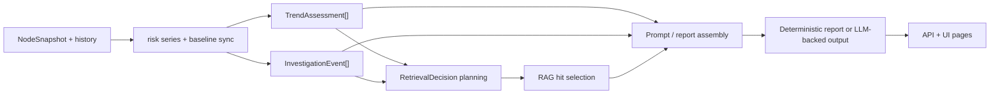

# Architecture

中文版本：[docs/zh/04-architecture.md](../zh/04-architecture.md)

## Runtime Roles

| Role | Main responsibility | Key files |
| --- | --- | --- |
| `collector` | host-local telemetry collection, batching, spool, push to controller | [`backend/cmd/collector`](../../backend/cmd/collector), [`configs/collector.yaml`](../../configs/collector.yaml) |
| `controller` | ingest, storage, HTTP API, UI, RAG, workflows | [`backend/cmd/controller`](../../backend/cmd/controller), [`configs/controller.yaml`](../../configs/controller.yaml) |

## Data Plane And Control Plane

| Plane | Components | Why it is separate |
| --- | --- | --- |
| data plane | collector, probe-core, eBPF, local spool | keep host access, retry, and backpressure local to each node |
| control plane | controller ingest, APIs, UI, workflows, RAG, optional TSDB | centralize storage and heavier RCA work away from the workload node |

This split is now reflected directly in deployment-aware code:

- [`../../backend/internal/collector/deployment.go`](../../backend/internal/collector/deployment.go)
- [`../../backend/internal/controller/deployment.go`](../../backend/internal/controller/deployment.go)

## Deployment Modes

| Mode | Expected topology | What changes automatically |
| --- | --- | --- |
| `local-dev` | source checkout or one local stack | repo-relative defaults stay intact |
| `standalone` | one controller service plus external collectors | default-like paths move under `/var/lib/ai-sre-agent/...` |
| `cluster-lite` | one controller `Deployment` plus collector `DaemonSet` | cluster-friendly paths and ready probes become the default packaging shape |
| `distributed` | replicated controller plus HA and optional external vector backend | same path rewrite, but shared backend assumptions become important |

## Telemetry Path

The maintained collector path is:

- primary host/process telemetry from native probe-core in [`cpp/probe_core/`](../../cpp/probe_core/)
- primary kernel/runtime events from the eBPF runtime configured under `ebpf` in [`configs/collector.yaml`](../../configs/collector.yaml)
- compatibility fallback through `/proc` and sysfs when the primary host path is unavailable
- local spool and replay before gRPC delivery to the controller

The controller receives telemetry over gRPC, normalizes it, and fans it out into:

- hot in-memory state
- embedded persistence for ingest history
- optional controller-side TSDB
- log, GPU, security, and RAG services
- agent and RCA workflows

## Control-Plane Investigation Stages

The control plane is now easier to read as a sequence of explicit stages instead of one opaque “AI analysis” block.

Main implementation files:

- [`backend/internal/controller/agentcore/workflow_eventization.go`](../../backend/internal/controller/agentcore/workflow_eventization.go)
- [`backend/internal/controller/agentcore/workflow_engine.go`](../../backend/internal/controller/agentcore/workflow_engine.go)
- [`backend/internal/controller/agentcore/workflow_recommendations.go`](../../backend/internal/controller/agentcore/workflow_recommendations.go)
- [`backend/internal/controller/agentcore/incident_decision.go`](../../backend/internal/controller/agentcore/incident_decision.go)
- [`backend/internal/controller/agentcore/agent.go`](../../backend/internal/controller/agentcore/agent.go)

Why this stage split matters:

- trend logic can notice deterioration before a hard threshold breach
- weak-signal fusion can promote “probable future issue” cases that a single rule would miss
- retrieval now has an auditable decision object instead of a hidden branch
- the UI can expose intermediate evidence directly instead of only the final diagnosis text

The compact control-plane status surface under `/api/v1/agent/status` now also exposes this split directly:

- `triggered_trends`
- `weak_signal_clusters`
- `investigation_events`
- `recommendation_count`
- `top_recommendation`

Read [Control-Plane Analysis](07-control-plane-analysis.md) for the full stage-by-stage explanation, and [Collector Queue and Compaction](06-collector-queue-and-compaction.md) for the host-side suppression and queueing path that feeds it.

## Sampling Tiers And Host-First Degradation

The runtime no longer treats every signal class as one polling loop.

Fast path:

- probe-core internal sampling at `probe_core.interval` with per-module sample multipliers from [`configs/collector.yaml`](../../configs/collector.yaml)
- eBPF event summaries and primary host metrics in [`backend/internal/collector/collector.go`](../../backend/internal/collector/collector.go)

Medium path:

- collector push cadence from `collection_interval`, then adapted by `nextInterval` in [`backend/internal/collector/collector.go`](../../backend/internal/collector/collector.go)
- compatibility `/proc` process fallback paced by `max(collection_interval, probe_core.interval * host_proc_fallback_interval_samples)` in [`backend/internal/collector/aux_sampling.go`](../../backend/internal/collector/aux_sampling.go)
- legacy Go compatibility probe tiers in [`backend/internal/collector/probe/cadence.go`](../../backend/internal/collector/probe/cadence.go):
  - runtime-oriented extended metrics such as PSI, TCP state, softnet, and sockstat at `max(2 * collection_interval, 10s)`
  - deep `/proc` scans, kernel-event summaries, and GPU fallback helpers at `max(3 * collection_interval, 15s)`
  - RCA-style helpers at `max(6 * collection_interval, 30s)`

Slow path:

- compatibility hardware-ish scans such as thermal zones, NIC sysfs, IRQ, and RDMA snapshots at `max(6 * collection_interval, 30s)` in [`backend/internal/collector/probe/cadence.go`](../../backend/internal/collector/probe/cadence.go)
- cached hardware discovery in [`backend/internal/collector/hardware_profile.go`](../../backend/internal/collector/hardware_profile.go)
- collector security audit at `security.audit_interval`
- log tailing at `max(15s, 3 * collection_interval)` and external metrics at `max(30s, 6 * collection_interval)` through [`backend/internal/collector/aux_sampling.go`](../../backend/internal/collector/aux_sampling.go)

Anomaly-triggered deepening:

- when protection mode moves to `incident`, the expensive auxiliary paths tighten back toward the active collector cadence
- when the legacy Go compatibility probe sees basic fallback anomalies such as `node_cpu_usage_percent >= 85`, memory usage above `85%`, disk latency above `30ms`, or retransmits above `0.5/s`, [`backend/internal/collector/probe/cadence.go`](../../backend/internal/collector/probe/cadence.go) refreshes the deeper compatibility tiers immediately instead of waiting for the next slow refresh
- when protection mode moves to `pressure` or `critical`, logs, external metrics, and compatibility fallbacks are shed first according to [`backend/internal/collector/protection.go`](../../backend/internal/collector/protection.go)

This split exists so the host keeps short-lived workload signals while low-value auxiliary work backs off first.

## Payload Reduction Inside The Collector

The collector now reduces repeated payload volume in two explicit ways:

- [`backend/internal/collector/probe_core_convert.go`](../../backend/internal/collector/probe_core_convert.go) no longer duplicates most raw `probe_core_*` host/resource metrics when equivalent `node_*` or `rca_*` aliases are already emitted. Examples:
  - `probe_core_cpu_usage_percent` -> keep `node_cpu_usage_percent`
  - `probe_core_memory_used_bytes` -> keep `node_memory_Used_bytes`
  - `probe_core_disk_await_ms` -> keep `node_disk_avg_request_latency_seconds` and aggregated `node_disk_request_latency_p99_seconds`
  - `probe_core_network_rx_bytes_per_sec` -> keep `node_network_receive_bytes_per_second`
- [`backend/internal/collector/metric_suppression.go`](../../backend/internal/collector/metric_suppression.go) suppresses unchanged low-churn collector/runtime inventory between periodic full refreshes. This covers families such as:
  - `collector_probe_source`
  - `collector_runtime_*` mode/capability/signal-coverage metrics
  - `collector_primary_*` / `collector_compatibility_fallback_active`
  - `collector_probe_core_collector_module_*`
  - hardware inventory/capability/threshold/profile metrics under `collector_hardware_*`
- [`backend/internal/collector/aux_sampling.go`](../../backend/internal/collector/aux_sampling.go) now omits cadence-cached compatibility process lists and log fingerprints from steady-state batches when `suppress_cached_aux_payloads: true`. The controller keeps the previous view until those helpers really refresh again.
- [`backend/internal/collector/process_payload_suppression.go`](../../backend/internal/collector/process_payload_suppression.go) now also suppresses near-identical process payloads from the active source between bounded refreshes when `suppress_unchanged_process_payloads: true`, so top-process attribution does not churn the send path on every small CPU/RSS wobble.
- [`backend/internal/collector/probe/cadence.go`](../../backend/internal/collector/probe/cadence.go) can also omit cache-hit compatibility hardware-tier payloads when `suppress_cached_compat_hardware_metrics: true`. [`backend/internal/controller/ingest/store.go`](../../backend/internal/controller/ingest/store.go) carries the previous thermal/NIC/RDMA view forward until the hardware tier really refreshes again.

The tradeoff is intentional:

- lower CPU, protobuf, spool, and network cost during steady state
- slightly less redundant batch content
- retained compatibility through two controls:
  - `probe_core.emit_raw_aliased_metrics: true` restores raw duplicates when an operator explicitly wants them
  - `low_churn_metrics_refresh_interval` forces periodic full refreshes so controller state does not depend on one lucky batch

The controller matches this behavior in two places:

- [`backend/internal/controller/ingest/store.go`](../../backend/internal/controller/ingest/store.go) carries forward suppressed low-churn collector state when a batch marks itself with `collector_metrics_partial_update = 1`
- [`backend/internal/controller/ingest/server.go`](../../backend/internal/controller/ingest/server.go) only clears process/log hot state when a batch marks `collector_aux_payload_refreshed{component=...} = 1`; cache-hit suppression does not wipe the previous view

## Broad Hardware Diagnosis Without New Heavy Probes

The collector now exports broad hardware warning metrics derived from signals it already samples:

- `collector_hardware_warning_total`
- `collector_hardware_warning{domain="cpu|memory|disk|network|gpu",reason=...,signal=...}`

This logic lives in [`backend/internal/collector/hardware_warnings.go`](../../backend/internal/collector/hardware_warnings.go) and does not add a new privileged probe. It reuses existing node metrics plus the cached hardware threshold profile to surface hints such as:

- CPU throttling or heavy iowait
- NUMA imbalance or memory pressure
- disk latency or queue congestion
- NIC retransmits, softnet drops, or RDMA congestion
- GPU throttle or memory pressure

That keeps hardware diagnosis broad and low-impact: more operator signal, but no extra always-on vendor-specific scanner.

## Degraded Mode Boundaries

The current implementation degrades in these explicit layers:

- missing eBPF capability: the collector continues, but records degraded runtime metrics and falls back to non-eBPF sources where available
- probe-core unavailable or stale: the source pipeline can fall back to compatibility collection if `probe_core.fallback_to_go` stays enabled
- controller unreachable: the collector spools locally and drains later
- stale or missing telemetry in the query-service: [`backend/internal/controller/agentcore/agent.go`](../../backend/internal/controller/agentcore/agent.go) can bypass both RAG and LLM calls and return deterministic fallback output instead
- weak-signal queries in the query-service: [`backend/internal/controller/agentcore/agent.go`](../../backend/internal/controller/agentcore/agent.go) now skips retrieval when the operator query plus filtered findings/anomaly hints do not provide enough operational symptom context to justify RAG cost
- low-confidence retrieval in the query-service or scheduled engine: [`backend/internal/controller/agentcore/agent.go`](../../backend/internal/controller/agentcore/agent.go) and [`backend/internal/controller/agent/engine.go`](../../backend/internal/controller/agent/engine.go) suppress RAG snippets entirely when retrieval confidence is below `rag_min_confidence`, even if the local index is healthy
- invalid local RAG index: [`backend/internal/controller/rag/service.go`](../../backend/internal/controller/rag/service.go) quarantines the bad index and continues with rebuild or retrieval-disabled behavior depending on `rag_rebuild_policy`
- repeated query against unchanged prompt evidence: [`backend/internal/controller/agentcore/agent.go`](../../backend/internal/controller/agentcore/agent.go) can reuse one recent successful analysis and skip repeated retrieval plus LLM work for a short bounded window; stale, empty, and fallback answers are not reused

This is fail-soft, not full fault tolerance. The repo still assumes operators validate capability, privilege, and storage paths before rollout.

## Legacy Agent Report Suppression

The older scheduled agent report engine under [`backend/internal/controller/agent/engine.go`](../../backend/internal/controller/agent/engine.go) now has one small explicit dedupe stage in [`backend/internal/controller/agent/report_dedupe.go`](../../backend/internal/controller/agent/report_dedupe.go).

What it does:

- unchanged reports are no longer appended every `agent.interval`
- the latest in-memory report is refreshed in place while the semantic fingerprint stays the same and the gap is still inside `agent.report_refresh_interval`
- identical predictive warnings are log-rate-limited by `agent.predictive_log_cooldown`
- `/api/v1/agent/status` exposes the result through `report_engine.report_suppressed_total`, `report_engine.report_refreshed_total`, and `report_engine.predictive_log_suppressed_total`

Why this exists:

- reduce repeated scheduled-report noise in the UI
- slow down `reports.jsonl` growth in calm periods
- keep predictive warning logs from spamming the same line every cycle

Tradeoff:

- stable nodes now show fewer appended legacy reports
- operators should read the suppression counters as evidence of intentional refresh-in-place behavior, not as missing analysis

## Control-Plane Services

Key controller surfaces:

- HTTP API and web UI
- fleet and history views
- local-first RAG service under [`backend/internal/controller/rag/`](../../backend/internal/controller/rag/)
- agent and workflow logic under [`backend/internal/controller/agent/`](../../backend/internal/controller/agent/) and [`backend/internal/controller/agentcore/`](../../backend/internal/controller/agentcore/)

## Storage and Data Locations

In source-mode defaults:

- collector spool: `./data/collector/spool`
- controller ingest persistence: `./data/controller/ingest/store.db`
- controller RAG index: `./data/agent/rag/index.json`

In container-mode defaults, the same controller-side data moves under `/var/lib/ai-sre-agent/...` through the container configs in [`configs/container/`](../../configs/container/).

In non-local deployment modes, the loaders now rewrite only built-in default-like paths:

- collector spool -> `/var/lib/ai-sre-agent/collector/data/spool`
- collector eBPF socket -> `/var/lib/ai-sre-agent/collector/data/run/sre_collector_ebpf.sock`
- controller web path -> `/var/lib/ai-sre-agent/controller/web`
- controller ingest DB -> `/var/lib/ai-sre-agent/controller/data/ingest/store.db`
- controller agent/RAG state -> `/var/lib/ai-sre-agent/controller/data/...`

## Example Runtime Split

One concrete way to read the architecture is:

| Concern | Host side | Controller side |
| --- | --- | --- |
| collect CPU, memory, process, disk, and GPU evidence | [`../../cpp/probe_core/`](../../cpp/probe_core/) and [`../../backend/internal/collector/`](../../backend/internal/collector/) | not done here |
| survive temporary controller loss | [`../../backend/internal/collector/spool/spool.go`](../../backend/internal/collector/spool/spool.go) | not done here |
| validate and store batches | sends only | [`../../backend/internal/controller/ingest/`](../../backend/internal/controller/ingest/) |
| retrieve runbooks and historical incidents | not done here | [`../../backend/internal/controller/rag/`](../../backend/internal/controller/rag/) |
| expose API and UI | not done here | controller HTTP handlers and [`../../frontend/src/`](../../frontend/src/) |

This split exists to keep the observed host focused on collection and protection, while the controller carries the heavier storage and reasoning work.

## Deep Reference

- [Data flow](05-data-flow.md)
- [Codebase map](09-codebase-map.md)
- [Core files](10-core-files.md)
- [Hardware considerations](14-hardware-considerations.md)
- [Detailed architecture notes](../design/architecture.md)
- [Configuration reference](../operations/configuration.md)
- [API reference](../reference/api.md)
- [Metrics reference](../reference/metrics.md)
