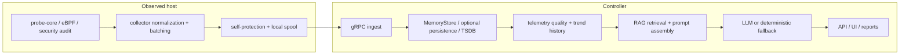

# Data Flow

中文版本：[docs/zh/05-data-flow.md](../zh/05-data-flow.md)

This page traces the real `v0.8` data path with concrete examples. The goal is not only to name the components, but to show:

- what the collector samples
- how those values are represented in code
- what gets filtered or promoted
- how retrieval is queried
- how the final prompt is assembled
- how the model output is accepted, downgraded, or replaced by fallback logic

> The metric values below are illustrative, but every metric name, structure, and transformation path matches the current code.

If you want one longer document that also explains why each major stage exists, what problem it solved, why this design was chosen, what would break if removed, and how the steady-state / trend / weak-signal / RAG-assisted cases differ, read [Pipeline Deep Dive](02-pipeline-deep-dive.md) first.

Use these companion deep dives when you want the “why” behind two especially important stages:

- [Collector Queue and Compaction](06-collector-queue-and-compaction.md) for suppression, spool, drain limits, and slow-receiver behavior
- [Control-Plane Analysis](07-control-plane-analysis.md) for trend analysis, weak-signal fusion, TSDB writes, retrieval gating, and recommendation generation

## Why The Pipeline Is Split

The repository keeps collection on the host and reasoning on the controller for three practical reasons:

1. short-lived host signals are easiest to capture locally
2. controller outages should not immediately become observability loss
3. retrieval, prompt assembly, and UI work should not compete with business workloads on the monitored node

If the system collapsed these roles into one process, either host collection would get too heavy or controller-side reasoning would lose the local context it needs.

## End-To-End View



## Stage Map

| Stage | Main files | Input shape | Output shape | Why it exists |
| --- | --- | --- | --- | --- |
| Host sampling | [`cpp/probe_core/main.cpp`](../../cpp/probe_core/main.cpp), [`backend/internal/collector/probe/ebpf/collector.go`](../../backend/internal/collector/probe/ebpf/collector.go) | kernel state, `/proc`, `/sys`, GPU runtime, eBPF events | raw `probeipc` batch and runtime events | collect short-lived node signals close to the host |
| Collector conversion | [`backend/internal/collector/probe_core_convert.go`](../../backend/internal/collector/probe_core_convert.go) | `probeipcv1.ProbeBatch` | compacted `[]*telemetryv1.Metric`, `[]*telemetryv1.ProcessSample` | translate native counters into controller-visible metric names without default raw/alias duplication |
| Collector transport | [`backend/internal/collector/collector.go`](../../backend/internal/collector/collector.go), [`backend/internal/collector/spool/spool.go`](../../backend/internal/collector/spool/spool.go), [`backend/internal/collector/transport/client.go`](../../backend/internal/collector/transport/client.go) | normalized metrics, process samples, logs, events | `TelemetryBatch` pushed or buffered | make delivery resilient without blocking collection, and omit cache-hit helper payloads when the view did not really refresh |
| Controller ingest | [`backend/internal/controller/ingest/server.go`](../../backend/internal/controller/ingest/server.go), [`backend/internal/controller/ingest/store.go`](../../backend/internal/controller/ingest/store.go) | `TelemetryBatch` | [`NodeSnapshot`](../../backend/internal/controller/ingest/store.go) plus history samples | validate, dedupe, normalize hot state, reconstruct suppressed low-churn collector metadata, and clear cached process/log state only on explicit refreshed-empty helper cycles |
| Screening and reasoning prep | [`backend/internal/controller/agentcore/agent.go`](../../backend/internal/controller/agentcore/agent.go) | `NodeSnapshot`, GPU snapshots, history, logs | `PromptInput` | reduce noise and attach trust metadata before LLM use |
| Control-plane eventization | [`backend/internal/controller/agentcore/workflow_eventization.go`](../../backend/internal/controller/agentcore/workflow_eventization.go), [`backend/internal/controller/agentcore/workflow_engine.go`](../../backend/internal/controller/agentcore/workflow_engine.go), [`backend/internal/controller/agentcore/behavioral_memory.go`](../../backend/internal/controller/agentcore/behavioral_memory.go) | `NodeSnapshot`, history, risk series, baseline samples, workload identity | `TrendAssessment[]`, `BehavioralSignalAssessment[]`, `InvestigationEvent[]`, `RetrievalDecision[]` | compress raw state into trend, workload-memory, weak-signal, and retrieval-planning artifacts before deeper analysis |
| Control-plane status export | [`backend/internal/controller/agent_integration.go`](../../backend/internal/controller/agent_integration.go), [`backend/internal/controller/agentcore/workflow_engine.go`](../../backend/internal/controller/agentcore/workflow_engine.go), [`backend/internal/controller/agent/report_dedupe.go`](../../backend/internal/controller/agent/report_dedupe.go) | latest joint-risk and RCA reports plus legacy scheduled-report state | `/api/v1/agent/status` `control_plane` and `report_engine` summaries | gives UI and operators one compact view of trend/event/retrieval activity plus unchanged legacy-report refresh state without loading full reports first |
| Retrieval | [`backend/internal/controller/rag/service.go`](../../backend/internal/controller/rag/service.go), [`backend/internal/controller/rag/ingest.go`](../../backend/internal/controller/rag/ingest.go), [`backend/internal/controller/rag/index.go`](../../backend/internal/controller/rag/index.go) | operator query plus findings | `rag.QueryResult` with `[]SearchHit` | attach bounded operational knowledge |
| Prompt assembly | [`backend/internal/controller/agentcore/prompts.go`](../../backend/internal/controller/agentcore/prompts.go) | `PromptInput` | system prompt, user prompt, `LLMSchema` | make the evidence machine-readable and auditable |
| Model call and fallback | [`backend/internal/controller/agentcore/agent.go`](../../backend/internal/controller/agentcore/agent.go) | prompts | parsed JSON payload or deterministic fallback | keep the API stable even when LLM calls fail |

## Where Behavioral Memory Fits

The recurring-burst suppression layer sits inside the controller workflow path, not in the collector and not in the generic ingest store.

That placement is deliberate:

- the collector should preserve evidence, not decide whether a burst is historically benign
- ingest should keep current state and bounded recent history, not own service-specific classification policy
- the workflow already has the cross-signal context needed to decide whether a burst is isolated, recurring, or corroborated by errors and runtime anomalies

In practical terms, the controller now does this after building `RiskSeries`:

1. derive a workload identity from labels and top-process context
2. query the existing metric-history path for a longer window of the same collector or workload
3. compare the current burst against recent baseline, longer-window baseline, and simple hour-of-day recurrence
4. classify each active signal as `expected_recurring_burst`, `suspicious_deviation`, `correlated_anomaly`, or `confirmed_anomaly`
5. feed that classification into risk scoring, trend summaries, and evidence output

There is no second history database here. The workflow derives context from the same retained metric history and optional TSDB-backed queries that already exist for trend analysis, then keeps only a small in-memory cache to avoid repeating the same query during a short burst of workflow activity.

## Collector-Side Pacing Before Ingest

The collector now applies different cadences to different signal classes instead of treating every helper like the main loop.

| Signal class | Real implementation | Effective cadence |
| --- | --- | --- |
| Fast path | probe-core and primary eBPF summaries in [`backend/internal/collector/collector.go`](../../backend/internal/collector/collector.go) | every collector cycle, with probe-core sub-collector pacing from [`configs/collector.yaml`](../../configs/collector.yaml) |
| Medium path | compatibility `/proc` process fallback in [`backend/internal/collector/aux_sampling.go`](../../backend/internal/collector/aux_sampling.go) | `max(collection_interval, probe_core.interval * host_proc_fallback_interval_samples)` |
| Medium path | compatibility extended host metrics in [`backend/internal/collector/probe/cadence.go`](../../backend/internal/collector/probe/cadence.go) | `max(2 * collection_interval, 10s)` |
| Slow path | compatibility hardware scans in [`backend/internal/collector/probe/cadence.go`](../../backend/internal/collector/probe/cadence.go) | `max(6 * collection_interval, 30s)` |
| Slow path | compatibility deep scans, kernel summaries, and GPU fallback helpers in [`backend/internal/collector/probe/cadence.go`](../../backend/internal/collector/probe/cadence.go) | `max(3 * collection_interval, 15s)` |
| Slow path | compatibility RCA helpers in [`backend/internal/collector/probe/cadence.go`](../../backend/internal/collector/probe/cadence.go) | `max(6 * collection_interval, 30s)` |
| Slow path | log tailing in [`backend/internal/collector/aux_sampling.go`](../../backend/internal/collector/aux_sampling.go) | `max(15s, 3 * collection_interval)` |
| Slow path | external metrics command in [`backend/internal/collector/aux_sampling.go`](../../backend/internal/collector/aux_sampling.go) | `max(30s, 6 * collection_interval)` |
| Triggered deepening | same helper paths in incident mode or on compatibility fallback anomalies | tighten back toward the active collector cadence |

The collector exports three observability families so operators can verify this pacing on a live node:

- `collector_aux_collection_interval_seconds`, `collector_aux_collection_age_seconds`, and `collector_aux_collection_cache_hit` for log, external, and compatibility-process helpers from [`aux_sampling.go`](../../backend/internal/collector/aux_sampling.go)
- `collector_aux_payload_refreshed` and `collector_aux_payload_suppressed` for log and compatibility-process helper payload semantics
- `collector_compat_collection_interval_seconds`, `collector_compat_collection_age_seconds`, `collector_compat_collection_cache_hit`, and `collector_compat_collection_anomaly_triggered` for the legacy Go compatibility tiers from [`probe/cadence.go`](../../backend/internal/collector/probe/cadence.go), now including `component="hardware"`

The collector also exports payload-reduction state:

- `collector_metrics_partial_update`
- `collector_metrics_suppressed_count`

Those two metrics mean "this batch intentionally omitted unchanged low-churn collector/runtime inventory" rather than "the collector forgot to populate state."

## Walkthrough 1: Memory Pressure And Storage Bottleneck

This walkthrough follows one realistic node slowdown example from raw sampling to final answer.

### Step 1. Raw sampled values on the host

These are representative values the native probe path can emit. The metric names below are the actual names handled by [`convertProbeCoreBatch`](../../backend/internal/collector/probe_core_convert.go).

```text
probe_core_cpu_usage_percent = 92.1
probe_core_cpu_iowait_percent = 12.4
probe_core_memory_total_bytes = 17179869184
probe_core_memory_used_bytes = 15032385536
probe_core_memory_used_percent = 87.5
probe_core_disk_await_ms{device="nvme0n1"} = 38.5
probe_core_disk_queue_depth{device="nvme0n1"} = 11
probe_core_network_tcp_retransmissions_per_sec = 0.8
probe_core_network_rx_bytes_per_sec{iface="eth0"} = 52428800
probe_core_network_tx_bytes_per_sec{iface="eth0"} = 18874368
```

Why this stage exists:

- it preserves device labels such as `device="nvme0n1"` and `iface="eth0"`
- it gives the collector the highest-fidelity host view before any summarization
- it lets the controller later distinguish CPU saturation from storage wait or network loss

If this stage is missing or degraded:

- the controller falls back to compatibility sources
- device-level attribution and freshness become weaker
- later RCA becomes more generic

### Step 2. Collector conversion into controller-visible metrics

[`convertProbeCoreBatch`](../../backend/internal/collector/probe_core_convert.go) emits the aliased node metrics that the rest of the system expects. In `v0.8`, it no longer duplicates most raw `probe_core_*` host/resource metrics by default when those aliases already exist.

Example transformation:

```json
[
  {"name":"node_memory_Used_bytes","value":15032385536},
  {"name":"node_memory_MemTotal_bytes","value":17179869184},
  {"name":"node_disk_avg_request_latency_seconds","value":0.0385,"labels":{"device":"nvme0n1"}},
  {"name":"node_network_receive_bytes_per_second","value":52428800,"labels":{"iface":"eth0"}}
]
```

Raw duplicates are still available if an operator explicitly sets `probe_core.emit_raw_aliased_metrics: true`, but the default path is optimized for lower batch size and lower spool/network cost.

The same conversion pass also creates aggregate node metrics when per-device or per-interface data is present:

- `node_disk_total_read_bytes_per_second`
- `node_disk_total_written_bytes_per_second`
- `node_disk_queue_depth_total`
- `node_disk_request_latency_p50_seconds`
- `node_disk_request_latency_p90_seconds`
- `node_disk_request_latency_p99_seconds`
- `node_network_total_receive_bytes_per_second`
- `node_network_total_transmit_bytes_per_second`

Why this stage exists:

- downstream controller code is written against `node_*`, `collector_*`, `rca_*`, and `node_gpu_*` aliases, not raw probe-core names
- aggregate metrics let the prompt layer reason about a node without having to re-sum device series every time

What would break without it:

- [`systemFindings`](../../backend/internal/controller/agentcore/agent.go) would not see `node_cpu_usage_percent` or `node_memory_Used_bytes`
- [`operationalFindings`](../../backend/internal/controller/agentcore/agent.go) would not see `node_disk_request_latency_p99_seconds` or `node_disk_queue_depth_total`
- the UI and APIs would have to understand native probe names directly

### Step 3. Transport, ingest, and `NodeSnapshot`

The collector packages metrics, processes, logs, and security evidence into a `TelemetryBatch`, then sends it through:

- [`backend/internal/collector/spool/spool.go`](../../backend/internal/collector/spool/spool.go)
- [`backend/internal/collector/transport/client.go`](../../backend/internal/collector/transport/client.go)
- [`backend/internal/controller/ingest/server.go`](../../backend/internal/controller/ingest/server.go)

That packaging step is now more selective than in earlier revisions:

- unchanged low-churn collector/runtime inventory can be omitted
- cache-hit helper payloads for logs and compatibility process fallback can be omitted
- cache-hit compatibility hardware payloads can be omitted
- near-identical process payloads from the active source can now also be omitted between bounded refreshes

The controller stores the latest node state as [`NodeSnapshot`](../../backend/internal/controller/ingest/store.go). The structure includes:

- `Metrics map[string]float64`
- `Processes []*telemetryv1.ProcessSample`
- `Logs []*telemetryv1.LogFingerprint`
- `ProbeSource`, `RuntimeMode`, `RuntimeReasons`
- structured device, filesystem, process-resource, security, and graph data

Illustrative `NodeSnapshot` excerpt:

```json
{
  "collector_id": "node-a",
  "probe_source": "probe_core",
  "runtime_mode": "primary",
  "last_collection_at": "2026-03-13T11:02:00Z",
  "last_ingest_at": "2026-03-13T11:02:02Z",
  "metrics": {
    "node_cpu_usage_percent": 92.1,
    "node_cpu_iowait_percent": 12.4,
    "node_memory_Used_bytes": 15032385536,
    "node_memory_MemTotal_bytes": 17179869184,
    "node_disk_request_latency_p99_seconds": 0.0385,
    "node_disk_queue_depth_total": 11,
    "node_tcp_retransmits_per_second": 0.8
  }
}
```

Why this stage exists:

- it gives every later subsystem one normalized hot-state view
- it keeps the current state, recent history, logs, process samples, and runtime context together

If ingest or store behavior is misunderstood:

- readers often assume metrics go straight from collector to prompt, which is wrong
- the actual reasoning path always starts from controller state, not raw collector batches

### Step 3.5. Partial collector updates and state carry-forward

To avoid resending the same collector/runtime inventory on every cycle, the collector now suppresses unchanged low-churn state such as:

- `collector_probe_source`
- `collector_runtime_mode`
- `collector_runtime_capability_available{capability=...}`
- `collector_probe_core_collector_module_active{module=...}`
- hardware capability/profile metrics under `collector_hardware_*`

Illustrative steady-state collector batch excerpt:

```json
{
  "metrics": [
    {"name":"node_cpu_usage_percent","value":31.4},
    {"name":"node_memory_Used_bytes","value":8589934592},
    {"name":"collector_self_cpu_percent","value":1.7},
    {"name":"collector_aux_payload_suppressed","value":1,"labels":{"component":"logs"}},
    {"name":"collector_metrics_partial_update","value":1},
    {"name":"collector_metrics_suppressed_count","value":19}
  ]
}
```

This does not mean the controller lost `collector_probe_source` or hardware context. [`StoreMetrics`](../../backend/internal/controller/ingest/store.go) carries forward the previous low-churn collector state when `collector_metrics_partial_update = 1`.

The same pattern now applies to cadence-cached process and log helpers:

- if a cache hit occurs and `suppress_cached_aux_payloads: true`, the collector emits `collector_aux_payload_suppressed{component="process_fallback|logs"} = 1` and omits the repeated payload
- if the helper really runs again, the collector emits `collector_aux_payload_refreshed{component="process_fallback|logs"} = 1`
- [`Server.Push`](../../backend/internal/controller/ingest/server.go) uses that refreshed marker to decide when an empty process/log payload should clear old controller state instead of simply carrying it forward

Why this stage exists:

- it cuts steady-state protobuf size and spool writes
- it avoids repeating large sets of unchanged runtime/hardware labels
- it preserves controller semantics without changing the gRPC schema

If this carry-forward logic were missing:

- a partial collector batch would erase runtime mode, source mode, and probe-core module state
- the UI and telemetry-quality logic would misread "suppressed because unchanged" as "missing"

## Control-Plane Eventization Before Retrieval And Prompting

The newer control-plane path now inserts one explicit compression stage between hot state and RAG/LLM work.

Main file:

- [`backend/internal/controller/agentcore/workflow_eventization.go`](../../backend/internal/controller/agentcore/workflow_eventization.go)

What it produces:

- `TrendAssessment[]`: one-per-series summaries of slope, threshold persistence, and forecast hints
- `InvestigationEvent[]`: multivariate weak-signal bundles with probable cause and recommended checks
- `RetrievalDecision[]`: retrieval-planning records that explain why runbook/case search ran, skipped, or was suppressed

Illustrative internal objects:

```json
{
  "trend_assessment": {
    "id": "memory_pressure:collector-a",
    "display": "Memory pressure",
    "trend": "rising",
    "delta_percent": 14.2,
    "slope_per_minute": 118.0,
    "threshold_breaches": 3,
    "persistence_points": 4,
    "severity": "high",
    "forecast": "memory pressure likely crosses high-risk threshold within 18m"
  },
  "investigation_event": {
    "id": "memory_disk_degradation:collector-a",
    "title": "Memory growth and disk wait are rising together",
    "category": "resource_contention",
    "probable_cause": "memory reclaim and IO contention are amplifying each other",
    "supporting_signals": [
      "node_memory_Used_bytes",
      "node_cpu_iowait_percent",
      "node_disk_request_latency_p99_seconds"
    ],
    "recommended_checks": [
      "inspect reclaim activity",
      "check disk queue depth",
      "compare with recent deployment burst"
    ]
  },
  "retrieval_decision": {
    "tool": "runbook_retrieval",
    "intent": "incident_rag",
    "query": "memory growth and disk wait rising together reclaim io contention latency",
    "evidence_signals": [
      "memory_pressure",
      "io_latency",
      "service_latency"
    ],
    "skipped": false
  }
}
```

Why this stage exists:

- raw telemetry is too noisy for direct RAG query construction
- the UI needs operator-facing evidence objects, not only a final text answer
- repeated unchanged conditions can now be compared at the event/trend level instead of rebuilding everything from scratch every time

The same steady-state reduction now exists for the slow compatibility hardware tier:

- if a hardware-tier cache hit occurs and `suppress_cached_compat_hardware_metrics: true`, the collector emits `collector_compat_payload_suppressed{component="hardware"} = 1` and omits repeated thermal/NIC/RDMA fallback metrics from that batch
- if the hardware tier really refreshes, the collector emits `collector_compat_payload_refreshed{component="hardware"} = 1`
- [`StoreMetrics`](../../backend/internal/controller/ingest/store.go) carries the previous compatibility hardware view forward on suppression cycles, then lets the next real refresh replace or clear it

Illustrative hardware-tier cache-hit batch excerpt:

```json
{
  "metrics": [
    {"name":"node_cpu_usage_percent","value":29.8},
    {"name":"collector_compat_collection_cache_hit","value":1,"labels":{"component":"hardware"}},
    {"name":"collector_compat_payload_suppressed","value":1,"labels":{"component":"hardware"}}
  ]
}
```

That means the controller still remembers the last `node_thermal_*` or `node_network_interface_*` fallback values, but the collector avoids paying to resend them on every slow-path cache hit.

### Step 3.6. Broad hardware warnings without extra probes

After protection scoring, the collector now derives broad hardware hints from metrics it already has plus the cached hardware threshold profile in [`hardware_warnings.go`](../../backend/internal/collector/hardware_warnings.go).

Illustrative warning output:

```json
[
  {"name":"collector_hardware_warning_total","value":2},
  {"name":"collector_hardware_warning","value":0.78,"labels":{"domain":"disk","reason":"latency","signal":"node_disk_request_latency_p99_seconds"}},
  {"name":"collector_hardware_warning","value":0.63,"labels":{"domain":"network","reason":"retransmit","signal":"node_tcp_retransmit_ratio"}}
]
```

Why this stage exists:

- it gives the controller and operator a broad hardware-oriented diagnosis layer without adding a new always-on sensor path
- it makes downstream screening cheaper because “possible NIC issue” or “possible disk degradation” is already compacted before any LLM or RAG path

### Step 4. Screening before prompt assembly

The controller does not send every raw fact to the model unchanged. The main screening happens in [`buildPromptInput`](../../backend/internal/controller/agentcore/agent.go).

It performs these steps:

1. clone all node metrics into the prompt input
2. keep only the top 5 processes by CPU via `summarizeProcesses`
3. keep only the top 5 log fingerprints by count via `summarizeLogs`
4. merge GPU summary data if a GPU snapshot is available
5. compute trend directions from recent history with `metricTrends`
6. generate findings and anomalies
7. compute telemetry trust with `assessPromptTelemetryQuality`
8. leave RAG empty until the service knows it will really take the LLM path

#### Process and log promotion

`ProcessSample` and `LogFingerprint` data are reduced before the prompt:

```json
{
  "processes": [
    {"pid": 4128, "name": "trainer", "cpu_percent": 71.2, "rss_bytes": 8589934592, "io_read_bps": 73400320, "io_write_bps": 2097152},
    {"pid": 778, "name": "python-loader", "cpu_percent": 18.1, "rss_bytes": 2147483648, "io_read_bps": 104857600, "io_write_bps": 0}
  ],
  "logs": [
    {"fingerprint":"dial tcp timeout", "count":42, "example":"request to cache service timed out"},
    {"fingerprint":"retry budget exceeded", "count":17, "example":"retry budget exceeded for dependency"}
  ]
}
```

Why this screening exists:

- full process lists and full logs are too noisy and too expensive for the prompt
- the query path only needs the hottest processes and most repeated log patterns

#### Threshold-based findings

The first round of findings is deterministic:

- `systemFindings` emits `CPU utilization is above 85%` when `node_cpu_usage_percent >= 85`
- it emits `Memory utilization is above 85%` when `node_memory_Used_bytes / node_memory_MemTotal_bytes >= 0.85`
- it emits `Disk I/O pressure is elevated` when `node_disk_io_now >= 50`

Then [`operationalFindings`](../../backend/internal/controller/agentcore/agent.go) combines metrics and trends. In this example:

- `node_cpu_iowait_percent = 12.4`
- `node_disk_request_latency_p99_seconds = 0.0385`
- `node_disk_queue_depth_total = 11`

That meets the storage bottleneck heuristic:

```text
CPU wait and disk latency are rising together, which points to a storage bottleneck rather than pure CPU saturation
```

Because memory is at `87.5%`, memory trend can also add:

```text
Memory headroom is shrinking steadily, which points to structural capacity exhaustion rather than a transient spike
```

If logs also contain `timeout` or `error`, the heuristic becomes stronger:

```text
Memory growth is being reinforced by error or timeout activity, which looks more like leak or retry amplification than a one-off spike
```

#### Telemetry quality and trust gating

[`assessPromptTelemetryQuality`](../../backend/internal/controller/agentcore/agent.go) checks:

- freshness age
- ingest delay
- missing critical signal groups
- blind spots such as missing logs, missing processes, backlog, stale probe-core, or degraded runtime mode

The critical signal groups are hardcoded as:

- CPU pressure
- memory pressure
- network throughput
- storage activity
- telemetry integrity

If all five groups are present and data is fresh, coverage is `100%`. If one group is missing, coverage drops to `80%`.

Example quality block:

```json
{
  "state": "fresh",
  "coverage_percent": 100,
  "confidence": 1,
  "source_mode": "probe_core",
  "freshness_age_seconds": 2,
  "ingest_delay_seconds": 2,
  "safe_to_act": true
}
```

If the spool is draining or logs are missing, the state can degrade even when metrics still exist:

```json
{
  "state": "degraded",
  "coverage_percent": 100,
  "confidence": 0.8,
  "blind_spots": [
    "log evidence is missing",
    "collector replay backlog is still draining"
  ],
  "safe_to_act": false
}
```

This exists to stop the model from treating stale or partial evidence as complete truth.

### Step 5. RAG request formation

RAG is no longer attached unconditionally.

The query-service first decides whether stale or missing telemetry will force deterministic fallback through:

- `SkipLLMOnNoTelemetry`
- `SkipLLMOnStaleTelemetry`
- `fallbackPayload`

Only if the request will actually call the model does [`attachRAGContext`](../../backend/internal/controller/agentcore/agent.go) invoke [`ragContext`](../../backend/internal/controller/agentcore/agent.go).

Why this matters:

- stale or empty telemetry should not spend extra CPU, I/O, or token budget on retrieval
- the response should not imply that retrieval influenced a deterministic fallback when it did not

If RAG is enabled, [`ragContext`](../../backend/internal/controller/agentcore/agent.go) builds a query from:

- the operator’s original question
- the deterministic findings generated from telemetry
- the anomaly/trend hints generated from recent history

Before retrieval is even attempted, [`shouldAttachQueryServiceRAG`](../../backend/internal/controller/agentcore/agent.go) checks whether the request contains meaningful operational symptom context.

That gate now allows retrieval when at least one of these is true:

- filtered findings or anomaly hints are present
- the operator query itself already contains operational keywords such as `cpu`, `memory`, `timeout`, `latency`, `gpu`, `thermal`, `network`, `disk`, `retransmit`, `deployment`, or `security`

If neither condition is true, the controller skips retrieval entirely and increments `agent_rag_skipped_context_total` instead of paying the retrieval cost for a generic question.

Before those findings are compacted, [`filterFindingsForRetrieval`](../../backend/internal/controller/agentcore/agent.go) drops low-value boilerplate such as:

- `No critical anomalies detected`
- `Telemetry snapshot is stale ...`
- `Telemetry freshness is degraded ...`
- `Observability coverage is degraded ...`
- `Missing critical signals: ...`
- `Host telemetry freshness is degraded ...`

That keeps retrieval focused on the real operational symptoms instead of telemetry-quality banners that are useful for UI/debugging but usually unhelpful for runbook search.

For an operator question like:

```text
why did node-a slow down after rollout?
```

and findings like:

- `CPU utilization is above 85%`
- `Memory utilization is above 85%`
- `CPU wait and disk latency are rising together, which points to a storage bottleneck rather than pure CPU saturation`

the controller first compacts that evidence through:

- `rag_max_findings`
- `rag_max_query_chars`
- duplicate-finding removal inside `compactRAGQueryText`
- low-value finding removal inside `filterFindingsForRetrieval`
- anomaly-hint inclusion through `filterAnomaliesForRetrieval`

With the default production-oriented knobs from [`configs/controller.yaml`](../../configs/controller.yaml), the full set usually fits. With an illustrative tight budget of `rag_max_findings=2` and `rag_max_query_chars=120`, the request becomes:

```json
{
  "query": "why did node-a slow down after rollout? CPU utilization is above 85% Memory utilization is above 85%",
  "top_k": 4,
  "intent": "rca",
  "knowledge_types": ["historical_incident", "runbook", "question_pattern"],
  "case_types": ["historical_incident", "runbook", "operational_qa"]
}
```

Why this exists:

- live metrics explain current pressure, but not past fixes or procedural steps
- findings and anomaly hints help retrieval search for the operational pattern instead of only the user’s wording
- stale-telemetry warnings and "no anomaly" boilerplate would otherwise pollute lexical/vector retrieval with low-value text

Illustrative low-signal query that is now skipped on purpose:

```json
{
  "operator_query": "what is happening here",
  "findings": ["No critical anomalies detected"],
  "anomalies": [],
  "retrieval": "skipped",
  "reason": "too little operational symptom context"
}
```

What can go wrong:

- if findings are noisy, the retrieval query becomes noisy
- if the dataset is generic, the query returns low-value hits
- if `top_k` is too high, prompt clutter increases
- if `rag_max_query_chars` is too small, retrieval will overfit to the first symptoms and lose later evidence

### Step 5.5. Repeated-query reuse before retrieval and LLM

The query-service now adds one more gate before it spends controller CPU on retrieval and model calls.

[`analysisReuseKey`](../../backend/internal/controller/agentcore/agent.go) fingerprints:

- the normalized operator query
- the prompt-facing compact metric map
- telemetry quality state/source/runtime
- top alerts and anomalies
- the hottest process and log summaries

If that fingerprint is unchanged and the last successful result is still within `analysis_reuse_window`, [`Query`](../../backend/internal/controller/agentcore/agent.go) reuses the recent analysis instead of calling `attachRAGContext` and `runLLM` again.

Illustrative repeated-query sequence:

```text
t=00s  query="why is disk latency growing?"  node_cpu_usage_percent=81.2  node_disk_request_latency_p99_seconds=0.041  -> retrieval + LLM run
t=12s  same query, same compact evidence fingerprint                                  -> recent analysis reused
t=55s  same query, but node_cpu_usage_percent=94.1 and queue depth increased         -> fingerprint changed, retrieval + LLM run again
```

Why this stage exists:

- dashboards and operators often repeat the same question while watching one incident
- repeated unchanged requests should not keep hitting the local index and model path
- fallback answers are intentionally excluded from reuse so transient LLM failure does not get treated as a stable truth

### Step 6. Retrieval results and prompt-ready snippets

The RAG service returns [`SearchHit`](../../backend/internal/controller/rag/retriever.go) objects, not raw files.

Representative `SearchHit` shape:

```json
{
  "evidence_id": "rag-1",
  "doc_id": "doc-1",
  "chunk_id": "chunk-1",
  "score": 0.92,
  "source_path": "cases/timeout-runbook.md",
  "source_type": "markdown",
  "knowledge_type": "runbook",
  "case_type": "runbook",
  "title": "Timeout Runbook",
  "summary": "Check retry rates and deployment timing.",
  "snippet": "Inspect retries and cache credentials after rollout.",
  "likely_causes": ["stale cache credential after rollout"],
  "remediation_steps": ["inspect retry rate", "validate cache credentials"],
  "signals": ["deployment", "network"]
}
```

That exact shape is exercised in:

- [`backend/internal/controller/rag/service_test.go`](../../backend/internal/controller/rag/service_test.go)
- [`backend/internal/controller/agentcore/agent_test.go`](../../backend/internal/controller/agentcore/agent_test.go)
- [`backend/internal/controller/agentcore/prompts_test.go`](../../backend/internal/controller/agentcore/prompts_test.go)

The query-service path compresses each hit into a short prompt line with [`renderQueryServiceRAGSnippet`](../../backend/internal/controller/agentcore/agent.go):

```text
[runbook] Timeout Runbook :: summary=Check retry rates and deployment timing. | causes=stale cache credential after rollout | steps=inspect retry rate; validate cache credentials | signals=deployment, network
```

Why this compression exists:

- full documents would waste tokens
- the model mainly needs the summary, likely causes, steps, and provenance
- operators still need enough structure to understand why a document influenced the answer

The query-service now adds one more guardrail after retrieval:

- if `result.Confidence < rag_min_confidence`, the controller keeps the retrieval summary for debugging but suppresses all RAG snippets before prompt assembly

Illustrative suppressed response metadata:

```text
Retrieval summary: retrieved 1 knowledge hits, but retrieval suppressed because confidence 0.12 is below minimum 0.18
RAG context snippets: none
```

This exists because a weak lexical/vector match is often worse than no retrieval at all. It adds noise to the prompt and can tilt the answer toward unrelated runbooks.

### Step 7. Final prompt assembly

[`BuildUserPrompt`](../../backend/internal/controller/agentcore/prompts.go) assembles the final user message in this order:

1. anomaly framing
2. RCA instruction
3. telemetry quality line
4. RAG block
5. `Telemetry JSON (schema v1)`
6. strict output constraints

Prompt excerpt for this example:

```text
Question: "why did node-a slow down after rollout?"
Explain anomalies simply. Example style: "CPU at 90% is like a clogged pipe; flow backs up."

Telemetry shows pressure on node "node-a". Identify likely blockers, rank confidence, and suggest safe fixes first.

Telemetry quality: state=fresh age_seconds=2 stale=false coverage=100% safe_to_act=true

RAG context snippets:
- [runbook] Timeout Runbook :: summary=Check retry rates and deployment timing. | causes=stale cache credential after rollout | steps=inspect retry rate; validate cache credentials | signals=deployment, network
Retrieval summary: retrieved 1 knowledge hits across 1 documents (runbook=1)
Retrieval routing: intent=runbook mode=hybrid

Telemetry JSON (schema v1):
{
  "schema_version": "v1",
  "node_name": "node-a",
  "telemetry_quality": {
    "state": "fresh",
    "coverage_percent": 100,
    "safe_to_act": true
  },
  "metrics": {
    "node_cpu_usage_percent": 92.1,
    "node_memory_Used_bytes": 15032385536,
    "node_memory_MemTotal_bytes": 17179869184,
    "node_disk_request_latency_p99_seconds": 0.0385,
    "node_disk_queue_depth_total": 11,
    "node_tcp_retransmits_per_second": 0.8
  },
  "alerts": [
    "CPU utilization is above 85%",
    "Memory utilization is above 85%",
    "CPU wait and disk latency are rising together, which points to a storage bottleneck rather than pure CPU saturation"
  ],
  "evidence": {
    "top_metrics": [
      {"name":"node_memory_Used_bytes","value":15032385536},
      {"name":"node_memory_MemTotal_bytes","value":17179869184},
      {"name":"node_cpu_usage_percent","value":92.1}
    ],
    "processes": [
      {"pid":4128,"name":"trainer","cpu_percent":71.2}
    ],
    "logs": [
      {"fingerprint":"dial tcp timeout","count":42}
    ]
  }
}
```

If low-confidence suppression triggers, the same prompt shape is used, but the retrieval section becomes:

```text
RAG context snippets: none
Retrieval summary: retrieved 1 knowledge hits, but retrieval suppressed because confidence 0.12 is below minimum 0.18
Retrieval routing: intent=runbook mode=hybrid
```

That makes the runtime behavior explicit: retrieval was attempted, but it did not influence the model because the evidence quality was too weak.

Important detail: the LLM path no longer receives the full raw metric map.

[`buildPromptSchema`](../../backend/internal/controller/agentcore/prompts.go) compacts the prompt-facing `metrics` block to a bounded subset, currently 24 metrics with priority given to CPU, memory, disk, network, GPU, pressure, and collector-integrity signals. The API response still exposes the full `TelemetryContext` from [`BuildSchema`](../../backend/internal/controller/agentcore/prompts.go), but the model sees the compacted version.

The `Evidence` block then provides an even smaller, easier-to-reason-about summary:

- `Summary`: top 6 metrics by absolute value
- `TopMetrics`: top 8 metrics by absolute value
- `GPU`, `Network`, `Disk`, `Memory`: prefix-filtered submaps

This balance exists so the model can inspect full facts when needed without making every answer depend on a huge unstructured metric dump.

### Step 8. Actual model request and output handling

[`chatClient.Complete`](../../backend/internal/controller/agentcore/agent.go) sends a standard chat request:

```json
{
  "model": "gpt-4o-mini",
  "messages": [
    {
      "role": "system",
      "content": "You are a senior SRE. Use only provided telemetry facts. Never invent metrics or command outputs. Return strict JSON with fields: summary, root_cause, confidence, findings, recommendations, actions, evidence, limitations."
    },
    {
      "role": "user",
      "content": "...assembled user prompt..."
    }
  ],
  "temperature": 0.1,
  "max_tokens": 900
}
```

The response is accepted only if [`parseLLMPayload`](../../backend/internal/controller/agentcore/agent.go) can extract a JSON object and validate:

- `summary` is non-empty
- `root_cause` is non-empty
- `confidence` is between `0` and `1`

If the provider fails, times out, returns non-JSON, or the circuit breaker is open, [`fallbackPayload`](../../backend/internal/controller/agentcore/agent.go) returns a deterministic answer based on the same findings and telemetry quality.

That fallback path exists because the controller must stay usable even when the LLM path is unavailable.

## Walkthrough 2: What Changes When RAG Is Missing

The same node telemetry can lead to two different answer qualities:

| Context | Likely model emphasis |
| --- | --- |
| Metrics only | “The node shows CPU, memory, and storage pressure. Investigate the hottest disk and top IO-heavy process.” |
| Metrics plus a relevant runbook hit | “The node shows storage pressure, and a rollout-related runbook points to retry spikes and stale cache credentials. Check deployment timing, retry rate, and credential propagation before scaling CPU.” |

The live telemetry remains the primary evidence in both cases. RAG does not override it. RAG mainly:

- adds procedural hints
- adds historical analogies
- adds concrete next steps that telemetry alone cannot contain

If retrieval quality is poor, the opposite happens: irrelevant context competes with the telemetry and can dilute the answer.

## Failure Modes By Stage

| Stage | Typical failure | Operational effect |
| --- | --- | --- |
| Sampling | probe-core unavailable or stale | coverage drops, quality becomes degraded or stale |
| Conversion | alias missing or misread | heuristics and UI fail to see the signal under expected names |
| Ingest | batch rejected or delayed | freshness and confidence degrade; spool backlog grows |
| Screening | thresholds too weak or too aggressive | either prompt noise increases or real anomalies are hidden |
| Retrieval | generic dataset or wrong intent | snippets are irrelevant or unhelpful |
| Prompt assembly | too much context or broken JSON contract | model quality drops or output becomes unparsable |
| Model invocation | timeout, non-JSON, provider outage | deterministic fallback takes over |

## See Also

- [Architecture](04-architecture.md)
- [Metrics and signals](13-metrics-and-signals.md)
- [Dataset and RAG](11-dataset-and-rag.md)
- [Prompts and customization](12-prompts-and-customization.md)
- [Core files](10-core-files.md)
