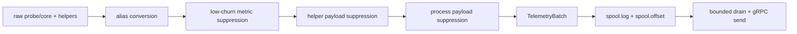

# Collector Queue and Compaction

中文版本：[docs/zh/06-collector-queue-and-compaction.md](../zh/06-collector-queue-and-compaction.md)

This page explains the part of the project that most directly protects the monitored host from observability overhead:

- deduplication and suppression before send
- the bounded spool queue
- the send and replay path
- what happens when the controller or network is slow

It is grounded in the current `v0.8` implementation, not in a generic observability design.

## Why This Stage Exists

Without compaction and queueing, the collector would have to choose between two bad behaviors:

1. send every batch immediately and let controller/network stalls block host-side collection
2. keep everything in RAM until the receiver recovers and risk collector-side memory growth

The current design solves that with three ideas:

| Problem | Actual implementation | Why it matters |
| --- | --- | --- |
| unchanged low-value state costs bytes every cycle | [`../../backend/internal/collector/metric_suppression.go`](../../backend/internal/collector/metric_suppression.go), [`../../backend/internal/collector/process_payload_suppression.go`](../../backend/internal/collector/process_payload_suppression.go), [`../../backend/internal/collector/aux_sampling.go`](../../backend/internal/collector/aux_sampling.go) | steady-state payloads stay smaller |
| controller/network stalls should not block the collection loop | [`../../backend/internal/collector/spool/spool.go`](../../backend/internal/collector/spool/spool.go) | collection and delivery are decoupled |
| replay should be bounded and fair to the monitored host | [`../../backend/internal/collector/transport/client.go`](../../backend/internal/collector/transport/client.go), [`../../backend/internal/collector/collector.go`](../../backend/internal/collector/collector.go) | backlog drain cannot monopolize collector CPU time |

For business readers: this is the part that reduces the risk that the monitoring agent itself harms the production workload.

## End-To-End Send Workflow

The collector-side delivery path is a workflow with explicit failure boundaries.

| Step | What happens | Main files | Why this step exists | What would go wrong without it |
| --- | --- | --- | --- | --- |
| 1. build one batch | the collector turns the current cycle into one `TelemetryBatch` | [`../../backend/internal/collector/collector.go`](../../backend/internal/collector/collector.go) | sending should happen from one bounded payload, not from scattered state | retries and queueing would have to reason over partial in-memory state |
| 2. suppress repeated data | low-churn metrics, cache-hit helpers, and near-identical process payloads are omitted with marker metrics | [`../../backend/internal/collector/metric_suppression.go`](../../backend/internal/collector/metric_suppression.go), [`../../backend/internal/collector/aux_sampling.go`](../../backend/internal/collector/aux_sampling.go), [`../../backend/internal/collector/process_payload_suppression.go`](../../backend/internal/collector/process_payload_suppression.go) | the collector should not pay full send cost for unchanged evidence | calm nodes would waste CPU, spool space, and network bytes on repetition |
| 3. serialize and enqueue | the protobuf payload is appended to `spool.log` before delivery | [`../../backend/internal/collector/spool/spool.go`](../../backend/internal/collector/spool/spool.go) | sampling and delivery must be decoupled | controller or network stalls would sit directly in the hot path |
| 4. drain with limits | the transport reads unread payloads by `Next()` and respects `MaxRecords` / `MaxDuration` | [`../../backend/internal/collector/transport/client.go`](../../backend/internal/collector/transport/client.go) | backlog replay must not monopolize collector time | recovery after an outage could become more expensive than sampling itself |
| 5. send to controller | the client uses failover or mirror mode, optional gzip, timeout, and retry behavior | [`../../backend/internal/collector/transport/client.go`](../../backend/internal/collector/transport/client.go) | delivery needs bounded retries and multiple endpoint strategies | one dead endpoint or one slow RPC could block progress too long |
| 6. commit on ACK | the spool offset advances only after the controller ACK matches the sent batch | [`../../backend/internal/collector/spool/spool.go`](../../backend/internal/collector/spool/spool.go), [`../../backend/internal/collector/transport/client.go`](../../backend/internal/collector/transport/client.go) | the collector needs at-least-once style replay semantics for recent evidence | batches could be lost silently or committed before real acceptance |

That separation is why queueing, sending, and committing are different code paths instead of one `send()` call.

## File Map

| File | What it owns | If it is removed or misunderstood |
| --- | --- | --- |
| [`../../backend/internal/collector/probe_core_convert.go`](../../backend/internal/collector/probe_core_convert.go) | drops most duplicated raw `probe_core_*` host/resource aliases and keeps controller-facing `node_*` / `rca_*` metrics | batch size grows again and downstream metric contracts become unclear |
| [`../../backend/internal/collector/metric_suppression.go`](../../backend/internal/collector/metric_suppression.go) | suppresses unchanged low-churn collector/runtime/hardware inventory until `low_churn_metrics_refresh_interval` | calm hosts resend the same inventory every cycle |
| [`../../backend/internal/collector/aux_sampling.go`](../../backend/internal/collector/aux_sampling.go) | caches slow helper outputs and suppresses cache-hit log/process payloads when `suppress_cached_aux_payloads` is enabled | log/process helpers become more expensive and noisier |
| [`../../backend/internal/collector/process_payload_suppression.go`](../../backend/internal/collector/process_payload_suppression.go) | suppresses near-identical active-source process lists until `process_payload_refresh_interval` | hot-process payloads dominate steady-state batch cost |
| [`../../backend/internal/collector/spool/spool.go`](../../backend/internal/collector/spool/spool.go) | bounded persistent queue with `spool.log` and `spool.offset` | the collector either blocks on delivery or grows unbounded memory |
| [`../../backend/internal/collector/transport/client.go`](../../backend/internal/collector/transport/client.go) | failover send path and bounded drain loop | replay can monopolize the collector or hide transport failures |
| [`../../backend/internal/controller/ingest/server.go`](../../backend/internal/controller/ingest/server.go) | only clears helper state when a refreshed-empty payload is explicit | suppressed payloads may look like missing state |
| [`../../backend/internal/controller/ingest/store.go`](../../backend/internal/controller/ingest/store.go) | carries forward suppressed low-churn and slow compatibility-hardware state | smaller batches would look incomplete to the control plane |

## Compaction Stages Before Send



Each stage exists for a different reason. They are not interchangeable.

## What Gets Suppressed and Why

### 1. Raw alias duplication

Problem before this stage:

- one host fact could be shipped twice
- example: `probe_core_memory_used_bytes` and `node_memory_Used_bytes`

Current behavior:

- [`../../backend/internal/collector/probe_core_convert.go`](../../backend/internal/collector/probe_core_convert.go) keeps the controller-facing aliases by default
- raw duplicates only come back when `probe_core.emit_raw_aliased_metrics: true`

What is preserved:

- the controller still sees the metric families it actually reasons over
- debugging can still re-enable raw duplicates explicitly

Tradeoff:

- operators who built tooling directly on raw `probe_core_*` aliases must opt back in

### 2. Low-churn collector/runtime inventory suppression

Problem before this stage:

- the collector resent the same runtime mode, probe source, probe-core module state, and hardware profile values every cycle

Current behavior:

- [`../../backend/internal/collector/metric_suppression.go`](../../backend/internal/collector/metric_suppression.go) suppresses unchanged metrics until `low_churn_metrics_refresh_interval`
- the batch emits:
  - `collector_metrics_partial_update = 1`
  - `collector_metrics_suppressed_count = N`

What is preserved:

- the control plane keeps the previous values
- [`../../backend/internal/controller/ingest/store.go`](../../backend/internal/controller/ingest/store.go) reconstructs the omitted state

Risk introduced:

- if a reader does not understand `collector_metrics_partial_update`, they may think the collector “forgot” to populate runtime state

### 3. Cache-hit helper payload suppression

Problem before this stage:

- logs and compatibility process fallback could be rescanned less often, but the cached payload still got resent on every cache-hit cycle

Current behavior:

- [`../../backend/internal/collector/aux_sampling.go`](../../backend/internal/collector/aux_sampling.go) emits cache-hit metrics and omits the payload when the cached view did not actually refresh
- the collector exports:
  - `collector_aux_payload_refreshed`
  - `collector_aux_payload_suppressed`

What is preserved:

- the controller keeps the previous process/log view until a real refresh happens

What would go wrong without the explicit refreshed/suppressed markers:

- an omitted payload could be confused with “the helper refreshed and found nothing”

### 4. Active-source process payload suppression

Problem before this stage:

- even with helper suppression, `TelemetryBatch.Processes` could still resend nearly the same hot-process list every cycle

Current behavior:

- [`../../backend/internal/collector/process_payload_suppression.go`](../../backend/internal/collector/process_payload_suppression.go) builds a coarse fingerprint over PID, normalized process name, CPU bucket, RSS bucket, and IO bucket
- if the fingerprint is materially unchanged, the process payload is omitted until:
  - a meaningful shape change happens
  - or `process_payload_refresh_interval` forces a resend

The collector exports:

- `collector_process_payload_refreshed`
- `collector_process_payload_suppressed`

Tradeoff:

- process-level attribution is slightly coarser between forced refreshes
- node-level pressure metrics still arrive every cycle

That tradeoff is deliberate: process attribution is expensive context, not first-line steady-state telemetry.

## The Queue Before Sending

The queue is not theoretical. It is the persistent spool in [`../../backend/internal/collector/spool/spool.go`](../../backend/internal/collector/spool/spool.go).

### Actual structure

| Artifact | Role |
| --- | --- |
| `spool.log` | append-only record file |
| `spool.offset` | last committed read offset |
| 4-byte record header | stores payload length before each payload |

### Actual API

| Function | What it does |
| --- | --- |
| `Enqueue(payload)` | appends one serialized batch |
| `Next()` | reads the next unread payload without advancing the offset |
| `Commit(nextOffset)` | advances the offset only after successful delivery |
| `Snapshot()` | returns backlog bytes, file size, max bytes, evictions, and corruption recoveries |

### Why a queue is needed here

If the collector sent directly to the controller on every cycle:

- every gRPC stall would sit in the hot path of collection
- network retries would compete with telemetry sampling
- receiver slowness could cascade into missed samples or collector self-pressure

The spool solves that by separating:

- collection timing
- disk-backed buffering
- replay timing

For business readers: this is how the project avoids turning a controller outage into immediate observability loss on every node.

## Why Direct Send Would Be Worse

If the collector tried to send synchronously on every cycle without a spool:

- the host-side sampling loop would block behind controller latency
- retry logic would compete directly with collection CPU budget
- temporary receiver slowness would increase missed samples
- memory-only buffering would either grow too much or drop data abruptly

The current queue-plus-drain design is a compromise:

- safer for the monitored host
- cheaper in steady state
- imperfect during very long outages because the bounded spool prefers recent data over perfect replay

## What Happens When the Receiver Is Slow

### Normal low-overhead path

Illustrative collector settings that match the default source config:

```yaml
collection_interval: "5s"
spool_max_bytes: 134217728
spool_sync_interval: "1s"
spool_offset_sync_interval: "1s"
protection:
  max_drain_records_per_cycle: 8
  max_drain_duration: "750ms"
```

Illustrative steady-state batch after suppression:

```json
{
  "collector_id": "node-a",
  "metrics": {
    "node_cpu_usage_percent": 27.4,
    "node_memory_Used_bytes": 9544371776,
    "node_memory_MemTotal_bytes": 17179869184,
    "collector_self_cpu_percent": 1.2,
    "collector_spool_backlog_bytes": 0
  },
  "processes": [],
  "logs": []
}
```

Why `processes` and `logs` can be empty here:

- this does not mean “no process or log view exists”
- it can mean “the previous view is still valid and the collector intentionally suppressed the duplicate payload”

### Slow receiver example

Illustrative sequence consistent with the code path:

1. the collector keeps sampling every `5s`
2. controller gRPC sends start failing for `30s`
3. each batch is appended to `spool.log`
4. `collector_spool_backlog_bytes` rises
5. once connectivity returns, [`DrainWithOptions`](../../backend/internal/collector/transport/client.go) replays at most:
   - `MaxRecords` per cycle
   - `MaxDuration` per cycle
6. the collector keeps collecting new data while old backlog drains gradually

Why the drain is bounded:

- without `MaxRecords` and `MaxDuration`, replay could monopolize the collector loop
- that would increase collector CPU cost precisely when the system is recovering from a network or controller problem

### If the spool fills up

Actual behavior from [`compactLocked`](../../backend/internal/collector/spool/spool.go):

- the spool preserves the newest unread data
- old unread records are evicted to keep the bounded capacity
- `collector_spool_evicted_records_total` increases

This is a deliberate tradeoff:

- the system prefers recent telemetry over an ever-growing backlog of old data
- the risk is loss of some historical continuity during long outages

### If the unread tail is corrupt

Actual behavior from `Next()` and `recoverCorruptionLocked(...)`:

- truncated or invalid unread records are dropped
- `collector_spool_corruption_recoveries_total` increases
- `collector_spool_last_recovery_reason{reason=...}` records the last reason

That avoids the collector getting stuck forever on one bad unread segment.

## Transport Behavior After Queueing

The send path after queueing is implemented in [`../../backend/internal/collector/transport/client.go`](../../backend/internal/collector/transport/client.go).

| Behavior | Current implementation | Why it exists |
| --- | --- | --- |
| failover send | `sendWithFailover(...)` walks configured endpoints until one ACK succeeds | one dead controller endpoint should not block delivery entirely |
| mirror send | `sendMirror(...)` can send to all configured endpoints | useful when operators intentionally want duplicate delivery to multiple controllers |
| optional gzip | `Compress` enables gRPC gzip | lowers network cost when payloads are large enough to justify it |
| timeout-bounded RPC | `DialTimeout` and `RPCTimeout` bound connection and send time | prevents one slow network path from stalling the collector indefinitely |
| ACK validation | the client checks for empty or mismatched ACK batch IDs | protects the spool from committing the wrong payload |
| retry accounting | client stats record retries, last endpoint, compression mode, and error kind | makes send-path behavior observable instead of invisible |

Tradeoff:

- failover is safer than a single-endpoint send, but it can still replay the same payload more than once if the controller accepted it and the ACK was lost
- mirror mode is more expensive by design and should be enabled deliberately, not left on as a casual default

## Concrete Example: From Raw Sample to Smaller Batch

Illustrative values that match the real metric names:

```text
memory_used_mb = 14320
memory_total_mb = 16384
memory_usage_pct = 87.4
cpu_iowait_pct = 28.4
disk_await_ms = 41.7
nic_rx_drops = 134
log_burst = 12
```

### Before suppression

```json
{
  "metrics": {
    "node_memory_Used_bytes": 15015608320,
    "node_memory_MemTotal_bytes": 17179869184,
    "node_cpu_iowait_percent": 28.4,
    "node_disk_request_latency_p99_seconds": 0.0417,
    "node_network_total_drop_per_second": 2.1,
    "collector_probe_source": 1,
    "collector_runtime_mode": 1,
    "collector_hardware_cpu_anomaly_score": 0.63
  },
  "processes": [
    {"pid": "2100", "name": "checkout-api", "cpu_percent": 71.2, "rss_bytes": 8589934592}
  ],
  "logs": [
    {"fingerprint": "dial tcp timeout", "count": 42}
  ]
}
```

### After suppression on a calm cache-hit cycle

```json
{
  "metrics": {
    "node_memory_Used_bytes": 15015608320,
    "node_memory_MemTotal_bytes": 17179869184,
    "node_cpu_iowait_percent": 28.4,
    "node_disk_request_latency_p99_seconds": 0.0417,
    "node_network_total_drop_per_second": 2.1,
    "collector_metrics_partial_update": 1,
    "collector_metrics_suppressed_count": 9,
    "collector_process_payload_suppressed": 1,
    "collector_aux_payload_suppressed{component=\"logs\"}": 1
  },
  "processes": [],
  "logs": []
}
```

What was lost:

- repeated copies of unchanged runtime inventory
- repeated copies of the same hot-process and log-fingerprint context

What was preserved:

- node pressure metrics that drive control-plane analysis
- enough markers for the controller to carry forward the previous view safely

## What the Control Plane Reconstructs

[`../../backend/internal/controller/ingest/store.go`](../../backend/internal/controller/ingest/store.go) and [`../../backend/internal/controller/ingest/server.go`](../../backend/internal/controller/ingest/server.go) interpret the suppression markers.

That means:

- partial low-churn metric batches do not erase runtime mode or hardware context
- cache-hit process/log suppression does not clear the old process/log state
- cache-hit compatibility hardware suppression does not erase the previous thermal/NIC/RDMA view

If this reconstruction layer did not exist:

- compaction would look like random data loss
- the control plane would oscillate between “known state” and “empty state”

## How to Validate This on a Live Node

Watch these metrics together:

| Metric | What it tells you |
| --- | --- |
| `collector_metrics_suppressed_count` | unchanged low-churn inventory was omitted intentionally |
| `collector_aux_payload_suppressed{component="logs"}` | the cached log view stayed valid and was not resent |
| `collector_process_payload_suppressed` | the hot-process payload stayed materially unchanged |
| `collector_spool_backlog_bytes` | data is waiting to be replayed |
| `collector_spool_evicted_records_total` | the backlog exceeded the bounded spool capacity |
| `collector_spool_corruption_recoveries_total` | unread corrupt tail was dropped to keep progress |
| `collector_transport_errors_total` | send path is failing |
| `collector_transport_retries_total` | failover or retry path is active |

## Tuning Knobs

Key config fields:

| Field | File | Why you tune it |
| --- | --- | --- |
| `spool_max_bytes` | [`../../configs/collector.yaml`](../../configs/collector.yaml) | more or less local backlog tolerance |
| `spool_sync_interval` | [`../../configs/collector.yaml`](../../configs/collector.yaml) | durability vs disk-sync cost |
| `spool_offset_sync_interval` | [`../../configs/collector.yaml`](../../configs/collector.yaml) | commit durability vs disk-sync cost |
| `low_churn_metrics_refresh_interval` | [`../../configs/collector.yaml`](../../configs/collector.yaml) | how often full runtime inventory is resent |
| `suppress_cached_aux_payloads` | [`../../configs/collector.yaml`](../../configs/collector.yaml) | whether cache-hit log/process helper payloads are omitted |
| `suppress_unchanged_process_payloads` | [`../../configs/collector.yaml`](../../configs/collector.yaml) | whether near-identical active-source process lists are omitted |
| `process_payload_refresh_interval` | [`../../configs/collector.yaml`](../../configs/collector.yaml) | maximum age of a carried-forward process view |
| `protection.max_drain_records_per_cycle` | [`../../configs/collector.yaml`](../../configs/collector.yaml) | replay fairness vs recovery speed |
| `protection.max_drain_duration` | [`../../configs/collector.yaml`](../../configs/collector.yaml) | maximum replay CPU time per collector cycle |

## What This Stage Does Not Solve

- it is not full delta encoding for every metric family
- it does not make the controller infinitely durable
- it does not guarantee zero data loss during a very long outage because the spool is intentionally bounded
- it does not remove the need for operator monitoring of `collector_spool_backlog_bytes`, retries, and evictions

See also:

- [Data Flow](05-data-flow.md)
- [Metrics and Signals](13-metrics-and-signals.md)
- [Control-Plane Analysis](07-control-plane-analysis.md)
- [Deployment](15-deployment.md)
