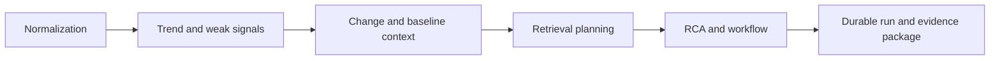

# Control-Plane Analysis

中文版本：[docs/zh/07-control-plane-analysis.md](../zh/07-control-plane-analysis.md)

This page explains how the controller converts telemetry into incident reasoning and governed workflow output in the current `v0.8` tree.

## The Main Design Choice

The controller does not treat raw telemetry as a final reasoning surface.

It first constructs smaller and more explicit evidence objects, then uses those objects for:

- trend and weak-signal analysis
- retrieval planning
- RCA hypothesis ranking
- incident workflow planning

That separation is what makes the system cheaper to reason over, easier to audit, and more useful in the UI.

## Control-Plane Path

## Stages In The Current Control Plane

| Stage | Main files | Why it exists |
| --- | --- | --- |
| normalization | [`../../backend/internal/controller/ingest/store.go`](../../backend/internal/controller/ingest/store.go) | turn partial transport batches into one current-state model |
| trend and weak-signal generation | [`../../backend/internal/controller/agentcore/workflow_eventization.go`](../../backend/internal/controller/agentcore/workflow_eventization.go) | detect drift and multivariate risk before final RCA |
| predictive hints | [`../../backend/internal/controller/predictive/`](../../backend/internal/controller/predictive/) | add deterministic short-horizon early-warning signals |
| change correlation | [`../../backend/internal/controller/changeintel/`](../../backend/internal/controller/changeintel/) | connect incidents with recent operational changes |
| retrieval planning | [`../../backend/internal/controller/agentcore/agent.go`](../../backend/internal/controller/agentcore/agent.go), [`../../backend/internal/controller/agentcore/workflow_engine.go`](../../backend/internal/controller/agentcore/workflow_engine.go) | decide whether knowledge lookup is justified |
| RCA and workflow runtime | [`../../backend/internal/controller/agentcore/workflow_engine.go`](../../backend/internal/controller/agentcore/workflow_engine.go) | build incident, hypotheses, evidence, recommendations, and plan-act-verify steps |
| durable recording | [`../../backend/internal/controller/agentcore/workflow_orchestrator.go`](../../backend/internal/controller/agentcore/workflow_orchestrator.go) | persist run state, audit artifacts, and evidence packages |

## Why The Controller Splits Symptom Detection From Root-Cause Reasoning

If the controller skipped intermediate stages and went straight from `NodeSnapshot` to prompt:

- trend direction would be mixed with transient spikes
- compound weak signals would remain hidden
- change evidence would stay implicit
- retrieval would be noisier
- workflow output would be harder to justify or audit

The current split answers four different questions in sequence:

1. what changed?
2. what changed together?
3. what external context or prior knowledge is relevant?
4. what is the most plausible explanation and safest next step?

## Stage 1: Normalization And Bounded History

Problem before this stage:

- collector batches are transport objects, not reasoning objects
- suppressed low-churn payloads must be carried forward safely

Current mechanism:

- ingest rebuilds `NodeSnapshot`
- trend-safe metrics are retained in `MetricHistorySample`
- log, GPU, process, storage, and runtime context are merged into the same current-state view

What this solves:

- every later stage reasons over one controller-owned fact model

## Stage 2: Trend And Weak-Signal Evidence

Problem before this stage:

- hard thresholds are too late for many incidents
- moderate symptoms can be meaningless alone and important together

Current mechanism:

- trend logic produces `TrendAssessment[]`
- weak-signal logic produces `InvestigationEvent[]` and `JointRiskCooccurrence[]`

Why this stage exists:

- it reduces noise before retrieval and RCA
- it exposes a more legible evidence layer to the UI and APIs

## Stage 3: Change Correlation And Adaptive Baselines

Problem before this stage:

- incident analysis could suspect a regression without explicitly modeling change
- a generic baseline was too weak for mixed GPU/AI workloads

Current mechanism:

- `change_query` correlates recent deploy/config/driver/flag/infrastructure changes
- adaptive baseline helpers classify workload-aware drift and spikes

Why it matters:

- rollout-linked degradation becomes auditable
- RCA can reason over workload class, pod/job identity, and hardware profile instead of one generic host profile

## Stage 4: Retrieval Planning

Problem before this stage:

- always-on retrieval wastes context budget and can attach irrelevant text

Current mechanism:

- query-service and workflow runtime both produce explicit retrieval decisions
- static knowledge and incident memory are separate retrieval sources

Why it matters:

- the controller can skip retrieval when evidence is stale, weak, or already sufficient
- when retrieval does run, it is more incident-specific

## Stage 5: RCA And Governed Workflow

Problem before this stage:

- explanation alone is not enough for operational use
- action planning without policy and verification is unsafe

Current mechanism:

- RCA builds incident synthesis, hypotheses, evidence, recommendations, and proposed actions
- plan-act-verify steps are recorded durably
- executable steps go through policy, approval, and verification handling

Main runtime outputs:

- suspected root-cause entity
- causal path and impact scope
- evidence provenance
- uncertainty decomposition
- change links
- incident-memory matches

## Stage 6: Durable Recording And Evidence Packages

Problem before this stage:

- a workflow run is much less useful if it cannot be reconstructed later

Current mechanism:

- durable run records persist tool calls, policy decisions, approvals, verification, compensation, and result artifacts
- evidence packages are written to disk and exposed through the API

Why it matters:

- operators can review what the workflow actually saw and did
- evaluation can test behavior against a stable artifact trail

## Practical Reading Of The Current Control Plane

If you want to understand one incident end to end, read it in this order:

1. `ingest` rebuilt the fact model
2. `workflow_eventization` compressed telemetry into trends and events
3. `changeintel` added recent operational context
4. `workflow_engine` built RCA and plan steps
5. `causalgraph` reranked likely causes
6. `workflow_orchestrator` persisted the run and evidence

That is the real controller pipeline in the current tree.

## Boundaries

The control plane is stronger than a pure analysis engine, but it still has boundaries:

- it is not a distributed workflow platform
- it does not prove causality in a scientific sense
- it does not guarantee that retrieval is always useful
- it does not default to autonomous mutation

Those boundaries keep the implementation inspectable and operationally credible.

## Next Reads

- [Incident Agent Runtime](17-incident-agent-runtime.md)
- [API Reference](24-api-reference.md)
- [Testing and Evaluation](19-testing-and-evaluation.md)
