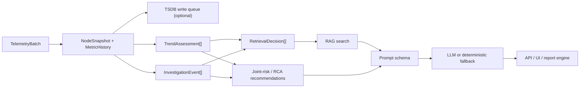

# Control-Plane Analysis

中文版本：[docs/zh/07-control-plane-analysis.md](../zh/07-control-plane-analysis.md)

This page explains how the controller turns incoming telemetry into operator-facing RCA output.

It focuses on the real stages that exist in `v0.7`:

- normalization and history retention
- single-variable trend analysis
- multivariate weak-signal fusion
- gating for retrieval and LLM use
- recommendation generation

The key design choice is simple:

> The control plane does not send raw node telemetry straight into RAG or an LLM. It first converts telemetry into structured evidence that is smaller, easier to audit, and cheaper to reason over.

## Why This Stage Exists

If the controller skipped preprocessing and only dumped hot telemetry into prompts:

- trend direction would be mixed together with one-time spikes
- multivariate patterns would stay hidden until one metric became catastrophic
- RAG queries would be noisy and generic
- prompt size and cost would grow faster than diagnostic value
- repeated unchanged situations would trigger repeated expensive work

That is why the project separates:

1. symptom detection
2. evidence compression
3. root-cause reasoning
4. recommendation output

For business readers: this is the part that reduces alert fatigue and makes the final answer more actionable than “CPU is high.”

## Why The Control Plane Separates Symptom Detection From Root-Cause Reasoning

The controller deliberately does not collapse every step into one “AI decision.”

| Layer | Main question | Real outputs in this repo | Why it is kept separate |
| --- | --- | --- | --- |
| symptom detection | “What changed or is getting worse?” | `TrendAssessment`, deterministic findings, telemetry-quality flags | this layer must stay cheap, auditable, and robust even when RAG or LLM is off |
| weak-signal fusion | “Do several moderate symptoms point to one likely problem?” | `InvestigationEvent`, `JointRiskCooccurrence`, scope risks | this layer reduces noise before retrieval or model use |
| root-cause reasoning | “Given the structured evidence and optional knowledge hits, what is the most likely explanation?” | joint-risk verdicts, RCA hypotheses, `QueryResponse.root_cause` | this is where RAG and the LLM can add value, but only after the evidence is compressed |
| recommendation output | “What should the operator do next, in low-risk order?” | workflow recommendations, checks, retrieved commands, remediation steps | action guidance should be tied to evidence, not inferred from raw telemetry alone |

If these layers were merged too early, the system would be harder to audit, more expensive to run, and more likely to attach irrelevant retrieval or model output to weak evidence.

## File Map

| File | What it owns |
| --- | --- |
| [`../../backend/internal/controller/ingest/store.go`](../../backend/internal/controller/ingest/store.go) | normalized `NodeSnapshot` hot state and metric history |
| [`../../backend/internal/controller/timeseries/service.go`](../../backend/internal/controller/timeseries/service.go) | optional TSDB write queue, batching, fallback-to-memory history |
| [`../../backend/internal/controller/agentcore/workflow_eventization.go`](../../backend/internal/controller/agentcore/workflow_eventization.go) | trend assessments, baseline drift, investigation events |
| [`../../backend/internal/controller/agentcore/workflow_recommendations.go`](../../backend/internal/controller/agentcore/workflow_recommendations.go) | event-specific checks, knowledge-backed recommendation helpers, top trend and weak-signal selection |
| [`../../backend/internal/controller/agentcore/workflow_engine.go`](../../backend/internal/controller/agentcore/workflow_engine.go) | joint-risk workflow, RCA workflow, retrieval decisions, recommendation generation |
| [`../../backend/internal/controller/agentcore/incident_decision.go`](../../backend/internal/controller/agentcore/incident_decision.go) | incident synthesis and recommendation shaping |
| [`../../backend/internal/controller/agentcore/agent.go`](../../backend/internal/controller/agentcore/agent.go) | query-service path, prompt input, RAG/LLM gating, fallback response |
| [`../../backend/internal/controller/agentcore/prompts.go`](../../backend/internal/controller/agentcore/prompts.go) | compact evidence schema sent to the model |
| [`../../backend/internal/controller/rag/service.go`](../../backend/internal/controller/rag/service.go) | retrieval runtime and result serving |

## High-Level Flow



## Stage 1: Normalization and Hot State

Problem before this stage:

- incoming batches are transport objects, not controller reasoning objects
- suppressed fields from the collector must be carried forward explicitly

Current implementation:

- [`../../backend/internal/controller/ingest/server.go`](../../backend/internal/controller/ingest/server.go) receives `TelemetryBatch`
- [`../../backend/internal/controller/ingest/store.go`](../../backend/internal/controller/ingest/store.go) writes:
  - `NodeSnapshot.Metrics`
  - `NodeSnapshot.Processes`
  - `NodeSnapshot.Logs`
  - structured process, storage, filesystem, security, and runtime context
  - `MetricHistorySample`

Why it is necessary:

- every later controller stage works from normalized state, not from raw transport batches
- collector-side suppression only stays safe because ingest knows how to reconstruct carried-forward state

Risk if omitted:

- prompt generation, workflows, UI, and RAG would each have to decode raw transport payloads differently

## Stage 2: Time-Series Retention and TSDB Writes

The controller does not write every metric to history. It keeps a trend-safe subset.

Actual code path:

- [`../../backend/internal/controller/ingest/history_provider.go`](../../backend/internal/controller/ingest/history_provider.go)
- [`../../backend/internal/controller/ingest/store.go`](../../backend/internal/controller/ingest/store.go)
- [`../../backend/internal/controller/timeseries/service.go`](../../backend/internal/controller/timeseries/service.go)

### What gets written and why

[`aggregateBatchMetrics`](../../backend/internal/controller/timeseries/service.go) only persists metrics that satisfy `ingest.IsTrendMetric(...)`.

Why:

- trend analysis needs retained history for a small, stable metric subset
- the controller does not need every low-level label explosion in the TSDB queue

Examples of trend-safe metrics:

- `node_cpu_usage_percent`
- `node_memory_Used_bytes`
- `node_disk_request_latency_p99_seconds`
- `node_tcp_retransmit_ratio`
- `node_pressure_io_full_avg10`
- `collector_self_cpu_percent`
- `collector_protection_spool_fill_ratio`

### Why the TSDB write queue exists

Problem before this stage:

- synchronous TSDB writes would sit directly in the ingest hot path

Current behavior:

- [`Service.queue`](../../backend/internal/controller/timeseries/service.go) is a bounded channel of aggregated point batches
- `ProcessBatch(...)` drops the batch if the queue is full
- `runWriter(...)` flushes by batch size and time interval
- if TSDB is disabled or degraded, reads fall back to the in-memory history provider

What problem it solves:

- it isolates ingest from short TSDB stalls
- it bounds memory with `WriteQueueSize`
- it makes TSDB an optional accelerator instead of a hard dependency for controller liveness

Tradeoff:

- a full TSDB queue can drop durable-history batches
- hot in-memory controller state still exists, but long-window history may be thinner

### What goes to TSDB, and what does not

| Data shape | Current treatment | Why |
| --- | --- | --- |
| stable numeric node metrics | written to in-memory history and optional TSDB queue | they support slope, drift, and persistence analysis |
| full process lists | kept in hot state, not written as TSDB points | they change shape often and are better for attribution than for time-series math |
| log fingerprints | kept in hot state and log index, not as TSDB metric series | they are evidence objects, not good long-window numeric history |
| low-churn runtime inventory | carried in hot state and periodically refreshed | storing it as dense time series adds cost with little diagnostic value |
| suppression markers and protection counters | partly retained as trend metrics when they affect trust or collector health | the controller needs history for “is telemetry itself degrading?” questions |

## Stage 3: Single-Variable Trend Path

This is the controller’s “one signal is getting worse over time” path.

### What it is for

It catches problems such as:

- memory usage rising steadily toward exhaustion
- disk latency worsening before a full outage
- retransmit ratio increasing even when traffic still mostly works
- GPU temperature or memory pressure creeping upward

### Actual implementation

- risk series definitions: [`riskSeriesSpecs()`](../../backend/internal/controller/agentcore/workflow_eventization.go)
- thresholds and weights: [`riskSignalProfiles()`](../../backend/internal/controller/agentcore/workflow_eventization.go)
- mechanics:
  - `averageSlopePerMinute(...)`
  - `thresholdBreaches(...)`
  - `trailingPersistence(...)`
  - `classifySeriesTrend(...)`
  - `trendSeverity(...)`
  - `trendConfidence(...)`
  - `buildTrendAssessments(...)`

### Why it exists

Hard thresholds alone are too late for many operational problems. A rising latency or memory curve matters even before the “red line” is crossed.

### What would be missed without it

- slow deterioration
- repeated soft breaches that never trip one catastrophic rule
- early warning cases where the safe action is still available

### Concrete example

Illustrative values consistent with the current code:

```text
memory_used_mb: 13240 -> 13680 -> 14020 -> 14320
memory_total_mb: 16384
memory_usage_pct: 80.8 -> 83.5 -> 85.6 -> 87.4
```

Controller interpretation:

```json
{
  "series_key": "memory_pressure",
  "trend": "rising",
  "severity": "medium",
  "delta_percent": 8.2,
  "slope_per_minute": 0.63,
  "persistence_points": 3,
  "triggered": true,
  "summary": "Memory usage is rising: latest 87.400 vs baseline 80.800 ..."
}
```

Why it matters:

- the controller can recommend checking reclaim pressure and top RSS processes before an OOM event happens

## Stage 4: Multivariate Weak-Signal Path

This is the controller’s “several moderate signals together imply a likely future issue” path.

### What it is for

It catches patterns such as:

- moderate CPU iowait + rising disk latency + queue growth
- modest memory growth + reclaim pressure + service timeouts
- small NIC drops + retransmit increase + higher service latency

### Actual implementation

- cooccurrence and risk clustering in [`../../backend/internal/controller/agentcore/workflow_engine.go`](../../backend/internal/controller/agentcore/workflow_engine.go)
- event promotion in [`buildInvestigationEvents`](../../backend/internal/controller/agentcore/workflow_eventization.go)
- event-specific checks in [`../../backend/internal/controller/agentcore/workflow_recommendations.go`](../../backend/internal/controller/agentcore/workflow_recommendations.go)

### Why it exists

Many real incidents do not begin with one obvious red metric. They begin with several modest warnings that only make sense together.

### What would be missed without it

- hidden degradation that stays “below threshold” on each individual signal
- false reassurance from looking at one dashboard card at a time

### Concrete example

Illustrative but code-consistent values:

```text
cpu_iowait_pct = 18.2
disk_await_ms = 31.4
node_disk_queue_depth_total = 22
log_burst = 12
```

Controller interpretation:

```json
{
  "category": "weak_signal_cluster",
  "title": "Compound signal cluster: io_latency + io_pressure + log_burst",
  "confidence": 0.74,
  "probable_cause": "storage or IO bottleneck",
  "summary": "storage contention is building before a hard outage"
}
```

Why both paths are needed:

| Path | Best at catching | What it misses if used alone |
| --- | --- | --- |
| single-variable trend path | one signal deteriorating over time | multi-signal patterns where each metric stays moderate |
| multivariate weak-signal path | combined low-severity symptoms | slow deterioration in one key metric with little supporting noise |

## Stage 5: Eventization Before Retrieval

The controller now retrieves from structured evidence, not just from flat telemetry text.

Actual objects:

- `TrendAssessment`
- `InvestigationEvent`
- `RetrievalDecision`

Why this stage exists:

- retrieval queries work better when they describe the symptom pattern, not just raw metrics
- it reduces token and query noise
- it makes retrieval auditable in APIs and the UI

Example retrieval decision:

```json
{
  "tool": "runbook_retrieval",
  "intent": "runbook",
  "query": "memory pressure rising disk latency increasing reclaim io contention",
  "evidence_signals": ["memory_pressure", "io_latency"],
  "skipped": false
}
```

Example skip case:

```json
{
  "tool": "rag_query",
  "intent": "general",
  "skipped": true,
  "skip_reason": "insufficient symptom context"
}
```

## Stage 6: Prompt Assembly and LLM Gating

The prompt path uses compact evidence, not the full raw controller state.

Main files:

- [`../../backend/internal/controller/agentcore/agent.go`](../../backend/internal/controller/agentcore/agent.go)
- [`../../backend/internal/controller/agentcore/prompts.go`](../../backend/internal/controller/agentcore/prompts.go)

What is intentionally sent to the model:

- telemetry quality summary
- compact metrics
- deterministic findings
- trend assessments
- investigation events
- bounded retrieved evidence

What is intentionally not sent in full:

- the entire `NodeSnapshot`
- every device/process/log line
- raw collector batches

Why:

- lower token cost
- lower prompt noise
- easier reasoning trace

## Stage 7: Recommendation Generation

The controller now builds recommendations from the structured evidence layers, not only from generic thresholds.

Actual recommendation sources:

- top deteriorating trend
- top triggered risk signals
- strongest weak-signal cluster
- top RCA hypotheses
- retrieved similar cases and runbooks

Current logic lives in:

- [`stepJointRiskRecommendations`](../../backend/internal/controller/agentcore/workflow_engine.go)
- [`stepRCARecommendations`](../../backend/internal/controller/agentcore/workflow_engine.go)
- [`../../backend/internal/controller/agentcore/workflow_recommendations.go`](../../backend/internal/controller/agentcore/workflow_recommendations.go)

What changed in this pass:

- trend-specific checks now become first-class recommendations
- weak-signal clusters now generate their own validation recommendation instead of staying implicit
- retrieved runbook commands and remediation steps can be promoted into recommendation checks

Illustrative output:

```json
{
  "summary": "Validate correlated weak-signal cluster on checkout-api",
  "checks": [
    "inspect disk queue depth and latency",
    "identify io-heavy processes",
    "verify that the same signals overlap in the same collector and time window",
    "run: iostat -x 1 5"
  ],
  "safe": true,
  "dry_run_default": true,
  "confidence": 0.74
}
```

This is closer to a useful operator output than “something seems wrong.”

## End-to-End Example: RAG-Assisted Diagnosis

Illustrative values:

```text
memory_usage_pct = 87.4
disk_await_ms = 41.7
cpu_iowait_pct = 28.4
nic_rx_drops = 134
log_burst = 12
```

### 1. Normalized controller state

`NodeSnapshot.Metrics` carries the current values. `MetricHistorySample` carries the recent window.

### 2. Trend path result

- `memory_pressure` => rising
- `io_latency` => worsening

### 3. Weak-signal result

- `memory_pressure + io_latency + timeout logs` => `weak_signal_cluster`

### 4. Retrieval query

```text
memory pressure rising disk latency increasing timeout rollout reclaim io contention
```

### 5. Retrieved evidence

Illustrative hit shape based on the real struct:

```json
{
  "title": "Runbook: memory reclaim plus storage wait after rollout",
  "knowledge_type": "runbook",
  "score": 0.82,
  "remediation_steps": [
    "check top RSS processes",
    "verify writeback pressure",
    "pause rollout only after confirming latency source"
  ],
  "commands": [
    "vmstat 1 5",
    "iostat -x 1 5"
  ]
}
```

### 6. Prompt effect

The prompt now contains:

- trend summary
- weak-signal event summary
- retrieved runbook snippet
- compact telemetry schema

### 7. Final diagnosis shape

Expected operator-facing outcome:

- probable cause: reclaim pressure and storage wait are amplifying each other
- safe next checks:
  - inspect top RSS processes
  - inspect disk queue depth and latency
  - run `vmstat 1 5`
  - run `iostat -x 1 5`

## How to Validate Locally

1. run the controller with agent workflow enabled
2. query:
   - `/api/v1/agent/joint-risk?limit=5`
   - `/api/v1/agent/rca?limit=5`
   - `/api/v1/agent/status`
3. confirm:
   - `trend_assessments` is populated on deteriorating nodes
   - `investigation_events` includes `weak_signal_cluster` when cooccurrence is present
   - `control_plane.triggered_trends` and `control_plane.weak_signal_clusters` match the latest reports
   - `control_plane.top_recommendation` matches the latest promoted next step

## Remaining Limits

- trend logic is heuristic, not a learned forecaster
- weak-signal fusion is explicit and readable, not a causal graph engine
- retrieval planning is selective but still rule-driven
- recommendations can promote retrieved commands, but the system does not claim those commands are always safe in every environment

See also:

- [Data Flow](05-data-flow.md)
- [Collector Queue and Compaction](06-collector-queue-and-compaction.md)
- [Dataset and RAG](11-dataset-and-rag.md)
- [Prompts and Customization](12-prompts-and-customization.md)
