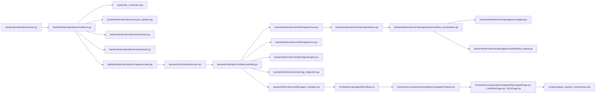

# Codebase Map

中文版本：[docs/zh/09-codebase-map.md](../zh/09-codebase-map.md)

This page is a navigation guide for engineers who need to move from "I understand the product" to "I know where the important code lives."

It does not try to document every helper package. Instead, it explains why the repository is split into these directories, how the major runtime paths connect, and where to look when you need to change a specific part of the system.

## Why This Map Exists

The repository has multiple execution environments and more than one reasoning path:

- host-local telemetry collection
- controller-side ingest and storage
- controller-side retrieval and prompting
- controller-side workflow and early-warning logic
- a separate web UI and deployment layer

Without a codebase map, a new contributor can identify the feature names but still not know which files own the real execution path.

## Repository At A Glance

```text
ai_sre_agent_pub/
├── backend/
│   ├── cmd/                  # Go entrypoints: collector, controller, ragctl, security-audit
│   └── internal/
│       ├── collector/        # Host-local collection, batching, protection, spool, transport
│       └── controller/       # Ingest, APIs, RAG, workflows, stores, analysis
├── cpp/
│   └── probe_core/           # Native host/process/GPU probe runtime used by collector
├── frontend/
│   └── src/                  # React UI and API clients
├── configs/                  # Default runtime configuration and playbooks
├── dataset/                  # Seed knowledge sources for controller-side RAG
├── deploy/                   # Docker, Kubernetes, Helm, and systemd assets
├── docs/                     # Bilingual guides and deeper reference docs
├── scripts/                  # Local run, build, bootstrap, test, and publish helpers
└── tests/                    # Integration, E2E, and UI tests outside backend unit tests
```

## Core Execution Path Through The Code



The most important architectural point is that collection happens near the host, while heavier storage, retrieval, and reasoning happen in the controller. The repository layout reflects that split directly.

## Main Source Areas

### 1. Go Entrypoints

This layer exists so each runtime role has a clean process boundary and its own configuration bootstrap path.

| Path | Why it exists | What it starts |
| --- | --- | --- |
| [`../../backend/cmd/collector/`](../../backend/cmd/collector/) | defines the collector process lifecycle | host-local collection, metrics endpoint, config reload |
| [`../../backend/cmd/controller/`](../../backend/cmd/controller/) | defines the controller process lifecycle | ingest, API server, UI hosting, RAG, workflows |
| [`../../backend/cmd/ragctl/`](../../backend/cmd/ragctl/) | exposes RAG maintenance without starting the full controller | `status`, `query`, `update`, `rebuild` |
| [`../../backend/cmd/security-audit/`](../../backend/cmd/security-audit/) | standalone security-audit entrypoint | collector-side security checks and reporting |

If these entrypoints are unclear, it becomes difficult to tell whether a behavior belongs to a long-running service, a CLI utility, or a deployment wrapper.

### 2. Host-Side Collection Runtime

This layer exists because short-lived host evidence, kernel events, and local backpressure need to be handled on the observed node, not reconstructed centrally after the fact.

| Path | Responsibility | Typical questions it answers |
| --- | --- | --- |
| [`../../backend/internal/collector/`](../../backend/internal/collector/) | collector orchestration, batching, transport, self-protection, hardware profiling | How is telemetry sampled, bounded, and shipped? |
| [`../../backend/internal/collector/aux_sampling.go`](../../backend/internal/collector/aux_sampling.go) | slower cadence and cache reuse for compatibility process scans, logs, and external metrics | Why did helper collectors stop running every main loop? |
| [`../../backend/internal/collector/process_payload_suppression.go`](../../backend/internal/collector/process_payload_suppression.go) | suppresses near-identical hot-process payloads between bounded refreshes | Why did the collector stop resending the same top-process list every cycle? |
| [`../../backend/internal/collector/probe/cadence.go`](../../backend/internal/collector/probe/cadence.go) | tiered pacing for the legacy Go compatibility probe plus anomaly-triggered deep refresh | Why is fallback mode cheaper in calm periods but still deeper during incidents? |
| [`../../backend/internal/collector/probe/`](../../backend/internal/collector/probe/) | compatibility collectors and extended `/proc` or sysfs probing | What still works when probe-core or eBPF is unavailable? |
| [`../../backend/internal/collector/probe/ebpf/`](../../backend/internal/collector/probe/ebpf/) | event-oriented kernel visibility | Where do runtime/security/kernel events enter? |
| [`../../backend/internal/collector/probecore/`](../../backend/internal/collector/probecore/) | Go client for the native probe-core binary | How does collector talk to the C++ probe runtime? |
| [`../../cpp/probe_core/`](../../cpp/probe_core/) | native host/process/network/GPU probing | Where does primary host telemetry actually come from? |

If this layer is missing or misread, the rest of the controller docs look cleaner than reality because the cost and failure modes of telemetry collection are hidden.

### 3. Controller Runtime And Control Plane

This layer exists because the project intentionally keeps controller-side storage, retrieval, and APIs away from the monitored host.

| Path | Responsibility | Typical questions it answers |
| --- | --- | --- |
| [`../../backend/internal/controller/controller.go`](../../backend/internal/controller/controller.go) | composition root for controller services | What does the controller actually wire together? |
| [`../../backend/internal/controller/ingest/`](../../backend/internal/controller/ingest/) | gRPC ingest, in-memory state, embedded persistence | How does telemetry become queryable state? |
| [`../../backend/internal/controller/timeseries/`](../../backend/internal/controller/timeseries/) | optional durable metric history | How are longer trend windows stored? |
| [`../../backend/internal/controller/agentcore/workflow_eventization.go`](../../backend/internal/controller/agentcore/workflow_eventization.go) | trend assessment, weak-signal fusion, and retrieval planning | Where does the control plane turn raw state into ranked investigation evidence? |
| [`../../backend/internal/controller/logindex/`](../../backend/internal/controller/logindex/) | log indexing for evidence retrieval | Where do log fingerprints become searchable? |
| [`../../backend/internal/controller/gpuobs/`](../../backend/internal/controller/gpuobs/) | GPU fleet snapshots and history | Where are GPU timelines and summaries aggregated? |
| [`../../backend/internal/controller/inventory/`](../../backend/internal/controller/inventory/) | fleet inventory and grouping | How does the controller keep topology and host identity state? |

### 4. Retrieval, Prompting, And Reasoning

This layer exists because static prompting alone cannot supply environment-specific runbooks, historical incidents, and operational evidence.

| Path | Responsibility | Why it matters |
| --- | --- | --- |
| [`../../backend/internal/controller/rag/`](../../backend/internal/controller/rag/) | dataset discovery, normalization, chunking, indexing, retrieval | turns repository data into retrievable operational knowledge |
| [`../../backend/internal/controller/rag_integration.go`](../../backend/internal/controller/rag_integration.go) | controller HTTP handlers for RAG | exposes RAG to the UI and operators |
| [`../../backend/internal/controller/agentcore/`](../../backend/internal/controller/agentcore/) | query-service prompt assembly, workflow tools, safety validation | defines how telemetry and evidence become LLM-ready context |
| [`../../backend/internal/controller/agent/`](../../backend/internal/controller/agent/) | scheduled early-warning and incident logic | generates periodic reports and policy-driven analysis |
| [`../../backend/internal/controller/analysis/`](../../backend/internal/controller/analysis/) | separate analysis-engine LLM path | keeps older or alternate analysis flows isolated |

### 5. UI And API Consumption Layer

This layer exists so operators can consume controller output without linking the frontend directly to internal stores.

| Path | Responsibility |
| --- | --- |
| [`../../frontend/src/main.tsx`](../../frontend/src/main.tsx) | boots the React app and applies stored theme state |
| [`../../frontend/src/App.tsx`](../../frontend/src/App.tsx) | top-level shell, page routing, and navigation between controller surfaces |
| [`../../frontend/src/api/`](../../frontend/src/api/) | typed HTTP client wrappers for controller APIs |
| [`../../frontend/src/api/agentWorkflows.ts`](../../frontend/src/api/agentWorkflows.ts) | shared types for trends, investigation events, retrieval decisions, and RCA payloads |
| [`../../frontend/src/components/Insights/InvestigationPanels.tsx`](../../frontend/src/components/Insights/InvestigationPanels.tsx) | shared evidence-first panels for control-plane output |
| [`../../frontend/src/components/Insights/RiskInsightsPage.tsx`](../../frontend/src/components/Insights/RiskInsightsPage.tsx) | risk-oriented investigation console |
| [`../../frontend/src/components/Insights/JointRiskPage.tsx`](../../frontend/src/components/Insights/JointRiskPage.tsx) | correlated-risk and weak-signal verdict screen |
| [`../../frontend/src/components/Insights/RCAPage.tsx`](../../frontend/src/components/Insights/RCAPage.tsx) | incident-level RCA console with evidence chain |

### 6. Configuration, Deployment, And Bootstrap

This layer exists because the same codebase must run in local source mode, containerized mode, and cluster deployments.

| Path | Responsibility |
| --- | --- |
| [`../../configs/`](../../configs/) | default YAML configs, container configs, playbooks, environment overlays |
| [`../../scripts/`](../../scripts/) | local bootstrap, docker wrappers, smoke tests, dataset bootstrap helpers |
| [`../../deploy/`](../../deploy/) | Docker Compose fragments, Kubernetes manifests, Helm chart, systemd services |
| [`../../Makefile`](../../Makefile) | canonical build, test, run, and RAG maintenance entrypoints |

Deployment-specific files that matter now:

- [`../../backend/internal/collector/deployment.go`](../../backend/internal/collector/deployment.go) rewrites default collector paths for non-local modes and adds cluster/deployment labels
- [`../../backend/internal/controller/deployment.go`](../../backend/internal/controller/deployment.go) rewrites default controller paths and feeds `/api/v1/status.deployment`
- [`../../deploy/k8s/push-first/`](../../deploy/k8s/push-first/) is the raw `cluster-lite` manifest set
- [`../../deploy/charts/sre-agent/templates/controller-configmap.yaml`](../../deploy/charts/sre-agent/templates/controller-configmap.yaml) and [`../../deploy/charts/sre-agent/templates/collector-configmap.yaml`](../../deploy/charts/sre-agent/templates/collector-configmap.yaml) are the Helm config injection points
- [`../../deploy/k8s/push-first/collector-daemonset.yaml`](../../deploy/k8s/push-first/collector-daemonset.yaml) and [`../../deploy/charts/sre-agent/templates/collector-daemonset.yaml`](../../deploy/charts/sre-agent/templates/collector-daemonset.yaml) inject `spec.nodeName` into `SRE_COLLECTOR_ID` and `SRE_COLLECTOR_HOSTNAME`, which is how node-local identity stays stable in cluster rollouts

One script in this layer now matters to documentation quality too:

- [`../../scripts/capture_readme_screenshots.mjs`](../../scripts/capture_readme_screenshots.mjs) is the maintained headless screenshot path for README and UI-guide images
- it waits through warmup plus a post-ready stabilization window before capture so the screenshots reflect real loaded controller data instead of shell placeholders

## Where To Look By Task

| If you need to... | Start here | Then read |
| --- | --- | --- |
| understand startup and runtime boundaries | [`../../backend/cmd/controller/main.go`](../../backend/cmd/controller/main.go), [`../../backend/cmd/collector/main.go`](../../backend/cmd/collector/main.go) | [core-files.md](10-core-files.md), [architecture.md](04-architecture.md) |
| change collector pacing, load shedding, or overhead limits | [`../../backend/internal/collector/protection.go`](../../backend/internal/collector/protection.go), [`../../backend/internal/collector/aux_sampling.go`](../../backend/internal/collector/aux_sampling.go) | [`../../backend/internal/collector/collector.go`](../../backend/internal/collector/collector.go), [hardware-considerations.md](14-hardware-considerations.md) |
| change compatibility-fallback tier pacing or anomaly-triggered deep refresh | [`../../backend/internal/collector/probe/cadence.go`](../../backend/internal/collector/probe/cadence.go) | [`../../backend/internal/collector/probe/collector.go`](../../backend/internal/collector/probe/collector.go), [metrics-and-signals.md](13-metrics-and-signals.md) |
| change hardware detection or hardware-aware sampling | [`../../backend/internal/collector/hardware_profile.go`](../../backend/internal/collector/hardware_profile.go) | [`../../configs/collector.yaml`](../../configs/collector.yaml), [metrics-and-signals.md](13-metrics-and-signals.md) |
| change how probe-core data becomes Go telemetry | [`../../backend/internal/collector/probe_core_convert.go`](../../backend/internal/collector/probe_core_convert.go) | [`../../cpp/probe_core/main.cpp`](../../cpp/probe_core/main.cpp) |
| change ingest validation or dedupe | [`../../backend/internal/controller/ingest/server.go`](../../backend/internal/controller/ingest/server.go) | [`../../backend/internal/controller/ingest/store.go`](../../backend/internal/controller/ingest/store.go) |
| change trend logic, weak-signal fusion, or retrieval planning | [`../../backend/internal/controller/agentcore/workflow_eventization.go`](../../backend/internal/controller/agentcore/workflow_eventization.go) | [`../../backend/internal/controller/agentcore/workflow_engine.go`](../../backend/internal/controller/agentcore/workflow_engine.go), [`../../backend/internal/controller/agentcore/incident_decision.go`](../../backend/internal/controller/agentcore/incident_decision.go) |
| change the RAG dataset or indexing behavior | [`../../backend/internal/controller/rag/ingest.go`](../../backend/internal/controller/rag/ingest.go), [`../../backend/internal/controller/rag/retriever.go`](../../backend/internal/controller/rag/retriever.go) | [dataset-and-rag.md](11-dataset-and-rag.md), [`../../dataset/README.md`](../../dataset/README.md) |
| change prompt wording or safety behavior | [`../../backend/internal/controller/agentcore/prompts.go`](../../backend/internal/controller/agentcore/prompts.go), [`../../backend/internal/controller/agentcore/llm_safety.go`](../../backend/internal/controller/agentcore/llm_safety.go) | [prompts-and-customization.md](12-prompts-and-customization.md) |
| change scheduled reports and early-warning policy | [`../../backend/internal/controller/agent/engine.go`](../../backend/internal/controller/agent/engine.go), [`../../backend/internal/controller/agent/report_dedupe.go`](../../backend/internal/controller/agent/report_dedupe.go) | [`../../backend/internal/controller/agent/policy.go`](../../backend/internal/controller/agent/policy.go) |
| change workflow tools and tool-driven RCA | [`../../backend/internal/controller/agentcore/workflow_engine.go`](../../backend/internal/controller/agentcore/workflow_engine.go) | [`../../backend/internal/controller/agentcore/actions.go`](../../backend/internal/controller/agentcore/actions.go), [`../../backend/internal/controller/agentcore/trace_store.go`](../../backend/internal/controller/agentcore/trace_store.go) |
| change investigation-console UI structure | [`../../frontend/src/components/Insights/InvestigationPanels.tsx`](../../frontend/src/components/Insights/InvestigationPanels.tsx), [`../../frontend/src/components/Insights/RiskInsightsPage.tsx`](../../frontend/src/components/Insights/RiskInsightsPage.tsx), [`../../frontend/src/components/Insights/JointRiskPage.tsx`](../../frontend/src/components/Insights/JointRiskPage.tsx), [`../../frontend/src/components/Insights/RCAPage.tsx`](../../frontend/src/components/Insights/RCAPage.tsx) | [ui-guide.md](08-ui-guide.md), [`../../frontend/src/api/agentWorkflows.ts`](../../frontend/src/api/agentWorkflows.ts) |
| refresh README and UI-guide screenshots | [`../../scripts/capture_readme_screenshots.mjs`](../../scripts/capture_readme_screenshots.mjs) | [ui-guide.md](08-ui-guide.md), [`../../docs/images/`](../../docs/images/) |
| change local bring-up or demo behavior | [`../../scripts/run-local.sh`](../../scripts/run-local.sh) | [`../../Makefile`](../../Makefile), [`../../docker-compose.yaml`](../../docker-compose.yaml) |

## Three Concrete Change Paths

### 1. Collector CPU Is Too High On One Node

Use this reading order when an operator says "monitoring itself is getting expensive":

1. [`../../backend/internal/collector/collector.go`](../../backend/internal/collector/collector.go)
   Look at `collectBatch` first. It shows which work runs every cycle and which paths can be shed.
2. [`../../backend/internal/collector/aux_sampling.go`](../../backend/internal/collector/aux_sampling.go)
   This is where compatibility process scans, log tailing, and external metrics were moved onto slower cached cadences.
3. [`../../backend/internal/collector/probe/cadence.go`](../../backend/internal/collector/probe/cadence.go)
   This is where the legacy Go fallback stopped treating extended, deep, RCA, kernel-event, and GPU helpers as one refresh loop.
4. [`../../backend/internal/collector/protection.go`](../../backend/internal/collector/protection.go)
   This is where the collector decides to enter `normal`, `incident`, `pressure`, or `critical` mode and disable optional work.
5. [`../../backend/internal/collector/hardware_profile.go`](../../backend/internal/collector/hardware_profile.go)
   This is where large CPU, NUMA, GPU, and NIC profiles change sub-collector sample multipliers.
6. [`../../configs/collector.yaml`](../../configs/collector.yaml)
   This is where the operator-visible defaults live: `collection_interval`, `probe_core.*interval_samples`, and `protection.*`.

Concrete debug clues:

- `collector_self_cpu_percent`
- `collector_protection_mode`
- `collector_aux_collection_cache_hit{component="logs"}`
- `collector_aux_collection_interval_seconds{component="process_fallback"}`
- `collector_aux_payload_suppressed{component="process_fallback"}`
- `collector_process_payload_suppressed`
- `collector_compat_collection_interval_seconds{component="deep"}`
- `collector_compat_collection_interval_seconds{component="hardware"}`
- `collector_compat_collection_anomaly_triggered{component="deep"}`
- `collector_process_fallback_shed`
- `collector_hardware_warning_total`

If you only look at the top-level collector loop, it is easy to miss that the hot path now includes a slower helper-cadence layer and explicit shed signals.

### 2. RAG Answers Feel Generic Or Irrelevant

Use this reading order when retrieval-backed answers do not seem grounded:

1. [`../../backend/internal/controller/rag/service.go`](../../backend/internal/controller/rag/service.go)
   This is the controller-side lifecycle for index load, rebuild policy, and invalid-index quarantine.
2. [`../../backend/internal/controller/rag/retriever.go`](../../backend/internal/controller/rag/retriever.go)
   This is where lexical/vector/hybrid scoring is applied and hits are selected.
3. [`../../backend/internal/controller/rag/index.go`](../../backend/internal/controller/rag/index.go)
   This is where local index integrity is validated before the controller trusts it.
4. [`../../backend/internal/controller/agentcore/agent.go`](../../backend/internal/controller/agentcore/agent.go)
   This is where retrieval is attached only on the LLM path, compacted through `rag_max_findings` / `rag_max_query_chars`, filtered to remove low-value telemetry boilerplate, extended with anomaly hints when they add real symptom context, skipped when the query is too generic or telemetry is stale, suppressed when retrieval confidence is too weak, and short-circuited entirely when a recent successful analysis can be reused safely.
5. [`../../backend/internal/controller/agentcore/prompts.go`](../../backend/internal/controller/agentcore/prompts.go)
   This is where retrieved knowledge is compressed into prompt-ready evidence blocks.

Concrete debug clues:

- `make rag-status`
- `make rag-query QUERY='disk latency queue depth nvme'`
- `/api/v1/rag/status`
- quarantined `index.corrupt-*.json` files under the controller RAG storage path

If you only edit the dataset, you can still miss the real reason for weak results: stale telemetry can short-circuit retrieval entirely, and prompt compaction can intentionally remove low-value context.

### 3. The UI Is Up But Diagnosis Looks Deterministic

Use this path when the dashboard works but the agent is not using retrieval or LLM output:

1. [`../../configs/controller.yaml`](../../configs/controller.yaml)
   Confirm `agent.rag_enabled`, `agent.llm_enabled`, and `rag_rebuild_policy`.
2. [`../../backend/internal/controller/agentcore/agent.go`](../../backend/internal/controller/agentcore/agent.go)
   Read the branches that skip RAG and LLM when telemetry is stale or empty.
3. [`../../backend/internal/controller/agentcore/llm_safety.go`](../../backend/internal/controller/agentcore/llm_safety.go)
   This is where malformed or unsafe model output is rejected.
4. [`../../backend/internal/controller/agentcore/prompts.go`](../../backend/internal/controller/agentcore/prompts.go)
   This shows the compact prompt schema that the LLM actually sees.
5. [deployment.md](15-deployment.md)
   This explains the rollout and validation steps that prove whether the stack is simply in deterministic mode or actually broken.

What to expect:

- the UI can still render with `agent.llm_enabled: false`
- the controller can still answer with deterministic findings when RAG is disabled or skipped
- retrieval is intentionally not used when telemetry freshness is already too poor to justify model cost

## Common Repository Confusions

- `backend/internal/controller/agentcore/` is the main query-service and prompt assembly path. `backend/internal/controller/analysis/` is a separate analysis-engine path kept for isolation and compatibility.
- `configs/` and `configs/container/` are not duplicates by mistake. They exist because source-mode and container-mode use different filesystem roots and safer defaults.
- `dataset/` is seed knowledge for controller-side retrieval. It is not the same thing as live fleet telemetry stored through `ingest/`.
- `ragctl` is not a different RAG engine. It is a maintenance CLI over the same controller-side RAG packages used by the service.

## Code Reading Order For New Contributors

1. Read [architecture.md](04-architecture.md) to understand the runtime split.
2. Read [data-flow.md](05-data-flow.md) to understand how telemetry moves.
3. Read [core-files.md](10-core-files.md) to understand which files own the main code paths.
4. Read [dataset-and-rag.md](11-dataset-and-rag.md) and [prompts-and-customization.md](12-prompts-and-customization.md) before editing reasoning behavior.
5. Read [metrics-and-signals.md](13-metrics-and-signals.md) and [hardware-considerations.md](14-hardware-considerations.md) before changing collection behavior.

## See Also

- [Core files](10-core-files.md)
- [Architecture](04-architecture.md)
- [Data flow](05-data-flow.md)
- [Dataset and RAG](11-dataset-and-rag.md)
- [Prompts and customization](12-prompts-and-customization.md)
