# Core Files

中文版本：[docs/zh/10-core-files.md](../zh/10-core-files.md)

This page explains the important files that define the project’s real behavior. It is intentionally selective. The goal is not function-by-function API coverage. The goal is to help an engineer understand:

- what each important file is for
- why it exists
- what inputs and outputs it owns
- how it fits into the end-to-end data path
- what becomes unclear or broken if it is removed or misunderstood

## How To Read This Page

1. start with [architecture.md](04-architecture.md) or [data-flow.md](05-data-flow.md) if you want the system view first
2. use this page when you want to locate the file that owns a concrete behavior
3. follow the “next file in the path” column when tracing one feature through the codebase

## Core Execution Path

```mermaid
flowchart LR
    A["cpp/probe_core/main.cpp"] --> B["collector/probe_core_convert.go"]
    B --> C["collector/collector.go"]
    C --> D["collector/transport/client.go"]
    D --> E["controller/ingest/server.go"]
    E --> F["controller/ingest/store.go"]
    F --> G["controller/agentcore/workflow_eventization.go"]
    G --> H["controller/agentcore/workflow_engine.go"]
    G --> I["controller/agentcore/agent.go"]
    I --> J["controller/rag/*.go"]
    I --> K["controller/agentcore/prompts.go"]
    K --> L["controller/agentcore/agent.go chatClient.Complete"]
    L --> M["parseLLMPayload / fallbackPayload"]
    H --> N["agent_handlers.go / UI / reports"]
    M --> N
```

If you want to understand how one anomaly becomes one model answer, that is the file path to read.

## Concrete Handoff Objects Between Files

One reason this repository feels large to new readers is that the important boundaries are type boundaries, not just directory boundaries.

| From file | To file | Real handoff object | Why that boundary exists |
| --- | --- | --- | --- |
| [`../../cpp/probe_core/main.cpp`](../../cpp/probe_core/main.cpp) | [`../../backend/internal/collector/probe_core_convert.go`](../../backend/internal/collector/probe_core_convert.go) | `probeipcv1.ProbeBatch` | keeps native sampling separate from Go-side naming and batching contracts |
| [`../../backend/internal/collector/probe_core_convert.go`](../../backend/internal/collector/probe_core_convert.go) | [`../../backend/internal/collector/collector.go`](../../backend/internal/collector/collector.go) | `[]*telemetryv1.Metric`, `[]*telemetryv1.ProcessSample` | turns raw native output into the metric names and process summaries the rest of the system expects |
| [`../../backend/internal/collector/collector.go`](../../backend/internal/collector/collector.go) | [`../../backend/internal/collector/transport/client.go`](../../backend/internal/collector/transport/client.go) | `*telemetryv1.TelemetryBatch` | makes collection and delivery independent so backlog and retries do not corrupt the collection loop |
| [`../../backend/internal/collector/transport/client.go`](../../backend/internal/collector/transport/client.go) | [`../../backend/internal/controller/ingest/server.go`](../../backend/internal/controller/ingest/server.go) | gRPC `PushTelemetry` request/ack | gives the controller one explicit “received and accepted” boundary |
| [`../../backend/internal/controller/ingest/store.go`](../../backend/internal/controller/ingest/store.go) | [`../../backend/internal/controller/agentcore/agent.go`](../../backend/internal/controller/agentcore/agent.go) | `NodeSnapshot` plus metric history | query-service reads state, not raw transport batches |
| [`../../backend/internal/controller/ingest/store.go`](../../backend/internal/controller/ingest/store.go) | [`../../backend/internal/controller/agentcore/workflow_eventization.go`](../../backend/internal/controller/agentcore/workflow_eventization.go) | `NodeSnapshot`, baseline series, risk signal samples | converts raw controller state into trend, workload-memory, weak-signal, and retrieval-planning artifacts before deeper analysis |
| [`../../backend/internal/controller/agentcore/workflow_eventization.go`](../../backend/internal/controller/agentcore/workflow_eventization.go) | [`../../backend/internal/controller/agentcore/workflow_engine.go`](../../backend/internal/controller/agentcore/workflow_engine.go) | `TrendAssessment[]`, `BehavioralSignalAssessment[]`, `InvestigationEvent[]`, `RetrievalDecision[]` | lets the workflow reason over ranked evidence instead of raw snapshots |
| [`../../backend/internal/controller/agentcore/agent.go`](../../backend/internal/controller/agentcore/agent.go) | [`../../backend/internal/controller/agentcore/prompts.go`](../../backend/internal/controller/agentcore/prompts.go) | `PromptInput` | separates evidence selection from prompt wording |
| [`../../backend/internal/controller/agentcore/prompts.go`](../../backend/internal/controller/agentcore/prompts.go) | [`../../backend/internal/controller/agentcore/agent.go`](../../backend/internal/controller/agentcore/agent.go) | `LLMSchema`, system prompt, user prompt | makes model I/O traceable and testable |
| [`../../backend/internal/controller/agentcore/agent.go`](../../backend/internal/controller/agentcore/agent.go) | [`../../backend/internal/controller/agent_handlers.go`](../../backend/internal/controller/agent_handlers.go) | `QueryResponse` | keeps HTTP response formatting outside the reasoning loop |

If you lose track of these handoff types, it becomes easy to debug the wrong layer. Many “agent bugs” are actually metric-contract or ingest-state bugs earlier in the path.

## Example Trace: One Slow Node From Raw Metric To Final Answer

The table below follows a concrete case:

- probe-core sampled high CPU, high memory, high disk wait
- the controller built deterministic findings
- RAG returned a rollout-related runbook
- the prompt included both telemetry and the retrieved snippet

| File | Why it exists | Input in this example | Output in this example | Next file in the path | What breaks without it |
| --- | --- | --- | --- | --- | --- |
| [`../../cpp/probe_core/main.cpp`](../../cpp/probe_core/main.cpp) | primary native host sampler | raw kernel/procfs state | `probe_core_cpu_usage_percent`, `probe_core_memory_used_bytes`, `probe_core_disk_await_ms` | [`probe_core_convert.go`](../../backend/internal/collector/probe_core_convert.go) | the highest-fidelity host metrics never exist |
| [`../../backend/internal/collector/probe_core_convert.go`](../../backend/internal/collector/probe_core_convert.go) | translate native counters into controller-facing names | `probe_core_*` metrics | `node_cpu_usage_percent`, `node_memory_Used_bytes`, `node_disk_request_latency_p99_seconds` | [`collector.go`](../../backend/internal/collector/collector.go) | downstream code does not see the expected metric names |
| [`../../backend/internal/collector/collector.go`](../../backend/internal/collector/collector.go) | collector orchestration and batching | normalized metrics, process samples, logs | `TelemetryBatch` plus collector self-metrics | [`transport/client.go`](../../backend/internal/collector/transport/client.go) | collection, protection, and delivery logic become inseparable |
| [`../../backend/internal/collector/probe/cadence.go`](../../backend/internal/collector/probe/cadence.go) | legacy Go compatibility tier pacing and anomaly-triggered refresh | compatibility fallback metrics and base collector interval | cached runtime/hardware/deep/kernel/RCA/GPU refresh decisions plus `collector_compat_collection_*` and `collector_compat_payload_*` metrics | [`probe/collector.go`](../../backend/internal/collector/probe/collector.go) | fallback mode either becomes too expensive or too blind because every helper shares one cadence |
| [`../../backend/internal/collector/transport/client.go`](../../backend/internal/collector/transport/client.go) | bounded delivery and retry | serialized batch from collector/spool | gRPC delivery, ack handling, retry state | [`ingest/server.go`](../../backend/internal/controller/ingest/server.go) | transport failures look like collector failures |
| [`../../backend/internal/controller/ingest/server.go`](../../backend/internal/controller/ingest/server.go) | validate and accept telemetry | `TelemetryBatch` | store writes and `batch_id` ack | [`ingest/store.go`](../../backend/internal/controller/ingest/store.go) | there is no clear boundary between “received” and “trusted” telemetry |
| [`../../backend/internal/controller/ingest/store.go`](../../backend/internal/controller/ingest/store.go) | hot node state | metrics, processes, logs, runtime context | `NodeSnapshot` and metric history | [`agentcore/agent.go`](../../backend/internal/controller/agentcore/agent.go) | the controller has no authoritative current state; it also owns carry-forward of suppressed low-churn and slow compatibility hardware state |
| [`../../backend/internal/controller/agentcore/workflow_eventization.go`](../../backend/internal/controller/agentcore/workflow_eventization.go) | build trend and weak-signal evidence before retrieval or operator output | `NodeSnapshot`, baseline history, risk signals, predictive evaluation, behavioral-memory classifications | `TrendAssessment[]`, `InvestigationEvent[]`, `RetrievalDecision[]` | [`workflow_engine.go`](../../backend/internal/controller/agentcore/workflow_engine.go), [`agent.go`](../../backend/internal/controller/agentcore/agent.go), UI pages | without it, the control plane falls back to flatter threshold findings and generic retrieval queries |
| [`../../backend/internal/controller/agentcore/agent.go`](../../backend/internal/controller/agentcore/agent.go) | screening, findings, retrieval call, analysis reuse, LLM call, fallback | `NodeSnapshot`, history, optional GPU state, user query | `PromptInput`, `QueryResponse` | [`prompts.go`](../../backend/internal/controller/agentcore/prompts.go), [`rag/service.go`](../../backend/internal/controller/rag/service.go) | the system cannot explain how telemetry becomes reasoning input or why repeated identical queries stop paying the full RAG/LLM cost |
| [`../../backend/internal/controller/rag/service.go`](../../backend/internal/controller/rag/service.go) | retrieval service lifecycle | dataset, index, query | `QueryResult`, `SearchHit` | [`prompts.go`](../../backend/internal/controller/agentcore/prompts.go) | RAG appears as magic context with no provenance |
| [`../../backend/internal/controller/agentcore/prompts.go`](../../backend/internal/controller/agentcore/prompts.go) | system/user prompt builders and schema | `PromptInput` with findings and RAG hits | final system prompt, user prompt, `LLMSchema` | [`agent.go`](../../backend/internal/controller/agentcore/agent.go) | prompt structure and evidence contract become invisible |
| [`../../backend/internal/controller/agentcore/agent.go`](../../backend/internal/controller/agentcore/agent.go) | `chatClient.Complete`, `parseLLMPayload`, `fallbackPayload` | assembled prompts | parsed JSON answer or deterministic fallback | [`agent_handlers.go`](../../backend/internal/controller/agent_handlers.go) | model I/O, validation, and fallback behavior are impossible to trace |

## Entrypoints And Runtime Assembly

These files exist so each runtime role has a clear process boundary. Without them, lifecycle, config loading, and deployment behavior would be scattered across library packages.

| File | Main responsibility | Inputs | Outputs | Why it matters |
| --- | --- | --- | --- | --- |
| [`../../backend/cmd/collector/main.go`](../../backend/cmd/collector/main.go) | boot the collector process | collector config, env overrides | running collector with `/metrics`, `/healthz`, and `/readyz` | defines how the collector actually starts |
| [`../../backend/cmd/controller/main.go`](../../backend/cmd/controller/main.go) | boot the controller | controller config, env overrides | running controller HTTP/gRPC/RAG/workflow services with `/healthz`, `/readyz`, and deployment-aware status | defines how the control plane starts |
| [`../../backend/internal/controller/controller.go`](../../backend/internal/controller/controller.go) | compose controller subsystems | config, logger, stores, handlers | assembled controller runtime | the real controller composition root |
| [`../../backend/cmd/ragctl/main.go`](../../backend/cmd/ragctl/main.go) | operate RAG without full controller | RAG env/config | CLI status/query/update/rebuild | makes index maintenance explicit |
| [`../../scripts/run-local.sh`](../../scripts/run-local.sh) | canonical local bootstrap | repo layout, optional flags | built binaries and launched local services | shows how the project is intended to be run |
| [`../../Makefile`](../../Makefile) | supported local build/run/test entrypoints | repo-local commands and env | repeatable dev tasks | keeps workflows discoverable |

Two deployment-specific helpers now sit close to those entrypoints:

- [`../../backend/internal/collector/deployment.go`](../../backend/internal/collector/deployment.go) rewrites repo-local collector defaults into cluster-friendly paths and adds `cluster` / `deployment_mode` labels
- [`../../backend/internal/controller/deployment.go`](../../backend/internal/controller/deployment.go) rewrites controller defaults for non-local modes and feeds `/api/v1/status.deployment`

## Collector-Side Files

These files exist because host-local collection must be paced, protected, and decoupled from controller reachability. Without them, monitoring either becomes too expensive or too fragile.

| File | What problem it solves | Main inputs | Main outputs | Which files depend on it |
| --- | --- | --- | --- | --- |
| [`../../backend/internal/collector/collector.go`](../../backend/internal/collector/collector.go) | central collection loop and batching | config, source pipeline, protection state, spool, transport | outgoing batches, collector self-metrics | entrypoint, transport, protection, tests |
| [`../../backend/internal/collector/metric_suppression.go`](../../backend/internal/collector/metric_suppression.go) | suppress unchanged low-churn collector/runtime inventory | already-normalized collector metrics plus refresh interval config | smaller steady-state batches plus `collector_metrics_partial_update` / `collector_metrics_suppressed_count` | `collector.go`, controller ingest reconstruction, operator debugging |
| [`../../backend/internal/collector/aux_sampling.go`](../../backend/internal/collector/aux_sampling.go) | cadence-cache expensive auxiliary collectors | collector interval, protection mode, log/process/external helpers | cached logs, compatibility process scans, external metrics, pacing metrics, and cache-hit payload suppression markers | `collector.go`, ingest clearing semantics, operator validation |
| [`../../backend/internal/collector/process_payload_suppression.go`](../../backend/internal/collector/process_payload_suppression.go) | suppress near-identical active-source process payloads between bounded refreshes | top-process list from the active collection source, resend interval config | smaller `TelemetryBatch.Processes` payloads plus `collector_process_payload_refreshed` / `collector_process_payload_suppressed` | `collector.go`, operator payload-cost debugging |
| [`../../backend/internal/collector/source_pipeline.go`](../../backend/internal/collector/source_pipeline.go) | source selection between probe-core and compatibility fallback | probe-core health, runtime mode | source-tagged metrics and fallback state | `collector.go` |
| [`../../backend/internal/collector/probe_core_convert.go`](../../backend/internal/collector/probe_core_convert.go) | metric and process normalization | native `probeipcv1.ProbeBatch` | `telemetryv1.Metric`, `telemetryv1.ProcessSample` | collector loop, controller consumers |
| [`../../backend/internal/collector/protection.go`](../../backend/internal/collector/protection.go) | host-first load shedding | self CPU/memory, backlog, hardware profile | protection mode, reduced work, self-protection metrics | collector main loop |
| [`../../backend/internal/collector/hardware_profile.go`](../../backend/internal/collector/hardware_profile.go) | cached hardware discovery | `/proc`, `/sys`, device topology | hardware capability profile and thresholds | protection logic, collector pacing |
| [`../../backend/internal/collector/hardware_warnings.go`](../../backend/internal/collector/hardware_warnings.go) | broad hardware hints without adding new probes | already-collected node metrics plus cached hardware thresholds | `collector_hardware_warning_total` and `collector_hardware_warning{domain=...,reason=...}` | collector batch assembly, operator debugging, downstream screening |
| [`../../backend/internal/collector/spool/spool.go`](../../backend/internal/collector/spool/spool.go) | persistent delivery buffer | batches waiting to send | replayable backlog | collector, transport |
| [`../../backend/internal/collector/transport/client.go`](../../backend/internal/collector/transport/client.go) | bounded delivery and retry | serialized batches from spool | acks, retry state, mirror/failover behavior | collector and ingest |
| [`../../backend/internal/collector/security_audit.go`](../../backend/internal/collector/security_audit.go) | collector-side security findings | process data, runtime state, event summaries | security metrics and findings | controller security analysis |
| [`../../backend/internal/collector/config.go`](../../backend/internal/collector/config.go) | collector runtime schema | YAML and env values | normalized config | entrypoint, runtime, tests |

### Why `probe_core_convert.go` deserves special attention

This file is the bridge between native collection and everything else. It is where:

- `probe_core_cpu_usage_percent` becomes `node_cpu_usage_percent`
- `probe_core_memory_used_bytes` becomes `node_memory_Used_bytes`
- `probe_core_disk_await_ms` becomes `node_disk_avg_request_latency_seconds`
- per-device samples become node totals such as `node_disk_queue_depth_total`
- most duplicated raw `probe_core_*` host/resource metrics are now dropped from outbound batches unless `probe_core.emit_raw_aliased_metrics` is explicitly enabled

If this file is misunderstood, engineers often change the collector or controller on the wrong side of the metric contract.

### Why `metric_suppression.go` exists

Without this file, the collector would keep re-sending the same low-churn runtime/hardware inventory on every loop:

- probe source
- runtime mode and capability flags
- probe-core module selection
- hardware profile, threshold, and capability metrics

That repeated state costs CPU, protobuf bytes, spool writes, and network bandwidth without materially improving diagnosis during calm periods.

The file exists to solve exactly that problem:

- it remembers the last emitted value per low-churn metric identity
- it suppresses unchanged entries until `low_churn_metrics_refresh_interval`
- it emits `collector_metrics_partial_update` and `collector_metrics_suppressed_count` so the controller can reconstruct state instead of guessing

If this file were removed, the system would still work, but steady-state collector overhead and payload size would rise again.

### Why `probe/cadence.go` now matters even more

The compatibility fallback is no longer just "refresh every helper every time."

This file now owns:

- separate runtime vs hardware vs deep/kernel/RCA/GPU helper cadences
- anomaly-triggered refresh of otherwise slow tiers
- cache-hit suppression markers for the slow hardware tier via `collector_compat_payload_suppressed{component="hardware"}`

Without that split, fallback mode would either be too expensive on calm hosts or too stale on hosts that really need compatibility coverage.

### Why `aux_sampling.go` matters more than it first appears

This file no longer just decides when to re-run helper collectors. It now also decides when helper payloads should be omitted entirely:

- a cache-hit compatibility process list can stay out of the next batch
- a cache-hit log fingerprint set can stay out of the next batch
- the file emits `collector_aux_payload_refreshed` and `collector_aux_payload_suppressed` so ingest can tell “carry forward the old view” from “the helper actually refreshed and found nothing”

That is how the repo cuts network and serialization cost on calm hosts without turning empty refreshed helper results into stale forever-state.

### Why `process_payload_suppression.go` exists

Even after raw metric dedupe and low-churn inventory suppression, one expensive steady-state field was still left: the hot-process list attached to `TelemetryBatch.Processes`.

On busy but stable hosts, that list can wobble slightly every cycle without changing the real diagnosis:

- the same PID is still dominant
- CPU shifts by a few tenths of a percent
- RSS moves inside the same rough bucket
- process IO changes only by small noise

Without this file, the collector would keep serializing and sending nearly the same process payload every cycle.

This file solves that by:

- building a coarse fingerprint over PID, normalized name, CPU bucket, RSS bucket, and IO bucket
- suppressing the outbound process payload while that fingerprint stays materially unchanged
- forcing a bounded resend via `process_payload_refresh_interval`
- exporting `collector_process_payload_refreshed` and `collector_process_payload_suppressed` so operators can see whether the omission was intentional

The tradeoff is deliberate: node pressure metrics still arrive every cycle, but per-process attribution is slightly less granular between forced refreshes. That is acceptable because process attribution is expensive context, not the first-line steady-state signal.

### Concrete collector bug hunt: a metric looks “missing”

When an engineer says “the controller never sees `node_disk_request_latency_p99_seconds`,” the fastest reading order is:

1. [`../../cpp/probe_core/main.cpp`](../../cpp/probe_core/main.cpp)
   Verify the raw source metric exists, for example `probe_core_disk_await_ms`.
2. [`../../backend/internal/collector/probe_core_convert.go`](../../backend/internal/collector/probe_core_convert.go)
   Verify the alias and aggregation logic still emits `node_disk_avg_request_latency_seconds` and `node_disk_request_latency_p99_seconds`.
3. [`../../backend/internal/collector/collector.go`](../../backend/internal/collector/collector.go)
   Verify the batch is still including the converted metrics.
4. [`../../backend/internal/controller/ingest/store.go`](../../backend/internal/controller/ingest/store.go)
   Verify the latest snapshot still stores the metric under the expected key.

That order is faster than starting in the prompt or UI layers because metric disappearance is usually a contract break or collection-path regression, not a prompt bug.

## Native Probe-Core Files

These files exist because Linux host, process, disk, network, and GPU signals are more efficient to collect in a native binary than through a pure Go compatibility path.

| File | Main responsibility | Inputs | Outputs | Why it matters |
| --- | --- | --- | --- | --- |
| [`../../cpp/probe_core/main.cpp`](../../cpp/probe_core/main.cpp) | primary native probe runtime | `/proc`, `/sys`, kernel state, netlink, optional eBPF socket | `probeipc` batches | main source of low-overhead host telemetry |
| [`../../cpp/probe_core/gpu_nvml.cpp`](../../cpp/probe_core/gpu_nvml.cpp) | optional NVIDIA GPU collection | NVML library and GPU runtime state | GPU inventory and utilization data | explains why GPU metrics exist or are absent depending on host support |

## Controller Ingest And State Files

These files exist because every higher-level feature depends on validated, normalized controller state.

| File | What it owns | Inputs | Outputs | Why it matters |
| --- | --- | --- | --- | --- |
| [`../../backend/internal/controller/ingest/server.go`](../../backend/internal/controller/ingest/server.go) | accept, validate, dedupe, and acknowledge telemetry | `TelemetryBatch` | accepted writes to store/history | defines when telemetry becomes trusted |
| [`../../backend/internal/controller/ingest/store.go`](../../backend/internal/controller/ingest/store.go) | hot in-memory state | metrics, processes, logs, runtime events | `NodeSnapshot`, history, device summaries | every API, workflow, and prompt path depends on it |
| [`../../backend/internal/controller/telemetry_quality.go`](../../backend/internal/controller/telemetry_quality.go) | system-wide freshness and coverage evaluation | node snapshots and query time | quality metadata | distinguishes bad telemetry from healthy systems |
| [`../../backend/internal/controller/timeseries/service.go`](../../backend/internal/controller/timeseries/service.go) | optional longer-lived history | accepted ingest batches | persisted trend history | trend-based diagnosis depends on it when enabled |
| [`../../backend/internal/controller/gpuobs/store.go`](../../backend/internal/controller/gpuobs/store.go) | GPU-specific fleet view | GPU-related metrics and labels | GPU snapshots and timelines | keeps GPU analysis separate from flat node metrics |

### Why `store.go` matters so much

`store.go` is where the project stops being “a stream of telemetry batches” and becomes “a queryable system state.” It owns:

- `NodeSnapshot.Metrics`
- `NodeSnapshot.Processes`
- `NodeSnapshot.Logs`
- storage devices and filesystems
- runtime security events and findings
- process graph state

If this file is removed or misunderstood, every API and every prompt path loses its source of truth.

Two specific `v0.8` responsibilities now live in the ingest boundary:

- when the collector sends `collector_metrics_partial_update = 1`, `StoreMetrics` carries forward the previous low-churn collector/runtime state instead of erasing it
- when the collector sends `collector_aux_payload_refreshed{component="process_fallback|logs"} = 1`, `Server.Push` will clear stale process/log state even if the refreshed payload is empty

That combination is what makes collector-side suppression safe for the rest of the system.

## RAG And Dataset Files

These files exist because repository knowledge is not automatically searchable or prompt-safe.

| File | Main responsibility | Inputs | Outputs | Why it matters |
| --- | --- | --- | --- | --- |
| [`../../backend/internal/controller/rag/service.go`](../../backend/internal/controller/rag/service.go) | index lifecycle and query serving | dataset path, source paths, config | ready retriever, `QueryResult`, stats | retrieval behavior has an explicit owner |
| [`../../backend/internal/controller/rag/ingest.go`](../../backend/internal/controller/rag/ingest.go) | source discovery and parsing | JSON, JSONL, CSV, archives, markdown, text | normalized `SourceDocument` list and quarantine records | explains how raw files become searchable documents |
| [`../../backend/internal/controller/rag/knowledge.go`](../../backend/internal/controller/rag/knowledge.go) | classify and enrich documents | raw `SourceDocument` content and metadata | knowledge type, case type, summary, causes, steps, retrieval text | explains why some docs rank as runbooks, incidents, or QA |
| [`../../backend/internal/controller/rag/chunk.go`](../../backend/internal/controller/rag/chunk.go) | chunk operational docs intelligently | enriched `SourceDocument` plus config | `Chunk` records with retrieval and embedding text | preserves runbook and incident structure |
| [`../../backend/internal/controller/rag/index.go`](../../backend/internal/controller/rag/index.go) | rerank and return search hits | query plan, lexical/vector scores, chunks | `QueryResult` and `SearchHit` list | retrieval quality and evidence diversity live here |
| [`../../backend/internal/controller/rag/retriever.go`](../../backend/internal/controller/rag/retriever.go) | shared RAG contracts | config and common types | `QueryRequest`, `SearchHit`, `Stats` | the shape of retrieval data is defined here |
| [`../../dataset/README.md`](../../dataset/README.md) | tracked dataset guide | repo-local dataset files | contributor guidance | safest place to start before changing the corpus |

### Where To Change Dataset Logic

If you want to change how dataset records are interpreted, the reading order is:

1. [`rag/ingest.go`](../../backend/internal/controller/rag/ingest.go)
2. [`rag/knowledge.go`](../../backend/internal/controller/rag/knowledge.go)
3. [`rag/chunk.go`](../../backend/internal/controller/rag/chunk.go)
4. [`rag/index.go`](../../backend/internal/controller/rag/index.go)

That is the real ingestion-to-retrieval pipeline.

If you are debugging startup integrity rather than ranking, also read [`rag/service.go`](../../backend/internal/controller/rag/service.go). That is where invalid local indexes are quarantined and rebuild policy is applied.

## Prompting, Query-Service, And Workflow Files

These files exist because raw telemetry and retrieval hits are not, by themselves, a safe reasoning interface.

| File | Main responsibility | Inputs | Outputs | Why it matters |
| --- | --- | --- | --- | --- |
| [`../../backend/internal/controller/agentcore/agent.go`](../../backend/internal/controller/agentcore/agent.go) | build `PromptInput`, query RAG, call LLM, apply fallback | user query, `NodeSnapshot`, history, GPU state, retrieved docs | `QueryResponse`, explainability, actions | the main query-service execution path |
| [`../../backend/internal/controller/agentcore/prompts.go`](../../backend/internal/controller/agentcore/prompts.go) | build the system prompt, user prompt, and `LLMSchema` | `PromptInput` | stable prompt strings and evidence JSON | defines exactly what the model sees |
| [`../../backend/internal/controller/agentcore/llm_analysis.go`](../../backend/internal/controller/agentcore/llm_analysis.go) | workflow prompt path | `ContextBundle`, workflow request | workflow prompt strings and parsed analysis | scheduled or multi-step analysis path |
| [`../../backend/internal/controller/agentcore/llm_safety.go`](../../backend/internal/controller/agentcore/llm_safety.go) | sanitize untrusted context and validate model output | logs, retrieved docs, model response | accepted or rejected analysis output | keeps retrieved text and logs from becoming instructions |
| [`../../backend/internal/controller/agentcore/workflow_eventization.go`](../../backend/internal/controller/agentcore/workflow_eventization.go) | trend scoring, weak-signal fusion, and retrieval planning | snapshots, baseline samples, predictive signals | ranked trend assessments, investigation events, retrieval decisions | keeps control-plane analysis evidence-first instead of prompt-first |
| [`../../backend/internal/controller/agentcore/behavioral_memory.go`](../../backend/internal/controller/agentcore/behavioral_memory.go) | service/workload history lookup and recurring-burst discrimination | `RiskSeries`, node labels, top-process context, log/runtime/security summaries, metric-history provider | `BehavioralSignalAssessment[]` plus a bounded read cache | prevents the workflow from repeatedly treating known workload bursts as fresh incidents without creating a second history store |
| [`../../backend/internal/controller/agentcore/workflow_recommendations.go`](../../backend/internal/controller/agentcore/workflow_recommendations.go) | evidence-specific operator checks and recommendation helpers | trend assessments, cooccurrences, retrieved documents | concrete investigation checks, command carry-over, compact control-plane summary helpers | keeps recommendation output aligned with the structured evidence instead of generic text |
| [`../../backend/internal/controller/agentcore/workflow_engine.go`](../../backend/internal/controller/agentcore/workflow_engine.go) | deterministic and tool-driven workflows | workflow request, ingest store, log index, knowledge base | reports, audits, proposed actions | non-query reasoning path |
| [`../../backend/internal/controller/agent/engine.go`](../../backend/internal/controller/agent/engine.go) | scheduled early-warning and reporting | fleet snapshots, policies, optional RAG/LLM | periodic reports and metrics | autonomous analysis path |
| [`../../backend/internal/controller/agent/report_dedupe.go`](../../backend/internal/controller/agent/report_dedupe.go) | semantic dedupe for unchanged legacy reports and predictive-log cooldown | generated reports, predictive findings, report-engine config | in-place report refresh decisions plus suppression counters | avoids flooding history, logs, and UI cards with unchanged legacy-engine output |
| [`../../backend/internal/controller/analysis/llm_client.go`](../../backend/internal/controller/analysis/llm_client.go) | separate analysis-engine provider wrapper | analysis payloads, provider config | alternate LLM-backed RCA output | not every LLM call uses the same prompt path |
| [`../../backend/internal/controller/agent_handlers.go`](../../backend/internal/controller/agent_handlers.go) | HTTP bridge for `/api/v1/agent/query` and `/api/v1/agent/execute` | API request bodies | JSON responses | external entrypoint to the agent query path |

### Where To Change Prompt Behavior

If you want to change the query-service prompt safely, start here:

1. [`agentcore/prompts.go`](../../backend/internal/controller/agentcore/prompts.go)
2. [`agentcore/agent.go`](../../backend/internal/controller/agentcore/agent.go)
3. [`agentcore/llm_safety.go`](../../backend/internal/controller/agentcore/llm_safety.go)

Why this order matters:

- `prompts.go` defines the wording and schema
- `agent.go` defines what evidence gets inserted
- `llm_safety.go` defines what output is accepted

Changing only the wording without understanding evidence selection and validation is a common source of subtle breakage.

Two current file-level behaviors matter in production:

- [`agent.go`](../../backend/internal/controller/agentcore/agent.go) now decides whether stale or missing telemetry will bypass the LLM before attaching RAG
- [`agent.go`](../../backend/internal/controller/agentcore/agent.go) also skips retrieval when symptom context is too weak, compacts findings plus anomaly hints into the retrieval query when context is strong enough, and suppresses low-confidence hits before they reach the prompt
- [`prompts.go`](../../backend/internal/controller/agentcore/prompts.go) now compacts the LLM-facing metric map while leaving the full telemetry context available in the API response

### Why `workflow_eventization.go` exists

Without this file, the controller mostly has two choices:

- threshold-style deterministic findings
- a prompt path that still has to infer trend and weak-signal structure late

That is too flat for a serious RCA control plane. The file exists to create an explicit middle stage:

- turn risk series into `TrendAssessment` objects with slope, threshold persistence, and short forecast hints
- fold in workload memory so repeated benign bursts can be marked as expected instead of silently scored as fresh regressions
- fuse multiple moderate signals into `InvestigationEvent` objects such as disk contention, memory pressure drift, or network degradation suspicion
- build `RetrievalDecision` objects so RAG sees an operator-style incident summary instead of a noisy metric dump

If this file is removed, the query-service and workflow engine still run, but they lose the most readable evidence layer that now feeds the UI, retrieval planning, and deterministic incident synthesis.

### Why `behavioral_memory.go` exists

Without this file, the workflow could only say:

- this signal is above threshold
- this signal is above the recent baseline

That is not enough for workload-heavy environments where some services are intentionally bursty.

This file exists to solve a narrower but important problem:

- remember which service or workload has produced similar bursts before
- keep that memory compact and durable
- suppress repeated benign bursts only when there is little corroborating evidence of real damage

The implementation is intentionally lightweight:

- reuse the existing metric-history provider instead of storing behavior profiles again
- keep only a short bounded cache so repeated workflow evaluations do not hammer the same history query
- compare current bursts against long-window history and a simple hour-of-day recurrence check
- keep the collector hot path unchanged

## Three File-Level Debugging Traps

### 1. Editing prompt wording when the real problem is evidence selection

If the answer looks weak, the problem is often upstream of wording:

- [`agentcore/agent.go`](../../backend/internal/controller/agentcore/agent.go) decides whether the LLM is called at all
- [`agentcore/agent.go`](../../backend/internal/controller/agentcore/agent.go) also decides whether RAG is attached
- [`agentcore/prompts.go`](../../backend/internal/controller/agentcore/prompts.go) only formats the evidence that survived that earlier screening

If you skip that distinction, you can rewrite the prompt endlessly while the query-service is still correctly bypassing the model because telemetry is stale.

### 2. Editing controller findings when the real bug is metric naming

If a threshold rule never fires, check [`probe_core_convert.go`](../../backend/internal/collector/probe_core_convert.go) before changing controller logic. The controller mostly reasons over `node_*`, `collector_*`, `rca_*`, and `node_gpu_*` names, not the raw `probe_core_*` names.

### 3. Editing ranking when the real bug is index integrity

If RAG looks empty, check [`service.go`](../../backend/internal/controller/rag/service.go) and [`index.go`](../../backend/internal/controller/rag/index.go) before tuning retrieval ranking. A quarantined or missing index makes ranking changes irrelevant because retrieval may not be serving at all.

## UI And API Consumption Files

These files exist so the UI remains a consumer of controller APIs rather than a second backend.

| File | Main responsibility | Why it matters |
| --- | --- | --- |
| [`../../frontend/src/main.tsx`](../../frontend/src/main.tsx) | React entrypoint and bootstrapping | shows how the frontend starts |
| [`../../frontend/src/App.tsx`](../../frontend/src/App.tsx) | top-level dashboard shell and routing | shows how API-backed pages are composed |
| [`../../frontend/src/api/client.ts`](../../frontend/src/api/client.ts) | shared HTTP client | centralizes API transport behavior |
| [`../../frontend/src/api/agentWorkflows.ts`](../../frontend/src/api/agentWorkflows.ts) | typed workflow, trend, event, and retrieval-decision contracts | makes new control-plane artifacts explicit in frontend data flow |
| [`../../frontend/src/components/Insights/InvestigationPanels.tsx`](../../frontend/src/components/Insights/InvestigationPanels.tsx) | shared evidence-first panels for trend watch, investigation events, and retrieval decisions | keeps the investigation UI consistent across pages |
| [`../../frontend/src/components/Insights/RiskInsightsPage.tsx`](../../frontend/src/components/Insights/RiskInsightsPage.tsx) | fleet-level risk findings and weak-signal suspicion view | shows how potential-risk output becomes an operator screen |
| [`../../frontend/src/components/Insights/JointRiskPage.tsx`](../../frontend/src/components/Insights/JointRiskPage.tsx) | grouped joint-risk view and control-plane verdict | exposes how correlated risk reports are summarized |
| [`../../frontend/src/components/Insights/RCAPage.tsx`](../../frontend/src/components/Insights/RCAPage.tsx) | RCA investigation console with evidence chain | shows how context, diagnosis, and suggested actions are presented together |
| [`../../scripts/capture_readme_screenshots.mjs`](../../scripts/capture_readme_screenshots.mjs) | headless screenshot regeneration with warmup and stabilization waits | keeps README/docs screenshots aligned with the real UI instead of stale assets |

## Configs And Deployment Glue

The codebase relies on explicit runtime wiring. These files explain what is enabled and where data lives.

| File | Main responsibility | Why it matters |
| --- | --- | --- |
| [`../../configs/collector.yaml`](../../configs/collector.yaml) | collector runtime settings | explains collection cost, fallback, protection, spool, hardware behavior |
| [`../../configs/controller.yaml`](../../configs/controller.yaml) | controller runtime settings | explains RAG, agent, ingest, TSDB, and HTTP behavior |
| [`../../configs/agent_playbooks.yaml`](../../configs/agent_playbooks.yaml) | remediation catalog and policy rules | explains why action suggestions exist |
| [`../../deploy/docker/`](../../deploy/docker/) | Docker deployment assets | shortest container path |
| [`../../deploy/k8s/push-first/`](../../deploy/k8s/push-first/) | Kubernetes manifests | shows the intended push-first topology |

## What To Read For Common Tasks

| Task | Recommended reading path |
| --- | --- |
| Trace one collected metric to the prompt | [`../../cpp/probe_core/main.cpp`](../../cpp/probe_core/main.cpp) → [`../../backend/internal/collector/probe_core_convert.go`](../../backend/internal/collector/probe_core_convert.go) → [`../../backend/internal/controller/ingest/store.go`](../../backend/internal/controller/ingest/store.go) → [`../../backend/internal/controller/agentcore/agent.go`](../../backend/internal/controller/agentcore/agent.go) → [`../../backend/internal/controller/agentcore/prompts.go`](../../backend/internal/controller/agentcore/prompts.go) |
| Understand why a query used or skipped the LLM | [`../../backend/internal/controller/agentcore/agent.go`](../../backend/internal/controller/agentcore/agent.go) → [`../../backend/internal/controller/agentcore/prompts.go`](../../backend/internal/controller/agentcore/prompts.go) |
| Change dataset ingestion or ranking | [`../../backend/internal/controller/rag/ingest.go`](../../backend/internal/controller/rag/ingest.go) → [`../../backend/internal/controller/rag/knowledge.go`](../../backend/internal/controller/rag/knowledge.go) → [`../../backend/internal/controller/rag/chunk.go`](../../backend/internal/controller/rag/chunk.go) → [`../../backend/internal/controller/rag/index.go`](../../backend/internal/controller/rag/index.go) |
| Reduce collector overhead | [`../../backend/internal/collector/protection.go`](../../backend/internal/collector/protection.go) → [`../../backend/internal/collector/aux_sampling.go`](../../backend/internal/collector/aux_sampling.go) → [`../../backend/internal/collector/hardware_profile.go`](../../backend/internal/collector/hardware_profile.go) → [`../../configs/collector.yaml`](../../configs/collector.yaml) |
| Understand scheduled reports instead of ad hoc queries | [`../../backend/internal/controller/agent/engine.go`](../../backend/internal/controller/agent/engine.go) → [`../../backend/internal/controller/agent/report_dedupe.go`](../../backend/internal/controller/agent/report_dedupe.go) → [`../../backend/internal/controller/agentcore/workflow_engine.go`](../../backend/internal/controller/agentcore/workflow_engine.go) |
| Change trend logic or weak-signal fusion | [`../../backend/internal/controller/agentcore/workflow_eventization.go`](../../backend/internal/controller/agentcore/workflow_eventization.go) → [`../../backend/internal/controller/agentcore/workflow_recommendations.go`](../../backend/internal/controller/agentcore/workflow_recommendations.go) → [`../../backend/internal/controller/agentcore/workflow_engine.go`](../../backend/internal/controller/agentcore/workflow_engine.go) → [`../../backend/internal/controller/agentcore/incident_decision.go`](../../backend/internal/controller/agentcore/incident_decision.go) |
| Change the investigation console UI | [`../../frontend/src/components/Insights/InvestigationPanels.tsx`](../../frontend/src/components/Insights/InvestigationPanels.tsx) → [`../../frontend/src/components/Insights/RiskInsightsPage.tsx`](../../frontend/src/components/Insights/RiskInsightsPage.tsx) → [`../../frontend/src/components/Insights/JointRiskPage.tsx`](../../frontend/src/components/Insights/JointRiskPage.tsx) → [`../../frontend/src/components/Insights/RCAPage.tsx`](../../frontend/src/components/Insights/RCAPage.tsx) |
| Refresh docs screenshots after UI changes | [`../../scripts/capture_readme_screenshots.mjs`](../../scripts/capture_readme_screenshots.mjs) → [ui-guide.md](08-ui-guide.md) → [`../../docs/images/`](../../docs/images/) |

## See Also

- [Codebase map](09-codebase-map.md)
- [Data flow](05-data-flow.md)
- [Collector Queue and Compaction](06-collector-queue-and-compaction.md)
- [Control-Plane Analysis](07-control-plane-analysis.md)
- [Dataset and RAG](11-dataset-and-rag.md)
- [Prompts and customization](12-prompts-and-customization.md)
- [Metrics and signals](13-metrics-and-signals.md)
