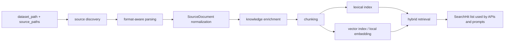

# Dataset and RAG

中文版本：[docs/zh/11-dataset-and-rag.md](../zh/11-dataset-and-rag.md)

This page explains the repository-local knowledge path as it actually exists in `v0.8`: what data ships in the repo, how it is parsed and indexed, what a retrieval hit looks like, and how that hit influences the final agent prompt.

## Why RAG Exists Here

Live telemetry can tell the controller that:

- CPU is high
- memory is rising
- disk latency is spiking
- retransmits are increasing

But telemetry alone cannot answer:

- which similar incident already happened before
- which remediation steps were documented for this failure pattern
- which runbook section mentions this symptom combination

Pure prompting is not enough because the model is not shipped with your repository-local operational material. The RAG service exists to add bounded, inspectable repository knowledge to the reasoning path.

If RAG is disabled, the system still works. The loss is not basic observability. The loss is procedural and historical context.

## End-To-End RAG Workflow

Read the current RAG path as one bounded workflow instead of one hidden “search step”.

| Step | What happens | Main files | Why this step exists | What would go wrong without it |
| --- | --- | --- | --- | --- |
| 1. discover sources | the controller walks `dataset_path` and known file inputs | [`../../backend/internal/controller/rag/ingest.go`](../../backend/internal/controller/rag/ingest.go) | the repo must know which files are knowledge and which are only archives or metadata | retrieval would depend on manual hardcoding of every source file |
| 2. normalize documents | raw JSONL, CSV, Markdown, text, and archive content become `SourceDocument` records | [`../../backend/internal/controller/rag/ingest.go`](../../backend/internal/controller/rag/ingest.go), [`../../backend/internal/controller/rag/knowledge.go`](../../backend/internal/controller/rag/knowledge.go) | the retriever needs one consistent internal document shape | each source format would behave differently and retrieval quality would be unpredictable |
| 3. classify knowledge | the controller labels records as `runbook`, `historical_incident`, `question_pattern`, `dataset_meta`, and so on | [`../../backend/internal/controller/rag/knowledge.go`](../../backend/internal/controller/rag/knowledge.go) | retrieval quality improves when the system knows what kind of operational knowledge a record represents | runbooks, metadata, and generic FAQ rows would compete too equally |
| 4. chunk and index | documents are split into searchable `Chunk` units and written into the local or external backend | [`../../backend/internal/controller/rag/chunk.go`](../../backend/internal/controller/rag/chunk.go), [`../../backend/internal/controller/rag/index.go`](../../backend/internal/controller/rag/index.go), [`../../backend/internal/controller/rag/retriever.go`](../../backend/internal/controller/rag/retriever.go) | smaller chunks are easier to rank than whole files | one long document can drown the exact symptom paragraph the operator needed |
| 5. build retrieval query | controller-side evidence is compacted into a small operational search string | [`../../backend/internal/controller/agentcore/agent.go`](../../backend/internal/controller/agentcore/agent.go), [`../../backend/internal/controller/agentcore/workflow_engine.go`](../../backend/internal/controller/agentcore/workflow_engine.go) | retrieval should reflect symptoms, not dump the whole node state | search becomes noisy, generic, and more expensive |
| 6. rank and filter hits | the retriever scores hits, applies confidence thresholds, and can suppress weak results | [`../../backend/internal/controller/rag/index.go`](../../backend/internal/controller/rag/index.go), [`../../backend/internal/controller/rag/service.go`](../../backend/internal/controller/rag/service.go) | not every lexical or vector match deserves prompt space | weak or misleading text can pollute the final diagnosis |
| 7. inject bounded evidence | only the top, confidence-checked hits are attached to the prompt or workflow output | [`../../backend/internal/controller/agentcore/prompts.go`](../../backend/internal/controller/agentcore/prompts.go), [`../../backend/internal/controller/agentcore/workflow_recommendations.go`](../../backend/internal/controller/agentcore/workflow_recommendations.go) | prompt space is limited and operator output should stay auditable | retrieved text would become noise instead of grounded support |

That workflow is why the repository keeps dataset normalization, chunking, retrieval, and prompt attachment as separate stages instead of one monolithic “RAG call”.

The important control-plane change in the current implementation is that retrieval is now driven more by structured evidence than by flat metric dumps:

- `TrendAssessment[]` contributes deteriorating-signal phrases
- `InvestigationEvent[]` contributes weak-signal cluster summaries and probable causes
- `RetrievalDecision[]` records exactly why retrieval ran or why it was skipped

That logic lives in:

- [`../../backend/internal/controller/agentcore/workflow_eventization.go`](../../backend/internal/controller/agentcore/workflow_eventization.go)
- [`../../backend/internal/controller/agentcore/workflow_engine.go`](../../backend/internal/controller/agentcore/workflow_engine.go)
- [`../../backend/internal/controller/agentcore/workflow_recommendations.go`](../../backend/internal/controller/agentcore/workflow_recommendations.go)

It matters because a query like “disk wait rising with reclaim pressure” is much more useful than a query built from a raw JSON dump of all node metrics.

## Why Retrieval Is Conditional Instead Of Always-On

The current controller intentionally skips retrieval in several cases. This is not a missing feature. It is part of the design.

| Condition | Why retrieval is skipped or suppressed | Engineering reason |
| --- | --- | --- |
| telemetry is stale or absent | the query-service can bypass retrieval before prompt construction | repository knowledge is less useful if the live evidence bundle itself is not trustworthy |
| symptom context is too weak | generic questions like “what is happening here?” do not always justify search | low-signal queries often retrieve broad text that adds cost without improving specificity |
| confidence is below `rag_min_confidence` | weak hits are not attached to prompts | prompt quality is more important than “always showing some document” |
| recent successful analysis can be reused | repeated identical queries can bypass retrieval | this cuts repeated cost without changing the evidence-backed answer |

For business readers: this is the part that keeps the system from paying RAG cost on every question while still using operational knowledge when it materially improves the answer.

Important current boundary:

- the default embedding path is `local-hash-64` from [`backend/internal/controller/rag/retriever.go`](../../backend/internal/controller/rag/retriever.go)
- that path is cheap, offline, and deterministic
- it is not a strong semantic embedding model, so retrieval quality depends heavily on good titles, summaries, tags, and retrieval text
- query-service and scheduled-agent callers now add extra protection on top of the index:
  - they compact the retrieval query with `rag_max_findings` and `rag_max_query_chars`
  - they can skip retrieval entirely when there is no meaningful symptom context
  - they suppress prompt injection of RAG hits when retrieval confidence is below `rag_min_confidence`

## Deployment-Friendly Retrieval Backends

The repository now exposes retrieval backend selection more clearly for cluster deployment.

```yaml
agent:
  rag_vector_backend: "local"          # local | milvus
  rag_vector_endpoint: ""
  rag_vector_collection: "ai_sre_agent_knowledge"
  rag_vector_database: ""
  rag_vector_token: ""
  rag_vector_timeout: "5s"
```

In cluster deployment, the recommended split is:

- keep backend address and collection settings in config
- inject `SRE_AGENT_RAG_VECTOR_TOKEN` from a Kubernetes Secret

Reference packaging:

- [`../../deploy/charts/sre-agent/templates/controller-rag-secret.yaml`](../../deploy/charts/sre-agent/templates/controller-rag-secret.yaml)
- [`../../deploy/charts/sre-agent/examples/distributed-values.yaml`](../../deploy/charts/sre-agent/examples/distributed-values.yaml)

Where those fields are consumed:

- [`../../backend/internal/controller/rag/retriever.go`](../../backend/internal/controller/rag/retriever.go)
- [`../../backend/internal/controller/rag/service.go`](../../backend/internal/controller/rag/service.go)
- [`../../backend/internal/controller/controller.go`](../../backend/internal/controller/controller.go)
- [`../../backend/internal/controller/agent/engine.go`](../../backend/internal/controller/agent/engine.go)
- [`../../backend/internal/controller/agentcore/agent.go`](../../backend/internal/controller/agentcore/agent.go)

Operationally:

| Backend | Best fit | Main tradeoff |
| --- | --- | --- |
| `local` | local-dev, standalone, cluster-lite | simplest, but retrieval state is local to one controller instance |
| `milvus` | distributed controller deployment | shared retrieval state, but introduces an external dependency and Secret-managed auth |

## What Dataset Content Ships In The Repo Today

The tracked repository corpus is no longer just a tiny seed set. It is now a mixed operational dataset with several clearly different source families:

| Corpus family | Current repo shape | How the code treats it |
| --- | --- | --- |
| Prometheus operator runbooks | 118 files under [`dataset/sources/git/prometheus-operator-runbooks/content/runbooks/`](../../dataset/sources/git/prometheus-operator-runbooks/content/runbooks/) | high-value operational runbooks, tagged and boosted for `prometheus`, `kubernetes`, or `linux_node` incidents |
| Scoutflo Kubernetes playbooks | 245 files under [`dataset/sources/git/scoutflo-sre-playbooks/K8s Playbooks/`](../../dataset/sources/git/scoutflo-sre-playbooks/K8s Playbooks/) | high-value operational playbooks, boosted for Kubernetes and node-oriented incidents |
| Scoutflo AWS playbooks | 159 files under [`dataset/sources/git/scoutflo-sre-playbooks/AWS Playbooks/`](../../dataset/sources/git/scoutflo-sre-playbooks/AWS Playbooks/) | kept, but penalized unless the query clearly looks AWS-specific |
| Scoutflo Sentry playbooks | 27 files under [`dataset/sources/git/scoutflo-sre-playbooks/Sentry Playbooks/`](../../dataset/sources/git/scoutflo-sre-playbooks/Sentry Playbooks/) | kept, but routed mainly for Sentry-style issue queries |
| Processed GPU docs | `dataset/processed/gpu-docs/` when generated | high-value GPU troubleshooting docs and preferred over raw HTML duplicates |
| Raw GPU HTML docs | [`dataset/sources/web/`](../../dataset/sources/web/) | used for lineage, but skipped when a processed Markdown counterpart exists |
| Structured QA data | [`dataset/raw/structured/question.jsonl`](../../dataset/raw/structured/question.jsonl), [`dataset/raw/structured/helpdesk_dataset.csv`](../../dataset/raw/structured/helpdesk_dataset.csv) | normalized record-by-record; generic helpdesk content is down-weighted |
| Archive-backed manuals | [`dataset/raw/archives/data.zip`](../../dataset/raw/archives/data.zip), [`dataset/raw/archives/ZTE_eReader_V4.11_20230525_lite.zip`](../../dataset/raw/archives/ZTE_eReader_V4.11_20230525_lite.zip) | indexed as background reference, but treated as low-value unless the query strongly matches that domain |
| Dataset metadata | [`dataset/raw/structured/aiops2024-challenge-dataset.json`](../../dataset/raw/structured/aiops2024-challenge-dataset.json), [`dataset/raw/archives/manifest.json`](../../dataset/raw/archives/manifest.json) | kept for provenance and debugging, not as primary RCA guidance |

That larger corpus changes the engineering problem. The question is no longer “can the repo ingest a few documents?” It is “how does the repo avoid retrieving the wrong class of document from a mixed operational corpus?”

Current answer in code:

- [`../../backend/internal/controller/rag/ingest.go`](../../backend/internal/controller/rag/ingest.go) excludes obvious repository/admin corpus noise by default
- [`../../backend/internal/controller/rag/knowledge.go`](../../backend/internal/controller/rag/knowledge.go) assigns `source_family`, `source_domain`, `operational_value`, and `freshness_hint`
- [`../../backend/internal/controller/rag/index.go`](../../backend/internal/controller/rag/index.go) uses those fields during reranking

Important limitation: the repo corpus is much more useful than before, but it is still mixed. It contains strong operational material and obvious noise side by side. The new routing logic improves that, but it is not the same as a fully curated private incident memory.

## What Is Excluded Or Penalized By Default

The current retrieval path is intentionally selective.

Excluded at ingest time:

- repository/admin documents such as `README`, `CHANGELOG`, `CODEOWNERS`, `CODE_OF_CONDUCT`, `CONTRIBUTING`, `.github/**`, and similar non-operational repo text
- raw GPU HTML when a processed Markdown counterpart exists under `dataset/processed/gpu-docs/`
- unsupported binary/archive assets

Indexed but penalized by default:

- generic helpdesk FAQ rows from [`dataset/raw/structured/helpdesk_dataset.csv`](../../dataset/raw/structured/helpdesk_dataset.csv)
- archive-backed manuals and product docs
- AWS or Sentry playbooks when the incident evidence looks like Linux/Kubernetes/GPU infrastructure instead

This exists because the updated corpus is large enough that “index everything and let BM25 sort it out” is no longer operationally credible.

## Current Source-Aware Routing Rules

The current code derives a source profile from the real dataset path and uses it during ranking.

Examples:

- `dataset/sources/git/prometheus-operator-runbooks/content/runbooks/node/...`
  - `source_family=prometheus_operator_runbook`
  - `source_domain=linux_node`
  - `operational_value=high`
- `dataset/sources/git/scoutflo-sre-playbooks/K8s Playbooks/02-Nodes/...`
  - `source_family=scoutflo_k8s_playbook`
  - `source_domain=linux_node`
  - `operational_value=high`
- `dataset/sources/web/gpu-operator-troubleshooting.html`
  - `source_family=nvidia_gpu_doc_processed`
  - `source_domain=gpu`
  - `operational_value=high`
- `dataset/raw/structured/helpdesk_dataset.csv`
  - `source_family=structured_helpdesk`
  - `operational_value=low`

Those values are not cosmetic metadata. They change retrieval order.

Illustrative effects:

- query: `kubernetes node network receive errors packet drops`
  - boosts Prometheus node runbooks and Scoutflo Kubernetes node playbooks
  - penalizes AWS networking playbooks and generic helpdesk rows
- query: `gpu operator dcgm exporter crashloop`
  - prefers processed NVIDIA GPU troubleshooting docs
  - skips raw HTML duplicates
- query: `route53 dns resolution failing`
  - allows AWS playbooks to compete because the domain evidence is actually AWS-specific

## Real Examples From The Tracked Dataset

### Example 1: `question.jsonl`

Actual row from [`dataset/raw/structured/question.jsonl`](../../dataset/raw/structured/question.jsonl):

```json
{"id":1,"query":"PCF与NRF对接时，一般需要配置哪些数据？","document":"rcp"}
```

What the current code does:

- [`parseJSONLDocuments`](../../backend/internal/controller/rag/ingest.go) reads one JSON object per line
- [`chooseStructuredTitle`](../../backend/internal/controller/rag/ingest.go) picks `query` as the title
- [`structuredContent`](../../backend/internal/controller/rag/ingest.go) renders the record into sorted key/value text
- [`mergeStructuredMetadata`](../../backend/internal/controller/rag/knowledge.go) stores lowercased metadata such as `field.id`, `field.query`, `field.document`
- [`finalizeDocument`](../../backend/internal/controller/rag/knowledge.go) uses `query` as the summary seed and classifies the document as `question_pattern`

Normalized document shape:

```json
{
  "title": "PCF与NRF对接时，一般需要配置哪些数据？",
  "summary": "PCF与NRF对接时，一般需要配置哪些数据？",
  "knowledge_type": "question_pattern",
  "case_type": "operational_qa",
  "tags": ["rcp"],
  "content": "document: rcp\nid: 1\nquery: PCF与NRF对接时，一般需要配置哪些数据？"
}
```

This is a good shape for the current heuristics because it has:

- a stable `query`
- a structured `document` field that becomes a tag
- a small record that chunks cleanly

### Example 2: `helpdesk_dataset.csv`

Actual rows from [`dataset/raw/structured/helpdesk_dataset.csv`](../../dataset/raw/structured/helpdesk_dataset.csv):

```csv
Question,LinkToAnswer
"My Mac does not boot, what can I do ?",http://faq/mac-does-not-boot
Can Mac Air get infected by a Virus,http://faq/mac-book-virus
```

What the current code does:

- [`parseDelimitedDocuments`](../../backend/internal/controller/rag/ingest.go) turns each row into a record map
- `mergeStructuredMetadata` lowercases header names into metadata such as `field.question` and `field.linktoanswer`
- [`structuredFieldValue`](../../backend/internal/controller/rag/knowledge.go) can still read `question` and `linktoanswer`
- [`defaultRetrievalWeight`](../../backend/internal/controller/rag/knowledge.go) gives this file a lower retrieval weight because it is generic helpdesk content

Important nuance:

- `chooseStructuredTitle` checks raw keys such as `title`, `query`, `question`, `name`, `summary`, `id`
- the CSV file uses `Question` with uppercase `Q`
- ingestion still works, but title inference is weaker than a lowercase `question` header

Nothing breaks, but retrieval inspectability is worse.

### Example 3: `aiops2024-challenge-dataset.json`

Actual content from [`dataset/raw/structured/aiops2024-challenge-dataset.json`](../../dataset/raw/structured/aiops2024-challenge-dataset.json):

```json
{"question_file":{"train":{"meta":"raw/structured/question.jsonl","file":"jsonl"}}}
```

What the current code does:

- parses it as one structured JSON document
- classifies it as `dataset_meta` because the path matches repository metadata patterns
- down-weights it heavily so it does not compete with operational records

This file is useful for provenance and inventory, not for direct RCA.

## Where The RAG Implementation Lives

| Path | Responsibility |
| --- | --- |
| [`backend/internal/controller/rag/service.go`](../../backend/internal/controller/rag/service.go) | service lifecycle, startup load, `Update`, `Rebuild`, query serving |
| [`backend/internal/controller/rag/ingest.go`](../../backend/internal/controller/rag/ingest.go) | source discovery, format detection, archive extraction, parsing |
| [`backend/internal/controller/rag/knowledge.go`](../../backend/internal/controller/rag/knowledge.go) | classification, summary inference, likely causes, remediation extraction |
| [`backend/internal/controller/rag/chunk.go`](../../backend/internal/controller/rag/chunk.go) | record-to-chunk transformation |
| [`backend/internal/controller/rag/index.go`](../../backend/internal/controller/rag/index.go) | lexical/vector lookup, reranking, `QueryResult` construction |
| [`backend/internal/controller/rag/retriever.go`](../../backend/internal/controller/rag/retriever.go) | shared RAG config, `SourceDocument`, `Chunk`, `SearchHit`, `QueryRequest`, `QueryResult` |
| [`backend/internal/controller/rag_integration.go`](../../backend/internal/controller/rag_integration.go) | `/api/v1/rag/*` HTTP endpoints |
| [`backend/cmd/ragctl/main.go`](../../backend/cmd/ragctl/main.go) | `status`, `query`, `update`, `rebuild`, `doc` CLI |

## Retrieval Workflow Example

Illustrative but code-consistent runtime evidence:

```text
memory_usage_pct = 87.4
disk_await_ms = 41.7
cpu_iowait_pct = 28.4
nic_rx_drops = 134
log_burst = 12
```

Controller-side evidence built before search:

```json
{
  "trend_assessments": [
    {"series_key":"memory_pressure","trend":"rising","severity":"medium"},
    {"series_key":"io_latency","trend":"worsening","severity":"medium"}
  ],
  "investigation_events": [
    {
      "category":"weak_signal_cluster",
      "probable_cause":"memory reclaim and storage wait are amplifying each other"
    }
  ],
  "retrieval_decisions": [
    {
      "tool":"runbook_retrieval",
      "intent":"runbook",
      "query":"memory pressure rising disk latency worsening reclaim io contention timeout"
    }
  ]
}
```

Illustrative retrieved hit shape based on the real `SearchHit` struct:

```json
{
  "title": "Runbook: reclaim and storage wait after rollout",
  "knowledge_type": "runbook",
  "case_type": "runbook",
  "score": 0.82,
  "summary": "Check reclaim pressure and queued disk IO before scaling blindly.",
  "likely_causes": [
    "memory reclaim is amplifying storage latency",
    "writeback congestion after rollout"
  ],
  "remediation_steps": [
    "check top RSS processes",
    "check iostat queue depth"
  ],
  "commands": [
    "vmstat 1 5",
    "iostat -x 1 5"
  ]
}
```

What changes because of retrieval:

- without retrieval, the controller can still say “memory and storage pressure are rising together”
- with retrieval, it can also attach concrete checks and commands grounded in repository knowledge
- if the hit were weak, the same telemetry-based answer would still be returned, but without pretending the runbook match was strong

## Startup Integrity And Recovery

The local JSON index is no longer trusted blindly on startup.

[`loadIndex`](../../backend/internal/controller/rag/index.go) now validates:

- duplicate document IDs
- duplicate chunk IDs
- duplicate source keys
- chunk-to-document lineage
- source-to-document and source-to-chunk lineage
- missing strategy or invalid offsets in chunks

If validation fails, [`backend/internal/controller/rag/service.go`](../../backend/internal/controller/rag/service.go):

1. records the error in `Stats.LastError`
2. renames the bad file into `storagePath(index_path)/index.corrupt-<timestamp>.json`
3. continues with `rag_rebuild_policy`

That means:

- `manual`: retrieval stays unavailable until an operator rebuilds
- `if_missing`: the service rebuilds only because the bad index was quarantined away
- `startup`: the service rebuilds on every controller start

This protects the controller from silently serving a corrupted local index.

## Runtime Guardrails After Retrieval

The index can be healthy and retrieval can still be a bad idea for one specific query. The consumer-side logic in:

- [`backend/internal/controller/agentcore/agent.go`](../../backend/internal/controller/agentcore/agent.go)
- [`backend/internal/controller/agent/engine.go`](../../backend/internal/controller/agent/engine.go)

adds two more protections.

One more practical control-plane detail now matters to operators:

- retrieved `commands` and `remediation_steps` can be promoted into workflow recommendation checks
- this means a good runbook record can change not only the explanation, but also the concrete next commands shown to the operator

### 1. Compact retrieval query construction

The controller no longer forwards the full operator question plus every finding verbatim. It now:

- deduplicates findings
- drops low-value retrieval boilerplate such as `No critical anomalies detected`, telemetry-staleness banners, and observability-coverage warnings
- adds anomaly/trend hints when they contain real operational symptoms
- keeps only the first `rag_max_findings` combined symptom lines after dedupe
- caps the final query string at `rag_max_query_chars`

Illustrative example based on the real compaction logic:

```json
{
  "operator_query": "why did node-a slow down after rollout?",
  "findings": [
    "CPU utilization is above 85%",
    "CPU utilization is above 85%",
    "Memory utilization is above 85%",
    "Disk I/O pressure is elevated",
    "Network retransmits or timeout bursts are active"
  ],
  "rag_max_findings": 3,
  "rag_max_query_chars": 120,
  "query_sent_to_rag": "why did node-a slow down after rollout? CPU utilization is above 85% Memory utilization is above 85%"
}
```

Why this exists:

- retrieval quality usually improves with a few distinct symptoms, not a full prompt-sized dump
- it reduces token and CPU waste on repeated generic findings
- it keeps RAG off the hot path when the signal is already noisy

The query-service also now skips retrieval entirely when both of these are true:

- the filtered findings/anomaly hints are empty
- the operator query itself does not contain strong operational keywords such as `cpu`, `memory`, `timeout`, `latency`, `gpu`, `disk`, `network`, `retransmit`, `deployment`, or `security`

That gate exists because a generic query like `"what is happening here"` with no real symptoms is more likely to return noisy runbook text than useful RCA evidence.

## How Eventized Control-Plane Context Reaches Retrieval

Retrieval is now fed more often from controller-generated investigation summaries than from raw metric dumps.

Relevant files:

- [`backend/internal/controller/agentcore/workflow_eventization.go`](../../backend/internal/controller/agentcore/workflow_eventization.go)
- [`backend/internal/controller/agentcore/workflow_engine.go`](../../backend/internal/controller/agentcore/workflow_engine.go)
- [`backend/internal/controller/agentcore/agent.go`](../../backend/internal/controller/agentcore/agent.go)

Illustrative sequence:

```json
{
  "trend_assessments": [
    {
      "display": "Disk latency",
      "trend": "rising",
      "forecast": "disk latency likely crosses high-risk threshold within 12m"
    }
  ],
  "investigation_events": [
    {
      "title": "Disk wait and CPU iowait are rising together",
      "probable_cause": "storage contention is building before a hard outage",
      "supporting_signals": [
        "node_disk_request_latency_p99_seconds",
        "node_disk_queue_depth_total",
        "node_cpu_iowait_percent"
      ]
    }
  ]
}
```

That state becomes a retrieval decision like:

```json
{
  "tool": "runbook_retrieval",
  "intent": "incident_rag",
  "query": "disk wait and CPU iowait are rising together storage contention queue depth latency",
  "evidence_signals": [
    "io_latency",
    "io_pressure",
    "cpu_pressure"
  ]
}
```

This is materially better than searching with an oversized raw payload because:

- the query carries symptom meaning, not every metric key
- the query is shorter and cheaper
- retrieval becomes auditable through `RetrievalDecision[]`

### 1.4. Incident memory is ranked as a trust-aware retrieval source

Relevant files:

- [`backend/internal/controller/incidentmemory/store.go`](../../backend/internal/controller/incidentmemory/store.go)
- [`backend/internal/controller/agentcore/workflow_memory.go`](../../backend/internal/controller/agentcore/workflow_memory.go)
- [`backend/internal/controller/agentcore/workflow_tools.go`](../../backend/internal/controller/agentcore/workflow_tools.go)

Static dataset content and incident memory are not equivalent, so they are not ranked the same way.

The incident-memory scorer now combines free-text overlap with:

- signal hints
- change hints
- remediation hints
- collector affinity
- verification and successful action outcomes
- operator feedback
- recency

Why not just append all prior incidents or always prefer the latest resolved one?

- repeated symptom words do not guarantee the same trigger
- stale or weakly verified incident memory can be worse than no memory
- this repo needs retrieval behavior that is deterministic and easy to debug from stored artifacts

The resulting memory hits now contribute to the retrieval summary and confidence, even when static knowledge-base hits are absent, and they carry compact `match_reasons` metadata so operators can inspect why the controller attached them.

This is still intentionally conservative:

- strong memory hits help rank evidence, but they do not bypass policy, verification, or approval
- the scorer is heuristic and local, so distant analogies with different wording can still be missed

### 1.5. Reuse recent successful analysis when nothing changed

[`backend/internal/controller/agentcore/agent.go`](../../backend/internal/controller/agentcore/agent.go) now keeps a small bounded cache of recent successful analyses.

If these stay materially the same:

- operator query text
- compact prompt-facing metrics
- telemetry quality state and runtime mode
- alerts, anomalies, top process summaries, and top log summaries

then the query-service can reuse the last successful analysis for a short `analysis_reuse_window` instead of calling retrieval and the LLM again.

Illustrative sequence:

```text
t=00s  "why is disk latency growing?"  -> retrieval runs, LLM runs
t=15s  same query + same compact evidence fingerprint -> cached analysis reused
t=55s  same query but queue depth and CPU changed     -> retrieval runs, LLM runs
```

Important limits:

- fallback answers are not cached
- stale or empty telemetry is not cached
- this is a bounded in-memory cache, not durable history

This exists because repeated dashboard refreshes and repeated operator questions should not keep paying the RAG/LLM cost when the evidence has not materially changed.

### 2. Low-confidence retrieval suppression

The controller still performs retrieval, but it no longer forwards weak hits into the model prompt.

Illustrative `QueryResult` before suppression:

```json
{
  "confidence": 0.12,
  "summary": "retrieved 1 knowledge hits across 1 documents (runbook=1)",
  "hits": [
    {
      "title": "Generic Timeout Runbook",
      "knowledge_type": "runbook",
      "score": 0.23
    }
  ]
}
```

If `rag_min_confidence` is `0.18`, the query-service changes its prompt-facing result to:

```json
{
  "summary": "retrieved 1 knowledge hits, but retrieval suppressed because confidence 0.12 is below minimum 0.18",
  "hits_forwarded_to_prompt": []
}
```

This is a deliberately conservative tradeoff. Weak retrieval is still visible for debugging, but it does not get to steer the answer.

## How The Dataset Is Processed



The implemented pipeline is:

1. [`service.go`](../../backend/internal/controller/rag/service.go) resolves `dataset_path` and optional extra `source_paths`
2. [`ingest.go`](../../backend/internal/controller/rag/ingest.go) discovers supported files
3. archives are expanded into cache or recorded in quarantine if entries are binary or unsupported
4. structured files (`json`, `jsonl`, `csv`, `tsv`) are normalized record by record
5. [`knowledge.go`](../../backend/internal/controller/rag/knowledge.go) classifies the record and builds retrieval-friendly text
6. [`chunk.go`](../../backend/internal/controller/rag/chunk.go) creates chunks using `auto`, `case`, `paragraph`, or other configured strategies
7. [`index.go`](../../backend/internal/controller/rag/index.go) builds lexical/vector lookup and serves `QueryResult`
8. query-service or scheduled-agent consumers decide whether that `QueryResult` is confident enough to enter the prompt

## What A Normalized Document Looks Like

The core pre-chunk representation is [`SourceDocument`](../../backend/internal/controller/rag/retriever.go). A realistic normalized runbook-like document looks like:

```json
{
  "doc_id": "cases/timeout-runbook.md",
  "source_path": "cases/timeout-runbook.md",
  "source_type": "markdown",
  "knowledge_type": "runbook",
  "case_type": "runbook",
  "title": "Timeout Runbook",
  "summary": "Check retry rates and deployment timing.",
  "content": "When payment requests time out after a deployment:\n- inspect dependency retry rates\n- compare rollout timestamps with latency spikes\n- validate cache credentials and downstream DNS",
  "likely_causes": ["stale cache credential after rollout"],
  "remediation_steps": ["inspect retry rate", "validate cache credentials"],
  "signals": ["deployment", "network"]
}
```

The repository does not ship that exact file under `dataset/`, but the same shape is exercised by the test dataset in [`backend/internal/controller/rag/service_test.go`](../../backend/internal/controller/rag/service_test.go) and by prompt-path tests under [`backend/internal/controller/agentcore/`](../../backend/internal/controller/agentcore/).

That example is important because it shows the intended “high-value RAG” shape:

- concise title
- short summary
- likely causes
- remediation steps
- signals

## How Chunking Preserves Meaning

When a document already looks like operational knowledge, [`chunkStructuredKnowledge`](../../backend/internal/controller/rag/chunk.go) creates up to four logical sections:

- `summary`
- `evidence`
- `remediation`
- `body`

This exists because an RCA or runbook query often wants different parts of the same document:

- the summary for ranking
- the causes for diagnosis
- the steps for recommendation

Chunk example:

```json
{
  "chunk_id": "doc-1#001",
  "doc_id": "doc-1",
  "knowledge_type": "runbook",
  "case_type": "runbook",
  "section_type": "remediation",
  "retrieval_text": "Timeout Runbook\nCheck retry rates and deployment timing.\nRemediation steps\n- inspect retry rate\n- validate cache credentials",
  "embedding_text": "Timeout Runbook\nCheck retry rates and deployment timing.\nstale cache credential after rollout\ninspect retry rate\nvalidate cache credentials"
}
```

Without structured chunking, a long runbook turns into a generic paragraph search problem and loses most of its operational shape.

## How Retrieval Queries Are Formed

The query-service path builds a retrieval request in [`buildQueryServiceRAGRequest`](../../backend/internal/controller/agentcore/agent.go). It combines:

- the operator’s question
- the deterministic findings already derived from telemetry
- an inferred intent
- default filters for knowledge and case types

Illustrative request:

```json
{
  "query": "how to fix deployment timeout after rollout timeout spikes after deployment",
  "top_k": 4,
  "intent": "runbook",
  "knowledge_types": ["runbook", "question_pattern"],
  "case_types": ["runbook", "operational_qa"]
}
```

Important details from the current code:

- `how to`, `steps`, `fix`, `排查`, `处理`, `修复` bias intent toward `runbook`
- `similar`, `history`, `incident`, `案例` bias toward `historical_incident`
- `recommend`, `next step`, `建议` bias toward `recommendation`
- `security`, `permission`, `证书`, `安全` bias toward `security`

Then [`buildQueryPlan`](../../backend/internal/controller/rag/knowledge.go) expands the raw query with intent-specific keywords such as:

- `root cause evidence remediation runbook similar incident`
- `runbook playbook remediation troubleshooting steps`

This exists because short operator questions usually omit retrieval-friendly vocabulary.

The query-service only performs this retrieval step when it will actually call the LLM. If stale or missing telemetry already triggers deterministic fallback in [`backend/internal/controller/agentcore/agent.go`](../../backend/internal/controller/agentcore/agent.go), RAG is skipped entirely.

## What A Retrieval Result Looks Like

The API-facing result is [`QueryResult`](../../backend/internal/controller/rag/retriever.go), which contains `[]SearchHit`.

Representative `SearchHit` example based on the tested runbook path:

```json
{
  "evidence_id": "rag-1",
  "doc_id": "doc-1",
  "chunk_id": "chunk-1",
  "score": 0.92,
  "source_path": "cases/timeout-runbook.md",
  "source_type": "markdown",
  "knowledge_type": "runbook",
  "case_type": "runbook",
  "title": "Timeout Runbook",
  "summary": "Check retry rates and deployment timing.",
  "snippet": "Inspect retries and cache credentials after rollout.",
  "likely_causes": ["stale cache credential after rollout"],
  "remediation_steps": ["inspect retry rate", "validate cache credentials"],
  "signals": ["deployment", "network"]
}
```

Important ranking behavior in [`index.go`](../../backend/internal/controller/rag/index.go):

- results are reranked by `knowledge_type`, `case_type`, tags, and intent
- each document is limited to two chunks
- near-duplicate chunk fingerprints are dropped
- an `evidence_id` is generated for each returned hit

This keeps retrieval bounded and more diverse than “top 4 chunks from the same file.”

## Concrete Retrieval Walkthroughs

### Walkthrough A: What the shipped dataset can influence today

If the operator asks a question close to the tracked dataset:

```text
PCF与NRF对接时，一般需要配置哪些数据？
```

the `question.jsonl` record can be a strong match because:

- the title is the same as the query
- the document is classified as `question_pattern`
- the content is tiny and focused

Likely retrieval effect:

- prompt gets a short operational QA snippet
- answer quality improves for that narrow domain question

What it will not do:

- it will not explain a CPU or disk anomaly on a Linux host
- it is not a generic runbook for infrastructure RCA

### Walkthrough B: How a real runbook changes diagnosis

The test dataset in [`rag/service_test.go`](../../backend/internal/controller/rag/service_test.go) uses:

```markdown
# Timeout Runbook

When payment requests time out after a deployment:
- inspect dependency retry rates
- compare rollout timestamps with latency spikes
- validate cache credentials and downstream DNS
```

plus historical JSONL:

```json
{"id":"case-1","query":"deployment timeout","document":"Timeouts after rollout were fixed by reverting a bad cache credential change."}
```

and CSV FAQ:

```csv
Question,LinkToAnswer
How to inspect retry rate?,Use the retry dashboard and deployment audit timeline.
```

For a query like:

```text
how to troubleshoot deployment timeout cache credentials
```

the current retrieval pipeline tends to rank the runbook first because:

- intent becomes `runbook`
- `runbook` knowledge gets an intent bonus
- remediation steps and commands increase score for runbook-style intent

That changes the final agent answer in a concrete way:

- without retrieval, the answer stays at “latency/timeout exists”
- with the runbook hit, the answer is more likely to mention rollout timing, retry rates, cache credentials, and downstream DNS

### Walkthrough C: How different hit types steer the answer differently

| Retrieved hit type | Typical effect on the final answer |
| --- | --- |
| `runbook` with remediation steps | pushes the answer toward concrete next actions |
| `historical_incident` with likely causes | pushes the answer toward analogy and hypothesis ranking |
| `question_pattern` / `operational_qa` | helps short factual or FAQ-style questions, but is weaker for RCA |
| `dataset_meta` | usually should not affect the final answer much because it is down-weighted |

This distinction matters. “RAG improves reasoning” is too vague. Different knowledge types bias the answer in different operational directions.

## How RAG Content Enters The Prompt

The query-service path does not inject full documents. [`BuildUserPrompt`](../../backend/internal/controller/agentcore/prompts.go) adds:

1. `RAG context snippets`
2. `Retrieval summary`
3. `Retrieval routing`
4. up to three formatted `Retrieved operational knowledge` lines

Example prompt-ready line:

```text
- [Timeout Runbook] runbook/runbook | summary=Check retry rates and deployment timing. | causes=stale cache credential after rollout | steps=inspect retry rate; validate cache credentials
```

This structure exists to keep:

- provenance visible
- token cost bounded
- the model focused on summary, likely causes, and steps instead of arbitrary document prose

## Current Config, Cache, And Update Model

Default controller-side paths:

| Item | Default path or value | Notes |
| --- | --- | --- |
| Dataset path | `./dataset` | controller config default |
| Index path | `./data/agent/rag/index.json` | local persisted index |
| Storage directory | `./data/agent/rag/` | derived from index path |
| Cache path | `./data/agent/rag/cache/` | extracted archives and intermediates |
| Quarantine manifest | `./data/agent/rag/quarantine.json` | unsupported or binary sources |
| Retrieval mode | `hybrid` | local-first default |
| Embedding provider | `local` | no mandatory external embedding service |
| Embedding model | `local-hash-64` | default model identifier |
| Rebuild policy | `manual` | `manual`, `if_missing`, `startup` |

Operational behavior:

- existing index loads on startup when present
- `Update()` reuses unchanged sources by signature
- `Rebuild()` forces a full rescan
- local retrieval remains the fallback even when optional external vector sync fails

## How To Modify Or Replace The Dataset Safely

### Safe workflow

1. add or edit files under [`dataset/`](../../dataset/) or point `source_paths` to your custom corpus
2. prefer structured records that expose `title`, `summary`, `question`, `query`, `service`, `topic`, `timestamp`, `likely_causes`, `remediation_steps`, or `commands`
3. run `ragctl update` or controller-side update
4. inspect `ragctl query` or `/api/v1/rag/query`
5. only then increase dataset size or change schema conventions

### Files and configs you touch

- data files under [`dataset/`](../../dataset/)
- controller config:
  - [`configs/controller.yaml`](../../configs/controller.yaml)
  - [`configs/container/controller.yaml`](../../configs/container/controller.yaml)
- RAG CLI:
  - [`backend/cmd/ragctl/main.go`](../../backend/cmd/ragctl/main.go)

### What can break when schema shape changes

| Change | Likely effect |
| --- | --- |
| removing `title`, `query`, or `question`-like fields | titles and summaries become weak |
| using generic CSV headers like `Doc` or `Note` | tags and summaries are less useful |
| replacing operational records with long unstructured blobs | chunk quality drops and reranking gets weaker |
| mixing large binary archives without text filters | quarantine grows and indexing wastes time |

## Honest Limits In The Current Repo

The current implementation is flexible, but it is not magic:

- there is no single strict dataset schema
- the shipped seed dataset is not a complete SRE knowledge base
- retrieval quality depends heavily on document shape and titles
- prompt quality improves most when the dataset contains real runbooks, incidents, and operational QA

If you want strong RCA support, the most valuable improvement is not a new prompt. It is better retrieval material.

## See Also

- [Data flow](05-data-flow.md)
- [Prompts and customization](12-prompts-and-customization.md)
- [Core files](10-core-files.md)
- [Dataset README](../../dataset/README.md)
