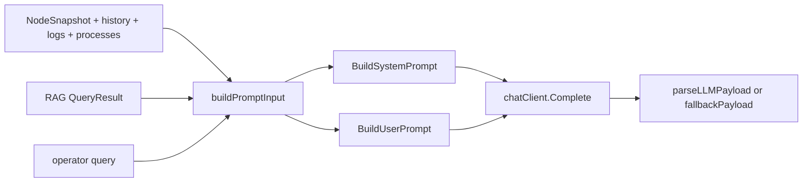

# Prompts and Customization

中文版本：[docs/zh/12-prompts-and-customization.md](../zh/12-prompts-and-customization.md)

This repository does not have a standalone `prompts/` directory. The prompt text is defined mostly in Go code and assembled dynamically from:

- controller-side telemetry
- deterministic findings and trend hints
- retrieved RAG evidence
- operator query text

This page explains the exact prompt layers, where runtime data enters, and how the final request body sent to the model is built.

## Why The Prompt Layer Is So Strict

This project uses LLMs for RCA, recommendation generation, and workflow analysis. That only works if the prompt stays:

- grounded in current telemetry
- explicit about evidence quality
- machine-parseable on the way back
- resistant to prompt injection from logs or retrieved documents

Without these guardrails:

1. the model can invent missing metrics
2. logs or retrieved documents can be treated as instructions
3. the controller cannot reliably parse the answer

That is why the prompt layer is intentionally conservative.

## Prompt Workflow In Plain Language

The current prompt path is a workflow, not a string template.

| Step | What happens | Main files | Why this step exists | If it were removed |
| --- | --- | --- | --- | --- |
| 1. gather trusted runtime evidence | the controller reads `NodeSnapshot`, history, findings, processes, logs, and telemetry-quality facts | [`../../backend/internal/controller/agentcore/agent.go`](../../backend/internal/controller/agentcore/agent.go) | the model should see controller-owned facts, not raw transport payloads | prompts would become noisier and less trustworthy |
| 2. compress evidence | metrics are compacted, findings are deduplicated, and only bounded process/log summaries are kept | [`../../backend/internal/controller/agentcore/prompts.go`](../../backend/internal/controller/agentcore/prompts.go) | token cost must stay bounded and the evidence should stay readable | prompts would grow faster than their diagnostic value |
| 3. decide whether retrieval belongs | RAG results are attached only when context is strong enough and confidence is high enough | [`../../backend/internal/controller/agentcore/agent.go`](../../backend/internal/controller/agentcore/agent.go) | prompt space is valuable, and weak retrieval can make the answer worse | irrelevant runbook text would crowd out live telemetry |
| 4. apply system constraints | the prompt adds explicit rules about grounding, JSON shape, and not inventing facts | [`../../backend/internal/controller/agentcore/prompts.go`](../../backend/internal/controller/agentcore/prompts.go) | the controller must be able to parse and trust the output | responses could become free-form, unparseable, or hallucinated |
| 5. call the model under guardrails | timeout, retries, rate limiting, concurrency, and safety validation apply | [`../../backend/internal/controller/agentcore/agent.go`](../../backend/internal/controller/agentcore/agent.go), [`../../backend/internal/controller/agentcore/llm_safety.go`](../../backend/internal/controller/agentcore/llm_safety.go) | LLM calls should not become an unstable dependency for the API | one slow or malformed call could destabilize the response path |
| 6. fall back deterministically if needed | the controller returns an evidence-based fallback when the model path is stale, empty, unsafe, or unavailable | [`../../backend/internal/controller/agentcore/agent.go`](../../backend/internal/controller/agentcore/agent.go) | operators still need a bounded answer when the model path is not trustworthy | the API would fail open or fail empty |

For non-technical readers: this workflow is how the project keeps “AI assistance” tied to evidence instead of letting it behave like a free-form chatbot.

## Where Prompts Are Actually Defined

| Path | What it owns |
| --- | --- |
| [`backend/internal/controller/agentcore/prompts.go`](../../backend/internal/controller/agentcore/prompts.go) | `BuildSystemPrompt`, `BuildUserPrompt`, `BuildAnomalyPrompt`, `BuildRCAPrompt`, `BuildSchema` |
| [`backend/internal/controller/agentcore/agent.go`](../../backend/internal/controller/agentcore/agent.go) | gathers telemetry, trends, findings, RAG results, quality, then invokes the LLM or fallback |
| [`backend/internal/controller/agentcore/llm_analysis.go`](../../backend/internal/controller/agentcore/llm_analysis.go) | workflow-analysis system and user prompts |
| [`backend/internal/controller/agentcore/llm_safety.go`](../../backend/internal/controller/agentcore/llm_safety.go) | sanitizes untrusted context and validates model output |
| [`backend/internal/controller/analysis/llm_client.go`](../../backend/internal/controller/analysis/llm_client.go) | separate analysis-engine prompt path |
| [`docs/26-llm-schema.md`](26-llm-schema.md) | documented schema of the query-service evidence payload |

There is no hidden prompt-template file elsewhere in the repo.

## Prompt Layers

| Layer | Where it is built | Trust level | Purpose |
| --- | --- | --- | --- |
| System constraints | `BuildSystemPrompt`, `BuildWorkflowSystemPrompt` | trusted code | define allowed behavior and JSON contract |
| Runtime telemetry | `buildPromptInput`, `BuildSchema`, workflow `ContextBundle` | trusted controller data | provide the facts the model is allowed to use |
| Retrieved knowledge | `ragContext`, workflow retrieved docs | useful but explicitly untrusted | add runbooks, historical incidents, and procedures |
| User input | `/api/v1/agent/query` request body | untrusted | tell the system what the operator wants explained |
| Validation and fallback | `parseLLMPayload`, `llm_safety.go`, `fallbackPayload` | trusted code | reject malformed output and keep the API stable |

## Why Each Prompt Layer Exists

| Layer | Problem before this layer | What it solves | Main tradeoff |
| --- | --- | --- | --- |
| system constraints | models can invent facts or return prose that the API cannot consume | forces a grounded, machine-parseable contract | less flexibility in style |
| runtime telemetry | raw user questions do not contain enough operational truth | supplies current node facts and data-quality metadata | some telemetry must be compacted to fit the prompt budget |
| retrieved knowledge | telemetry alone cannot supply runbook steps or prior-case language | adds repository-local operational context | weak retrieval can harm quality if not filtered |
| user input | the controller still needs to know what the operator actually wants answered | gives direction to the analysis | user wording can be vague, so it cannot be trusted alone |
| validation and fallback | LLM output can be malformed, unsafe, or unavailable | keeps the API stable and auditable | deterministic fallback is less expressive than a good model answer |

## New Control-Plane Evidence That Reaches Prompts

The prompt path now has one more layer of structured evidence before retrieval and final wording.

Relevant files:

- [`backend/internal/controller/agentcore/workflow_eventization.go`](../../backend/internal/controller/agentcore/workflow_eventization.go)
- [`backend/internal/controller/agentcore/workflow_engine.go`](../../backend/internal/controller/agentcore/workflow_engine.go)
- [`backend/internal/controller/agentcore/llm_analysis.go`](../../backend/internal/controller/agentcore/llm_analysis.go)

These files now feed three controller-derived objects into workflow and RCA analysis:

- `TrendAssessment[]`
- `InvestigationEvent[]`
- `RetrievalDecision[]`

Illustrative context bundle excerpt:

```json
{
  "trend_assessments": [
    {
      "display": "Memory pressure",
      "trend": "rising",
      "severity": "high",
      "forecast": "memory pressure likely crosses high-risk threshold within 18m"
    }
  ],
  "investigation_events": [
    {
      "title": "Memory growth and disk wait are rising together",
      "probable_cause": "memory reclaim and IO contention are amplifying each other"
    }
  ],
  "retrieval_decisions": [
    {
      "tool": "runbook_retrieval",
      "intent": "incident_rag",
      "query": "memory growth and disk wait rising together reclaim io contention latency",
      "skipped": false
    }
  ]
}
```

Why this matters:

- the model sees more compressed controller reasoning and less raw metric noise
- the UI and workflow report can expose the same intermediate evidence the prompt used
- retrieval planning is no longer invisible
- recommendation generation can now reuse the same eventized evidence and retrieved commands, so operator output is aligned with what the prompt actually saw

## Request Workflow: From Evidence To Final Response

The query-service path now looks like this:

```text
NodeSnapshot/history -> PromptInput -> telemetry-quality gate -> optional RAG attach -> system/user prompts -> model call -> JSON validation -> QueryResponse or fallback
```

That workflow exists because each stage solves a different problem:

| Stage | Main problem it solves |
| --- | --- |
| `PromptInput` assembly | gather one coherent controller-owned evidence bundle |
| telemetry-quality gate | stop the system from pretending confidence on stale or partial data |
| optional RAG attach | add operational knowledge only when it improves the answer |
| system/user prompts | express the evidence and the response contract clearly |
| model call | synthesize diagnosis and recommendations from the bounded evidence |
| JSON validation | reject malformed or unsafe answers |
| fallback response | preserve a stable API even when the model path should not be trusted |

## The Actual Query-Service System Prompt

From [`BuildSystemPrompt`](../../backend/internal/controller/agentcore/prompts.go):

```text
You are a senior SRE. Use only provided telemetry facts. Never invent metrics or command outputs. Return strict JSON with fields: summary, root_cause, confidence, findings, recommendations, actions, evidence, limitations.
```

This exists for three reasons:

- grounding: the model is told to use only supplied facts
- safety: it is told not to fabricate command output
- contract stability: the controller expects a strict JSON object

If you remove those constraints, the model may still return readable text, but the controller can no longer trust or parse it safely.

## How Query-Service Prompt Assembly Works



The exact order inside [`BuildUserPrompt`](../../backend/internal/controller/agentcore/prompts.go) is:

1. `BuildAnomalyPrompt`
2. `BuildRCAPrompt`
3. telemetry-quality summary line
4. RAG block
5. `Telemetry JSON (schema v1)`
6. output restrictions

Why that order matters:

1. anomaly framing keeps the question grounded in observed symptoms
2. RCA framing asks for ranked causes and safe checks
3. telemetry-quality comes before RAG so the model sees evidence trust first
4. RAG comes before the schema so outside knowledge is visibly separate from raw telemetry facts
5. the schema comes late so the prompt ends with machine-parseable evidence
6. output restrictions come last to reinforce the response contract immediately before generation

Important runtime detail:

- `BuildUserPrompt` now uses the compact prompt-facing schema from `buildPromptSchema`
- `QueryResponse.TelemetryContext` still uses `BuildSchema`
- this means operators can inspect the full API-facing evidence bundle while the model receives a bounded metric subset
- retrieved context is now also gated by `rag_min_confidence`, so not every successful RAG lookup becomes prompt text
- retrieval is also gated by symptom context, so generic low-signal questions do not automatically attach RAG snippets anymore

On the workflow side, recommendation generation now also consumes the same evidence split:

- top deteriorating trend
- strongest weak-signal cluster
- validated RCA hypotheses
- retrieved runbook commands and remediation steps

That logic lives in [`../../backend/internal/controller/agentcore/workflow_recommendations.go`](../../backend/internal/controller/agentcore/workflow_recommendations.go) and [`../../backend/internal/controller/agentcore/workflow_engine.go`](../../backend/internal/controller/agentcore/workflow_engine.go).

## Concrete Example: Before Retrieval And After Retrieval

The example below uses:

- telemetry shaped by [`buildPromptInput`](../../backend/internal/controller/agentcore/agent.go)
- a retrieval hit shape exercised by [`agent_test.go`](../../backend/internal/controller/agentcore/agent_test.go) and [`prompts_test.go`](../../backend/internal/controller/agentcore/prompts_test.go)

### Runtime telemetry context

Illustrative `PromptInput` fields:

```json
{
  "query": "why did node-a slow down after rollout?",
  "node_name": "node-a",
  "telemetry_quality": {
    "state": "degraded",
    "coverage_percent": 100,
    "confidence": 0.8,
    "safe_to_act": false
  },
  "metrics": {
    "node_cpu_usage_percent": 92.1,
    "node_memory_Used_bytes": 15032385536,
    "node_memory_MemTotal_bytes": 17179869184,
    "node_disk_request_latency_p99_seconds": 0.0385,
    "node_disk_queue_depth_total": 11,
    "node_tcp_retransmits_per_second": 0.8
  },
  "findings": [
    "CPU utilization is above 85%",
    "Memory utilization is above 85%",
    "CPU wait and disk latency are rising together, which points to a storage bottleneck rather than pure CPU saturation"
  ],
  "processes": [
    {"pid":4128,"name":"trainer","cpu_percent":71.2}
  ],
  "logs": [
    {"fingerprint":"dial tcp timeout","count":42}
  ]
}
```

### Prompt without retrieval

If `ragContext` returns nothing, the user prompt still builds:

```text
Question: "why did node-a slow down after rollout?"
Explain anomalies simply. Example style: "CPU at 90% is like a clogged pipe; flow backs up."

Telemetry shows pressure on node "node-a". Identify likely blockers, rank confidence, and suggest safe fixes first.

Telemetry quality: state=degraded age_seconds=18 stale=false coverage=100% safe_to_act=false

RAG context snippets: none

Telemetry JSON (schema v1):
{...full schema...}

Output only JSON with actionable, low-risk guidance first.

Every recommendation must be tied to evidence or clearly marked as a limitation.
```

Likely model behavior:

- answer focuses on CPU, memory, disk, and retransmit evidence only
- recommendations remain generic, such as “inspect hottest disk and top IO-heavy process”

### Prompt with retrieval

If retrieval returns a runbook-style hit, `BuildUserPrompt` adds:

```text
RAG context snippets:
- [runbook] Timeout Runbook :: summary=Check retry rates and deployment timing. | causes=stale cache credential after rollout | steps=inspect retry rate; validate cache credentials | signals=deployment, network
Retrieval summary: retrieved 1 knowledge hits across 1 documents (runbook=1)
Retrieval routing: intent=runbook mode=hybrid

Retrieved operational knowledge:
- [Timeout Runbook] runbook/runbook | summary=Check retry rates and deployment timing. | causes=stale cache credential after rollout | steps=inspect retry rate; validate cache credentials
```

Likely model behavior changes in a concrete way:

- the answer can connect rollout timing with retry spikes and credentials
- recommendations become more procedural
- the answer still has to justify itself with telemetry, because the system prompt says “use only provided telemetry facts”

RAG does not replace telemetry. It adds a bounded hypothesis and remediation layer.

## What Final Responses Are Supposed To Look Like

The model is not asked for generic prose. It is asked for a bounded operational output.

Main response shape in query-service:

- `summary`
- `root_cause`
- `confidence`
- `findings`
- `recommendations`
- `actions`
- `evidence`
- `limitations`

In practice that means the system is trying to answer four operator questions:

1. what is likely wrong
2. why the controller thinks that
3. what low-risk checks should be run first
4. what limitations still exist in the evidence

When retrieved runbooks contain `commands` or `remediation_steps`, workflow recommendation generation can now promote them into the operator-visible `checks` list. That is how retrieval changes not just the explanation text, but also the next-step workflow.

### When retrieval is deliberately omitted

There are now three common cases where the prompt will contain no retrieved snippets even though the controller supports RAG:

1. telemetry is stale or missing, so [`fallbackPayload`](../../backend/internal/controller/agentcore/agent.go) short-circuits before retrieval
2. RAG is disabled or the local index is unavailable
3. the operator query plus filtered findings/anomaly hints did not provide enough operational symptom context to justify retrieval
4. retrieval ran, but `result.Confidence < rag_min_confidence`

Illustrative context-skipped case:

```text
Question: "what is happening here"
Findings after filtering: none
Anomaly hints after filtering: none
RAG context snippets: none
```

In that case, the controller intentionally keeps the prompt smaller and relies on live telemetry only. The skip is visible operationally through `agent_rag_skipped_context_total`.

Illustrative post-suppression prompt block:

```text
RAG context snippets: none
Retrieval summary: retrieved 1 knowledge hits, but retrieval suppressed because confidence 0.12 is below minimum 0.18
Retrieval routing: intent=runbook mode=hybrid
```

This exists for a production reason: low-value retrieval is not neutral. It competes with current telemetry and can turn a precise answer into a generic runbook answer.

## What The Prompt Schema Actually Contains

[`BuildSchema`](../../backend/internal/controller/agentcore/prompts.go) builds an `LLMSchema` object with these top-level fields:

- `schema_version`
- `generated_at`
- `node_name`
- `telemetry_quality`
- `metrics`
- `trends`
- `alerts`
- `anomalies`
- `rag_context`
- `context`
- `evidence`

The `evidence` block is a compacted view:

- `summary`: top 6 metrics by absolute value
- `top_metrics`: top 8 metrics by absolute value
- `gpu`, `network`, `disk`, `memory`: prefix-filtered metric submaps
- `processes`, `logs`
- `alerts`, `anomalies`
- `context`

Illustrative `LLMSchema` excerpt:

```json
{
  "schema_version": "v1",
  "node_name": "node-a",
  "telemetry_quality": {
    "state": "degraded",
    "coverage_percent": 100,
    "safe_to_act": false
  },
  "metrics": {
    "node_cpu_usage_percent": 92.1,
    "node_memory_Used_bytes": 15032385536,
    "node_memory_MemTotal_bytes": 17179869184,
    "node_disk_request_latency_p99_seconds": 0.0385
  },
  "alerts": [
    "CPU utilization is above 85%",
    "Memory utilization is above 85%"
  ],
  "rag_context": [
    "[runbook] Timeout Runbook :: summary=Check retry rates and deployment timing. | causes=stale cache credential after rollout | steps=inspect retry rate; validate cache credentials"
  ],
  "evidence": {
    "summary": {
      "node_memory_MemTotal_bytes": 17179869184,
      "node_memory_Used_bytes": 15032385536,
      "node_cpu_usage_percent": 92.1
    },
    "top_metrics": [
      {"name":"node_memory_MemTotal_bytes","value":17179869184},
      {"name":"node_memory_Used_bytes","value":15032385536},
      {"name":"node_cpu_usage_percent","value":92.1}
    ],
    "disk": {
      "node_disk_request_latency_p99_seconds": 0.0385
    },
    "processes": [
      {"pid":4128,"name":"trainer","cpu_percent":71.2}
    ]
  }
}
```

## Query And Retrieval Knobs That Change Prompt Content

The current controller config adds three RAG-to-prompt guardrails in [`configs/controller.yaml`](../../configs/controller.yaml):

| Key | What it controls | Operational effect |
| --- | --- | --- |
| `rag_max_query_chars` | max characters sent into the retrieval query | prevents oversized telemetry-derived queries built from the operator question plus filtered symptom lines |
| `rag_max_findings` | max combined symptom lines forwarded into the retrieval query | keeps retrieval focused on top findings/anomaly hints instead of dumping every signal |
| `rag_min_confidence` | minimum retrieval confidence allowed into prompts | suppresses weak matches before they reach the model |

Example tuning logic:

- lower `rag_max_query_chars` if RAG is too chatty or latency-sensitive
- lower `rag_max_findings` if repeated symptom lists are drowning the operator question
- raise `rag_min_confidence` if generic helpdesk or QA hits are contaminating RCA answers

Risk of tuning them badly:

- too small `rag_max_query_chars` can starve retrieval of important later symptoms
- too small `rag_max_findings` can overfit retrieval to one subsystem
- too high `rag_min_confidence` can suppress useful but modestly scored incident matches

Why the schema exists:

- the controller needs a stable prompt contract
- operators need a human-inspectable evidence bundle
- downstream parsing and explainability need the same structure the model saw

## What Changed To Reduce Prompt Cost

The prompt path now has an explicit size boundary in [`backend/internal/controller/agentcore/prompts.go`](../../backend/internal/controller/agentcore/prompts.go):

- the LLM-facing `metrics` block is compacted to 24 entries
- priority is given to CPU, memory, disk, network, GPU, pressure, and collector-integrity signals
- `evidence.summary` and `evidence.top_metrics` remain derived from the full metric map

Why this exists:

- large `NodeSnapshot.Metrics` maps can contain hundreds of fields
- sending every field to the model costs tokens without improving most RCA decisions
- the controller still preserves the full metric map in memory and in the API response

Concrete effect:

- before: a noisy node could send the full metric map to the model
- now: the prompt still keeps the most decision-relevant metrics plus the structured evidence block

## When Retrieval Is Attached To Prompts

`PromptInput` is built before retrieval, not after it.

The current query-service flow in [`backend/internal/controller/agentcore/agent.go`](../../backend/internal/controller/agentcore/agent.go) is:

1. build telemetry findings and quality
2. decide whether stale or missing telemetry should bypass the LLM
3. decide whether an unchanged successful analysis can be reused
4. only then call `attachRAGContext`
5. build prompts and invoke the model

This prevents two misleading behaviors:

- spending retrieval work on requests that will be deterministic fallback anyway
- showing retrieved context in a response that did not actually use it

If `SkipLLMOnNoTelemetry` or `SkipLLMOnStaleTelemetry` short-circuits the query, the response will stay deterministic and `RetrievedDocs` stays empty.

If the same node, normalized query, compact metric set, top findings, and top process/log evidence are unchanged inside the recent-analysis window, the query-service can also reuse the previous successful answer and skip both retrieval and the model call. That protects the controller from repeated dashboard refreshes and repeated operator clicks on an unchanged incident.

## Concrete Example: Retrieval Query Filtering Before Prompt Assembly

Retrieval is now formed from the operator question plus a filtered symptom list, not from every finding verbatim.

Illustrative raw finding list:

```json
[
  "No critical anomalies detected",
  "Telemetry snapshot is stale (age 420s > threshold 120s)",
  "Telemetry freshness is degraded because the collector is replaying backlog",
  "Disk I/O pressure is elevated",
  "Network retransmits or timeout bursts are active"
]
```

`filterFindingsForRetrieval` removes the low-value boilerplate before `compactRAGQueryText` applies `rag_max_findings` and `rag_max_query_chars`.

Illustrative retrieval query that actually goes to RAG:

```text
why did latency rise after rollout Disk I/O pressure is elevated Network retransmits or timeout bursts are active
```

Why this exists:

- telemetry-quality banners are important for operators, but they are usually bad retrieval terms
- keeping them out of the retrieval query improves signal-to-noise without hiding them from the final API response

## The Actual HTTP Request Sent To The Model

[`chatClient.Complete`](../../backend/internal/controller/agentcore/agent.go) sends:

```json
{
  "model": "gpt-4o-mini",
  "messages": [
    {
      "role": "system",
      "content": "You are a senior SRE. Use only provided telemetry facts. Never invent metrics or command outputs. Return strict JSON with fields: summary, root_cause, confidence, findings, recommendations, actions, evidence, limitations."
    },
    {
      "role": "user",
      "content": "...the assembled user prompt..."
    }
  ],
  "temperature": 0.1,
  "max_tokens": 900
}
```

That means the real prompt boundary is:

- one system message
- one large user message

There is no hidden tool call or function-calling layer in this particular query-service path.

## How The Controller Accepts Or Rejects The Answer

[`parseLLMPayload`](../../backend/internal/controller/agentcore/agent.go) extracts the first JSON object from the model response and validates:

- `summary` is present
- `root_cause` is present
- `confidence` is within `[0, 1]`

If validation fails, the controller does not trust the response. It falls back to [`fallbackPayload`](../../backend/internal/controller/agentcore/agent.go).

Fallback behavior:

- `root_cause` defaults to the first deterministic finding when available
- confidence is capped by telemetry quality
- recommendations are generated from deterministic findings such as storage bottleneck, feeder starvation, memory amplification, or retransmit-heavy network problems

This is why the controller remains usable even when the LLM times out or returns malformed text.

## How Retrieved Context Changes The Final Answer

Concrete comparison:

| Input bundle | Likely answer style |
| --- | --- |
| Metrics only | “The node has CPU, memory, and storage pressure. Inspect IO-heavy processes and disk latency.” |
| Metrics plus a runbook hit | “The node has CPU, memory, and storage pressure. A rollout-related runbook suggests checking retry rate, deployment timing, cache credentials, and DNS before scaling capacity.” |
| Metrics plus irrelevant FAQ hit | answer quality usually drops because prompt budget is wasted on weak context |

Why this matters:

- a generic prompt can describe symptoms
- a well-shaped retrieved hit can suggest mechanism and remediation
- too much irrelevant retrieval makes the prompt worse, not better

## Workflow Prompt Path

The workflow-analysis path is separate from `/api/v1/agent/query`.

Files:

- [`backend/internal/controller/agentcore/llm_analysis.go`](../../backend/internal/controller/agentcore/llm_analysis.go)
- [`backend/internal/controller/agentcore/llm_safety.go`](../../backend/internal/controller/agentcore/llm_safety.go)

Important differences:

- it builds a structured `ContextBundle`
- retrieved docs and logs are explicitly treated as untrusted context
- the prompt includes workflow type, scope, time window, risk score, and JSON-only output rules

This path exists because scheduled or multi-step workflows need a richer evidence bundle than the query-service path.

## Safe Prompt Customization

### Safe changes

Safe edits preserve:

- strict JSON output
- evidence-only grounding
- the current field names

Example:

```text
Return strict JSON with concise findings and low-risk recommendations first.
```

This changes tone, not contract.

### Safer first move: tune retrieval, not wording

If prompt quality is noisy, adjust these knobs before changing prompt strings:

- `agent.rag_top_k`
- `agent.rag_max_snippet_chars`
- `agent.rag_chunk_size`
- `agent.rag_chunk_overlap`
- `agent.rag_chunk_strategy`

Relevant files:

- [`configs/controller.yaml`](../../configs/controller.yaml)
- [`configs/container/controller.yaml`](../../configs/container/controller.yaml)

### Risky changes

Risky edits include:

- switching from JSON to Markdown output
- telling the model to infer missing telemetry
- removing the “use only provided telemetry facts” rule
- injecting too many raw logs or raw documents into the prompt

Those changes either break parsing, reduce grounding, or increase prompt injection risk.

## Practical Customization Examples

### Example 1: tighten output style safely

Current:

```text
Return strict JSON with fields: summary, root_cause, confidence, findings, recommendations, actions, evidence, limitations.
```

Safer variation:

```text
Return strict JSON with fields: summary, root_cause, confidence, findings, recommendations, actions, evidence, limitations. Prefer short findings and the lowest-risk recommendations first.
```

### Example 2: improve RAG influence without changing prompt text

Bad approach:

- add more generic snippets
- raise `top_k` aggressively

Better approach:

- add better runbook and incident records to the dataset
- keep snippets short
- let retrieval return fewer, higher-quality hits

That improves the actual information content rather than the wording alone.

## See Also

- [Data flow](05-data-flow.md)
- [Dataset and RAG](11-dataset-and-rag.md)
- [Core files](10-core-files.md)
- [LLM schema reference](26-llm-schema.md)
