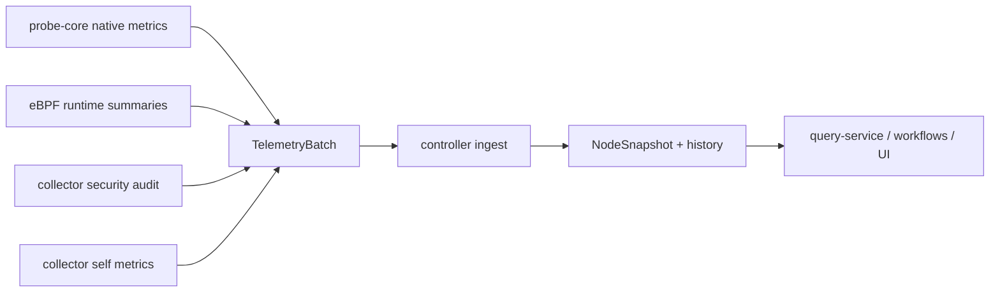

# Metrics and Signals

中文版本：[docs/zh/13-metrics-and-signals.md](../zh/13-metrics-and-signals.md)

This page explains what the project actually collects, how those signals are represented after ingest, and how the controller screens them before they influence retrieval, prompt assembly, or RCA output.

## Why The Signal Model Is Broader Than Basic Host Metrics

CPU, memory, and disk counters alone are not enough for this project. The controller also needs to know:

- whether the collector itself is healthy
- whether the primary probe path is active or degraded
- which process, interface, or device is driving the symptom
- whether the hardware profile changes the meaning of a threshold
- whether the evidence is trustworthy enough to justify LLM or workflow decisions

That is why the code keeps both workload signals and observability-about-observability signals.

Two companion pages go deeper on the next stages:

- [Collector Queue and Compaction](06-collector-queue-and-compaction.md) explains how unchanged data is suppressed, queued, and replayed
- [Control-Plane Analysis](07-control-plane-analysis.md) explains how these signals become trend assessments, weak-signal events, TSDB points, retrieval queries, and recommendations

## Why These Signal Families Exist

The table below is intentionally written for both engineers and non-expert stakeholders.

| Signal family | Why engineers collect it | Why it matters to the business | If sampled too often | If sampled too rarely | If not collected |
| --- | --- | --- | --- | --- | --- |
| CPU, memory, PSI | detect saturation, reclaim, blocked work, and scheduler stress | catches capacity risk before users see a full outage | more collector CPU and `/proc` pressure | slower detection of deterioration | the system mistakes resource exhaustion for generic slowness |
| Disk latency, queue depth, filesystem pressure | separate storage bottlenecks from compute bottlenecks | reduces time spent blaming the wrong tier during latency incidents | more device polling and serialization | queue buildup may be seen too late | storage-backed latency looks like an app-only issue |
| Network drops, retransmits, utilization | distinguish transport issues from app issues | prevents wasted time on application rollbacks when the real issue is congestion or packet loss | higher interface/sysfs polling cost | intermittent transport degradation is easier to miss | timeout-heavy incidents are harder to scope |
| GPU utilization, memory, temperature | explain accelerator contention and feeder starvation | protects expensive GPU capacity and shortens RCA on training/inference slowdowns | extra GPU-runtime probing and copy cost | thermal or memory drift can be caught later than desired | GPU nodes collapse into generic node-health explanations |
| Collector self-metrics and protection state | prove whether telemetry is trustworthy and affordable | shows whether monitoring itself is affecting reliability | low cost, but still should stay bounded | operators may miss that the collector is under pressure | flat telemetry can be misread as healthy workload state |
| Security/runtime behavior | connect suspicious runtime behavior with performance symptoms | improves the credibility of RCA in policy-drift or exposure incidents | too much runtime detail can add noise | subtle runtime/security drift may be noticed late | the system misses non-resource root causes |

## Five Signal Families That Drive Most Answers

The repo emits many metrics, but five signal families carry most of the day-to-day diagnostic value. The table below explains them in plain language and ties them back to the real sampling tiers.

| Signal family | Representative metrics | What it measures in practice | Why the current tier fits | If sampled faster | If sampled slower | If absent |
| --- | --- | --- | --- | --- | --- | --- |
| CPU and memory pressure | `node_cpu_usage_percent`, `node_memory_Used_bytes`, `node_memory_MemTotal_bytes`, `node_pressure_memory_some_avg10` | whether the host is running out of execution time or reclaim headroom | these are first-line “is the node under stress?” signals, so they stay on the fast path | more `/proc` churn and more repeated serialization for limited extra value | slow drift toward saturation is detected later | the controller loses its basic “is this host overloaded?” baseline |
| Disk and IO health | `node_disk_request_latency_p99_seconds`, `node_disk_queue_depth_total`, `node_pressure_io_full_avg10` | whether storage wait, queue buildup, or writeback pressure is building | storage symptoms often explain latency before CPU does, so they stay fast enough for trend analysis | repeated device polling costs more collector CPU and payload bytes | short storage degradations can hide until user latency is already worse | storage bottlenecks are misread as generic application slowness |
| Network quality | `node_tcp_retransmit_ratio`, `node_tcp_retransmits_per_second`, `node_network_receive_errs_total`, `node_softnet_dropped_per_second` | whether the network path is dropping, retrying, or overrunning packets | these metrics are cheap enough to keep in the fast path and they often separate app issues from transport issues | extra interface polling adds some cost but not much new meaning in calm periods | intermittent network degradation becomes easier to miss | timeout-heavy incidents are harder to classify correctly |
| GPU execution context | `node_gpu_utilization_sm_avg_percent`, `node_gpu_memory_used_total_mib`, `node_gpu_temperature_peak_celsius`, `node_gpu_process_total` | whether accelerator nodes are saturated, feeder-starved, thermally limited, or memory-bound | GPU nodes are expensive enough that fast GPU summaries are worth keeping when GPU context exists | extra runtime probing and serialization cost on accelerator hosts | feeder starvation, thermal drift, or memory pressure are noticed later | GPU incidents collapse into generic CPU or memory explanations |
| Telemetry integrity and protection | `collector_probe_core_fresh`, `collector_self_cpu_percent`, `collector_spool_backlog_bytes`, `collector_protection_mode`, `collector_metrics_partial_update` | whether the monitoring path itself is trustworthy, bounded, and intentionally suppressing state | these metrics must stay fresh because the controller uses them to decide whether the evidence bundle is trustworthy at all | the cost is already small; faster sampling gives little extra benefit | stale integrity signals are dangerous because blind spots look like health | the system can confuse missing or stale telemetry with a healthy host |

### Why These Families Matter To Both Engineers And Business Readers

| Family | Technical value | Business value |
| --- | --- | --- |
| CPU and memory pressure | catches saturation, reclaim, and OOM risk | reduces user-facing slowdowns and avoids sudden capacity incidents |
| Disk and IO health | separates storage wait from compute pressure | shortens RCA during latency or throughput regressions |
| Network quality | distinguishes transport issues from service-local issues | prevents unnecessary rollbacks or restarts when the real issue is packet loss or congestion |
| GPU execution context | explains whether expensive accelerator nodes are actually feeding work efficiently | protects GPU spend and shortens diagnosis on training or inference slowdowns |
| Telemetry integrity and protection | shows whether the monitoring path is lying, partial, or intentionally degraded | reduces the risk of making decisions from bad or incomplete evidence |

## Producer Layers



## What Is Actually Collected

The canonical deep reference is [docs/reference/metrics.md](../reference/metrics.md). The table below focuses on the metric families that materially affect reasoning.

| Category | Representative metrics seen in code | Main producer | Why it matters | If it is missing |
| --- | --- | --- | --- | --- |
| Node pressure | `node_cpu_usage_percent`, `node_memory_Used_bytes`, `node_memory_MemTotal_bytes`, `node_network_total_receive_bytes_per_second`, `node_disk_total_read_bytes_per_second` | [`probe_core_convert.go`](../../backend/internal/collector/probe_core_convert.go) | basic host saturation and trend context | RCA starts from weaker evidence |
| Storage pressure | `node_disk_request_latency_p99_seconds`, `node_disk_queue_depth_total`, `node_disk_total_iops_per_second`, `node_disk_utilization_peak_percent` | probe-core conversion plus ingest summaries | distinguishes storage wait from pure CPU saturation | the controller can misclassify a storage bottleneck as generic slowness |
| Network health | `node_tcp_retransmits_per_second`, `node_network_receive_errs_total`, `node_network_transmit_errs_total`, `node_network_utilization_peak_percent` | probe-core conversion | distinguishes congestion, packet loss, and link issues from app-only latency | timeout-heavy incidents are harder to scope |
| GPU state | `node_gpu_utilization_sm_avg_percent`, `node_gpu_memory_used_total_mib`, `node_gpu_process_total`, `node_gpu_pcie_rx_total_mb_s`, `node_gpu_temperature_peak_celsius` | probe-core GPU path plus GPU store merge | separates true GPU saturation from feeder starvation or PCIe issues | GPU incidents collapse into generic node symptoms |
| RCA attribution | `rca_cpu_sched_contention_events_per_second`, `rca_io_latency_seconds_avg`, `rca_net_ebpf_flow_bytes_per_second`, process CPU/RSS/IO samples | probe-core conversion, eBPF summaries, process samples | points to the process or subsystem driving the incident | the answer stays generic |
| Collector health | `collector_probe_source`, `collector_primary_probe_core_healthy`, `collector_self_cpu_percent`, `collector_self_rss_bytes`, `collector_spool_backlog_bytes` | collector runtime | shows whether telemetry itself is healthy and affordable | flat charts can be misread as healthy workload state |
| Protection state | `collector_protection_mode`, `collector_protection_cpu_budget_ratio`, `collector_protection_memory_budget_ratio`, `collector_protection_load_shed` | [`protection.go`](../../backend/internal/collector/protection.go) | explains why monitoring slowed down or shed optional work | operators cannot tell whether data gaps came from intentional host protection |
| Auxiliary collector pacing | `collector_aux_collection_interval_seconds`, `collector_aux_collection_age_seconds`, `collector_aux_collection_cache_hit`, `collector_aux_payload_refreshed`, `collector_aux_payload_suppressed` | [`aux_sampling.go`](../../backend/internal/collector/aux_sampling.go) | shows whether logs, compatibility process scans, and external metrics are being reused, actually refreshed, or intentionally omitted from the batch because the cached view is still valid | operators cannot distinguish “no new data” from “collector is repeatedly rescanning” or “collector intentionally kept the previous process/log view” |
| Process payload suppression | `collector_process_payload_refreshed`, `collector_process_payload_suppressed` | [`process_payload_suppression.go`](../../backend/internal/collector/process_payload_suppression.go) | shows whether a fresh hot-process payload was sent or intentionally omitted because the coarse process fingerprint was still effectively unchanged | top-process attribution can otherwise dominate steady-state payload volume |
| Compatibility fallback pacing | `collector_compat_collection_interval_seconds`, `collector_compat_collection_age_seconds`, `collector_compat_collection_cache_hit`, `collector_compat_collection_anomaly_triggered` | [`probe/cadence.go`](../../backend/internal/collector/probe/cadence.go) | shows whether the legacy Go fallback is reusing cached runtime, hardware, deep, kernel, RCA, or GPU helpers or refreshing them because the fallback path itself saw an anomaly | fallback mode can look randomly expensive if its tiers are not observable |
| Compatibility payload suppression | `collector_compat_payload_refreshed{component="hardware"}`, `collector_compat_payload_suppressed{component="hardware"}` | [`probe/cadence.go`](../../backend/internal/collector/probe/cadence.go) plus [`store.go`](../../backend/internal/controller/ingest/store.go) | shows whether slow fallback hardware metrics were actually refreshed this cycle or intentionally omitted while the controller carried forward the previous hardware view | operators may misread lower payload volume as “hardware telemetry disappeared” |
| Payload reduction state | `collector_metrics_partial_update`, `collector_metrics_suppressed_count` | [`metric_suppression.go`](../../backend/internal/collector/metric_suppression.go) and [`store.go`](../../backend/internal/controller/ingest/store.go) | shows when unchanged low-churn collector/runtime inventory was intentionally suppressed and reconstructed at ingest | operators may mistake "suppressed because unchanged" for "collector lost state" |
| Telemetry integrity | `collector_probe_core_fresh`, `collector_probe_core_active`, `collector_probe_core_last_frame_age_seconds` | collector runtime | tells the controller whether the main probe path is current enough to trust | stale telemetry can be mistaken for live telemetry |
| Security and runtime behavior | `node_security_findings_total`, `node_security_unexpected_listening_ports_count`, `node_ebpf_category_events_total`, `node_ebpf_sensitive_path_events_total` | collector security audit and eBPF summaries | correlates security findings with resource symptoms | security-related causes are underexplained |
| Hardware-aware context | `collector_hardware_cpu_numa_nodes`, `collector_hardware_gpu_devices_total`, `collector_hardware_threshold_disk_latency_seconds` | hardware profile and protection logic | shows which hardware assumptions are shaping thresholds and pacing | threshold interpretation becomes opaque |
| Broad hardware hints | `collector_hardware_warning_total`, `collector_hardware_warning{domain=...,reason=...,signal=...}` | [`hardware_warnings.go`](../../backend/internal/collector/hardware_warnings.go) | surfaces likely CPU throttling, NUMA imbalance, disk degradation, NIC issues, or GPU throttle using already-collected signals | operators and downstream screening lose a cheap hardware-oriented summary layer |

## What One Sampled Record Looks Like

### Raw probe-core sample

Illustrative raw values that match the conversion code:

```text
probe_core_cpu_usage_percent = 92.1
probe_core_memory_total_bytes = 17179869184
probe_core_memory_used_bytes = 15032385536
probe_core_disk_await_ms{device="nvme0n1"} = 38.5
probe_core_disk_queue_depth{device="nvme0n1"} = 11
probe_core_network_tcp_retransmissions_per_sec = 0.8
```

### Converted controller-visible metrics

[`convertProbeCoreBatch`](../../backend/internal/collector/probe_core_convert.go) maps these into aliased metrics used everywhere else. By default, the collector now ships these aliases instead of also duplicating the raw `probe_core_*` host/resource metrics in every batch.

```json
{
  "node_cpu_usage_percent": 92.1,
  "node_memory_MemTotal_bytes": 17179869184,
  "node_memory_Used_bytes": 15032385536,
  "node_disk_avg_request_latency_seconds": 0.0385,
  "node_disk_queue_depth": 11,
  "node_disk_queue_depth_total": 11,
  "node_disk_request_latency_p99_seconds": 0.0385,
  "node_tcp_retransmits_per_second": 0.8
}
```

If you explicitly need the raw duplicates for debugging or downstream compatibility, set `probe_core.emit_raw_aliased_metrics: true`. The default stays `false` to reduce serialization and transmission cost.

### Controller hot-state representation

The same node is then stored in [`NodeSnapshot`](../../backend/internal/controller/ingest/store.go):

```json
{
  "collector_id": "node-a",
  "metrics": {
    "node_cpu_usage_percent": 92.1,
    "node_memory_Used_bytes": 15032385536,
    "node_memory_MemTotal_bytes": 17179869184,
    "node_disk_request_latency_p99_seconds": 0.0385,
    "node_disk_queue_depth_total": 11,
    "node_tcp_retransmits_per_second": 0.8
  },
  "processes": [
    {"pid": 4128, "name": "trainer", "cpu_percent": 71.2, "rss_bytes": 8589934592}
  ],
  "logs": [
    {"fingerprint": "dial tcp timeout", "count": 42, "example": "request to cache service timed out"}
  ]
}
```

Important detail: the controller does not discard most metrics at ingest time. The first major screening happens later, when the query-service builds `PromptInput`.

## Structured Signals Beyond Flat Metrics

Not everything important in this repository is a numeric time series.

| Signal type | Where it lives | Why it exists |
| --- | --- | --- |
| `ProcessSample` | `NodeSnapshot.Processes` | attributes pressure to actual processes |
| `LogFingerprint` | `NodeSnapshot.Logs` | keeps repeated log evidence bounded |
| `StorageDeviceSample` / `FilesystemSample` | `NodeSnapshot.StorageDevices`, `NodeSnapshot.Filesystems` | preserves device-level and mount-level storage context |
| `RuntimeSecurityEvent` | `NodeSnapshot.RuntimeSecurityEvents` | carries recent runtime behavior and security evidence |
| `SecurityFinding` | `NodeSnapshot.SecurityFindings` | turns posture drift into structured evidence |
| `ProcessGraphSnapshot` | `NodeSnapshot.ProcessGraphSnapshot` | preserves parent/child relationships for investigation |

These structures exist because RCA is usually about relationships, not just scalar thresholds.

## Controller-Derived Analysis Objects

Not every important signal in the current repo is emitted by the collector. The control plane now derives three structured evidence layers before final RCA output:

| Object | Main files | What it captures | Why it exists |
| --- | --- | --- | --- |
| `TrendAssessment` | [`backend/internal/controller/agentcore/workflow_eventization.go`](../../backend/internal/controller/agentcore/workflow_eventization.go) | slope, delta, threshold persistence, forecast hints | exposes “getting worse” behavior before one hard breach dominates |
| `InvestigationEvent` | [`backend/internal/controller/agentcore/workflow_eventization.go`](../../backend/internal/controller/agentcore/workflow_eventization.go), [`backend/internal/controller/agentcore/incident_decision.go`](../../backend/internal/controller/agentcore/incident_decision.go) | multivariate weak-signal fusion with probable cause and recommended checks | compresses several modest signals into one operator-facing suspicion |
| `RetrievalDecision` | [`backend/internal/controller/agentcore/workflow_engine.go`](../../backend/internal/controller/agentcore/workflow_engine.go), [`backend/internal/controller/agentcore/agent.go`](../../backend/internal/controller/agentcore/agent.go) | whether retrieval ran, what query was formed, or why it was skipped/suppressed | makes RAG cost and routing auditable |

Illustrative controller-derived evidence:

```json
{
  "trend_assessments": [
    {
      "display": "Disk latency",
      "trend": "rising",
      "delta_percent": 22.4,
      "threshold_breaches": 3
    }
  ],
  "investigation_events": [
    {
      "title": "Disk wait and CPU iowait are rising together",
      "probable_cause": "storage contention is building before a hard outage"
    }
  ],
  "retrieval_decisions": [
    {
      "tool": "runbook_retrieval",
      "query": "disk wait and CPU iowait rising together storage contention",
      "skipped": false
    }
  ]
}
```

## Signal Classes Do Not Share One Sampling Policy

The collector now uses real signal tiers:

| Tier | Examples | Where defined | Default behavior |
| --- | --- | --- | --- |
| Fast path | primary probe-core metrics, eBPF summaries, collector protection state | [`backend/internal/collector/collector.go`](../../backend/internal/collector/collector.go) and [`configs/collector.yaml`](../../configs/collector.yaml) | collected every active collector cycle |
| Medium path | compatibility `/proc` process fallback | [`backend/internal/collector/aux_sampling.go`](../../backend/internal/collector/aux_sampling.go) | `max(collection_interval, probe_core.interval * host_proc_fallback_interval_samples)` |
| Medium path | legacy Go compatibility extended host metrics | [`backend/internal/collector/probe/cadence.go`](../../backend/internal/collector/probe/cadence.go) | `max(2 * collection_interval, 10s)` |
| Slow path | legacy Go compatibility hardware scans (thermal, NIC sysfs, IRQ, RDMA) | [`backend/internal/collector/probe/cadence.go`](../../backend/internal/collector/probe/cadence.go) | `max(6 * collection_interval, 30s)` |
| Slow path | legacy Go compatibility deep scans, kernel summaries, and GPU fallback helpers | [`backend/internal/collector/probe/cadence.go`](../../backend/internal/collector/probe/cadence.go) | `max(3 * collection_interval, 15s)` |
| Slow path | legacy Go compatibility RCA helpers | [`backend/internal/collector/probe/cadence.go`](../../backend/internal/collector/probe/cadence.go) | `max(6 * collection_interval, 30s)` |
| Slow path | log fingerprints | [`backend/internal/collector/aux_sampling.go`](../../backend/internal/collector/aux_sampling.go) | `max(15s, 3 * collection_interval)` |
| Slow path | external metrics command | [`backend/internal/collector/aux_sampling.go`](../../backend/internal/collector/aux_sampling.go) | `max(30s, 6 * collection_interval)` |
| Rare path | hardware discovery, security baseline walk | [`backend/internal/collector/hardware_profile.go`](../../backend/internal/collector/hardware_profile.go), [`backend/internal/collector/security_audit.go`](../../backend/internal/collector/security_audit.go) | hours or minutes, not per collector loop |

When `protectionMode` becomes `incident`, these auxiliary paths can tighten toward the current collector cadence. When it becomes `pressure` or `critical`, optional work is shed first.

### Concrete cadence example across 30 seconds

Using the default source-mode collector config:

- `collection_interval = 5s`
- `probe_core.interval = 1s`
- `host_proc_fallback_interval_samples = 10`

The helper collectors do not all refresh on every `5s` cycle.

| Time | Fast path | Compatibility process fallback | Compatibility hardware tier | Log fingerprints | External metrics |
| --- | --- | --- | --- | --- | --- |
| `t=0s` | refresh | refresh | refresh | refresh | refresh |
| `t=5s` | refresh | cache hit | cache hit | cache hit | cache hit |
| `t=10s` | refresh | refresh | cache hit | cache hit | cache hit |
| `t=15s` | refresh | cache hit | cache hit | refresh | cache hit |
| `t=20s` | refresh | refresh | cache hit | cache hit | cache hit |
| `t=25s` | refresh | cache hit | cache hit | cache hit | cache hit |
| `t=30s` | refresh | refresh | refresh | refresh | refresh |

What you should expect in collector metrics during that window:

- `collector_aux_collection_interval_seconds{component="process_fallback"} = 10`
- `collector_aux_collection_interval_seconds{component="logs"} = 15`
- `collector_aux_collection_interval_seconds{component="external"} = 30`
- `collector_compat_collection_interval_seconds{component="hardware"} = 30`
- `collector_aux_collection_cache_hit{component="logs"} = 1` on non-refresh cycles

This is one of the most important low-overhead changes in `v0.7`: the collector can keep its main telemetry cadence without re-running every expensive helper on every loop.

When `suppress_cached_aux_payloads: true`, the batch also stops re-sending cached process/log payloads on those cache-hit cycles. Instead you will see:

- `collector_aux_payload_suppressed{component="process_fallback"} = 1`
- `collector_aux_payload_suppressed{component="logs"} = 1`
- previous controller process/log state carried forward until `collector_aux_payload_refreshed{component=...} = 1`

When `suppress_cached_compat_hardware_metrics: true`, the same pattern applies to the slow compatibility hardware tier:

- `collector_compat_payload_suppressed{component="hardware"} = 1` on a cache-hit hardware cycle
- `collector_compat_payload_refreshed{component="hardware"} = 1` when the hardware tier really rescans
- previous fallback `node_thermal_*`, `node_network_interface_*`, and `node_rdma_*` state is carried forward by ingest until the real refresh arrives

There is now one more steady-state reduction on top of that:

- `collector_process_payload_suppressed = 1` means the collector recomputed process attribution but did not resend the process list because the coarse process fingerprint stayed within the same CPU/RSS/IO buckets
- `collector_process_payload_refreshed = 1` means the current batch really carries a fresh process payload again

Illustrative process payload pair:

```json
[
  {
    "cycle": "first send",
    "processes": [
      {"pid": 4128, "name": "trainer", "cpu_percent": 71.2, "rss_bytes": 9663676416}
    ],
    "metrics": [
      {"name":"collector_process_payload_refreshed","value":1}
    ]
  },
  {
    "cycle": "near-identical next cycle",
    "processes": [],
    "metrics": [
      {"name":"collector_process_payload_suppressed","value":1}
    ]
  }
]
```

That reduces batch size without throwing away current node-level pressure metrics. The tradeoff is that per-process attribution becomes slightly less granular between forced refreshes.

## Controller-Side Screening Before RAG And LLM

The controller also exports a small set of reasoning-path counters that show whether it is reducing expensive work correctly:

- `agent_llm_bypassed_stale_total`
- `agent_llm_bypassed_empty_total`
- `agent_rag_skipped_context_total`
- `agent_fallback_total`

Illustrative sequence:

```text
query="what is happening here"                         -> agent_rag_skipped_context_total +1
query="why is disk latency growing after rollout"     -> retrieval allowed
same query + same compact evidence 15s later          -> analysis_reused_total +1
same query on stale telemetry                         -> agent_llm_bypassed_stale_total +1
```

These counters matter because they tell you whether the controller is:

- avoiding retrieval when the question is too generic
- avoiding the LLM when evidence is stale or missing
- avoiding repeated RAG/LLM work when the incident state has not materially changed

## What Now Gets Suppressed In Steady State

Not all collector metrics are worth resending every cycle. [`metric_suppression.go`](../../backend/internal/collector/metric_suppression.go) now suppresses unchanged low-churn families between periodic full refreshes.

Representative families:

- `collector_probe_source`
- `collector_runtime_mode`
- `collector_runtime_mode_requested`
- `collector_runtime_mode_degraded`
- `collector_runtime_containerized`
- `collector_runtime_capability_available{capability=...}`
- `collector_runtime_signal_coverage{signal=...}`
- `collector_primary_ebpf_expected`
- `collector_primary_ebpf_healthy`
- `collector_primary_probe_core_expected`
- `collector_primary_probe_core_healthy`
- `collector_compatibility_fallback_active`
- `collector_probe_core_client_available`
- `collector_probe_core_active`
- `collector_probe_core_collector_selection_valid`
- `collector_probe_core_collector_module_requested{module=...}`
- `collector_probe_core_collector_module_active{module=...}`
- hardware inventory/profile/threshold/capability metrics under `collector_hardware_*`

Signals that stay unsuppressed because they are event-like, rapidly changing, or operator-critical:

- `collector_self_cpu_percent`
- `collector_self_rss_bytes`
- `collector_transport_*`
- `collector_probe_core_last_error`
- `collector_primary_ebpf_reason`
- `collector_compatibility_fallback_reason`
- `collector_hardware_*_anomaly_score`
- spool and protection metrics

### Concrete steady-state suppression example

Illustrative calm-period cycle with no source-mode or hardware changes:

```json
{
  "sent_metrics": [
    {"name":"node_cpu_usage_percent","value":24.7},
    {"name":"node_memory_Used_bytes","value":8589934592},
    {"name":"collector_self_cpu_percent","value":1.3},
    {"name":"collector_spool_backlog_bytes","value":0},
    {"name":"collector_metrics_partial_update","value":1},
    {"name":"collector_metrics_suppressed_count","value":21}
  ]
}
```

What was suppressed in that example:

- unchanged runtime mode and capability labels
- unchanged probe source and probe-core module selection
- unchanged hardware inventory/profile/threshold metrics
- cached fallback process lists or log fingerprints when the helper did not really refresh
- near-identical hot-process payloads when the coarse process fingerprint stayed unchanged inside `process_payload_refresh_interval`

### Concrete slow hardware-tier suppression example

Illustrative fallback-mode pair of cycles:

```json
[
  {
    "cycle": "hardware refresh",
    "metrics": [
      {"name":"node_thermal_zone_temp_celsius","value":87.5},
      {"name":"node_network_interface_speed_mbps","value":25000,"labels":{"device":"eth0"}},
      {"name":"collector_compat_payload_refreshed","value":1,"labels":{"component":"hardware"}}
    ]
  },
  {
    "cycle": "hardware cache hit",
    "metrics": [
      {"name":"collector_compat_collection_cache_hit","value":1,"labels":{"component":"hardware"}},
      {"name":"collector_compat_payload_suppressed","value":1,"labels":{"component":"hardware"}}
    ]
  }
]
```

What this means:

- the collector avoided resending the same slow hardware fallback metrics on the second cycle
- the controller still kept the last thermal/interface view
- the next real hardware refresh can update or clear that view explicitly

Why suppress them:

- they change rarely
- they add repeated labels and protobuf entries
- they do not improve diagnosis when the values are identical to the previous batch

What still preserves the information:

- the controller carries forward the previous values in [`StoreMetrics`](../../backend/internal/controller/ingest/store.go)
- a periodic full refresh is forced by `low_churn_metrics_refresh_interval`
- any actual change emits immediately because the value or labels differ

Risk introduced by this reduction:

- if a consumer incorrectly treats `collector_metrics_partial_update = 1` as a data loss condition, it can misread healthy suppression as missing telemetry
- if a consumer assumes an omitted process/log list means “there are no processes/logs” instead of checking `collector_aux_payload_refreshed`, it can misread deliberate cache-hit suppression
- that is why the controller explicitly reconstructs the carried-forward low-churn state

## Broad Hardware Warning Example

The collector now emits a compact hardware warning layer from existing signals instead of adding a new heavy probe.

Illustrative warning set on a stressed node:

```text
collector_hardware_warning_total = 2
collector_hardware_warning{domain="disk",reason="latency",signal="node_disk_request_latency_p99_seconds"} = 0.78
collector_hardware_warning{domain="network",reason="retransmit",signal="node_tcp_retransmit_ratio"} = 0.63
```

What changed:

- the collector already had anomaly scores in [`protection.go`](../../backend/internal/collector/protection.go)
- it now also exports operator-facing warning labels in [`hardware_warnings.go`](../../backend/internal/collector/hardware_warnings.go)

What information is preserved:

- the exact source metric that justified the warning
- the hardware domain being implicated
- a bounded score that the controller or operator can use without parsing the entire raw metric set

## Which Raw `probe_core_*` Metrics Are No Longer Duplicated By Default

The collector still receives raw probe-core values internally, but most aliased host/resource metrics are no longer sent twice.

Examples of raw metrics that are now usually suppressed from outbound batches:

- `probe_core_cpu_usage_percent`
- `probe_core_memory_total_bytes`
- `probe_core_memory_used_bytes`
- `probe_core_disk_await_ms`
- `probe_core_disk_read_bytes_per_sec`
- `probe_core_network_rx_bytes_per_sec`
- `probe_core_network_tcp_retransmissions_per_sec`
- `probe_core_gpu_count`
- `probe_core_process_cpu_percent`

Why these were reduced:

- the controller already reasons primarily over the aliased forms such as `node_cpu_usage_percent`, `node_memory_Used_bytes`, `node_disk_request_latency_p99_seconds`, and `node_tcp_retransmits_per_second`
- sending both names doubles serialization and spool pressure for the same host state

What remains in raw `probe_core_*` by default:

- probe-core internal/source-selection/sampler metrics such as `probe_core_sampling_*`
- fallback/source context like `probe_core_host_collection_source`
- queue/backpressure or internal-health metrics such as `probe_core_backpressure_queue_depth`
- raw metrics that still have no aliased controller contract, for example `probe_core_cgroup_cpu_throttled_ratio`

### Compatibility fallback anomaly-trigger example

The legacy Go fallback path now uses its own basic metrics to decide when the deeper tiers should refresh early.

Illustrative fallback metrics on one cycle:

```json
{
  "node_cpu_usage_percent": 91.4,
  "node_cpu_iowait_percent": 12.8,
  "node_memory_MemTotal_bytes": 17179869184,
  "node_memory_Used_bytes": 15139799040,
  "node_disk_request_latency_p99_seconds": 0.041,
  "node_tcp_retransmits_per_second": 0.7
}
```

Because those values cross the real thresholds in [`compatibilityAnomalyTriggered`](../../backend/internal/collector/probe/cadence.go), the fallback collector refreshes its deeper cached tiers immediately and exports:

```text
collector_compat_collection_anomaly_triggered{component="deep"} = 1
collector_compat_collection_cache_hit{component="deep"} = 0
collector_compat_collection_interval_seconds{component="deep"} = 15
```

That behavior exists so fallback mode remains cheap during calm periods without waiting too long to deepen collection during a real incident.

## How Screening Works Before Model Input

The system does not send raw state straight into the prompt. The main screening logic is in [`buildPromptInput`](../../backend/internal/controller/agentcore/agent.go) and [`BuildSchema`](../../backend/internal/controller/agentcore/prompts.go).

### What gets kept

- the full `Metrics` map remains in controller memory and in `QueryResponse.TelemetryContext`
- the full `Trends` map for selected history-derived directions is retained
- top 5 processes by CPU are kept
- top 5 log fingerprints by count are kept
- deterministic findings and anomalies are added
- RAG snippets are added only if the request actually takes the LLM path and retrieval succeeds

### What gets condensed

The `Evidence` block in the prompt schema is intentionally smaller than the full node snapshot:

- `Summary`: top 6 metrics by absolute value from `summarizeMetrics`
- `TopMetrics`: top 8 metrics by absolute value from `topMetrics`
- `GPU`: only metrics with the prefix `node_gpu_`
- `Network`: only metrics with the prefix `node_network_`
- `Disk`: only metrics with the prefix `node_disk_`
- `Memory`: only metrics with the prefix `node_memory_`

This exists to reduce prompt noise while still keeping the full metric map available when necessary.

### What now gets bounded before the model sees it

[`buildPromptSchema`](../../backend/internal/controller/agentcore/prompts.go) compacts the prompt-facing `metrics` block to 24 entries. Priority is not purely by magnitude. The current code favors:

- core CPU/memory/disk/network saturation signals
- pressure and GPU signals
- collector integrity signals such as spool backlog or transport errors

This is a token-control measure. It does not change what the controller stores, only what the model receives.

### Concrete prompt-compaction example

[`compactMetricsForPrompt`](../../backend/internal/controller/agentcore/prompts.go) keeps at most `24` metrics in the LLM-facing `metrics` map. It prefers:

1. a small set of hard-coded high-priority saturation and integrity metrics
2. pressure and GPU metrics
3. other `node_cpu_`, `node_memory_`, `node_disk_`, and `node_network_` metrics
4. then `collector_*`

Illustrative input metrics:

```json
{
  "node_cpu_usage_percent": 92.1,
  "node_cpu_iowait_percent": 12.4,
  "node_memory_Used_bytes": 15032385536,
  "node_memory_MemAvailable_bytes": 2147483648,
  "node_disk_request_latency_p99_seconds": 0.0385,
  "node_disk_queue_depth_total": 11,
  "node_pressure_memory_some_avg10": 73,
  "node_pressure_io_some_avg10": 41,
  "node_gpu_utilization_sm_avg_percent": 20,
  "node_gpu_memory_used_percent": 89,
  "node_tcp_retransmit_ratio": 0.012,
  "collector_spool_backlog_bytes": 4194304,
  "collector_transport_retries_total": 3,
  "collector_hardware_cpu_threads": 128,
  "collector_hardware_network_max_speed_mbps": 100000,
  "node_network_interface_speed_bits_per_second": 100000000000,
  "node_filesystem_files_free": 983040,
  "node_filesystem_files": 1048576
}
```

Likely prompt-facing effect:

- kept first:
  - `node_cpu_usage_percent`
  - `node_cpu_iowait_percent`
  - `node_memory_Used_bytes`
  - `node_memory_MemAvailable_bytes`
  - `node_disk_request_latency_p99_seconds`
  - `node_disk_queue_depth_total`
  - `node_pressure_memory_some_avg10`
  - `node_pressure_io_some_avg10`
  - `node_gpu_utilization_sm_avg_percent`
  - `node_gpu_memory_used_percent`
  - `collector_spool_backlog_bytes`
  - `collector_transport_retries_total`
- more likely to drop first when the map exceeds `24` entries:
  - `node_tcp_retransmit_ratio`
  - `collector_hardware_cpu_threads`
  - `collector_hardware_network_max_speed_mbps`
  - `node_network_interface_speed_bits_per_second`
  - `node_filesystem_files_free`
  - `node_filesystem_files`

Important nuance:

- the API response still includes the full telemetry context through `QueryResponse.TelemetryContext`
- only the LLM-facing prompt schema gets compacted

Another important nuance: `node_tcp_retransmit_ratio` is a real diagnostic metric in the repo, but it is not one of the current hard-coded prompt-priority keys in [`metricPromptPriority`](../../backend/internal/controller/agentcore/prompts.go). On crowded prompts it can therefore lose to CPU, memory, disk, pressure, GPU, or collector-integrity metrics even though it remains available in controller state.

### What gets ranked

#### Process ranking

[`summarizeProcesses`](../../backend/internal/controller/agentcore/agent.go) sorts all processes by `CpuPercent` descending and keeps the highest `limit`.

Illustrative input:

```json
[
  {"pid":4128,"name":"trainer","cpu_percent":71.2},
  {"pid":778,"name":"python-loader","cpu_percent":18.1},
  {"pid":99,"name":"journald","cpu_percent":2.7}
]
```

Prompt-facing output with `limit=2`:

```json
[
  {"pid":4128,"name":"trainer","cpu_percent":71.2},
  {"pid":778,"name":"python-loader","cpu_percent":18.1}
]
```

#### Log ranking

[`summarizeLogs`](../../backend/internal/controller/agentcore/agent.go) sorts log fingerprints by `Count` descending and keeps the hottest repeated patterns.

Illustrative input:

```json
[
  {"fingerprint":"dial tcp timeout","count":42},
  {"fingerprint":"retry budget exceeded","count":17},
  {"fingerprint":"info heartbeat ok","count":3}
]
```

Prompt-facing output with `limit=2`:

```json
[
  {"fingerprint":"dial tcp timeout","count":42},
  {"fingerprint":"retry budget exceeded","count":17}
]
```

### What gets promoted into findings

The project uses two main deterministic finding layers before any model call.

#### `systemFindings`

[`systemFindings`](../../backend/internal/controller/agentcore/agent.go) emits direct threshold findings such as:

- `CPU utilization is above 85%`
- `Memory utilization is above 85%`
- `Disk I/O pressure is elevated`

#### `operationalFindings`

[`operationalFindings`](../../backend/internal/controller/agentcore/agent.go) uses combinations of metrics, trends, and logs. Important current rules include:

- storage bottleneck:
  - `node_cpu_iowait_percent >= 10` or iowait trend rising
  - and disk latency `>= 40 ms` or queue depth `>= 8` or disk trend rising
- GPU feeder starvation:
  - GPU processes exist
  - GPU utilization is below `35%`
  - CPU, disk, or retransmit trend is rising
- memory leak or retry amplification:
  - memory usage `>= 80%`
  - memory trend rising
  - logs contain `timeout`, `error`, or `oom`
- network congestion or packet loss:
  - retransmit ratio `>= 0.02`
  - or retransmits per second `>= 0.5`
  - or retransmit trend rising
  - or logs mention `timeout` / `refused`

Concrete example:

```json
{
  "metrics": {
    "node_cpu_iowait_percent": 12.4,
    "node_disk_request_latency_p99_seconds": 0.0385,
    "node_disk_queue_depth_total": 11,
    "node_memory_Used_bytes": 15032385536,
    "node_memory_MemTotal_bytes": 17179869184,
    "node_tcp_retransmits_per_second": 0.8
  },
  "trends": {
    "node_memory_Used_bytes": "rising",
    "node_disk_request_latency_p99_seconds": "rising"
  },
  "logs": [
    {"fingerprint":"dial tcp timeout","count":42}
  ]
}
```

Deterministic promotion result:

```text
CPU utilization is above 85%
Memory utilization is above 85%
CPU wait and disk latency are rising together, which points to a storage bottleneck rather than pure CPU saturation
Memory growth is being reinforced by error or timeout activity, which looks more like leak or retry amplification than a one-off spike
Network retransmits or timeout bursts are active, which suggests congestion or packet loss instead of application-only latency
```

Why this screening exists:

- it converts dozens or hundreds of raw signals into a compact list of operator-relevant statements
- it gives the LLM a starting point grounded in deterministic logic
- it reduces token waste on obvious facts

If the screening is too weak:

- the prompt becomes a noisy metric dump
- retrieval query formation becomes noisy
- the model has to reconstruct obvious relationships itself

If the screening is too aggressive:

- real weak signals are lost
- the answer becomes overconfident or incomplete

## When Retrieval And The LLM Are Skipped Entirely

The current query-service does not always attempt retrieval or model inference.

The key branch is in [`Query`](../../backend/internal/controller/agentcore/agent.go):

1. build `PromptInput`
2. assess stale or insufficient telemetry
3. if telemetry is insufficient and `SkipLLMOnNoTelemetry` is enabled:
   - return `fallbackPayload`
   - do not attach RAG
4. else if telemetry is stale and `SkipLLMOnStaleTelemetry` is enabled:
   - return `fallbackPayload`
   - do not attach RAG
5. else:
   - call `attachRAGContext`
   - then call the LLM

This means retrieval is not “always on.” It is deliberately downstream of telemetry trust.

### Concrete bypass example

Illustrative query-time state:

```json
{
  "telemetry_age_seconds": 182,
  "telemetry_quality": {
    "state": "stale",
    "safe_to_act": false,
    "blind_spots": ["collector replay backlog is still draining"]
  },
  "metrics_count": 0,
  "processes_count": 0,
  "logs_count": 0
}
```

Practical result:

- `QueryResponse.UsedFallback = true`
- `QueryResponse.FallbackReason = "agent telemetry stale"` or `"agent telemetry unavailable"`
- `RetrievedDocs` stays empty because `attachRAGContext` is never called
- recommendations are biased toward refreshing telemetry before remediation

This behavior exists to reduce wasted LLM cost and false confidence on bad evidence, not because retrieval is broken.

## Telemetry Quality As A First-Class Signal

The controller does not assume “missing means zero.” The trust model is explicit.

[`assessPromptTelemetryQuality`](../../backend/internal/controller/agentcore/agent.go) checks:

- freshness age from collection timestamp
- ingest delay
- missing critical signal groups
- blind spots such as no logs, no processes, spool backlog, degraded runtime mode, or inactive probe-core

The five current critical signal groups are:

| Group label in code | Metric names currently checked |
| --- | --- |
| CPU pressure | `node_cpu_usage_percent` |
| Memory pressure | `node_memory_Used_bytes`, `node_memory_used_bytes`, `node_memory_MemTotal_bytes`, `node_memory_total_bytes` |
| Network throughput | `node_network_total_receive_bytes_per_second`, `node_network_receive_bytes_per_second`, `node_network_total_transmit_bytes_per_second`, `node_network_transmit_bytes_per_second` |
| Storage activity | `node_disk_total_read_bytes_per_second`, `node_disk_read_bytes_per_second`, `node_disk_total_written_bytes_per_second`, `node_disk_written_bytes_per_second`, `node_disk_request_latency_p99_seconds` |
| Telemetry integrity | `collector_probe_core_fresh`, `collector_probe_core_active` |

Possible states:

- `fresh`
- `delayed`
- `degraded`
- `stale`
- `unavailable`

Example degraded quality block:

```json
{
  "state": "degraded",
  "coverage_percent": 80,
  "confidence": 0.7,
  "missing_signals": ["network throughput"],
  "blind_spots": [
    "log evidence is missing",
    "collector replay backlog is still draining"
  ],
  "safe_to_act": false
}
```

This signal matters because the model should not give strong remediation advice when the evidence is incomplete or stale.

## How Signals Reach The Agent And UI

The main surfaces are:

1. [`NodeSnapshot`](../../backend/internal/controller/ingest/store.go) and history samples from the ingest store
2. telemetry quality from [`backend/internal/controller/telemetry_quality.go`](../../backend/internal/controller/telemetry_quality.go) and query-service quality checks in [`agent.go`](../../backend/internal/controller/agentcore/agent.go)
3. prompt and workflow context assembly in:
   - [`backend/internal/controller/agentcore/agent.go`](../../backend/internal/controller/agentcore/agent.go)
   - [`backend/internal/controller/agentcore/prompts.go`](../../backend/internal/controller/agentcore/prompts.go)
   - [`backend/internal/controller/agentcore/llm_analysis.go`](../../backend/internal/controller/agentcore/llm_analysis.go)

The UI only consumes controller APIs. It does not read collector or store internals directly.

## What Happens When Signals Are Missing

The project handles missing data explicitly:

- missing critical groups reduce coverage
- blind spots lower confidence
- stale telemetry can bypass the LLM entirely when `SkipLLMOnStaleTelemetry` is enabled
- missing telemetry can trigger deterministic fallback when `SkipLLMOnNoTelemetry` is enabled

Operational effect:

- operators can distinguish “host is quiet” from “pipeline is degraded”
- prompts can include limitations instead of silently guessing
- actions can be suppressed when `safe_to_act` is false

## Limits And Tradeoffs

The signal model is intentionally bounded:

- not every raw event is persisted forever
- eBPF behavior is summarized into categories
- logs are fingerprinted rather than copied wholesale into every prompt
- prompt evidence is smaller than the full node snapshot

That keeps the system affordable and traceable, but it also means deep forensics may still require drilling into external logs or host-local evidence outside the controller.

## See Also

- [Data flow](05-data-flow.md)
- [Dataset and RAG](11-dataset-and-rag.md)
- [Prompts and customization](12-prompts-and-customization.md)
- [Hardware considerations](14-hardware-considerations.md)
- [Core files](10-core-files.md)
- [Metrics reference](../reference/metrics.md)
