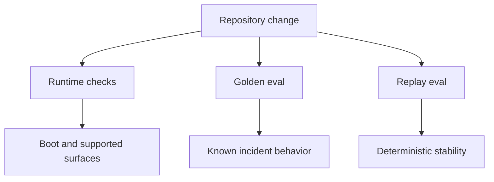

# Testing and Evaluation

中文版本：[docs/zh/19-testing-and-evaluation.md](../zh/19-testing-and-evaluation.md)

The repository now has three different validation layers on purpose:

1. runtime and integration checks
2. golden behavior evaluation
3. replay stability checks

Each layer answers a different question.

## Validation Stack



## Why These Layers Are Separate

If you only test boot and health endpoints, you can still ship a broken incident agent:

- retrieval can drift
- RCA ranking can regress
- workflow governance can stop being recorded correctly
- verification coverage can silently fall

The repo therefore distinguishes:

| Layer | Main question |
| --- | --- |
| runtime checks | does the system start and expose its supported surfaces? |
| golden eval | does the system still behave correctly on known incidents and retrieval cases? |
| replay eval | does the same deterministic path stay stable across repeated runs? |

## Main Code Paths

| Layer | Main files |
| --- | --- |
| runtime tests | [`../../tests/`](../../tests/), [`23-testing.md`](23-testing.md) |
| golden eval | [`../../backend/internal/controller/eval/`](../../backend/internal/controller/eval/) |
| replay eval | [`../../backend/internal/controller/evaluation/`](../../backend/internal/controller/evaluation/) |

## Two-Agent RCA Coverage

The RCA runtime now has separate coverage for the new split between `AnalysisAgent` and `ValidationActionAgent`.

The controller tests exercise:

- `AnalysisHandoff` generation from live RCA state
- target construction for hypotheses, change correlation, recommendations, and contradiction search
- target-aware tool routing for change, resource, network, GPU, and security cases
- bounded validation-loop behavior under iteration and tool-call budgets
- contradiction detection when the validation side finds healthy evidence instead of supporting evidence
- recommendation validation against runbooks and prior action outcomes
- durable persistence of analysis handoff, validation loop records, and final validation report
- final RCA report and evidence package fields for the two-agent runtime

The golden workflow suite now scores those same artifacts at the report level too. It no longer stops at generic durability. It checks that each RCA case persists:

- a non-empty `AnalysisHandoff` from `AnalysisAgent`
- a non-empty `ValidationActionReport`
- bounded `ValidationLoopRecord` entries in the durable run

## What The Golden Evaluation Measures

The golden evaluation is not a mock pipeline. It reuses real code:

- real retrieval service
- real workflow engine
- real query-service path
- real incident seeding into controller stores

Main datasets:

- [`../../eval_data/retrieval_cases.json`](../../eval_data/retrieval_cases.json)
- [`../../eval_data/incident_cases.json`](../../eval_data/incident_cases.json)
- [`../../eval_data/anomaly_cases.json`](../../eval_data/anomaly_cases.json)
- [`../../eval_data/knowledge/`](../../eval_data/knowledge/)

## Anomaly Evaluation Suite

The anomaly suite exists because "did the controller run?" is not the same question as "did it classify the incident correctly?"

Each anomaly case defines four things on purpose:

- input context: current metrics, logs, peers, and historical windows
- expected label: `expected_recurring_burst`, `suspicious_deviation`, `correlated_anomaly`, or `confirmed_anomaly`
- expected reason: short substrings that must appear in the explanation
- expected handling: whether the signal should be suppressed, downgraded, or escalated

The runner does not call a fake classifier. It seeds a real controller store, runs the normal `EvaluateJointRisk(...)` path, and scores the actual emitted `BehavioralAssessments` and `JointRiskSignal` output.

### Fast-scope case inventory

The fast scope now carries 20 anomaly cases:

| Category | Cases |
| --- | --- |
| CPU | build burst, traffic surge without harm, busy loop, deployment CPU spike |
| Memory | startup warmup, gradual leak, OOM kill pressure, node eviction pressure |
| GPU | expected training burst, novel memory saturation, pinned memory with low util, XID-like fault, latency/error degradation |
| Multi-signal | clean recurring batch CPU, recurring batch CPU with harm, recurring backup/upload network burst, recurring deployment log burst, deployment or startup service-latency warmup with sparse history, recurring deployment service-latency warmup, moderate CPU plus latency and errors |

That set is intentionally practical rather than exhaustive. It covers the cases that most often cause either pager noise or under-escalation in real fleets.

### How the cases are evaluated

For each case, the runner does the same sequence:

1. seed historical windows when recurrence should exist
2. seed the current window with metrics, logs, and optional peer replicas
3. run the real workflow engine through `EvaluateJointRisk(...)`
4. compare the emitted classification, disposition, trigger state, and explanation against the case contract

The case file is the contract. If the classifier starts suppressing too early, over-escalating healthy load bursts, or missing hard fault signals, the suite fails immediately.

### Fast-scope metrics

Measured on March 24, 2026 with:

```bash
go run ./cmd/evalctl -scope fast -format json
```

Before the first industrial anomaly pass, the fast suite was already better than threshold-only logic, but it still had real misses:

| Metric | Before |
| --- | --- |
| cases passed | 12 / 18 |
| accuracy | 0.83 |
| precision | 0.80 |
| recall | 0.80 |
| F1 | 0.80 |
| false positive rate | 0.06 |
| false negative rate | 0.20 |
| disposition accuracy | 0.83 |

After the current changes, including the deployment-latency warmup cases:

| Metric | After |
| --- | --- |
| cases passed | 20 / 20 |
| accuracy | 1.00 |
| precision | 1.00 |
| recall | 1.00 |
| F1 | 1.00 |
| false positive rate | 0.00 |
| false negative rate | 0.00 |
| disposition accuracy | 1.00 |

The main fixes behind that jump were not architectural rewrites. They were small corrections in the live decision path:

- rollout warning bursts no longer count as generic `error_log_burst` evidence
- `service_log_burst_count` and related log-burst metrics are retained in trend history, so recurring deployment logs can actually match history
- deployment and startup context now applies to `service_latency`, so rollout warmup spikes explain themselves as downgraded deviations instead of generic sparse-history noise
- weak storage incidents no longer spawn a fake memory-leak hypothesis that pushes storage out of the RCA top three

### Optional LLM explanation judge

The class metrics above are deterministic. They tell you whether the classifier chose the right bucket and handling.

Sometimes that is not enough. A result can land in the right class but still explain itself badly. The repository now has an opt-in LLM judge for that narrower question.

Run it from the Go module root:

```bash
cd backend
SRE_AGENT_LLM_API_KEY=... \
SRE_AGENT_LLM_PROVIDER=gemini \
go run ./cmd/evalctl -scope fast -judge-llm -judge-limit 5 -format json
```

What it does:

- reuses the normal anomaly evaluation output
- sends only the predicted label, disposition, explanation, and contract to the configured provider
- asks the model to grade whether the explanation is consistent with the contract
- records pass/fail plus a bounded score in `anomaly.explanation_judge`

Why it is opt-in:

- it is costful and provider-dependent
- it is not deterministic enough for every CI path
- it is meant to catch explanation drift, not replace the deterministic anomaly contract

Live sample on March 24, 2026 using Gemini with `-judge-limit 5`:

| Metric | Result |
| --- | --- |
| judged cases | 5 |
| passed | 5 |
| agreement rate | 1.00 |
| average score | 1.00 |

Representative judged output:

```json
{
  "id": "deployment_cpu_spike_after_rollout",
  "passed": true,
  "score": 1,
  "rationale": "The predicted label, disposition, and trigger status match the contract, and the explanation logically supports the downgraded suspicious_deviation classification by citing a deployment as context."
}
```

Use this judge when you want an extra check on explanation quality during prompt or provider changes. Do not treat it as the primary accuracy signal.

### Live API-backed evaluation path

The repository now has a separate live test path for that judge:

```bash
cd backend
SRE_AGENT_LLM_API_KEY=... \
SRE_AGENT_LLM_PROVIDER=gemini \
SRE_AGENT_LLM_MODEL=gemini-flash-latest \
go test -tags liveeval ./internal/controller/eval -run TestGoldenEvaluationFastLiveJudge -v -count=1
```

Why this path is separate:

- normal unit and golden tests must stay runnable without any external key
- the live path is for explanation quality checks against a real provider
- the key stays external and is read only from `SRE_AGENT_LLM_API_KEY`

The live test now behaves in three distinct ways:

- no key: skip with a clear message
- key present and provider available: run the fast suite plus live explanation judge
- key present but provider quota exhausted: skip the live judge rather than misreport the classifier as wrong

That last point matters. Provider quota is an external availability issue, not an anomaly-classification regression.

### Before and after the batching change

The first live full-suite design sent one provider call per anomaly case. On the same key, that meant the judge exhausted Gemini quota during the run.

Before batching:

| Metric | Value |
| --- | --- |
| retrieval success | 3 / 3 = 100% |
| anomaly classification success | 20 / 20 = 100% |
| workflow success | 3 / 3 = 100% |
| live explanation judge success | 4 / 20 = 20% |
| overall success including judge | 65.22% |

What changed:

- the judge now sends multiple anomaly cases in one request
- `evalctl` has a `-judge-batch-size` flag
- the live integration test is tagged separately with `liveeval`
- quota exhaustion in the live test becomes an explicit skip condition instead of a false agent failure

After batching, the deterministic metrics are unchanged:

| Metric | Value |
| --- | --- |
| anomaly accuracy | 1.00 |
| precision | 1.00 |
| recall | 1.00 |
| F1 | 1.00 |
| false positive rate | 0.00 |
| false negative rate | 0.00 |

The remaining weak point in live evaluation is provider quota, not model accuracy. With the current key state on March 24, 2026, the tagged live test skips once Gemini starts returning `RESOURCE_EXHAUSTED`.

### Fast-scope per-class confusion matrix

| Expected \\ Predicted | expected_recurring_burst | suspicious_deviation | correlated_anomaly | confirmed_anomaly |
| --- | ---: | ---: | ---: | ---: |
| expected_recurring_burst | 7 | 0 | 0 | 0 |
| suspicious_deviation | 0 | 3 | 0 | 0 |
| correlated_anomaly | 0 | 0 | 3 | 0 |
| confirmed_anomaly | 0 | 0 | 0 | 7 |

Per-class support in the same run:

| Class | Support | Precision | Recall | F1 | FPR | FNR |
| --- | ---: | ---: | ---: | ---: | ---: | ---: |
| expected_recurring_burst | 7 | 1.00 | 1.00 | 1.00 | 0.00 | 0.00 |
| suspicious_deviation | 3 | 1.00 | 1.00 | 1.00 | 0.00 | 0.00 |
| correlated_anomaly | 3 | 1.00 | 1.00 | 1.00 | 0.00 | 0.00 |
| confirmed_anomaly | 7 | 1.00 | 1.00 | 1.00 | 0.00 | 0.00 |

### Representative cases

#### Deployment CPU spike after rollout

Scenario:

- `cart-api` shows a short CPU burst
- rollout logs are present
- there is deploy context, but no real downstream harm

Expected output:

```json
{
  "classification": "suspicious_deviation",
  "reason": "cpu_pressure lines up with recent deploy or startup activity on cart-api; without corroborating harm the detector keeps it visible but downgraded instead of confirming a regression."
}
```

Why this is correct:

- rollout and warmup work still matter operationally
- they should stay visible
- they should not be escalated like a real regression without error, latency, or fault evidence

#### Deployment latency warmup with sparse history

Scenario:

- `recommendation-api` sees a short p95 latency spike during rollout
- there is clear deployment context
- the same shape exists only once in TSDB history, so recurrence is still weak

Expected output:

```json
{
  "classification": "suspicious_deviation",
  "reason": "service_latency lines up with recent deploy or startup activity on recommendation-api; without corroborating harm the detector keeps it visible but downgraded instead of confirming a regression."
}
```

Why this is correct:

- sparse history should not trigger full suppression
- deployment context should still change the explanation and severity
- operators need to see that this looks like warmup, not unexplained latency damage

#### Deployment latency warmup that repeats cleanly

Scenario:

- `search-api` shows the same rollout p95 spike repeatedly
- the same shape already exists several times around the same hour
- there are no errors or other harm signals

Expected output:

```json
{
  "classification": "expected_recurring_burst",
  "reason": "service_latency matches 4 similar spikes from TSDB history for search-api around 13:00 UTC and has no corroborating error, runtime, or latency regression now."
}
```

#### Deployment log burst that repeats cleanly

Scenario:

- `deploy-agent` emits a short recurring warn burst during rollout
- the pattern has already happened repeatedly
- the logs are noisy, but not fault-like

Expected output:

```json
{
  "classification": "expected_recurring_burst",
  "reason": "log_burst matches 4 similar spikes from TSDB history for deploy-agent around 11:00 UTC and has no corroborating error, runtime, or latency regression now."
}
```

#### Gradual memory leak

Scenario:

- memory keeps rising in the long window
- the problem is shape and slope, not a one-minute burst

Expected output:

```json
{
  "classification": "confirmed_anomaly",
  "reason": "memory_leak_rate shows sustained memory leak growth for api-service and remains materially outside the long-window baseline."
}
```

#### GPU fault with otherwise familiar utilization

Scenario:

- the utilization pattern looks familiar
- but XID-like or driver-fault evidence appears

Expected output:

```json
{
  "classification": "confirmed_anomaly",
  "reason": "gpu_utilization matches prior utilization on trainer-gpu, but current GPU fault evidence makes it a confirmed anomaly."
}
```

### Remaining weak points

There are no failing fast-scope anomaly cases at the moment, but that does not mean the problem is solved in full.

The current suite is still weaker on:

- trace-specific seasonality beyond the exposed latency metrics
- long-window peer seasonality, not just same-snapshot peer comparison
- semantically ambiguous warning bursts where logs are noisy but not clearly healthy or clearly broken
- identity churn across short-lived workloads with unstable service labels

Those are real limits, and they are better documented than hidden.

## What v0.8 Adds To Evaluation

The current repo now measures more than retrieval and RCA correctness.

It also checks:

- governance coverage
- verification coverage
- durable run coverage
- evidence-package generation
- incident-memory write-back
- replay stability across repeated runs

This matters because an operational agent can regress even when its top-level RCA text still looks plausible.

## Commands

Fast local validation:

```bash
make test
make test-agent-workflow
make test-agent-replay
make eval-fast
```

Fast anomaly eval plus explanation judge:

```bash
cd backend
SRE_AGENT_LLM_API_KEY=... \
SRE_AGENT_LLM_PROVIDER=gemini \
go run ./cmd/evalctl -scope fast -judge-llm -judge-limit 5 -judge-batch-size 5
```

Tagged live provider test:

```bash
cd backend
SRE_AGENT_LLM_API_KEY=... \
SRE_AGENT_LLM_PROVIDER=gemini \
go test -tags liveeval ./internal/controller/eval -run TestGoldenEvaluationFastLiveJudge -v -count=1
```

Broader regression:

```bash
make eval-regression
```

## How To Read Failures

### Runtime failure

Typical meaning:

- the supported deployment path no longer starts
- an API contract changed unexpectedly
- the UI or controller glue regressed

### Golden evaluation failure

Typical meaning:

- retrieval ranking changed
- RCA hypothesis ordering regressed
- recommendation usefulness changed
- governance or verification artifacts are missing

### Replay stability failure

Typical meaning:

- the same deterministic path no longer produces stable metrics or workflow coverage
- new nondeterminism entered the controller path

## What The Replay Layer Actually Does

The replay package in [`../../backend/internal/controller/evaluation/`](../../backend/internal/controller/evaluation/) runs the golden evaluation twice and compares drift in:

- workflow metrics
- retrieval metrics
- stability score

This is intentionally simple.

It does not attempt to simulate every production timing condition. It checks whether the repository’s own deterministic evaluation path is staying stable across repeated runs.

## Why This Matters For Researchers And Reviewers

This repository is not only claiming that retrieval, RCA, and workflow control exist. It also includes a concrete mechanism for regression-testing them.

That matters because:

- it ties the architectural claims to repeatable data
- it makes documentation claims more falsifiable
- it gives contributors a way to reason about behavior change beyond "the endpoint still returns JSON"

## Boundaries

The current evaluation design still has limits:

- the corpus is small and deterministic by design
- it is strong on regression detection, not on open-world benchmarking
- replay stability is local to repository behavior, not a full distributed-systems replay environment

Those limits are acceptable because the goal is repository-grounded regression control.
